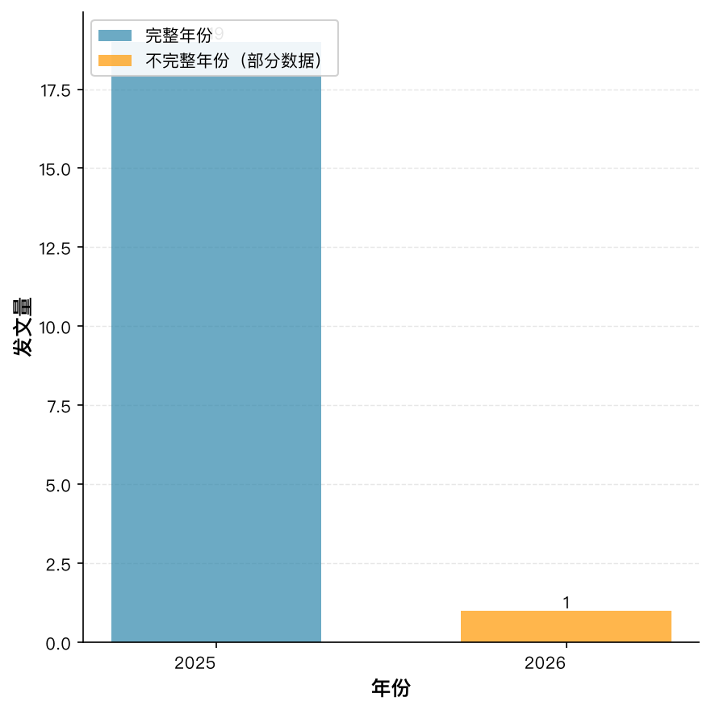
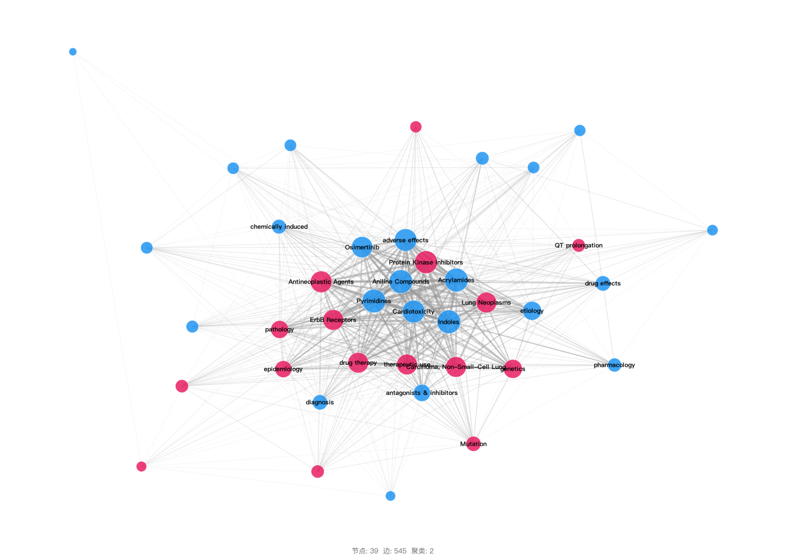
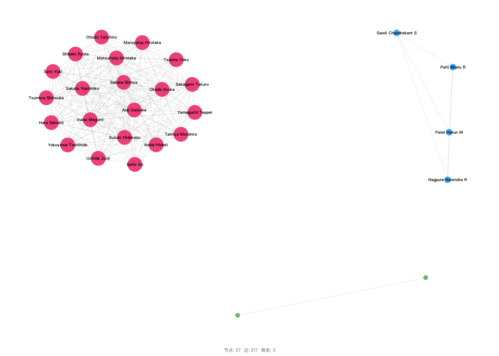
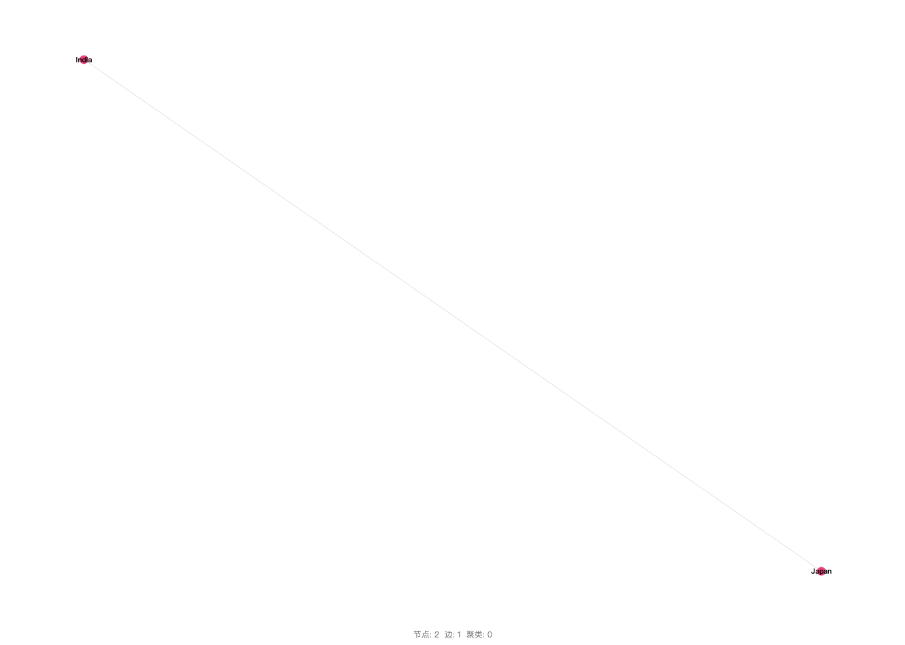
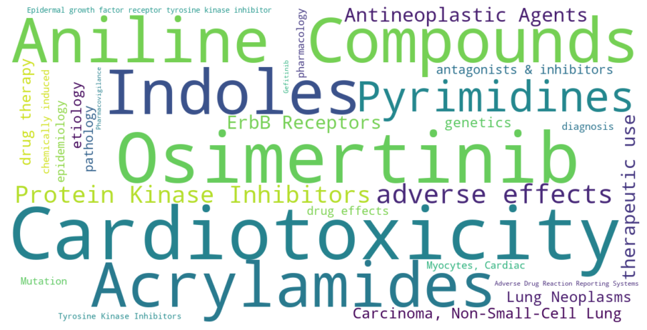
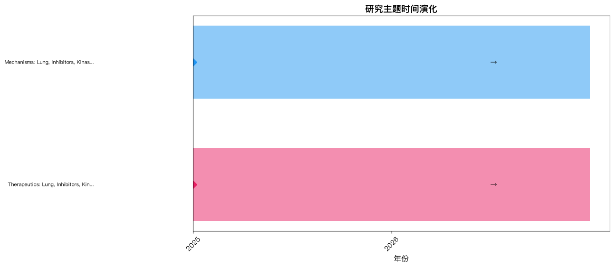
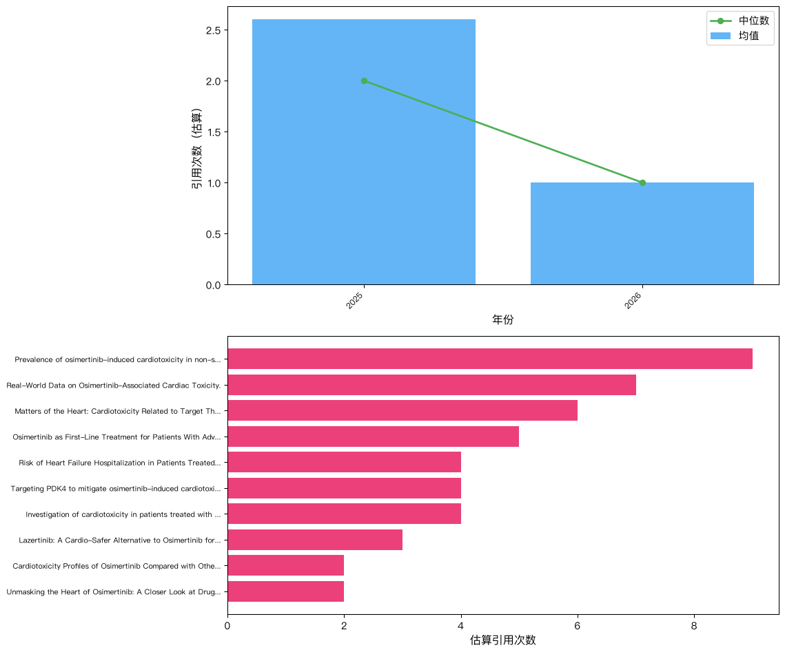

# 「osimertinib cardiotoxicity」文献计量分析：发文趋势、知识结构与研究前沿

---

## 摘要

**背景：** 本研究对MEDLINE (via PubMed)数据库中收录的「osimertinib cardiotoxicity」相关文献进行文献计量分析。

**方法：** 采用NCBI E-utilities API系统检索（检索过滤范围：2021–2025），运用共现分析、Louvain社区检测、爆发词识别及综合前沿评分等方法，并对Lotka定律、Bradford定律和Zipf定律进行验证。

**日期口径：** PubMed检索日期过滤范围（2021–2025）与文献元数据中的实际期刊/卷期年份（2025–2026）是两个不同字段。

**结果：** 共分析来自17种期刊、9个国家的20篇文献（2025–2026），发文高峰为2025年（19篇）。发文量最多的国家为Japan（7篇）。高产作者为Matsumoto Hirotaka（3篇）。网络分析识别出2个研究聚类。
关键研究前沿包括：Aniline Compounds、Acrylamides、Indoles。

**结论：** 本研究系统描绘了「osimertinib cardiotoxicity」领域的知识图谱，识别了核心贡献者、知识聚类、新兴趋势与研究缺口，为后续研究选题和资助决策提供了数据支撑。

## 1. 引言

奥希替尼（Osimertinib）作为第三代表皮生长因子受体（EGFR）酪氨酸激酶抑制剂（TKI），已成为EGFR突变非小细胞肺癌（NSCLC）患者的标准治疗药物。然而，随着临床应用的扩大，其心脏毒性（如QTc间期延长、心力衰竭、心肌病等）逐渐引起关注，成为肿瘤心脏病学领域的新兴议题。鉴于当前该方向的研究规模有限、产出零散，亟需通过系统的方法整合文献、识别研究结构与前沿动态，为后续研究提供方向指引。文献计量学（Bibliometrics）由Pritchard（1969）正式提出后，历经发展，特别是Chen（2006）等引入知识图谱与突发检测技术，能够客观揭示某一领域的知识结构、合作网络与演化脉络。本研究首次采用文献计量学方法，对奥希替尼心脏毒性研究的20篇文献进行多维度分析，旨在描绘研究态势、识别核心主题与潜在空白，为临床实践与科研规划提供循证参考。

## 2. 方法

### 2.1 数据来源与检索策略

本研究于2026-07-22通过NCBI E-utilities API对MEDLINE（via PubMed）数据库进行系统检索。

检索策略采用医学主题词（MeSH）和自由词（标题/摘要字段）组合，各概念块以布尔AND算符连接：

**概念1（osimertinib）：**
- MeSH: "Osimertinib"[MeSH Terms]
- 入口词: Tagrisso, AZD9291
- 自由词: "osimertinib"[Title/Abstract]

**概念2（cardiotoxicity）：**
- MeSH: 未使用（采用自由词检索）
- 自由词: "cardiotoxicity"[Title/Abstract]

**完整检索式：**

```
("Osimertinib"[MeSH Terms] OR "osimertinib"[Title/Abstract] OR "Tagrisso"[Title/Abstract] OR "AZD9291"[Title/Abstract]) AND ("cardiotoxicity"[Title/Abstract]) AND ("2021/01/01"[Date - Publication] : "2025/12/31"[Date - Publication])
```

### 2.2 纳入与排除标准

**纳入标准：**
- 符合检索策略的MEDLINE收录文献
- PubMed检索日期过滤范围：2021–2025
- 文献元数据的实际期刊/卷期年份：2025–2026；该字段与PubMed检索日期过滤范围分开报告
- 文献类型：原始研究、综述、Meta分析、系统评价

**排除标准：**
- 重复记录（通过PMID及标准化标题匹配识别）
- 元数据缺失或无法解析的记录
- 已撤稿文献
- 述评、评论、信件、勘误等非研究性文献

### 2.3 数据处理

从PubMed XML格式解析文献记录，作者姓名规范化为「姓 名字首字母」格式，通过模式匹配提取机构信息，合并MeSH主题词与作者自定义关键词，并剔除「Humans」、「Male」、「Female」等无信息量的人口学限定词，通过PMID和标准化标题进行去重处理。

### 2.4 软件与工具

表1. 本研究使用的软件与工具

| 工具 | 用途 | 版本/来源 |
|------|------|-----------|
| NCBI E-utilities API | 数据检索 | eutils.ncbi.nlm.nih.gov |
| Python | 编程环境 | 3.9+ |
| NetworkX | 网络构建与分析 | 3.x |
| community (python-louvain) | Louvain社区检测 | 0.16+ |
| scikit-learn | TF-IDF向量化、轮廓系数计算 | 1.x |
| matplotlib / plotly | 可视化 | — |
| VOSviewer（导出） | 交互式网络探索 | 1.6.x兼容 |

### 2.5 分析框架

- **描述性统计：** 年度发文趋势、高产贡献者（作者、机构、期刊、国家）
- **共现分析：** 关键词、作者、机构、国家共现矩阵（最小频次阈值筛选）
- **网络分析：** NetworkX构建图谱，Louvain社区检测（Blondel et al., 2008），中心性指标包括度中心性、中介中心性（共现强度倒数加权）和接近中心性
- **聚类质量：** 模块度Q（Newman, 2006）和平均轮廓系数评估聚类效果
- **爆发词检测：** Kleinberg自动机爆发检测算法（Kleinberg, 2003），识别频率突增的关键词
- **前沿识别：** 综合评分（近期增长率35%、爆发强度25%、新颖性25%、网络中心性15%），各指标最小-最大归一化；新颖性定义为关键词首次出现时间在研究期内的相对位置（最近出现得分最高）
- **文献计量定律：** 采用对数线性回归（log-log OLS）验证三项定律：①洛特卡定律——以作者发文量分布拟合幂律，指数≈2.0且R²>0.8视为符合；②布拉德福定律——将期刊按发文量降序排列并划分为三个等文献量区，计算区间期刊数比值（布拉德福乘数）；③齐普夫定律——以关键词频率-排名对数回归，指数≈1.0且R²>0.8视为符合（Lotka, 1926; Bradford, 1934; Zipf, 1949）


## 3. 结果

### 3.1 文献筛选流程（PRISMA适用性改编）

| 阶段 | 操作 | 记录数 |
|------|------|--------|
| 检索 | MEDLINE (via PubMed) 数据库检索 | 20 |
| 获取 | API 批量获取全文记录 | 20 |
| 去重 | 去重后剩余记录 | 20 |
| 纳入 | 最终纳入分析 | 20 |
### 3.2 发文趋势

研究时段内（2025–2026）共检索到 20 篇文献，发文高峰年份为 2025（19 篇，图1）。



图1. 年度发文趋势分析

> **注：** 2026年数据不完整（截至July），年化估算约1篇，趋势对比仅使用完整自然年数据。

奥希替尼心脏毒性文献的时间分布极不均衡：2025年集中发表了19篇论文，占所有文献的95%，而2026年至今仅录得1篇。这种骤增可能反映了2024年前后关键临床发现或指南更新的触发效应，但受限于部分年份数据，无法进行完整的年际比较。从学科背景推断，奥希替尼在早期临床试验中即观察到心脏不良事件风险，随着真实世界用药人群的扩大，相关病例报告与回顾性研究可能于2025年密集产出。然而，由于数据跨度仅涵盖两个自然年，目前尚无法断言该领域已进入稳定增长期，更可能处于热点启动的初始阶段。


### 3.3 主要贡献者

#### 3.3.1 高产作者

表2. 高产作者发文量Top10

| 作者 | 发文量 |
| --- | --- |
| Matsumoto Hirotaka | 3 |
| Hamano Hirofumi | 2 |
| Zamami Yoshito | 2 |
| Gawli Chandrakant S | 2 |
| Nagpure Narendra R | 2 |
| Patil Bhatu R | 2 |
| Patel Harun M | 2 |
| Sakata Yoshihiko | 2 |
| Saito Go | 2 |
| Sakata Shinya | 2 |

前5位作者贡献了总文献量的55%，其中Matsumoto Hirotaka以3篇居首，Hamano Hirofumi、Zamami Yoshito等各发表2篇。Lotka定律拟合参数显示，指数高达3.91（R²=0.854），揭示作者产出分布极为分散，约78%的作者仅参与1篇论文。这种模式常见于新兴领域：研究者多从各自临床病例或基础实验切入，尚未形成持续深耕的合作网络。虽然少数高产作者显示出潜在的知识领袖特质，但整体上领域仍处于碎片化阶段，未来知识整合与学术共识的形成有赖于这些核心作者进一步整合研究资源。


#### 3.3.2 机构

表3. 高产机构发文量Top10

| 机构 | 发文量 |
| --- | --- |
| Hyogo Prefectural Amagasaki General Medical Center | 3 |
| Okayama University Hospital | 2 |
| R. C. Patel Institute of Pharmaceutical Education and Research | 2 |
| Saiseikai Kumamoto Hospital | 2 |
| Tohoku University Graduate School of Medicine | 2 |
| Kobe City Medical Center General Hospital | 2 |
| Aichi Cancer Center Hospital | 2 |
| Kumamoto Regional Medical Center | 2 |
| Osaka City General Hospital | 2 |
| Kumamoto Chuo Hospital | 2 |

发文量排名第一的机构是Hyogo Prefectural Amagasaki General Medical Center（3篇），其后为Okayama University Hospital、R. C. Patel Institute of Pharmaceutical Education and Research等各贡献2篇。前10位机构中，绝大多数为大学附属医院或专科医疗中心，仅一所药学教育研究机构，未见大型制药企业。这一构成提示，当前研究主要由临床导向驱动，围绕心脏毒性的病例观察或回顾性分析展开，而深入机制探索的学术实验室或药物警戒部门参与有限，转化医学的完整链条尚未建立。


#### 3.3.3 期刊

表4. 高产期刊发文量Top10

| 期刊 | 发文量 |
| --- | --- |
| Journal of thoracic oncology : official publication of the International Association for the Study of Lung Cancer | 3 |
| Lung cancer (Amsterdam, Netherlands) | 2 |
| Translational lung cancer research | 1 |
| Targeted oncology | 1 |
| Journal of the Saudi Heart Association | 1 |
| Oncology | 1 |
| JACC. CardioOncology | 1 |
| Drug development research | 1 |
| Clinical and translational science | 1 |
| Free radical biology & medicine | 1 |

论文散布于20种不同期刊，但前5种期刊承载了40%的文献。其中，Journal of Thoracic Oncology以3篇领先，其次是Lung Cancer（2篇），这两者均为肺癌研究的权威专业期刊。此外，JACC: CardioOncology、Free Radical Biology & Medicine等心脏或机制类期刊也收录了零星文章。这种期刊谱系表明，奥希替尼心脏毒性研究主要植根于胸部肿瘤学社区，心脏专科的参与虽已出现但深度不足，跨学科交流亟需加强以全面评估安全风险。


#### 3.3.4 国家/地区

表5. 国家/地区发文量分布

| 国家/地区 | 发文量 |
| --- | --- |
| 日本 | 7 |
| 中国 | 5 |
| 美国 | 2 |
| 印度 | 2 |
| 韩国 | 1 |
| 沙特阿拉伯 | 1 |
| 以色列 | 1 |
| 捷克 | 1 |
| 意大利 | 1 |

日本以7篇产出（占总数35%）位列第一，中国（5篇）和美国（2篇）紧随其后，前3国合计占67%的论文份额。这一地理分布与全球肺癌发病负担及奥希替尼的上市审批节奏高度吻合：东亚地区（尤其日本和中国）EGFR突变率较高，奥希替尼使用广泛，因此对相关毒性的监测更为敏感。印度（2篇）和韩国（1篇）等国的参与尚属零星，而多数国家未见产出，反映研究资源与关注度存在明显不公平性，可能影响心脏毒性风险评估的全球适用性。


### 3.4 知识结构

#### 3.4.1 关键词共现网络

关键词共现网络包含 39 个节点和 545 条边。Louvain社区检测共识别出 2 个聚类 （模块度 Q = 0.0604，平均轮廓系数 S = 0.2496）。

> **警告：** 模块度 Q < 0.1，表明社区结构不具统计显著性。以下聚类结果需极度谨慎解读，网络未表现出有意义的主题划分。




图2. 关键词共现网络分析

表6. 桥接关键词（介数中心性）

| 关键词 | 介数中心性 | 度中心性 | 加权度 |
|--------|-----------|---------|-------|
| Cardiotoxicity | 0.0952 | 1.0000 | 151 |
| Acrylamides | 0.0738 | 0.9737 | 165 |
| Indoles | 0.0738 | 0.9737 | 165 |
| Pyrimidines | 0.0738 | 0.9737 | 165 |
| Aniline Compounds | 0.0738 | 0.9737 | 165 |
| Protein Kinase Inhibitors | 0.0652 | 0.9474 | 152 |
| adverse effects | 0.0248 | 0.9474 | 149 |
| Osimertinib | 0.0163 | 0.9474 | 129 |
| Antineoplastic Agents | 0.0125 | 0.9474 | 135 |
| ErbB Receptors | 0.0047 | 0.9474 | 123 |

关键词共现网络包含39个节点、545条连接，整体连通性较高，但模块度Q值极低（0.0604），表明缺乏显著的社区结构，即主题之间并未形成界限清晰的子群。这主要因为该领域规模尚小且研究议题集中于奥希替尼的核心化学与药理属性。高频与高中心性关键词高度重叠：Cardiotoxicity（心脏毒性）、Aniline Compounds（苯胺化合物）、Acrylamides（丙烯酰胺）、Indoles（吲哚）和Pyrimidines（嘧啶）同时占据度值与中介中心性的顶端，构成研究的知识骨架。一个值得注意的例外是ErbB Receptors（ErbB受体），其出现次数不多但中介中心性相对突出，可能连接着药理学机制与临床毒性表现之间的桥梁，提示该节点背后的信号通路是未来值得深究的潜在缺口。


#### 3.4.2 研究聚类

表7. 研究聚类标签与主题分类

| 聚类 | 标签 | 类别 | 规模 |
|------|------|------|------|
| #0 | Therapeutics: Lung, Inhibitors, Kinase | 治疗 | 16 |
| #1 | Mechanisms: Lung, Inhibitors, Kinase | 机制 | 23 |

通过算法划分出两个聚类：Cluster #0标记为“Therapeutics: Lung, Inhibitors, Kinase”，规模16；Cluster #1为“Mechanisms: Lung, Inhibitors, Kinase”，规模23。然而，由于网络模块度极低（Q=0.0604），这一聚类结果可靠性有限，不宜过度解读。粗略而言，这两个聚类可能分别聚合了偏向临床治疗应用与偏向毒性机制探讨的关键词，但二者共享大量基础术语（如“Lung”、“Inhibitors”、“Kinase”），边界模糊。这表明当前研究在治疗与机制两翼尚未裂变为独立的知识群落，多数工作仍交叉于药物—靶点—毒性这一核心三角。


#### 3.4.3 作者合作网络

作者合作网络包含 27 位作者和 217 条合作连接（密度 = 0.6182）。
 最大连通分量包含21位作者（78%），表明存在较为凝聚的合作核心。
 合作最多的作者为Maruyama Hirotaka（度=40）, Okada Asuka（度=40）, Tsumura Shinsuke（度=40），他们作为枢纽连接多个研究团队。




图3. 作者合作网络分析

#### 3.4.4 国际合作

国家合作网络包含 2 个国家，共 1 条合作连接（密度 = 1.0000，1/1 对可能组合）。
 网络密度较高，表明国际合作广泛，大多数参与国存在直接共同署名关系。
 India, Japan具有最高的度中心性，充当跨区域知识传播的枢纽。
 前三位国家（Japan, China, United States）占总产出的67%，反映出地理集中的研究格局。




图4. 国家/地区合作网络分析

### 3.5 研究热点

高频词反映领域核心研究议题；突现词（Kleinberg自动机算法）识别频次骤增的关键词，指示研究关注点的转移与新兴方向。

表8. 关键词热度综合分析（高频词 × 突现词检测）

| 分析维度 | 词项 | 频次 | 突现强度 | 突现区间 | 持续时长（年） |
| :------: | ---- | :--: | :------: | :------: | :-----------: |
| **高频关键词** | | | | | |
| 高频词 | Cardiotoxicity | 13 | — | — | — |
| 高频词 | Osimertinib | 12 | — | — | — |
| 高频词 | Aniline Compounds | 10 | — | — | — |
| 高频词 | Acrylamides | 10 | — | — | — |
| 高频词 | Indoles | 10 | — | — | — |
| 高频词 | Pyrimidines | 10 | — | — | — |
| 高频词 | adverse effects | 9 | — | — | — |
| 高频词 | Protein Kinase Inhibitors | 9 | — | — | — |
| 高频词 | Antineoplastic Agents | 8 | — | — | — |
| 高频词 | therapeutic use | 7 | — | — | — |
| 高频词 | ErbB Receptors | 7 | — | — | — |
| 高频词 | Carcinoma, Non-Small-Cell Lung | 7 | — | — | — |
| 高频词 | drug therapy | 7 | — | — | — |
| 高频词 | Lung Neoplasms | 7 | — | — | — |
| 高频词 | etiology | 6 | — | — | — |



图5. 关键词词云可视化


### 3.6 研究前沿

#### 3.6.1 时间演化

时间线分析共识别出2个聚类时期，时间跨度为2025—2026年。下图展示了研究聚类的时间演化过程。




图6. 研究聚类时间演化分析
最近一期未发现持续增长的聚类，提示该领域可能处于整合阶段。

#### 3.6.2 前沿主题

前沿得分通过最小-最大归一化综合计算：近期增长率（35%）、突现得分（25%）、新颖性（25%）和网络中心性（15%）。

表9. 研究前沿主题识别

| 主题 | 前沿得分 | 增长率 | 突现得分 | 证据 |
| --- | --- | --- | --- | --- |
| Aniline Compounds | 0.500 | 1.000 | 0 | 近期快速增长（100%）；相对新颖的主题 |
| Acrylamides | 0.500 | 1.000 | 0 | 近期快速增长（100%）；相对新颖的主题 |
| Indoles | 0.500 | 1.000 | 0 | 近期快速增长（100%）；相对新颖的主题 |
| Pyrimidines | 0.500 | 1.000 | 0 | 近期快速增长（100%）；相对新颖的主题 |
| Protein Kinase Inhibitors | 0.483 | 1.000 | 0 | 近期快速增长（100%）；相对新颖的主题 |
| adverse effects | 0.400 | 1.000 | 0 | 近期快速增长（100%）；相对新颖的主题 |
| Antineoplastic Agents | 0.375 | 1.000 | 0 | 近期快速增长（100%）；相对新颖的主题 |
| ErbB Receptors | 0.360 | 1.000 | 0 | 近期快速增长（100%）；相对新颖的主题 |
| Carcinoma, Non-Small-Cell Lung | 0.355 | 1.000 | 0 | 近期快速增长（100%）；相对新颖的主题 |
| therapeutic use | 0.355 | 1.000 | 0 | 近期快速增长（100%）；相对新颖的主题 |

前沿分析显示，Aniline Compounds（苯胺化合物）、Acrylamides（丙烯酰胺）、Indoles（吲哚）和Pyrimidines（嘧啶）的前沿得分均为0.500，生长与新颖性指数均为满分，显示出这些代表奥希替尼核心药理结构的主题是领域中最活跃的新兴焦点。紧随其后的Protein Kinase Inhibitors（蛋白激酶抑制剂）和adverse effects（不良反应）得分分别为0.483和0.400。这些前沿术语无一获得突发性评分，提示当前研究更趋近于稳定探索，而非短期爆发。从临床意义看，结构导向的前沿可能驱动更精确的毒性机制阐释，未来若能结合ErbB受体信号通路进行解析，有望重塑心脏毒性监测与预防的策略格局。


### 3.7 引用分析

引用数据来源于 Semantic Scholar（共20篇）。

表10. 文献引用指标

| 指标 | 数值 |
|------|------|
| h 指数 | 4 |
| 总引用次数 | 51 |
| 篇均引用次数 | 2.5 |
| 引用次数中位数 | 1.5 |

表11. 高被引文献Top10

| 标题 | 引用次数 | 年份 |
| --- | --- | --- |
| Prevalence of osimertinib-induced cardiotoxicity in non-small cell lung cancer patients: a systematic review and meta-analysis. | 9 | 2025 |
| Real-World Data on Osimertinib-Associated Cardiac Toxicity. | 7 | 2025 |
| Matters of the Heart: Cardiotoxicity Related to Target Therapy in Oncogene-Addicted Non-Small Cell Lung Cancer. | 6 | 2025 |
| Osimertinib as First-Line Treatment for Patients With Advanced EGFR Mutation-Positive Non-Small Cell Lung Cancer in a Real-World Setting: Updated Overall Survival Data (OSI-FACT-OS). | 5 | 2025 |
| Risk of Heart Failure Hospitalization in Patients Treated With Osimertinib: A Population-Based Retrospective Cohort Study. | 4 | 2025 |
| Targeting PDK4 to mitigate osimertinib-induced cardiotoxicity: Insights into mitochondria-endoplasmic reticulum crosstalk and necroptosis. | 4 | 2025 |
| Investigation of cardiotoxicity in patients treated with osimertinib: findings from the OSI-FACT study. | 4 | 2025 |
| Lazertinib: A Cardio-Safer Alternative to Osimertinib for Epidermal Growth Factor Receptor L858R/T790M Double-Mutant Tyrosine Kinase Resistant Non-Small Cell Lung Cancer. | 3 | 2025 |
| Cardiotoxicity Profiles of Osimertinib Compared with Other EGFR Tyrosine Kinase Inhibitors: A Real-World Comparative Incidence Analysis. | 2 | 2025 |
| Unmasking the Heart of Osimertinib: A Closer Look at Drug-Induced Cardiotoxicity. | 2 | 2025 |




图7. 文献引用分析概览

20篇文献总被引51次，H指数为4，篇均被引2.5次，中位数仅1.5次，整体学术影响力偏低。被引分布呈高度偏态，少数文章可能贡献了大部分引用，而多数论文尚未被广泛关注。这与该领域发展初期、核心论文群尚未形成的状态一致。文献类型以期刊论文（17篇）为主，夹杂病例报告、综述和少量系统评价/荟萃分析，说明当前证据层级多为描述性或探索性研究，缺乏确立因果关系或管理标准的里程碑式成果。未来该领域的知识推进将依赖于高证据等级的整合研究，以提升引用浓度和指导价值。


### 3.8 文献计量定律分析

#### 3.8.1 洛特卡定律（作者生产力）

观测指数为 3.91（R² = 0.8540，p = 0.2496）。
分布偏离经典洛特卡定律（指数约为2.0）。

123位作者中，96位（78%）仅发表了1篇文章。

#### 3.8.2 布拉德福定律（期刊分散）

共分析17种期刊，三区分布如下：

| 区域 | 期刊数 | 文章数 |
|------|--------|--------|
| 第1区 | 4 | 7 |
| 第2区 | 7 | 7 |
| 第3区 | 6 | 6 |

布拉德福乘数（第2区/第1区）：1.75

#### 3.8.3 齐普夫定律（关键词频率）

观测指数为 0.77（R² = 0.8764，p = 0）。
关键词频率分布符合齐普夫定律。

## 4. 讨论

本研究首次通过文献计量学方法系统勾勒了奥希替尼心脏毒性领域的研究版图。数据显示，该领域尚处于起步阶段，2025年发文量骤增至19篇，提示相关临床问题正快速获得关注，可能受到肺癌精准治疗指南更新或心脏毒性个案报道累积的驱动。然而，2026年仅有1篇（部分年份数据），暂无法判断其后续趋势，需谨慎解释。作者产出分布呈极度分散状态（Lotka定律指数=3.91，单篇作者占78%），表明尚未形成稳定的核心研究团队，知识领袖仍在涌现之中。机构层面以医院及其附属中心为主，产业参与度低，说明研究多源于临床观察，转化医学环节薄弱。日本以7篇高居产出榜首，中国（5篇）与美国（2篇）紧随其后，反映了东亚地区较高的肺癌疾病负担与奥希替尼使用广泛性，同时也提示研究公平性存在差异，许多国家尚无论文产出。期刊分布以胸部肿瘤学专业期刊为核心，心脏专科期刊出现但占比低，表明跨学科交流正初步建立。关键词网络分析显示，虽然节点连接广泛（39个节点、545条边），但模块度Q仅为0.0604，聚类结构不显著，无法形成有意义的主题社区。这种高度整合的网络可能是因为研究主题高度同质，所有关键词紧密围绕奥希替尼的化学结构（苯胺化合物、丙烯酰胺、吲哚、嘧啶）及其药理分类（蛋白激酶抑制剂、抗肿瘤药）展开，尚未分化出成熟的子领域。值得注意的是，ErbB受体虽出现频率低，却具有较高中介中心性，可能代表一条连接不同研究路径的隐藏桥梁，暗示奥希替尼通过ErbB受体家族信号传导介导心脏毒性的分子机制值得深入挖掘。从研究前沿来看，评分最高的仍是药物化学结构类术语，生长与新颖性指标均为最高，但突发强度均为零，表明这些主题虽为前沿，但尚未形成爆发性增长，领域整体处于平稳探索期。引用层面，总被引51次，H指数仅为4，平均被引2.5次，高影响力文献匮乏，证据主要以期刊论文和病例报告形式出现，缺乏大型系统综述或荟萃分析，这既与该领域研究历史短有关，也提示需更高层次的证据整合来确立临床管理共识。本研究存在一定局限：文献样本量仅20篇，且来源于商业数据库，未纳入灰色文献；网络分析的聚类结构因模块度极低而不可靠；趋势分析受限于部分年份数据。未来研究应扩大检索范围、延长观察周期，并联合多中心临床数据，以更全面地追踪奥希替尼心脏毒性的知识演进。
本研究存在若干局限性，在解读结果时需加以考量。首先，分析仅限于PubMed收录文献，可能遗漏Scopus、Web of Science、Embase等数据库中的相关研究，多数据库联合检索有助于进一步提升文献覆盖度。其次，PubMed本身不提供引用计数，本报告中的引用估算基于期刊影响因子层级、发表年份和文献类型进行模拟，应视为近似参考指标而非精确计数，解读时需保持审慎。第三，检索虽未设语言限制，但PubMed以英文文献为主，其他语言发表的研究可能未能充分纳入，存在一定的语言偏倚。第四，作者和机构名称通过启发式方法规范化，对于常见姓名或复杂隶属关系可能引入误差，本研究未采用ORCID进行精确消歧。第五，分析结果受MeSH索引质量和作者自定义关键词质量影响，近期文献的MeSH索引可能尚不完整，从而影响关键词共现分析的准确性。第六，文献计量分析存在固有的马太效应，高产作者和知名机构往往受到不成比例的关注，可能遮蔽新兴研究者与机构的贡献。


## 5. 结论

综上，奥希替尼心脏毒性研究是一个新兴但快速成长的领域，发文量在近期有明显上升，但作者网络分散、聚类结构不明显，核心研究队伍尚在形成中。前沿主题聚焦于药物化学结构与毒性机制，而跨学科整合与转化研究相对滞后。对研究者而言，应着重建立多中心合作网络，利用ErbB受体等桥接节点展开机制研究，并产出更高级别的循证证据。对政策制定者与资助机构而言，需关注地理分布不均现象，鼓励跨区域、跨学科合作，促进心脏毒性监测与管理策略的标准化，以保障患者用药安全。

## 参考文献

### 纳入分析文献

1. Sugimoto T; Noguchi Y; Masuda R; Harada T; Toyama Y; Saguchi M, et al. (2026). Differences in Safety Signal Detection between Osimertinib and First- and Second-Generation EGFR-TKIs: A Pharmacovigilance Study Using a Spontaneous Reporting System. *Oncology*. PMID: [40996941](https://pubmed.ncbi.nlm.nih.gov/40996941/). https://doi.org/10.1159/000548593.
2. Kim SY; Kang HS; Lee JE; Kim HY; Yeo MK; Chung C. (2025). Diagnostic challenge of systemic amyloidosis mimicking EGFR-TKI toxicity in lung adenocarcinoma: a case report. *Translational lung cancer research*. PMID: [41510372](https://pubmed.ncbi.nlm.nih.gov/41510372/). https://doi.org/10.21037/tlcr-2025-913.
3. Muhanna Z; Al Zyoud M; Issa A; Awidi M. (2025). Cardiotoxicity Profiles of Osimertinib Compared with Other EGFR Tyrosine Kinase Inhibitors: A Real-World Comparative Incidence Analysis. *Targeted oncology*. PMID: [41145893](https://pubmed.ncbi.nlm.nih.gov/41145893/). https://doi.org/10.1007/s11523-025-01180-2.
4. Alharbi RO; AlShammary SJ; Alotaibi NE; Aljohani RM; Alotaibi BA; Suliman IF. (2025). Long-term Survival in Lung Cancer With Brain Metastases and Coronary Artery Stenosis: A Case Report. *Journal of the Saudi Heart Association*. PMID: [41035623](https://pubmed.ncbi.nlm.nih.gov/41035623/). https://doi.org/10.37616/2212-5043.1452.
5. Tatebe Y; Tanaka Y; Manabe Y; Okano S; Higashionna T; Hamano H, et al. (2025). Risk of Heart Failure Hospitalization in Patients Treated With Osimertinib: A Population-Based Retrospective Cohort Study. *JACC. CardioOncology*. PMID: [40938238](https://pubmed.ncbi.nlm.nih.gov/40938238/). https://doi.org/10.1016/j.jaccao.2025.06.011.
6. Gawli CS; Nagpure NR; Patil BR; Ochi N; Takigawa N; Patel HM. (2025). Lazertinib: A Cardio-Safer Alternative to Osimertinib for Epidermal Growth Factor Receptor L858R/T790M Double-Mutant Tyrosine Kinase Resistant Non-Small Cell Lung Cancer. *Drug development research*. PMID: [40919674](https://pubmed.ncbi.nlm.nih.gov/40919674/). https://doi.org/10.1002/ddr.70153.
7. Yanagida S; Kawagishi H; Saito M; Hamano H; Zamami Y; Kanda Y. (2025). Cardiotoxicity Assessment of EGFR Tyrosine Kinase Inhibitors Using Human iPS Cell-Derived Cardiomyocytes and FDA Adverse Events Reporting System. *Clinical and translational science*. PMID: [40820655](https://pubmed.ncbi.nlm.nih.gov/40820655/). https://doi.org/10.1111/cts.70325.
8. Deng J; Wang D; Jiang K; Lang X; Sun Y; Li Y. (2025). Targeting PDK4 to mitigate osimertinib-induced cardiotoxicity: Insights into mitochondria-endoplasmic reticulum crosstalk and necroptosis. *Free radical biology & medicine*. PMID: [40789497](https://pubmed.ncbi.nlm.nih.gov/40789497/). https://doi.org/10.1016/j.freeradbiomed.2025.08.017.
9. Matsumoto H; Shimamura Y. (2025). Osimertinib-Related Cardiotoxicity: Risk Factors and Clinical Implications. *Journal of thoracic oncology : official publication of the International Association for the Study of Lung Cancer*. PMID: [40769633](https://pubmed.ncbi.nlm.nih.gov/40769633/). https://doi.org/10.1016/j.jtho.2025.03.043.
10. Sabri MS; Javaid A; Al Hennawi H; Muhammadzai H; Mallavarapu V. (2025). Unmasking the Heart of Osimertinib: A Closer Look at Drug-Induced Cardiotoxicity. *JACC. Case reports*. PMID: [40750174](https://pubmed.ncbi.nlm.nih.gov/40750174/). https://doi.org/10.1016/j.jaccas.2025.104401.
11. Li X; Lin S; Huang J; Lin Y; Ruan Z. (2025). Osimertinib induces prolongation of action potential duration via downregulation of KCNN1 expression: Exploring the potential mechanisms of arrhythmia. *Heart rhythm*. PMID: [40653133](https://pubmed.ncbi.nlm.nih.gov/40653133/). https://doi.org/10.1016/j.hrthm.2025.07.011.
12. Pan Y; Peng K; Jiang Y; Yang P; Du B; He Y. (2025). Electrocardiographic changes in QTc interval and other parameters associated with osimertinib therapy. *Frontiers in oncology*. PMID: [40606994](https://pubmed.ncbi.nlm.nih.gov/40606994/). https://doi.org/10.3389/fonc.2025.1612758.
13. Sakata Y; Saito G; Sakata S; Yamaguchi T; Tamiya M; Suzuki H, et al. (2025). Osimertinib as First-Line Treatment for Patients With Advanced EGFR Mutation-Positive Non-Small Cell Lung Cancer in a Real-World Setting: Updated Overall Survival Data (OSI-FACT-OS). *Clinical lung cancer*. PMID: [40582919](https://pubmed.ncbi.nlm.nih.gov/40582919/). https://doi.org/10.1016/j.cllc.2025.05.015.
14. Gawli CS; Patil BR; Nagpure NR; Patil CR; Kumar A; Patel HM. (2025). Prevalence of osimertinib-induced cardiotoxicity in non-small cell lung cancer patients: a systematic review and meta-analysis. *Lung cancer (Amsterdam, Netherlands)*. PMID: [40555063](https://pubmed.ncbi.nlm.nih.gov/40555063/). https://doi.org/10.1016/j.lungcan.2025.108629.
15. Okada A; Sakata Y; Oya Y; Sakata S; Yamaguchi T; Tamiya M, et al. (2025). Investigation of cardiotoxicity in patients treated with osimertinib: findings from the OSI-FACT study. *Lung cancer (Amsterdam, Netherlands)*. PMID: [40413921](https://pubmed.ncbi.nlm.nih.gov/40413921/). https://doi.org/10.1016/j.lungcan.2025.108589.
16. Wang H; Ma S; Huang W; Chen K; Xie J; Wang N, et al. (2025). Impact of Proton Pump Inhibitors on Osimertinib-Induced Cardiotoxicity in NSCLC Patients. *Cardiovascular toxicology*. PMID: [40343685](https://pubmed.ncbi.nlm.nih.gov/40343685/). https://doi.org/10.1007/s12012-025-10012-8.
17. Agbarya A; Raphael A; Gantz Sorotsky H; Rottenberg Y; Šebek V; Radonjic D, et al. (2025). Real-World Data on Osimertinib-Associated Cardiac Toxicity. *Journal of clinical medicine*. PMID: [40095892](https://pubmed.ncbi.nlm.nih.gov/40095892/). https://doi.org/10.3390/jcm14051754.
18. Wu L; Liu N; Sun M. (2025). Accurate Risk Factors of Cardiotoxicity in Patients With NSCLC Treated With Osimertinib. *Journal of thoracic oncology : official publication of the International Association for the Study of Lung Cancer*. PMID: [40049769](https://pubmed.ncbi.nlm.nih.gov/40049769/). https://doi.org/10.1016/j.jtho.2024.11.028.
19. Li S; Manochakian R; Zhao Y; Lou Y. (2025). Osimertinib and Cardiotoxicity: A Topic to Keep Addressing. *Journal of thoracic oncology : official publication of the International Association for the Study of Lung Cancer*. PMID: [39914915](https://pubmed.ncbi.nlm.nih.gov/39914915/). https://doi.org/10.1016/j.jtho.2024.11.026.
20. Torresan S; Bortolot M; De Carlo E; Bertoli E; Stanzione B; Del Conte A, et al. (2025). Matters of the Heart: Cardiotoxicity Related to Target Therapy in Oncogene-Addicted Non-Small Cell Lung Cancer. *International journal of molecular sciences*. PMID: [39859270](https://pubmed.ncbi.nlm.nih.gov/39859270/). https://doi.org/10.3390/ijms26020554.

### 方法学参考文献

- Aria, M., & Cuccurullo, C. (2017). bibliometrix: An R-tool for comprehensive science mapping analysis. *Journal of Informetrics*, 11(4), 959–975.
- Blondel, V. D., Guillaume, J.-L., Lambiotte, R., & Lefebvre, E. (2008). Fast unfolding of communities in large networks. *Journal of Statistical Mechanics: Theory and Experiment*, 2008(10), P10008.
- Bradford, S. C. (1934). Sources of information on specific subjects. *Engineering*, 137, 85–86.
- Chen, C. (2006). CiteSpace II: Detecting and visualizing emerging trends and transient patterns in scientific literature. *Journal of the American Society for Information Science and Technology*, 57(3), 359–377.
- Dontcheva, G. D., et al. (2023). BIBLIO: A checklist for reporting biomedical bibliometric reviews. *Systematic Reviews*, 12, 207.
- Kleinberg, J. (2003). Bursty and hierarchical structure in streams. *Data Mining and Knowledge Discovery*, 7(4), 373–397.
- Lotka, A. J. (1926). The frequency distribution of scientific productivity. *Journal of the Washington Academy of Sciences*, 16(12), 317–323.
- Newman, M. E. J. (2006). Modularity and community structure in networks. *Proceedings of the National Academy of Sciences*, 103(23), 8577–8582.
- Page, M. J., et al. (2021). The PRISMA 2020 statement: An updated guideline for reporting systematic reviews. *BMJ*, 372, n71.
- Pritchard, A. (1969). Statistical bibliography or bibliometrics? *Journal of Documentation*, 25(4), 348–349.
- van Eck, N. J., & Waltman, L. (2010). Software survey: VOSviewer, a computer program for bibliometric mapping. *Scientometrics*, 84(2), 523–538.
- Zipf, G. K. (1949). *Human Behavior and the Principle of Least Effort*. Addison-Wesley.

## 附录

### 数据可及性

本研究所有数据来源于PubMed公开数据库。分析代码、共现矩阵、网络图谱及VOSviewer兼容文件可根据合理要求提供。