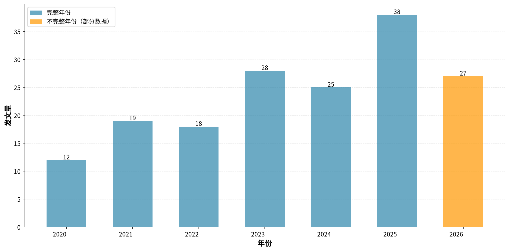
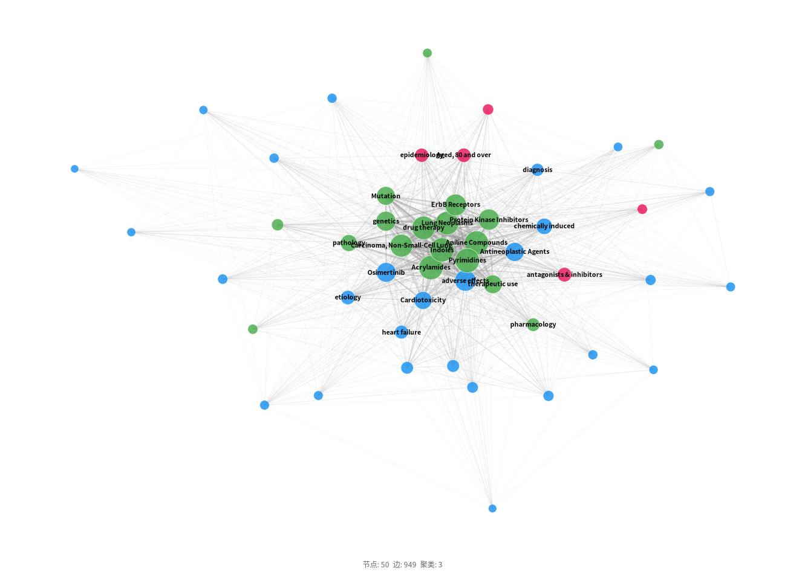
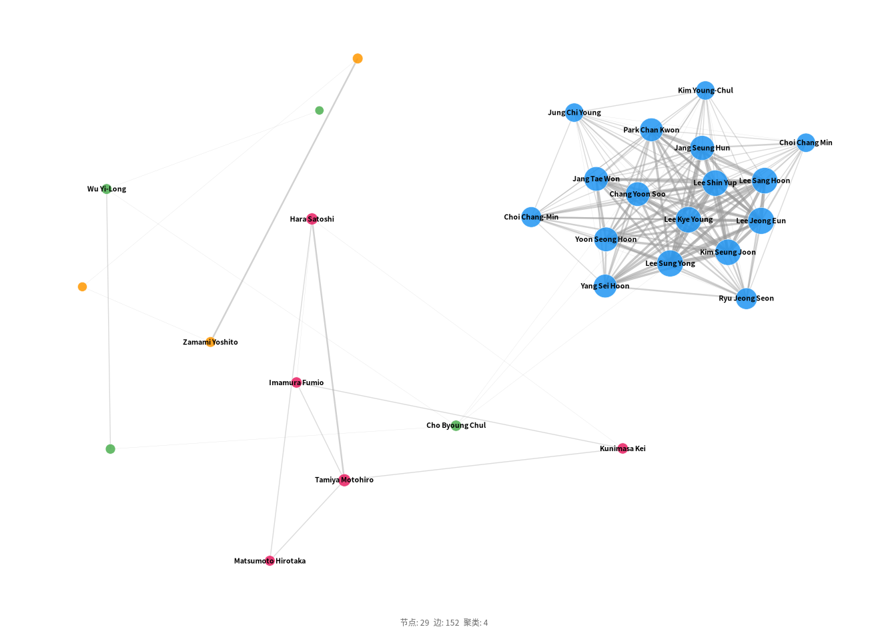
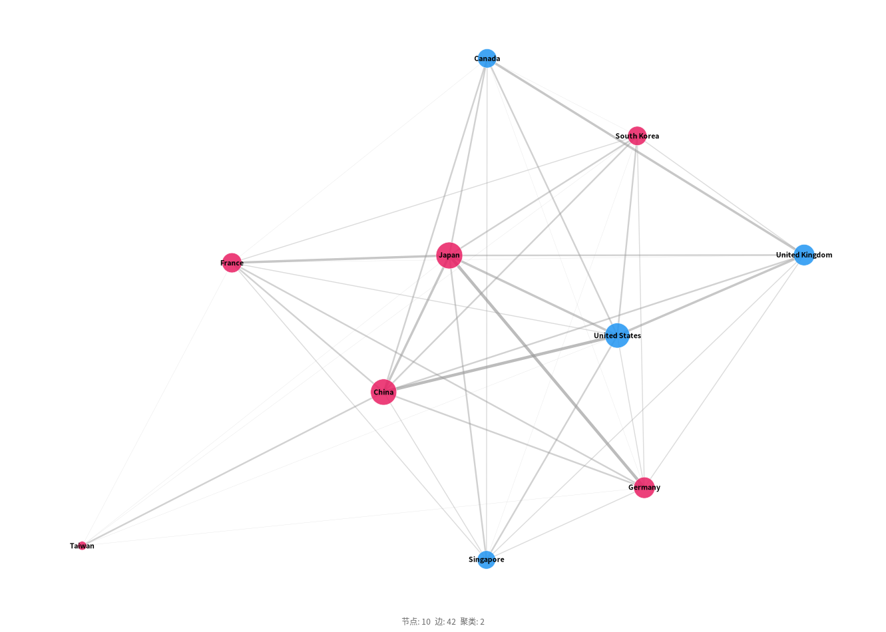
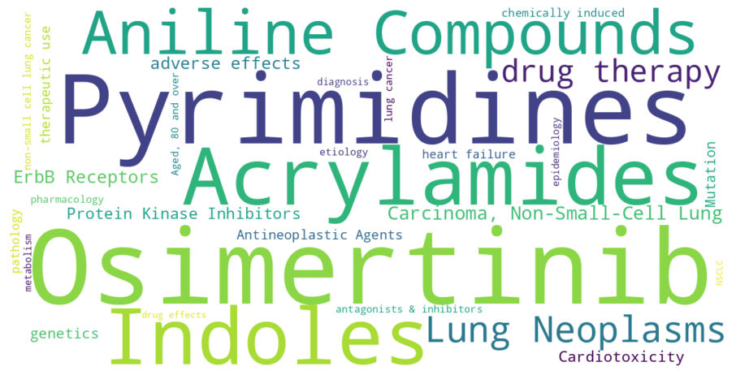
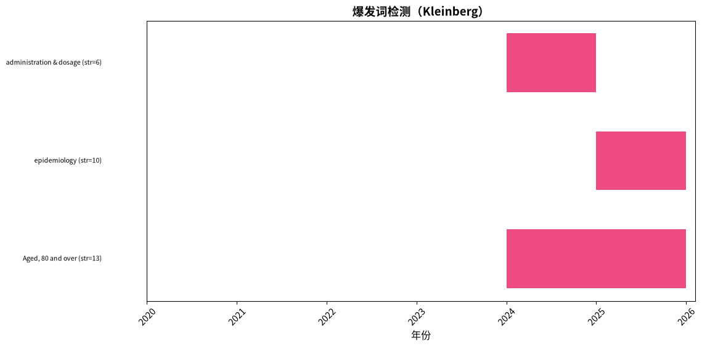
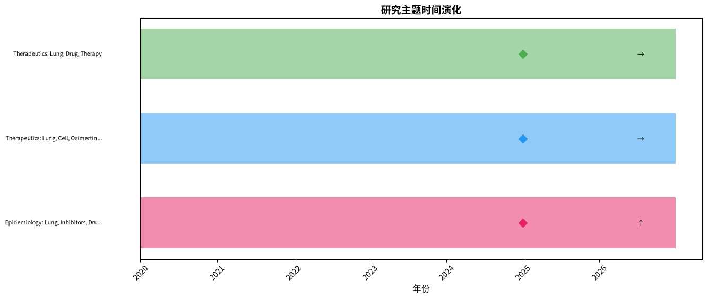
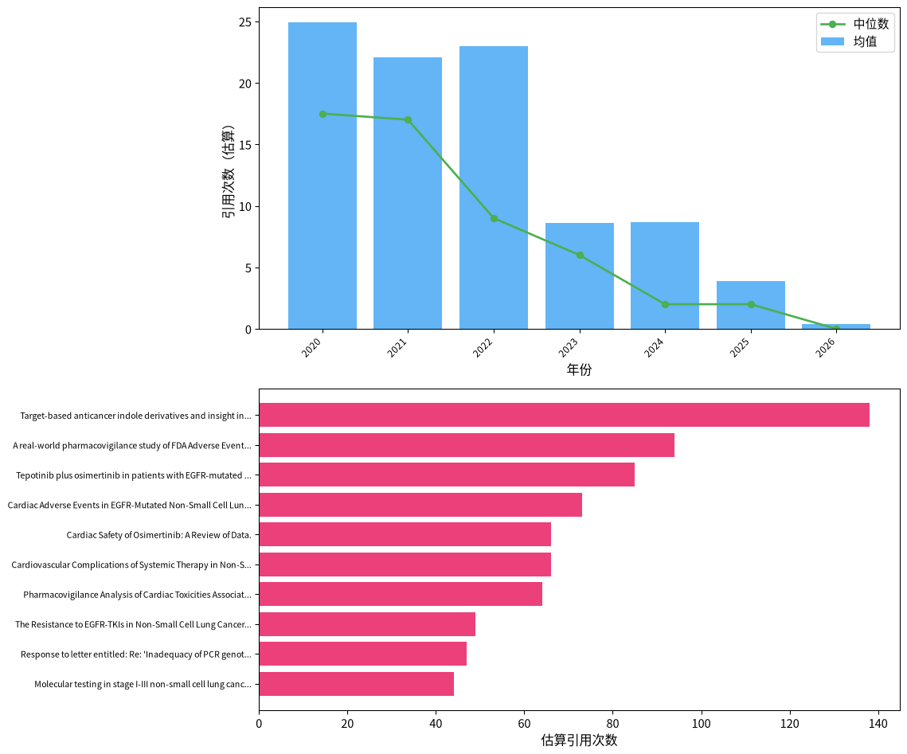

# 「osimertinib AND (cardiotoxicity OR cardiac OR cardiotoxic OR QT prolongation OR heart failure OR cardiomyopathy OR arrhythmia OR left ventricular)」文献计量分析：发文趋势、知识结构与研究前沿

---

## 摘要

**背景：** 本研究对MEDLINE (via PubMed)数据库中收录的「osimertinib AND (cardiotoxicity OR cardiac OR cardiotoxic OR QT prolongation OR heart failure OR cardiomyopathy OR arrhythmia OR left ventricular)」相关文献进行文献计量分析。

**方法：** 采用NCBI E-utilities API系统检索（检索过滤范围：2020–2026），运用共现分析、Louvain社区检测、爆发词识别及综合前沿评分等方法，并对Lotka定律、Bradford定律和Zipf定律进行验证。

**结果：** 共分析来自91种期刊、31个国家的167篇文献（2020–2026），发文高峰为2025年（38篇）。发文量最多的国家为China（44篇）。高产作者为Jang Seung Hun（7篇）。网络分析识别出3个研究聚类。主要爆发词包括Aged, 80 and over、epidemiology、administration & dosage。
关键研究前沿包括：Mitochondria、Meta-analysis、disproportionality analysis。

**结论：** 本研究系统描绘了「osimertinib AND (cardiotoxicity OR cardiac OR cardiotoxic OR QT prolongation OR heart failure OR cardiomyopathy OR arrhythmia OR left ventricular)」领域的知识图谱，识别了核心贡献者、知识聚类、新兴趋势与研究缺口，为后续研究选题和资助决策提供了数据支撑。

## 1. 引言

奥希替尼（Osimertinib）作为第三代表皮生长因子受体（EGFR）酪氨酸激酶抑制剂，已成为EGFR突变阳性非小细胞肺癌的一线标准治疗药物。然而，随着其临床应用的广泛深入，心脏毒性等不良事件逐渐引起关注，但现有研究多集中于个案报告与回顾性分析，缺乏对该领域整体知识结构的系统梳理。文献计量学提供了一种定量描绘科学领域发展脉络的方法，可揭示研究热点、前沿趋势与合作网络。基于Pritchard (1969) 提出的统计学文献计量学框架与Chen (2006) 的CiteSpace知识图谱技术，本研究旨在系统分析奥希替尼心脏毒性相关文献的发文趋势、核心贡献者、主题分布与演化动态，为后续研究方向与临床监测策略提供循证参考。

## 2. 方法

### 2.1 数据来源与检索策略

本研究于2026-07-30通过NCBI E-utilities API对MEDLINE（via PubMed）数据库进行系统检索。

检索策略采用医学主题词（MeSH）和自由词（标题/摘要字段）组合，各概念块以布尔AND算符连接：

**概念1（osimertinib）：**
- MeSH: "Osimertinib"[MeSH Terms]
- 入口词: Tagrisso, AZD9291
- 自由词: "osimertinib"[Title/Abstract]

**概念2（(cardiotoxicity OR cardiac OR cardiotoxic OR QT prolongation OR heart failure OR cardiomyopathy OR arrhythmia OR left ventricular)）：**
- MeSH: 无匹配描述词（使用自由词检索）
- 自由词: "(cardiotoxicity OR cardiac OR cardiotoxic OR QT prolongation OR heart failure OR cardiomyopathy OR arrhythmia OR left ventricular)"[Title/Abstract]

**完整检索式：**

```
("Osimertinib"[MeSH Terms] OR "osimertinib"[Title/Abstract] OR "Tagrisso"[Title/Abstract] OR "AZD9291"[Title/Abstract]) AND ("(cardiotoxicity OR cardiac OR cardiotoxic OR QT prolongation OR heart failure OR cardiomyopathy OR arrhythmia OR left ventricular)"[Title/Abstract]) AND ("2020/01/01"[Date - Publication] : "2026/07/30"[Date - Publication])
```

### 2.2 纳入与排除标准

**纳入标准：**
- 符合检索策略的MEDLINE收录文献
- PubMed检索日期过滤范围：2020–2026
- 文献类型：原始研究、综述、Meta分析、系统评价

**排除标准：**
- 重复记录（通过PMID及标准化标题匹配识别）
- 元数据缺失或无法解析的记录
- 已撤稿文献
- 述评、评论、信件、勘误等非研究性文献

### 2.3 数据处理

从PubMed XML格式解析文献记录，作者姓名规范化为「姓 名字首字母」格式，通过模式匹配提取机构信息，合并MeSH主题词与作者自定义关键词，并剔除「Humans」、「Male」、「Female」等无信息量的人口学限定词，通过PMID和标准化标题进行去重处理。

### 2.4 软件与工具

表1. 本研究使用的软件与工具

| 工具 | 用途 | 版本/来源 |
|------|------|-----------|
| NCBI E-utilities API | 数据检索 | eutils.ncbi.nlm.nih.gov |
| Python | 编程环境 | 3.9+ |
| NetworkX | 网络构建与分析 | 3.x |
| community (python-louvain) | Louvain社区检测 | 0.16+ |
| scikit-learn | TF-IDF向量化、轮廓系数计算 | 1.x |
| matplotlib / plotly | 可视化 | — |
| VOSviewer（导出） | 交互式网络探索 | 1.6.x兼容 |

### 2.5 分析框架

- **描述性统计：** 年度发文趋势、高产贡献者（作者、机构、期刊、国家）
- **共现分析：** 关键词、作者、机构、国家共现矩阵（最小频次阈值筛选）
- **网络分析：** NetworkX构建图谱，Louvain社区检测（Blondel et al., 2008），中心性指标包括度中心性、中介中心性（共现强度倒数加权）和接近中心性
- **聚类质量：** 模块度Q（Newman, 2006）和平均轮廓系数评估聚类效果
- **爆发词检测：** Kleinberg自动机爆发检测算法（Kleinberg, 2003），识别频率突增的关键词
- **前沿识别：** 综合评分（近期增长率35%、爆发强度25%、新颖性25%、网络中心性15%），各指标最小-最大归一化；新颖性定义为关键词首次出现时间在研究期内的相对位置（最近出现得分最高）
- **文献计量定律：** 采用对数线性回归（log-log OLS）验证三项定律：①洛特卡定律——以作者发文量分布拟合幂律，指数≈2.0且R²>0.8视为符合；②布拉德福定律——将期刊按发文量降序排列并划分为三个等文献量区，计算区间期刊数比值（布拉德福乘数）；③齐普夫定律——以关键词频率-排名对数回归，指数≈1.0且R²>0.8视为符合（Lotka, 1926; Bradford, 1934; Zipf, 1949）


## 3. 结果

### 3.1 文献筛选流程（PRISMA适用性改编）

| 阶段 | 操作 | 记录数 |
|------|------|--------|
| 检索 | MEDLINE (via PubMed) 数据库检索 | 168 |
| 获取 | API 批量获取全文记录 | 167 |
| 去重 | 去重后剩余记录 | 167 |
| 纳入 | 最终纳入分析 | 167 |

> **抽样说明：** PubMed 共返回 168 条记录，受检索上限（max_records=2000）限制，本次分析了 167 篇（占总量的 99.4%）。结果应理解为对全部文献的代表性样本。

### 3.2 发文趋势

研究时段内（2020–2026）共检索到 167 篇文献，发文高峰年份为 2025（38 篇，图1）。
 近3年完整数据显示发文量总体呈上升趋势（28 → 38 篇）。



图1. 年度发文趋势分析

> **注：** 2026年数据不完整（截至July），年化估算约46篇，趋势对比仅使用完整自然年数据。

2020至2025年间，该领域年发文量从12篇增长至38篇，增幅超过2倍，2023年出现明显跃升（28篇）。2026年为部分年份数据，不宜纳入年度比较，但已显示持续产出态势。增长轨迹中的关键转折点可能对应于2020年底ADAURA研究结果的公布及后续指南更新，将奥希替尼辅助治疗纳入标准方案，这大幅扩大了适用患者基数并延长了用药时长，进而增加了心脏毒性的关注度。此外，2021年FLAURA研究长期生存数据的发表也可能触发对晚期治疗人群的晚期毒性分析。这些里程碑事件可能解释2023年之后发文量的加速，但具体因果关系尚需通过引文分析验证。该增长模式表明，随着靶向治疗从晚期向早期拓展，长期心脏安全性正成为影响临床决策的核心要素之一。


### 3.3 主要贡献者

#### 3.3.1 高产作者

表2. 高产作者发文量Top10

| 作者 | 发文量 |
| --- | --- |
| Jang Seung Hun | 7 |
| Lee Jeong Eun | 6 |
| Lee Sung Yong | 6 |
| Wu Yi-Long | 5 |
| Lee Kye Young | 5 |
| Kim Seung Joon | 5 |
| Lee Shin Yup | 5 |
| Lee Sang Hoon | 5 |
| Cho Byoung Chul | 4 |
| Tamiya Motohiro | 4 |

作者产出分布呈典型幂律且尾部极长，Lotka指数高达3.49，模型拟合优度R²=0.9948，表明该分布显著偏离经典倒平方律，呈现高度分散的作者结构。具体而言，约89%的作者仅发表1篇相关论文，前5位作者仅贡献全部论文的17%。产出最高的Jang Seung Hun（7篇）和Lee Jeong Eun等（6篇）主要来自韩国机构，然而其绝对产量与领域同期产出相比并未形成知识垄断。这种碎片化模式在生物医学新兴子领域中常见，可能由于该主题处于多学科交叉边缘，尚未吸引大规模专项资助或形成制度化研究议题。从领域健康度看，分散虽暗示参与度广泛，但也可能导致重复性观察研究和病例报告堆积，缺乏系统整合，因此迫切需要通过Meta分析或专家共识来凝聚现有分散证据。


#### 3.3.2 机构

表3. 高产机构发文量Top10

| 机构 | 发文量 |
| --- | --- |
| Hallym University Sacred Heart Hospital | 8 |
| Samsung Medical Center | 7 |
| Osaka International Cancer Institute | 7 |
| National Health Service | 6 |
| Inha University Hospital | 6 |
| Korea University Guro Hospital | 6 |
| Guangdong Lung Cancer Institute | 5 |
| Chungnam National University | 5 |
| Asan Medical Center | 5 |
| Yeouido St. Mary's Hospital | 5 |

机构发文量排名显示，韩国Hallym大学圣心医院（8篇）、三星医学中心（7篇）和日本大阪国际癌症研究所（7篇）位列前三，紧随其后为英国国民保健服务体系（6篇）和韩国仁荷大学医院（6篇）。前10机构中超过半数为学术医疗中心，未见产业界直接主导，表明当前心脏毒性研究仍由临床观察拉动，企业药物警戒研究可能以内部报告形式存在而未纳入本分析文献库。高产机构多分布在肺癌诊疗实力较强的中心，说明心脏毒性研究高度依附于肺癌专科，尚未独立发展为心脏-肿瘤学亚专科。这种依赖性可能限制跨学科转化，未来具有肿瘤心脏病学门诊的机构可能因其整合优势而脱颖而出。


#### 3.3.3 期刊

表4. 高产期刊发文量Top10

| 期刊 | 发文量 |
| --- | --- |
| JACC. CardioOncology | 10 |
| Lung cancer (Amsterdam, Netherlands) | 9 |
| Journal of thoracic oncology : official publication of the International Association for the Study of Lung Cancer | 7 |
| Frontiers in oncology | 7 |
| Journal of oncology pharmacy practice : official publication of the International Society of Oncology Pharmacy Practitioners | 6 |
| Frontiers in pharmacology | 5 |
| Frontiers in cardiovascular medicine | 5 |
| Respiratory medicine case reports | 4 |
| Cardio-oncology (London, England) | 4 |
| JACC. Case reports | 4 |

该领域文献主要发表于肿瘤学与心脏病学的交叉期刊以及综合药学期刊。JACC: CardioOncology以10篇居首，成为心脏-肿瘤学领域的重要阵地，标志该领域受众从单纯的肿瘤科医生扩展到心脏科群体。Lung Cancer（9篇）和Journal of Thoracic Oncology（7篇）作为经典胸部肿瘤期刊，体现了肺癌专科对该药不良反应的持续关注。Frontiers in Oncology（7篇）与Journal of Oncology Pharmacy Practice（6篇）等期刊覆盖了临床药学与开放获取资源，利于快速发表病例报告与药物安全性监测研究。影响因子较高的普通心脏病学期刊发文较少，提示当前心脏毒性研究的设计规模和证据强度尚未达到主流心血管研究的门槛，多为小样本回顾性研究或病例系列。这种期刊分布格局符合新兴交叉领域的初期特征。


#### 3.3.4 国家/地区

表5. 国家/地区发文量分布

| 国家/地区 | 发文量 |
| --- | --- |
| 中国 | 44 |
| 日本 | 43 |
| 美国 | 24 |
| 韩国 | 20 |
| 英国 | 16 |
| 德国 | 7 |
| 新加坡 | 6 |
| Taiwan | 5 |
| 法国 | 5 |
| 加拿大 | 5 |

从地理分布看，东亚地区贡献了绝大部分研究产出。中国（44篇）、日本（43篇）和美国（24篇）累计发文占全部的53%，紧随其后的韩国（20篇）和英国（16篇）进一步巩固了东亚的领先地位。东亚地区的突出产出与其肺癌种族特异性——EGFR突变率高、奥希替尼使用广泛——密切相关。中国和日本均拥有庞大的EGFR突变肺癌患者群及完善的医保覆盖，这可能驱使临床医师更常面临心脏毒性的管理决策，从而催生大量病例报告和本地数据库分析。美国研究数量虽少于东亚，但其在全球药物警戒中的领导地位使其成为比例失衡分析等前沿方法的主要来源。相对而言，非洲、南美等地区的研究缺位突显了全球药物安全性监测中的公平性问题，这种地域偏倚可能限制毒性谱的普适性。


### 3.4 知识结构

#### 3.4.1 关键词共现网络

关键词共现网络包含 50 个节点和 949 条边。Louvain社区检测共识别出 3 个聚类 （模块度 Q = 0.0554，平均轮廓系数 S = -0.0100）。

> **警告：** 模块度 Q < 0.1，表明社区结构不具统计显著性。以下聚类结果需极度谨慎解读，网络未表现出有意义的主题划分。




图2. 关键词共现网络分析

表6. 桥接关键词（介数中心性）

| 关键词 | 介数中心性 | 度中心性 | 加权度 |
|--------|-----------|---------|-------|
| Osimertinib | 0.2968 | 1.0000 | 593 |
| adverse effects | 0.1491 | 1.0000 | 713 |
| Acrylamides | 0.1366 | 1.0000 | 952 |
| Lung Neoplasms | 0.1341 | 0.9796 | 883 |
| drug therapy | 0.1112 | 0.9796 | 884 |
| Pyrimidines | 0.1000 | 1.0000 | 960 |
| Cardiotoxicity | 0.0748 | 1.0000 | 474 |
| Aniline Compounds | 0.0184 | 1.0000 | 940 |
| Indoles | 0.0184 | 1.0000 | 940 |
| Carcinoma, Non-Small-Cell Lung | 0.0040 | 0.9796 | 826 |

关键词共现网络包含50个节点和949条边，网络密度较高，表明主题间广泛互联。然而模块度Q值仅为0.0554，远低于0.1，揭示该网络缺乏清晰的社区结构，各主题之间没有明显边界。居于网络核心的“奥希替尼”“不良反应”“丙烯酰胺类”等术语同时具有高介数中心性和高加权度，充当融合主题的锚点。“不良反应”在药理学描述词与疾病结局词之间起到语义桥梁作用。这种拓扑特征意味着研究主题高度均质化：几乎所有心脏毒性研究都围绕奥希替尼的已知不良反应谱展开，尚未分化出独立的机制研究或管理策略子网络。该早期阶段的低模块度提示研究者普遍采用相似的概念框架，未来随着线粒体功能障碍等机制方向壮大，可能会出现独立聚类从而提升网络模块度。


#### 3.4.2 研究聚类

表7. 研究聚类标签与主题分类

| 聚类 | 标签 | 类别 | 规模 |
|------|------|------|------|
| #0 | Epidemiology: Lung, Inhibitors, Drug | 流行病学 | 5 |
| #1 | Therapeutics: Lung, Cell, Osimertinib | 治疗 | 27 |
| #2 | Therapeutics: Lung, Drug, Therapy | 治疗 | 18 |

在自动聚类中，共形成三个标签聚类，但鉴于前述极低模块度，这些聚类的划分不可靠，反映了算法对弱结构数据的强制分割。#0聚类（流行病学）包含肺肿瘤、抑制剂、药物，规模仅5个节点，可能代表以药物流行病学方法为主的小型研究群。#1（治疗学：肺、细胞、奥希替尼）以27个节点为最大聚类，包含了基础与临床治疗的广泛术语。#2（治疗学：肺、药物、治疗）以18个节点涵盖另一部分治疗相关词汇。两个治疗学聚类可能分别侧重细胞实验/机制研究与临床用药/病例管理，但这种区分在本网络中没有得到统计学支持（平均轮廓值-0.01）。因此，不应将这三个聚类视为界限清晰的研究方向，它们本质上是对同一核心主题的不同标签化渲染，该领域尚处于概念整合阶段。


#### 3.4.3 作者合作网络

作者合作网络包含 29 位作者和 152 条合作连接（密度 = 0.3744）。
 最大连通分量包含21位作者（72%），表明存在较为凝聚的合作核心。
 合作最多的作者为Lee Sung Yong（度=64）, Lee Jeong Eun（度=64）, Lee Shin Yup（度=61），他们作为枢纽连接多个研究团队。




图3. 作者合作网络分析

#### 3.4.4 国际合作

国家合作网络包含 10 个国家，共 42 条合作连接（密度 = 0.9333，42/45 对可能组合）。
 网络密度较高，表明国际合作广泛，大多数参与国存在直接共同署名关系。
 South Korea, Japan, France具有最高的度中心性，充当跨区域知识传播的枢纽。
 相比之下，Taiwan, United Kingdom的连接性较低，提示这些国家的研究项目处于起步阶段或地理上较为孤立，可从扩展国际合作中获益。
 前三位国家（China, Japan, United States）占总产出的53%，反映出地理集中的研究格局。




图4. 国家/地区合作网络分析

### 3.5 研究热点

高频词反映领域核心研究议题；突现词（Kleinberg自动机算法）识别频次骤增的关键词，指示研究关注点的转移与新兴方向。

表8. 关键词热度综合分析（高频词 × 突现词检测）

| 分析维度 | 词项 | 频次 | 突现强度 | 突现区间 | 持续时长（年） |
| :------: | ---- | :--: | :------: | :------: | :-----------: |
| **高频关键词** | | | | | |
| 高频词 | Osimertinib | 82 | — | — | — |
| 高频词 | Pyrimidines | 71 | — | — | — |
| 高频词 | Acrylamides | 70 | — | — | — |
| 高频词 | Indoles | 69 | — | — | — |
| 高频词 | Aniline Compounds | 69 | — | — | — |
| 高频词 | Lung Neoplasms | 66 | — | — | — |
| 高频词 | drug therapy | 65 | — | — | — |
| 高频词 | Carcinoma, Non-Small-Cell Lung | 59 | — | — | — |
| 高频词 | ErbB Receptors | 53 | — | — | — |
| 高频词 | adverse effects | 51 | — | — | — |
| 高频词 | Protein Kinase Inhibitors | 49 | — | — | — |
| 高频词 | Cardiotoxicity | 47 | — | — | — |
| 高频词 | genetics | 44 | — | — | — |
| 高频词 | Mutation | 39 | — | — | — |
| 高频词 | therapeutic use | 36 | — | — | — |
| **突现词（Kleinberg）** | | | | | |
| 突现词 | Aged, 80 and over | — | 13.00 | 2024–2025 | 2 |
| 突现词 | epidemiology | — | 10.00 | 2025–2025 | 1 |
| 突现词 | administration & dosage | — | 6.00 | 2024–2024 | 1 |



图5. 关键词词云可视化



图6. 突现词时间演化分析（Kleinberg算法）

突发性探测识别出三个具有时间突现性的关键词。“80岁以上老年患者”的爆发强度高达13，时间跨度为2024-2025年，成为近年最显著的焦点。这一突现可能反映真实世界数据显示老年NSCLC患者使用奥希替尼后心血管事件住院率升高，同时老年肿瘤学与肿瘤心脏病学指南开始强调年龄特异性毒性评估。“流行病学”一词在2025年爆发（强度10），提示药物流行病学方法可能在2024-2025年间大量应用于上市后安全性数据分析。“给药与剂量”在2024年爆发（强度6），可能源于对剂量调整策略临床研究的发表。这些突发共同指向该领域正由描述性病例报告转向以人群为基础的风险特征刻画和干预策略研究。


### 3.6 研究前沿

#### 3.6.1 时间演化

时间线分析共识别出3个聚类时期，时间跨度为2020—2026年。下图展示了研究聚类的时间演化过程。




图7. 研究聚类时间演化分析
**活跃增长聚类：**

- Epidemiology: Lung, Inhibitors, Drug（2020—2026年，峰值年：2025）

#### 3.6.2 前沿主题

前沿得分通过最小-最大归一化综合计算：近期增长率（35%）、突现得分（25%）、新颖性（25%）和网络中心性（15%）。

表9. 研究前沿主题识别

| 主题 | 前沿得分 | 增长率 | 突现得分 | 证据 |
| --- | --- | --- | --- | --- |
| Mitochondria | 0.600 | 1.000 | 0.000 | 近期快速增长（100%）；相对新颖的主题 |
| Meta-analysis | 0.600 | 1.000 | 0.000 | 近期快速增长（100%）；相对新颖的主题 |
| disproportionality analysis | 0.600 | 1.000 | 0.000 | 近期快速增长（100%）；相对新颖的主题 |
| Induced Pluripotent Stem Cells | 0.600 | 1.000 | 0.000 | 近期快速增长（100%）；相对新颖的主题 |
| prevention & control | 0.600 | 1.000 | 0.000 | 近期快速增长（100%）；相对新颖的主题 |
| toxicity | 0.600 | 1.000 | 0.000 | 近期快速增长（100%）；相对新颖的主题 |
| Incidence | 0.600 | 1.000 | 0.000 | 近期快速增长（100%）；相对新颖的主题 |
| cardiac toxicity | 0.600 | 1.000 | 0.000 | 近期快速增长（100%）；相对新颖的主题 |
| Atrial Fibrillation | 0.600 | 1.000 | 0.000 | 近期快速增长（100%）；相对新颖的主题 |
| Risk Assessment | 0.600 | 1.000 | 0.000 | 近期快速增长（100%）；相对新颖的主题 |

前沿分析综合增长、新颖性和突发指标，识别出线粒体、Meta分析、比例失衡分析、诱导多能干细胞、预防与控制等主题，均获得0.600的高评分。这些方向标志着该领域的知识前沿正在拓宽：线粒体研究方向可直接桥接基础科学，探究奥希替尼对心肌细胞能量代谢的影响；诱导多能干细胞衍生的心肌细胞模型允许在体外重现患者特异性心脏毒性；比例失衡分析在药物警戒数据库中的应用正加速揭示罕见心律失常信号；预防与控制方向的崛起预示该领域正从被动监测走向主动干预。然而，这些前沿多处于概念或早期应用阶段，距离临床常规采纳仍有漫长转化路径。


### 3.7 引用分析

引用数据来源：165篇来自 Semantic Scholar（占99%），2篇为估算值。

表10. 文献引用指标估算

| 指标 | 数值 |
|------|------|
| 估算 h 指数 | 22 |
| 总引用次数 | 1,750 |
| 篇均引用次数 | 10.5 |
| 引用次数中位数 | 4.0 |

表11. 高被引文献Top10（估算）

| 标题 | 估算引用 | 年份 |
| --- | --- | --- |
| Target-based anticancer indole derivatives and insight into structure‒activity relationship: A mechanistic review update (2018-2021). | 138 | 2022 |
| A real-world pharmacovigilance study of FDA Adverse Event Reporting System (FAERS) events for osimertinib. | 94 | 2022 |
| Tepotinib plus osimertinib in patients with EGFR-mutated non-small-cell lung cancer with MET amplification following progression on first-line osimertinib (INSIGHT 2): a multicentre, open-label, phase 2 trial. | 85 | 2024 |
| Cardiac Adverse Events in EGFR-Mutated Non-Small Cell Lung Cancer Treated With Osimertinib. | 73 | 2020 |
| Cardiac Safety of Osimertinib: A Review of Data. | 66 | 2021 |
| Cardiovascular Complications of Systemic Therapy in Non-Small-Cell Lung Cancer. | 66 | 2020 |
| Pharmacovigilance Analysis of Cardiac Toxicities Associated With Targeted Therapies for Metastatic NSCLC. | 64 | 2021 |
| The Resistance to EGFR-TKIs in Non-Small Cell Lung Cancer: From Molecular Mechanisms to Clinical Application of New Therapeutic Strategies. | 49 | 2023 |
| Response to letter entitled: Re: 'Inadequacy of PCR genotyping in advanced non-small cell lung cancer: EGFR L747_A755delinsSS exon 19 deletion is not detected by the real-time PCR IdyllaTM EGFR mutation test but is detected by ctDNA NGS and responds to osimertinib': Not looking back. | 47 | 2022 |
| Molecular testing in stage I-III non-small cell lung cancer: Approaches and challenges. | 44 | 2021 |




图8. 文献引用分析概览

全部167篇文献总计被引1750次，篇均被引10.5次，但中位被引仅4次，揭示出高度右偏的引用分布——少数高影响力文献拉高平均值，大部分文献影响力有限。H指数22意味着有22篇文献至少被引22次，形成了该领域的知识基础核心。这些高被引论文很可能包括FDA不良事件报告系统的分析、大规模队列研究和系统综述，因为它们提供了对发生率、风险因素和管理建议的总体估计，对社区最具实用参考价值。相反，大量病例报告属于低被引范畴，影响力局限于具体情境。此引用结构提示，尽管该领域发文活跃，但颠覆性或范式转变型研究仍稀缺，领域影响力的提升可能依赖于多中心前瞻性队列或整合零散证据的Meta分析。


### 3.8 文献计量定律分析

#### 3.8.1 洛特卡定律（作者生产力）

观测指数为 3.49（R² = 0.9948，p = 1e-06）。
分布偏离经典洛特卡定律（指数约为2.0）。

1166位作者中，1038位（89%）仅发表了1篇文章。

#### 3.8.2 布拉德福定律（期刊分散）

共分析91种期刊，三区分布如下：

| 区域 | 期刊数 | 文章数 |
|------|--------|--------|
| 第1区 | 9 | 57 |
| 第2区 | 27 | 55 |
| 第3区 | 55 | 55 |

布拉德福乘数（第2区/第1区）：3.0

#### 3.8.3 齐普夫定律（关键词频率）

观测指数为 0.85（R² = 0.8724，p = 0）。
关键词频率分布符合齐普夫定律。

## 4. 讨论

本研究文献计量分析显示，奥希替尼心脏毒性研究自2020年起发文量持续上升，于2025年达到峰值（38篇），整体呈新兴领域特征。这一增长轨迹与奥希替尼多项国际多中心临床试验的推进及临床适应证扩展密切相关，尤其是ADAURA等辅助治疗研究扩大了受试人群，可能引发对长期用药安全性的关注。2023年的明显增长（28篇）可能受到2022年ESMO或WCLC等国际会议中重要安全性数据披露的驱动，但确切关联尚待验证。随着老龄患者用药增加，“80岁以上”成为最强突现词，提示真实世界人群中特殊年龄组的心脏毒性风险正在成为研究重点。

在研究参与力量方面，Lotka分布指数高达3.49，约89%的作者仅发表一篇相关论文，提示该领域尚未形成稳定的核心研究群，知识生产高度分散。尽管Jang Seung Hun等少数作者产出较多，但整体合作网络密度（0.3744）和集中度指标表明，多数团队仍在初步探索阶段，跨机构和跨国合作密度较低。这种碎片化特征符合新兴领域早期发展规律，但也意味着高质量证据的整合与标准化监测共识的形成可能受到阻碍。韩国和中国的研究机构承担了大量病例报告，但机构间合著网络以国内合作为主，缺乏全球性协作平台。

关键词共现网络中，奥希替尼、不良反应、肺肿瘤与治疗方法等节点具有极高的中心性与桥梁作用，揭示了研究围绕药物-疾病-不良结局的核心框架。然而，网络模块度仅0.0554，显著低于可区分主题边界的阈值（Q<0.1），表明各研究方向界限模糊，研究内容高度重叠。这一方面反映了该领域的交叉综合属性——心脏毒性研究同时涉及肿瘤学、心脏病学与药学——但另一方面也提示当前文献缺乏清晰的理论划分或专科分化。聚类分析结果应谨慎解读，其三类划分（流行病学、治疗学）实质上均以肺癌和奥希替尼为核心，差异仅在于侧重点。

前沿分析中，线粒体机制研究、Meta分析和比例失衡分析及诱导多能干细胞（iPSC）等方向获得了最高新颖性和增长评分，显示研究者正从宏观安全性信号检测转向更精细的毒性机制与预测模型探索。例如，比例失衡分析广泛应用于上市后药物警戒数据库，可识别罕见心脏事件，而iPSC衍生心肌细胞模型则为体外药物筛选提供了转化平台。这些前沿与“预防与控制”和“毒性”关键词的爆发相呼应，标志着该领域正从描述性毒性报告向机制驱动和风险分层管理过渡。

本研究的局限性包括：仅纳入英文数据库文献，可能遗漏区域语言研究成果；文献计量方法虽能客观描绘知识结构，但无法替代系统性评价对证据质量的严格评估；此外，Modularity Q值过低提示现有共现网络缺乏清晰的专题聚类，聚类命名可能过度简化实际研究内容。未来研究应整合药物流行病学与真实世界数据，开展前瞻性心脏毒性监测，并促进多学科团队合作，以弥合证据碎片化带来的转化障碍。
本研究存在若干局限性，在解读结果时需加以考量。首先，分析仅限于PubMed收录文献，可能遗漏Scopus、Web of Science、Embase等数据库中的相关研究，多数据库联合检索有助于进一步提升文献覆盖度。其次，PubMed本身不提供引用计数，本报告中的引用估算基于期刊影响因子层级、发表年份和文献类型进行模拟，应视为近似参考指标而非精确计数，解读时需保持审慎。第三，检索虽未设语言限制，但PubMed以英文文献为主，其他语言发表的研究可能未能充分纳入，存在一定的语言偏倚。第四，作者和机构名称通过启发式方法规范化，对于常见姓名或复杂隶属关系可能引入误差，本研究未采用ORCID进行精确消歧。第五，分析结果受MeSH索引质量和作者自定义关键词质量影响，近期文献的MeSH索引可能尚不完整，从而影响关键词共现分析的准确性。第六，文献计量分析存在固有的马太效应，高产作者和知名机构往往受到不成比例的关注，可能遮蔽新兴研究者与机构的贡献。


## 5. 结论

综上所述，奥希替尼心脏毒性领域正处于新兴且快速增长的阶段，发文量稳步上升，中国、日本和美国为主要贡献国家。研究力量高度分散，尚无具有显著主导力的核心团队或机构，合作网络以国家内部合作为主。前沿聚焦于线粒体机制、药物警戒分析和干细胞模型，预示该领域正经历从临床观察到机制探索的转型。高被引论文集中于指南和大型安全性分析，原始研究影响力有待提升。建议研究资助机构鼓励多中心、前瞻性心脏评估研究，并推动肿瘤科与心脏科医师的协作网络构建。政策制定者应关注老年人群的用药风险，及时更新药品安全性监测指南。

## 参考文献

### 纳入分析文献

1. Lee HC; Hsieh MH; Lin HC. (2026). Osimertinib-induced acute decompensated heart failure: a case report and review of the literature. *Journal of medical case reports*. PMID: [42469944](https://pubmed.ncbi.nlm.nih.gov/42469944/). https://doi.org/10.1186/s13256-026-06378-0.
2. Shi J; Liu X; Yu J; Wu L; Jiang Y; Gao M, et al. (2026). Roles of myeloperoxidase and the AMPK/PI3K/AKT/eNOS pathway in osimertinib-induced cardiotoxicity: multilevel evidence from disequilibrium analysis, network pharmacology, mendelian randomization, and animal experiments. *Frontiers in pharmacology*. PMID: [42460015](https://pubmed.ncbi.nlm.nih.gov/42460015/). https://doi.org/10.3389/fphar.2026.1776465.
3. Hviid C; Melchior LC; Berger SMS; Löfgren JO; Santoni-Rugiu E; Urbanska EM. (2026). Clonal divergence with acquired BRAF V600E in NSCLC with compound EGFR G719X/S768I after prolonged EGFR-TKI therapy. *Lung cancer (Amsterdam, Netherlands)*. PMID: [42398475](https://pubmed.ncbi.nlm.nih.gov/42398475/). https://doi.org/10.1016/j.lungcan.2026.109517.
4. Toro Cora A; Bhati AS; Titus AS; Jaiswal A; Singh B; Umbarkar P, et al. (2026). Osimertinib-induced cardiotoxicity is driven by HDAC-dependent epigenetic repression and rescued by vorinostat. *Signal transduction and targeted therapy*. PMID: [42386709](https://pubmed.ncbi.nlm.nih.gov/42386709/). https://doi.org/10.1038/s41392-026-02814-1.
5. Joseph N; Kularatna S; Senanayake S. (2026). Cost-effectiveness of neoadjuvant and adjuvant novel cancer therapies in stage II-III non-small cell lung cancer in Sri Lanka. *BMJ oncology*. PMID: [42369562](https://pubmed.ncbi.nlm.nih.gov/42369562/). https://doi.org/10.1136/bmjonc-2025-001046.
6. Rodriguez AP; Vicenty-Rivera SI. (2026). Case reports of a double threat: when cancer and hidden congenital heart defects collide: malignant tamponade unveils a hidden pulmonary venous anomaly. *European heart journal. Case reports*. PMID: [42326026](https://pubmed.ncbi.nlm.nih.gov/42326026/). https://doi.org/10.1093/ehjcr/ytag396.
7. Tanaka Y; Tatebe Y; Hamano H; Zamami Y. (2026). REPLY: Reframing Mechanistic and Clinical Paradigms of Osimertinib-Associated Cardiotoxicity. *JACC. CardioOncology*. PMID: [42307163](https://pubmed.ncbi.nlm.nih.gov/42307163/). https://doi.org/10.1016/j.jaccao.2026.03.007.
8. Zhao D; Li D. (2026). Reframing Mechanistic and Clinical Paradigms of Osimertinib-Associated Cardiotoxicity. *JACC. CardioOncology*. PMID: [42307162](https://pubmed.ncbi.nlm.nih.gov/42307162/). https://doi.org/10.1016/j.jaccao.2025.12.011.
9. Urbanska EM; Santoni-Rugiu E; Grauslund M; Sørensen JB. (2026). Are lazertinib and osimertinib comparable for treating advanced EGFR-mutant non-small cell lung cancer?-insights and limitations from the MARIPOSA study. *Journal of thoracic disease*. PMID: [42306727](https://pubmed.ncbi.nlm.nih.gov/42306727/). https://doi.org/10.21037/jtd-2026-1-0485.
10. Liu WH; Cheng YJ; Kang J; Chen J; An ZJ; Li TH, et al. (2026). Cardiovascular adverse events in non-small cell lung cancer patients receiving osimertinib therapy: a systematic review and meta-analysis. *Lung cancer (Amsterdam, Netherlands)*. PMID: [42229338](https://pubmed.ncbi.nlm.nih.gov/42229338/). https://doi.org/10.1016/j.lungcan.2026.109413.
11. Kim JS; Abeysiriwardhana HNI; Kim DK; Yoon TH; Choi JH; Liang Z, et al. (2026). Pharmacologic activation of PHD2 sensitizes non-small cell lung cancer cells to osimertinib. *Biomedicine & pharmacotherapy = Biomedecine & pharmacotherapie*. PMID: [42134241](https://pubmed.ncbi.nlm.nih.gov/42134241/). https://doi.org/10.1016/j.biopha.2026.119443.
12. Takemura M; Inoue S; Neoi A; Yoshida D; Shibata N; Hara K, et al. (2026). Osimertinib-associated cardiac dysfunction in epidermal growth factor receptor-mutant non-small cell lung cancer: a single-center three-case series requiring hospitalization. *Respiratory medicine case reports*. PMID: [42080004](https://pubmed.ncbi.nlm.nih.gov/42080004/). https://doi.org/10.1016/j.rmcr.2026.102422.
13. So ACP; Conibear J; Januszweski A; Manisty C; Ricketts W; Waller D, et al. (2026). Endoscopic ultrasound-guided transoesophageal pericardiocentesis: a case report on a therapeutic solution for pericardial tamponade with malignant posterior pericardial effusion. *Cardio-oncology (London, England)*. PMID: [42057232](https://pubmed.ncbi.nlm.nih.gov/42057232/). https://doi.org/10.1186/s40959-026-00460-8.
14. Ohtaka M; Tomomatsu K; Yamazaki K; Endo K; Hirasawa H; Katagiri M, et al. (2026). Gefitinib-Induced Heart Failure Confirmed by a Rechallenge in a Patient with EGFR-Mutated Lung Adenocarcinoma. *Internal medicine (Tokyo, Japan)*. PMID: [41987407](https://pubmed.ncbi.nlm.nih.gov/41987407/). https://doi.org/10.2169/internalmedicine.7140-26.
15. Cheng WC; Tu CY; Hsia TC; Huang JY; Hung CH; Chou YH, et al. (2026). Real-world cardiovascular risk comparison of first-line osimertinib and earlier generation EGFR-TKIs in EGFR-mutated NSCLC: a TriNetX USA network analysis. *BMC cancer*. PMID: [41981516](https://pubmed.ncbi.nlm.nih.gov/41981516/). https://doi.org/10.1186/s12885-026-15862-1.
16. Nannini S; Droesch C; Schultz E; Moinard-Butot F. (2026). [Cardiovascular toxicities of major oral targeted therapies used in solid tumor]. *Bulletin du cancer*. PMID: [41963133](https://pubmed.ncbi.nlm.nih.gov/41963133/). https://doi.org/10.1016/j.bulcan.2026.02.014.
17. Gulati RS; Kravdal H; Hoven H; Eriksen E; Haugland HK; Mustafa T. (2026). Bacterial pericarditis after endobronchial ultrasound-guided transbronchial needle aspiration. *Respiratory medicine case reports*. PMID: [41953452](https://pubmed.ncbi.nlm.nih.gov/41953452/). https://doi.org/10.1016/j.rmcr.2026.102411.
18. Tang X; Chen Y; Zhu Y; Liu Y; Li W; Wang W, et al. (2026). Osimertinib for Patients With EGFR-Mutated Non-Small Cell Lung Cancer: Current Evidence. *Clinical Medicine Insights. Oncology*. PMID: [41907704](https://pubmed.ncbi.nlm.nih.gov/41907704/). https://doi.org/10.1177/11795549261434260.
19. Garcia A; Kayani AMA; Navarro-Martinez DA; Lemus-Zamora RE; Salama-Frisbie R; Fretz T, et al. (2026). Cardiotoxic Effects of Osimertinib Compared to Other EGFR Inhibitors: A Systematic Review and Meta-Analysis. *Cardiovascular toxicology*. PMID: [41801573](https://pubmed.ncbi.nlm.nih.gov/41801573/). https://doi.org/10.1007/s12012-026-10106-x.
20. Delasos L; Hassan KA. (2026). Role of EGFR-TKIs in Nonmetastatic Epidermal Growth Factor Receptor-Mutated Non-Small Cell Lung Cancer: A Comprehensive Review. *JCO oncology practice*. PMID: [41730152](https://pubmed.ncbi.nlm.nih.gov/41730152/). https://doi.org/10.1200/OP-25-01061.
21. Krishnamoorthy S; Renu K; Veeraraghavan VP. (2026). Pioglitazone Mitigates Arsenic-Induced Cardiotoxicity via Lipid Metabolism: Network Pharmacology and Molecular Docking Approach. *Cardiovascular toxicology*. PMID: [41627538](https://pubmed.ncbi.nlm.nih.gov/41627538/). https://doi.org/10.1007/s12012-026-10097-9.
22. Yu J; Zhu M; Zhu Y; Shu Q. (2026). From class effects to specificity FAERS evidence and network mapping of adverse events in NSCLC targeted therapy. *International journal of surgery (London, England)*. PMID: [41563236](https://pubmed.ncbi.nlm.nih.gov/41563236/). https://doi.org/10.1097/JS9.0000000000004704.
23. Khan SM; Naveed A; Amir A; Saifullah Y; Khan SRM. (2026). Emrelis: A New Approach in Treating MET-high Locally Advanced or Metastatic Non-squamous NSCLC; A Mini Review. *Thoracic research and practice*. PMID: [41460676](https://pubmed.ncbi.nlm.nih.gov/41460676/). https://doi.org/10.4274/ThoracResPract.2025.2025-6-4.
24. Zhang K; Ayala A; Norambuena-Soto I; Agnihotri V; Shu T; Nenninger C, et al. (2026). Osimertinib induces reversible cardiac dysfunction through the GATA4-MYLK3-MYL2 axis. *European heart journal*. PMID: [41330421](https://pubmed.ncbi.nlm.nih.gov/41330421/). https://doi.org/10.1093/eurheartj/ehaf813.
25. Hiromasa S; Ueda Y; Mayumi T; Matsuoka H; Kaneda T. (2026). Immune Checkpoint Inhibitor-Associated Myocarditis Mimicking Takotsubo Cardiomyopathy. *JACC. Case reports*. PMID: [41240046](https://pubmed.ncbi.nlm.nih.gov/41240046/). https://doi.org/10.1016/j.jaccas.2025.106131.
26. Sugimoto T; Noguchi Y; Masuda R; Harada T; Toyama Y; Saguchi M, et al. (2026). Differences in Safety Signal Detection between Osimertinib and First- and Second-Generation EGFR-TKIs: A Pharmacovigilance Study Using a Spontaneous Reporting System. *Oncology*. PMID: [40996941](https://pubmed.ncbi.nlm.nih.gov/40996941/). https://doi.org/10.1159/000548593.
27. Kobat H; Davidson M; Elkonaissi I; Foreman E; Nabhani-Gebara S. (2026). Multiple cardiotoxicities during osimertinib therapy. *Journal of oncology pharmacy practice : official publication of the International Society of Oncology Pharmacy Practitioners*. PMID: [36942434](https://pubmed.ncbi.nlm.nih.gov/36942434/). https://doi.org/10.1177/10781552231164301.
28. Kim SY; Kang HS; Lee JE; Kim HY; Yeo MK; Chung C. (2025). Diagnostic challenge of systemic amyloidosis mimicking EGFR-TKI toxicity in lung adenocarcinoma: a case report. *Translational lung cancer research*. PMID: [41510372](https://pubmed.ncbi.nlm.nih.gov/41510372/). https://doi.org/10.21037/tlcr-2025-913.
29. Kodama H; Murakami H; Mamesaya N; Kobayashi H; Wakuda K; Ko R, et al. (2025). Initial Patient Characteristics Associated With Ineligibility for Second-Line Therapy After Progression on First-Line Osimertinib in EGFR-Mutated Non-Small Cell Lung Cancer. *Thoracic cancer*. PMID: [41243674](https://pubmed.ncbi.nlm.nih.gov/41243674/). https://doi.org/10.1111/1759-7714.70192.
30. Muhanna Z; Al Zyoud M; Issa A; Awidi M. (2025). Cardiotoxicity Profiles of Osimertinib Compared with Other EGFR Tyrosine Kinase Inhibitors: A Real-World Comparative Incidence Analysis. *Targeted oncology*. PMID: [41145893](https://pubmed.ncbi.nlm.nih.gov/41145893/). https://doi.org/10.1007/s11523-025-01180-2.
31. Alharbi RO; AlShammary SJ; Alotaibi NE; Aljohani RM; Alotaibi BA; Suliman IF. (2025). Long-term Survival in Lung Cancer With Brain Metastases and Coronary Artery Stenosis: A Case Report. *Journal of the Saudi Heart Association*. PMID: [41035623](https://pubmed.ncbi.nlm.nih.gov/41035623/). https://doi.org/10.37616/2212-5043.1452.
32. Dababneh E; Young D; Nayyar S; Matta MG. (2025). Delayed QT prolongation and electrical storm following cardioversion. *Journal of electrocardiology*. PMID: [41022016](https://pubmed.ncbi.nlm.nih.gov/41022016/). https://doi.org/10.1016/j.jelectrocard.2025.154136.
33. Kim EK; Lee SH. (2025). Recognizing and Responding to Cardiac Risk With Osimertinib. *JACC. CardioOncology*. PMID: [40974363](https://pubmed.ncbi.nlm.nih.gov/40974363/). https://doi.org/10.1016/j.jaccao.2025.08.002.
34. Tatebe Y; Tanaka Y; Manabe Y; Okano S; Higashionna T; Hamano H, et al. (2025). Risk of Heart Failure Hospitalization in Patients Treated With Osimertinib: A Population-Based Retrospective Cohort Study. *JACC. CardioOncology*. PMID: [40938238](https://pubmed.ncbi.nlm.nih.gov/40938238/). https://doi.org/10.1016/j.jaccao.2025.06.011.
35. Gawli CS; Nagpure NR; Patil BR; Ochi N; Takigawa N; Patel HM. (2025). Lazertinib: A Cardio-Safer Alternative to Osimertinib for Epidermal Growth Factor Receptor L858R/T790M Double-Mutant Tyrosine Kinase Resistant Non-Small Cell Lung Cancer. *Drug development research*. PMID: [40919674](https://pubmed.ncbi.nlm.nih.gov/40919674/). https://doi.org/10.1002/ddr.70153.
36. Ma Z; Cao F; Liao M; Min R; Zheng R; Sun X, et al. (2025). Cardiovascular adverse events associated with epidermal growth factor receptor tyrosine kinase inhibitors in EGFR-mutated non-small cell lung cancer: systematic review and network meta-analysis. *BMJ (Clinical research ed.)*. PMID: [40897431](https://pubmed.ncbi.nlm.nih.gov/40897431/). https://doi.org/10.1136/bmj-2024-082834.
37. Kong T; Jiang S; Yao R; Liu G; Li Y; Sun Y, et al. (2025). SH3-containing guanine nucleotide exchange factor (SGEF) ameliorates pressure overload induced cardiac hypertrophy via enhancing EGFR-NRF2 mediated ferroptosis inhibition. *Cellular signalling*. PMID: [40829739](https://pubmed.ncbi.nlm.nih.gov/40829739/). https://doi.org/10.1016/j.cellsig.2025.112071.
38. Yanagida S; Kawagishi H; Saito M; Hamano H; Zamami Y; Kanda Y. (2025). Cardiotoxicity Assessment of EGFR Tyrosine Kinase Inhibitors Using Human iPS Cell-Derived Cardiomyocytes and FDA Adverse Events Reporting System. *Clinical and translational science*. PMID: [40820655](https://pubmed.ncbi.nlm.nih.gov/40820655/). https://doi.org/10.1111/cts.70325.
39. Deng J; Wang D; Jiang K; Lang X; Sun Y; Li Y. (2025). Targeting PDK4 to mitigate osimertinib-induced cardiotoxicity: Insights into mitochondria-endoplasmic reticulum crosstalk and necroptosis. *Free radical biology & medicine*. PMID: [40789497](https://pubmed.ncbi.nlm.nih.gov/40789497/). https://doi.org/10.1016/j.freeradbiomed.2025.08.017.
40. Matsumoto H; Shimamura Y. (2025). Osimertinib-Related Cardiotoxicity: Risk Factors and Clinical Implications. *Journal of thoracic oncology : official publication of the International Association for the Study of Lung Cancer*. PMID: [40769633](https://pubmed.ncbi.nlm.nih.gov/40769633/). https://doi.org/10.1016/j.jtho.2025.03.043.
41. Sabri MS; Javaid A; Al Hennawi H; Muhammadzai H; Mallavarapu V. (2025). Unmasking the Heart of Osimertinib: A Closer Look at Drug-Induced Cardiotoxicity. *JACC. Case reports*. PMID: [40750174](https://pubmed.ncbi.nlm.nih.gov/40750174/). https://doi.org/10.1016/j.jaccas.2025.104401.
42. Li X; Lin S; Huang J; Lin Y; Ruan Z. (2025). Osimertinib induces prolongation of action potential duration via downregulation of KCNN1 expression: Exploring the potential mechanisms of arrhythmia. *Heart rhythm*. PMID: [40653133](https://pubmed.ncbi.nlm.nih.gov/40653133/). https://doi.org/10.1016/j.hrthm.2025.07.011.
43. Decha-Umphai C; Prachanukul T; Phattraprayoon N; Ungtrakul T. (2025). Radiation-induced acute pericarditis after palliative spine radiation in a non-small cell lung cancer patient on osimertinib: a case report. *Discover oncology*. PMID: [40637790](https://pubmed.ncbi.nlm.nih.gov/40637790/). https://doi.org/10.1007/s12672-025-03176-w.
44. Lee SH; Lu S; Hayashi H; Felip E; Spira AI; Girard N, et al. (2025). Lazertinib Versus Osimertinib in Previously Untreated EGFR-Mutant Advanced NSCLC: A Randomized, Double-Blind, Exploratory Analysis From MARIPOSA. *Journal of thoracic oncology : official publication of the International Association for the Study of Lung Cancer*. PMID: [40617394](https://pubmed.ncbi.nlm.nih.gov/40617394/). https://doi.org/10.1016/j.jtho.2025.06.030.
45. Pan Y; Peng K; Jiang Y; Yang P; Du B; He Y. (2025). Electrocardiographic changes in QTc interval and other parameters associated with osimertinib therapy. *Frontiers in oncology*. PMID: [40606994](https://pubmed.ncbi.nlm.nih.gov/40606994/). https://doi.org/10.3389/fonc.2025.1612758.
46. Sakata Y; Saito G; Sakata S; Yamaguchi T; Tamiya M; Suzuki H, et al. (2025). Osimertinib as First-Line Treatment for Patients With Advanced EGFR Mutation-Positive Non-Small Cell Lung Cancer in a Real-World Setting: Updated Overall Survival Data (OSI-FACT-OS). *Clinical lung cancer*. PMID: [40582919](https://pubmed.ncbi.nlm.nih.gov/40582919/). https://doi.org/10.1016/j.cllc.2025.05.015.
47. Gawli CS; Patil BR; Nagpure NR; Patil CR; Kumar A; Patel HM. (2025). Prevalence of osimertinib-induced cardiotoxicity in non-small cell lung cancer patients: a systematic review and meta-analysis. *Lung cancer (Amsterdam, Netherlands)*. PMID: [40555063](https://pubmed.ncbi.nlm.nih.gov/40555063/). https://doi.org/10.1016/j.lungcan.2025.108629.
48. Wang W; Liu H; Wen Y; Zhang Y; Ma X. (2025). An integrated approach based on FDA adverse event reporting system, network pharmacology, molecular docking, and molecular dynamics simulation analysis to study the cardiac adverse reactions and mechanism of action of osimertinib. *Frontiers in pharmacology*. PMID: [40552149](https://pubmed.ncbi.nlm.nih.gov/40552149/). https://doi.org/10.3389/fphar.2025.1619517.
49. Okada A; Sakata Y; Oya Y; Sakata S; Yamaguchi T; Tamiya M, et al. (2025). Investigation of cardiotoxicity in patients treated with osimertinib: findings from the OSI-FACT study. *Lung cancer (Amsterdam, Netherlands)*. PMID: [40413921](https://pubmed.ncbi.nlm.nih.gov/40413921/). https://doi.org/10.1016/j.lungcan.2025.108589.
50. Wang H; Ma S; Huang W; Chen K; Xie J; Wang N, et al. (2025). Impact of Proton Pump Inhibitors on Osimertinib-Induced Cardiotoxicity in NSCLC Patients. *Cardiovascular toxicology*. PMID: [40343685](https://pubmed.ncbi.nlm.nih.gov/40343685/). https://doi.org/10.1007/s12012-025-10012-8.
51. Legallois D; Da Silva A; Alexandre J; Milliez P; Sabatier R; Blanchart K, et al. (2025). Identification of anticancer drugs associated to cancer therapy-related cardiac dysfunction: a VigiBase® disproportionality analysis. *European heart journal. Cardiovascular pharmacotherapy*. PMID: [40272201](https://pubmed.ncbi.nlm.nih.gov/40272201/). https://doi.org/10.1093/ehjcvp/pvaf027.
52. Shi J; Liu X; Gao M; Yu J; Chai T; Jiang Y, et al. (2025). Adverse event profiles of EGFR-TKI: network meta-analysis and disproportionality analysis of the FAERS database. *Frontiers in pharmacology*. PMID: [40135231](https://pubmed.ncbi.nlm.nih.gov/40135231/). https://doi.org/10.3389/fphar.2025.1519849.
53. Iso H; Yomota M; Shirakura Y; Yoshinaga T; Kawai S; Narita K, et al. (2025). Clinical Impact of Osimertinib Dose Reduction in the First-Line Setting on EGFR Mutation-Positive Non-Small Cell Lung Cancer: A Retrospective Monocentric Study. *OncoTargets and therapy*. PMID: [40124926](https://pubmed.ncbi.nlm.nih.gov/40124926/). https://doi.org/10.2147/OTT.S494112.
54. Ma Q; Chen K; Xiao H. (2025). Rapamycin combined with osimertinib alleviated non-small cell lung cancer by regulating the PARP, Akt/mTOR, and MAPK/ERK signaling pathways. *Frontiers in molecular biosciences*. PMID: [40123978](https://pubmed.ncbi.nlm.nih.gov/40123978/). https://doi.org/10.3389/fmolb.2025.1548810.
55. Agbarya A; Raphael A; Gantz Sorotsky H; Rottenberg Y; Šebek V; Radonjic D, et al. (2025). Real-World Data on Osimertinib-Associated Cardiac Toxicity. *Journal of clinical medicine*. PMID: [40095892](https://pubmed.ncbi.nlm.nih.gov/40095892/). https://doi.org/10.3390/jcm14051754.
56. Garassino MC; He Y; Ahn MJ; Orlov SV; Potter V; Kato T, et al. (2025). Osimertinib long-term tolerability in patients with EGFRm NSCLC enrolled in the AURA program or FLAURA study. *Lung cancer (Amsterdam, Netherlands)*. PMID: [40056874](https://pubmed.ncbi.nlm.nih.gov/40056874/). https://doi.org/10.1016/j.lungcan.2025.108417.
57. Wu L; Liu N; Sun M. (2025). Accurate Risk Factors of Cardiotoxicity in Patients With NSCLC Treated With Osimertinib. *Journal of thoracic oncology : official publication of the International Association for the Study of Lung Cancer*. PMID: [40049769](https://pubmed.ncbi.nlm.nih.gov/40049769/). https://doi.org/10.1016/j.jtho.2024.11.028.
58. Li S; Manochakian R; Zhao Y; Lou Y. (2025). Osimertinib and Cardiotoxicity: A Topic to Keep Addressing. *Journal of thoracic oncology : official publication of the International Association for the Study of Lung Cancer*. PMID: [39914915](https://pubmed.ncbi.nlm.nih.gov/39914915/). https://doi.org/10.1016/j.jtho.2024.11.026.
59. Torresan S; Bortolot M; De Carlo E; Bertoli E; Stanzione B; Del Conte A, et al. (2025). Matters of the Heart: Cardiotoxicity Related to Target Therapy in Oncogene-Addicted Non-Small Cell Lung Cancer. *International journal of molecular sciences*. PMID: [39859270](https://pubmed.ncbi.nlm.nih.gov/39859270/). https://doi.org/10.3390/ijms26020554.
60. Chan SHY; Fitzpatrick RW; Layton D; Webley S; Salek S. (2025). Cancer Therapy-Induced Cardiotoxicity: Results of the Analysis of the UK DEFINE Database. *Cancers*. PMID: [39858093](https://pubmed.ncbi.nlm.nih.gov/39858093/). https://doi.org/10.3390/cancers17020311.
61. Kato Y; Nakamura Y; Kondo M; Kanda Y; Nishida M. (2025). [Cardiotoxicity risk assessment of anticancer drugs by focusing on mitochondrial quality of human iPS cell-derived cardiomyocytes]. *Nihon yakurigaku zasshi. Folia pharmacologica Japonica*. PMID: [39756913](https://pubmed.ncbi.nlm.nih.gov/39756913/). https://doi.org/10.1254/fpj.24056.
62. Peng Y; Li D; Wampfler JA; Luo YH; Kumar AV; Gu Z, et al. (2025). Targeted therapy‑associated cardiotoxicity in patients with stage‑IV lung cancer with or without cardiac comorbidities. *Oncology reports*. PMID: [39704259](https://pubmed.ncbi.nlm.nih.gov/39704259/). https://doi.org/10.3892/or.2024.8858.
63. Mensah SA; Ahmad S; Alruwaili W; Raval R; Gonuguntla K; Patel B. (2025). Cardiovascular events in EGFR-mutation non-small-cell lung cancer patients on osimertinib. *European journal of hospital pharmacy : science and practice*. PMID: [39461730](https://pubmed.ncbi.nlm.nih.gov/39461730/). https://doi.org/10.1136/ejhpharm-2024-004319.
64. Bak M; Park H; Lee SH; Lee N; Ahn MJ; Ahn JS, et al. (2025). The Risk and Reversibility of Osimertinib-Related Cardiotoxicity in a Real-World Population. *Journal of thoracic oncology : official publication of the International Association for the Study of Lung Cancer*. PMID: [39395664](https://pubmed.ncbi.nlm.nih.gov/39395664/). https://doi.org/10.1016/j.jtho.2024.10.003.
65. Kim KY; Kim HC; Kim TJ; Kim HK; Moon MH; Beck KS, et al. (2025). Factors Associated with Postoperative Recurrence in Stage I to IIIA Non-Small Cell Lung Cancer with Epidermal Growth Factor Receptor Mutation: Analysis of Korean National Population Data. *Cancer research and treatment*. PMID: [38993094](https://pubmed.ncbi.nlm.nih.gov/38993094/). https://doi.org/10.4143/crt.2024.073.
66. Alharbi AM; Alqarni MS; Alkahtani AA; Alghamdi B. (2024). Pulmonary Arterial Hypertension in a Patient With a Lung Mass: Any Link?. *Cureus*. PMID: [39811212](https://pubmed.ncbi.nlm.nih.gov/39811212/). https://doi.org/10.7759/cureus.75729.
67. Mikami E; Hashimoto K; Kaira K; Mouri A; Miura Y; Shiono A, et al. (2024). Concurrent Onset of Osimertinib-Induced Heart Failure and Metronidazole-Induced Encephalopathy During Brain Abscess Treatment: A Report of a Rare Case. *Cureus*. PMID: [39759665](https://pubmed.ncbi.nlm.nih.gov/39759665/). https://doi.org/10.7759/cureus.75079.
68. Le JN; Gasho JO; Peony O; Singh A; Silos KD; Kim S, et al. (2024). Cardiac events and dynamic echocardiographic and electrocardiogram changes following osimertinib treatment in lung cancer. *Frontiers in cardiovascular medicine*. PMID: [39741660](https://pubmed.ncbi.nlm.nih.gov/39741660/). https://doi.org/10.3389/fcvm.2024.1485033.
69. Belamkar AV; Mounayar M; Clasen SC. (2024). SGLT2 Inhibitor for Cardiac Protection in a Patient With Osimertinib-Responsive Advanced EGFR-Positive Lung Cancer. *JACC. Case reports*. PMID: [39691329](https://pubmed.ncbi.nlm.nih.gov/39691329/). https://doi.org/10.1016/j.jaccas.2024.102829.
70. Lin CY; Chang WT; Su PL; Kuo CW; Yang J; Lin CC, et al. (2024). Cardiac Events and Survival in Patients With EGFR-Mutant Non-Small Cell Lung Cancer Treated With Osimertinib. *JAMA network open*. PMID: [39636639](https://pubmed.ncbi.nlm.nih.gov/39636639/). https://doi.org/10.1001/jamanetworkopen.2024.48364.
71. Liu M; Tang B; Xiang R; Hu P; Xu C; Hu L, et al. (2024). Aberrant expression of MRAS and HEG1 as the biomarkers for osimertinib resistance in LUAD. *Discover oncology*. PMID: [39560891](https://pubmed.ncbi.nlm.nih.gov/39560891/). https://doi.org/10.1007/s12672-024-01552-6.
72. Luo J; Zhou B; Yang J; Qian H; Zhao Y; She F, et al. (2024). Recurrent ventricular arrhythmias and heart failure induced by osimertinib- a case report. *Frontiers in cardiovascular medicine*. PMID: [39267801](https://pubmed.ncbi.nlm.nih.gov/39267801/). https://doi.org/10.3389/fcvm.2024.1423647.
73. Omoto T; Asaka J; Kudo K. (2024). Disproportionality Analysis of Osimertinib-related Adverse Events in Elderly Patients Using the Japanese Pharmacovigilance Database. *Cancer diagnosis & prognosis*. PMID: [39238633](https://pubmed.ncbi.nlm.nih.gov/39238633/). https://doi.org/10.21873/cdp.10374.
74. Kondo M; Nakamura Y; Kato Y; Nishimura A; Fukata M; Moriyama S, et al. (2024). Inorganic sulfides prevent osimertinib-induced mitochondrial dysfunction in human iPS cell-derived cardiomyocytes. *Journal of pharmacological sciences*. PMID: [39179336](https://pubmed.ncbi.nlm.nih.gov/39179336/). https://doi.org/10.1016/j.jphs.2024.07.007.
75. Desai P; Lonial S; Cashen A; Kamdar M; Flinn I; O'Brien S, et al. (2024). A Phase 1 First-in-Human Study of the MCL-1 Inhibitor AZD5991 in Patients with Relapsed/Refractory Hematologic Malignancies. *Clinical cancer research : an official journal of the American Association for Cancer Research*. PMID: [39167622](https://pubmed.ncbi.nlm.nih.gov/39167622/). https://doi.org/10.1158/1078-0432.CCR-24-0028.
76. Johnson M; Lin YW; Schmidt H; Sunnaker M; Van Maanen E; Huang X, et al. (2024). Exposure-response modelling of osimertinib in patients with non-small cell lung cancer. *British journal of clinical pharmacology*. PMID: [39160062](https://pubmed.ncbi.nlm.nih.gov/39160062/). https://doi.org/10.1111/bcp.16199.
77. Yamada K; Ida-Ichikawa M; Fujimoto N; Ishida M; Dohi K. (2024). Takotsubo syndrome in a cancer patient treated with a combination of anti-cancer drugs including immune checkpoint inhibitors: a case report. *European heart journal. Case reports*. PMID: [39104513](https://pubmed.ncbi.nlm.nih.gov/39104513/). https://doi.org/10.1093/ehjcr/ytae355.
78. Ando S; Futami S; Azuma K; Nishimatsu K; Shirasaka T; Minami S. (2024). Synchronous Double Primary Lung Adenocarcinomas With EGFR L858R Point Mutation and MET Exon 14 Skipping Mutation. *Journal of medical cases*. PMID: [39091578](https://pubmed.ncbi.nlm.nih.gov/39091578/). https://doi.org/10.14740/jmc4210.
79. Wu YL; Guarneri V; Voon PJ; Lim BK; Yang JJ; Wislez M, et al. (2024). Tepotinib plus osimertinib in patients with EGFR-mutated non-small-cell lung cancer with MET amplification following progression on first-line osimertinib (INSIGHT 2): a multicentre, open-label, phase 2 trial. *The Lancet. Oncology*. PMID: [39089305](https://pubmed.ncbi.nlm.nih.gov/39089305/). https://doi.org/10.1016/S1470-2045(24)00270-5.
80. Wang Y; Deng X; Qiu Q; Wan M. (2024). Risk factors of osimertinib-related cardiotoxicity in non-small cell lung cancer. *Frontiers in oncology*. PMID: [39070151](https://pubmed.ncbi.nlm.nih.gov/39070151/). https://doi.org/10.3389/fonc.2024.1431023.
81. Guzik GL; Li JW; Wiener JB; Bruno DS. (2024). Incidentally Discovered Endocarditis Leading to the Diagnosis of an Epidermal Growth Factor Receptor Mutant Metastatic Pulmonary Malignancy of Occult Primary Tumor. *Case reports in oncology*. PMID: [39015633](https://pubmed.ncbi.nlm.nih.gov/39015633/). https://doi.org/10.1159/000539454.
82. Lau V; Nurkolis F; Park MN; Heriyanto DS; Taslim NA; Tallei TE, et al. (2024). Green Seaweed Caulerpa racemosa as a Novel Non-Small Cell Lung Cancer Inhibitor in Overcoming Tyrosine Kinase Inhibitor Resistance: An Analysis Employing Network Pharmacology, Molecular Docking, and In Vitro Research. *Marine drugs*. PMID: [38921583](https://pubmed.ncbi.nlm.nih.gov/38921583/). https://doi.org/10.3390/md22060272.
83. Okamoto S; Shinomiya M. (2024). Onset of takotsubo syndrome induced by osimertinib in a patient with lung adenocarcinoma. *Respiratory medicine case reports*. PMID: [38881778](https://pubmed.ncbi.nlm.nih.gov/38881778/). https://doi.org/10.1016/j.rmcr.2024.102056.
84. Yang H; Qiu S; Yao T; Liu G; Liu J; Guo L, et al. (2024). Transcriptomics coupled with proteomics reveals osimertinib-induced myocardial mitochondrial dysfunction. *Toxicology letters*. PMID: [38734218](https://pubmed.ncbi.nlm.nih.gov/38734218/). https://doi.org/10.1016/j.toxlet.2024.05.005.
85. Awah CU; Sun Mun J; Paragodaarachchi A; Boylu B; Nzegwu M; Matsui H, et al. (2024). Nanocage-incorporated engineered destabilized 3'UTR ARE of ERBB2 inhibits tumor growth and liver and lung metastasis in EGFR T790M osimertinib- and trastuzumab-resistant and ERBB2-expressing NSCLC via the reduction of ERBB2. *Frontiers in oncology*. PMID: [38699639](https://pubmed.ncbi.nlm.nih.gov/38699639/). https://doi.org/10.3389/fonc.2024.1344852.
86. Senechal I; Vogiatzakis N; Andres MS; Tong J; Ramalingam S; Rosen SD, et al. (2024). Cancer therapy related cardiac dysfunction as a result of Panitumumab. *Cardio-oncology (London, England)*. PMID: [38605419](https://pubmed.ncbi.nlm.nih.gov/38605419/). https://doi.org/10.1186/s40959-024-00223-3.
87. Jia G; Bashir S; Ye M; Li Y; Lai M; Cai L, et al. (2024). Furmonertinib and intrathecal pemetrexed chemotherapy rechallenges osimertinib-refractory leptomeningeal metastasis in a non-small cell lung cancer patient harboring EGFR20 R776S, C797S, and EGFR21 L858R compound EGFR mutations: a case report. *Anti-cancer drugs*. PMID: [38513197](https://pubmed.ncbi.nlm.nih.gov/38513197/). https://doi.org/10.1097/CAD.0000000000001593.
88. Xu Z; Jia H; Yin X. (2024). Delayed cardiotoxicity following osimertinib therapy in non-small cell lung cancer: a unique case report. *Anti-cancer drugs*. PMID: [38453155](https://pubmed.ncbi.nlm.nih.gov/38453155/). https://doi.org/10.1097/CAD.0000000000001595.
89. Byun JY; Han S; Qdaisat A; Park C. (2024). Long QT syndrome after using EGFR-TKIs in older patients with advanced non-small cell lung cancer. *Expert opinion on drug safety*. PMID: [38088244](https://pubmed.ncbi.nlm.nih.gov/38088244/). https://doi.org/10.1080/14740338.2023.2294924.
90. Li Z; Zou W; Yuan J; Zhong Y; Fu Z. (2024). Gender differences in adverse events related to Osimertinib: a real-world pharmacovigilance analysis of FDA adverse event reporting system. *Expert opinion on drug safety*. PMID: [37515501](https://pubmed.ncbi.nlm.nih.gov/37515501/). https://doi.org/10.1080/14740338.2023.2243220.
91. Mirza M; Shrivastava A; Matthews C; Leighl N; Ng CSH; Planchard D, et al. (2023). Treatment decision for recurrences in non-small cell lung cancer during or after adjuvant osimertinib: an international Delphi consensus report. *Frontiers in oncology*. PMID: [38322280](https://pubmed.ncbi.nlm.nih.gov/38322280/). https://doi.org/10.3389/fonc.2023.1330468.
92. Zhou J; Zhou Y; Sun Y; Xiao L; Lu H; Yin X, et al. (2023). The efficacy of upfront craniocerebral radiotherapy and epidermal growth factor receptor-tyrosine kinase inhibitors in patients with epidermal growth factor receptor-positive non-small cell lung cancer with brain metastases. *Frontiers in oncology*. PMID: [38313214](https://pubmed.ncbi.nlm.nih.gov/38313214/). https://doi.org/10.3389/fonc.2023.1259880.
93. Franquiz MJ; Waliany S; Xu AY; Hnatiuk A; Wu SM; Cheng P, et al. (2023). Osimertinib-Associated Cardiomyopathy In Patients With Non-Small Cell Lung Cancer: A Case Series. *JACC. CardioOncology*. PMID: [38205011](https://pubmed.ncbi.nlm.nih.gov/38205011/). https://doi.org/10.1016/j.jaccao.2023.07.006.
94. Patel K; Hsu KY; Lou K; Soni K; Lee YJ; Mulvey CK, et al. (2023). Correction: Osimertinib-induced biventricular cardiomyopathy with abnormal cardiac MRI findings: a case report. *Cardio-oncology (London, England)*. PMID: [38031204](https://pubmed.ncbi.nlm.nih.gov/38031204/). https://doi.org/10.1186/s40959-023-00195-w.
95. Osoegawa A; Karashima T; Takumi Y; Sato T; Abe M; Hashimoto T, et al. (2023). Osimertinib as first-line treatment for recurrent lung cancer patients with EGFR mutation. *Journal of thoracic disease*. PMID: [37969303](https://pubmed.ncbi.nlm.nih.gov/37969303/). https://doi.org/10.21037/jtd-23-537.
96. Patel K; Hsu KY; Lou K; Soni K; Lee YJ; Mulvey CK, et al. (2023). Osimertinib-induced biventricular cardiomyopathy with abnormal cardiac MRI findings: a case report. *Cardio-oncology (London, England)*. PMID: [37908018](https://pubmed.ncbi.nlm.nih.gov/37908018/). https://doi.org/10.1186/s40959-023-00190-1.
97. Saito Z; Imakita T; Ito T; Oi I; Kanai O; Fujita K, et al. (2023). Successful Rechallenge with Osimertinib following Osimertinib-Induced Ventricular Tachycardia: A Case Report. *Case reports in oncology*. PMID: [37900846](https://pubmed.ncbi.nlm.nih.gov/37900846/). https://doi.org/10.1159/000533826.
98. Lu SX; Xing YL; Miao Y; Zhang XJ; Li HW. (2023). Osimertinib induced adverse cardiac events: a case report. *Journal of geriatric cardiology : JGC*. PMID: [37840629](https://pubmed.ncbi.nlm.nih.gov/37840629/). https://doi.org/10.26599/1671-5411.2023.09.006.
99. Gohlke L; Alahdab A; Oberhofer A; Worf K; Holdenrieder S; Michaelis M, et al. (2023). Loss of Key EMT-Regulating miRNAs Highlight the Role of ZEB1 in EGFR Tyrosine Kinase Inhibitor-Resistant NSCLC. *International journal of molecular sciences*. PMID: [37834189](https://pubmed.ncbi.nlm.nih.gov/37834189/). https://doi.org/10.3390/ijms241914742.
100. Takatsu F; Suzawa K; Tomida S; Thu YM; Sakaguchi M; Toji T, et al. (2023). Periostin secreted by cancer-associated fibroblasts promotes cancer progression and drug resistance in non-small cell lung cancer. *Journal of molecular medicine (Berlin, Germany)*. PMID: [37831111](https://pubmed.ncbi.nlm.nih.gov/37831111/). https://doi.org/10.1007/s00109-023-02384-7.
101. Cekay M; Arndt PF; Dumitrascu R; Savai R; Braeuninger A; Gattenloehner S, et al. (2023). Case Report: Durable therapy response to Osimertinib in rare EGFR Exon 18 mutated NSCLC. *Frontiers in oncology*. PMID: [37655099](https://pubmed.ncbi.nlm.nih.gov/37655099/). https://doi.org/10.3389/fonc.2023.1182391.
102. Belani N; Liang K; Fradley M; Judd J; Borghaei H. (2023). How to Treat EGFR-Mutated Non-Small Cell Lung Cancer. *JACC. CardioOncology*. PMID: [37614580](https://pubmed.ncbi.nlm.nih.gov/37614580/). https://doi.org/10.1016/j.jaccao.2023.04.005.
103. Cheng C; Wang S; Dong J; Zhang S; Yu D; Wang Z. (2023). Effects of targeted lung cancer drugs on cardiomyocytes studied by atomic force microscopy. *Analytical methods : advancing methods and applications*. PMID: [37565311](https://pubmed.ncbi.nlm.nih.gov/37565311/). https://doi.org/10.1039/d3ay00784g.
104. Tanaka T; Nii S; Yamaoka H; Fujimoto N. (2023). Severe cardiotoxicity induced by osimertinib in a patient with EGFR-mutated adenocarcinoma of the lung. *BMJ case reports*. PMID: [37479487](https://pubmed.ncbi.nlm.nih.gov/37479487/). https://doi.org/10.1136/bcr-2023-255245.
105. Li P; Tian X; Wang G; Jiang E; Li Y; Hao G. (2023). Corrigendum: Acute osimertinib exposure induces electrocardiac changes by synchronously inhibiting the currents of cardiac ion channels. *Frontiers in pharmacology*. PMID: [37426817](https://pubmed.ncbi.nlm.nih.gov/37426817/). https://doi.org/10.3389/fphar.2023.1242042.
106. Laface C; Maselli FM; Santoro AN; Iaia ML; Ambrogio F; Laterza M, et al. (2023). The Resistance to EGFR-TKIs in Non-Small Cell Lung Cancer: From Molecular Mechanisms to Clinical Application of New Therapeutic Strategies. *Pharmaceutics*. PMID: [37376053](https://pubmed.ncbi.nlm.nih.gov/37376053/). https://doi.org/10.3390/pharmaceutics15061604.
107. Li P; Tian X; Wang G; Jiang E; Li Y; Hao G. (2023). Acute osimertinib exposure induces electrocardiac changes by synchronously inhibiting the currents of cardiac ion channels. *Frontiers in pharmacology*. PMID: [37324483](https://pubmed.ncbi.nlm.nih.gov/37324483/). https://doi.org/10.3389/fphar.2023.1177003.
108. Zhou Q; Zhang HL; Jiang LY; Shi YK; Chen Y; Yu JM, et al. (2023). Real-world evidence of osimertinib in Chinese patients with EGFR T790M-positive non-small cell lung cancer: a subgroup analysis from ASTRIS study. *Journal of cancer research and clinical oncology*. PMID: [37316692](https://pubmed.ncbi.nlm.nih.gov/37316692/). https://doi.org/10.1007/s00432-023-04923-8.
109. Kim T; Jang TW; Choi CM; Kim MH; Lee SY; Chang YS, et al. (2023). Final Report on Real-World Effectiveness of Sequential Afatinib and Osimertinib in EGFR-Positive Advanced Non-Small Cell Lung Cancer: Updated Analysis of the RESET Study. *Cancer research and treatment*. PMID: [37218139](https://pubmed.ncbi.nlm.nih.gov/37218139/). https://doi.org/10.4143/crt.2023.493.
110. Kim SY; Kim KE; Kim Y; Chung C. (2023). A patient with a lung adenosquamous carcinoma harboring a de novo T790M mutation and huge nonbacterial vegetative growths successfully treated with osimertinib: A case report. *Thoracic cancer*. PMID: [37143409](https://pubmed.ncbi.nlm.nih.gov/37143409/). https://doi.org/10.1111/1759-7714.14896.
111. Guo GG; Luo X; Zhu K; Li LL; Ou YF. (2023). Fatal ventricular arrhythmias after osimertinib treatment for lung adenocarcinoma: a case report. *Journal of geriatric cardiology : JGC*. PMID: [37091262](https://pubmed.ncbi.nlm.nih.gov/37091262/). https://doi.org/10.26599/1671-5411.2023.03.009.
112. Kian W; Krayim B; Alsana H; Giles B; Purim O; Alguayn W, et al. (2023). Overcoming CEP85L-ROS1, MKRN1-BRAF and MET amplification as rare, acquired resistance mutations to Osimertinib. *Frontiers in oncology*. PMID: [36923435](https://pubmed.ncbi.nlm.nih.gov/36923435/). https://doi.org/10.3389/fonc.2023.1124949.
113. Zhang G; Tang X; Zhang X; Qiu X; Lai Q; Li J. (2023). Successful neoadjuvant treatment of EGFR exon 19 deletion combined with TP53 mutation in non-small cell lung cancer using aumolertinib after osimertinib-induced myocardial damage: a case report and literature review. *Anti-cancer drugs*. PMID: [36800249](https://pubmed.ncbi.nlm.nih.gov/36800249/). https://doi.org/10.1097/CAD.0000000000001496.
114. Hu Y; Quan YP; Duan YW; Li H; Shen J; Lin N, et al. (2023). Aumolertinib effectively reduces clinical symptoms of an EGFR L858R-mutant non-small cell lung cancer case coupled with osimertinib-induced severe thrombocytopenia: a case report. *Anti-cancer drugs*. PMID: [36730569](https://pubmed.ncbi.nlm.nih.gov/36730569/). https://doi.org/10.1097/CAD.0000000000001424.
115. Ruiz-Briones P; Escudero-Vilaplana V; Collado-Borrell R; Vicente-Valor J; Alvarez R; Villanueva-Bueno C, et al. (2023). Possible heart failure caused by osimertinib in a lung cancer patient. *Journal of oncology pharmacy practice : official publication of the International Society of Oncology Pharmacy Practitioners*. PMID: [36480925](https://pubmed.ncbi.nlm.nih.gov/36480925/). https://doi.org/10.1177/10781552221143787.
116. Donington JS; Gitlitz B; Lim E; Opitz I; Kim YT; Altorki N. (2023). Integration of New Systemic Adjuvant Therapies for Non-small Cell Lung Cancer: Role of the Surgeon. *The Annals of thoracic surgery*. PMID: [36174774](https://pubmed.ncbi.nlm.nih.gov/36174774/). https://doi.org/10.1016/j.athoracsur.2022.09.029.
117. Lee JH; Kim EY; Park CK; Lee SY; Lee MK; Yoon SH, et al. (2023). Real-World Study of Osimertinib in Korean Patients with Epidermal Growth Factor Receptor T790M Mutation-Positive Non-Small Cell Lung Cancer. *Cancer research and treatment*. PMID: [36049499](https://pubmed.ncbi.nlm.nih.gov/36049499/). https://doi.org/10.4143/crt.2022.381.
118. Kobat H; Elkonaissi I; Foreman E; O'Brien M; Dorak MT; Nabhani-Gebara S. (2023). Investigating the efficacy of osimertinib and crizotinib in phase 3 clinical trials on anti-cancer treatment-induced cardiotoxicity: are real-world studies the way forward?. *Journal of oncology pharmacy practice : official publication of the International Society of Oncology Pharmacy Practitioners*. PMID: [35167392](https://pubmed.ncbi.nlm.nih.gov/35167392/). https://doi.org/10.1177/10781552221077417.
119. Yin Y; Shu Y; Zhu J; Li F; Li J. (2022). A real-world pharmacovigilance study of FDA Adverse Event Reporting System (FAERS) events for osimertinib. *Scientific reports*. PMID: [36380085](https://pubmed.ncbi.nlm.nih.gov/36380085/). https://doi.org/10.1038/s41598-022-23834-1.
120. Zhang Y; Wang X; Pan Y; Du B; Nanthakumar K; Yang P. (2022). Overdrive pacing in the acute management of osimertinib-induced ventricular arrhythmias: A case report and literature review. *Frontiers in cardiovascular medicine*. PMID: [36247453](https://pubmed.ncbi.nlm.nih.gov/36247453/). https://doi.org/10.3389/fcvm.2022.934214.
121. Fukuda Y; Kawa Y; Nonaka A; Shiotani H. (2022). Reoccurrence of takotsubo cardiomyopathy induced by osimertinib: A case report. *Clinical case reports*. PMID: [36093451](https://pubmed.ncbi.nlm.nih.gov/36093451/). https://doi.org/10.1002/ccr3.6279.
122. Okuzumi S; Matsuda M; Nagao G; Kakimoto T; Minematsu N. (2022). Heart Failure With Reduced Ejection Fraction Caused by Osimertinib in a Patient With Lung Cancer: A Case Report and Literature Review. *Cureus*. PMID: [36081968](https://pubmed.ncbi.nlm.nih.gov/36081968/). https://doi.org/10.7759/cureus.27694.
123. Lee J; Hong MH; Cho BC. (2022). Lazertinib: on the Way to Its Throne. *Yonsei medical journal*. PMID: [36031779](https://pubmed.ncbi.nlm.nih.gov/36031779/). https://doi.org/10.3349/ymj.2022.63.9.799.
124. O'Sullivan H; d'Arienzo PD; Yousaf N; Cui W; Popat S. (2022). Response to letter entitled: Re: 'Inadequacy of PCR genotyping in advanced non-small cell lung cancer: EGFR L747_A755delinsSS exon 19 deletion is not detected by the real-time PCR IdyllaTM EGFR mutation test but is detected by ctDNA NGS and responds to osimertinib': Not looking back. *European journal of cancer (Oxford, England : 1990)*. PMID: [35948502](https://pubmed.ncbi.nlm.nih.gov/35948502/). https://doi.org/10.1016/j.ejca.2022.06.040.
125. Dhiman A; Sharma R; Singh RK. (2022). Target-based anticancer indole derivatives and insight into structure‒activity relationship: A mechanistic review update (2018-2021). *Acta pharmaceutica Sinica. B*. PMID: [35865090](https://pubmed.ncbi.nlm.nih.gov/35865090/). https://doi.org/10.1016/j.apsb.2022.03.021.
126. Wang Z; Yong Chan EC. (2022). Inhibition of Cytochrome P450 2J2-Mediated Metabolism of Rivaroxaban and Arachidonic Acid by Ibrutinib and Osimertinib. *Drug metabolism and disposition: the biological fate of chemicals*. PMID: [35817438](https://pubmed.ncbi.nlm.nih.gov/35817438/). https://doi.org/10.1124/dmd.122.000928.
127. Zhang XY; Wu CB; Wu CX; Lin L; Zhou YJ; Zhu YY, et al. (2022). Case Report: Torsade de Pointes Induced by the Third-Generation Epidermal Growth Factor Receptor-Tyrosine Kinase Inhibitor Osimertinib Combined With Litsea Cubeba. *Frontiers in cardiovascular medicine*. PMID: [35711361](https://pubmed.ncbi.nlm.nih.gov/35711361/). https://doi.org/10.3389/fcvm.2022.903354.
128. Wu K; Fu Y; Gao Z; Jiang J. (2022). Salvage therapy of osimertinib plus anlotinib in advanced lung adenocarcinoma with leptomeningeal metastasis: A case report. *Respiratory medicine case reports*. PMID: [35707406](https://pubmed.ncbi.nlm.nih.gov/35707406/). https://doi.org/10.1016/j.rmcr.2022.101682.
129. Zhang Q; Liu H; Yang J. (2022). Aumolertinib Effectively Reduces Clinical Symptoms of an EGFR L858R-Mutant Non-Small Cell Lung Cancer Case Coupled With Osimertinib-Induced Cardiotoxicity: Case Report and Review. *Frontiers in endocrinology*. PMID: [35677717](https://pubmed.ncbi.nlm.nih.gov/35677717/). https://doi.org/10.3389/fendo.2022.833929.
130. Terán Brage E; Roldán Ruíz J; González Martín J; Oviedo Rodríguez JD; Vidal Tocino R; Rodríguez Diego S, et al. (2022). Fulminant myocarditis in a patient with a lung adenocarcinoma after the third dose of modern COVID-19 vaccine. A case report and literature review. *Current problems in cancer. Case reports*. PMID: [35378738](https://pubmed.ncbi.nlm.nih.gov/35378738/). https://doi.org/10.1016/j.cpccr.2022.100153.
131. Nishio M; Nishio K; Reck M; Garon EB; Imamura F; Kawaguchi T, et al. (2022). RELAY+: Exploratory Study of Ramucirumab Plus Gefitinib in Untreated Patients With EGFR-Mutated Metastatic NSCLC. *JTO clinical and research reports*. PMID: [35369607](https://pubmed.ncbi.nlm.nih.gov/35369607/). https://doi.org/10.1016/j.jtocrr.2022.100303.
132. O'Sullivan H; d'Arienzo PD; Yousaf N; Cui W; Popat S. (2022). Inadequacy of PCR genotyping in advanced non-small cell lung cancer: EGFR L747_A755delinsSS exon 19 deletion is not detected by the real-time PCR Idylla™ EGFR mutation test but is detected by ctDNA next generation sequencing and responds to osimertinib. *European journal of cancer (Oxford, England : 1990)*. PMID: [35276501](https://pubmed.ncbi.nlm.nih.gov/35276501/). https://doi.org/10.1016/j.ejca.2022.02.007.
133. Fukuo A; Imamura T; Onoda H; Kinugawa K. (2022). Successful Management of Osimertinib-Induced Heart Failure. *Medicina (Kaunas, Lithuania)*. PMID: [35208635](https://pubmed.ncbi.nlm.nih.gov/35208635/). https://doi.org/10.3390/medicina58020312.
134. Park JY; Jang SH; Lee CY; Kim T; Chung SJ; Lee YJ, et al. (2022). Pretreatment Neutrophil-to-Lymphocyte Ratio and Smoking History as Prognostic Factors in Advanced Non-Small Cell Lung Cancer Patients Treated with Osimertinib. *Tuberculosis and respiratory diseases*. PMID: [35045686](https://pubmed.ncbi.nlm.nih.gov/35045686/). https://doi.org/10.4046/trd.2021.0139.
135. Bardaro F; Stirpe E. (2022). Osimertinib induced cardiac failure and QT-prolongation in a patient with advanced pulmonary adenocarcinoma. *Journal of oncology pharmacy practice : official publication of the International Society of Oncology Pharmacy Practitioners*. PMID: [35037771](https://pubmed.ncbi.nlm.nih.gov/35037771/). https://doi.org/10.1177/10781552211073823.
136. Sugimoto H; Matsumoto S; Tsuji Y; Sugimoto K. (2022). Elevated serum creatine kinase levels due to osimertinib: A case report and review of the literature. *Journal of oncology pharmacy practice : official publication of the International Society of Oncology Pharmacy Practitioners*. PMID: [34605320](https://pubmed.ncbi.nlm.nih.gov/34605320/). https://doi.org/10.1177/10781552211042271.
137. Lee SY; Choi CM; Chang YS; Lee KY; Kim SJ; Yang SH, et al. (2021). Real-world experience of afatinib as first-line therapy for advanced EGFR mutation-positive non-small cell lung cancer in Korea. *Translational lung cancer research*. PMID: [35070746](https://pubmed.ncbi.nlm.nih.gov/35070746/). https://doi.org/10.21037/tlcr-21-501.
138. Aggarwal C; Bubendorf L; Cooper WA; Illei P; Borralho Nunes P; Ong BH, et al. (2021). Molecular testing in stage I-III non-small cell lung cancer: Approaches and challenges. *Lung cancer (Amsterdam, Netherlands)*. PMID: [34739853](https://pubmed.ncbi.nlm.nih.gov/34739853/). https://doi.org/10.1016/j.lungcan.2021.09.003.
139. Saw SPL; Zhou S; Chen J; Lai G; Ang MK; Chua K, et al. (2021). Association of Clinicopathologic and Molecular Tumor Features With Recurrence in Resected Early-Stage Epidermal Growth Factor Receptor-Positive Non-Small Cell Lung Cancer. *JAMA network open*. PMID: [34739062](https://pubmed.ncbi.nlm.nih.gov/34739062/). https://doi.org/10.1001/jamanetworkopen.2021.31892.
140. Talwelkar SS; Mäyränpää MI; Søraas L; Potdar S; Bao J; Hemmes A, et al. (2021). Functional diagnostics using fresh uncultured lung tumor cells to guide personalized treatments. *Cell reports. Medicine*. PMID: [34467250](https://pubmed.ncbi.nlm.nih.gov/34467250/). https://doi.org/10.1016/j.xcrm.2021.100373.
141. Waliany S; Zhu H; Wakelee H; Padda SK; Das M; Ramchandran K, et al. (2021). Pharmacovigilance Analysis of Cardiac Toxicities Associated With Targeted Therapies for Metastatic NSCLC. *Journal of thoracic oncology : official publication of the International Association for the Study of Lung Cancer*. PMID: [34418561](https://pubmed.ncbi.nlm.nih.gov/34418561/). https://doi.org/10.1016/j.jtho.2021.07.030.
142. Ye JZ; Hansen FB; Mills RW; Lundby A. (2021). Oncotherapeutic Protein Kinase Inhibitors Associated With Pro-Arrhythmic Liability. *JACC. CardioOncology*. PMID: [34396309](https://pubmed.ncbi.nlm.nih.gov/34396309/). https://doi.org/10.1016/j.jaccao.2021.01.009.
143. Kim T; Jang TW; Choi CM; Kim MH; Lee SY; Park CK, et al. (2021). Sequential treatment of afatinib and osimertinib or other regimens in patients with advanced non-small-cell lung cancer harboring EGFR mutations: Results from a real-world study in South Korea. *Cancer medicine*. PMID: [34258882](https://pubmed.ncbi.nlm.nih.gov/34258882/). https://doi.org/10.1002/cam4.4127.
144. Anand K; Ensor J. (2021). Cardiac Failure Because of Osimertinib. *Journal of clinical oncology : official journal of the American Society of Clinical Oncology*. PMID: [33891482](https://pubmed.ncbi.nlm.nih.gov/33891482/). https://doi.org/10.1200/JCO.21.00005.
145. Kunimasa K. (2021). Is Osimertinib-Induced Cardiotoxicity Really Harmless?. *Journal of clinical oncology : official journal of the American Society of Clinical Oncology*. PMID: [33891475](https://pubmed.ncbi.nlm.nih.gov/33891475/). https://doi.org/10.1200/JCO.21.00266.
146. Kondo M; Kisanuki M; Kokawa Y; Gohara S; Kawano O; Kagiyama S, et al. (2021). Case Report: QT Prolongation and Abortive Sudden Death Observed in an 85-Year-Old Female Patient With Advanced Lung Cancer Treated With Tyrosine Kinase Inhibitor Osimertinib. *Frontiers in cardiovascular medicine*. PMID: [33816581](https://pubmed.ncbi.nlm.nih.gov/33816581/). https://doi.org/10.3389/fcvm.2021.655808.
147. Yang Y; Guo Y; Wang R; Li J; Zhu H; Guo RTW. (2021). Effect of osimertinib in treating patients with first-generation EGFR-TKI-resistant advanced non-small cell lung cancer and prognostic analysis. *Journal of B.U.ON. : official journal of the Balkan Union of Oncology*. PMID: [33721431](https://pubmed.ncbi.nlm.nih.gov/33721431/).
148. White MN; Piotrowska Z; Stirling K; Liu SV; Banwait MK; Cunanan K, et al. (2021). Combining Osimertinib With Chemotherapy in EGFR-Mutant NSCLC at Progression. *Clinical lung cancer*. PMID: [33610453](https://pubmed.ncbi.nlm.nih.gov/33610453/). https://doi.org/10.1016/j.cllc.2021.01.010.
149. Nam Y; Kim HC; Kim YC; Jang SH; Lee KY; Lee SY, et al. (2021). Clinical impact of rebiopsy among patients with epidermal growth factor receptor-mutant lung adenocarcinoma in a real-world clinical setting. *Thoracic cancer*. PMID: [33529490](https://pubmed.ncbi.nlm.nih.gov/33529490/). https://doi.org/10.1111/1759-7714.13857.
150. Ikebe S; Amiya R; Minami S; Ihara S; Higuchi Y; Komuta K. (2021). Osimertinib-induced cardiac failure with QT prolongation and torsade de pointes in a patient with advanced pulmonary adenocarcinoma. *International cancer conference journal*. PMID: [33489705](https://pubmed.ncbi.nlm.nih.gov/33489705/). https://doi.org/10.1007/s13691-020-00450-2.
151. Kunimasa K. (2021). A reply to "Cardiac dysfunction due to Osimertinib". *Lung cancer (Amsterdam, Netherlands)*. PMID: [33468320](https://pubmed.ncbi.nlm.nih.gov/33468320/). https://doi.org/10.1016/j.lungcan.2021.01.016.
152. Ewer MS; Tekumalla SH; Walding A; Atuah KN. (2021). Cardiac Safety of Osimertinib: A Review of Data. *Journal of clinical oncology : official journal of the American Society of Clinical Oncology*. PMID: [33356419](https://pubmed.ncbi.nlm.nih.gov/33356419/). https://doi.org/10.1200/JCO.20.01171.
153. Anand K. (2021). Cardiac dysfunction due to Osimertinib. *Lung cancer (Amsterdam, Netherlands)*. PMID: [33303241](https://pubmed.ncbi.nlm.nih.gov/33303241/). https://doi.org/10.1016/j.lungcan.2020.11.025.
154. Kunimasa K; Oka T; Hara S; Yamada N; Oizumi S; Miyashita Y, et al. (2021). Osimertinib is associated with reversible and dose-independent cancer therapy-related cardiac dysfunction. *Lung cancer (Amsterdam, Netherlands)*. PMID: [33277055](https://pubmed.ncbi.nlm.nih.gov/33277055/). https://doi.org/10.1016/j.lungcan.2020.10.021.
155. Mizuno T; Sakai T; Tanabe K; Kozaki K; Umemura T; Higashikawa M, et al. (2021). Identification of target small molecule tyrosine kinase inhibitors that need monitoring and clinical application of protocol for early detection of cancer therapeutics-related cardiac dysfunction using signal detection: An investigation of real world data. *Journal of oncology pharmacy practice : official publication of the International Society of Oncology Pharmacy Practitioners*. PMID: [32539664](https://pubmed.ncbi.nlm.nih.gov/32539664/). https://doi.org/10.1177/1078155220930367.
156. Shinomiya S; Kaira K; Yamaguchi O; Ishikawa K; Kagamu H. (2020). Osimertinib induced cardiomyopathy: A case report. *Medicine*. PMID: [32991436](https://pubmed.ncbi.nlm.nih.gov/32991436/). https://doi.org/10.1097/MD.0000000000022301.
157. Otoshi R; Sekine A; Okudela K; Asaoka M; Sato Y; Ikeda S, et al. (2020). Small-cell lung carcinoma transformation of lung adenocarcinoma diagnosed by pericardial effusion: A case report. *Molecular and clinical oncology*. PMID: [32714535](https://pubmed.ncbi.nlm.nih.gov/32714535/). https://doi.org/10.3892/mco.2020.2059.
158. Bian S; Tang X; Lei W. (2020). A case of torsades de pointes induced by the third-generation EGFR-TKI, osimertinib combined with moxifloxacin. *BMC pulmonary medicine*. PMID: [32580784](https://pubmed.ncbi.nlm.nih.gov/32580784/). https://doi.org/10.1186/s12890-020-01217-4.
159. Ohe Y; Kato T; Sakai F; Kusumoto M; Endo M; Saito Y, et al. (2020). Real-world use of osimertinib for epidermal growth factor receptor T790M-positive non-small cell lung cancer in Japan. *Japanese journal of clinical oncology*. PMID: [32548617](https://pubmed.ncbi.nlm.nih.gov/32548617/). https://doi.org/10.1093/jjco/hyaa067.
160. Ito S; Otsuka A; Ishii H; Nishihira R; Hirai Y; Nagasawa R, et al. (2020). [A Case of Significant Ejection Fraction Reduction and Heart Failure Induced by Osimertinib]. *Gan to kagaku ryoho. Cancer & chemotherapy*. PMID: [32389962](https://pubmed.ncbi.nlm.nih.gov/32389962/).
161. Zaborowska-Szmit M; Krzakowski M; Kowalski DM; Szmit S. (2020). Cardiovascular Complications of Systemic Therapy in Non-Small-Cell Lung Cancer. *Journal of clinical medicine*. PMID: [32349387](https://pubmed.ncbi.nlm.nih.gov/32349387/). https://doi.org/10.3390/jcm9051268.
162. Patel SR; Brown SN; Kubusek JE; Mansfield AS; Duma N. (2020). Osimertinib-Induced Cardiomyopathy. *JACC. Case reports*. PMID: [34317311](https://pubmed.ncbi.nlm.nih.gov/34317311/). https://doi.org/10.1016/j.jaccas.2019.12.038.
163. Kaira K; Ogiwara Y; Naruse I. (2020). Occurrence of Ventricular Fibrillation in a Patient With Lung Cancer Receiving Osimertinib. *Journal of thoracic oncology : official publication of the International Association for the Study of Lung Cancer*. PMID: [32216947](https://pubmed.ncbi.nlm.nih.gov/32216947/). https://doi.org/10.1016/j.jtho.2019.11.029.
164. Piper-Vallillo AJ; Costa DB; Sabe MA; Asnani A. (2020). Heart Failure Associated With the Epidermal Growth Factor Receptor Inhibitor Osimertinib. *JACC. CardioOncology*. PMID: [34396216](https://pubmed.ncbi.nlm.nih.gov/34396216/). https://doi.org/10.1016/j.jaccao.2020.01.003.
165. Uprety D; Mansfield AS. (2020). Targeting the Cardiotoxicity of Epidermal Growth Factor Receptor Inhibitors. *JACC. CardioOncology*. PMID: [34396204](https://pubmed.ncbi.nlm.nih.gov/34396204/). https://doi.org/10.1016/j.jaccao.2020.02.005.
166. Kunimasa K; Kamada R; Oka T; Oboshi M; Kimura M; Inoue T, et al. (2020). Cardiac Adverse Events in EGFR-Mutated Non-Small Cell Lung Cancer Treated With Osimertinib. *JACC. CardioOncology*. PMID: [34396203](https://pubmed.ncbi.nlm.nih.gov/34396203/). https://doi.org/10.1016/j.jaccao.2020.02.003.
167. Cho BC; Kim DW; Park K; Lee JS; Yoo SS; Kang JH, et al. (2020). Real-world use of osimertinib in non-small cell lung cancer: ASTRIS study Korean subgroup analysis. *Current medical research and opinion*. PMID: [31581843](https://pubmed.ncbi.nlm.nih.gov/31581843/). https://doi.org/10.1080/03007995.2019.1676708.

### 方法学参考文献

- Aria, M., & Cuccurullo, C. (2017). bibliometrix: An R-tool for comprehensive science mapping analysis. *Journal of Informetrics*, 11(4), 959–975.
- Blondel, V. D., Guillaume, J.-L., Lambiotte, R., & Lefebvre, E. (2008). Fast unfolding of communities in large networks. *Journal of Statistical Mechanics: Theory and Experiment*, 2008(10), P10008.
- Bradford, S. C. (1934). Sources of information on specific subjects. *Engineering*, 137, 85–86.
- Chen, C. (2006). CiteSpace II: Detecting and visualizing emerging trends and transient patterns in scientific literature. *Journal of the American Society for Information Science and Technology*, 57(3), 359–377.
- Dontcheva, G. D., et al. (2023). BIBLIO: A checklist for reporting biomedical bibliometric reviews. *Systematic Reviews*, 12, 207.
- Kleinberg, J. (2003). Bursty and hierarchical structure in streams. *Data Mining and Knowledge Discovery*, 7(4), 373–397.
- Lotka, A. J. (1926). The frequency distribution of scientific productivity. *Journal of the Washington Academy of Sciences*, 16(12), 317–323.
- Newman, M. E. J. (2006). Modularity and community structure in networks. *Proceedings of the National Academy of Sciences*, 103(23), 8577–8582.
- Page, M. J., et al. (2021). The PRISMA 2020 statement: An updated guideline for reporting systematic reviews. *BMJ*, 372, n71.
- Pritchard, A. (1969). Statistical bibliography or bibliometrics? *Journal of Documentation*, 25(4), 348–349.
- van Eck, N. J., & Waltman, L. (2010). Software survey: VOSviewer, a computer program for bibliometric mapping. *Scientometrics*, 84(2), 523–538.
- Zipf, G. K. (1949). *Human Behavior and the Principle of Least Effort*. Addison-Wesley.

## 附录

### 数据可及性

本研究所有数据来源于PubMed公开数据库。分析代码、共现矩阵、网络图谱及VOSviewer兼容文件可根据合理要求提供。