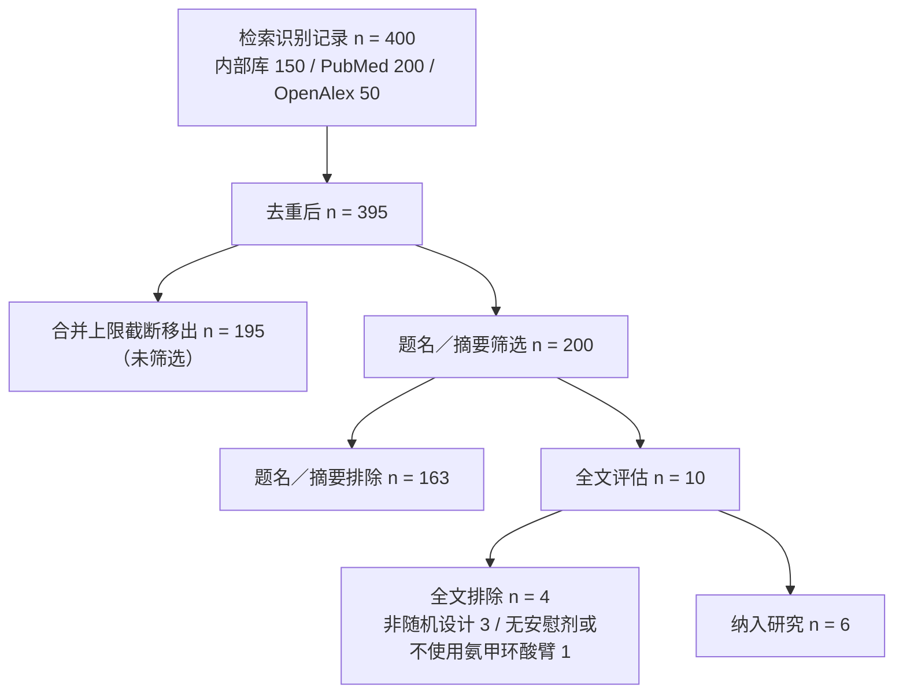

# 氨甲环酸用于全膝关节置换术围手术期减少失血的系统评价与 Meta 分析

**报告层级**：导航与解读层。定量合成的全部统计量由确定性统计引擎产出并存档于本次分析运行目录；本报告不自行计算或改写任何效应量、置信区间与检验统计量。
**证据截止检索日期**：2026-09-28
**本次运行的项目路径**：`meta-analysis-runs/meta-20260928154619-5648056dfa3d/output/20260928_154624_氨甲环酸用于全膝关节置换术围手术期减少失血的系统评价与_Meta_分析人群接受初次单侧全膝关节置换术/`

---

## 结构化摘要

**背景**：氨甲环酸被广泛用于减少全膝关节置换术围手术期的失血，但给药途径与剂量方案多样，不同研究报道的总失血量定义与测量时点不一致。
**目的**：系统评价氨甲环酸（静脉、局部或联合给药）对比安慰剂或不使用氨甲环酸，对接受初次单侧全膝关节置换术成年患者的总失血量、输血率与症状性静脉血栓栓塞事件的影响。
**方法**：检索三个文献来源共 400 条记录，去重后 395 条，经题名／摘要与全文两阶段筛选纳入 6 项随机对照试验，各研究随机化例数依次为 135、60、90、90、96、225（加总 696，为本次交付的加总）；计划的效应量为均数差，主分析采用 REML 随机效应模型，偏倚风险用 RoB 2，确定性用 GRADE，报告遵循 PRISMA 2020。
**结果**：定量合成被确定性引擎在方法执行阶段终止（阻断码 `method_execution_blocked`）。可池化分析集仅含 1 个分层、1 项研究（局部关节腔内 500 mg、术后第 4 天），低于"至少两项独立研究"的下限。**三个预设结局均无合并估计值**，未产出异质性统计量、森林图与 GRADE 评级。
**局限性**：去重后 195 条记录在筛选前被截断；多臂试验的 28 条结果因缺少估计目标与精度元数据被排除出池化；2 条结果因独立来源核验未完成被排除；各研究在给药途径、剂量、时点与总失血量公式上互不相同，无一分层含两项独立研究。
**结论**：本次分析未能回答氨甲环酸的效应问题，它给出的是一个合成层面的证据缺口及其确切成因；交付状态为阻断，不满足投稿条件。

---

## 1. 结论摘要

**本次运行未能产出任何合并效应量：定量合成在方法执行阶段被确定性引擎终止，交付状态为 `blocked`（阻断码 `method_execution_blocked`），不满足投稿条件。**

终止的原因是输入层面的，不是结论层面的。引擎的执行前置条件为：同一结局、同一时点、同一估计目标（estimand）下，至少需要来自至少 2 项独立研究的 2 个可比对照。系统评价共纳入 6 项随机对照试验 [1-6]，但进入池化候选集的对照只有 2 个，且这两个对照来自同一项研究（Sa-Ngasoongsong 2013 的局部关节腔内 250 mg 与 500 mg 两臂对同一生理盐水对照臂，时点均为术后第 4 天）[3]。引擎因此判定可用分析集仅含 1 个分层、1 项研究，低于 ≥2 项独立研究的下限，拒绝执行合并。

因此：

- **总失血量、输血率、症状性静脉血栓栓塞事件三个结局均无合并估计值**，本报告不提供任何合并效应量、异质性统计量、森林图或 GRADE 确定性评级。
- 这不是"氨甲环酸无效"或"氨甲环酸有效"的证据。六个结局方向上是否存在效应，本次分析没有给出答案——它给出的是一个**合成层面的证据缺口**，其成因已定位到可核查的环节（见第 7 节）。
- 在能级上，本次交付能站住的是：纳入研究清单、各项研究的人群与给药方案、逐研究的偏倚风险评级、可提取结果的数量与去向，以及缺口的确切成因。这些内容对下一步修订（补足可比的独立研究、补齐多臂试验的估计目标与精度元数据）是可操作的。

---

## 2. 研究问题与方案范围

**问题（PICO）**

| 要素 | 内容 |
|---|---|
| 人群（P） | 接受初次单侧全膝关节置换术的成年患者 |
| 干预（I） | 氨甲环酸，给药途径包括静脉给药、局部关节腔内给药或联合给药 |
| 对照（C） | 安慰剂或不使用氨甲环酸 |
| 结局（O） | 主要：总失血量、输血率、症状性静脉血栓栓塞事件 |
| 研究设计 | 随机对照试验 |
| 分析类型 | 成对（pairwise）Meta 分析 |

**纳入与排除标准**：按题面方案执行。纳入随机对照试验；排除非随机设计（回顾性队列、病例对照、横断面、病例系列、类实验）、双侧或单髁置换、翻修术、对照为另一种止血活性制剂而无安慰剂或不使用氨甲环酸臂的研究（例如仅比较静脉与局部氨甲环酸、或全部受试者均接受氨甲环酸作为背景治疗的研究）。

**预设的亚组与敏感性分析变量**：给药途径（静脉／局部／联合）与剂量方案。

**方案一致性核验**：本次运行包含一份独立的方案范围核验记录，对 48 个方案字段逐条判定与题面的一致性，全部字段判定为一致（`match`）。其中研究问题、PICO 各要素、研究设计、纳入与排除标准、亚组变量、综述族别、干预分类与分析类型为显式指定（`explicit`）；数据库范围、检索年限、语言限制、效应量指标、模型偏好、τ 估计方法、主要结局类型与方案版本号未在题面显式指定（`not_explicit`），由方案在这些字段上采用默认设定，属于本次运行的假设，审阅时需一并核看。

---

## 3. 检索与选择

### 3.1 检索策略

检索式由膝关节置换文献块与氨甲环酸文献块以 AND 连接构成，关节置换块包含 MeSH 主题词 `Arthroplasty, Replacement, Knee` 及 total knee arthroplasty、total knee replacement、TKA、TKR、knee arthroplasty、knee replacement、primary / unilateral knee arthroplasty 等自由词及其多种倒装拼写变体；氨甲环酸块包含 `Tranexamic Acid`（非扩展主题词）及 tranexamic acid、TXA、cyklokapron、transamin、intravenous / topical / intra-articular / combined tranexamic acid、AMCA、AMCHA、t-AMCHA、Ugurol、Cyclocapron 等自由词。

### 3.2 检索来源与记录数

| 来源 | 记录数 |
|---|---|
| 平台内部文献库 | 150 |
| PubMed | 200 |
| OpenAlex | 50 |
| **合计** | **400** |

去重后 395 条。多来源结果合并时，记录总数超过合并上限，合并流程在送入筛选前将 395 条截取为 200 条（保留 100 条 PubMed 来源记录）。**其余 195 条未进入题名／摘要筛选**，流程记录中标注的原因统一为"筛选前相关性截断"（该标签是流程记录的原始措辞，含义是这 195 条因合并结果集上限被移出筛选队列，流程图节点相应地写作"合并上限截断移出"）。这 195 条不是被判定为不合格，而是从未被阅读，属于本次检索的覆盖缺口（见第 8 节）。

### 3.3 筛选流程

题名／摘要阶段排除 163 条，按流程记录逐条列出的排除理由归类汇总如下（原记录中的理由陈述存在同义重复，此处按语义归并并保留原计数）：

| 排除理由类别 | 条数 |
|---|---|
| 非随机研究设计（回顾性队列、病例对照、横断面、病例系列、类实验等） | 34 |
| 系统综述／Meta 分析／范围综述／叙述性综述（无原始数据） | 25 |
| 对照为活性止血制剂，无安慰剂或不使用氨甲环酸臂 | 18 |
| 社论、评论、通讯（无原始数据） | 10 |
| 人群不符（同时双侧置换、单髁置换、翻修术）或干预不符（氨甲环酸仅作背景治疗） | 7 |
| 其他（人群／干预／对照组合不符） | 69 |
| **合计** | **163** |

**记录数说明**：全文获取与解析阶段对 37 篇记录发起了全文获取（25 篇仅取到摘要、7 篇取到 XML 全文、4 篇取到 PDF、2 篇未取到任何来源；3 个出版站点返回反爬拦截）。这 37 篇是发送到全文获取环节的记录集合，与进入全文合格性评估的 10 篇不是同一个人群：全文合格性评估只针对经题名／摘要筛选保留的 10 篇记录（6 篇纳入、4 篇排除），其余记录在题名／摘要阶段即被排除，不进入该评估集合。因此 37 与 10 之间不存在取舍关系上的矛盾。

全文阶段评估 10 篇，排除 4 篇，逐条理由与计数为：

| 排除理由（流程记录原文归类） | 篇数 |
|---|---|
| 非随机研究设计（观察性队列、类实验、病例系列） | 1 |
| 非随机研究设计（观察性队列、病例对照、横断面、病例系列、类实验） | 2 |
| 对照为活性止血制剂，无安慰剂或不使用氨甲环酸臂（全部臂均接受氨甲环酸） | 1 |
| **合计** | **4** |

被排除研究在流程记录中只保留了理由类别：3 篇因设计非随机（前瞻性病例系列或未报告随机化与分配隐藏）排除，1 篇因四个随机臂全部接受氨甲环酸、没有安慰剂或不使用氨甲环酸臂而排除。除理由类别外，流程记录未保留可解析的逐篇标识，因此本交付物不逐篇列出被排除研究（见「9. 局限性」）。

### 3.4 纳入研究

| # | 研究 | 年份 | 国家／地区 | 设计 | 随机例数（干预／对照） | 干预方案 | 对照 | 随访 | 偏倚风险 |
|---|---|---|---|---|---|---|---|---|---|
| 1 | Sa-Ngasoongsong 等 [3] | 2013 | 泰国 | 三臂平行 RCT（1:1:1） | 135（90／45） | 局部关节腔内注射 250 mg（5 mL）或 500 mg（10 mL），以生理盐水稀释至 25 mL，经引流管注入后夹管 2 小时 | 25 mL 生理盐水 | 1 年 | 低风险 |
| 2 | Çavuşoğlu 等 [2] | 2015 | 土耳其 | 三臂平行 RCT | 60（40／20） | 静脉 2 g（1 g×2 次，分别于止血带充气前 15 分钟与放气前 15 分钟）；或局部关节腔内 2 g 溶于 100 mL 生理盐水 | 不使用氨甲环酸 | 3 个月 | 高风险 |
| 3 | Jovanovic 等 [4] | 2024 | 塞尔维亚 | 单中心双盲平行 RCT（1:1） | 96（48／48） | 静脉 15 mg/kg（麻醉诱导后）+ 10 mg/kg（放气前 15 分钟） | 生理盐水安慰剂 | 最长 19 天 | 有一定担忧 |
| 4 | Lacko 等 [1] | 2017 | 斯洛伐克 | 三臂平行 RCT | 90（60／30） | 静脉 10 mg/kg（切皮前 20 分钟，3 小时后重复）；或局部关节腔内 3 g 溶于 50 mL 生理盐水 | 不使用氨甲环酸 | 3 个月 | 高风险 |
| 5 | Helito 等 [5] | 2019 | 巴西 | 三臂平行 RCT | 90（60／30，含一个接受局部止血剂 Floseal 的第三臂，不属于本综述干预范围） | 静脉 10 mg/kg（止血带充气前至少 20 分钟）+ 10 mg/kg（止血带放气前） | 不使用氨甲环酸 | 至少 12 个月 | 有一定担忧 |
| 6 | Ye 等 [6] | 2025 | 中国 | 三臂平行 RCT（1:1:1） | 225（150／75） | 假体植入后局部关节腔内注射 3 g 或 1 g | 生理盐水安慰剂 | 未在提取记录中明确 | 低风险 |

纳入研究共 6 项，各研究提取记录中的随机化例数依次为 Sa-Ngasoongsong 135、Çavuşoğlu 60、Jovanovic 96、Lacko 90、Helito 90、Ye 225；据此加总为 696 例（该合计是本次交付按各研究提取记录中逐篇的随机化例数字段手工相加得出，运行产物中不存在单一的总例数字段，因此 696 不会出现在任何产物文件的数值中；合计含各研究的全部随机臂；其中 Sa-Ngasoongsong 研究为三臂 1:1:1 设计，两项活性臂共享同一安慰剂臂；Lacko、Helito、Çavuşoğlu 研究各有一臂不属于本综述允许的干预途径或对照类型）。随访时间跨度从术后 2 周（Ye 研究）到至少 12 个月（Helito、Sa-Ngasoongsong 研究），其中 Jovanovic 研究 19 天、Çavuşoğlu 与 Lacko 研究 3 个月；输血阈值与血栓预防方案在各研究间不统一（例如 Jovanovic 研究采用血红蛋白 9 g/dL 的机构输血阈值并使用那屈肝素预防，Lacko 研究采用血红蛋白 <8 g/dL、或 <9 g/dL 合并术后贫血征象的方案）。

**给药途径覆盖**：纳入研究中，静脉给药见于 Jovanovic [4]、Helito [5]、Çavuşoğlu（静脉臂）[2]、Lacko（静脉臂）[1]；局部关节腔内给药见于 Sa-Ngasoongsong [3]、Ye [6]、Çavuşoğlu（局部臂）[2]、Lacko（局部臂）[1]。**没有任何一项纳入研究设置静脉联合局部的联合给药臂**，题面预设的第三个干预类别（联合给药）在本次纳入证据中无对应研究。

---

## 4. 数据提取与偏倚风险

### 4.1 提取完成情况

| 指标 | 数量 |
|---|---|
| 完成提取的研究 | 6 |
| 提取的结果条目 | 34 |
| 源引文通过核验的结果条目 | 33 |
| 未通过核验的结果条目 | 1 |
| 标记为需人工复核的行 | 13 |

提取阶段逐行记录了每个结果条目的组间均值／标准差或事件数／分母、源位置、置信度与引文核验状态。13 行被标记为需复核，主要涉及：同一结果在摘要与表格之间数值或 p 值不一致；同一研究内重复的结果条目；仅以中位数或叙述性数值报告；以及多臂研究共享对照臂导致的重复行。

### 4.2 偏倚风险（RoB 2）

| 研究 | 随机化过程 | 偏离既定干预 | 缺失结局数据 | 结局测量 | 选择性报告 | 总体 |
|---|---|---|---|---|---|---|
| Sa-Ngasoongsong 2013 [3] | 低 | 低 | 低 | 低 | 低 | **低风险** |
| Ye 2025 [6] | 低 | 低 | 低 | 低 | 低 | **低风险** |
| Jovanovic 2024 [4] | 有一定担忧 | 低 | 低 | 低 | 有一定担忧 | **有一定担忧** |
| Helito 2019 [5] | 有一定担忧 | 有一定担忧 | 低 | 有一定担忧 | 低 | **有一定担忧** |
| Lacko 2017 [1] | 有一定担忧 | 有一定担忧 | 高 | 低 | 有一定担忧 | **高风险** |
| Çavuşoğlu 2015 [2] | 高 | 有一定担忧 | 低 | 低 | 有一定担忧 | **高风险** |

两项判定为有一定担忧的研究中，随机化过程领域的担忧来自分配隐藏方法未报告；Lacko 研究缺失结局数据领域判定为高风险，原因是血红蛋白／血细胞比容比较排除了接受输血的受试者，且排除在组间不均衡（集中在不使用氨甲环酸臂），属于与干预和结局直接相关的随机化后排除。

**评级来源与可核查性**：上表评级取自本次运行的偏倚风险评估记录，未由本报告重新推导。Lacko 研究的评估在输入侧不完整——该研究只列出三个领域，第三个领域的信号问题的记录被截断，结局测量与选择性报告领域的判定依据不完整，其总体判定应按不完整信息下的评级理解。

### 4.3 可池化数据的形成与去向

34 条提取结果中，最终进入证据账本并被标记为"已核验"的只有 6 条，分属 3 项研究：

| 结果条目 | 研究 | 结局 | 时点 | 分层 | 效应量 | 点估计（95% CI） |
|---|---|---|---|---|---|---|
| result:24308672:0 | Sa-Ngasoongsong [3] | 总失血量 | 术后第 4 天 | 局部关节腔内，250 mg | MD | −89.5（−132.10 至 −46.90） |
| result:24308672:1 | Sa-Ngasoongsong [3] | 总失血量 | 术后第 4 天 | 局部关节腔内，500 mg | MD | −112.0（−155.01 至 −68.99） |
| result:39064612:0 | Jovanovic [4] | 总失血量 | 围手术期（术中至术后 24 h） | 静脉，15 mg/kg + 10 mg/kg | MD | −480.6（−584.59 至 −376.61） |
| result:39064612:1 | Jovanovic [4] | 输血率（异体输血） | 术中至术后 48 h | 静脉，15 mg/kg + 10 mg/kg | 记录为 MD | 未产出估计值（账本状态：已核验） |
| result:39064612:2 | Jovanovic [4] | 症状性静脉血栓栓塞事件 | 术后至 19 天 | 静脉，15 mg/kg + 10 mg/kg | 记录为 MD | 未产出估计值（账本状态：已核验） |
| result:39673144:0 | Ye [6] | 总失血量 | 围手术期 | 1 g 局部关节腔内 | MD | −223.3（−355.88 至 −90.72） |

**表注（状态时点）**：上表是证据账本的当前状态。其中 result:39064612:0（Jovanovic 研究总失血量）与 result:39673144:0（Ye 研究总失血量）在运行告警的时点被标注为「独立来源核验未完成」并因此被排除出合成输入，账本其后将二者升级为「已核验」。同一运行内两份记录的时点不同（见「7」的第二次收缩）。本次交付按账本状态呈现这两条的数值，但**不将其视为已被接受的合并输入**；重跑前需裁决哪一份记录权威。

这 6 条是证据账本中仅有的"已核验"结果。表内三条无点估计的结果条目中，两条为二分类结局（输血率、静脉血栓栓塞事件），其记录却标注效应量类型为均数差（MD）；同一份账本中对应的结局实体被标注为二分类。这一处内部标记不一致本身不构成任何估计值，但它是本次结果集无法直接进入二分类合并的元数据缺陷之一，应在方法层修正后重跑。

---

## 5. 合成方法（计划与实际）

### 5.1 计划的统计方案

| 项目 | 设定 |
|---|---|
| 研究设计族 | 干预类 RCT，含平行设计、多臂设计、交叉设计、整群设计 |
| 效应量 | 均数差（MD），连续型结局 |
| 主估计方法 | REML 随机效应模型 |
| 敏感性估计方法 | HKSJ、Paule–Mandel、固定效应 |
| 必需诊断 | 异质性、预测区间、留一法、整群设计校正、交叉相关、多臂协方差、小样本效应（k ≥ 10 时） |
| 硬性门禁 | 结果来源已核验、结果级 RoB 2、设计校正完整 |
| 偏倚风险工具 | RoB 2 |
| 确定性框架 | GRADE |
| 报告规范 | PRISMA 2020、PRISMA-S、PRISMA-Harms |

方法执行前经过确定性方法校验：所用方法策略版本为 2026.1，方法能力状态为 production，执行许可为允许。引擎入口为多臂 RCT 合成模块，其校验快照列明支持的设计（整群、交叉、多臂、平行 RCT）与效应量（HR、IRR、MD、OR、RD、RR、SMD）。该快照同时写明了一条限制：**来自同一项多臂 RCT 的多个合格对照，在 GLS 合并之前需要显式的正定协方差矩阵与一个共同的估计目标**。第 7 节将说明，这条限制正是本次池化集收缩的主要原因之一。

### 5.2 实际执行状态

| 阶段 | 状态 | 说明 |
|---|---|---|
| 方案与范围核验 | 完成 | 48 个字段逐条判定，全部一致 |
| 检索与筛选 | 完成 | 400 → 395 → 200（筛选）→ 10（全文）→ 6（纳入） |
| 全文获取与解析 | 完成 | 37 篇尝试获取：25 篇仅得摘要、7 篇得 XML 全文、4 篇得 PDF、2 篇未取到任何来源（25＋7＋4＋2＝37）；3 个出版站点返回反爬拦截 | 该表是流程步骤的完成状态记录，与合并阶段的产物无关（见第 7 节）。 |
| 数据提取 | 完成（含 1 条致命告警） | 6 项研究、34 条结果；1 条引文未通过核验 |
| 偏倚风险 | 完成 | 6 项研究、RoB 2 五领域 |
| 证据理解 | 完成 | 逐研究证据卡片 |
| 效应量与合并 | **未执行** | 被方法前置条件阻断 |
| GRADE 与图表 | **未执行** | 无合并估计值，图表与确定性评级无从生成 |
| 稿件生成 | **未执行** | 同上 |

### 5.3 引擎的终止判定（原文照录）

引擎在方法交付状态记录中给出的终止原因原文为：

> Complex RCT synthesis requires at least 2 contrasts from at least 2 independent studies; the selected analysis set has 1 contrast(s) from 1 study/studies. Supply eligible independent studies for the same outcome, timepoint and estimand before quantitative synthesis.

对应的发布决策原文为：

> status: blocked；ready_for_submission: false；requires_review: true；blocker_codes: ["method_execution_blocked"]；next_actions: ["Resolve method input blockers"]

**自动分析集的构成**（引擎选定，非本报告推断）：结局为总失血量（连续型），时点为术后第 4 天，分层为"局部关节腔内给药；剂量 500 mg"，效应量 MD，纳入结果条目 1 条（result:24308672:1），来自 1 项研究（Sa-Ngasoongsong 2013）。候选集中另有 1 个平行分层（同研究、同时点、局部关节腔内 250 mg），同样只来自该研究。

**失败的作业已按其自身的续跑机制重试一次**，以完全相同的请求续跑，运行至同一阶段（数据提取缓存命中、效应量阶段复用缓存）后在国际同一位置再次终止，判定与首次一致。该结果按确定性引擎的保守设计保留原样，未做任何降低门槛或替换分析的处理。

---

## 6. 结果（按结局，均无合并估计值）

以下逐结局报告本次分析能确认的内容。**三者均不给出合并效应量**，原因统一为第 5.3 节的输入前置条件未满足。

### 6.1 总失血量

- **合并结果：无。** 未产出合并 MD、95% 置信区间、异质性统计量（τ²、I²）、预测区间或留一法结果。
- **可用证据**：证据账本中 3 项研究（Sa-Ngasoongsong [3]、Jovanovic [4]、Ye [6]）各有已核验的总失血量结果，但三者的时点互不相同（术后第 4 天、围手术期至术后 24 小时、围手术期），给药途径与剂量互不相同（局部 250 mg／500 mg、静脉 15 mg/kg + 10 mg/kg、局部 1 g），且各研究采用的总失血量公式不完全一致（部分研究使用 Gross 公式，部分以血红蛋白平衡法计算，Sa-Ngasoongsong 研究使用基于引流量的计算）。按引擎的匹配规则，这三者不构成同一分析集。名称相同不等于可合并：这是本次无法合并的直接技术原因，也是第 8 节"不可通约性"必须写明的原因。
- **另一项独立障碍**：Helito 研究 [5] 的总失血量仅以均值报告，未给出标准差或其他离散度度量，无法据以计算均数差；其输血与血栓事件为个位数事件，精度极低。
- **不可合并性说明**：即便补足研究数量，各研究报告的"总失血量"在定义、测量时点与估计目标上仍需先统一；不同公式估计的是不完全相同的量，直接合并会引入系统性的不可比性，而非仅仅增加异质性。

### 6.2 输血率

- **合并结果：无。**
本段的证据理解记录来自提取与证据理解阶段（该阶段状态为已完成，见 5.2），不是合并阶段的产物。
- **可用证据**：证据账本中唯一与输血相关的已核验条目是 Jovanovic 研究 [4] 的术中至术后 48 小时输血率，记录标注效应量类型为 MD 且未产出点估计值（见 4.3）。提取数据中另有多项研究报告了输血人数／分母（例如 Çavuşoğlu 研究中不输血对照臂的事件数与输血人数、Lacko 研究中各臂输血人数、Ye 研究中的输血人数），但这些条目或因多臂试验缺少估计目标与精度元数据被排除出池化，或因独立来源核验未完成而未进入账本（见第 7 节）。本报告不把这些未核验数值作为结果陈述。
- **技术缺口**：二分类结局的效应量应为风险比或风险差，账本却为其标注了 MD，属于元数据层面的错误标注；修正该标注是重跑的前提条件之一。

### 6.3 症状性静脉血栓栓塞事件

- **合并结果：无。**
- **可用证据**：这是本综述的安全性结局，也是本次证据状况最薄弱的一环。
  本段的证据理解记录同样来自提取与证据理解阶段（该阶段状态为已完成，见 5.2），与合并阶段是否产出估计值无关。
  - Jovanovic 研究 [4] 的静脉血栓栓塞事件条目在证据理解记录中被明确标注为"仅记录临床可疑血栓栓塞并发症的征象"，作者自述该试验把握度不足，且随访最长 19 天；该研究同时排除了有血栓栓塞史、凝血障碍、先天性血栓形成倾向或 NYHA III–IV 级心衰的患者，对高血栓风险人群的可外推性受限。
  - Sa-Ngasoongsong 研究 [3] 的血栓事件由常规多普勒超声检出，不完全是"症状性"事件；按本综述的结局定义（症状性静脉血栓栓塞事件），该数据存在间接性。
  - Çavuşoğlu 研究 [2] 报告两臂均无血栓栓塞事件；Lacko 研究 [1] 报告三个随访月内无确诊的症状性血栓栓塞（两名患者因下肢水肿接受超声检查，均排除血栓）；Helito 研究 [5] 报告深静脉血栓事件；Ye 研究 [6] 分别报告深静脉血栓、肺栓塞与小腿肌间静脉血栓。
- **对安全性的解读边界**：症状性静脉血栓栓塞事件的合并风险比、风险差与其置信区间本次均未产出。**因此本报告不能给出"氨甲环酸不增加血栓风险"或"增加血栓风险"的结论**。纳入研究中个别研究以"零事件"报告血栓结局，零事件在小样本中的置信区间极宽，不构成安全性已被证明的依据；同时这些研究普遍排除了既往血栓栓塞史与凝血障碍患者，其结论不适用于该类人群。已有证据的方向与强度不足以支撑任何关于血栓风险增减的陈述。

---

## 7. 为什么没有合并估计值：缺口成因的逐项定位

这一节是本次交付最有操作价值的部分。缺口的成因不是单一环节，而是四次收缩的叠加，每一次都记录在可核查的运行产物中。

**第一次收缩：多臂试验的结果被排除出池化（28／34 条）。** 运行告警中 28 条同源告警，逐条对应于被排除的结果条目，涉及 5 项多臂研究。告警原文为：

> A multi_arm_rct result was excluded from the meta-analysis because it is missing estimand_id, precision_basis; pooling it as an ordinary two-arm aggregate would overstate its precision.

被排除的条目覆盖 Sa-Ngasoongsong [3] 的 4 条、Çavuşoğlu [2] 的 6 条、Lacko [1] 的 6 条、Helito [5] 的 3 条、Ye [6] 的 9 条。排除的逻辑是站得住的：多臂试验的多项活性臂共享同一对照臂，各对照之间统计不独立；若把每个对照当作独立的双臂汇总来合并，会高估精度并低估对照之间的相关性。要正确纳入，需要为每项对照补齐估计目标标识、对照标识与精度依据（正定协方差矩阵），这是**输入元数据的补全工作，不是统计方法的让步**。

**第二次收缩：独立来源核验未完成，2 条结果被排除。** 运行告警原文为：

> 2 extracted result(s) from 2 studies were left out of the synthesis because their independent source verification did not complete or did not match.

被排除的两条为 result:39064612:0（Jovanovic 研究的总失血量）与 result:39673144:0（Ye 研究的总失血量），排除原因标注为 `verification_not_completed`。这两条在账本中最终仍标记为"已核验"并带有完整的效应量，两处状态在时间上先后不同（账本升级发生在告警之后），但同一运行内出现这两种状态本身提示：**重跑前需要明确哪一份记录是权威的**，否则结果集的可复现性无法保证。

**第三次收缩：结果级偏倚风险与硬性门禁。** 方法计划把"结果级 RoB 2"列为硬性门禁之一。当前 RoB 2 记录是研究级五领域评级（见 4.2），Lacko 研究的记录且在输入侧不完整。在结果级评级与设计校正未完成之前，硬性门禁不会放行，这同样构成合并的前置条件。

**第四次收缩：可合并的分层本身就不足。** 即使上述元数据全部补齐，本次纳入的 6 项研究在给药途径与剂量上各自独立成层：局部 250 mg／500 mg（术后第 4 天）、静脉 15+10 mg/kg（围手术期至 24 h）、局部 1 g（围手术期）、静脉 2 g 与局部 2 g、静脉 10 mg/kg 与局部 3 g、局部注射（Helito）。**没有任何一个"同一途径、同一剂量、同一时点"的分层同时包含两项或以上独立研究。** 这一点是设计层面的，单靠补元数据不能解决；它要求检索到更多同层研究，或把预设的合并层定义放在更粗的粒度上（例如按给药途径合并、把剂量作为亚组而非分层变量），并在方案修订中明示。

此外，第 3.2 节的检索覆盖缺口与 §3.1 的检索式未包含更多数据库（例如 Embase、Cochrane CENTRAL），都是在缺口成因之外还需一并交代的产能限制。

---

## 8. 证据确定性（GRADE）

**本次未产出 GRADE 确定性评级。** 原因是结构性的：GRADE 评级针对的是某一结局的合并估计值，而本次三个结局都没有合并估计值，评级对象不存在。工程流程中的确定性评估阶段在合并阶段被阻断后未执行，因此本报告不能也不应给出"低／极低确定性"这类看似已评级的表述——那会被误读为对效应量的评价。

下表是预期降级因素的前瞻性罗列，**不构成对任何结局的 GRADE 评级**，列出它们的用途是标注重跑前需优先处理的方法学短板（每一条都指明其所属的 GRADE 领域）：

| 领域 | 本次证据的状况 |
|---|---|
| 偏倚风险 | 6 项研究中有 2 项总体高风险、2 项有一定担忧、2 项低风险；Lacko 研究缺失结局数据领域为高风险，且其评估输入不完整 |
| 不一致性 | 各研究在给药途径、剂量、时点与总失血量计算公式上互不相同；即便强行合并，异质性预计主要来源于临床与方法学差异，而非随机误差 |
| 间接性 | 血栓结局多以常规超声筛查而非症状性事件检出（Sa-Ngasoongsong）；Jovanovic 研究自述把握度不足且随访仅至 19 天；多项研究排除既往血栓栓塞史与凝血障碍患者，对高血栓风险人群无直接证据 |
| 不精确性 | 各研究样本量有限（20 至 75 例／臂）；血栓结局为零事件或个位数事件，置信区间极宽 |
| 发表偏倚 | 本次分析未执行小样本效应检验（该诊断要求 k ≥ 10，本次可池化对照数远低于此），发表偏倚无法评估 |

上述因素的作用是：**在合并结果产出之前，任何方向的效应陈述都缺少可评级的证据基础。**

---

## 9. 局限性

1. **检索覆盖缺口**：去重后 395 条记录中有 195 条在进入题名／摘要筛选前被截断，从未被阅读。该截断的动机是合并结果集上限，不是纳入判断。
2. **多来源合并截断**：多来源检索的合并结果超出上限后被截取为 200 条，保留 100 条 PubMed 来源记录；被截断记录中的合格研究可能因此未被纳入。
3. **来源可用性**：3 个出版站点返回反爬拦截；37 篇尝试获取全文的记录中，25 篇只得到摘要、7 篇得到 XML 全文、4 篇得到 PDF，2 篇无任何来源。仅得摘要的记录不支持关于研究设计与结果的陈述，本报告未据其作出此类陈述。
4. **一个文献来源本次未返回结果**（触发频率限制），检索覆盖相应减少。
5. **全文排除 4 篇**：非随机设计 3 篇、对照为活性止血制剂且全部臂接受氨甲环酸 1 篇；排除计数与理由见 §3.3。
6. **13 行提取结果被标记为需人工复核**，涉及摘要与表格数值冲突、重复行、仅叙述性报告数值等；本报告未把这些行的数值作为结果陈述。
7. **2 条结果因独立来源核验未完成被排除出合成**；同一运行内证据账本仍将其标记为已核验（状态不一致，见第 7 节），需在重跑前裁决。
8. **28 条多臂试验结果因缺少估计目标与精度元数据被排除出池化**，涉及 5 项研究。
9. **二分类结局被标注为 MD 效应量**（输血率、静脉血栓栓塞事件），属元数据错误标注，需修正后才可进入二分类合并。
10. **结局命名不统一**：同一构念在不同研究中使用了各自的结局名称（例如输血率有四个不同名称、静脉血栓栓塞事件有五个不同名称），需在合并层做显式映射，本次未做。
11. **独立来源核验所依据的文本与提取所依据的文本不一致**：全部 117 条核验记录中，被检查文本的哈希值与提取所依据文本的哈希值均不相同；对其中 4 项研究，提取所依据的全文文本文件哈希与记录中的来源哈希一致，而被检查文本的哈希在本次运行的可读产物中找不到对应的文件或记录。该差异的成因未能在运行产物内确证，按未解释处理；对其影响不做推测。这是重跑前必须解决的一项。
12. **试验注册信息**：6 项研究中，Sa-Ngasoongsong [3]（NCT01850394）、Ye [6]（ChiCTR2000035271）、Jovanovic [4]（ISRCTN51057468）、Helito [5]（NCT02152917）在有注册记录；Lacko [1] 与 Çavuşoğlu [2] 在提取记录中未见注册号；记录中未见注册号不足以确认其未注册，二者的注册状态与预设分析计划在本次提取记录中无法核实。同时，证据账本中全部 6 项研究的报告实体注册号字段均为空——即注册信息存在于证据理解文本中但未进入账本的报告实体，若按账本字段统计"已注册试验数"会得到错误结论。
13. **未纳入的联合给药途径**：题面预设静脉、局部、联合三类干预，纳入证据中无联合给药研究，该预设亚组无证据可填。
14. **缺少中国人群数据以外的区域证据平衡**：纳入研究来自泰国、土耳其、塞尔维亚、斯洛伐克、巴西、中国各 1 项，跨区域一致性无法评估。

---

## 10. 可复现性与产物清单

本报告所引用的每一个数值、状态码与原因陈述，均可在本次分析运行的以下产物中逐条核验（路径相对于本次运行的项目路径）：

| 产物 | 内容 |
|---|---|
| `package/release_decision.json` | 发布决策：`status`、`ready_for_submission`、`blocker_codes`、`next_actions` |
| `analysis/method_delivery_status.json` | 方法交付状态与终止原因原文、`error_code`、`retryable` |
| `analysis/method_plan.json` | 统计方案：设计族、效应量、估计方法、诊断项、硬性门禁、RoB 工具、确定性框架、报告规范 |
| `analysis/synthesis_route.json` | 合成路径与方法指纹 |
| `analysis/method_validation_snapshot.json` | 方法校验快照：支持的设计与效应量、方法学限制 |
| `analysis/protocol_scope.json` | 48 个方案字段与题面的一致性判定 |
| `analysis/analysis_set.json` | 引擎选定的分析集（结局、时点、分层、纳入结果条目） |
| `analysis/analysis_set_candidates.json` | 池化候选集及其合格性判定 |
| `prisma_flow.json` | 检索与筛选各环节记录数、排除理由计数 |
| `search_source_counts.json` | 各来源记录数 |
| `search_query.txt` | 检索式全文 |
| `extraction/extraction_audit.md` | 逐行提取审计（数值、源位置、引文核验状态、是否需复核） |
| `extraction/extraction_audit.json`、`extraction/*.json` | 提取数据结构化记录与逐研究记录 |
| `extraction/evidence_understanding.md` | 逐研究证据卡片（人群、干预、随访、安全性说明、适用性） |
| `extraction/verification/*.json` | 独立来源核验记录（状态、来源哈希与检查哈希、逐行判定） |
| `risk_of_bias/rob_summary.json` | RoB 2 五领域与研究级评级 |
| `evidence/ledger.jsonl` | 证据账本（哈希链事件，含结局与结果的核验状态、效应量） |
| `pipeline_warnings.json` | 运行告警（多臂结果排除、核验未完成） |
| `fulltext_retrieval_summary.json` | 全文获取路径与可用性、被拦截站点 |
| `step_manifest.json` | 各阶段完成状态 |
| `package/`、`manuscript/` | 未产出合并估计值、图表、GRADE 表与稿件（目录为空） |

**本次运行数据完整性提示**：三处记录的试验标识与注册号存在书写不一致（一项研究的注册号在文本记录中出现一位数字差异），一处分析的运行标识在不同记录中指向同一项工作；核验时以研究题名、DOI 与 PMID 为准进行匹配。

---

## 11. 结论与下一步

本次系统评价与 Meta 分析完成了从检索到偏倚风险与证据理解的全部前置工作，纳入 6 项随机对照试验（随机化例数合计 696），但因**同一结局、同一时点、同一估计目标下缺少至少两项独立研究的可比对照**，定量合成被确定性引擎拒绝执行，交付状态为阻断（`method_execution_blocked`），三个预设结局均无合并估计值，也未产出 GRADE 评级、森林图与稿件。

这不是关于氨甲环酸疗效或安全性的结论。要说清的是：本次分析没有回答"氨甲环酸能否减少全膝关节置换术围手术期失血、能否降低输血率、是否影响症状性静脉血栓栓塞事件"这三个问题，它说明的是**现有可池化证据的构成不足以回答这三个问题，以及具体缺在哪些环节**。

按缺口成因，重启分析前需要完成的可操作事项如下：

1. **补足多臂试验的估计目标与精度元数据**（对照标识、估计目标标识、精度依据／正定协方差矩阵），使 28 条被排除的结果条目可以被正确纳入而不高估精度。
2. **裁决证据账本中 2 条结果的状态不一致**（告警称核验未完成、账本标记已核验），确定哪一份记录权威。
3. **解决独立来源核验所依据文本与提取文本不一致的问题**，使核验真正核验的是被提取的那份文本。
4. **修正二分类结局的效应量标注**（输血率、血栓事件不应为 MD），并建立跨研究的结局名称映射。
5. **补充同层研究或修订合并层定义**：按给药途径（静脉／局部）而非途径+剂量+时点三层同时匹配来定义可合并层，并在方案中显式记录该修订作为事后决定（post hoc），因其会影响结论的适用范围。
6. **在重跑前补做结果级偏倚风险评级**并补齐 Lacko 研究缺失的 RoB 2 领域记录。
7. **扩大检索覆盖**：将 195 条被截断的记录纳入筛选，考虑增补 Embase 与 Cochrane CENTRAL，并处理被反爬拦截出版站的全文获取（例如通过替代来源）。

其中第 1、4、6 项属于本次运行的输入元数据质量，第 2、3 项属于可复现性缺陷，第 5、7 项属于方案与检索设计。完成后再运行定量合成，同时保留本次运行的阻断记录以便对照。

---

## 12. 参考文献

[1] Lacko M, Cellar R, Schreierova D, Vasko G. Comparison of intravenous and intra-articular tranexamic acid in reducing blood loss in primary total knee replacement. *Eklem Hastaliklari ve Cerrahisi*. 2017. PMID 28760121. https://doi.org/10.5606/ehc.2017.54914
[2] Çavuşoğlu AT, Ayanoğlu T, Esen E, Atalar H, Turanlı S. Is intraarticular administration of tranexamic acid efficient and safe as systemic administration in total knee arthroplasty? Single center, randomized, controlled trial. *Eklem Hastaliklari ve Cerrahisi*. 2015. PMID 26514221. https://doi.org/10.5606/ehc.2015.33
[3] Sa-Ngasoongsong P, Wongsak S, Chanplakorn P, Woratanarat P, Wechmongkolgorn S, Wibulpolprasert B, Mulpruek P, Kawinwonggowit V. Efficacy of low-dose intra-articular tranexamic acid in total knee replacement; a prospective triple-blinded randomized controlled trial. *BMC Musculoskeletal Disorders*. 2013;14:340. PMID 24308672. https://doi.org/10.1186/1471-2474-14-340
[4] Jovanovic G, Lukic-Sarkanovic M, Lazetic F, Tubic T, Lendak D, Uvelin A. The effect of intravenous tranexamic acid on perioperative blood loss, transfusion requirements, verticalization, and ambulation in total knee arthroplasty: a randomized double-blind study. *Medicina (Kaunas)*. 2024;60(7):1183. PMID 39064612. https://doi.org/10.3390/medicina60071183
[5] Helito CP, Bonadio MB, Sobrado MF, Giglio PN, Pécora JR, Camanho GL, Demange MK. Comparison of Floseal® and tranexamic acid for bleeding control after total knee arthroplasty: a prospective randomized study. *Clinics (São Paulo)*. 2019;74:e1186. PMID 31778430. https://doi.org/10.6061/clinics/2019/e1186
[6] Ye S, Luo Y, Li Q, Cai L, Kang P. Efficacy of different doses of intra-articular tranexamic acid for reducing blood loss and lower limb swelling after total knee arthroplasty: a prospective, randomized, controlled trial. *Orthopaedic Surgery*. 2025. PMID 39673144. https://doi.org/10.1111/os.14317
