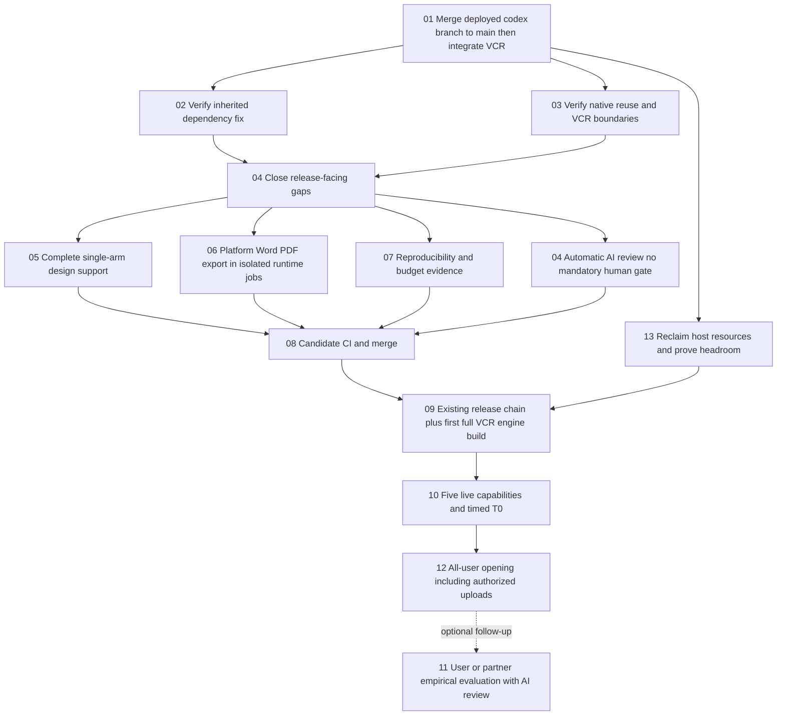

# DSH Native Reuse and Virtual Clinical Research Production Integration Plan

> **For agentic workers:** Use the installed `executing-plans` skill to implement this plan task by task. If the owner authorizes delegated execution, use `subagent-driven-development` with explicit file ownership. Steps use checkbox syntax for tracking. This document authorizes no execution by itself.

**Goal:** Preserve the currently deployed platform branch, merge it into main before integrating Virtual Clinical Research (VCR), provide platform-wide Chinese Word/PDF export, and make VCR's complete AI-driven research and user-data-upload workflow available to all authenticated platform users after technical acceptance.

**Architecture:** Keep the existing hosted web/control-plane/DSH boundary. DSH owns agent execution and native runtime mechanisms; EviMed owns research contracts, study authorization, deterministic numerical jobs, usage and delivery. Reuse the platform AI review service and run shared document conversion in restricted jobs using the existing runtime image, outside the web container. VCR is the first client of the platform export facility.

**Tech Stack:** React/TypeScript/Vite; Node 22.22.0; pnpm 9.4.0; PostgreSQL; pinned DSH 0.1.7-rc.2; R 4.3.3; Python/FastAPI; Docker Compose; existing MCP, domain, harness-port and socket packages.

**Status (2026-10-03):** Source integration is on `codex/extension-center-20261002` through `951752345`, including frontier PR #3 and the result/replay release history. Both the production baseline and VCR history are verified ancestors. The combined branch is not yet merged into main. Production still serves `62faa8a00234`; VCR remains disabled there. Final candidate Web (`a41971281e1e`), runtime (`0d936480f496`), six current specialist images, VCR and result replay images are loaded on the native host but have not replaced serving containers. Local full regression and actual isolated browser/rendering/numerical checks are recorded separately from live delivery. Actual plugin document read/write now succeeds; full extension qualification, candidate migration/mint, production browser and exports, VCR S2-to-S4 workflows and source-current capability receipts remain open. No all-CI, all-user availability or final-delivery claim is made.

**Owner decisions confirmed in this conversation:**

- Merge `codex/platform-followups-20260929` into main first, then integrate VCR on that merged baseline. Preserve every deployed platform change.
- Word and PDF exports are a **platform-wide capability**, with VCR as the first consumer; complete them before broad VCR availability. Keep Chromium/Pandoc out of the web image.
- The final audience is **all platform users**, including authorized user uploads, matching and the existing research/recruitment workflows. Do not add tiered audience switches or hide patient-data upload behind a preview list.
- Clinical/statistical review is AI-driven by default. No mandatory clinician, statistical reviewer, human signature, partner dataset or expert-intervention step may hold the workflow or broad opening. Users may later choose whether and whom to involve.
- Reclaim space and capacity on the existing shared host before deployment; do not provision an independent compute node in this plan.
- Remove G10 visit-schedule/regulatory-contact features, G16 public prediction links and G18 recruitment-material review/publication surfaces from the initial release rather than building them now.
- Remove the PTC experiment from this plan. PTC evaluation and DSH 0.2 adoption require separate work; neither is a release dependency.
- Prefer native DSH capabilities over custom implementations; do not build facilities that the pinned runtime already supplies.
- Preserve usable research and completed artifacts when advisory review cannot reach certainty. Invalid numerical inputs still must not produce invented results.

## 1. Verified baseline and evidence limits

Repository root: `/Users/wangzeyuan/Desktop/EviMedScience`. Paths below are relative to that root unless a task says that commands run from `OpenScience/`.

| Item | Evidence and its scope |
|---|---|
| Authoritative active remote | `origin = https://github.com/anonymous-temp/EviMed-Science.git`; Gitee is configured as `legacy-gitee` |
| Repository main, not the production baseline | `233c033f36f15a5f85b8ca406932d329d918895d` |
| Production branch | `origin/codex/platform-followups-20260929` |
| Production baseline | `c6c2a7f14855509d3db463299d6fc0d0ad185b43`; the owner verified this release is serving. The repository ref and dependency contents were independently checked while revising this plan. Re-read live release identity before execution. |
| Production-only changes | 311 commits beyond main; 763 changed files, 43,457 added and 6,657 deleted lines, confirmed from repository refs |
| VCR branch | `origin/feature/virtual-clinical-research` |
| VCR head | `174a33e661ad942435b2afacd46cd81e81534e1d` |
| Ancestry and conflicts | VCR contains the old main, but not the deployed platform branch. A merge simulation of the production branch and VCR reports the ten conflict paths listed in Task 01. The earlier no-conflict claim is withdrawn as a release conclusion. |
| VCR diff against old main only | 444 changed paths, 143,266 added lines, 235 deleted lines, including fixtures/design assets. Recompute the actual integration diff against the production-preserving baseline. |
| Existing PR | No PR for this head branch was returned by `gh pr list` during preparation. The supplied `/pull/new/…` URL is a creation form, not an opened PR. |
| Last hosted workflow | [Run 36689642955](https://github.com/anonymous-temp/EviMed-Science/actions/runs/36689642955), code revision `b82cb38bff039b2a2b300327e7fa28f789ef55e7` |
| Hosted jobs inspected | `vcr-r-library`, `vcr-engine`, `vcr-seam`, `gallery`: success. `web`: failed at production dependency audit. Frontend typecheck/test/build and `docker-hosted`: skipped. Hosted production E2E: failed. |
| Difference after that run | `b82cb38bf..174a33e66` changes only `docs/superpowers/specs/2026-09-30-vcr-status-and-gaps.md`. This explains the evidence relationship; it does not certify a later integration commit. |
| Dependency correction already deployed | Production branch pins brace-expansion 1.1.21 / 2.1.7 / 5.0.12. Task 02 inherits and verifies this fix; it does not regenerate a competing lockfile. The old VCR workflow's audit failure is historical, not current production state. |
| Release state | Source defaults remain disabled, audience `operators`; five VCR `realDelivery` entries remain `not-run`. No production enablement was performed or independently established here. |
| Local environment limitation | The current checkout's installed DSH packages include an older 0.1.2 generation. Read the pin and use a clean, frozen-lockfile installation for execution; do not treat these installed packages as evidence for 0.1.7. |
| Host capacity, owner-measured | Four cores, about 15 GiB RAM with about 2 GiB available; disk 96% used with 8.3 GiB free; more than eight other products share the host. These measurements are owner-supplied, not a fresh host probe from this planning task. Task 13 remeasures before any expensive operation. |
| Actual release sequence, owner-verified | `build-release.sh` -> host incremental build -> `host-engine-delta.sh` -> `manifest3.sh` -> `host-release-switch.sh`; first VCR engine use additionally needs a full engine build because no delta base exists. |

The handoff reports domain 551/551, frontend 1718/1718, engine numeric 108/108, engine service 49/49 and real engine seams 13 + 21 with no skips. These are historical results, supported in part by the inspected hosted job conclusions; this planning task did not rerun them. Acceptance titles and a green ledger are not substitutes for executing the behavior.

Read these **from the VCR branch**, not the untracked older proposal in the main checkout:

1. `docs/superpowers/specs/2026-09-28-EviMed虚拟临研平台方案.md` — product proposal v2.0 and AC-01–AC-38.
2. `docs/superpowers/specs/2026-09-28-vcr-build-contract.md` — build decisions.
3. `docs/superpowers/specs/2026-09-29-vcr-integration-contract.md` — prior integration decisions; amend its reviewer/opening/export assumptions to the owner's decisions above during implementation.
4. `docs/superpowers/specs/2026-09-30-vcr-status-and-gaps.md` — remaining engineering and partner dependencies.
5. `OpenScience/docs/EVIMED_RELEASE_AND_DELIVERY_CHECKLIST.md` — release evidence home.

The owner's decisions in this revision override conflicting older proposal/checklist language. Amend those existing documents in the implementation commit so they cannot reintroduce partner-data or human-review release gates.

The local checkout contains pre-existing uncommitted planning files and a modified `OpenScience/PROGRESS.md`. Preserve them. Before execution, use the managed worktree tools to inspect and reuse a suitable checkout or create a separate one. Do not switch or reset this dirty checkout, overwrite the untracked v1 proposal, or cherry-pick only finishing commits while omitting either branch's history. Never deploy the old main plus VCR while excluding the 311 production commits.

## 2. Delivery states and completion criteria

| State | Meaning | Audience |
|---|---|---|
| S0: production-preserving baseline | Deployed codex branch merged into main; live features and dependency fix preserved | Existing production behavior unchanged |
| S1: integrated | VCR merged into that baseline with conflicts resolved and candidate CI validated | VCR defaults disabled |
| S2: private deployed acceptance | Real stack, engine, data plane and runtime are running; live tests use disposable authorized accounts/projects | `ENABLED=true`, `AUDIENCE=operators`, explicit preview accounts only |
| S3: technically accepted release | Live AI research, upload/data-plane path, automatic AI review and platform Word/PDF pass; capacity and recovery measured | Still private until the operational switch; no partner or human-review prerequisite |
| S4: available to all | Ordinary accounts can upload their authorized data and complete the AI-driven research/matching/package flow without a human reviewer | `ENABLED=true`, `AUDIENCE=all`; no per-feature audience split |

S2 resolves a wording problem in the old checklist: a module cannot remain literally disabled while exercising its real routes. Enable it privately on the acceptance stack, with general users excluded. Broad availability waits for S3.

**The combined task is complete only at S4 with technical evidence.** A merged branch, visible menu, engine health response, operator-only deployment or T0-only opening does not satisfy the user's goal. Partner-specific empirical studies may remain unmeasured and run after opening. Label those limitations honestly; do not convert them into access gates or claim synthetic/AI agreement is human clinical validation.

All-user visibility never grants access to other studies or patient data. Existing tenant isolation, source-use authorization, secret protection and numerical validity remain enforced; they are not new expert-review gates. Plan freeze and permissible seal transitions run automatically as already designed. Users may optionally invite human collaborators. AI review is labelled as AI and never masquerades as a clinician's signature or empirical validation of a disease model. Actual external patient contact still requires the user's applicable contact authorization; this plan creates no patient messaging channel.

## 3. Runtime ownership: reuse before building

| Concern | Native DSH facility at 0.1.7-rc.2 | Existing EviMed/VCR facility | Work in this plan |
|---|---|---|---|
| Concurrent file mutation | `fs-observation-policy` rejects stale versions; workspace sandbox constrains file effects | Existing collision notices and per-deliverable submission ownership | Verify native protection and explicit handoff; add narrow product ownership only for a reproduced loss. Do not write a generic file-lock service. |
| Session write ownership | JSONL backend holds a kernel-backed cross-process lock for one session | Runtime controller and session dispatch | Use native session ownership. Product duplicate dispatch is tested at the control-plane boundary. |
| Tasks and dependencies | Experimental Agent Teams has owners, DAG edges and revision CAS; write scopes are advisory | `evimed_plan`, `evimed_delegate`; VCR seven-step program | Keep the current product state authoritative for this release. Evaluate future substitution separately; never dual-write authoritative DAGs. |
| Frozen execution inputs | Session request history and child descriptors | VCR scenario/input hashes, method versions, seed, execution/result manifests and lineage | Prove complete linkage across the existing records. No parallel generic `spec.json` registry. |
| Context recovery | Native session logging, history reconstruction and interrupted-turn closure | harness-port injection, socket state and run projections | Add integration acceptance for our consumers, not another session log or replay engine. |
| Batch calling | Native `dsh-tools` PTC presentation and sandboxed Node execution | PTC executor exists in image baseline; EviMed preset does not select PTC | Keep current presentation. PTC experimentation is outside this plan; no custom SDK generator, VM or worker pool. |
| Numerical analysis | Not a DSH statistical responsibility | `vcr-engine`, signed results, fixed R library and deterministic random streams | All numerical truth stays in the engine; PTC never replaces it. |
| Tenant, money and external effects | Tool policy primitives, not EviMed business authority | PostgreSQL permissions, usage reserve/settle, VCR CPU budgets and job state | Reuse these stores and test their boundaries. |

The pinned native subagent start request inherits the parent's workspace and does not expose a `writeScopes` argument. Do not invent that argument in harness-port. Team write-scope overlap warnings are not hard isolation. Bash and direct Node filesystem writes do not gain file-tool version checks merely because an observer plugin is mounted.

Keep DSH **0.1.7-rc.2** for the VCR integration baseline. Upstream 0.2.0-rc.2 is available, but adopting it is a separate versioned change with seam probes, golden frames, migration checks and a release receipt. A critical demonstrated upstream defect may justify moving the baseline; if so, repeat the affected acceptance on the new pin. Do not mix a speculative kernel upgrade into the module merge.

Native references inspected for this decision:

- [File observation policy](https://github.com/deepseek-ai/deepseek-harness/blob/dsh-v0.1.7-rc.2/packages/fs/fs-observation-policy/README.md).
- [Session write lease](https://github.com/deepseek-ai/deepseek-harness/blob/dsh-v0.1.7-rc.2/packages/session/session-persistence-jsonl/src/lease.ts).
- [Agent Teams DAG and advisory scopes](https://github.com/deepseek-ai/deepseek-harness/blob/dsh-v0.1.7-rc.2/docs/subsystems/agent-team.md).
- [Persistence and interrupted-turn semantics](https://github.com/deepseek-ai/deepseek-harness/blob/dsh-v0.1.7-rc.2/packages/session/session-persistence/README.md).
- [Native PTC tool presentation](https://github.com/deepseek-ai/deepseek-harness/blob/dsh-v0.1.7-rc.2/packages/core/tools/README.md) and [Node PTC runtime](https://github.com/deepseek-ai/deepseek-harness/blob/dsh-v0.1.7-rc.2/packages/ptc-runtime/ptc-runtime-node/README.md).
- [Upstream 0.2.0-rc.1 recovery changes](https://github.com/deepseek-ai/deepseek-harness/releases/tag/dsh-v0.2.0-rc.1) and [0.2.0-rc.2](https://github.com/deepseek-ai/deepseek-harness/releases/tag/dsh-v0.2.0-rc.2).

## 4. File ownership and integration map

| Unit | Existing files / directories | Responsibility |
|---|---|---|
| Platform dependencies and CI | `OpenScience/package.json`, `OpenScience/pnpm-lock.yaml`, `.github/workflows/web.yml` | Preserve the deployed fix; exact-candidate evidence and complete jobs |
| Domain | `OpenScience/packages/domain/src/vcrVocabulary.mjs`, `vcrScenarioSchemas.mjs`, `vcrEngineJob.mjs`, `vcrContracts.mjs`, `vcrRules.mjs`, `vcrLineage.mjs`, `vcrSuppression.mjs` | One definition of supported methods, schemas, lineage and model-safe output |
| Composition and routes | `OpenScience/apps/server/src/vcrComposition.mjs`, `vcrRoutes.mjs`, `vcrService.mjs`, `server.mjs`, `config.mjs` | Module wiring, feature admission and browser/API shape |
| Research orchestration | `OpenScience/apps/server/src/vcrOrchestrator.mjs`, `vcrWorker.mjs`, `vcrJobs.mjs`, `vcrStore.mjs`, `vcrPersistence.mjs` | Existing seven-step program, jobs, leases, executions and versioned records |
| Data and access | `OpenScience/apps/server/src/vcrDataPlane.mjs`, `vcrDataStore.mjs`, `vcrAccess.mjs`, `vcrSeal.mjs`, `vcrMembers.mjs` | Patient data stays outside runtimes; source corrections and grants |
| Evidence and operations | `OpenScience/apps/server/src/vcrEvidence.mjs`, `trialRegistryClient.mjs`, `vcrMatching.mjs`, `vcrRecruit.mjs`, `vcrContact.mjs` | Evidence, criteria, referrals, contact authority and follow-up |
| Reporting | `OpenScience/apps/server/src/vcrRender.mjs`, `vcrViews*.mjs`, `vcrGateway.mjs` | Stored numbers, cover state, export presentation |
| Shared export adapter | `OpenScience/apps/server/src/documentExport.mjs`, `documentExportWorker.mjs`, `productPersistence.mjs`, `productJobs.mjs`; domain export contract and common artifact UI | One platform facility for VCR and existing document-producing capabilities; control plane schedules and authorizes only |
| Isolated renderer | `OpenScience/runtime/skills/office/shared/render_document.py`, office DOCX/PDF wrappers; existing runtime image and privileged controller | Deterministic short-lived rendering jobs outside the web process, reusing installed Chromium and CJK fonts |
| AI review | `OpenScience/apps/server/src/reviewService.mjs`, `reviewWorker.mjs`, VCR review storage/views/orchestrator | Automatic version-bound clinical/statistical AI checks, advisory findings, optional later human review |
| Engine | `项目代码/vcr-engine/R/`, `service/`, `tests/`, `Dockerfile`, `README.md` | Statistics, cancellation, checkpoints, authenticated service and signed results |
| Web | `OpenScience/apps/web/src/app/virtual-research/`, `components/vcr/`, `lib/vcrClient.ts`, `lib/vcrBodies.ts`, sidebar and router | Four research workflows, seven tabs, documents, roles and ordinary-user entry |
| Runtime integration | `OpenScience/packages/harness-port/`, `OpenScience/packages/socket/`, `OpenScience/runtime/mcp/evimed-research/vcr_platform.py` | Native DSH adaptation and bounded VCR gateway calls |
| Capabilities | `OpenScience/capabilities/vcr-{protocol,evidence,analysis,matching,package}/`, matching `capability-skills/` and generated runtime manifests | Five product capabilities; no second statistical implementation |
| Ops and acceptance | `OpenScience/scripts/vcr/`, `OpenScience/deploy/web/`, `OpenScience/deploy/runtime-dsh/`, `OpenScience/evals/vcr-*/`, acceptance ledger and release checklist | Build, migrations, private live tests, opening, rollback and evidence |

These are responsibility boundaries, not instructions to split every large existing file. Scope any extraction to code actually changed. Keep all `@deepseek-ai/*` imports inside harness-port. If parallel execution is later authorized, a single integrator owns shared domain vocabulary, manifests, lockfiles, `server.mjs` and release configuration.

## 5. Sequence and dependencies



Task 13 is now resource reclamation and is required **before Task 09**. Task 11 is optional empirical follow-up and is not a predecessor of broad opening. The earlier PTC experiment has been removed; no PTC trials are scheduled or budgeted here. Task 14 records expansion limits.

Remove the G10, G16 and G18 surfaces for first release; do not implement their missing workflows. G7 input provenance and active-path G19 corrections remain scoped technical work. Hide only these deferred features, never ordinary users' patient-data upload, matching or existing recruitment ledger. Expansion work is not claimed as delivered.

## 6. Task 01 — Preserve production, merge codex into main, then integrate VCR

**Files:** Read repository rules and the four VCR documents listed in section 1. Update only the existing status document and release checklist when new facts are established.

- [x] Inspect managed worktrees and preserve current work. Use a clean integration checkout based on main for the production reconciliation; do not start from the old VCR head and treat it as the deployment base.
- [x] Read the live release identity and fetch all three branches. If the deployed branch advanced past `c6c2a7f14855`, preserve the new deployed head too; do not silently pin an obsolete live baseline.

```bash
git fetch origin main codex/platform-followups-20260929 feature/virtual-clinical-research
git rev-parse origin/main origin/codex/platform-followups-20260929 origin/feature/virtual-clinical-research
git rev-list --count origin/main..origin/codex/platform-followups-20260929
git diff --shortstat origin/main...origin/codex/platform-followups-20260929
git merge-tree --write-tree --name-only --no-messages origin/codex/platform-followups-20260929 origin/feature/virtual-clinical-research
```

Expected at the recorded refs: 311 production commits, 763 changed paths and ten conflict files. The merge simulation's conflict exit is expected; it updates no branch/index/working tree, although it can write temporary Git objects. It is not a completed integration.

- [x] Merge the full deployed codex branch into main through the normal reviewed path and record the resulting main SHA. In that resulting tree, verify the already-deployed dependency patch and runtime/review/usage changes remain present. This source reconciliation does not require a standalone redeployment of unchanged production behavior.
- [x] Base the VCR integration branch on the reconciled main and merge VCR there. Resolve conflicts semantically; never apply a whole-file `ours`/`theirs` choice to generated registries, tool routes or acceptance records.

| Conflict path | Required resolution |
|---|---|
| `OpenScience/PROGRESS.md` | Retain both branches' milestone lines in date order |
| `OpenScience/apps/server/src/runtimeGatewayEntry.mjs` | Preserve live authentication/routing behavior and add VCR's gateway path |
| `OpenScience/packages/domain/index.mjs` | Preserve all live exports and add VCR exports once |
| `OpenScience/packages/domain/src/capability-contracts.json` | Reconcile authoritative capability definitions, then regenerate/check the combined registry |
| `OpenScience/packages/domain/src/capability-display.json` | Preserve live display changes and add VCR module-only entries |
| `OpenScience/evals/acceptance-ledger.json` | Keep newer production receipts; retain VCR not-run records until actual validation |
| `OpenScience/evals/capability-audit/test_acceptance_ledger.py` | Keep production evidence semantics and VCR vocabulary/coverage |
| `OpenScience/apps/server/test/agentRegistry.test.mjs` | Assert the combined real capability set |
| `OpenScience/apps/server/test/server.test.mjs` | Retain live behavior and test the VCR-enabled/disabled composition |
| `OpenScience/apps/server/test/uiWalk.test.mjs` | Preserve current navigation assertions and add VCR entry behavior |

- [x] Before candidate release, prove both source histories are ancestors of the actual candidate. Resolve changes explicitly if later edits supersede a production behavior; do not lose it by conflict choice.

```bash
# Run in the merged candidate checkout, not the unchanged main working directory.
git merge-base --is-ancestor c6c2a7f14855509d3db463299d6fc0d0ad185b43 HEAD
git merge-base --is-ancestor 174a33e661ad942435b2afacd46cd81e81534e1d HEAD
```

- [ ] Correct the status document's full-branch size and distinguish the last green VCR jobs from the untested integration head.
- [ ] Keep the committed v2 proposal, assets and contracts. Preserve the main checkout's untracked v1 proposal; do not treat it as a replacement for v2.
- [ ] Record the integration source SHAs and the current operator-owned deployment/backup identifiers in the release checklist, without secrets.

**Exit:** Main contains the deployed codex history; the VCR candidate is based on that main and contains both histories, all ten conflicts resolved and no rollback of the 311 live commits. Record live, reconciled-main and combined-candidate SHAs separately.

## 7. Task 02 — Inherit and verify the already-deployed dependency fix

**Preserve/verify:** `OpenScience/package.json`, `OpenScience/pnpm-lock.yaml` from the production branch. No new dependency patch is planned here.
**Verify:** `.github/workflows/web.yml`, existing dependency audit and web regression suites.

The implementation portion of this task is complete on production at `c6c2a7f14855`. Merging the codex branch carries the following overrides and their lockfile into main:

```json
{
  "brace-expansion@1": "1.1.21",
  "brace-expansion@2": "2.1.7",
  "brace-expansion@5": "5.0.12"
}
```

These match the patch versions for [GHSA-q2hr-2g5m-vwhr](https://github.com/advisories/GHSA-q2hr-2g5m-vwhr). Preserve the production lock; do not regenerate a competing lockfile, run a forced audit fix or lower the audit threshold. A genuinely new advisory is a separate targeted correction, not a reason to repeat this completed task.

- [x] Verify the combined candidate retains the deployed overrides and resolved lock entries. Keep unrelated pins unchanged.
- [ ] Install with the inherited frozen lock in the isolated candidate and rerun the existing audit and previously skipped frontend checks. This is integration verification, not reimplementation.

```bash
# Working directory: OpenScience/
pnpm --version
node --version
pnpm install --frozen-lockfile --network-concurrency=4 --child-concurrency=2
pnpm audit:dependencies
pnpm typecheck
pnpm test
pnpm build:web
```

**Exit:** The production patch is preserved and candidate checks run successfully. No duplicate dependency-fix commit or gratuitous lockfile churn.

## 8. Task 03 — Verify native reuse and the existing VCR execution boundary

**Read/conditionally modify:** `OpenScience/packages/harness-port/index.mjs`, `seam-manifest.json`, `OpenScience/packages/socket/plugins/run-policy.mjs`, `src/subagentRun.mjs`, `OpenScience/apps/server/src/vcrJobs.mjs`, `vcrOrchestrator.mjs`, `vcrWorker.mjs`, `agentRuns.mjs`, `security.mjs`.
**Tests:** Existing port/socket tests and `OpenScience/apps/server/test/vcrJobs.integration.test.mjs`, `vcrOrchestrator.integration.test.mjs`, `vcrRuntimeBoundary.test.mjs`; add `OpenScience/apps/server/test/vcrNativeRuntime.integration.test.mjs` for real-runtime-only cases.

- [ ] Assert the candidate's runtime composition contains native file observation policy, sandbox, session persistence and PTC executor. Record the effective composition, not only package installation.
- [ ] Reproduce a stale `write/edit` using two sessions. Expect the native stale-version refusal; rereading permits a deliberate subsequent edit. Test parent-after-child handoff separately from simultaneous child writes.
- [ ] Open one existing DSH session for writing from two processes on the same persistence root. Expect the second writer to be refused; termination releases ownership. Do not add a second session lock.
- [ ] Run two VCR workers against the same test study: only one logical engine job and one logical AI dispatch are created for the same schedule key. Inject a disconnect after upstream acceptance but before local acknowledgement; recovery reuses its dispatch/job identity.
- [ ] Cancel a job, expire/reassign its ownership, then deliver an old result. The stale completion must not replace the current execution or consume the budget twice. Preserve valid partial output with its recorded reason.
- [ ] Change an assumption or design version while a job is running. The old result remains attached to the old lineage; the new version is stale/pending until recomputed. Review validity follows the exact result dependencies.
- [ ] Restart during a child run and during an uncertain tool result. Use native history reconstruction and the existing product records. Confirm no invented success, duplicate numerical job, lost completed package or silent reset of submissions.

```bash
# Working directory: OpenScience/; real runtime and disposable PostgreSQL configured.
pnpm --filter @evimed/harness-port test
pnpm --filter @evimed/dsh-socket test
node --test --test-concurrency=1 apps/server/test/vcrJobs.integration.test.mjs apps/server/test/vcrOrchestrator.integration.test.mjs apps/server/test/vcrRuntimeBoundary.test.mjs apps/server/test/vcrNativeRuntime.integration.test.mjs
pnpm verify:seams
```

**Conditional correction rule:** Add a product-specific fence only when one of these cases demonstrates an actual uncovered transition. Keep it in the owning control-plane module and existing PostgreSQL transaction. If deployment is single-writer, document that operating constraint; do not expand the scope into platform-wide active-active operation. A native guarantee that already passes produces evidence, not another implementation.

**Exit:** Existing DSH and VCR mechanisms cover the tested boundary, or narrowly scoped, tested corrections close the demonstrated gaps.

## 9. Task 04 — Close release-facing integration gaps

**Modify:** `OpenScience/packages/domain/src/vcrVocabulary.mjs`; `OpenScience/apps/server/src/vcrViewsKit.mjs`, `vcrViewsTabs.mjs`, `vcrViews.mjs`, `vcrService.mjs`, `vcrComposition.mjs`, `vcrOrchestrator.mjs`, `vcrPersistence.mjs`, `vcrStore.mjs`, `trialRegistryClient.mjs`; existing `reviewService.mjs`/`reviewWorker.mjs` integration; VCR page components and existing documents.
**Tests:** `vcrDomain.test.mjs`, `vcrViews.test.mjs`, `vcrViews.integration.test.mjs`, `vcrIntake.integration.test.mjs`, `trialRegistryClient.test.mjs`, `vcrComposedApp.integration.test.mjs`, frontend VCR panel and intake tests.

- [ ] Remove `parquet` from upload-advertised formats, retaining CSV/TSV/JSON/XLSX. Keep internal engine Parquet reading and its pyarrow bridge intact. An upload attempt returns the existing named unsupported-format response and conversion guidance.
- [ ] Render AI reviewer identity explicitly (review role, model/version and time). Resolve names for human collaborators only when the user elected to involve them. Keep immutable actor identifiers in audit; do not create fictitious clinician accounts for AI review.
- [ ] Show configured/unavailable registry coverage explicitly. A missing ChiCTR credential must not look like a successful search with no trials. Mark list-only records as candidates; do not interpret an ambiguous sample size as an observed baseline.
- [ ] Make all four existing export kinds reachable: `study_package`, `cde_communication_pack`, `simulation_report`, `validation_pack`. Wire each through existing study export authorization and progress, not a second conversation route.
- [ ] Publish method assumptions and method-version-specific numerical validation evidence from the actual release/CI artifact into existing method records. A model-authored validation paragraph must not be displayed as a CI result.
- [ ] Align documentation with `features.vcr`, actual value-source handling, numeric case families through N30 and the accepted Parquet/CSV decisions.
- [ ] Remove initial-release menu items, buttons, runtime skill promises and dispatch hooks for G10 visit schedules/regulatory-contact records, G16 public prediction publication and G18 recruitment-material review/publication. Preserve any existing tables/data for future use. Do not remove the normal data upload, matching, referral ledger, follow-up or research-package functions.
- [ ] Reconcile the integration registry: add VCR worker, five capabilities, engine, trial registry source and five MCP tool entries. The handoff's `outputs/audit/integration/registry/` is not available in this checkout; locate its canonical source on the execution host. If it exists only as an ephemeral artifact, record equivalent entries in the tracked release checklist and retain the run evidence under outputs; do not invent a green registry.

Exact upload vocabulary change:

```javascript
export const VCR_SOURCE_FORMATS = frozen(['csv', 'tsv', 'xlsx', 'json'])
```

**Exit:** No advertised unsupported upload, raw account identifiers, silent registry omission or inaccessible supported export action. Method validation claims point to the exact tested implementation.

### 04a. Automatic AI clinical/statistical review and optional human participation

The owner replaces the earlier mandatory human-review interpretation. Reuse the deployed platform's review service and leased worker; do not introduce another reviewer daemon, human approval queue or patient-feature audience gate.

- [ ] Add explicit AI/human reviewer provenance to existing VCR review records and schema validation. For AI reviews record role, model/version, review configuration revision, referenced result/assumption versions and evidence locations; historical human records keep their actual actor. AI identity is created by trusted code, never accepted as a user-supplied impersonation.
- [ ] Automatically request clinical and statistical AI review where the task needs those perspectives. Use fresh reviewer context; reuse the existing cross-model review configuration where available. For the replacement of AC-36's agreement exercise, use independent AI review passes and report AI agreement as such. No requirement for two doctors or a statistician to sign in.
- [ ] Verify numbers, references, inputs and version dependencies deterministically; use the reviewer model for clinical/methodological interpretation. Feed actionable findings into bounded in-place repair. A disagreement, timeout or exhausted review budget yields visible uncertainty and preserved results, not a mandatory human escalation or blocked delivery.
- [ ] Make model review version-aware through `vcrReviewIsCurrent` and the existing stale graph. Schedule re-review after relevant changes; never reuse a prior review for new results. While re-review is pending, continue research/export and show the actual status.
- [ ] Audit `useCeilingOf`, route role checks, plan/seal transitions, prompts, report covers and job completion for implicit human-signature dependencies. Remove mandatory human-review predicates. AI-reviewed, human-reviewed, numerical verification and empirical model validation remain separate facts; limited validation changes the stated confidence/intended-use description without becoming an extra workflow stop.
- [ ] Let a study creator upload authorized data and proceed as its existing lead. Automatically assist field mapping, declared assumptions and analysis-plan freezing through existing tools, without requiring a separate data manager or reviewer account. Missing facts remain missing; autonomous completion does not authorize fabricating input data.
- [ ] Test a fresh ordinary account with no invited collaborators: upload -> profile/map -> cohort -> analysis/matching -> automatic AI review -> report -> Word/PDF. Test reviewer unavailability and divergent AI findings; both preserve usable output and allow the workflow to finish.
- [ ] Keep human involvement a user-selected addition through existing membership/review UI; no human task is auto-created as a prerequisite. Actual contact consent and budget increases remain the user's authority, separate from scientific review.

**Tests:** Extend `vcrOrchestrator.integration.test.mjs`, `vcrComposedApp.integration.test.mjs`, `vcrViews.test.mjs`, `vcrRoutes.test.mjs`, `reviewService.integration.test.mjs` and the live driver. Update old AC-21/33/36 wording and capability instructions in the same commit. This change must be enforced in code and UI, not only promised in this document.

## 10. Task 05 — Complete the promised single-arm design path

**Modify:** `OpenScience/packages/domain/src/vcrScenarioSchemas.mjs`, `vcrEngineJob.mjs`; `OpenScience/apps/server/src/vcrOrchestrator.mjs`; `项目代码/vcr-engine/R/design_analytic.R`, `design_simulate.R`, `engine.R`, generated `domain-snapshot.json`; `OpenScience/capabilities/vcr-analysis/SKILL.md` and its generated/shared copies.
**Tests:** `项目代码/vcr-engine/tests/numeric/N01_N06_design.R`, `E07`/`E08` cases in their existing numeric files, `N26_schema_agreement.R`, `OpenScience/apps/server/test/vcrEngineContract.integration.test.mjs`, `vcrOrchestrator.test.mjs`.

G1 is an actual product gap, not an instruction to rename a supported two-arm calculation. Implement and verify these distinct contracts:

| Design | Required behavior | Numerical acceptance |
|---|---|---|
| Single-arm exact binary | Explicit null/alternative response rates, sample size, sidedness and success rule; analytic rejection probability and power | Independent exact-binomial reference over boundary and ordinary probabilities |
| Simon two-stage | Preserve current analytic path; simulate stage-one stopping and stage-two decisions under the same declared design | Early-stop probability, type-I error, power and expected sample size agree with the analytic design within MC error |
| Single-arm with external control | Explicit external information, generation/selection model, comparison estimand and analysis rule | Null calibration, bias, coverage, overlap and sensitivity diagnostics; external data uncertainty remains represented |

- [ ] Write failing schema/engine/controller cases for each newly supported design; reject incompatible endpoints by name.
- [ ] Add support one design at a time to the existing registry and handlers; never fall through to a two-arm method. Use independent AI code/statistical review plus numerical reference tests before enabling a new implementation; no external professional sign-off is required to run the product.
- [ ] Preserve deterministic seeds, one-/multi-core equality, checkpoints, cancellation and MCSE. A completed synthetic replicate is never counted as an observed patient.
- [ ] Run numeric cross-checks against independent reference implementations in the test library. Update the lock only if a necessary reference is absent, in its own reviewed change.
- [ ] Regenerate the domain snapshot and capability artifacts. Include a real engine seam case reaching the new method through `vcr_simulate`.

```bash
# Working directory: OpenScience/
bash scripts/vcr/r-library.sh verify
VCR_ENGINE_TESTS=required bash scripts/vcr/verify.sh engine
node --test --test-concurrency=1 apps/server/test/vcrEngineContract.integration.test.mjs apps/server/test/vcrOrchestrator.test.mjs
```

**Exit:** Promised single-arm designs run through the real pipeline with their declared numerical meaning. Unsupported combinations stay clearly unsupported; changing a name is not acceptance.

## 11. Task 06 — Platform-wide Word/PDF/HTML export in isolated runtime jobs

**Create:** `OpenScience/apps/server/src/documentExport.mjs`, `documentExportWorker.mjs`; `OpenScience/runtime/skills/office/shared/render_document.py`; `OpenScience/apps/server/test/documentExport.test.mjs`, `documentExport.integration.test.mjs`; `OpenScience/packages/domain/src/documentExport.mjs` for the shared request/result vocabulary.
**Modify:** Existing `productPersistence.mjs`, `productJobs.mjs`, server composition, artifact/download routes and common file UI; VCR's `vcrRender.mjs`, `vcrService.mjs`, `vcrStore.mjs`, `vcrRoutes.mjs`, `vcrOrchestrator.mjs`, `VcrPackageReader.tsx`; office DOCX/PDF wrappers, runtime image installation and probes; privileged runtime-controller client/server only for a narrow fixed render-job operation if the existing job surface cannot launch it.

**Implementation decision:** One platform export service, first consumed by VCR and available to all existing document-producing capabilities. The control plane authorizes, freezes inputs, schedules and registers results. A short-lived container based on the **existing research runtime image** performs deterministic conversion. It does not start a DSH conversation or hold model/provider keys. Reuse that image's Chromium, Playwright and CJK fonts; add the shared DOCX/HTML converter there only. Do not install Chromium/Pandoc/fonts in the web image, create a standing rendering service or mix document rendering into the R statistical engine.

The existing PDF wrapper loses Chinese through Latin-1 replacement and the DOCX wrapper only writes paragraphs. Replace their implementation with calls into the shared renderer while preserving their supported CLI entrypoints. The VCR report model remains a client adapter; other capabilities must not depend on a VCR study or the VCR feature flag to export a document.

```text
authorized artifact or VCR export request
  -> shared document-export record and leased product job
  -> immutable input document, asset hashes and provenance/cover metadata
  -> controller launches a restricted one-shot container from the runtime image
  -> shared deterministic DOCX / HTML / PDF renderer
  -> output manifest, hashes and format-specific outcomes
  -> platform artifact registration and authorized download
```

- [ ] Define a shared request containing the owning user/project, artifact or study reference, frozen source revision/hash, requested formats and verified local assets. Never accept caller-selected host paths, executable commands, remote URLs or arbitrary converter flags. An export idempotency key includes the source hash, format options and renderer version.
- [ ] Add one `document-export` kind through the existing product job vocabulary and additive migration; add the corresponding document kind only if existing records cannot represent it. Use `ProductJobs` leases/retries instead of a VCR-only rendering queue. Existing VCR export rows reference the shared export ID and keep their study-specific cover.
- [ ] Build VCR's document with `vcrReportModel` and `renderVcrNumbers` from one consistent snapshot. For other capabilities, consume their already-produced canonical document and existing provenance. Conversion must not introduce VCR-specific number-pattern rules into unrelated reports or re-run a research model.
- [ ] Mount only the frozen input directory read-only and that job's empty output/scratch directories writable. Use a read-only container root, disabled network, dropped capabilities, no-new-privileges and measured CPU/RAM/process/deadline limits. Mount no data plane, shared tenant volume, secrets, Docker socket or unrelated project workspace.
- [ ] Keep Docker authority in the existing privileged controller. If a new protocol operation is necessary, make it a fixed render operation with scoped server-resolved paths and a pinned runtime image; update its version, allowlist and tests together. The public web boundary must not gain an arbitrary container/command runner.
- [ ] Use Pandoc inside the runtime image for DOCX/HTML and the existing Chromium/Playwright for PDF. Strip executable HTML, disallow filters/shell escape and remote resources, and verify all image paths/hashes. Cancellation/timeout kills the render job's managed container and releases its capacity slot.
- [ ] Start with global render concurrency one. Rendering and the VCR engine share the host resource admission policy established in Task 13: do not overlap heavy render/compute/build/restore phases when measured headroom cannot support them. Cache completed conversions by their frozen input/renderer identity.
- [ ] Store each format's MIME type, relative artifact location, SHA-256, source hash and completion/error state. Preserve Markdown, JSON/CSV and any successfully generated formats when another conversion fails. Retry only the failed format from the same snapshot; never repeat the research or mark an absent PDF ready.
- [ ] Add the shared download/convert action to the common document artifact UI, with VCR study-package UI as the first adapter. Recheck current project/study access on every download, including after membership revocation. Produce one consistent authorization error, not a file-system path leak.
- [ ] Test VCR and non-VCR documents: Chinese mixed with Latin text/math, headings, citations, long tables, page breaks, figures and missing values. Keep review actor/version, stale findings and evidence limitations on the VCR cover. A review failure never prevents export of a readable, honestly labelled package.
- [ ] Verify every registered document-producing capability can reach the shared export path without a new capability-specific renderer. Run real format/layout checks on representative non-VCR scientific reports and all VCR export kinds; non-document outputs remain in their native format.
- [ ] Compare extracted DOCX/PDF text and numeric tokens to the canonical document; visually inspect CJK glyphs, table continuation and figures. Check that renderer payloads and output files do not accidentally expose internal addresses or secrets.

The installed renderer has a fixed command contract inside the restricted job:

```bash
python3 /opt/evimed/export/render_document.py --input /input/document.json --output-dir /output
```

The runtime-image install step creates `/opt/evimed/export/` from the shared office renderer source. The input includes canonical document text, verified asset descriptors, cover metadata and requested formats; it is not a path to raw patient data. Use the existing runtime install/probe mechanism to verify the script, converter, Chromium and fonts. No web Dockerfile/recipe-hash change is introduced solely to host rendering. Any pre-existing VCR source-copy Dockerfile change is handled by the actual release build recipe, not ignored.

```bash
# Working directory: OpenScience/; rendering integration uses the built runtime image.
node --test apps/server/test/documentExport.test.mjs apps/server/test/vcrRender.test.mjs
node --test --test-concurrency=1 apps/server/test/documentExport.integration.test.mjs
pnpm --filter @ai4s/web exec vitest run src/components/vcr/VcrPanels.test.tsx src/app/virtual-research/VcrStudyPage.test.tsx
```

**Exit:** VCR and ordinary platform reports share working Chinese Word/PDF export; the web container schedules only, the numerical engine remains unchanged by rendering, and normal users can download the results without a mandatory human review.

## 12. Task 07 — Prove reproducibility, recovery and bounded use

**Modify only if a failing case requires it:** `OpenScience/apps/server/src/vcrJobs.mjs`, `vcrStore.mjs`, `vcrOrchestrator.mjs`, `vcrComposition.mjs`, `server.mjs`, `usageLedger.mjs`, `boundedRunBudget.mjs`.
**Tests:** `vcrJobs.integration.test.mjs`, `vcrEngineContract.integration.test.mjs`, `vcrOrchestrator.integration.test.mjs`, existing usage and bounded-run tests.

- [ ] Replay a stored execution from its scenario, input hashes, method version, seed, R/library identity and engine image. Compare numerical outputs within the declared tolerance. Changed/unavailable bytes must produce a named unavailable/mismatch result, not a silently reconstructed input.
- [ ] Exercise process restart, cancellation between batches and resume; completed batches and charged CPU seconds remain attributable to one execution.
- [ ] Verify source correction through upload -> new snapshot -> derived tables -> stale lineage -> recompute, rather than inserting a snapshot row directly in a fixture.
- [ ] Prove review invalidation after a changed dependency, including the downloaded package and method page.
- [ ] Keep CPU limits and money limits separate. Current VCR compute budgets are CPU seconds; those values must never be presented as currency.
- [ ] Verify all VCR model calls are attributed through existing usage reserve/settle. The owner explicitly selected unlimited model spending in the existing conversation. Preserve zero/unlimited `OPEN_SCIENCE_USER_RUN_SPEND_LIMIT`, `OPEN_SCIENCE_USER_DAILY_SPEND_LIMIT` and `OPEN_SCIENCE_USER_WEEKLY_SPEND_LIMIT` and record that operational choice; do not invent finite currency limits. Verify accurate reserve/settle accounting, cancellation and finite compute/render admission separately. Zero means unlimited, never bounded spending.
- [ ] Do not resurrect the removed, unread `OPEN_SCIENCE_VCR_DAILY_BUDGET_CNY`. A module-specific monetary quota is an optional later product decision; if selected, enforce it through the existing usage ledger, including automated steps and child calls, rather than a second money counter.
- [ ] Test a budget refusal as a resumable, explained state. A compute budget confirmation does not authorize patient contact, new data access or higher intended use.

**Exit:** Reproduction is proven above the engine unit-test layer; recovery preserves completed work; all-user compute/render work has enforced resource limits, while model consumption follows the owner's explicit unlimited monetary policy with accurate usage attribution. Any later finite commercial limits require a new owner decision.

## 13. Task 08 — Run candidate CI, review and merge

**Files:** `.github/workflows/web.yml`, existing test configuration only if required; `OpenScience/PROGRESS.md`; existing VCR status/checklist.

- [ ] Provision disposable PostgreSQL and the locked R test library on Ubuntu 24.04 or an equivalent verified image. Use Python 3.12 and the branch's explicit `VCR_PYTHON` fix; do not replace it with the interpreter that previously failed inside R.
- [ ] Run the VCR verifier with `VCR_ENGINE_TESTS=required`; run engine service pytest separately because the verifier's engine section covers numeric cases, not the entire Python service suite.
- [ ] Run the full existing web pipeline and audits with the inherited production dependency fix. Serialize database-sensitive suites or use disposable databases; compare suspected baseline failures against the **production-preserving main**, not the obsolete `233c033f3` tree.

```bash
# Working directory: OpenScience/; VCR_R_LIBS and OPEN_SCIENCE_TEST_POSTGRES_URL are operator-provisioned test settings.
: "${VCR_R_LIBS:?Configure the locked test R library}"
: "${OPEN_SCIENCE_TEST_POSTGRES_URL:?Configure a disposable test database}"
VCR_ENGINE_TESTS=required bash scripts/vcr/verify.sh
VCR_ENGINE_TESTS=required python3 -m pytest ../项目代码/vcr-engine/tests/service -q -rs
pnpm ci:web
pnpm check:capabilities
pnpm check:tool-graph
pnpm check:skill-vocabulary
pnpm check:skill-digests
pnpm check:release-manifest
```

`audit:capabilities` may require the live candidate runtime. Execute that portion against the private candidate stack in Task 10 and retain a truthful pending result until then; do not substitute a stale production receipt or lower the audit's requirement.

- [ ] Trigger `web.yml` on the actual candidate ref when push filters do not cover it. Capture job conclusions by `headSha`; no skipped required frontend, engine or image job counts as success.
- [ ] Make hosted E2E runnable using existing protected repository/environment credentials or an equivalent authenticated candidate deployment. Missing secrets explain failure but do not close the release requirement. Never print or commit the credentials.
- [ ] Review the complete integration diff, with focused numerical, permission/data-plane and TypeScript/JavaScript review for the changed code. Include required specialist reviewers when executing code changes.
- [ ] Open the VCR integration PR against main **after** Task 01's production-branch reconciliation, describing the ten conflict resolutions, retained production features, shared export and AI-review policy. Use a body file and attach the created PR to the Codex chat.
- [ ] Merge through the normal reviewed path and validate the resulting main commit. Recheck deployed-head ancestry and effective behavior after merging. Do not force-push main or substitute the old VCR branch's job result for the combined tree.

**Exit:** VCR is on main with truthful, current evidence and defaults still disabled. Operator-only live acceptance remains explicitly outstanding if not yet run.

## 14. Task 09 — Deploy through the actual release chain after resource reclamation

**Prerequisite:** Task 13's disk and RAM headroom checks are complete. No full R build, runtime-image expansion, restore clone or migration rehearsal starts on the reported 96%-full host before that work.

**Files:** Existing serving-host `build-release.sh` and `manifest3.sh`; host incremental build entry; `OpenScience/scripts/ops/host-engine-delta.sh`, `host-release-switch.sh`; production private compose-override environment merge table; tracked compose/env examples, release manifest, runtime image and VCR engine Dockerfile; `OpenScience/scripts/vcr/migrate-check.mjs`.

`build-release.sh`, `manifest3.sh` and the private override table are owner-confirmed host tooling, not files located in this checkout. Read their installed source/usage and record the actual path/arguments in the existing release checklist before execution. Do not substitute guessed repository scripts or use their names as invented read-only commands.

```text
capacity reclamation and measured headroom
  -> build-release.sh for the production-preserving combined commit
  -> host incremental web/runtime build via the existing release process
  -> first-release full VCR engine image bootstrap (no delta base exists)
  -> host-engine-delta.sh for eligible existing engine images
  -> private override/env merge and complete image identity verification
  -> consistent backup + one isolated restore clone + migration rehearsal
  -> manifest3.sh including the new VCR engine and runtime renderer image identity
  -> host-release-switch.sh to private acceptance configuration
  -> actual runtime/engine/data-plane/export checks
```

The full VCR bootstrap is an explicit first-release step in the established build process, not a replacement for that process. Do not rely on `host-engine-delta.sh` to create an absent base image, and do not treat a skipped VCR engine delta as successful construction.

- [ ] Read the current live release and confirm the combined candidate contains that code. Run `build-release.sh` with its verified revision/release arguments; preserve the current/previous release records and images.
- [ ] Use the actual host incremental build path for web and runtime when its recipe checks allow it. The runtime includes the five VCR capabilities/skills, `vcr_platform.py`, updated embedded UI and shared document renderer. Rendering does not add packages to the web image. A source/recipe change that genuinely requires a full build must be identified and capacity-budgeted, never silently bypassed.
- [ ] Bootstrap `EVIMED_VCR_ENGINE_IMAGE` with one full build using the VCR Dockerfile, fixed R 4.3.3, runtime library lock and CRAN snapshot. Use the host's approved apt/PyPI/CRAN mirrors and low build parallelism. Do not compile concurrently with customer-heavy work, rendering or the restore clone. Record the image digest and successful lock verification.
- [ ] Run `host-engine-delta.sh` for engines with valid bases. Verify how its VCR-aware version handles the bootstrapped image, and preserve the explicitly built VCR tag if no source delta is needed. A missing-image skip remains a failure of readiness until a full image exists.
- [ ] Add every VCR environment key to the **production private override merge table**, not just `.env.example` or base compose. Carry enablement/audience, engine URL/token paths/receipt-key paths, data-plane host/container paths, CPU/job/concurrency settings and `EVIMED_VCR_ENGINE_IMAGE`; include any new shared export resource settings introduced by Task 06.
- [ ] Inspect the effective compose/environment by key names and non-secret image identities only. Prove that values reach the actual web, controller/runtime and engine consumers. Never dump the full merged configuration or environment with secret values into logs.
- [ ] Provision the engine's two distinct secret files and scoped data-plane/job-volume ownership as specified by the integration contract. Verify init completion, signed T0 job output, data-plane read-only engine mount, no runtime data-plane mount and no engine egress/public port.
- [ ] After builds release their working space, take a consistent database/data-plane/job/checkpoint/artifact backup. Restore **one** isolated production-sized clone and run the migration twice on that clone, recording repeatability and outside-module counts. The two migration calls do not require two simultaneous database copies. Preserve the last verified backup and remove only the completed rehearsal clone through its owning tooling after evidence is retained.

```bash
# Working directory: OpenScience/ in the built candidate or its checked-out source.
# Supply the clone URL privately; no production URL or credential is written into the plan.
: "${OPEN_SCIENCE_VCR_MIGRATE_CHECK_URL:?Configure the restored clone}"
node scripts/vcr/migrate-check.mjs
```

- [ ] Inspect the contact-approval constraint against clone data before any production validation. Keep tenant/data authorization; do not conflate this existing access boundary with the removed mandatory clinician/statistician review.
- [ ] Run `manifest3.sh` after final image selection and verify all manifest/image identities, including the first VCR engine and shared renderer's runtime image. Keep source revision, engine protocol and R lock identity in the release evidence; no implicit fallback to an older or absent image.
- [ ] Drain active work and call `host-release-switch.sh` through its verified production invocation. Its `--plan` moves `current`; never treat it as a read-only preview. Initial live acceptance uses `ENABLED=true`, `AUDIENCE=operators`; this is temporary release validation, not a patient-feature restriction.
- [ ] Check `/api/ready`, authenticated engine catalogue/lock, one real signed numerical job, one shared-render job and the embedded UI. Verify unrelated products and already-deployed EviMed features still work after the switch.

Start at numerical-job concurrency one and render concurrency one, with heavy work serialized when the reclaimed host cannot safely run both. Retain separately measured CPU and memory bounds; the branch's 4 GiB engine limit is a capacity requirement to account for, not proof that the host has that memory free. Do not reduce limits merely to make a health check pass while realistic jobs are killed.

**Exit:** The actual release chain deploys a production-preserving candidate; first VCR image, private override propagation, restore rehearsal and shared-render isolation all have evidence. No changes to the serving stack are made by this plan-writing task.

## 15. Task 10 — Real DSH acceptance, report delivery and timed T0

**Modify:** `OpenScience/scripts/ops/hosted-production-e2e.mjs` with a VCR journey or create a focused sibling `OpenScience/scripts/vcr/live-acceptance.mjs` using its authentication/request helpers; `OpenScience/apps/server/test/vcrAcceptance.test.mjs`; existing `OpenScience/evals/vcr-*/briefs.json`, `evals/acceptance-ledger.json` and release checklist.

The VCR brief files currently exist without a dedicated complete live driver. Supply a repeatable driver as part of this task; do not count brief length or an AC number in a test title as a live run.

- [ ] Use authenticated browser/control-plane endpoints to create disposable projects, studies and real capability-bound conversations. Do not call the gateway or R engine directly as a substitute for the DSH path.
- [ ] Run one actual delivery for each of `vcr-protocol`, `vcr-evidence`, `vcr-analysis`, `vcr-matching`, `vcr-package`, including follow-up, changed assumptions, absent data, unknown criteria and a named unavailable tool.
- [ ] Execute at least three actual research briefs on the deployed stack using available public evidence and clearly described uploaded/reference data. These are real end-to-end research requests, not three test titles; no partner-specific funnel is required. Keep the partner-funnel empirical extension separately unmeasured until data exists.
- [ ] Prove all four research entry actions reach configurable workflows, and that research page, conversation, inbox and artifact download refer to the same study and run.
- [ ] Run an ordinary-account upload journey with no invited clinician, statistician or coordinator: supported file upload -> automatic profiling/assisted mapping -> cohort/matching -> deterministic analysis -> AI review -> research package -> Word/PDF. Use known synthetic or permitted de-identified inputs for reproducible technical checks; permit users' real authorized uploads at opening without waiting for a particular partner dataset.
- [ ] Exercise independent clinical/statistical AI review, a timed-out reviewer and a reviewer disagreement. Findings remain version-bound and the AI repairs or explains them within its budget; every case ends with usable output rather than a human approval task. Report AI agreement separately from clinical accuracy.
- [ ] Run AC-35 from one question in a fresh T0 study, with no patient upload, until the complete research package including the owner-required Word/PDF files is downloadable. Record total wall time and each of the seven steps; required total is at most two hours. Do not restart the clock after evidence retrieval or exclude the export phase.
- [ ] Confirm real trial-registry connectivity from the candidate host. Use the existing managed egress/proxy path if needed; do not weaken runtime network isolation. Missing registry credentials or incomplete registry fields remain explicit.
- [ ] Stop only the disposable acceptance engine or inject failure into an isolated candidate instance. Confirm `vcr_simulate` reports unavailability and the conversation preserves completed work. Do not stop the shared production engine for a test after customer jobs exist.
- [ ] Run a synthetic T1 data-plane canary through real DSH/DeepSeek calls. Inspect bounded, restricted acceptance captures for row fingerprints, identifiers, plane addresses and suppressed small cells. Do not enable persistent full-request logging for real patient data.
- [ ] Verify the declared per-person document exception separately: authorization, pseudonymization, purpose, seal and audit must hold; bulk patient tables never become model context.
- [ ] Download DOCX/PDF/HTML as a normal study member; compare text/numbers and visually inspect the files. Revoke membership and confirm subsequent downloads fail through the same route.
- [ ] Also export representative **non-VCR** platform reports through the shared action, with VCR disabled for those projects if applicable. Confirm no VCR study/feature flag is required, and the actual renderer runs outside the web container without data-plane or provider-key mounts.
- [ ] Update five `realDelivery` records only from completed live evidence, including release ID, run IDs and artifact hashes. Record timing, privacy, migration and environment checks in the release checklist, not inside the capability ledger's incompatible schema.

```bash
# Working directory: OpenScience/; protected E2E settings supplied by the deployment environment.
pnpm test:web:e2e
node scripts/vcr/live-acceptance.mjs
pnpm check:acceptance-ledger
pnpm audit:capabilities
```

If implementation extends the existing E2E script instead of creating the sibling, use the existing command alone and update this command table in the same commit. The driver must use the actual routes and response contracts inspected in `vcrRoutes.mjs`; it must not invent a parallel internal API.

**Exit:** Five real capabilities, timed T0, ordinary-account upload-to-package, automatic AI review and shared non-VCR exports pass on the candidate release. Task 12 can then open the full module; partner empirical studies and human participation are not prerequisites.

## 16. Task 11 — Optional real-world evaluation after opening

**Existing owners:** `vcrDataPlane.mjs`, `vcrAccess.mjs`, `vcrMatching.mjs`, `vcrMatchStore.mjs`, `vcrRecruit.mjs`; existing AI review/evaluation services; `OpenScience/evals/vcr-matching/` and the status/checklist documents.

This task is **not a dependency of Task 12**. Users may upload their own authorized real data from first release. Named partner datasets, two independent clinicians and a statistical professional are not launch requirements and are not automatically requested by the product.

- [ ] When a user or partner supplies data, preserve its data dictionary, timing, purpose/field authorization and withheld-period description. Record metadata privately; commit no patient records.
- [ ] Use the released CSV/TSV/JSON/XLSX pipeline without waiting for a hospital connector or extra staff account. AI assists mapping and analysis, then records its clinical/statistical review. Add a source-specific adapter only when an actual new format requires one.
- [ ] Execute the original AC-24 partner-funnel brief and AC-37 empirical backtest when appropriate historical data is available. Mark them unmeasured until then; their absence does not prevent other users' studies or global availability.
- [ ] Replace AC-36's mandatory human-panel procedure with the owner-approved AI review exercise. Use independent AI contexts, preserve model/configuration versions and disagreements, and call the metric AI agreement. Compute recall/false exclusion only against genuinely labelled reference data; AI consensus alone cannot establish clinical accuracy.
- [ ] If the user later elects human review, invite the chosen people through existing membership and append their actual assessments. Do not require a fixed number or specialty mix and do not relabel earlier AI reviews as human ones.
- [ ] For time-sliced enrollment forecasting, report observed coverage of the declared 80% interval only after real outcomes exist. Until then, provide the forecast and its assumptions with empirical coverage explicitly unavailable.
- [ ] Preserve unavailable in-trial treatment/outcomes. Participant withdrawal does not authorize invented treatment assignment or hidden outcomes.
- [ ] Keep evaluation corrections as authorized regression cases in the existing learning/evaluation workflow. They improve the product without creating a new per-study approval queue.

**Exit for a particular evaluation:** Actual outcomes, dataset scope and AI/human provenance are recorded. **Release effect:** none; Task 12 proceeds on Task 10's technical end-to-end evidence even if this task has not received partner data.

## 17. Task 12 — Enable all users, verify operations and retain rollback

**Modify:** Protected deployment configuration, existing release checklist, `OpenScience/docs/WEB_OPERATIONS_RUNBOOK.md` where needed, `OpenScience/PROGRESS.md` after actual milestones.

- [ ] Review section 20's **technical release checks** against the exact deployed images. Record pending empirical observations separately; do not require a partner dataset, two clinical reviewers or a statistical reviewer before opening.
- [ ] Recheck Task 13's already-reclaimed capacity under several ordinary-user sessions with bounded shared rendering/compute admission. Measure queue delay, job completion, model spend, cancellation/export latency and web responsiveness. The chosen approach remains cleanup and serialization on the current host; do not silently change it to a new node.
- [ ] Apply the final operational configuration:

```dotenv
OPEN_SCIENCE_VCR_ENABLED=true
OPEN_SCIENCE_VCR_AUDIENCE=all
```

Repository defaults may remain disabled for unconfigured deployments; the target production deployment must actually use the values above. Apply them through the established release mechanism, preserve unrelated settings and drain active work before recreating services.

- [ ] Sign in with a fresh **non-operator, non-preview** account. Verify `features.vcr`, sidebar/direct route, study creation, authorized real-data upload, profiling/mapping, all four research actions, matching/referral/follow-up functions already in scope, automatic AI review and Word/PDF download. No feature-level preview audience may hide upload or matching.
- [ ] Prove the entire normal flow works without adding a human reviewer, obtaining a clinical/statistical signature or waiting for partner validation. Optional human invitations remain a user's own action. Technical access checks do not become professional-approval requirements.
- [ ] Sign in with a second unrelated account. Confirm it sees its own module but cannot read the first account's study, job, source, artifact, export or runtime gateway context.
- [ ] Confirm the Vue host integration only where that external shell is actually deployed. Hand off the four committed `vue-patch` files to its owning team and verify navigation there; the React hosted app must work independently. Delivery of patches alone is not proof that an external shell has applied them.
- [ ] Verify monitoring and backup coverage for VCR jobs, engine health/catalogue, failed exports, stale results, data plane and checkpoint files. Observe at least one successful backup and one scheduled worker/recovery cycle after opening.
- [ ] Record the final audience, ordinary-account evidence, release/images, cost/capacity observations and rollback target. Do not end the task while the module remains operator-only.

Rollback order:

1. Narrow audience to operators or disable VCR to stop new customer admission; preserve the user's studies and files.
2. Pause new VCR dispatch and drain/cancel running engine jobs through existing APIs, preserving checkpoints and partial results.
3. Revert application/runtime/engine images as a tested set to the recorded **pre-VCR deployed baseline containing `c6c2a7f14855` or its verified successor**, after checking data/protocol compatibility. Never use old main `233c033f3` as the default rollback target. This plan does not downgrade DSH session format.
4. Keep additive VCR tables and volumes. Do not drop the schema or restore the entire shared database as a routine feature rollback.
5. If data corruption is demonstrated, use the rehearsed, scoped recovery procedure and reconcile post-backup writes before restoring service.

**Exit:** S4 is proven using ordinary users, with operational ownership and a tested recovery path.

## 18. Task 13 — Reclaim shared-host resources before Task 09

**Owner decision:** Use the current host after reclamation. No new compute node is authorized or required by this plan. Reclaiming disk alone is insufficient: the reported roughly 2 GiB available RAM also needs to be addressed before adding the engine and document-render jobs.

**Read/use:** Existing release-retention, backup-retention, runtime cleanup and Docker build-cache tooling; serving-host filesystem/container inventory; current and rollback release manifests. Do not create another infrastructure service.

- [ ] Measure each relevant filesystem separately: root, release/build directories, Docker data root, database/backup area and VCR data/job storage. Record free bytes/inodes, RAM availability, swap pressure, running containers, live runtime ownership and baseline latency of the other products. Recheck the owner's 4-core/15-GiB/96%-disk measurements.
- [ ] Inventory reclaimable items by exact ownership and age: completed temporary build directories, obsolete EviMed releases outside retention, superseded unreferenced images, rebuildable build caches, rotated logs and completed rehearsal clones. Account for old release images that are still used by a running runtime or rollback target.
- [ ] Reclaim only identified, unreferenced items through their existing lifecycle tools and retention rules. Preserve live volumes, active checkouts/runtimes, customer uploads, database files, the current/rollback images and the last verified backups. No blanket `docker system prune --volumes`, no cross-product wildcard deletion and no stopping another product merely to make room.
- [ ] Reap only verified orphaned or completed EviMed runtimes/render/build processes to recover RAM. Check owners and active work before termination. Log the reclaimed disk/RAM and verify the remaining services after each class of cleanup.
- [ ] Calculate phase-specific headroom: image layers plus temporary compiler/cache peak during the first R build; database clone plus backup/extraction temporary bytes during restore; numerical-engine peak plus renderer/runtime/OS requirements during service. Keep an explicit measured safety margin and the rollback image. Use the largest simultaneous phase, not an unsupported claim that every phase can run together.
- [ ] Serialize the full R build, runtime-renderer build, restore/migration rehearsal and heavy acceptance runs. Cap build parallelism and final heavy-job admission to protect the other eight-plus products. Clear disposable build scratch before starting the clone; retire the clone before general-user load tests.
- [ ] Demonstrate one representative engine job and one document conversion within the reclaimed limits, sequentially if necessary. Record peaks, latency and absence of OOM/disk exhaustion; do not infer capacity from configured limits or idle `/health` responses.
- [ ] If safe reclamation still leaves inadequate RAM/disk, stop the infrastructure rollout before overcommitting the shared host and report the measured shortfall. Continue source/test work elsewhere as available. Do not silently provision a node, remove another product's data or claim readiness; this is an operational capacity constraint, not a new scientific-review gate.

**Exit before Task 09:** A recorded before/after inventory, explicit build/restore/service capacity budgets, preserved rollback/backups and healthy unrelated products. Task 12 rechecks this envelope under real user load; it does not make the first capacity decision.

The prior 30-run PTC comparison has been removed. A future PTC or DSH upgrade proposal is separate work with its own budget and native-reuse criteria; it has no scheduled tasks in this plan.

## 19. Task 14 — Full gap disposition and expansion work

The handoff uses G1–G22, with G13 folded into P5 and G15 recorded as an accepted implementation decision. Keep every identifier visible; do not claim that all 22 represent unimplemented features.

| Gap | Disposition and owning task | Completion evidence / honest limit |
|---|---|---|
| G1 Single-arm design simulation | Task 05, before broad opening | Exact single-arm, Simon and external-control design cases through the real engine |
| G2 Word/PDF/HTML | Task 06, platform-wide export with VCR first | Actual Chinese documents for VCR and other capability reports, isolated runtime rendering and numeric consistency |
| G3 Method validation and four export kinds | Tasks 04/06 | CI-derived versioned evidence; all supported kinds reachable |
| G4 Parquet upload mismatch | Task 04 | Upload vocabulary agrees with named rejection; internal bridge retained |
| G5 Clinical document formats | Task 10 proves current user upload; optional document-parser expansion | All users can upload supported files from first release. Partner formats or PDF/scanned-record parsing are not prerequisites; no unauthorized PHI transfer. |
| G6 Hospital/FHIR/OMOP/ADaM adapters | Optional source-specific work after first release | Users use existing supported uploads without institutional integration. Add adapters only for actual inputs. |
| G7 KM digitization | Release-path provenance correction, then deterministic digitization extension | Accept only verified digitizer or recorded human-click artifacts with image/point hashes; an LLM-written `sourceKind` string is not proof. Unverified points cannot become accepted numerical input. |
| G8 Registry coverage | Task 04/10 for availability and CT.gov/ChiCTR; separate CDE/CTIS/ICTRP adapters | Coverage is explicit; list-only ChiCTR does not claim arm/outcome completeness |
| G9 Additional statistical methods | Separate method-by-method engine expansion after the baseline | AIPW, weighted Cox/PH checks, covariate replacement, negative controls, missing-outcome tipping point, event-time MAIC and binary/event-time PROCOVA each require their own schema, independent reference tests and applicability statement. Unsupported methods remain disabled. |
| G10 Visit schedule/regulatory contacts | **Remove from first-release surface; do not implement now** | Menus, tools/prompts and dispatch promises removed; existing tables/data retained |
| G11 Disease packages/population library | Separate product expansion; explicit release limitation | Reference simulators remain scenario models. Add sourced draft packages, population reuse and version-SMD comparison only with scoped validation and real consumers. No claim of disease-model qualification at initial opening. |
| G12 Model analysis plan/report and package interfaces | Required before higher-risk/intended-use promotion | Freeze model plan before outcome use; bind validation to population, endpoint, horizon and version. Until complete, preserve the current scenario/literature ceiling. |
| G13 Currency budgets | Task 07 / P5 | Existing usage enforcement first; never rename CPU seconds as money |
| G14 Column provenance in engine | Preserve conservative table-level behavior at release; add optional column metadata in a versioned contract | Mixed-source columns remain distinguishable in control plane; engine does not upgrade a table's provenance. Update JS/R schemas and parity fixtures together. |
| G15 In-house numerical algorithms | Accepted branch decision, keep | Runtime implementations cross-checked against locked independent test packages; no rewrite solely for package-name conformity |
| G16 Public prediction links | **Remove from first-release surface; do not implement now** | No inert public-toggle/link action. All-user module access never publishes private studies. |
| G17 Review-to-evaluation loop | Add evaluation-set export and reproducible case capture using existing learning/eval stores | Corrections become cases with input/version/expected outcome and authorization; no raw patient data in global memory or public fixtures |
| G18 Recruitment materials review/publication | **Remove from first-release surface; do not implement now** | No new materials approval/publication workflow. Existing AI draft artifacts and referral ledger remain usable; no automatic external patient contact. |
| G19 C2 coverage gaps | Map each missing behavior to implementation or honest exclusion | C2-08 tests the control-plane applicability owner; C2-11/17 need real population-selection/copy-merging consumers; C2-21/22 follow USDM/Circe adapters; C2-25 pins vocabularies; C2-26 tests the LLM population boundary; C2-19 includes extraction, C2-20 remains synthetic until partner evaluation. No dummy test-title coverage. |
| G20 Documentation drift | Task 04 | Actual feature key, source semantics and N30 documented |
| G21 Integration audit registry | Tasks 04/12 | Real worker/capability/engine/source/MCP entries and evidence |
| G22 Reviewer display names | Task 04 / 04a | AI role/model/version shown honestly; optional human names resolved only when users involve them |

For G7, G17 and the release-relevant portions of G19, use the existing owners (`vcrEvidence*`, `vcrStore*`, `vcrRoutes`, `vcrMatchStore`, `vcrViews*`, `vcrGateway` and matching capabilities/panels). G10/G16/G18 have removal-only first-release work, with regression checks that the deferred UI/dispatch paths disappear and normal upload/matching/research remains. Expansion is not silently promoted into the initial scope.

Concrete follow-through for the remaining product groups:

- [ ] **G7:** In `vcrEvidence.mjs` and `vcrGateway.mjs`, require curve-point inputs to reference a control-plane-recorded source image and extraction receipt or an authenticated human selection. Verify source/point hashes before `R/reconstruct.R` runs; mark missing provenance as unavailable input. Add forged-origin, changed-image and verified-point tests to `vcrEvidence.test.mjs` and `vcrEngineContract.integration.test.mjs`. A later digitization UI writes the same receipt contract.
- [ ] **G7 autonomous behavior:** Prefer a verified programmatic digitization path where supported. If curve points cannot be obtained reliably, the AI explains that limitation and continues supported analyses; do not require a person to click a curve as a prerequisite to completing the study, and do not invent point coordinates.
- [ ] **G10:** Remove visit-schedule/regulatory-contact menu items, unfinished panels and capability promises from the released surface. Retain tables and any existing records; do not implement their CRUD/UI in this release. Test that core study creation and protocol/research-package flows still finish.
- [ ] **G11/G12:** Add sourced knowledge/model-package records through existing model/method storage. Test versioned applicability and intended-use ceilings before adding population selection, reuse counters, between-version SMD or model-plan exports. Reuse the deterministic engine for SMD. Disease-specific empirical validation is a distinct acceptance artifact and is never inferred from a reference simulator passing its numerical tests.
- [ ] **G14:** Add column-source metadata to the existing JS/R input contract as an explicitly supported version change, retaining the table's conservative source summary. Cover mixed observed/imputed/predicted columns in `vcrIntake.integration.test.mjs` and `N24_N25_data_plane.R`; regenerate the domain snapshot and prove old supported inputs remain interpretable.
- [ ] **G16:** Remove public-prediction toggle/link actions and runtime publication promises for this release. Preserve stored flags for future migration; no public endpoint is added. Check that authenticated owners can still read and export their predictions.
- [ ] **G17:** Export authorized correction cases from `vcrMatchStore.mjs` as a versioned evaluation dataset with references to permitted inputs, reviewer decision and expected criterion state. Add regression fixtures only after de-identification/permission checks; feed the existing learning/evaluation workflow. Acceptance is a reproduced correction on a held-out case, not merely an increased saved-case counter.
- [ ] **G18:** Remove materials-review/publication UI and dispatch promises instead of building another review gate. Keep existing AI-generated drafts labelled as drafts and downloadable, plus existing referrals/follow-up. External sending remains outside this release and is not implied by an AI review.
- [ ] **G19:** Maintain a case-to-behavior map beside the existing status document. Replace C2-08's obsolete engine-duplicate expectation with the existing control-plane test; implement actual consumers before restoring C2-11/17; keep USDM/Circe cases tied to their adapters. Add C2-25 vocabulary-version and C2-26 hostile/unknown LLM input tests at the active gateway/engine boundary. Keep partner C2-20 evidence separate from the seven-case synthetic set.

For each new method or adapter, the commit unit contains its domain contract, owning implementation, realistic positive/negative fixtures, documentation of the supported range and one end-to-end consumer. Do not add an unused handler or a test that proves only that its name appears in a table.

Partner/operator dependencies:

| ID | Input | Plan handling |
|---|---|---|
| P1 | Optional partner sample/historical funnel | Task 11 empirical follow-up only; does not block all-user opening or user uploads |
| P2 | Shared-host capacity | **Resolved: reclaim existing host resources first.** Task 13 precedes Task 09; no new node in this plan. |
| P3 | EviMed evidence API credential | Tasks 04/10; provision privately, verify configured coverage |
| P4 | Clinical/statistical review | **Resolved: automatic AI review.** Task 04a/10; human participation is optional and user-selected. |
| P5 | Module currency budget policy | Task 07; reuse enforced platform money limits. Record any later module-specific pricing decision separately. |
| P6 | Word/PDF decision | **Resolved: platform-wide export before broad VCR opening.** Task 06, isolated runtime rendering. |

No need to wait for DSH to implement these clinical product features. Conversely, none justifies writing another generic agent runtime.

## 20. Acceptance matrix and evidence homes

Every row records the candidate/release SHA, environment, command or user journey, result, artifact/evidence location and date. Reuse existing VCR documents rather than another authority. Technical release checks must execute; optional empirical observations can remain unmeasured without preventing all-user access. Private records stay protected; repository fixtures contain only synthetic/public or appropriately de-identified permitted inputs.

The owner has explicitly revised the original AC definitions: AC-24's live-brief portion remains a release check but its named-partner funnel is optional follow-up; AC-36 uses automatic AI review (`AC-36-AI`) instead of a mandatory two-clinician panel; AC-37 real-outcome coverage is measured when outcomes exist. Update the old proposal, status, acceptance tests and release checklist consistently. Do not mark the old human-panel or absent real-data benchmark as passed under its former wording.

| AC | Required evidence for this integration | Owner task |
|---|---|---|
| 01 | Four entry actions through actual conversations and configurable workflows | 10/12 |
| 02 | T0 no-patient chain through real numerical engine | 05/10 |
| 03 | Observed/extracted/calculated/imputed/predicted/synthetic distinctions survive upload, compute and display | 04/07/11 |
| 04 | Stored execution replay with hashes, seed, environment and tolerance | 07 |
| 05 | New definition version drives new assessments; old versions remain inspectable | 03/07 |
| 06 | Withheld in-trial data remains unavailable through every input path | 10/11 |
| 07 | No overlap produces limitations/not-estimable, not an unsupported effect | 05/08/10 |
| 08 | Raw n, events, weights and ESS match deterministic computation | 08/10 |
| 09 | Generated trajectories do not increase observed n or remove model uncertainty | 05/08/10 |
| 10 | Null type-I error with MCSE and declared criterion | 05/08 |
| 11 | Alternative power, bias and coverage at declared precision | 05/08 |
| 12 | Time zero, events, censoring and horizon match frozen definitions | 07/08 |
| 13 | Inapplicable model rejected before numerical enqueue with named reason | 03/08/10 |
| 14 | Missing eligibility information stays unknown; AI review does not guess it into eligibility | 08/10 |
| 15 | Historical matching excludes later information down to engine-read bytes | 07/10; optional 11 |
| 16 | Real source correction invalidates and recomputes affected lineage | 07 |
| 17 | Cross-tenant/study reads, jobs, artifacts, caches if present, and exports remain scoped | 06/10/12 |
| 18 | Existing contact authorization enforced; no test sends to patients and no expert-review gate added | 08/10 |
| 19 | Failure/cancel keeps partial artifacts and correctly attributed CPU/model usage | 03/07/10 |
| 20 | Every reported number maps to stored results/cited inputs in every output format | 06/10 |
| 21 | Automatic AI review is current/version-bound, honestly labelled and advisory; optional human reviews remain distinct | 04a/06/07/10 |
| 22 | Participant exit does not unlock concealed trial treatment/outcomes | 08/10 |
| 23 | Predictions precede outcomes and keep historical timestamps; technical time-travel cases before opening | 07/10; optional 11 |
| 24 | Release: at least three actual live research briefs; optional later partner-funnel empirical extension | 10; optional 11 |
| 25 | Real-source evidence extraction anchors parameters to preserved text | 10 |
| 26 | Real synthetic-canary model-boundary scan, small-cell/complement suppression, authorized document exception | 10 |
| 27 | Reconstructed pseudo-patients labelled correctly; failed reconstruction quality excluded | 08/10/14 G7 |
| 28 | Simulation metrics carry MCSE and repeat-count precision | 05/08/10 |
| 29 | Analytic/simulated standard designs agree within three MC standard errors | 05/08 |
| 30 | Independent software numerical comparisons at pinned versions | 05/08/09 |
| 31 | Same seed reproduces across one/eight worker settings and resume; hardware context recorded | 05/07/08 |
| 32 | Plan freeze precedes first permitted outcome read; package states both timestamps | 06/07/10 |
| 33 | AI-set values and automatic AI review remain distinguishable; provenance references actual versions, no human-signature prerequisite | 04a/06/07/10 |
| 34 | Insufficient validation changes the confidence/intended-use statement with reasons; supported work and exports continue | 04a/06/08/10 |
| 35 | Real T0 from question to downloadable research package in at most two hours | 10 |
| 36 | AC-36-AI: independent AI review, disagreement handling and labelled-reference metrics where available; no claim of human clinical validation | 04a/10; optional empirical 11 |
| 37 | Release: forecast/time-split mechanics and honest uncertainty; real 80% coverage is optional follow-up when outcomes exist | 08/10; optional 11 |
| 38 | CPU budget confirmation, real cancellation and completed-batch preservation | 03/07/10 |

Additional owner-required acceptance:

- [ ] Shared DOCX/PDF export renders Chinese, long tables and figures for VCR and other platform report capabilities, outside the web container.
- [ ] A fresh ordinary account uploads supported authorized data and completes VCR with automatic AI review and no invited human reviewer.
- [ ] Another ordinary account cannot access that study or its exports.
- [ ] Native DSH reuse is demonstrated; no duplicate replay/PTC/session-lock subsystem was introduced.
- [ ] Engine, data plane, reports and database have a consistent restore story and operational monitoring.
- [ ] The combined release contains the deployed codex history and inherited dependency fix; resource reclamation precedes builds/restores.

## 21. Definition of done and handoff

- [ ] The deployed codex branch is merged into main before VCR integration; the released tree contains `c6c2a7f14855` or its verified live successor and the VCR history.
- [ ] The already-deployed brace-expansion fix is inherited without a duplicate lockfile rewrite.
- [ ] Required candidate, engine and hosted checks execute and pass; no stale evidence is substituted.
- [ ] VCR engine, runtime capabilities, MCP gateway, browser and embedded frame are all actually wired.
- [ ] Platform-wide Word/PDF works for VCR and non-VCR reports, using restricted runtime-based jobs rather than a browser inside the web image.
- [ ] Live capabilities, three actual research briefs, timed T0 and ordinary-account upload-to-package have technical evidence; automatic AI review works without mandatory professional participation.
- [ ] Final production audience is `all`, including authorized real-data upload and existing matching/recruitment functionality; no per-feature preview split.
- [ ] Retained limitations are explicit and do not falsely claim unavailable methods, disease validation or public data sharing.
- [ ] Shared-host cleanup and measured RAM/disk headroom precede deployment; backup, restore, limits, monitoring and the production-preserving rollback target are recorded.
- [ ] Actual build-release/incremental/first-engine-bootstrap/engine-delta/manifest3/switch sequence and private override propagation are verified.
- [ ] G10/G16/G18 are removed from the first-release surface. PTC experiments and DSH 0.2 upgrades are outside this plan.
- [ ] Optional partner/human empirical work is recorded as pending when absent and is not an opening gate or a fabricated completed validation.

At execution handoff, report the production baseline, codex-to-main merge SHA, VCR integration SHA and conflict resolutions; release/image identities; actual all-user upload/AI-review evidence; five capability run IDs and AC-35 duration; shared Word/PDF samples; reclaimed capacity; effective private-overlay keys; and rollback target. Separate completed technical checks from pending partner empirical observations and optional human reviews. A pending optional evaluation is not a failed opening, and absent evidence is never represented as a pass.
