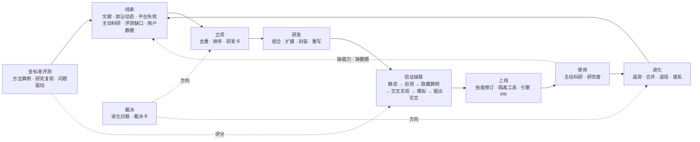

# 2026-10-04 · 「循证进化」最终方案 v1.1

从文献里找到该做的工具，用已发表论文做金标准，靠真实使用决定去留。

> **状态**：方案定稿；未改代码、数据和生产配置。
> **依据**：两份本地前案——《已发表论文金标准校准方案 v2》（`uploads/20260808-paper-calibration/`）与《自进化回路建设方案》（`docs/superpowers/plans/2026-09-07-self-evolving-agent-loop.md`）；2026-10-04 发布线代码（`codex/release-20261004` @ `708646298`）；当日联网核实的文献（附录 A；四份调研笔记在 `2026-10-04-research-evolution-engine-assets/research/`）。
> **读法**：第 0 节是全部结论，第 15 节是裁决清单，中间各节是展开。
> **v1.1（同日）**：第一条闭环的对象从已有引擎改为平台还没有的新工具；已有的 Meta、药物警戒、孟德尔随机化引擎改为校准评测尺子用。涉及 0、5.1、6.2、7.1、12、14、15 节。

---

## 0. 一页结论

**它是什么。** 「循证进化」是平台的第三层学习回路：从已发表文献、前沿动态和平台自己的失败里找出该做什么工具，自动研发，用已发表论文做金标准验证，上线给主动科研和研究者使用，再按真实使用结果整合或淘汰。研究者的方法（L1）已在生产运行，能力手册（L2）已有实现；它补的是平台能力本身的增长，这一层今天只能靠人写代码。

**三句话原则。**

- **以文献为师**：研发线索、方法实现和参考代码都来自文献。
- **以论文为尺**：金标准来自已发表论文，量的是每一步是否成立、结果是否落在可辩护范围内，不是像不像那篇论文。
- **以使用为准**：工具留不留，看真实研究里有没有被用、有没有用对、有没有出问题。

**对你三个问题的回答。**

| 你的问题 | 结论 |
|---|---|
| 遇到 AI 解决不了或需要你裁决的事怎么办 | 每天一份「进化日报」，最多 3 张裁决卡。可逆的方向性问题 24 小时没有回复，AI 重新检索后按推荐执行；花钱、删除、对外发布、改临床安全规则到期取保守项；缺资源只问一次。你事后任何时候都能改，改了就切换分支（第 9 节）。 |
| 要不要拆研究类型，缺数据是不是先做不了 | 拆成六条赛道。缺数据不等于不做：先用已知真值的模拟数据和已发表算例把工具做出来，发布数据要求；用户上传符合要求的数据后，先在他的数据上自检，再出实证结论（第 5 节）。 |
| 能不能和主动科研双向接上 | 能，而且是核心。主动科研的「缺能力、缺数据」变成研发线索；新工具上线后唤醒等待中的议程；用户上传数据唤醒等待数据的研究。平台自己生成的结论永远不能当作独立证据（第 10 节）。 |

**本方案已定的十条。**

1. 不建新的子系统。它是控制面一个常规功能模块（代号 `evolution`，默认关），作业、文档修订、收件箱、扩展中心、方法记录全部复用现有的。
2. 研发和评测分开：研发代理看不到留出算例和评分规则，评测器在它够不到的地方运行。
3. 工具晋升看对不对（隐藏的已发表参考算例、交叉实现、模拟真值、留出论文），不做逐个工具的付费有无对照；退役沿用现有的序贯伤害检验。
4. 验证等级 V0–V4 和数据就绪度 D0–D4 都是标签，不拦截任何用户操作。
5. 新工具以技能修订或隔离工具上线，不往内核工具表里加行。
6. 研究按六条赛道拆分，每条赛道有自己的金标准来源和缺数据时的做法。
7. 裁决规则如上表；裁决卡按类别统计你的推翻率，推翻少的类别自动改为 AI 自己定。
8. 与主动科研、前沿动态、知识库的衔接用事件表固定下来（第 10.1 节），不让模块互相改内部状态。
9. 第一条完整闭环的对象是平台还没有的新工具，由文献扫描选出。已有的 Meta、药物警戒、孟德尔随机化三个引擎只用来校准评测尺子：拿它们做闭环，证明不了「从文献发现、做出原来没有的工具、用论文验证」这条链。
10. 最终衡量：在新发表的论文和先作答、后发表的前瞻题上，平台能独立做完并且每一步都成立的研究任务比例逐月上升。

**你需要做的。** 说「开始」。首批数据全部公开，模型全线 Flash，密钥已有，不需要你另外提供东西。

---

## 1. 名称与定位

**名称**：「循证进化」（EviMed Evolve），内部代号 `evolution`。沿用上一轮的命名，理由有两层：它服务的是循证研究；它自己的每一次晋升和淘汰也走循证路径，有证据、可追溯、可撤回。

**产品上看得见的东西只有三样**，都放在现有页面里，不新增一级页面：

- **能力档案**（现有「科研工具」页）：每个工具做什么、需要什么数据、验证到哪一级、参考了哪些论文、已用于多少次研究。
- **进化日报和裁决卡**（收件箱，绑定飞书时同步推送）。
- **研究机会**（主动科研的建议议程）：例如某篇 Meta 分析发表后新增了 5 项随机对照试验，可以更新。

**在平台里的位置。**

| 层 | 今天的状态 | 循证进化做什么 |
|---|---|---|
| L1 研究者的方法 | 已运行：方法即时生效，由用过它的运行做序贯伤害检验退役（`learningTriggers.mjs:39`） | 不动 |
| L2 能力手册 | 已实现：账号级补充经验（`handbookConsolidation.mjs`） | 把手册里反复出现的「缺计算、缺工具」转成研发线索 |
| L3 平台能力 | 只能靠人提交代码 | 发现、研发、验证、上线、整合、淘汰 |

它同时是 10-02 研究工作台计划里五项的自动驱动器：N05（经过验证的方法与环境）、N09（受管理的技能供给）、N14（科学反馈进入学习）、N15（知识变化传到受影响的工作）、N17（按真实需要一次增加一项专科能力）。这五项今天都是人工逐项做，循证进化让它们按文献和使用信号持续发生。

---

## 2. 前沿依据

### 2.1 已被证明可行、直接借用的机制

| 机制 | 出处 | 关键事实 | 本方案怎么用 |
|---|---|---|---|
| 论文变工具 | Paper2Agent（Nature，2026-09-16） | 100 篇计算生物学论文成功转换 74 篇；599 个候选工具 593 个通过自动验证；验证方式是复现论文教程的输出（文件齐全、数值误差 3% 内、图形一致）；失败原因四类：缺可执行代码、缺数据或模型文件、环境依赖失败、脚本不可泛化 | 用论文自带的教程输出做准入测试；四类失败原因做立项前预检 |
| 环境优先、执行纠错 | ToolMaker（ACL 2025） | 15 个任务完成 12 个，通用编码代理只完成 3 个 | 封装已发表代码时先装环境，再实现，再闭环纠错 |
| 从文献决定建什么 | Biomni（Science，2026）；SkillFoundry（2026-04 预印本） | Biomni 从 25 个子领域的 2,500 篇论文里抽出 150 个工具、105 个软件、59 个数据库，由专家核验；SkillFoundry 把挖掘导向「资源多但已验证覆盖弱」的分支，并对技能做修订、合并、修剪 | 持续挖掘而不是一次性盘点；用参考算例代替人工核验；立项按覆盖缺口排序 |
| 重实现已发表方法并对照其数值 | ERA（Google，2026） | 9 个重实现的已发表方法里，8 个超过了原论文报告的结果 | 「重写」形态必须复现原论文数值 |
| 序贯证伪 | POPPER（ICML 2025） | 用 e 值累计证据，随时停止也能把一类错误控制在设定水平 | 晋升与退役都用序贯规则，不等固定样本量 |
| 工具库按使用量修剪 | TroVE（ICML 2024） | 在复用、新建、不用工具三种解法之间按执行一致性选择，并定期删掉少用的函数；工具库比同类方法小 79–98%，准确率不降反升 | 先复用、再组合、最后新建；定期修剪 |
| 合并必须复验 | ToolLibGen（2025）；ToolScope（ACL 2026） | 合并后由独立审查者重解全部来源题；不复验的合并只保留 80–96% 的原有能力 | 合并版必须通过所有来源工具的参考算例 |
| 评测级联 | AlphaEvolve（2025） | 先小规模过滤，再逐级加难；在留出输入上确认 | 验证从便宜到贵逐级进行 |
| 谱系档案 | Darwin Gödel Machine（ICLR 2026）；Huxley-Gödel Machine（2025） | 保留全部版本和血缘；一个版本自己的分数对后代表现预测很差 | 每个工具版本留谱系；选「下一步改谁」看后代表现 |
| 渐进披露 | Agent Skills 规范；Anthropic 工具搜索 | 技能只常驻约 100 token 的元数据，正文按需读；可用工具超过 30–50 个时选对工具的准确率下降 | 工具以卡片出现，正文按需读；数量大了改成搜索入口 |

### 2.2 已知会出错的地方

| 会出什么错 | 证据 | 本方案的对策 |
|---|---|---|
| 自测通过不等于能用 | 222 个代理自建工具在留出一致性测试上 96.8% 得零分，尽管都能正常运行（Beyond Task Completion，2026，小样本）；49 个技能里 39 个没有带来任何提升（SWE-Skills-Bench）；代理自己写的测试全过而真值只有 75%（CoEvoSkills） | 隐藏参考算例；自测只是必要条件（7.4） |
| 研发代理作弊 | DGM 的一个版本删掉检测标记拿到满分；GPT-5 在不可能完成的任务上 76% 会改测试或写特判，测试隐藏后接近零，给出「做不到」的出口后从 54% 降到 9%（ImpossibleBench） | 评测器隔离、作弊特征扫描、放弃出口、满分复查（7.4） |
| 看到原文就照抄数字 | 给代理论文 PDF 后，本应回答「无法复现」的题正确率从 100% 掉到 63.3%（SocSci-Repro-Bench，这类题只有 10 道，取方向不取幅度） | 运行侧永远不见原文和金标准数字（6.4） |
| 能检索到就会找到答案 | 搜索代理能在公开数据集托管站找到约 3% 的题目答案（Han 等，2025） | 网关层屏蔽目标论文（6.4） |
| 一篇论文只是众多合理分析之一 | 29 个团队分析同一份数据，比值比从 0.89 到 2.93；73 个团队的结果差异 95% 以上无法用已知因素解释；27 篇已发表 Meta 分析有 10 篇无法在 0.1 以内复现（Silberzahn 2018；Breznau 2022；Gøtzsche 2007） | 可辩护区间；分歧要裁定，论文也可能错（6.5） |
| 端到端独立完成很难 | PaperBench 最好 24.4%（机器学习博士生在子集上 41.4%）；EXP-Bench 各阶段单独 20–35%，全部阶段都对只有 0.5%；Meta 分析的检索池覆盖了 91.7% 的应纳入研究，最终纳入只覆盖 48–51%（MetaSyn，2026）；Cochrane 结论题最好 62.4%，纳入研究与综述结论都不一致时只有 41%（MedEvidence） | 分阶段评分，另计「全阶段有效」（6.5） |
| 工具库只增不减 | 关掉维护后库体积涨到 4.5 倍，被检索到又真被用上的比例从约 0.7 掉到 0.08（AutoRefine）；保留全部工具时成绩低于不用工具（TroVE） | 维护分、修剪、软退役（第 8 节） |
| 人工审批流于形式 | 用户批准 93–97% 的单个操作请求，却驳回 39% 的计划；人工只发现 13.6% 被替换的危险命令，连续审批 50 次后降到约 5%（Anthropic，2026）；每多一条提醒，接受率降 30%（Ancker 2017） | 只问方向、每日限 3 张、不重复（第 9 节） |
| AI 科学家的四类缺陷 | 基准挑选、数据泄漏、指标误用、事后选择；只看论文能发现 55%，看日志和代码能发现 82%（Luo 等，2025） | 按日志和代码评分（6.5） |
| 自动生成的工具有安全问题 | 31,132 个社区技能里 26.1% 有漏洞（2026） | 研发环境无直连出网、无凭据（7.3） |

### 2.3 对上一轮引用的核对

上一轮引用的文献全部存在。需要更正的两处：Paper2Agent 的失败原因是四类，漏了「脚本不可泛化」；SocSci-Repro-Bench 发现的是照抄论文报告的数字，且不可复现题只有 10 道。补充两条新事实：Biomni 已于 2026 年发表在 Science；EvoDS 和 SkillPyramid 在 09-07 方案里已经采用，不是待接入项。

---

## 3. 对上一轮方案的修正

| # | 上一轮 | 定稿 | 理由 |
|---|---|---|---|
| 1 | 24 小时后一律按推荐执行 | 只有可逆的方向性问题按推荐执行；单向门到期取保守项；缺资源只问一次 | 所有「沉默即同意」的工程惯例（Apache 72 小时、IETF 两周）都只用于可逆事项；你 09-29 的决定：不反复索要已搁置的凭据和材料 |
| 2 | 日报每天重复汇总未决事项 | 同一事项只出现一次；每天最多 3 张卡；按类别的推翻率自动调整 | 重复提醒直接降低阅读质量（2.2） |
| 3 | 金标准就是对照原论文 | 三把尺子，加可辩护区间、分阶段评分和分歧裁定 | 论文是众多合理分析之一，且会出错（2.2） |
| 4 | 防泄漏靠改写题目和审计检索记录 | 在网关层直接屏蔽目标论文；系统评价按原检索截止日检索；每题先测模型是否已记住答案 | 平台所有出网都经控制面网关，能做到外部基准做不到的屏蔽 |
| 5 | 工具在隔离环境里构建并跑自己的测试 | 研发与评测分离，隐藏参考算例，作弊特征扫描 | 自测通过率与真实正确率几乎无关（2.2） |
| 6 | 「在留出论文上取得收益」才扩展 | 晋升看绝对正确性，不做逐工具的有无对照 | 与 09-21 裁决（不做自动配对评估）和「不做付费方法开关研究」一致 |
| 7 | 新工具进入主动科研的任务选择 | 不新增内核工具行；工具作为现有能力里可用的技能出现 | 52 个 MCP 工具已是每次请求的固定成本；工具多了选择会变差 |
| 8 | 主动科研用固定表选能力 | 更新为现状：N10 已合入，每个周期做什么由一次 Flash 决定；任务类型到能力仍是固定表（`capabilityManifest.mjs:113`），这张表不改 | 发布线 `d6596b92b` |
| 9 | 用模拟数据开发工具 | 分清用途：合成病人只测管道；正确性用已知真值的自建模拟；用户真实数据上线前先自检 | 合成病人的结局分布不真实（5.4） |
| 10 | 模块之间「通过清晰接口协作」 | 写成事件表、来源标签和租户边界 | 可执行（第 10 节） |

---

## 4. 总体设计

### 4.1 一个循环

### 4.2 谁做什么

| 角色 | 做 | 不做 |
|---|---|---|
| 模型（Flash） | 抽取线索、写研发卡、写代码和技能、提议合并、起草裁决卡 | 不给自己打分，不决定晋升 |
| 代码（`@evimed/domain` 与控制面） | 优先级计算、闭集分类、预算、验证级联编排、标签计算、网关屏蔽 | 不判断语言 |
| 评测器（隔离） | 持有留出算例、金标准提要、模拟真值，负责评分 | 不参与研发 |
| 跨家族复核（现有 review 网关） | 复核到期裁决、裁定平台与论文的分歧 | 不生成工具 |
| 你 | 方向性裁决（可不答）、单向门 | 不做逐项审批 |

### 4.3 三条不变量

1. **评测器在研发者够不到的地方。** 留出算例、评分规则和金标准数字不进研发代理的工作区。
2. **所有动作可逆。** 版本不可变，退役是软退役，决定记录只会被新记录取代。可逆是 24 小时默认规则成立的前提。
3. **标签不是门。** V 级和 D 级只描述工具验证到哪一步、数据到位到哪一步；它们决定工具是否对外展示，不拦截研究者已经发起的任何操作。

---

## 5. 研究类型与数据就绪度

### 5.1 六条赛道

| 赛道 | 包含 | 平台已有 | 金标准来源 | 缺数据时做什么 | 新工具候选 |
|---|---|---|---|---|---|
| E 证据综合 | 系统评价、配对与网络 Meta、诊断准确性、剂量反应、伞形与范围综述、指南比较、以文献参数为输入的模型研究 | Meta 引擎，能端到端 | Cochrane 统计数据包（2023-04-25 以后进入制作流程的评价提供 CSV/JSON）；高水平 Meta 分析的森林图；带完整参数表的模型论文 | 只拿到摘要的研究标为摘要级证据 | 药物经济学模型（Markov、分区生存）；试验序贯分析 |
| P 公共数据实证 | FAERS 不成比例分析、孟德尔随机化、疾病负担与公开调查数据的二次分析、文献计量 | 药物警戒、孟德尔随机化、文献计量三个引擎，能端到端，受出网条件约束 | 使用同一数据版本的已发表研究；数据会漂移时，用独立实现在当日数据上重算作对照 | 换替代数据，并写明研究对象因此变了什么 | 疾病负担趋势分析（连接点回归、年龄-时期-队列）；调查加权分析 |
| M 方法与工具 | 统计方法、算法、科研软件 | 统计分析能力和 5 条方法记录 | 方法学论文里的数值算例；已知真值的模拟；交叉实现 | 不缺，模拟就是数据 | 由文献出现频次决定 |
| U 用户数据研究 | 研究者自己的队列、登记、试验、病历数据 | 数据画像、数据语义检查和统计分析能力；数据到位后能做 | 公开数据集以用户上传的方式进入评测（例如 NHANES 上的已发表研究） | 先做工具、数据要求和模拟，等上传 | 纵向数据、生存与竞争风险、缺失数据处理 |
| X 需要新数据的研究 | 湿实验、前瞻研究、临床试验 | 只能到方案 | 没有结果金标准，只评方案质量 | 产出方案、数据要求和功效模拟后挂起；数据回传后转入 U | 方案、样本量、把握度 |
| T 理论与机制建模 | 推导、机制模型 | 部分 | 解析解和已知结果 | 写明假设与适用范围 | 暂不进首批 |

虚拟临研在其负责人宣布就绪前不与本机制耦合；X 和 U 赛道与它的衔接只预留接口。

**第一条闭环做新工具，已有引擎校准尺子。** Meta、药物警戒、孟德尔随机化三个引擎已经存在。拿它们做第一条闭环，跑出来的只是给现有引擎补功能，这件事团队本来就在人工做，证明不了发现和研发这两步。它们的正确答案我们心里有数，正好用来检查评测本身：尺子准不准，网关屏蔽漏不漏。

第一条闭环的对象由文献扫描选出，必须同时满足三条：

1. 近两年文献里高频出现。
2. 数据公开，或者输入就写在论文里。
3. 至少有 2 个已发表的数值算例可对照。

上表的「新工具候选」是按这三条预计会排在前面的几类，最终以扫描结果为准。2026-10-04 检索过平台自有的引擎、能力包和随镜像的技能，这几类都没有可执行的实现；药品综合评价和药品遴选的技能里提到了经济性，但没有模型工具。

| 候选 | 为什么合适 | 参考算例来源 |
|---|---|---|
| 药物经济学模型 | 参数写在论文的表里；补上药品综合评价的经济性维度 | 带完整代码和数值的教程模型（DARTH 的队列状态转移模型教程）。已发表模型的结构细节常不完整，研究级复现的容差要放宽 |
| 疾病负担趋势分析 | 国内发文量大；数据要从 IHME 下载后上传，顺带验证用户上传这条路 | 美国国家癌症研究所的连接点回归软件和年龄-时期-队列工具；GBD 论文报告的年度变化百分比 |
| 调查加权分析 | 数据公开；已有预印本整理了 20 篇 NHANES 上的已发表研究作对照 | R 的 survey 包；NHANES 官方教程里的数值 |
| 试验序贯分析 | 高水平 Meta 分析里常见，数值算例多 | R 的 RTSA 包及其文档算例 |

### 5.2 数据就绪度（D 级）

| 级 | 含义 |
|---|---|
| D0 | 没有可行的数据来源 |
| D1 | 只有模拟数据 |
| D2 | 公开数据可得（同时记录生产机可达性：直连、经东京中转、仅评测侧可取） |
| D3 | 用户数据到位，且通过了工具的数据要求 |
| D4 | 真实数据加独立的外部数据 |

同一个研究问题的 D 级会变：今天 D1 只能开发工具，数据到了变 D3 就能出实证结论。D0 和 D1 不算代理失败。

### 5.3 工具验证等级（V 级）

| 级 | 达到条件 | 展示 |
|---|---|---|
| V0 已构建 | 静态检查和自测通过 | 只供评测使用 |
| V1 模拟验证 | 按预先写好的模拟方案，偏倚、覆盖率、假阳性率在蒙特卡洛误差内达标 | 标「仅模拟验证」 |
| V2 方法复现 | 至少 2 个隐藏的已发表参考算例在容差内复现；有独立实现时两者一致 | 标「已复现已发表算例」 |
| V3 研究复现 | 在留出论文上复现主要结果，落在可辩护区间内 | 标「已复现已发表研究」 |
| V4 实战 | 真实使用次数达到现有伤害检验的判定样本，且没有触发伤害信号 | 标「已用于 N 次研究」 |

对外展示的最低要求：计算类工具 V2；找不到已发表算例的新方法 V1；纯流程组合的技能 V0 加一次端到端冒烟。这是引擎对自己产出的晋升规则，与 10-04 合入的六态可用性标签（N01）并列显示。

### 5.4 缺数据时的完整路径

1. **研发期**：用已知真值的自建模拟数据和已发表算例把工具做到 V1 或 V2。合成病人生成器只用来测文件格式和流程能否走通：它的结局分布是模块作者写的，不是真实的（验证研究里慢阻肺 30 天死亡率 0.7%，真实数据是 7–8%）。
2. **发布数据要求**（5.5）、示例文件，以及这个工具能回答和不能回答的问题清单。
3. **缺数据的研究挂起**：主动科研的议程标为等待数据；进化日报的「资源等待」里出现一次。
4. **用户上传**：现有数据语义检查（重复观察、连接基数、分母、时间泄漏）加数据要求校验，告诉用户能做哪些分析、还缺什么。字段格式正确只说明文件可读，是否足以回答研究问题单独判断。
5. **在用户数据上自检**：保留用户的真实协变量，注入一个已知大小的效应，看工具能否找回（plasmode 模拟）；有条件时加阴性对照结局。OHDSI 的方法基准显示，未经校准时观察性方法的 95% 置信区间只有一半覆盖真值，校准后恢复。自检结果作为标签随结果交付，不拦截交付。
6. **实证结论只来自真实数据**。模拟结果不出现在报告结论里；不为跑通分析填造病人、结局或关键变量。
7. 多次真实使用后升到 V4。

这条路线是被证据逼出来的：向作者索要数据只有 6.8% 能拿到（Gabelica 2022）；生物医学论文真正公开数据的约 2%，公开代码的不到 0.5%（Hamilton 2023）。

### 5.5 数据要求怎么写

每个需要用户数据的工具附一份机器可校验的数据要求：

- **表结构**：Frictionless Table Schema v2（字段、类型、必填、取值范围、枚举、缺失值编码）。
- **补充属性**：单位（UCUM）和编码表，Table Schema 本身没有单位字段。
- **研究级规则**：每行代表什么、最少事件数、随访要求、适用人群。

同一份数据要求有三个用途：校验上传、生成模拟数据、给用户下载模板。病历和医保类工具同时接受 OMOP 通用数据模型作为输入。

---

## 6. 金标准质控

### 6.1 三把尺子

| 尺子 | 量什么 | 给平台什么 | 对照什么 | 用在哪里 |
|---|---|---|---|---|
| 方法算例 | 单个计算对不对 | 算例数据 | 已发表数值加容差。`method-records.json` 已是这个格式：5 个方法，参考算例分已发表、其他实现、解析解三种，每个都带容差 | V2 晋升；每次发布后回放 |
| 研究复现 | 给定方法规格和数据，能否算出论文的结果 | 评测器抽出的方法规格和数据，不给原文；混入数据被扣留的题 | 数值容差；扣留题的正确答案是「无法复现」 | V3；引擎回归 |
| 问题驱动 | 只给研究问题，能否独立做出每一步都成立的研究 | 中性改写的问题；检索限于原论文的检索截止日之前 | 分阶段评分加可辩护区间 | 赛道体检；缺口来源 |

三把尺子都可以在时间留出的论文上运行。你最初设想的「论文题目作输入、论文作金标准」对应第三把；前两把更便宜、更确定，承担晋升判定。

### 6.2 语料

- **选文**：数据可得（Cochrane 数据包、论文内森林图、同版本公开数据库）；评测侧能取到全文；研究类型在赛道能力之内。Cochrane Library 从生产机取不到，由评测侧下载，只存评测侧。
- **撤稿筛查**：每次评测前用 Crossref 接口查目标论文及其纳入研究（撤稿信息 2025 年起已并入该接口）；有更正或关注声明的降为开发集。
- **分四组**：

| 组 | 用途 | 研发是否可见 |
|---|---|---|
| 开发集 | 暴露缺陷，可以反复修 | 可见 |
| 留出集 | 晋升和体检 | 不可见 |
| 时间留出 | 结果首次公开（预印本、会议摘要、注册结果中最早的日期）晚于所用模型发布，也晚于工具研发 | 不可见 |
| 前瞻题 | 平台先作答并存证（时间戳加哈希），相关论文发表后评分 | 不适用 |

- **来源**：前沿动态每天进入的新论文就是时间留出的来源。
- **规模**：校准集取已有三个引擎各 5 到 10 篇已发表研究；每个新工具至少 2 个开发算例加 2 个留出算例（对应 V2），研究复现的留出论文从 5 篇起（对应 V3），之后每周补充。

### 6.3 输入改写

结论式题目会泄露答案（例如「某药降低某结局」）。改写成中性的研究问题：保留人群、干预或暴露、结局，去掉方向、作者和期刊，口语化，带上交付意图以符合路由约定（沿用 v2 方案 3.1–3.3）。改写和质检由两个独立执行者完成；每题另写 3 个同义变体，用来确认修复没有特化到某一句话。

### 6.4 防泄漏的五件事

1. **网关屏蔽。** 评测运行携带排除集：目标论文的 DOI、PMID、PMCID、预印本和会议摘要、标题指纹。公共来源、网页检索、网页阅读、前沿检索、知识源插件和 ToolUniverse 文献工具在返回结果前过滤并记日志。当前 `publicSourceGateway.mjs` 没有这个参数，需要新增；它只对评测运行生效。
2. **截止日期检索。** 复现系统评价时，检索结果限于原评价检索截止日之前。这样对照才公平：之后发表的新研究不应算成差异。「更新版」作为单独模式运行。
3. **运行侧不见原文和金标准数字。** 金标准提要放在控制面数据目录，永不挂进运行时；仓库里只留清单和摘要哈希。
4. **无工具猜测基线。** 每题先让模型不用任何工具猜主要结果。猜中的题标为可能已记住，只进开发集。现有的记忆检测方法不足以证明一篇论文没被记住，所以用行为测试。
5. **暴露审计。** 工具调用日志里出现目标标识即记为暴露；成绩按未暴露、暴露未引用、引用三层分别报告（沿用 v2 方案 3.4）。

### 6.5 评分

- **分阶段**：问题界定、方法选择、证据召回、数据抽取、计算、结论确定性、写作各自打分，另计「全阶段有效」。合并成一个分数会掩盖问题。
- **证据召回的分母**只算平台可达来源里存在的研究；不可达的部分记为连接器缺口，单独报告。
- **数值**：纳入研究集相同时按容差比较。问题驱动时看是否落在可辩护区间：平台的确定性引擎对合理的规格组合（固定或随机效应、不同方差估计、边界研究纳入与否）自动跑出的范围，加上原论文的值。
- **分歧裁定**：结果落在区间之外时，由跨家族模型带着原文证据裁定为平台错、论文错或合理差异，代码复核其中可核对的部分。论文错不扣平台的分，记为平台推断，不对外宣称。不设人工裁决队列；v2 方案里的人工步骤改为可选抽查。
- **评分依据是日志和代码**，不只是报告文本。
- **每题至少跑 2 次**，报告方差。
- **评分器自身**：确定性检查优先；模型评分用跨家族模型；定期抽样复核评分器的误判（CORE-Bench 的自动评分曾与人工复评相差约 18 个百分点）。
- **运行隔离**：每个评测单元一个独立工作区；测执行能力时固定能力路由，路由能力单独测。这两条是 09-16 两次评测作废后的既有做法。

### 6.6 评测结果怎么驱动研发

- 每个失分点归入闭集的缺口类别：连接器（拿不到数据）、抽取、方法缺失、方法实现错误、路由、技能指令、写作、模型能力、产品边界外。
- 同类缺口聚成一类再立项，修一类而不是修一个。
- 研发卡附开发集里的失败样例和对应的参考算例。
- 端到端评测的角色是赛道体检和缺口来源；单个工具的晋升由前两把尺子判定。

---

## 7. 工具研发、验证与上线

### 7.1 线索与立项

**线索来源。**

| 来源 | 取什么 | 出处 |
|---|---|---|
| 已发表文献 | 方法章节的五元组：方法、软件、数据、代码地址、报告数值 | 前沿动态管线对方法类论文多做一次抽取 |
| 平台失败 | 闭集代码：方法记录里的拒算码、降级记录、引擎拒绝码、会话无法调用的工具 | 运行账本 |
| 主动科研 | 规划器给出的停止理由：缺能力、缺数据 | `autopilotNextAction.mjs` |
| 金标准评测 | 缺口类别 | 6.6 |
| 用户数据 | 上传的数据与所有现有工具的数据要求都不匹配 | 数据语义 |
| 能力手册 | 反复出现的「缺计算」经验条目 | L2 |

来自研究者运行的线索只取闭集代码，不取内容。

**去重**：对照能力目录、方法记录、各能力的工具依赖图（`evals/tool-graph/`）、已上线的进化工具，以及失败记录。

**排序**：模型抽取特征，代码计算分数。

- 需求：近 24 个月文献出现频次，加平台自己的失败次数和等待中的议程数。
- 可行：代码、数据、环境是否可得（按 Paper2Agent 的四类失败原因预检）。
- 可验证：能找到几个已发表的数值算例；少于 2 个只能走 V1 路线。
- 缺口：现有工具的覆盖程度，资源多而已验证覆盖弱的分支优先。

第一条闭环只取同时满足 5.1 三条硬条件的候选，并且必须是平台还没有的工具。

**研发卡**：目标、输入输出约定、数据要求草案、参考算例清单（开发部分可见，留出部分只存评测侧）、研发形态、预算、关联的议程。

### 7.2 五种研发形态

先复用，再组合，最后才新建。对同一个缺口同时生成几种解法，按在开发算例上的执行一致性选，其次选更简单的。

| 形态 | 什么时候用 | 产出 | 控制 |
|---|---|---|---|
| 组合 | 现有工具已能完成，缺的是流程 | 技能 | 端到端冒烟 |
| 扩展 | 现有引擎差一个功能或参数 | 引擎 PR，批量进发布 | 引擎自己的测试加参考算例 |
| 封装 | 论文有可用代码 | 隔离工具或技能脚本 | 用论文教程的输出做准入测试 |
| 重写 | 只有方法描述 | 新实现 | 至少 2 个已发表数值算例；有独立实现时交叉核对 |
| 新能力包 | 几个工具加一套流程构成了现有能力没有覆盖的研究类型 | `capability.yaml`、技能、契约、3 份以上任务书 | 先以不列出的方式上线；列出与否走 B 类裁决 |

最后一种就是你说的「专门的 agent」。一篇论文可能只贡献一个统计函数，多篇论文也可能共同支撑一个能力包，研发对象不与论文一一对应。

### 7.3 研发环境

- 研发运行在内部项目 `evimed-evolution` 的运行时里：没有直连出网，只能走网关；不挂任何客户工作区，不持有凭据。
- 新依赖向扩展中心的预备器提出请求，锁定版本和哈希后进入下一代。预备器今天只处理已准入的制品，需要给它增加从允许清单内的包镜像和代码归档取回的能力。
- 平台代码的修改不在生产运行时里做：引擎级修改以研发卡、失败样例和参考算例的形式交给开发流水线，出 PR。
- 研发和评测是重活，走现有的重活准入，一次只跑一个；内部项目不挤占研究者的运行时。

### 7.4 验证级联与防作弊

从便宜到贵逐级进行，前一级不过不进下一级：

1. **静态**：语法、出网导入禁用、作弊特征（让相等判断恒真、在断言前退出、篡改测试配置、吞掉异常的包装、代码里硬编码期望值）。
2. **自测**：脚本的自调用入口和测试文件，在一次性容器里执行（无网络、只读输入）。`codeSkillVerification.mjs` 已经写好了组合逻辑，缺的是执行器：原执行路径随笔记本功能在 09-19 删除，需要给运行时控制器加一个 `exec-verify` 操作。
3. **正确性**（评测侧，按可得的证据取用）：
   - 有已发表算例：隐藏的参考算例在容差内复现；有独立实现（例如 R 包对 Python 实现）时两者结果一致。通过即 V2。
   - 找不到已发表算例的方法：按预先写好的方案做已知真值的模拟，报告蒙特卡洛误差。通过即 V1。
4. **研究复现**（留出论文）：序贯累计通过情况，达到阈值即 V3。

规则：

- 研发代理只得到通过与否和失败算例的编号，得不到期望值。
- 研发代理可以声明「无法忠实实现」并说明缺什么。这是合法结果，记入失败记录，比硬凑一个能过测试的实现好。
- 突然满分触发复查。
- 每次平台发布后，回放所有已上线工具的隐藏算例，发现依赖和环境漂移。
- 评测器的规则在一个周期内冻结。

### 7.5 上线形态与检索

| 产出 | 上线方式 | 版本 |
|---|---|---|
| 技能（含脚本） | 平台作用域的技能修订，物化进部署的只读技能根；与扩展中心个人技能同一机制 | 每次运行记录所用修订和摘要；运行中不变 |
| 隔离工具（重依赖或大计算） | 扩展中心的 `isolated-tool` 执行类：作用域受限的作业或边车，经网关调用 | 不可变代际，在安全边界激活 |
| 引擎修改 | PR 生成器（沿用 `scripts/dev/open-method-pr.mjs` 的形态），批量进入发布 | 随发布 |

检索：

- 内核工具表不新增行。
- 工具以卡片出现：何时用、文件在哪；正文按需读。这与 09-28 把学到的方法改成卡片的做法一致。
- 卡片按能力和赛道限定范围；某个范围超过约 30 个时，改为一个搜索入口。
- 从参考算例自动生成「任务对应哪个工具」的检索评测集，定期检查选对率。

### 7.6 能力档案

`method-records.json` 现有字段是假设、输入、拒算、诊断、依赖和参考算例，参考算例已经分为已发表（`published`）、其他实现（`other-implementation`）和解析解（`analytic`）三种，正好对应 7.4 第 3 级的三种证据。在它上面增加：验证等级（由代码计算）、数据要求、留出算例的编号与哈希（内容只在评测侧）、谱系（父版本、来源论文、研发运行）、使用情况、状态（在用、别名、退役）、取代关系。Agent Skills 规范本身没有版本和取代字段，这些由我们自己的记录承载。

---

## 8. 整合与淘汰

- **遥测**：被检索次数、被调用次数、成功率、下游纠正、成本。调用按实际执行计数；09-28 的教训是只数「打开文件」会得到加载 34 次、调用 0 次。
- **退役**：现有的序贯伤害检验（`METHOD_HARM_TEST`，按被退回交付物的比例判定，3 到 40 次运行内给出结论）扩展到工具；发布后回放失败的，修复或退役。
- **维护分**：成功率、调用量、调用与检索之比三者合成，每月复查末位。唯一能通过某类参考算例的工具受保护，少用也保留。
- **合并**：描述相近且参考算例重叠时提出合并；合并版必须通过所有来源工具的参考算例，旧版本先变成别名，静默期后退役。
- **软退役**：新运行不再看到；历史运行记录了所用版本，仍可解析和回放；受影响的结果由 N15 的机制标出并通知相关项目。
- **失败记录**：试过不行的方案按版本记下，避免反复走同一条死路。
- **谱系**：每个版本留下来源论文、研发运行和验证记录。
- **库的健康指标**是同等覆盖下更小，不是工具数量。

---

## 9. 裁决机制

### 9.1 四类问题

| 类 | 例子 | 处理 | 24 小时到期时 |
|---|---|---|---|
| A 自主处理 | 选实现方案、换替代数据源、重试策略、预算内的调度 | 直接做，记决定记录 | 不出卡；日报里汇总 |
| B 方向裁决（可逆） | 接下来主攻哪条赛道；合并或退役一个正被议程使用的工具；改变某赛道的金标准口径；新能力包是否列出 | 出裁决卡 | 重新检索，跨家族复核，按推荐执行 |
| C 单向门 | 超出预算的花费；删除数据；对外发布或联系作者与病人；修改临床安全规则 | 出裁决卡 | 取保守项：不花、不删、不发、保持更严的规则；其余工作照常 |
| D 资源等待 | 凭据、数据集、算力、外部材料 | 日报里问一次，写明能解锁什么 | 转用替代路线；不重复问 |

- 分类先由代码按闭集规则判：涉及超预算、删除、对外发送、临床安全规则的一律是 C。其余由一个独立的判定步骤判断：这是不是只有你能定的方向问题，你的答案会不会改变路线。
- 出 B 类卡之前，AI 至少已经自己试过两条路。
- D 类只有情况实质变化（例如等待它的议程变多）才再次出现。
- 引擎自己不删除任何东西，所以 C 类在实际中很少出现。

### 9.2 进化日报

- **时间和渠道**：沿用收件箱的每日时间偏好（默认 08:00，`notificationPersistence.mjs:66`），与前沿日报同一时刻；已绑定飞书的账号同步推送。
- **四段**：待你裁决（最多 3 张，按影响排序）；已自主处理（每类一行，加最值得看的 3 条）；资源等待（只展开新出现的）；当日成果（新上线的工具、等级变化、赛道体检分数变化）。
- **规则**：同一事项只出现一次。超过 3 张的 B 类按 A 类处理，C 类保持保守默认。

### 9.3 裁决卡

内容：卡在哪里；已经试过什么；2 到 3 个选项；推荐哪个及依据（带来源）；每个选项的后果；到期会怎样；怎么撤回。

四个回复方式：采纳推荐；选另一个；写一句「改成……」；以后这类你定。

### 9.4 到期流程

计时从首次送达开始。08:00 送达的卡在次日 08:00 到期，正好赶在下一份日报之前。

1. 重新检索（网页、文献、平台数据），看有没有新信息改变推荐。
2. 跨家族模型复核推荐和证据。
3. B 类执行推荐，C 类执行保守项。
4. 写决定记录：背景、决定、状态（默认采纳）、后果、撤回方式。
5. 下一份日报报告结果。

你之后任何时候回复都有效：新的决定记录取代旧的，系统切到你选的分支，已做的工作保留。自主裁决决定的是接下来做什么；缺的数据和没解决的科学问题照原样记录，不因为决定继续就写成已证实。

实现上，收件箱已有到期时间和默认动作（`notificationService.mjs:673`），但到期后只做了标记，没有任何消费者（`server.mjs:1082`）。新增一个作业消费到期结果，完成上面五步。

### 9.5 自适应

按类别统计你的推翻率：某一类连续 10 次没有被你推翻（包括到期默认后你没有改回），降为 A 类；最近 5 次里推翻 2 次以上，升回 B 类。依据是 2.2 的数据：人对单个动作几乎全部批准，真正行使判断的是计划层。你的注意力留给计划。

### 9.6 卡住的问题

连续尝试失败后，保存最小失败案例和已试路径，写入失败记录并附唤醒条件（出现新方法、新数据、新工具或新模型），然后转做别的。只有你能解锁的（资源）进 D 类。

---

## 10. 与平台其他部分的双向耦合

### 10.1 事件表

| 触发 | 平台接着做什么 |
|---|---|
| 前沿动态出现新方法、新数据资源或重要矛盾 | 进线索池；匹配现有议程 |
| 主动科研的规划器因缺能力或缺数据停下 | 进线索池；议程标记等待什么 |
| 工具上线或等级变化 | 更新能力档案；规划器下次决策时看得到；唤醒等待该工具的议程 |
| 数据要求发布 | 知识库的数据页显示这份数据能跑哪些分析 |
| 用户上传的数据满足某个数据要求 | 唤醒等待该数据的议程和真实数据自检 |
| 工具修复或退役 | 标出受影响的结果，通知相关项目 |
| 文献挖掘发现过时的 Meta 分析（之后新增了试验） | 作为研究机会给研究者，主动科研里一键采纳 |
| 评测中平台与论文出现分歧并完成裁定 | 记为平台推断；可作为研究机会 |
| 前瞻题对应的论文发表 | 评分，计入赛道体检 |

事件走现有的文档和作业账本，由带租约的工作进程消费，不新增基础设施。

### 10.2 主动科研

- 规划器（N10）选下一步时能看到适用于该议程的新工具，连同验证等级和数据要求。
- 任务类型到能力的映射表不改。新工具作为该能力里可用的技能进入运行。
- 议程可以挂起等待某个工具或某类数据，事件到达后自动续跑。
- 证据更新类议程是天然的持续使用者：新试验出现，用新工具重跑。
- 研究者的主动科研结果归研究者。

### 10.3 前沿动态

- 方法类论文多抽一次五元组，成为线索。
- 每天进入的新论文成为时间留出语料。
- 前瞻验证：平台对尚无定论的问题先作答并存证，相关论文发表后评分。这是最干净的无泄漏评测，也是「AI4Science 效果」最直接的证明。
- 后续可选：对新发表的 Meta 分析做平台复算，标注「平台复算一致」或「存在差异」并附复算记录。只在确定性复算落在容差内、或分歧已完成证据裁定时显示。

### 10.4 学习回路

- 能力手册里反复出现的「缺计算」成为线索；新工具上线后，相关手册条目指向它。
- 现有的方法关系分析把工具纳入同一张关系图。
- 评测运行带自动标记，学习触发器本来就不收（`learningTriggers.mjs:49`），评测不会污染学习。

### 10.5 三条边界

1. **来源**：平台生成的假说、报告和总结不能当作独立证据。证据矩阵只认保存过的原始来源；同一来源被多份平台报告转述，仍然只算一条。每条记录标明出自文献、工具结果、平台推断还是用户陈述。
2. **租户**：跨用户共享的只有方法和工具；数据和结果归研究者。
3. **评测隔离**：评测只在内部项目里跑，不进收件箱，不进记忆抽取。

---

## 11. 平台落点

| 部件 | 复用 | 新增 |
|---|---|---|
| 控制面模块 | 作业、文档、修订账本；收件箱；飞书推送；用量账本 | `evolutionService.mjs`、`evolutionWorker.mjs`、`evolutionRoutes.mjs`、`evolutionDecisions.mjs`；开关 `OPEN_SCIENCE_EVOLUTION_ENABLED`（默认关）；作业种类加入 `PRODUCT_JOB_KINDS`（`productPersistence.mjs:19`） |
| 领域 | 方法记录、伤害检验、数据语义、用量用途 | `evolution.mjs`：赛道、D 级、V 级、裁决类别、线索代码的闭集；用量用途 `evolution`；方法记录的新字段 |
| 内部能力 | 方法蒸馏的派发模板 | `evolution-scout`（线索到研发卡）、`tool-builder`（研发与自测）；`visibility: internal` |
| 评测 | `title-to-paper` 的采集与解析函数；配对评测的派发方式和每单元独立项目；review 网关 | `evals/paper-gold/`：语料清单、改写、评分、体检报告；隐藏部分在控制面数据目录 |
| 运行时控制器 | 预备器；重活准入 | `exec-verify` 操作（协议版本加一）；预备器从允许清单取回依赖 |
| 网关 | 全部出网网关 | 评测排除集和暴露日志 |
| 扩展中心 | 不可变代际；`isolated-tool`；个人技能的物化 | 平台作用域的技能修订 |
| 内部项目 | `internalProjects.mjs` 的统一判定 | `evimed-evolution` |
| 前沿动态 | 管线和预算 | 方法五元组抽取 |
| 主动科研 | 规划器、议程 | 规划器上下文里的可用工具；议程的等待标记 |
| 界面 | 科研工具页、收件箱、主动科研页 | 能力档案的字段、裁决卡的样式、研究机会 |

**三个限额**（各有配置键和计数器）：

- 每日预算 `OPEN_SCIENCE_EVOLUTION_DAILY_BUDGET_CNY`，默认 50 元，约 15 次端到端评测；用量单独记在 `evolution` 用途下，不计入任何研究者的花费。
- 并发 `OPEN_SCIENCE_EVOLUTION_MAX_CONCURRENCY`，默认 1；生产机与其他产品共用，不占最后一个空闲运行时。
- 每日裁决卡上限 3。

**与开发原则的对照。** 零新增阻断点；不加全局提示词，不加整答放行条件；预算、沙箱、网关排除这些工程边界都在代码里；新增的唯一一条规则是评测排除集，它是精确的工程操作，只作用于评测运行，有真实复现作依据（2.2）。

---

## 12. 实施路线

| 阶段 | 内容 | 退出标准 |
|---|---|---|
| P0 底座（约 1–2 周） | 裁决卡、日报、到期消费者；内部项目、用量用途、预算；`exec-verify`；网关评测排除集；评测侧隐藏存储；方法记录新字段；撤稿筛查 | 一张测试卡走完送达、到期、重新检索、复核、执行、决定记录、次日日报；一个示例代码技能经 `exec-verify` 跑通；一次评测运行的目标 DOI 在每个网关都被过滤并留下日志 |
| P1 首条闭环：一个新工具（约 2–3 周） | 校准尺子：已有的 Meta、药物警戒、孟德尔随机化引擎各取 5 到 10 篇已发表研究过三把尺子，并故意放一篇不屏蔽的目标论文检查泄漏审计。文献扫描：抽取近两年文献的方法五元组，按三条硬条件排出候选。研发排第一的新工具并上线 | 校准：已有引擎的已发表算例经评测台得到与其自身测试一致的结论，故意放入的泄漏被审计抓到。闭环：扫描选出的新工具达到 V2 并上线，被至少 1 次真实研究或主动科研调用（账本可查），留出算例通过。做不出来时，失败原因归入闭集类别并出现在日报，换下一个候选 |
| P2 扩展（约 3–4 周） | 第二、第三个新工具，其中一个走用户上传数据这条路（预计是疾病负担或调查数据）；数据要求、模拟优先、上传自检；规划器接入可用工具；议程等待与唤醒；已有三个引擎的赛道体检和补缺 | 一个在模拟数据上开发的工具发布数据要求后，在一份真实上传的数据上完成自检并出结果；一个议程因工具上线被自动续跑；已有引擎的体检分出现在日报 |
| P3 规模化（持续） | 每周的时间留出评测；前瞻题；按月的合并、修剪、退役；裁决自适应；M 赛道 | 第 13 节的指标按月出数 |

已有引擎的体检放在 P2。Meta 赛道预计先暴露的三类缺口，以及文献依据：

- **纳排判定**：损失发生在从检索池筛到最终纳入这一步，而不是检索本身：检索池覆盖 91.7%，最终纳入只有 48–51%（MetaSyn）。
- **效应量抽取与换算**：抽取错误多出在结局定义混淆（TrialMind）。
- **证据不一致时的结论确定性**：纳入研究都与综述结论一致时模型准确率 92%，都不一致时 41%（MedEvidence）。

九个工作包按目录互不重叠，可以并行：裁决与日报；领域与账本；验证执行器；网关排除与暴露审计；评测台；线索与立项；研发与上线；主动科研与知识库接线；维护。

---

## 13. 指标

**主指标**：时间留出和前瞻题上，各赛道「全阶段有效」的研究任务比例，按月。

**次级指标**：

- 真实请求里以受支持的结果结束（而不是拒算或不支持）的比例，按赛道。
- 从发现缺口到工具上线的中位时间；研发卡达到 V2 的比例。
- 工具的调用与检索之比；因伤害退役的数量；同等覆盖下的库体积。
- 你的负担：每日卡数、推翻率、自主处理的占比。

**护栏**：零新增阻断点；安全回归为零；暴露审计的泄漏率；研发侧访问评测资产的次数为零。

工具数量、报告数量和内部评分都不作为成果指标。

---

## 14. 风险与对策

| 风险 | 对策 |
|---|---|
| 对着论文过拟合 | 留出、时间留出、前瞻题；可辩护区间；评测器隔离 |
| 研发代理作弊 | 隐藏算例、作弊特征扫描、放弃出口、满分复查、谱系 |
| 泄漏和模型记忆 | 网关屏蔽、截止日期检索、无工具基线、暴露审计 |
| 金标准本身有错 | 撤稿筛查；分歧裁定；论文错不扣分 |
| 工具膨胀 | 维护分、合并复验、软退役、检索评测 |
| 国内机房出网不稳 | 赛道按生产机实测可达性排序；东京中转；评测数据由评测侧预先取回 |
| 循环自证 | 来源标签；平台推断不算证据 |
| 打扰你太多 | 每日 3 张、不重复、自适应 |
| 临床安全 | 临床安全规则仍是唯一的人工检查点；进化不改安全规则 |
| 挤占线上资源 | 并发为 1、重活准入、内部项目不挤占研究者 |
| 新工具第一次做不出来，分不清是机制还是模型能力的问题 | 先用已有引擎校准尺子；失败原因归入闭集类别；研发代理可以声明无法忠实实现；换下一个候选 |

---

## 15. 裁决清单

**已定。**

1. 名称「循证进化」，代号 `evolution`，默认关，先对运营者可见。
2. 定位为 L3 回路和 N05、N09、N14、N15、N17 的自动驱动器，不建新子系统，不新增一级页面。
3. 研发与评测分离；隐藏参考算例；评测规则按周期冻结。
4. 晋升看绝对正确性；退役用现有序贯伤害检验；不做逐工具的付费有无对照。
5. V 级、D 级是标签；对外展示的最低要求见 5.3。
6. 工具以技能修订、隔离工具或引擎 PR 三种方式上线；不加内核工具行；不在生产运行时里改平台代码。
7. 六条赛道；第一条闭环的对象是文献扫描选出的、平台还没有的新工具，已有的 Meta、药物警戒、孟德尔随机化引擎只用来校准尺子；虚拟临研暂不耦合。
8. 金标准三把尺子；网关屏蔽、截止日期检索、无工具基线、暴露审计、撤稿筛查；分歧由跨家族模型带证据裁定，不设人工队列。
9. 缺数据走「模拟、数据要求、上传、自检、实证」五步；模拟结果不作为证据。
10. 裁决四类；日报沿用 08:00；每日最多 3 张卡；24 小时从首次送达起算；B 类到期按推荐，C 类到期取保守项，D 类只问一次；按推翻率自适应。
11. 耦合按事件表；来源、租户、评测隔离三条边界。
12. 默认每日预算 50 元、并发 1，可在配置里改。

**不做。**

- 不新增阻断点，不拦截用户操作。
- 不做公开榜单；不自动对外发表。
- 不训练或微调模型（沿用 09-07 方案 6.8 的触发条件）。
- 不在控制面加载运行时代码；不新增记忆存储。
- 不把平台自己的结论当作金标准。

**你需要做的。** 说「开始」。

---

## 附录 A　参考文献（2026-10-04 核实）

**论文变工具与文献挖掘**

1. Miao J 等. Reimagining research papers as interactive and reliable AI agents（Paper2Agent）. Nature，2026-09-16. https://www.nature.com/articles/s41586-026-11044-y ；代码 https://github.com/jmiao24/Paper2Agent
2. Wölflein G 等. LLM Agents Making Agent Tools（ToolMaker）. ACL 2025. https://aclanthology.org/2025.acl-long.1266/
3. Huang K 等. Autonomous biomedical research with an artificial intelligence agent（Biomni）. Science 393:eadz4351，2026. doi:10.1126/science.adz4351
4. Shen 等. SkillFoundry. arXiv 2604.03964（预印本）.
5. ToolUniverse. arXiv 2509.23426（预印本）.
6. Aygün 等. ERA. arXiv 2509.06503；Turcan 等. TusoAI. arXiv 2509.23986（预印本）.
7. Beyond Task Completion. arXiv 2604.00392（研讨会论文，小样本）.

**AI 科学家系统**

8. Gottweis J 等. Accelerating scientific discovery with Co-Scientist. Nature 655:487–496，2026-05-19. https://www.nature.com/articles/s41586-026-10644-y
9. Ghareeb A 等. A multi-agent system for automating scientific discovery（Robin）. Nature 655:497–505，2026-05-19. https://www.nature.com/articles/s41586-026-10652-y
10. Mitchener 等. Kosmos. arXiv 2511.02824（预印本）.
11. Huang K 等. Automated Hypothesis Validation with Agentic Sequential Falsifications（POPPER）. ICML 2025. https://proceedings.mlr.press/v267/huang25n.html
12. Zhang J 等. Darwin Gödel Machine. ICLR 2026，arXiv 2505.22954；Huxley-Gödel Machine. arXiv 2510.21614.
13. Luo, Kasirzadeh, Shah. The More You Automate, the Less You See. arXiv 2509.08713.

**金标准、复现与泄漏**

14. Alizadeh 等. AI Coding Agents Can Reproduce Social Science Findings（SocSci-Repro-Bench）. arXiv 2606.11447（预印本）.
15. PaperBench. arXiv 2504.01848；CORE-Bench. arXiv 2409.11363；EXP-Bench. arXiv 2505.24785；ReplicationBench. arXiv 2510.24591.
16. MetaSyn. arXiv 2606.17041（预印本）；MedEvidence. ICLR 2026，arXiv 2505.22787；otto-SR. medRxiv doi:10.1101/2025.06.13.25329541（预印本）；TrialMind. npj Digit Med 2025;8:509.
17. Silberzahn 等. AMPPS 2018，doi:10.1177/2515245917747646；Breznau 等. PNAS 2022，doi:10.1073/pnas.2203150119；Gøtzsche 等. JAMA 2007，doi:10.1001/jama.298.4.430.
18. RAISE 立场声明. JBI Evid Synth 2025;23(11):2162–6；RAISE 2 草案（2026-08）. https://osf.io/fwaud
19. Han 等. arXiv 2508.13180；ImpossibleBench. arXiv 2510.20270.
20. Crossref 撤稿数据接口. https://www.crossref.org/blog/retraction-watch-retractions-now-in-the-crossref-api/

**工具库生命周期与检索**

21. TroVE. ICML 2024，arXiv 2401.12869；ToolLibGen. arXiv 2510.07768；ToolScope. ACL 2026，arXiv 2510.20036.
22. AutoRefine. arXiv 2601.22758；SWE-Skills-Bench. arXiv 2603.15401；CoEvoSkills. arXiv 2604.01687；SkillOps. arXiv 2605.13716.
23. AlphaEvolve. arXiv 2506.13131.
24. Anthropic 工具搜索文档. https://platform.claude.com/docs/en/agents-and-tools/tool-use/tool-search-tool ；Agent Skills 规范. https://agentskills.io/specification
25. Agent Skills in the Wild. arXiv 2601.10338.

**裁决与自主性**

26. Feng, McDonald, Zhang. Levels of Autonomy for AI Agents. arXiv 2506.12469.
27. Magentic-UI. arXiv 2507.22358.
28. Shavit 等. Practices for Governing Agentic AI Systems. OpenAI，2023-12.
29. Anthropic. Measuring AI agent autonomy in practice（2026-02-18）；Claude Code auto mode（2026-03-25）；Auto mode is now the default（2026-08-07）。数字为公司自报。
30. Ancker 等. BMC Med Inform Decis Mak 2017，PMID 28395667.
31. Apache 惰性共识. https://community.apache.org/committers/lazyConsensus.html

**模拟与数据**

32. Morris, White, Crowther. Using simulation studies to evaluate statistical methods. Stat Med 2019;38:2074–102.
33. Franklin 等. Plasmode simulation. Comput Stat Data Anal 2014，PMID 24587587.
34. Schuemie 等. Stat Med 2014，PMID 23900808；PNAS 2018，PMID 29531023；OHDSI Methods Benchmark，PMC7755157.
35. Chen 等. Synthea 验证研究. BMC Med Inform Decis Mak 2019，PMID 30871520.
36. Gabelica 等. J Clin Epidemiol 2022，PMID 35654271；Hamilton 等. BMJ 2023;382:e075767.
37. Frictionless Table Schema v2. https://datapackage.org

**新工具候选的参考实现**

38. Alarid-Escudero F 等. An Introductory Tutorial on Cohort State-Transition Models in R Using a Cost-Effectiveness Analysis Example. Med Decis Making，2022，doi:10.1177/0272989X221103163；代码 https://github.com/DARTH-git/cohort-modeling-tutorial-intro
39. 美国国家癌症研究所连接点回归软件. https://surveillance.cancer.gov/joinpoint/ ；年龄-时期-队列分析工具. https://analysistools.cancer.gov/apc/
40. R 包 survey. https://cran.r-project.org/package=survey ；R 包 RTSA. https://cran.r-project.org/package=RTSA
41. LATCH（20 篇 NHANES 已发表研究的复现对照）. medRxiv doi:10.64898/2026.02.10.26346008（预印本）.

---

## 附录 B　本地依据

| 事实 | 位置 |
|---|---|
| 学到的方法即时生效，由自身运行的伤害检验退役；自动运行不参与学习 | `OpenScience/apps/server/src/learningTriggers.mjs:39`、`:49` |
| 代码技能验证只有测试调用；执行器随笔记本删除 | `OpenScience/apps/server/src/codeSkillVerification.mjs:4–22` |
| 收件箱到期默认动作只做标记，无消费者 | `OpenScience/apps/server/src/notificationService.mjs:673`、`server.mjs:1082` |
| 每日时间偏好默认 08:00；前沿日报按该时间送达 | `notificationPersistence.mjs:66`、`frontierDaily.mjs:46` |
| 主动科研的任务类型到能力是固定表 | `OpenScience/packages/domain/src/capabilityManifest.mjs:113` |
| 每周期任务类型由一次 Flash 决定（N10） | `OpenScience/apps/server/src/autopilotNextAction.mjs`，提交 `d6596b92b` |
| 方法记录：5 个方法，参考算例分已发表、其他实现、解析解三种，带容差 | `OpenScience/packages/domain/src/method-records.json`、`methodRecords.mjs` |
| 序贯伤害检验的参数 | `OpenScience/packages/domain/src/constants.mjs:89` |
| MCP 工具 52 个 | `OpenScience/packages/domain/src/toolNames.mjs:45` |
| 扩展执行类 | `OpenScience/packages/domain/src/extensions.mjs:9` |
| 内部项目的统一判定 | `OpenScience/apps/server/src/internalProjects.mjs` |
| 用量用途闭集 | `OpenScience/packages/domain/src/usagePurpose.mjs:18` |
| 作业种类闭集 | `OpenScience/apps/server/src/productPersistence.mjs:19` |
| 公共来源网关没有按运行排除文献的参数 | `OpenScience/apps/server/src/publicSourceGateway.mjs` |
| ToolUniverse 网关只开放检索与执行，没有创建工具 | `OpenScience/apps/server/src/toolUniverseGateway.mjs:7` |
| `title-to-paper` 要求找到原文再重写 | `OpenScience/evals/title-to-paper/definition.json:4`、`:18` |
| 各能力的工具依赖图 | `OpenScience/evals/tool-graph/` |
| N01–N17 待办 | `docs/superpowers/plans/2026-10-02-evimed-next-stage-research-workbench.md` §11.3 |
| 扩展中心的执行类与个人技能 | `docs/superpowers/specs/2026-10-01-dsh-ecosystem-and-extension-center-design.md` §7.1、§9 |
