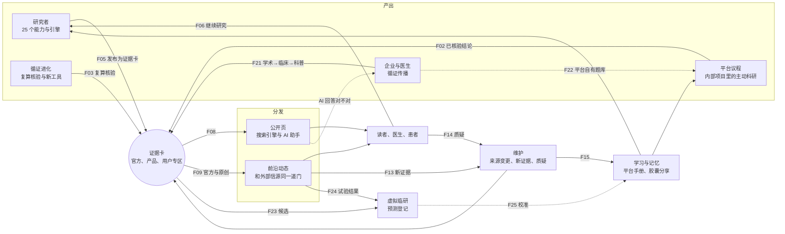

# 2026-10-05 · 「循证飞轮」方案 v2.0（定版）

把研究工具、证据专区、前沿动态、主动科研、循证进化、记忆、循证传播（原「循证 GEO」）和虚拟临研接成一个会自己转的整体。平台自己产证据，帮研究者、企业和医生产证据，也替全行业汇总证据；每转一圈，都留下别人抄不走的东西。

> **状态**：定版；未改代码、数据和生产配置。
> **v2.0（同日）**：按你对 GEO 的定位重写了这一块。改名「循证传播」，定位为企业和医生自助做自己产品的证据传播：沿患者旅程，从学术报告到证据卡，再到科普。第一条规则从「商业不碰编辑」改为「出品方标清楚、同一把尺子核验、每句可溯源」。GEO 的主张库和「证据卡片」层并入产品专区的证据卡。方案里的外部事实全部重新核对过一遍，有出入的已改正。
> **依据**：当前代码（`codex/research-evolution-engine-20261004` @ `c1f02c3cc`，含 10-05 提交的循证进化）；已有方案（10-02 研究工作台、10-04 循证进化、09-24 循证 GEO、09-28 虚拟临研、09-26 融合）；2026-10-05 联网核实的资料（附录 A）。八份笔记放在 `2026-10-05-evidence-flywheel-assets/research/`：两份代码盘点（L1、L2），四份外部资料（W1、W2、N1、N2），两份事实复核（V1、V2）。
> **读法**：第 0 节是全部结论，第 6 节是连线清单，第 13 节是裁决清单。

---

## 0. 一页结论

**你的想法成立，部件也齐了，缺的是线。** 平台已经有 25 个公开研究能力、六个专科引擎和虚拟临研的统计引擎；有证据专区（10-01 建成，AI 自动写卡、自动维护），有前沿动态（三百多个信源，每天筛选、归并成事件、出日报）；还有主动科研、循证进化（10-05 提交，默认关）、记忆胶囊和学习回路、循证 GEO（本方案改名「循证传播」）和虚拟临研。但这些模块之间几乎互不读写。代码里看到的断点有这几处：

- 研究产出的结论每条都核对过原文原句，却只留在项目里，没有一条路通到证据专区。
- 专区卡片进不了前沿动态，也进不了任何一次研究、GEO 或虚拟临研。专区只有登录用户能看，搜索引擎和 AI 助手都看不到。
- 主动科研的已核验结论只进私人简报。它的「文献哨兵」还会自己再抓一遍新文献，和前沿动态重复。
- 同一种东西有五套：专区卡片、研究运行的结论、主动科研的议程结论、GEO 的主张库、虚拟临研的证据条目。字段几乎一样，互不相认。撤稿和更正也有三套检测，各管各的。
- 记忆只能导出成文件再私下交给别人；学到的经验全部锁在单个账号里。09-29「方法和手册全平台复用」的裁决，在代码里还没有落地。
- 团队平台（www.evimed.com）另有一套证据专区，和 Science 的专区不通数据，一个产品里有两个专区。

**有三处需要校准。**

1. **闭环本身不是壁垒。** 别人抄得走的，是 AI 生成的数量和聚合本身。抄不走的，是每转一圈沉淀下来的五样东西：一个每条结论都连到原文原句、带版本和变更记录的证据库；一份公开、可核对的历史成绩（核验通过率、纠错时效、预测校准）；一个用已发表论文验证过的工具库；作者和读者网络；平台独有的测量数据。飞轮的每一环都要落到这五样上，指标也按这五样算（2.1 节、第 11 节）。
2. **「一手信源」要说准。** 平台对别人研究的总结是解读，不是一手。真正的一手有三类：平台在公开数据上做的原创分析；对已发表研究的复算与核验；用户用平台工具做出、署名发表的原创研究。前沿动态里按这个区分标注（2.2 节）。
3. **公信力靠「谁出的、凭什么」都看得见，不靠把谁挡在门外。** 企业和医生用平台做自己产品的证据传播，是飞轮里的又一类生产者，走同样的工具、同样的核验。三条规则写进代码：
   - 出品方标清楚（平台、企业、医生、用户），同一把尺子核验，科普的每一句都能追到原文；
   - 任何卡片（包括平台自己的）在研究里只当索引，不当证据；
   - 模拟结果永远不当证据。

   名字改为「循证传播」。监管文件里出现 GEO，是在「投毒」的语境下（网信办 2026 年 4 月的专项行动）；行业的应对是在前面加「可信」「白帽」。「循证传播」把「可信」落到证据上：先有证据，再有传播（4.3 节、5.6 节、第 8 节）。

**怎么做：一张卡、一套词表、六个环、二十九条线。** 证据专区的卡片成为全平台唯一的证据单元；前沿动态的实体词表成为全平台的挂钩键；六个环是生产、共创、分发、维护、学习和商业；二十九条线逐条落到现有模块里（第 4–6 节）。分四期，前三期约 8 周（第 10 节）。

**你提的每一件事落在哪。**

| 你说的 | 方案里怎么做 | 节 |
|---|---|---|
| AI 自己生产证据 | 平台出版方账号在内部项目里跑议程，只发核验通过的结论 | 5.1 |
| 提供工具，吸引用户来做内容 | 研究结果一键发布为证据卡；作者页；从卡片继续研究 | 5.2 |
| 通过专区发布，吸引人来看 | 不登录可读的公开页；关注推送；「继续研究」引导注册 | 5.3 |
| 汇总全行业，自己做的也是其中一部分 | 平台内容作为普通信源进前沿，标「EviMed 出品」，只有三类算一手 | 2.2、5.3 |
| 自己学习、迭代、研究，有记忆，记忆能分享 | 发布后的纠错和质疑进学习；通用经验成为平台手册；三层记忆共享 | 5.5、7 |
| 企业和医生用平台做自己产品的内容（原 GEO） | 改名「循证传播」：深度报告 → 证据卡 → 科普，沿患者旅程，一条证据链；产品专区标明出品方；AI 助手怎么说是检验效果的一把尺子 | 5.6、8 |
| 数据和证据用来做虚拟临研 | 卡片作为证据候选，前沿的试验事件更新假设，预测登记攒成绩 | 5.6 |

**已定的主要规则**（完整版见第 13 节）：

1. 不建新模块。线落在各自模块里，共享的只有一张证据卡、一套实体词表和三条规则。
2. 证据专区的卡片是全平台唯一的证据单元。另外四套对齐到它：GEO 的主张库直接并入产品专区的卡片，其余三套引用它，不再各存一份。
3. 三条规则写进代码，各有测试：出品方标清楚、同一把尺子、每句可溯源；只当索引；模拟不当证据。
4. 平台自产内容自动发布到官方专区。只发核验通过的结论；撤回和更正都公开留痕。
5. 用户的研究默认私有。发布是用户自己的一次点击；「公开到互联网」是单独的一档。
6. 公开页由服务端渲染，用固定网址。不做专门讨好 AI 的结构化标记和 llms.txt，实测它们对 AI 引用没有提升。
7. 平台内容进前沿动态，和外部信源走同一道门：在知识源插件里登记为普通信源，不加权，不开专栏。
8. AI 自产不投期刊，不批量写论文。论文由用户署名，用平台工具写，自动附 AI 使用声明。
9. 记忆分三层：个人的不共享；方法和公开知识由用户在平台内一步分享；通用经验经循证进化的平台供给上线。
10. 虚拟临研只通过已发表证据和聚合结果耦合，患者级数据不离开数据面。预测登记默认内部，试验结果出来之前不公开任何一条个别预测。
11. 两个证据专区合成一个：以 Science 的专区为唯一存储，团队平台的专区页改读同一个接口。
12. 预算：新增用途 `evidence`，每天 30 元，并发 1。用户专区的 AI 维护记到用户自己的账上，不再花平台的前沿预算。
13. 「循证 GEO」改名「循证传播」，对企业和医生自助开放，企业项目可以加成员；代码标识仍是 `geo`。

**你需要做的。** 说「开始」。另外，公开页需要一个域名：建议挂在 `www.evimed.com/evidence/` 下，由团队在反向代理里加一条路径；做不到就用一个子域名。生产机目前只有 IP 地址，没有域名就进不了搜索引擎。

---

## 1. 名称与定位

**名称**：「循证飞轮」（EviMed Evidence Flywheel）。飞轮的意思是：每一环的产出是下一环的输入，转得越久越省力。它没有代号，也不是一个模块，而是一组跨模块的连线、三条规则和一张共用的证据卡。代码落在各自模块里（第 9 节）。

**平台的六个角色和两个商业出口。**

| 角色 | 今天由谁承担 | 缺什么 |
|---|---|---|
| 生产者：AI 自己研究 | 主动科研、专区的 AI 编辑、循证进化 | 结论出不了私人简报；官方专区没有深度内容的来源 |
| 工具方：用户来做研究 | 25 个能力、专科引擎、知识库 | 做完的研究发不出去 |
| 企业和医生：做自己产品的证据传播 | 循证 GEO（改名「循证传播」） | 深度报告、主张库和专区卡片是三套东西；只对运营者开放 |
| 发布者：证据专区 | 证据专区 | 只对登录用户可见；没有作者页；不进前沿；两套专区 |
| 汇总者：前沿动态 | 前沿动态 | 没有平台自己的内容；关注的专区不推送 |
| 学习者：记忆与进化 | 记忆胶囊、学习回路、循证进化 | 经验锁在单个账号里；分享靠文件 |
| 商业出口 | 循证传播、虚拟临研 | 各做一套证据，不用平台已核验的证据 |

**与已有方案的关系。**

- **10-02 研究工作台**：N10（按进展选下一步）、N12（版本化纠正）、N14（科学反馈进学习）、N15（知识变化传到受影响的工作）是飞轮里「研究、学习、维护」这半圈的部件。本方案直接用，不重做。
- **10-04 循证进化**：是飞轮的「能力增长」一环。本方案给它新增线索来源（专区、循证传播、虚拟临研里「做不了」的事），并借用它的平台技能供给、金标准复现和前瞻评分。
- **09-24 循证 GEO**：按你 10-05 的定位改名「循证传播」。八步流程和方法包里的规则都保留，证据底座换成产品专区里的证据卡，并对企业和医生自助开放（5.6 节）。09-26 融合方案 §11 推荐的「临床回答里不放付费内容」，保留为第 8 节的一条原则。
- **10-01 前沿融合评审**：那一轮把「自有内容专栏」和「公开 RSS」排除在范围外，这是当时的范围决定。这次你要平台成为发布者，所以重新打开，但换了做法：平台内容走和外部信源同一道门进前沿，不开单独专栏（5.3 节）。
- **循证进化方案的「不自动对外发表」**：那一条针对的是研发和评测的产出。平台在官方专区自动发布已核验卡片，是本方案以你这次的方向为授权新开的口子，范围只限第 5.1 节的发布标准。投期刊之类的对外发表，仍按循证进化的 C 类裁决处理。
- **虚拟临研保持独立的旧约定**：项目规则里写着「虚拟临研在负责人宣布就绪前保持独立」；10-04 它已对所有用户开放，你这次也明确要把它接进来。本方案只接两头：已发表证据单向流进去，带标签的模拟结果按规则流出来。它的数据面、结果密封和版本规则一概不动（5.6 节）。

---

## 2. 对思路的校准

### 2.1 闭环不等于壁垒

外部资料一致指向同一个结论：数据量本身守不住，守得住的是信任、网络和工作流。

- a16z 2019 年的文章《The Empty Promise of Data Moats》指出，所谓数据壁垒大多只是规模效应：数据越多，新增一份独特数据的成本可能反而更高，带来的价值却在下降。NFX 区分了三种情况：真正的数据网络效应很少见；数据规模效应很快见顶；用户的数据和工作沉淀在平台上越多，平台就越难被替换。Greylock 的《The New New Moats》（2023）列出的价值和壁垒来源是：工作流、与数据和其他应用的集成、品牌与信任、网络效应、规模和成本效率，结论是「新的壁垒还是旧的壁垒」。
- 美国国家医学院在提出「学习型卫生系统」将近 20 年后自评（2024-12）：技术突破没有转化成系统整体的进步，关键阻碍是激励错位，回应方式是一套信任框架，而不是更多技术。
- 国内医生平台的收入九成来自药企营销：医脉通 2025 年报中精准营销占收入 92.6%。研究服务则正在被 AI 吃掉：梅斯 2025 年报里医生平台方案收入下降 15.3%，年报写的原因是 AI 让客户自己就能完成部分研究者发起研究（IIT）的相关工作。工具本身留不住人。
- 研究者愿意在哪里发表，取决于平台给不给可携带、可引用、有版本的署名：Zenodo 和 Hugging Face 给每个版本发 DOI；ResearchGate 的 RG Score 因为算法不透明、能靠刷问答抬高、对撤稿没有负信号，2022 年下线了。
- AI 生成的内容会挤掉人的贡献：ChatGPT 上线半年内，Stack Overflow 的活跃度相对于用不上 ChatGPT 的同类平台下降了 25%，作者认为这还是低估（PNAS Nexus 2024）。AI 内容越多，人核对过的数据（读者的纠错和质疑、用户的原创研究、真实世界的结局）越值钱。所以共创环要给署名、给被引用，不能让 AI 把人挤出去。

所以飞轮的设计目标不是「闭环」，而是让每一环都往下面五样资产里存东西：

| 资产 | 哪几环在往里存 | 为什么抄不走 |
|---|---|---|
| 证据库：每条结论连到原文原句，带版本、纠错和来源变更记录 | 生产、共创、维护 | 靠持续核验和维护攒出来。复制一份快照没有用，三个月不维护就过期 |
| 公开成绩：核验通过率、纠错时效、预测校准 | 维护、预测登记 | 时间戳之前的成绩补不出来 |
| 工具库：用已发表论文验证过的分析工具 | 循证进化 | 验证记录跟着版本走 |
| 作者和读者网络 | 共创、分发 | 署名、关注和被引用都沉淀在这里 |
| 独有测量数据：AI 助手怎么回答用药问题的时序、前沿事件图谱、方法在真实研究里的使用结果 | 用药问答观察、循证传播的测量、前沿、学习 | 只有长期在测的人才有 |

### 2.2 「一手信源」要说准

| 内容 | 性质 | 进前沿时怎么处理 |
|---|---|---|
| 平台在公开数据上的原创分析（药物警戒信号、孟德尔随机化、疾病负担趋势等） | 一手 | 自成事件 |
| 对已发表研究的复算与核验（循证进化的金标准复现、Meta 分析复算） | 一手（核验） | 挂在被核验研究的事件下，标「平台复算」 |
| 用户用平台工具做出、署名发表的原创研究 | 一手（作者署名） | 自成事件，标作者 |
| 对外部研究的综述和速览 | 解读 | 挂在原研究的事件下，不单独成事件 |

这和前沿动态 09-22 定下的归并规则一致：只有一手条目能合并两个事件，报道类条目只能挂进已有事件。平台对外说「我们是一手信源」时，指的只是上表前三行。

### 2.3 公信力靠「谁出的、凭什么」都看得见

**AI 助手引用谁。**

- 一项 2025 年的研究（Chen 等，arXiv 2509.08919）发现，AI 搜索系统性地偏向第三方权威来源。在美国的消费电子、汽车、软件三个行业，GPT 的引用中第三方来源分别占 92%、82%、73%；谷歌搜索在后两个行业约 45%。品牌自己的网站最不容易被 AI 引用。
- 英文健康类问题中，ChatGPT 有 27% 的引用来自政府网站、17% 来自专科学会（BrightEdge，2026-01）。
- 国内助手更看生态：元宝的引用中微信公众号占比高达 10%，豆包排名前五的信源有三个来自字节系；但在医疗健康领域，内容做得好的机构官网也能排进领域前列（新榜，2026-05，分析了约 1,680 万条引用）。
- 国内助手在健康问题上都往「权威机构加有资质的医生」靠。千问 2026 年 7 月上线「健康溯源」，每条建议都能追到文献、教材或说明书原文；百度称医疗搜索里 80% 的结果经过医生参与的三层审核。新榜 2026 年 8 月对六个助手的观察是：医疗赛道信源门槛最高，最该做的不是铺量，而是立资质，也就是专家署名、参考文献、资质说明。
- 内容本身的写法有用：加原文引用、加统计数字、标明出处，能把内容在 AI 回答里的可见度提高 30%–40%；堆关键词没有用（Aggarwal 等，KDD 2024）。
- 结构化标记和 llms.txt 没有用：谷歌官方说明出现在 AI 概览里不需要任何特殊标记；Ahrefs 跟踪了 1,885 个加了 schema 标记的页面，AI 引用没有提升；13.7 万个网站里约 3.8 万个放了 llms.txt，其中 97% 在一个月里一次都没被读过。

对企业来说，这几条指向同一件事：把产品证据放在品牌官网上，AI 不太引用；放在一个第三方证据平台上，标明出品方，每句话都能追到说明书、试验和指南的原文，才是站得住的做法。这正是循证传播要做的（5.6 节）。

**先例：出问题的都出在「看不见」，站得住的都靠「摆出来」。**

- 2010 年，WebMD 一个由礼来资助的抑郁自测，所有问题都答「否」，结果仍是「你可能有重度抑郁风险」。同一时期，参议员格拉斯利致信 WebMD，要求提供与礼来的合同和行业资助记录。资助方是谁写了，但内容怎么来的看不见。
- 2022 年 JAMA Network Open 的一项研究发现：在 UpToDate 声明「无利益冲突」的撰稿人中，57.9% 有收取企业款项的记录。
- 药企医学部本来就有一套「科学传播平台」，用分层的循证陈述统一对外的医学沟通，但它是内部文件，很少有人追踪效果（5.6 节）。循证传播把它做成公开、可核验、可追踪的版本。
- OpenEvidence 靠药企和器械广告免费服务美国医生，政策写明「广告主不能、也永远不能影响答案内容」，广告与答案明确区分。2026 年 3 月，Cochrane 宣布其出版方 Wiley 把 Cochrane 系统评价数据库授权给了它：内容生产者选择交给汇总者，说明汇总者的价值建立在被信任上。

**国内环境。**

- 网信办 2026-04-30 启动的「清朗·整治 AI 应用乱象」专项行动，把「伪造权威数据、使用 GEO 技术恶意营销」列为 AI 数据投毒的方式，也要求 AI 回答对引用信源做交叉验证、标注链接。2026 年的 3·15 晚会曝光了刷 AI 推荐的 GEO 系统。
- 行业随后出了几项团体标准，方向一致：从追求曝光和排名，转向建设可信的事实资产。
  - 新华网牵头的 T/CAPT 026—2026（8 月 12 日实施）要求「三区分治」：品牌知识分成事实库、观点库、营销表达库，营销表达里的事实主张必须以事实库的版本为准。
  - 中国商务广告协会的 T/CAACCHINA 001–005—2026（9 月公布）界定了黑帽和白帽：以操纵、污染、伪造、欺骗为目的的是黑帽；真实、合法、不操纵的广告和公关内容不算。医药被列为「高合规要求行业」，可信语料要能追到具体责任人、标明 AI 生成；测量要求每个最小分析格至少 30 个样本、至少 5 个 AI 助手、3 个城市。

能长久做下去的，是「用核验过的证据，让公众和 AI 都把产品说对」。

**由此定下三条规则（4.3 节）**：出品方标清楚、同一把尺子、每句可溯源；只当索引；模拟不当证据。

### 2.4 AI 自己产什么、不产什么

- 2025 年 Cochrane、Campbell、JBI、CEE 联合发布的 RAISE 立场声明提出：AI 参与证据综合时，凡是做出或建议判断的步骤，都应当完整、透明地报告，写明系统、版本、日期、用途和局限；AI 要在人的监督下使用，综合者对结论负责。
- 公开数据库上的套路化论文已经泛滥，期刊在收紧：
  - 基于 NHANES 的单因素论文，2014–2021 年平均每年 4 篇，2024 年到 10 月 9 日就有 190 篇（PLOS Biology 2025）。基于九个公开数据库（包括 FAERS、NHANES、UK Biobank、FinnGen、GBD）的论文，2025 年有 23,005 篇，是 2022 年的 3.0 倍（J Clin Epidemiol 2026）。
  - Frontiers 从 2024 年 7 月起，要求孟德尔随机化研究附上新的实验验证或作者本机构的数据，一年多拒了 5,513 篇；2025 年扩到 NHANES 等所有公开数据库。PLOS ONE 要求结论至少在第二个独立数据集里验证。
  - 这几类数据，恰好是平台专科引擎让分析变便宜的那几类。
- ICMJE 2026 年 1 月把 AI 的规定扩成了单独一节：AI 不能列为作者，使用 AI 要在投稿时披露，「以 AI 生成的材料作为主要来源不可接受」，这正是规则二。COPE 2025 年修订的撤稿指南，把「未披露的 AI 参与」列为撤稿理由。
- 2025 年斯坦福的 Agents4Science 会议要求 AI 当作者：314 篇投稿录用 48 篇。一位参与评审的天体物理学家说，她看到的论文技术上没错，但「既不有趣也不重要」。
- 平台的做法：AI 自产的是证据卡、持续更新的专题综合、复算核验记录和公开数据上的原创分析，每张都写明模型、版本、日期，以及 AI 做了哪几步。AI 不写期刊稿，也不以任何人的名义投稿。论文由用户署名、用平台工具写，平台自动附上 AI 使用声明。按 09-29 的裁决，不设强制人工签核；读者可以质疑，纠错公开留痕。

### 2.5 活证据靠事件驱动，不靠排班

- 活证据失败的原因，是每次更新的人力成本和阶段性资助。澳大利亚 COVID 活指南每周更新一版，头五个月就用到 11 个全职当量的人手；联邦政府的资助到 2022 年底不再续，指南随后缩减，2023 年 8 月停止更新。英国国家卫生研究院的资助到 2023 年 3 月底结束，设在英国的 Cochrane 评价组当天宣布关闭，只有部分找到了别的经费（Cochrane 公告；Nature 2023 年 9 月有专题报道）。
- 真正需要高频更新的主题很少：澳大利亚卒中活指南的调查里，只有 5% 的评估认为需要每月检索。
- AI 把单次更新的成本打了下来：有预印本报告，用大模型两天内复现并更新了 12 篇 Cochrane 评价的主要分析。这是平台做得起活证据、别人做不起的地方。
- 做法：有对得上的新证据才更新（按实体和标识符匹配，5.4 节），不按固定周期。Cochrane 活评价的退出条件照用：结论已确定、问题不再重要、预计不会有新研究，或者没人在读。满足任一条就转为「不再更新」，并标明最后核对日期。

---

## 3. 现状：每个模块产出什么、接到了谁

### 3.1 模块盘点

| 模块 | 产出（存在哪） | 谁能看 | 今天接到了谁 | 断点 |
|---|---|---|---|---|
| 研究运行 | 结果版本，临床包里每条结论跑过逐字核验（`evimed_product` 的 `result-version`） | 本人本项目 | 学习、记忆、主动科研（`agenda-delta.json`）、循证进化的反馈 | 没有发布，也没有分享 |
| 证据专区 | 专区和卡片（`evimed_frontier.evidence_*`），卡片有结构化内容、带哈希的来源、AI 复核回执 | 登录且在前沿受众里的用户 | 从前沿条目手动建卡；AI 编辑按标题子串匹配前沿条目自动写卡；「问这个专区」生成一份不发送的对话草稿 | 卡片没有结论字段（固定返回空数组）；不能公开访问；单一所有者；关注不推送；研究结果进不来 |
| 前沿动态 | 条目、事件、日报、周报、热榜、与你相关 | 登录用户 | 只吃知识源插件；可存入知识库、生成研究草稿、建卡；给循证进化送论文 | 没有平台自己的内容；与你相关不看专区关注和知识库；`frontier_search` 只返回条目 |
| 主动科研 | 议程、单次运行、简报；结论分「未验证→过闸门→重跑复现」三级，另有独立复核 | 本人本项目 | 知识库材料、结果影响触发的续跑、循证进化的工具与唤醒 | 已核验结论只进私人简报；文献哨兵和前沿重复抓取 |
| 循证进化 | 研发卡、工具、裁决、数据要求、前瞻登记、复现证明 | 运营者（研究者只看可用工具和研究机会） | 前沿论文、运行缺口、规划器停顿、知识库里的 Meta 和方案、数据语义、反馈 | 复现证明和新工具从不出现在读者面前；专区、循证传播、虚拟临研的缺口进不来 |
| 知识库 | 项目资料、资料理解、个人文库 | 本人 | 胶囊里的资料事实、主动科研材料、虚拟临研的 `kb_search` | 资料不能被引用进卡片；卡片和知识库各存一份原文 |
| 记忆、胶囊、学习 | 记忆、胶囊、学到的方法、能力手册 | 本人 | 资料理解、来源变更标签、循证传播和主动科研的运行 | 手册只在本账号内生效；分享只能导出文件；记忆的来源不能指向卡片和前沿条目 |
| 循证 GEO（改名循证传播） | 主张库、五层文章（深度分析、证据卡片、科普、问答、纠错）、测量与指标、投放 | 运营者和预览用户；按项目隔离 | 只用通用研究工具 | 不读专区、前沿、知识库；深度报告在研究里另跑一遍，主张库和专区卡片是两套；没有出品方标注；企业团队不能协作；媒体被引用的统计只在模块内部用 |
| 虚拟临研 | 研究、假设卡、证据条目、知识包、报告；九种数值来源标签 | 研究成员（生产已对所有用户开放） | 自己的检索工具、项目知识库 | 不读专区、前沿和别的综合；认定过的知识包仍只属于一个账号 |
| 团队平台的专区 | 话题、卡片、专家评分、投稿审核、个性化推荐（团队的 Java 服务） | 未登录用户也能看到入口 | 被 Science 的前沿以普通信源读取（ChiCTR、指南索引） | 和 Science 的专区是同一个概念的两套实现，没有数据连接 |

### 3.2 同一种东西有五套

| 在哪 | 主要字段 | 怎么核验 | 范围 |
|---|---|---|---|
| 专区卡片 | 问题、回答、人群、比较（事件数、分母、相对效应、确定性）、来源（哈希、覆盖、撤稿和更正状态）、编辑回执 | AI 复核 + 来源指纹 | 登录可见 |
| 研究运行的结论 | 编号、类型（直接、综合、推算）、逐字引文、来源、核验状态、位置 | 逐字核对原文（确定性） | 项目私有 |
| 主动科研的议程结论 | 陈述、类型、等级、来源、效应指标 | 运行自带闸门 + 独立复核 | 项目私有 |
| 循证传播（原 GEO）的主张库 | 陈述、逐字引文、来源类型、证据等级、人群、是否在说明书内、核验和失效日期 | 运行内核对 | 项目私有 |
| 虚拟临研的证据条目 | 引文、定位、数字（必须是引文里的记号） | 代码核对引文与定位 | 研究私有 |

另外有三个也叫「卡」的东西：循证进化的「研发卡」（工具研发计划，不是证据）和虚拟临研的「假设卡」（模拟输入）保留原名；GEO 文章里的「证据卡片」层，本方案直接并入专区的证据卡，作为它的公众版视图（5.6 节）。本方案里单说「证据卡」，只指专区卡片。

### 3.3 两个顺手要修的问题

- **平台内容挂在个人账号下。** 导入的官方专区归导入时指定的账号所有，外键是级联删除：删掉那个账号，平台发布的证据就跟着没了。
- **任何人的专区都花平台的钱。** 打开专区「自动更新」只检查是不是专区所有者，不检查身份。所以任何前沿受众里的账号建个专区、打开自动更新，AI 写卡和复核的费用都记在平台的前沿预算上（每天 10 元，与前沿编辑共用）。

---

## 4. 总体设计

### 4.1 一张证据卡

专区卡片成为全平台唯一的证据单元。已有的字段全部保留，新增七项，契约从 `apps/server` 搬到 `packages/domain`，作为各模块共用的词汇：

| 字段 | 今天 | 新增或调整 |
|---|---|---|
| 结论 `claims` | 固定返回空数组 | 沿用研究运行的结论形状（编号、类型、逐字引文、来源序号、核验状态、位置），同一个 `claimVerification` 核验 |
| 出品方 `producer` | 编辑回执里只有 AI 或人 | 平台、企业、医生、用户、外部导入五类，外加和所涉产品的关系（例如「企业出品，涉及其产品」）；必填 |
| 性质 `originality` | 无 | 一手：原创分析、复算核验、原创研究；解读：综合、速览 |
| 谱系 `lineage` | 只有前沿条目编号 | 加上结果版本、运行、议程、上一版卡片、被核验的研究 |
| 实体键 `entityKeys` | 无 | 药品、疾病、试验、方法，取自前沿词表（4.2 节） |
| 患者旅程 `journeyStage` | 无 | 阶段按病种定义（沿用方法包的患者旅程方法，不用一张固定表）；产品专区必填，其他可选 |
| 披露 `disclosure` | 编辑回执里有作者模型 | 模型和版本、生成和最后核对日期、AI 做了哪几步、作者和审核人（企业和医生的内容必填） |

专区加两项：**类型**（官方专区由平台出品；产品专区由企业或医生出品；用户专区由研究者出品）和**公开范围**（平台内、互联网）。

一张卡有两种视图，出自同一组已核验的结论：

- **临床版**给医生和药师，按 GRADE 结果总结表的版式。
- **公众版**给患者和公众，沿用方法包（geo-skills）里「证据卡片」的七栏：一句话回答、这是什么、说明书怎么说、什么情况不适用、出现什么情况立刻就医、实测到的常见误解、来源和核对日期。另外加一个「事实框」：和对照相比，每 1000 人里多少人获益、多少人出现不良反应，用同一个分母。英国一项 2,305 人的随机对照试验显示，同样的信息做成事实框，比纯文字更容易看懂（R Soc Open Sci 2020）。

卡片里的「比较」一栏已经有结局、时间点、分母、事件数、相对效应和确定性，和 GRADE 的结果总结表（Summary of Findings）基本同构。那是循证医学里最通行的卡片格式：Cochrane 要求每篇系统评价至少有一张。公开页按它的版式展示：每个结局一行，写相对效应、绝对效应、研究数和受试者数、证据确定性。

其余四套对齐到证据卡的方式：

- **研究结论**：一键生成卡片（F05）。
- **主动科研的议程结论**：平台议程的直接成卡（F02）；用户议程的作为候选，用户一键发布。
- **循证传播的主张库**：直接并入产品专区的卡片，不再单独存（F21）。
- **虚拟临研证据条目**：从卡片取候选，由虚拟临研自己的代码重新核对（F23）。

### 4.2 一套实体词表

前沿动态已经有一张词表（药品、疾病、机构、试验、方法），每个条目在发布时都会算出实体键。这一步抽成共用模块。专区、卡片、议程、循证传播的产品、虚拟临研的研究，都打上同一套实体键。

所有连线都按实体键和标识符（DOI、PMID、注册号）对接，不再用今天专区 AI 编辑那种标题子串匹配。

### 4.3 三条规则

| 规则 | 内容 | 代码点 |
|---|---|---|
| 一、标清楚、一把尺、句句可溯源 | 每张卡、每篇内容写明出品方和与所涉产品的关系；所有内容走同一套逐字核验；科普的每一句都追到一条卡片结论，再追到原文；官方专区只由平台出品；排序里没有付费字段 | 出品方是卡片契约的必填字段；专区写入只来自五处（卡片所有者本人的会话、平台议程、AI 编辑、运营者的导入脚本、循证传播项目写它自己的产品专区），在代码里逐一列明，写入时检查；循证传播的文章引用卡片结论编号，现有的溯源检查改为对卡片做；排序的输入是闭集 |
| 二、自有内容只当索引 | 研究、循证传播、虚拟临研引用 EviMed 的任何卡片（平台、企业、医生、用户出品的都算）时，必须引它所依据的原始来源；平台内容进前沿后，也不算独立佐证 | `clinicalEvidence.mjs` 已经不让引用 `www.evimed.com/api-evimed/` 这类内部接口；本方案加一类：引用公开卡片网址时给出提示「这是 EviMed 自己的证据卡，请改引原始来源」，只提示，不拦截。前沿沿用「只有外部一手条目能合并事件」 |
| 三、模拟永远不当证据 | 数值来源为「预测」「假设」「合成」的值，不能进入证据卡、循证传播的内容和临床回答；「插补」「重建」的值只能出现在写明方法的推算类结论里 | 建卡时检查带数值来源标签的值（虚拟临研和数据语义共用九种数值来源），不合格的值拒收并说明原因；虚拟临研的报告只能进「模拟研究」栏目 |

规则二要防的是自我放大：平台写的内容被平台自己当证据引用，越引越像真的。Nature 2024 年的一篇论文显示，不加区分地用模型自己生成的内容来训练，模型会出现不可逆的退化（「模型崩溃」）。引用链里也是同一个道理。ICMJE 2026 年的新规则也写明：以 AI 生成的材料作为主要来源不可接受。

规则三和监管的方向一致：

- ICH M15（模型引导的药物研发，2026-01-29 定稿，FDA 6 月发布最终版）要求分别说明建模用了哪些数据、另外还有哪些数据或证据；一般来说，模型结果是决策的唯一依据时，模型的影响按「高」评估。
- EMA 2022 年认可的 PROCOVA，是把数字孪生的预测作为随机对照试验里的协变量来用（限连续型结局）。按我们的理解，它没有替代对照组。
- FDA 关于外部对照试验的指南，至今仍是 2023 年的草案。

### 4.4 五种标签

都是标签，不拦截任何用户操作：

- **出品方**：平台、企业、医生、用户（带署名）、外部导入；企业和医生的内容另标和所涉产品的关系。
- **性质**：一手（原创分析、复算核验、原创研究）或解读（综合、速览）。
- **核验**：每条结论 ✓ 或 ⚠；计算出的数值附引擎回执。
- **时效**：现行、有新证据尚未纳入、来源已撤稿或更正、已被新版本取代、不再更新（标最后核对日期）。
- **披露**：见 4.1 节。

### 4.5 全图

---

## 5. 六个环

### 5.1 生产环：平台自己研究

**谁来做。** 新建一个平台出版方账号「EviMed 证据中心」。它不能登录，不属于任何个人，官方专区都归它。平台的研究在它的内部项目 `evimed-evidence` 里进行，费用记在新用途 `evidence` 下。

**选题（F01）。** 一个 Flash 选题器（形态同 N10 规划器）每天读五类信号：

- 前沿里的高分事件和安全警示；
- 跨用户的提问热度：只用「与你相关」已抽取的实体做计数，至少 5 个不同用户问过的实体才计入，不读任何人的对话内容；
- 专区的关注和阅读；
- 平台自有题库测出的 AI 常见错误（F22）；
- 已有卡片的过期情况。

选题器按预算决定新建或续跑哪个议程，每个议程对应一个官方专区。首批六个官方专区：已有的房颤抗凝、心肾与慢性肾病、研究解读，加上虚拟临研三个知识包对应的非小细胞肺癌、乳腺癌、2 型糖尿病。

**四种产出。**

| 类型 | 怎么来 | 核验 |
|---|---|---|
| 速览卡（解读） | 现有 AI 编辑：围绕一篇新研究写卡，再由另一次模型调用复核 | AI 复核 + 来源指纹 |
| 综合卡（解读） | 平台议程跑完整研究能力，多来源 | 逐字核验 + 独立复核 |
| 原创分析卡（一手） | 议程调用专科引擎，在公开数据上做分析 | 附引擎回执，数字来自机器值 |
| 复算核验卡（一手，F03） | 循证进化对新发表 Meta 分析的复算、对已发表研究的金标准复现 | 复算落在容差内，或分歧已经裁定 |

**发布标准**（平台作为作者的编辑标准，不拦截任何用户操作）：

- 只收通过运行闸门、且独立复核没有推翻或削弱的结论。
- 卡片首句只能用重跑复现过的结论，或单一来源逐字支持、独立复核也没推翻的结论。这沿用 `digestPlacement` 的现有规则。
- 综合性结论用保守措辞，并带把握度。
- ⚠ 的结论留在内部项目，不发布。
- 原创分析卡专门防套路化（2.4 节），规则如下：
  - 题目只能来自选题器的信号，不在数据库里找显著结果；
  - 按对应的报告规范做：孟德尔随机化用 STROBE-MR，药物警戒信号用 READUS-PV；
  - 做多重比较校正；
  - 在第二个独立数据集里复现了的，才写成「发现」；否则标「信号，待验证」；
  - 每周最多发两张。

**文献哨兵改读前沿（F04）。** 所有议程（包括用户自己的）的「新文献」信号都改从前沿动态按实体取，不再各自重抓。议程仍可以自己检索；省下来的是重复抓取的钱。

**预算。** 每天 30 元，并发 1。按 10-04 实测，一次完整的证据综合约 7 元，所以每天最多约 4 次深度更新。速览卡仍走前沿预算。内部项目不挤占研究者的运行时。

### 5.2 共创环：用户用工具产出、署名发表

这一环的生产者有三类：研究者、企业、医生。企业和医生做的是自己产品的证据传播，单独放在 5.6 节；下面说研究者。

- **发布为证据卡（F05）。** 结果页上点一下，就从已核验的结论生成卡片草稿：✓ 的结论默认勾选，⚠ 的默认不勾；来源带哈希和原文摘录；受限来源只给出处，不给原文；数值只取证据矩阵和引擎的机器值。用户再点「发布」。这是用户把自己的内容公开，是用户自己的选择，不是审批。
- **两档公开范围**：平台内可见（即今天的「已发布」）和公开到互联网（新增）。已经发布的旧专区保持平台内可见，等作者自己选。新作者公开到互联网的页面照常能打开，但先不进站点地图、不让搜索引擎收录；作者有 3 张以上带 ✓ 结论的卡片后自动解除。这样防住借平台域名灌水，又不拦任何人发布。
- **作者页（F07）**：作者公开的专区和卡片、关注数、被研究引用的次数、变更记录。
- **社区卡片（F07）**：官方专题页按实体收录用户公开的卡片，署名、只读，按核验比例和评分排序。平台不改用户的内容。
- **用这张卡继续研究（F06）**：从卡片新建项目，原始来源导入知识库，问题预先填好，运行记下它来自哪张卡。之后这次研究再发布时，自动成为那张卡的后续版本或相关卡。今天的「问这个专区」只生成一份不发送的草稿，运行也不记来源，这条线把它补全。
- **激励（只预留接口）**：卡片被别人的研究引用到一定次数，送灵豆。默认关，金额以后由你定。

### 5.3 分发环：发出去、被看见、再回来

- **公开页（F08）。** 由服务端渲染的只读页面：专区、卡片、作者、变更记录、编辑说明。用固定网址，有站点地图、标题和描述；不登录也能读；页面底部有「继续研究」，引导注册。不做专为 AI 的结构化标记和 llms.txt（2.3 节）。该做的是两件事：让页面被收录；让内容带原文引用和数字。
- **进前沿走同一道门（F09）。** 官方专区和用户的原创研究输出一个 JSON 和 RSS 源（产品专区的内容不进，5.6 节），在知识源插件里登记成普通信源 `evimed-evidence`，和三百多个外部信源一样被抓取、筛选、打分：不加权，不开专栏。前沿界面按信源属性标「EviMed 出品」。解读类卡片带着原研究的 DOI 或注册号，按现有聚类规则挂进原研究的事件；一手内容自成事件。这样前沿「平台从不自己读信源、只吃插件」的架构不变，平台内容也就不可能被特殊照顾。
- **关注推送（F10）。** 关注的专区有新卡或更新时进收件箱，也进日报和周报的「你关注的专区」，沿用现有的通知开关。
- **与你相关（F11）。** 输入里加上专区关注和知识库资料的实体。
- **研究里能检到卡片（F12）。** `frontier_search` 增加「卡片」一类结果，不新增工具。引用时按规则二只当索引。
- **自有渠道（只预留接口）。** 国内助手更看生态（元宝看公众号，豆包看字节系），所以以后要把卡片同步到公众号、百家号、头条号这类渠道。账号由你提供后再接。循证传播（原 GEO）已经在统计哪些媒体被哪个 AI 引用（`media_outcomes`），这份跨项目的汇总数据用来挑渠道。
- **测平台自己被引用了多少（F22 的一部分）。** 用循证传播的探针，测 AI 助手回答常见用药问题时引用 EviMed 页面的比例。

### 5.4 维护环：证据会变

- **一个来源变更事实（底座 B5）。** 撤稿、更正、关注声明、新版本，按 DOI、PMID、注册号只记一次。卡片、研究结果、记忆、虚拟临研的假设都读这一份。今天是三套各自检测：结果影响、专区 AI 编辑、前沿的条目关系。
- **新证据（F13）。** 前沿的新条目按实体和标识符对上某张卡片时：
  - 卡片先标「有新证据，尚未纳入」；
  - AI 写的卡片，自动出后续版本；
  - 用户、企业和医生的卡片，通知出品方（「有 2 项新研究可能影响你的卡片」）；
  - 官方综合卡，交给选题器决定要不要重做。
- **质疑（F14）。** 读者对某条结论点「质疑」，会触发一次复核作业（逐字核对 + 模型判断），结果是维持、修正或撤回，写进公开的变更记录。用户、企业和医生的卡片只通知出品方并附建议，平台不替出品方改。
- **退出。** 按 2.5 节的条件转为「不再更新」。撤回的卡片保留一个说明页，写明原因。

### 5.5 学习环：越用越会做

- **发布后的结果进学习（F15）。** 纠错、质疑的结论、撤稿影响、复算差异，都会变成两样东西：一是事故用例，进 `evals/`（原则 6）；二是一条观察，挂到产出那张卡的运行所用的方法或手册摘要上（N14 的机制）。
- **通用经验进平台手册（F16）。** 今天的手册只在本账号内生效。不含项目事实的经验（例如怎么做出能通过核验的证据矩阵），经循证进化的平台技能供给上线：先在隔离环境复核，再生效，再按现有的序贯伤害检验退役。研究者的数据和结果不进这个库，这是平台技能供给本来就有的约束。这一条落实 09-29 的裁决。
- **各模块的「做不了」进循证进化（F20）。** 官方专区缺的计算、循证传播的题目需要的分析、虚拟临研缺的方法，都作为研发线索。循证进化今天只收运行失败、规划器停顿和手册缺口。
- **记忆共享**：见第 7 节（F17–F19）。

### 5.6 商业环：循证传播与虚拟临研

#### 循证传播（原「循证 GEO」）

**它是什么。** 企业和医生用平台把自己产品（或自己用的疗法）的证据研究清楚，做成医生和公众都看得懂的内容，再分享出去，让人知道产品的特点、证据、差异和优势。主线沿着患者旅程走，分三层：先做学术研究，再转成临床认知，再转成科普认知。AI 助手怎么描述这个产品，只是其中一个出口，也是检验效果的一把尺子。

**新名字：「循证传播」**（Evidence Communication）。代码里仍叫 `geo`：库表、路由、能力和 `OPEN_SCIENCE_GEO_*` 配置键都不动，只改产品名和界面文字。理由有四：

- 它做的是传播，不是「优化引擎」。
- 「循证」放在前面：先有证据，再有传播，每一句公众内容都能追到原文。
- 监管文件里提到 GEO，是在「投毒」的语境下；行业今年的应对，是在前面加「可信」「白帽」（「可信 GEO」，新华网的 GEO 平台说「可信传播」）。「循证传播」更进一步，说明「可信」从哪来：从证据来。AI 可见率、正确率这些测量口径照旧，作为模块里的一把尺子（界面上叫「AI 回答监测」），只是名字里不再有 GEO。
- 平台里另有一个 GEO：基因表达分析用的 NCBI 基因表达数据库也叫 GEO。改名之后，界面上不再撞名。

**沿着患者旅程排内容。** 每个阶段要回答的证据问题不一样：认知阶段讲疾病负担和症状；诊断阶段讲检查的准确性和延误；治疗选择阶段讲不同方案的获益和风险；用药和随访阶段讲安全性、能不能坚持用药、真实世界的结果。阶段怎么分因病种而异，按方法包的患者旅程方法逐个病种定。一项患者访谈研究发现，确诊前患者找的是症状和诊断的资料，确诊后找的是预后、治疗选择和不良反应，并且希望资料引用经过同行评议的来源（Patient 2026）。

**三层，一条证据链。**

| 层 | 给谁 | 产出 | 从哪来 | 怎么核验 |
|---|---|---|---|---|
| 学术层 | 医学团队、专家 | 深度分析报告：疗效和安全性的证据综合、指南和说明书、真实世界信号 | 平台的研究能力（证据综合、Meta 分析、药物警戒等），就是你们现在先跑的深度报告 | 逐字核验原文，独立复核 |
| 临床层 | 医生、药师 | 证据卡（临床版）：患者旅程上每个关键临床问题一张卡，写结局、绝对和相对效应、证据确定性、是否在说明书内；产品的差异和优势写在这一层 | 学术层已核验的结论 | 同一把尺子；差异化结论按证据类型标注 |
| 科普层 | 患者、家属、公众 | 证据卡（公众版，带事实框）、科普稿件、问答：讲疾病、讲治疗选择、讲证据 | 临床层卡片上的结论 | 每一句都追到卡片上的一条结论，再追到原文；下层不说上层没有的话；获益和风险用绝对数字、同一个分母，不只用「明显」「大幅」这类文字描述；不拿患者故事当证据 |

- **差异化结论按证据类型标注**：头对头比较；锚定的间接比较；无锚定的比较只供参考。欧盟卫生技术评估的方法指南明确说，无锚定的间接比较依赖的假设「很不可能成立」，应当优先用锚定的方法。
- **差异放在临床层，科普讲疾病、治疗和证据。** 处方药的产品内容只进专业渠道，渠道规则沿用方法包已有的规定（`geo-gate-compliance-channels`）。
- **临床层放在专业平台上，正合医生的习惯。** 丁香园与麦肯锡 2026 年的调研（4,150 名医生）显示：近八成医生已在工作中用 AI，但查药品信息主要还靠专业医学平台和文献，用 AI 渠道的占 24%（据中国日报网对报告的报道）。
- **「下层不说上层没有的话」** 是方法包里现有的规则，这次推广成整条线的规则。现有的溯源检查（每个数字和引文追到一条结论、每条结论追到来源）改为对着产品专区的卡片做。
- **科普层的写法有现成标准可依。**
  - 德国循证医学网络的《循证健康信息指南》（2017）：获益和风险用绝对风险表示，不能只用文字描述；比较时用同一个分母；不推荐用患者故事；作者和出资方要写明。
  - 欧盟临床试验的「通俗摘要」规范（2021）：12 岁以上能读懂；用事实、客观的语言，不写成推销；严重不良反应写在前面；最好请患者读一遍再发。
  - 效果有试验证据：带绝对数字和证据确定性的通俗摘要，让读懂获益、风险和证据质量的读者从 18% 升到 53%，和文化程度无关（J Clin Epidemiol 2015 的随机对照试验）。
  - 国内居民健康素养水平 2025 年是 33.69%，三个人里有两个看不懂专业表述。方法包要求科普「初中水平能读懂」，这条照旧。
- **三层的结构本身就是循证医学里「知识转化」的标准路径**：证据综合，再做成医生用的工具，再做成公众用的工具（Straus 等，CMAJ 2009）。

**它就是药企「科学传播平台」的公开、可核验版。** 药企医学部本来就有一套「科学传播平台」：几根支柱，每根下面是分层级的循证陈述，配一份术语表，用来统一对外的所有医学沟通。但它是内部文件，最常见的形式是 60 多页的幻灯片；ISMPP 2025 年会上报告的一项调查里，四成多受访者没有经常使用它，27 人里只有 5 人有追踪使用情况的办法。循证传播把同一套东西做成：

- 支柱和陈述就是产品专区里的卡片结论；
- 每条结论连着原文；
- 每篇下游内容连着结论；
- AI 助手怎么说，就是使用效果的度量。

这也正是团体标准 T/CAPT 026—2026 的「三区分治」：产品专区里带版本的卡片就是事实库；临床解读是观点；科普和推广是营销表达，里面每一条事实主张都引用卡片结论的版本号。

对企业还有一层直接的好处。市场监管总局 2026 年 6 月发布的《广告引证内容执法指南》要求：引文和原文意思一致；出处写明、可以查到；被引的数据或结论一旦被修正，内容要跟着改，否则算误导。这三件事，正是这条证据链自动在做的：逐字核验、出处带链接、来源变更自动提示更新（5.4 节）。

**和飞轮怎么接。**

- **同一张证据卡。** 原来的主张库和文章里的「证据卡片」层，统一成产品专区里的证据卡。临床版和公众版是同一张卡的两种视图（4.1 节），不再各存一份。
- **产品专区（F28）。** 专区分三种：官方专区（平台出品）、产品专区（企业或医生出品）、用户专区（研究者出品）。公开页上分栏展示，出品方和与产品的关系写在卡片最上面。
- **同一把尺子。** 企业和医生的内容，和平台自己的内容走同样的逐字核验，不更松也不更严。
- **研究只认原始来源**（规则二）。产品卡片不会左右研究和临床回答的结论。
- **前沿动态不收产品专区的内容。** 前沿只收平台官方内容和用户原创研究；企业的新闻稿本来就作为「企业」类信源在前沿里。
- **测量。** AI 助手按患者旅程的问题去测，先看说得对不对，再看有没有说到。
  - 对不对：适应证、用法用量、禁忌、不良反应是否和说明书一致（指定信息正确率），以对应的已核验卡片为准；另外查三样：有没有超说明书的说法，有没有漏掉安全信息，回答里引用的链接是否存在、说的是不是那回事。
  - 有没有说到：疾病层面问题上的可见率、指定信息覆盖率、信源引用率。可见率和排名用来分析，不单独当考核指标。
  - 口径对齐 T/CAACCHINA 003—2026（方法包的指标本来就和它基本一致）：每个最小分析格至少 30 个样本，记下助手的版本和模式。
  - 讲错了就出纠错材料，72 小时内启动更正，改了再测。
  - 客户项目的数据归客户；跨项目只用汇总统计（哪些媒体被哪个助手引用）挑渠道。
- **平台用药问答观察（F22）。** 平台有一套自己的题库：约 60 道常见用药问题，按药品类别出题，不针对任何品牌。每月在探针上测一轮，五个 AI 助手按平均每题 47 秒算，约 4 小时；哪个助手当时掉线，就跳过它，下一轮补测。测出的常见错误进选题器，产出纠错卡；按类别统计的准确率作为公开观察发布。这件事值得做：一项研究测了必应 AI 助手对 500 个常见用药问题的回答，总体准确，但普遍难读懂；在挑出来的 20 条不准确回答里，专家认为 22% 可能导致严重伤害甚至死亡（BMJ Qual Saf 2025）。2026 年 1 月，谷歌撤下了部分肝功能检查问题的 AI 摘要。

**为什么强调医生和出处。**

- 公众最信医生。美国 2026 年的两项调查：85% 的人会从医护人员那里获取健康信息，其中 65% 认为这些信息很准确；对来自医生的信息，80% 的人有把握分辨真假，对 AI 的信息只有 56%（Pew、KFF）。制药业则是公众印象最差的行业之一：盖洛普 2023 年的调查里，只有 18% 的美国人对它有正面看法。
- 国内的平台和规则都把医生放在前面。抖音有 7.1 万名认证的个人医疗创作者，过半来自三甲医院；2025 年四部门的通知规定，没有医疗资质认证的账号不得发布专业医疗科普。
- 国家九部门 2022 年的健康科普指导意见，对科普内容的要求是：有可靠的科学证据，原文写的就是「遵循循证原则」；要素齐备，写明来源、作者、发布时间、适用人群；由相应领域的专家编写和审核。「循证传播」的名字和做法都对得上。

**谁来用（F29）。**

- **企业**：品牌、医学、市场团队，可以加外部代理。企业项目可以加成员，沿用虚拟临研的研究成员模式（平台今天只有个人账号）。
- **医生**：医生用平台的卡片写自己的科普，讲本专业的疾病、治疗和证据，署名发布到自己的专区和渠道；署名页显示医院、科室和专业。平台给每句话出处，自动加 AI 生成标识，不替医生说话。这和 2025 年卫健委等发布的《医务人员互联网健康科普负面行为清单》对得上：不超出本专业、不发未经核实的内容、标明 AI 生成、不借科普卖货。医生也做企业内容的医学审核，现有规则本来就要求作者和审核人实名可见。
- **自助使用**：受众从「运营者」改为所有账号，一项配置，和虚拟临研 10-04 的做法一样。

**和「投毒」划清界限，写进产品而不是写进声明。** 下面五条对应团体标准对白帽的界定：真实、合法、不操纵。

1. 每句话有出处。
2. 标明谁出的、和产品什么关系；付费投放出去的内容标「广告」或「商业合作」。
3. 不造数据、不冒充专家：作者和审核医生实名。
4. 处方药的产品内容只进专业渠道，公众层讲疾病和治疗。
5. 不靠铺量：同一内容不做矩阵式批量分发。团体标准把「语料轰炸」列为黑帽；方法包本来就有同域名上限。

#### 虚拟临研

- **证据条目候选（F23）。** `vcr-evidence` 能力通过 `frontier_search` 拿到卡片，卡片里的比较（含引文、定位、数字）作为候选。虚拟临研自己的代码照常逐字核对引文和定位，数字必须是引文里的记号。卡片只省掉检索这一步，并不被信任。
- **试验事件（F24）。** 前沿出现同一适应证的试验注册、结果或说明书变更时，进先例库作为候选。进行中的研究，如果假设卡的来源有了新结果，就标「有新证据」，并自动算出一个新版本的假设；旧版本保留，已经冻结的分析计划不动。
- **知识包升级（F26）。** 账号里由研究负责人认定过的知识包，经来源复核后成为平台知识包（不可变版本，署名）。官方专区和对应的知识包互为来源，让知识包跟着证据持续更新。
- **预测登记（F25）。** 平台议程或虚拟临研对进行中的试验给出主要终点的预测（估计值加区间，或成功概率），带时间戳存证，复用循证进化已有的前瞻登记。前沿发现结果发表后自动评分，校准记录进学习。规则如下：
  - 试验结果出来之前，不公开任何一条个别预测；
  - 累计满 30 条已评分的预测后，公开整体校准曲线；
  - 个别预测只在结果发表后，以「预测与实际」的形式展示，附原始时间戳。

  依据：研究者预测自己试验的主要终点，Brier 分数为 0.25，和一律猜五五开一样（PLOS ONE 2022）；直到 2026 年，学界还在专门搭建防污染的在线平台来评测试验结果预测（CT Open）。经得起核对的预测成绩极少，所以这是真壁垒。
- **模拟结果的出口。** 虚拟临研的报告可以由研究负责人选择发布到「模拟研究」栏目，九种数值来源标签原样带上。不进证据卡，不进循证传播的内容，不进临床回答。

---

## 6. 连线清单

「期」见第 10 节。每条线都有自己的开关，所在模块关掉时，这条线什么也不做。

### 6.1 底座

| 编号 | 内容 | 落点 | 期 |
|---|---|---|---|
| B1 | 证据卡契约进领域，新增结论、出品方、性质、谱系、实体键、患者旅程、披露；临床版和公众版两种视图；专区加类型和公开范围 | `packages/domain/src/evidenceCard.mjs`（由 `evidenceCardContent.mjs` 迁入）；`evidenceZonePersistence.mjs` 迁移 | P0 |
| B2 | 平台出版方账号，官方专区归它；删除任何个人账号不再带走平台内容 | 控制面迁移建一个不能登录的账号；导入脚本改用它 | P0 |
| B3 | 实体词表抽成共用模块 | 前沿的词表与实体键函数移到共用位置；专区、议程、循证传播的产品、虚拟临研的研究打上实体键 | P0 |
| B4 | 三条规则的代码点和测试 | 出品方必填；专区写入来源白名单；排序输入闭集；`clinicalEvidence.mjs` 的平台索引提示；建卡时的数值来源检查 | P0 |
| B5 | 一个来源变更事实，统一三套检测 | 检测共用 `sourceUpdates.mjs` 的 Crossref 查询（自 2023 年起含 Retraction Watch 数据库），前沿的条目关系也写进来；查到的变更按标识符在产品账本里记一种文档（今天这份查询结果只缓存在内存里）。结果影响、专区 AI 编辑、知识变化（记忆）、虚拟临研和循证传播都读这一份 | P0 |
| B6 | 用户专区和产品专区的 AI 维护记到所有者自己的账上；平台预算只给官方专区 | `evidenceEditorial.mjs` 的计费归属 | P0 |
| B7 | 内部项目 `evimed-evidence`、用途 `evidence`、预算与并发 | `internalProjects.mjs`、`usagePurpose.mjs`、`config.mjs` | P0 |

### 6.2 二十九条线

| 编号 | 从 → 到 | 流过去什么 | 触发 | 落点 | 期 |
|---|---|---|---|---|---|
| F01 | 前沿、需求、关注、观察、过期 → 选题器 | 选题和议程 | 每天 | 专区模块新增 `evidenceProgramme.mjs`，在内部项目里建或续主动科研议程 | P1 |
| F02 | 平台议程 → 官方专区 | 达到发布标准的结论成卡，附来源、谱系 | 议程单次运行结束 | `onRunFinished` 里主动科研完成之后；`saveEditorial` 增加来源 `programme` | P1 |
| F03 | 循证进化 → 官方专区 | 复算核验卡 | 复算落在容差内或分歧已裁定 | 循证进化的复现证明和 Meta 复算记录 | P2 |
| F04 | 前沿 → 所有议程 | 按实体取的新文献 | 规划器每次决策 | 规划器上下文；文献哨兵的能力加 `frontier_search` | P1 |
| F05 | 研究结果 → 用户专区 | 已核验结论生成卡片草稿 | 用户点「发布为证据卡」 | 新路由 `POST /api/results/:rv/evidence-card`；`saveEditorial` 增加来源 `result` | P1 |
| F06 | 证据卡 → 研究 | 建项目、导来源、预填问题、记谱系 | 用户点「继续研究」 | 复用前沿的「存入知识库」写入路径；运行记 `originCardId` | P1 |
| F07 | 用户卡片 → 作者页、官方专题 | 署名、关注、被引用、社区卡片 | 发布、被引用 | 公开页与专区服务 | P1（社区卡片 P2） |
| F08 | 公开专区 → 公开页 | 只读页面、站点地图、变更记录 | 发布 | 新增 `evidencePublicRoutes.mjs`（服务端渲染） | P0 建，P1 上线 |
| F09 | 官方专区、用户原创研究 → 前沿 | 作为普通信源进前沿（产品专区不进） | 插件按信源周期抓取 | 公开 JSON 和 RSS 源；插件登记 `evimed-evidence`；契约加信源属性「平台出品」 | P1 |
| F10 | 专区 → 收件箱、日报、周报 | 关注专区的新卡与更新 | 卡片发布或改版 | 通知服务；日报和周报加一节 | P1 |
| F11 | 专区关注、知识库 → 与你相关 | 实体 | 画像刷新 | `frontierProfiles.mjs` | P1 |
| F12 | 证据卡 → 研究、循证传播、虚拟临研 | 检索结果（只当索引） | 运行检索 | `frontierGateway.mjs` 增加卡片类结果 | P0 |
| F13 | 前沿 → 证据卡 | 「有新证据」标签与后续版本 | 新条目按实体或标识符对上 | `evidenceEditorial.mjs` 的发现逻辑改为按实体与标识符 | P1 |
| F14 | 读者 → 证据卡 | 质疑、复核、变更记录 | 读者点「质疑」 | 评论加一种类型；复核作业；公开变更记录 | P1 |
| F15 | 发布结果 → 学习、评测 | 事故用例与方法观察 | 纠错、撤回、复算差异 | `evals/` 事故用例；N14 的观察记录 | P2 |
| F16 | 账号手册 → 平台手册 | 不含项目事实的通用经验 | 手册合并时 | 循证进化的平台技能供给 | P2 |
| F17 | 胶囊 → 另一个账号 | 方法与公开知识（只传文字） | 用户分享 | 分享链接、指定账号送达收件箱（接口里已有指定收件人，界面补上；收件箱已有 `share` 来源类型，只是没有生产者）；按 Agent Skills 格式导出 | P2 |
| F18 | 专区 → 项目 | 参考胶囊 | 用户订阅 | 胶囊加「订阅」层，只在该项目召回 | P2 |
| F19 | 证据卡、前沿条目 → 记忆来源 | 来源引用 | 写记忆时 | `record_sources` 增加两类来源，变更经知识变化传到记忆 | P2 |
| F20 | 专区、循证传播、虚拟临研 → 循证进化 | 研发线索 | 缺计算、缺方法 | 循证进化的线索入口 | P2 |
| F21 | 学术层 → 临床层 → 科普层 | 深度报告的已核验结论成为产品专区的卡片；科普内容引用卡片结论编号；AI 回答对错以卡片为准 | 每次运行和内容批次 | 主张库并入产品专区卡片；`geo-insight`、`geo-content` 读写产品专区；溯源检查对卡片做；`geoJudge` 以卡片为准 | P2 |
| F22 | 平台题库 → 选题器、公开观察 | AI 常见错误、平台被引用率 | 每月 | 平台自己的循证传播项目（出版方账号） | P2 |
| F23 | 证据卡 → 虚拟临研 | 证据条目候选（由虚拟临研重新核对） | 证据步骤 | `vcr-evidence` 的工具清单加 `frontier_search` | P2 |
| F24 | 前沿 → 虚拟临研 | 先例候选、假设新版本 | 同一适应证的试验事件 | 虚拟临研读前沿条目的消费者 | P2 |
| F25 | 议程、虚拟临研 → 预测登记 → 学习 | 预测、评分、校准 | 登记；结果发表 | 循证进化的前瞻登记与评分 | P2 |
| F26 | 账号知识包 → 平台知识包 | 不可变版本 | 研究负责人认定后 | 来源复核后发布 | P2 |
| F27 | Science 专区 → 团队平台 | 团队的专区页改读同一个接口 | — | 只读接口；团队侧改动按补丁交付（同 09-26 融合） | P0 接口，P3 团队侧 |
| F28 | 企业、医生 → 产品专区 | 出品方标注、临床版和公众版两种视图、患者旅程标签 | 建产品专区、发布卡片 | 专区类型加「产品专区」；卡片契约的出品方和患者旅程字段 | P2 |
| F29 | 循证传播 → 企业和医生自助使用 | 受众开放、项目成员 | — | `OPEN_SCIENCE_GEO_AUDIENCE` 改为 `all`；项目成员沿用虚拟临研的研究成员模式 | P2 |

只预留接口、这次不做的有四项：

- **灵豆激励**：金额以后由你定。
- **自有渠道同步**：等你提供账号。
- **给卡片注册 DOI**：DOI 加 Crossref 或 DataCite 元数据，是学术索引和文献管理软件唯一普遍认的格式（两家合计超过 3 亿条记录）。作者署名要能带走、能被引用，最终靠它。花费很小：Crossref 会员每年 200–275 美元，每条记录 0.25–1 美元；国内也有中文 DOI 和知网两家注册机构。到时候需要一个机构主体去注册。
- **导出 FHIR Evidence**：FHIR R6 尚未正式发布，Evidence 资源在 R6 构建版里已标为规范级。卡片字段按它的人群、干预、结局、统计量、确定性来组织，以后导出只是一次映射。

结构化标记里，谷歌 2025 年已经停止展示 ClaimReview（事实核查）的富结果。纳米出版物和 ORKG 的使用面都很小，不跟。

---

## 7. 记忆怎么共享

你在 08-23 说过，胶囊共享是「最最重要」的，默认共享方法和部分知识，「一个人给另一个人展示他是如何干活的」。本方案按三层来做：

| 层 | 内容 | 怎么共享 |
|---|---|---|
| 个人 | 偏好、项目事实、资料摘要、研究结论 | 不共享，保持现状 |
| 方法与公开知识 | 已采纳的方法、个人手册里的经验、自己公开的专区 | 用户主动分享，一步完成：平台内链接，或指定账号直接送进对方收件箱（F17）；作者页可以列出公开的方法包；任何人可以把一个专区订阅成自己项目的参考胶囊（F18）。用户之间只分享纯文字的方法，不带可执行脚本 |
| 平台 | 去掉项目事实的通用经验、新工具、平台知识包 | 经循证进化上线：先复核，再生效，按序贯伤害检验退役（F16、F26） |

**只分享文字，脚本走平台供给。** 2026 年对技能市场的两次大规模测量：

- 3.1 万个技能里，26.1% 至少有一处漏洞，5.2% 有明显的恶意特征；
- 带可执行脚本的技能，出漏洞的风险是纯文字技能的两倍多（比值比 2.12）。

所以用户之间只传文字方法；需要代码的方法，经循证进化的平台技能供给复核后再上线。

**方法包用开放格式。** 方法包按 Agent Skills 开放标准导出，就是一个带 SKILL.md 的文件夹，和平台现有的能力技能是同一种形状。它 2025 年 12 月成为开放标准，ChatGPT、Codex、Gemini CLI、GitHub Copilot、Cursor、字节的 TRAE 等 40 多个产品都支持。用户能把自己在 EviMed 练出来的方法带到别的 AI 工具里用；方法包带着署名和来源，走出去的同时也把用户带回来。

**接收方的规则沿用现有机制。** 收到的内容先扫描，可以先「试用一次」（只读这一包、什么也不写），然后作为参考挂载。挂载后：

- 分享来的条目永远标着来源，不会变成「你说过」；
- 不会覆盖接收方自己的方法；
- 发送方撤回后，平台内不能再导入。

**防投毒。** 共享的记忆是数据投毒的现成入口，网信办 2026 年的专项行动也点名了数据投毒。研究里的数字是这样的：

- AgentPoison：在记忆库里掺入不到 0.1% 的恶意条目，攻击成功率就超过 80%，测试对象里有一个病历智能体。
- MINJA：攻击者只靠正常提问，就能把恶意记录写进智能体的记忆，注入成功率 98.2%。
- 防线放在哪里，决定了代价：在写入时做来源核查和扫描，对正常使用几乎没有影响；在读取时做过滤，会把三分之一的正常记忆误判隔离（2026-09 的测量）。
- 多用户共享记忆，目前还没有可靠的方案：没有一种方法能同时做到好用、权限可靠、删得干净（GateMem，2026-06）。

所以个人层一律不共享，防线都放在写入这一侧：

- 新作者的公开内容和分享来的方法，在被独立佐证之前不进平台学习，也不进官方专区的社区栏；
- 每条共享内容都记着来源（谁、哪个版本、什么时间），来源记录不可改；出了问题可以按作者整体下架；
- 分享来的方法在接收方的运行里出了问题，照常走序贯伤害检验退役，并通知作者。

---

## 8. 公信力：标注、核验、溯源、纠错

企业和医生可以在平台上做自己产品的证据传播，平台自己也发布证据。公信力不靠把谁挡在门外，靠的是「谁出的、凭什么」都看得见。五条原则写进代码，公开成一页《编辑说明》：

1. **出品方如实标注。** 每张卡、每篇内容都写明出品方（平台、企业、医生、用户），以及和所涉产品的关系，放在内容最上面。这是卡片契约的必填字段。
2. **同一把尺子。** 所有内容走同一套逐字核验，不分出品方，不更松也不更严。
3. **每句可溯源。** 科普的每一句都追到一张卡片上的一条结论，卡片结论再追到原文。下层不说上层没有的话。
4. **官方内容只由平台出品，研究只认原始来源。** 官方专区归平台出版方账号。研究、开放域回答和虚拟临研引用任何卡片时（包括平台自己的），都改引它所依据的原始来源（规则二）。
5. **钱买得到发布和分发，买不到排名和结论。** 企业可以付费使用平台、发布产品专区、投放媒体；但专区和前沿的排序里没有付费字段，开放域回答和研究报告里不放任何付费内容。后一句是融合方案 §11 推荐过的，这次转为规则。

**任何人都能申请选题。** 官方专区有一个公开的选题申请入口，按申请人数排序，谁申请都一样。

**每张卡的披露**：出品方及其与产品的关系；AI 模型和版本；生成和最后核对日期；AI 做了哪几步（检索、筛选、抽取、综合、复核）；作者和审核人（企业和医生的内容必填）。这对应 RAISE 对 AI 参与证据综合的披露要求。页面上写给人看，页面元数据里也写一份给机器读：国内 2025 年 9 月起，AI 生成的内容要在元数据里带隐式标识，对话和写作这类服务还要带看得见的显式标识，平台两样都做。

**变更记录。** 每个专区有一份公开的变更记录，更正、更新、撤回都记：写明日期、改了什么、为什么改、由什么触发（来源变更、新证据或读者质疑）。条目分类照 Cochrane 的做法：已重新检索、结论未变；有新研究、结论改变；更正；撤回。记录只追加，发布后不能改。版本历史公开可看；撤回的卡片保留说明页。

**按月公开三个数**：核验通过率、纠错中位时效（从来源变更到卡片更新）、质疑数及其结果。

---

## 9. 平台落点

| 部件 | 复用 | 新增 |
|---|---|---|
| 证据卡 | 专区的表、修订快照、编辑回执、来源读取器、AI 编辑与复核 | 契约迁入领域；七个字段；临床版和公众版两种视图；专区类型与公开范围；`saveEditorial` 两个新来源 `programme` 和 `result` |
| 公开页 | 专区服务的读接口 | `evidencePublicRoutes.mjs`（服务端渲染的 HTML、站点地图、JSON 与 RSS 源）；反向代理放行 `/evidence/` |
| 前沿 | 插件、管线、聚类、日报和周报、通知开关、`frontier_search` | 插件登记一个信源；契约小版本加「平台出品」属性；工具加卡片类结果；画像加两类输入 |
| 主动科研 | 议程、规划器、独立复核、`digestPlacement` | 选题器 `evidenceProgramme.mjs`；规划器上下文里的前沿条目；议程结论成卡 |
| 研究结果 | 结果版本、`claimVerification`、保存的来源 | 「发布为证据卡」路由；运行记录来源卡片 |
| 领域 | 临床证据规则、虚拟临研数值来源、用量用途 | 证据卡契约；平台索引提示；来源变更契约；用途 `evidence` |
| 记忆 | 胶囊导入、扫描、试用、参考挂载；知识变化 | 分享链接和指定账号的界面；订阅层；记忆来源加两类 |
| 循证进化 | 平台技能供给、复现证明、前瞻登记与评分、线索入口 | 三个新的线索来源；平台手册的晋升；预测登记的两个新来源 |
| 循证传播（代码仍为 `geo`） | 八步流程、方法包、`geoJudge`、探针、媒体统计 | 产品名和界面文字改为「循证传播」；主张库并入产品专区卡片；能力读写产品专区，工具清单加 `frontier_search`；溯源检查对卡片做；项目成员；受众改为所有账号；平台题库项目 |
| 虚拟临研 | 证据条目核对、知识包、先例库 | 工具清单加 `frontier_search`；试验事件消费者；知识包晋升 |
| 账号 | 内部项目判定 | 平台出版方账号；内部项目 `evimed-evidence` |

**配置**（都在 `config.mjs`，各有计数器）：

- `OPEN_SCIENCE_EVIDENCE_PUBLIC_WEB_ENABLED`，默认关；
- `OPEN_SCIENCE_EVIDENCE_PROGRAMME_ENABLED`，默认关；
- `OPEN_SCIENCE_EVIDENCE_PROGRAMME_DAILY_BUDGET_CNY`，默认 30；
- `OPEN_SCIENCE_EVIDENCE_PROGRAMME_MAX_CONCURRENCY`，默认 1；
- 其余每条线的开关放在它所在模块的配置段里。

**与开发原则的对照。**

- 零新增阻断点。三条规则里只有「写入来源白名单」「出品方必填」和「模拟值拒入卡片」是拒绝，都是精确的工程操作（原则 14），只作用于那一次写入。
- 不加新工具，扩展现有的 `frontier_search`。
- 不加新的记忆库、账本或调度器。
- 每条线可以单独关掉。模块关掉时，它的线什么也不做；全部关掉，平台和今天一样。
- 运行时容器仍然不持有任何密钥。

---

## 10. 实施路线

| 阶段 | 内容 | 退出标准 |
|---|---|---|
| P0 底座（约 2 周） | B1–B7；F08 建好（开关关着，等域名）；F12；F27 的只读接口 | 用一个测试结果版本建出的卡片带结论、谱系和实体键；一个项目写不属于自己的专区被拒，并给出具名原因；引用卡片网址的运行收到平台索引提示；一次撤稿经同一个事实同时更新卡片、结果和记忆的标签；公开页在预发环境不登录就能打开 |
| P1 主环（约 3 周） | F01、F02、F04–F11、F13、F14；公开页上线 | 一个官方专区由平台议程维护满两周：前沿出现一项新的随机对照试验后，24 小时内出现卡片的后续版本和一条公开的变更记录；官方专区的新卡带着「EviMed 出品」进了前沿；一位用户从结果发布一张卡，进了关注者的收件箱；站点地图已提交，第一批页面已被收录 |
| P2 商业与记忆（约 3 周） | F03、F15–F26、F28、F29 | 一个企业项目从深度报告到产品专区的卡片、再到三篇科普走通，每句科普都追到卡片结论；一位医生用卡片写出署名科普并发布；受众开放后，一个非运营者账号建出循证传播项目并加了成员；AI 回答的对错以卡片为准；平台题库第一轮跑完，从错误到选题再到纠错卡走通；一个虚拟临研研究从卡片取 3 条候选并重新核对通过；一次前沿试验结果触发假设新版本；登记了 5 条预测；一个胶囊经链接分享，被另一个账号试用；一条通用经验复核后进入平台供给 |
| P3 资产与度量（持续） | 社区卡片；作者页完善；每月公开三个数；F27 团队侧；预留项按需启用 | 第 11 节的指标按月出数 |

做 P0 时先修 3.3 节的两个问题，它们与飞轮无关，现在就有风险。

八个工作包按目录互不重叠，可以并行：证据卡与领域；公开页；前沿接入；选题与议程；结果发布与继续研究；维护与纠错；循证传播与虚拟临研；记忆与进化。

---

## 11. 指标

**北极星**：每周被使用的已核验证据卡数。以下任一情况算一次，去重：被读完；被研究引用；被循证传播或虚拟临研引用；被 AI 助手引用。

**五类资产各一组：**

1. **证据库**：现行卡片数、现行比例、已核验结论数。
2. **公开成绩**：核验通过率、纠错中位时效、质疑的维持率、预测校准（Brier 分数）。
3. **工具库**：循证进化里达到 V2 及以上的工具数（沿用它的指标）。
4. **网络**：公开作者数、用户发布的卡片数、关注数、卡片被研究引用的次数。
5. **测量数据**：平台题库的月度轮次、AI 助手引用 EviMed 页面的比例。

**循证传播单独一组**：AI 助手回答的指定信息正确率（以已核验卡片和说明书为准），排第一；漏掉安全信息和超说明书说法的次数；从发现讲错到启动更正的时间（目标 72 小时内）；可见度（沿用方法包的综合可见度指数，用于分析）；科普内容的溯源覆盖率（能追到卡片结论的句子占比，目标 100%）；企业项目数；署名医生作者数。

**转化**：公开页访客 → 注册 → 第一次研究 → 付费。

**护栏**：

- 平台内容被当证据引用的次数（规则二的计数器）；
- 没有出品方的卡片数，必须为 0；不在写入白名单里的写入成功数，必须为 0；
- 模拟值进卡片，必须为 0；
- 平台自产卡被质疑后撤回的比例；
- 每条公开已核验结论的成本。

卡片数量、页面浏览量和 AI 生成的字数都不算成果指标。

---

## 12. 风险与对策

| 风险 | 对策 |
|---|---|
| 平台被看成药企的内容平台，官方内容的公信力被稀释 | 官方专区和产品专区分栏展示；出品方写在最上面；所有内容同一把尺子核验；研究只认原始来源；按月公开三个数 |
| 「GEO」的名声连累业务 | 改名循证传播；和「投毒」的五条界限写进产品（5.6 节）：每句有出处、标明谁出的、作者实名、处方药产品内容只进专业渠道、不靠铺量 |
| AI 内容泛滥，被看成论文工厂 | 发证据卡，不发论文；只发核验通过的结论；不投期刊。公开数据上的原创分析：题目只能来自选题器，按报告规范做，在第二个数据集复现了才叫发现，每周最多两张。用户用平台做公开数据分析时，给出同样的设计检查，但只作为标签 |
| 自我引用放大 | 规则二；前沿只让外部一手条目合并事件；记忆按来源区分 |
| 共享内容投毒、垃圾内容 | 防线放在写入一侧：新作者内容在被独立佐证之前不进平台学习和社区栏，公开页先不让搜索引擎收录；用户之间只传文字方法，脚本走平台供给；来源不可改、可按作者整体下架；扫描和试用沿用现有机制 |
| 用户隐私和租户 | 默认私有，发布是用户自己的一次点击；跨用户只用实体计数；企业项目的数据归企业，平台不拿来发布；虚拟临研的患者数据不离开数据面 |
| 成本失控 | 用途预算、并发 1；用户专区和产品专区的维护记到所有者账上（B6） |
| 维护负担拖垮活证据 | 只在有新证据时更新；AI 维护成本低；按退出条件转为不再更新 |
| 模块耦合变脆 | 每条线单独开关；按实体键和标识符对接，不读别的模块的内部状态；模块关掉，线什么也不做 |
| 没有域名就进不了搜索引擎 | 第 0 节唯一一项需要你定的事 |
| 两个专区长期并存 | F27：Science 存、团队平台读；团队平台旧专区里的卡片保留原样，标「未经平台核验」，不进飞轮 |
| 国内助手看生态，平台站被引用得少 | 先把公开页做好（自有网站在健康领域也能排进前列）；内容带专家署名、参考文献和资质说明，这是国内助手在健康问题上最看重的；自有渠道接口预留；用平台题库测被引用率，按数据调整 |

---

## 13. 裁决清单

**已定。**

1. 名称「循证飞轮」。不建新模块，线落在各自模块里。
2. 证据专区的卡片是全平台唯一的证据单元。循证传播的主张库和「证据卡片」层直接并入（成为产品专区的卡片和它的公众版视图）；研究结论、议程结论、虚拟临研证据条目引用它，不复制。研发卡、假设卡保留原名。
3. 三条规则：出品方标清楚、同一把尺子、每句可溯源；任何卡片在研究里只当索引；模拟永远不当证据。写进代码，各有测试。钱买得到发布和分发，买不到排名和结论。
4. 平台自产内容自动发布到官方专区，只发达到 5.1 节发布标准的结论，撤回和更正公开留痕。首批六个官方专区：房颤抗凝、心肾与慢性肾病、研究解读、非小细胞肺癌、乳腺癌、2 型糖尿病。
5. 用户研究默认私有。发布是用户的一次点击；「公开到互联网」单独一档；已发布的旧专区保持平台内可见。
6. 公开页服务端渲染、固定网址；不做专为 AI 的结构化标记和 llms.txt。
7. 平台内容经知识源插件进前沿，和外部信源同等对待，不加权，不开专栏。
8. AI 自产不投期刊，不批量写论文；论文由用户署名，自动附 AI 使用声明。
9. 记忆三层；用户分享在平台内一步完成，只传文字方法，方法包按 Agent Skills 开放格式导出；通用经验经循证进化上线；新作者内容在被佐证之前不进平台学习。
10. 虚拟临研只通过已发表证据和聚合结果耦合；预测登记默认内部，试验结果出来之前不公开个别预测，满 30 条后公开整体校准。
11. 两个证据专区合一：Science 存，团队平台读。
12. 平台出版方账号「EviMed 证据中心」；内部项目 `evimed-evidence`；用途 `evidence`；每天 30 元，并发 1；用户专区的 AI 维护记到用户账上。
13. 选题器只用实体计数，且至少 5 个不同用户问过才计入，不读任何人的对话内容。
14. 「循证 GEO」改名「循证传播」（代码标识仍是 `geo`），定位为企业和医生自助做自己产品的证据传播：沿患者旅程，学术层 → 临床层 → 科普层，一条证据链；差异放在临床层，科普讲疾病、治疗和证据；八步流程和方法包规则保留。
15. 循证传播对所有账号开放；企业项目可以加成员（沿用虚拟临研的成员模式）；产品专区与官方专区分栏，产品专区的内容不进前沿动态。

**不做。**

- 不新增阻断点，不拦截用户操作。
- 不加新的运行时工具，不加新的记忆库、账本或调度器。
- 不做付费置顶和广告位：钱买不到排名和结论。
- 不拿企业项目的数据去发布任何东西。
- 不把任何卡片（包括平台自己的）当证据。
- 不让模拟结果进入证据卡、循证传播的内容和临床回答。
- 不做专为 AI 的结构化标记和 llms.txt。
- 不做排行榜。

**你需要做的。** 说「开始」；定公开页的域名（建议 `www.evimed.com/evidence/`，由团队在反向代理里加一条路径）。

---

## 附录 A　参考资料（2026-10-05 核实）

方案里引用的 49 条关键外部事实，定版前由两个独立的复核逐条对照原始来源查过一遍：确认 42 条（其中几条按复核意见把措辞收得更准），数字或说法有出入的 6 条（已全部改正），1 条的具体数字查不到原始出处（已从正文删去）。逐条记录见笔记 V1、V2。

**壁垒与平台机制**

1. Casado M, Lauten P. The Empty Promise of Data Moats. a16z, 2019-05-09. https://a16z.com/the-empty-promise-of-data-moats/
2. NFX. The Truth About Data Network Effects, 2020-02; The Network Effects Bible, 2019（2024 更新）. https://www.nfx.com/post/truth-about-data-network-effects
3. Chen J. The New New Moats. Greylock, 2023-06-21. https://greylock.com/greymatter/the-new-new-moats/
4. McGinnis JM, Fineberg HV, Dzau VJ. Shared Commitments for Health and Health Care: A Trust Framework from the Learning Health System. NAM Perspectives, 2024-12-16.
5. 医脉通（2192.HK）2025 年度业绩公告，2026-03-26；梅斯健康（2415.HK）2025 年报，2026-04-30。香港交易所披露易。
6. Zenodo DOI 版本说明；Hugging Face「Introducing DOI」（2022-10-07）；Colavizza G 等. PLOS ONE 2020;15(4):e0230416（链接数据仓库的论文引用高出最多 25%）；ChatGPT 上线后 Stack Overflow 活跃度下降的研究，PNAS Nexus 2024-09。

**公信力与独立**

7. OpenEvidence 广告政策（2024-08-12）https://openevidence.com/policies/advertising ；Cochrane 证据授权 OpenEvidence（2026-03-03）https://www.cochrane.org/about-us/news/cochrane-evidence-inform-openevidence-users
8. Cochrane Conflicts of Interest Policy v3.7（2024-10）. https://documentation.cochrane.org/egr/conflicts-of-interest-and-cochrane-library-content-318472383.html
9. UpToDate 与 DynaMed 撰稿人的企业款项. JAMA Netw Open 2022. doi:10.1001/jamanetworkopen.2022.20155
10. WebMD 与礼来资助的抑郁自测（2010-03）. Association of Health Care Journalists. https://healthjournalism.org/blog/2010/03/webmd-eli-lilly-and-a-quiz-about-depression/
11. 中央网信办「清朗·整治 AI 应用乱象」专项行动，2026-04-30. https://www.cac.gov.cn/2026-04/30/c_1779289298718765.htm ；第一阶段通报 2026-07-06。
12. 2026 年 3·15 晚会 GEO 案例报道，澎湃新闻，2026-03-15. https://www.thepaper.cn/newsDetail_forward_32773464

**AI 助手引用谁**

13. Aggarwal P 等. GEO: Generative Engine Optimization. KDD 2024. arXiv:2311.09735
14. Chen M 等. Generative Engine Optimization: How to Dominate AI Search. arXiv:2509.08919（2025-09-10）
15. BrightEdge. Healthcare AI Citations: How ChatGPT and Google Define Trust Differently, 2026-01-08（厂商数据）
16. 新榜智汇. 超 1600 万条 AI 引用数据解密 GEO 站点偏好，2026-05-12. https://www.newrank.cn/report/detail/433
17. Google Search Central. AI features and your website（2025-12-10 更新）. https://developers.google.com/search/docs/appearance/ai-features
18. Ahrefs. 1,885 个页面加 schema 后 AI 引用无变化（2026-05-11）；13.7 万个网站中 97% 的 llms.txt 从未被读取（2026-06-15）（厂商研究）
19. Nguyen 等. Sources of Truth: a multi-platform, multilingual audit of citations in AI mental health information queries. arXiv:2609.00319（2026-08-31）

**活证据与 AI 参与证据综合**

20. Flemyng E 等（Cochrane、Campbell、JBI、CEE）. RAISE 立场声明. JBI Evid Synth 2025;23(11):2162–2166. doi:10.11124/JBIES-25-00480
21. Cochrane 活系统评价指南（2019 修订）
22. Turner T 等. 澳大利亚 COVID-19 活指南过程评估. PLoS One 2022;17(1):e0261479；Medical Republic 2022-12-15 关于合同终止的报道
23. Turner T 等. 澳大利亚卒中活指南更新频率调查. Health Res Policy Syst 2022;20:73
24. otto-SR（预印本）. medRxiv 2025-06-13. doi:10.1101/2025.06.13.25329541
25. Shumailov I 等. AI models collapse when trained on recursively generated data. Nature 2024;631:755–759. doi:10.1038/s41586-024-07566-y

**AI 自产内容的风险与规则**

26. Suchak T 等. Explosion of formulaic research articles … based on the NHANES US national health database. PLoS Biol 2025;23(5)；同期评论 Byrne JA, Stender S. More science friction for less science fiction. PLoS Biol 2025;23(5):e3003167；Spick M 等，九个公开数据库的论文增长，J Clin Epidemiol 2026;193:112203
27. Frontiers. Cutting through fast-churn science（2025-09-15，孟德尔随机化与公开数据库投稿的新要求及拒稿数）. https://www.frontiersin.org/news/2025/09/15/cutting-through-fast-churn-science-how-frontiers-raised-the-bar ；PLOS ONE 的孟德尔随机化预筛说明. https://pmc.ncbi.nlm.nih.gov/articles/PMC12626271/
28. ICMJE Recommendations（2026-01 更新，第 V 节 Use of AI in Publishing）. https://www.icmje.org/icmje-recommendations.pdf ；COPE 撤稿指南 2025-09 修订（Retraction Watch 2025-09-04 报道）
29. Agents4Science 2025. https://agents4science.stanford.edu ；Science News 对评审结果的报道
30. 《人工智能生成合成内容标识办法》，2025-09-01 施行. https://www.cac.gov.cn/2025-03/14/c_1743654685899683.htm

**模拟与监管**

31. ICH M15 General principles for model-informed drug development，Step 4 2026-01-29（EMA Step 5 文本）；FDA 最终指南，Federal Register 2026-06-03（FR Doc. 2026-11112）
32. EMA. Qualification opinion for Prognostic Covariate Adjustment (PROCOVA)，2022-09-15
33. FDA. Considerations for the Design and Conduct of Externally Controlled Trials（2023-02，草案）

**预测**

34. Benjamin DM 等. Principal investigators over-optimistically forecast scientific and operational outcomes for clinical trials. PLOS ONE 2022. doi:10.1371/journal.pone.0262862
35. Wang J 等. CT Open: an open-access, uncontaminated, live platform for clinical trial outcome prediction. arXiv:2604.16742（2026-04-17）

**循证传播**

36. ISMPP 2025 年会海报（Alphabet Health 与 Alnylam）：An evidence-based framework for Scientific Communication Platform evolution and execution（科学传播平台的定义、组成和 2024 年底的使用调查）；MAPS. Scientific Communication Platforms — Best Practices for Medical Affairs（2022）
37. Straus SE, Tetroe J, Graham I. Defining knowledge translation. CMAJ 2009;181(3-4):165–168. doi:10.1503/cmaj.081229（知识转化的漏斗和行动循环）
38. Lühnen J 等. Leitlinie evidenzbasierte Gesundheitsinformation（德国循证健康信息指南）v1.0，2017-02-20
39. Brick C, McDowell M, Freeman ALJ. 事实框与纯文字的随机对照试验. R Soc Open Sci 2020;7:190876
40. EU HTA Coordination Group. Methodological Guideline for Quantitative Evidence Synthesis: Direct and Indirect Comparisons（2024-03-08 通过）
41. T/CAPT 026—2026《生成式引擎优化（GEO）可信信息传播与信息生态治理规范》，2026-08-11 发布、08-12 实施（新华网 2026-08-12 报道；广西日报 2026-08-13）
42. T/CAACCHINA 001–005—2026《生成式引擎优化（GEO）》五部分，中国商务广告协会 2026-09-16 公告（封面：2026-09-09 发布、09-10 实施）. http://www.caacchina.org/news/notice/2026/0916/527.html

43. European Commission CTEG. Good Lay Summary Practice v1（2021-10-04）. https://health.ec.europa.eu/system/files/2021-10/glsp_en_0.pdf
44. Santesso N 等. 带绝对数字和 GRADE 确定性的通俗摘要的随机对照试验. J Clin Epidemiol 2015;68:182–190
45. 国家卫生健康委：2025 年全国居民健康素养水平 33.69%（新华网 2026-01-07）. https://www.news.cn/20260107/3cc23569cdf84e82bbdd4aeaf4d0ba4b/c.html

46. 市场监管总局《广告引证内容执法指南》（公告 2026 年第 20 号，2026-06-12）. https://www.samr.gov.cn/zw/zfxxgk/fdzdgknr/ggjgs/art/2026/art_8962fc1e4eb44a87b93d265af43b6940.html
47. 国家卫生健康委、国家中医药局、国家疾控局《医务人员互联网健康科普负面行为清单（试行）》（2025-10-31）

48. Pew Research Center. Where Do Americans Get Health Information, and What Do They Trust?（2026-04-07）；KFF Tracking Poll on Health Information and Trust（2026-06-17）；Gallup 行业形象调查（2023-09-13）
49. 国家卫生健康委等九部门《关于建立健全全媒体健康科普知识发布和传播机制的指导意见》（国卫宣传发〔2022〕11 号）
50. 中央网信办等四部门《关于规范"自媒体"医疗科普行为的通知》（2025-08-01）. https://www.cac.gov.cn/2025-08/01/c_1755764425442686.htm
51. 抖音认证医疗创作者数据（新浪科技 2025-08-21 转平台数据）；千问接入五大权威医学知识库与「健康溯源」（中新网 2026-07-08）；百度健康三层审核（健康中国传播社 2025-08-01）；新榜 2026-08 六平台 AI 信源观察
52. 丁香园、麦肯锡《2026 中国医生 AI 行为与态度调研报告》（中国日报网 2026-07-31 报道）

53. Andrikyan W 等. 搜索引擎 AI 助手提供的用药信息的质量与风险. BMJ Qual Saf 2025;34(2):100–109. doi:10.1136/bmjqs-2024-017476；谷歌撤下部分医学问题的 AI 摘要（TechCrunch 2026-01-11）

**共享记忆与技能的安全**

54. Anthropic. Equipping agents for the real world with Agent Skills（2025-10-16；2025-12-18 发布为开放标准）；agentskills.io 客户端名录（2026-10-05 读取）
55. Liu 等. Agent Skills in the Wild: An Empirical Study of Security Vulnerabilities at Scale. arXiv:2601.10338（2026-01-15）
56. Chen 等. AgentPoison. arXiv:2407.12784（2024）；Dong 等. Memory Injection Attacks on LLM Agents via Query-Only Interaction（MINJA）. arXiv:2503.03704
57. Bhowmik. The Price of Safety: Benign-Case Utility and Token Overhead of Memory-Poisoning Defenses in LLM Agents. arXiv:2609.22818（2026-09-19）
58. Ren 等. GateMem: Benchmarking Memory Governance in Multi-Principal Shared-Memory Agents. arXiv:2606.18829（2026-06-17）；Rezazadeh 等. Collaborative Memory. arXiv:2505.18279（2025）

**格式**

59. HL7 FHIR R5 Evidence（试用级）；FHIR R6 构建版中 Evidence、EvidenceVariable、ArtifactAssessment 已标为规范级，R6 尚未正式发布；EBM on FHIR 实施指南仍在投票阶段。https://hl7.org/fhir/R5/evidence.html ；https://build.fhir.org/evidence.html
60. Cochrane Handbook 第 14 章（2023-08 更新）：结果总结表的内容与「至少一张」的要求。https://www.cochrane.org/authors/handbooks-and-manuals/handbook/current/chapter-14
61. Crossref 与 DataCite 的记录总数（两家 API，2026-10-05 读取：约 1.87 亿与 1.38 亿）；谷歌 2025-06-12 停止展示 ClaimReview 等七类富结果。https://developers.google.com/search/blog/2025/06/simplifying-search-results
62. Crossref：posted content 记录类型 https://www.crossref.org/documentation/principles-practices/posted-content/ ；2026 年收费表 https://www.crossref.org/fees/ ；Crossmark https://www.crossref.org/documentation/crossmark/ ；Retraction Watch 数据自 2025-01-29 进入 Crossref API https://www.crossref.org/blog/retraction-watch-retractions-now-in-the-crossref-api/
63. Cochrane RevMan 知识库：Dates and events（「What's New」事件分类，发布后不可修改）. https://documentation.cochrane.org/revman-kb/dates-and-events-261554285.html

## 附录 B　本地依据

- 专区：`apps/server/src/evidenceZoneService.mjs`（卡片返回空结论 :217；任何受众内用户可建专区 :388；只有所有者能写卡 :489–494；可见性 :122、:135）；`evidenceZoneRoutes.mjs:24–31`（登录与前沿受众）；`evidenceEditorial.mjs`（标题子串发现 :266–283；自动发布 :775–812；只查所有者 :84–90）；`evidenceZonePersistence.mjs:3–6`（级联删除）。
- 前沿：`packages/domain/src/frontierVocabulary.mjs:77–84`（信源类型闭集）；`frontierPersistence.mjs:271–279`（词表）；`frontierPipeline.mjs:1555–1566`（实体键）；`frontierProfiles.mjs`（与你相关的三类输入）；`frontierGateway.mjs`（`frontier_search` 只返回条目）。
- 研究结果：`resultDeliveryCapture.mjs:136–190`（临床包的结论核验）；`packages/domain/src/clinicalEvidence.mjs`（`claimVerification`；禁止引用内部接口 :3230–3238）；`packages/domain/src/citedSources.mjs:336–346`。
- 主动科研：`packages/domain/src/agenda.mjs:176–196`（`digestPlacement`）；`server.mjs:2667–3132`（运行结束的汇总点）。
- 循证进化：`evolutionIntegration.mjs:289–312`（前沿论文信号）；`platformSkillSupply.mjs:38–40`（只收共享方法，不收研究者数据）。
- 记忆：`capabilityHandbooks.mjs:9–21`（手册只读本账号）；`capsuleTransferService.mjs`（文件导出，指定收件人只在接口里）。
- GEO：`packages/domain/src/geoVocabulary.mjs:199–207`（自有层是品牌自己的渠道）；`geoPersistence.mjs:128–149`（主张库）。
- 虚拟临研：`packages/domain/src/vcrVocabulary.mjs:43–54`（九种数值来源）、`:500–507`（合成人群永不进入真实外部对照）；`vcrEvidence.mjs`（证据条目由代码核对）。
- 用量与内部项目：`packages/domain/src/usagePurpose.mjs:18`；`internalProjects.mjs`。
- 团队平台的专区（只读参考，未提交）：`.evimed-local/evimed-web/…/src/views/evidence-zone/`、`api/evidenceZone.js`。
