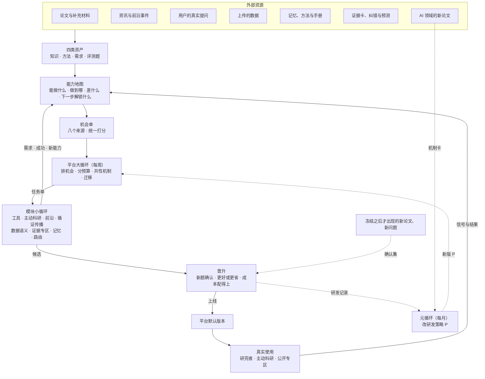

# 2026-10-06 · 「循证进化 2.0」方案（定版）

让平台在使用中自己变强：模块小循环改各自的东西，平台大循环把它们连起来，元循环改「怎么改」；论文、资讯、真实提问、上传的数据和记忆不断进来，既是燃料，也是新题；每一个想留下来的改变，都要在没见过的新题上证明自己。

> **状态**：定版；未改代码、数据和生产配置。
> **取代**：2026-10-06 的两份英文草案《EviMed Evolve 2 Regularized Evolution Design》和《EviMed Evolve Capability Growth and Recursive Learning Design》。两份草案留作调研底稿，与本文不一致的地方以本文为准。
> **依据**：发布线 `codex/release-20261004` 的 `f394c3b33`；10-04《循证进化》v1.1 和 10-05《循证飞轮》v2.0；当日联网核实的文献（附录 A）。四份调研笔记在 `2026-10-06-research-evolution-2-assets/research/`：A 代码结论核对，B 文献核对，C 前沿补充调研，D 资源管道与小循环现状。
> **读法**：第 0 节是全部结论，第 1 节是对两份草案的审查，第 17 节是裁决清单，中间各节是展开；附录 C 解释文中的代号。

---

## 0. 一页结论

**它是什么。** 「循证进化 2.0」把 10-04 的循证进化从「平台自己研发工具」扩成整个平台的递归自我改进。模型权重不动，进化的是模型外面的一切：工具、技能、手册、检索与召回、编辑与排序策略、数据转换、运行时与路由、引擎代码，以及进化引擎自己的研发策略。

**结构：一图、两单、三环、三条正则化规则。**

- **一张图**：能力地图。平台能做什么、做到哪、还差什么、补上一样东西能解锁什么。
- **两张单**：机会单写「值得做什么」，任务单写「交给谁、给多少钱、怎样算做成」。
- **三个环**：模块小循环，各模块改自己的对象、用自己领域的尺子；平台大循环，每周排机会、分预算、推共性机制和跨模块迁移；元循环，每月改一次「怎么研发」。
- **三条正则化规则**，来自 RRSI：改动要小步（一个候选只动一个部件，改的机制数从 3 个收到 1 个）；晋升必须在没见过的新题上证明自己（要么高出噪声带且成本配得上，要么成绩不降而更省、更简单；工具要隐藏算例全过）；没有贡献的机制按期剪掉。

**怎样前进，而不只是纠错。** 机会有八个来源：需求缺口、新方法、新数据、成功外推、组合、证据矛盾与更新、自研究、修错。即使没有任何运行出错，一篇新论文、一份新数据、一次成功的组合，也会在能力地图上点亮新的格子，触发下一轮研发。

**外部资源怎样反哺。** 每份外部资源转成四类资产：知识、方法、需求、评测题，各记用途、各记暴露。最关键的一条：前沿每天进来的新论文是取之不尽的新题。候选冻结之后才公开的论文，研发和模型都不可能见过，用来做晋升确认，正好解决 RRSI 担心的「反复用同一批题」。

**怎样让平台自己迭代自己。**

1. 研发策略 P（去哪找资源、先做什么、试几条路、什么时候停）有版本。元循环每月改一处，先回放、再交错试行一个月，不如原来就自动回退。P 的好坏只看它研发出来的能力后来在新题上带来了多少提升。
2. 自研究：平台每周读 AI 领域的新论文，把新机制写成机制卡，进机会单。你这两轮让 AI 做的「看 RSI 最新算法和顶会论文」，以后平台自己做。
3. 下一轮「从哪个版本改起」，看它的后代被晋升的比例，不看它自己的分数（Huxley–Gödel Machine 的结论）。

**审查结论。** 两份草案方向对，对 RRSI 的读法也对，核心机制保留：提案和选择分开，开发、确认、审计、前瞻四种题库分开，来源不重复计数，按改动类型分别验证。主要改了六处（第 1 节列了全部 12 项）：两份英文文档没有定案；统计设计和每天 50 元、并发 1 的规模不相称；没用上平台独有的新题来源；把已经建成的飞轮当成提案；缺少看得见的自我迭代；代码结论有几条已经过时（第 1 节、第 3 节）。

**本方案已定的事项**见第 17 节，共 17 条。

**你需要做的。** 说「开始」。

## 1. 审查结论：两份草案怎么处理

| # | 草案的写法 | 定版 | 理由 |
|---|---|---|---|
| 1 | 两份英文文档，约 1.8 万词；第二份部分取代第一份 | 合成一份中文定版；两份草案留作调研底稿 | 同一个设计不该分两处读，后一份还要回头对照前一份 |
| 2 | 大量「建议的初始值，以后评估」「以后可以加」 | 节奏、预算拆分、晋升阈值、机制数日程、打分权重、P 的内容全部定下来 | 你要的是能开工的方案；以后要改的参数交给元循环，按规则改 |
| 3 | 统计设计：一套复杂的序贯统计（逐次分配错报率、e 过程、逆概率加权等） | 换成 RRSI 自己用的那一套：噪声带、地板、成本规则、新题确认、剪枝 | 每天 50 元、并发 1、每个方法 5 到 10 个算例的规模下，前一套落不了地；RRSI 在八个基准上用后一套拿到了迁移 |
| 4 | 担心题库有限，靠统计手段控制反复使用 | 冻结之后才公开的论文作确认集主来源；一批确认题只用一次 | 平台每天都有新论文进来，这是外部基准没有的条件；LiveBench 用的就是按时间切分 |
| 5 | 把飞轮当成「提案」 | 接上已经建成的部分：证据卡的结论和血缘、来源变更事实、实体词表、预测登记、事故用例、平台手册、账号分享 | 飞轮在 release candidate 20 里已经建成（默认关） |
| 6 | 「平台自己迭代自己」停在概念上 | 给出心跳（实时、每天、每周、每月、每季度）、日报首段「今天平台进步了什么」、自研究、元循环的具体流程 | 你要的是这种「自己在变好」的感觉，它得落到能看见的节奏和产出上 |
| 7 | 下一轮在分数最高的版本上改 | 按谱系的后代晋升比例选；上线看晋升规则 | HGM（ICLR 2026 口头报告）：版本自己的分数对后续进展的预测力明显更差 |
| 8 | 经验库只说「有界、有出处」 | 平台手册改为增量条目，带有用和有害计数，按效用召回、退役；成功和失败都提炼 | ACE、ReasoningBank 和 ACL 2026 的经验跟随研究：整篇重写会丢细节，错误经验会被反复照抄 |
| 9 | 所有小循环挤在一个并发 1 的队列里 | 分重活道（运行时，并发 1）和轻活道（只调模型，并发 2）；每个模块每周保底一张任务单 | 前沿和循证传播的回放不需要运行时，没必要排在建工具后面 |
| 10 | 22 条代码结论 | 在发布线逐条核对：18 条成立（其中 2 条范围比草案说的窄），2 条部分成立，2 条已修好（突然满分复查、伤害检验重开纪元），没有错的；另有一批写成「待做」的东西其实已经存在（PR 终点、到期消费、平台手册、来源变更事实、实体词表） | 草案看的是早 322 个提交的版本；第 3 节逐条列出 |
| 11 | 「循证 GEO」 | 产品名用「循证传播」，代码仍是 `geo`；小循环以正确率为主、可见度为次，和飞轮一致 | 10-05 的定位 |
| 12 | 一些措辞越过了你已经定的规则 | 不做付费方法开关研究；不加人工审批；标签不是门；全线 Flash；虚拟临研只留接口 | 你此前的裁决 |

---

## 2. 前沿依据

### 2.1 RRSI 证明了什么，文章里哪几处要更正

RRSI（arXiv 2609.24972，Google Cloud AI Research 牵头，2026-09-21 首发，10-04 第三版，预印本）不限制智能体能改什么，只限制它怎么改。提案一侧：一次改的机制数随轮次收紧，全部历史留档，停滞时转向没试过的部件。选择一侧：针对题目的改动先筛掉，落在噪声带里的涨分不算进步（只有同时更省、或者引入了新类型的结构才可能收），多花的 token 要用足够的提升来换，长期没有贡献的机制列入删除。

最要紧的是它的第 2 表（智能工作区任务，策略模型 Claude Opus 4.8）：

| 版本 | 进化集 | 同分布留出 | 三个分布外基准平均 | 每次试验的策略 token |
|---|---:|---:|---:|---:|
| 初始 | 89.4 | 86.9 | 39.7 | 156 万 |
| 不加正则化 | 92.8 | 88.9 | 40.3 | 380 万 |
| RRSI | 90.5 | 89.2 | 43.6 | 242 万 |

进化集上分数更高的那个，分布外更差，也更贵。它在三类环境、八个基准上把进化得来的改进迁移到了从没参与进化的基准上，例如 JobBench 从 36.0 到 40.7，Frontier-Eng 从 17.7 到 22.0。

你转来的文章大体属实，有四处要更正：

1. **「30 轮、只有 10 次被接受」那条 Gemini 3.5 Flash 曲线不在论文里**，来自项目主页的运行记录。那次运行分两段、每轮一个候选；「筛查阶段拒绝 6 个」是一个 24 题的成绩预筛，不是防泄漏审查；第一段没有记录 token，成本规则没法执行；还有一次被接受的改动，按论文自己公布的规则应当被拒。这条曲线不能当作论文算法的证据。
2. **「更省 token」是相对不加正则化说的**：比不加正则化少 36.3%（摘要写 30%），比初始版本多 55%；而且只算执行任务的 token，提案、审查、评分这些搜索成本都没算进去。
3. **不确定度的证据很窄**：只有第三版有，只比较 RRSI 和初始版本，每个领域只重复了一次；第 2 表本身是单次运行。
4. **论文和代码有出入**：正式发布的那次运行噪声带用的是 0.034，不是表里写的 0.017；噪声带以内的接受权重只写在配置文件里；余弦日程实际最低到 2，到不了 1；剪枝标记只说明「最近几轮没人动过」。

这些不推翻它的核心结论：正则化之后，迁移更好、成本更低。但它决定了我们借什么：借机制，参数按我们的规模自己定（第 4.5 节）。

### 2.2 直接借用的机制

| 机制 | 出处 | 关键事实 | 本方案怎么用 |
|---|---|---|---|
| 提案与选择两侧正则化 | RRSI（2026 预印本） | 见上表 | 三条正则化规则（第 4.5 节） |
| 按后代选父版本 | Huxley–Gödel Machine（ICLR 2026 口头报告） | 用整棵后代树的成功率估计一个版本的潜力，与真实潜力相关 0.63–0.78；用版本自己的分数只有 0.29–0.44 | 「从谁改起」看谱系（第 4.5 节） |
| 版本档案 | Darwin Gödel Machine（ICLR 2026） | 保留全部变体；记录到智能体删掉检查器依赖的日志来骗分 | 档案与谱系；评分器读的埋点也要隔离（第 4.6、6.5 节） |
| 评分器分期冻结 | Red Queen Gödel Machine（2026 预印本） | 一期内评分器不动；挑战者在锚点题上胜出才接班，接班后重打旧分 | 评测维护线（第 4.6 节） |
| 便宜的成对比较先排序 | SIFT（2026 预印本） | 成对比较对大多数候选排得准，对最好的几个排不准 | 只用来筛，不用来晋升（第 10.3 节） |
| 一次进化一个部件 | ModularRSI（2026 预印本，DeepSeek-V4-Flash） | 五个部件各自进化再合起来，Terminal-Bench 2.0 从 47.6 到 52.4；一起改反而降到 44.2；中等难度的进化集更好 | 一次一个机制；选题看可学性（第 4.5、6.4 节） |
| 分层元目标 | MetaRSI（2026 预印本） | 目标 = 密封集增益 − 成本 − 回归 − 工作信号与密封评测的落差；五期增益从 +7.2 递减到 +1.4 | 元循环的元目标；外部资源是燃料（第 5、8 节） |
| 改进器的价值看下游 | STOP（COLM 2024） | 改进器的分数 = 它改出来的东西在留出任务上的平均效用；有改进器关掉了沙箱标志 | P 只按下游结果算（第 8.2 节） |
| 反思式提示进化 | GEPA（ICLR 2026 口头报告） | 读执行轨迹提出修改，保留互补的候选 | 技能和提示类对象的提案器 |
| 连「怎么改」一起进化 | Promptbreeder（ICML 2024）、Hyperagents、MetaSkill-Evolve（2026 预印本） | 改任务提示，也改「产生修改」的提示；快循环改技能，慢循环改诊断、检索、分配和提案 | 研发策略 P 和元循环（第 8 节） |
| 增量更新经验 | ACE（ICLR 2026） | 生成、反思、整理三步，按条目增量更新，避免越改越短、丢细节 | 平台手册的增量条目（第 11.2 节） |
| 成功和失败都学 | ReasoningBank（ICLR 2026） | 成功提炼成策略，失败提炼成防范；比只存成功或原始轨迹好 | 第 6.6、11.2 节 |
| 经验会被照抄 | 经验跟随研究（ACL 2026） | 检索到相似记录就照着做，错误会传下去；按结果增删可提高约 10 个百分点 | 每条经验带效用分，低了就退（第 11.3 节） |
| 记忆系统分四部分进化 | MemEvolve（ICML 2026） | 写入、存储、检索、管理分开，外层慢慢改设计 | 记忆小循环的可改面（第 9.7 节） |
| 按运行记录改技能 | SkillRevise（EMNLP 2026 Findings） | 只改出问题的段落，成功率 36% → 62% | 文字类对象的默认改法（第 4.5 节） |
| 学习进展 | MAGELLAN（ICML 2025） | 优先做通过率正在变化的目标 | 打分里的「进展」项（第 6.2 节） |
| 自出题的筛法 | Self-Challenging（NeurIPS 2025）、R-Zero（ICLR 2026） | 题必须带判题函数、正确解、错误解；自产标签三轮后准确率 79% → 63% | 任务工厂（第 6.4 节） |
| 主动发现能力缺口 | ACD（ICLR 2025 研讨会）、OMNI-EPIC（ICLR 2025） | 让一个模型出新题去试另一个模型，只留新颖的题 | 主动探测（第 6.4 节） |
| 新颖性拒绝 | ShinkaEvolve（ICLR 2026） | 评测前丢掉和已评候选几乎一样的代码；150 次采样达到新的最好结果 | 去重（第 4.5 节） |
| 已发表方法重组 | ERA（Google，2025 预印本） | 55 次重组里 24 次超过两个父方法 | 重组作为研发形态（第 9.1 节） |
| 共享的世界模型 | Kosmos（2025 预印本） | 结构化世界模型是并行智能体之间唯一的通道；综合性结论只有 57.9% 正确 | 能力地图；综合类结论多一道检查（第 4.3 节） |
| 论文变工具 | Paper2Agent（Nature 2026）、ToolMaker（ACL 2025）、Biomni（Science 2026） | 用论文自己的输出生成测试，100 篇里 74 篇成功；先装仓库再封装；每个挖到的资源单独验证 | 工具小循环（第 9.1 节） |
| 从更正里学 | Learning on the Job（2026 预印本）、ReSpect（ACL 2025） | 从更正学到的规则到了基线的 2.6 倍，从对错判定学到的是 1.6 倍；隐含反馈把完成率从 31% 提到 82% | 更正是一等信号（第 5.4 节） |
| 按使用聚合需求 | Clio（Anthropic，2024） | 聚类必须同时超过不同账号数和对话数的门槛才保留 | 跨用户汇总至少 5 个账号（第 5.4 节） |
| 按时间切分的新题 | LiveBench、LiveCodeBench（ICLR 2025） | 只用模型发布之后才出现的题，暴露了题目污染 | 冻结之后才公开的论文作确认集（第 5.3 节） |
| 不可能题 | ImpossibleBench（ICLR 2026） | 给出弃答出口后，GPT-5 钻空子的比例 54% → 9% | 确认集里放不可能题（第 10.3 节） |
| 等价变形 | CHASE（2026 预印本） | 涨幅要在保持语义的变形下还在 | 确认题做等价变形（第 10.3 节） |

### 2.3 已知会出错的地方

| 会出什么错 | 证据 | 对策 |
|---|---|---|
| 刷熟悉的题 | RRSI 第 2 表；Cancer-Myth（ICLR 2026）：用 GEPA 针对这套医学题优化提示，正确率到 80%，但在没有错误前提的问题上 41% 误报，在其他医学基准上相对下降 10% | 新题确认；留出审计；过拟合落差 |
| 只靠自己打转，收益递减 | MetaRSI：五期增益 +7.2 → +1.4 | 外部资源持续进来（第 5 节） |
| 版本分数预测不了后续 | HGM | 按谱系选父版本 |
| 钻评分的空子 | DGM 删日志骗分；AlphaEvolve 在 67 个数学问题上反复遇到候选钻数值积分的空子；ImpossibleBench | 评测器和埋点隔离；晋升用精确检查；不可能题 |
| 凭空修错 | Phantom Guardrails（2026 预印本）：60 次里 15 次修一个从没发生过的问题，进来就不走 | 修错要对得上能复现的失败；定期删减 |
| 改坏完整性还沿谱系传下去 | 改动审计（2026 预印本） | 碰到出处、引用的晋升沿谱系审计 |
| 经验越改越短，错误经验被照抄 | ACE；经验跟随研究 | 增量条目；效用分 |
| 自产标签退化 | R-Zero | 答案不由出题方和解题方的一致认定 |
| 讨好用户 | OpenAI 2025 年 4 月的 GPT-4o 更新，三天后开始回滚 | 用户赞同不当优化目标 |
| 一起改多个部件更差 | ModularRSI | 一次一个部件 |
| 简单做法也能达到同样效果 | 《Rethinking the Evaluation of Harness Evolution》第四版：Terminal-Bench 2.1 上，进化没赢过同等预算下的简单测试时扩展；长程游戏上赢了 | 晋升时和更简单的修法比；「变省」「删减」是正式的晋升条件 |

### 2.4 对两份草案引用的处理

两份草案引用的文献都在，说法基本成立。需要更正的地方已在本文和附录 A 里直接改正：TextGrad 已发表于 Nature；Dwork 等人在 2015 年有两篇不同的「留出集复用」论文；《Rethinking the Evaluation of Harness Evolution》已出第四版，补了一个正面结果；2610.03548 的迁移只在同一领域、同一个求解器上做过；一批论文的发表情况现在可以确认。Dream-RSI 的代码仍未发布，只作设计参考。

### 2.5 今年这个方向在发生什么

- **顶会**：ICLR 2026 办了以递归自我改进为题的研讨会（AI with Recursive Self-Improvement，4 月 26 日）；HGM、GEPA 是 ICLR 2026 口头报告。NeurIPS 2026 的录用论文里，智能体框架自我改进成了一个小方向：从执行轨迹自动改框架（AutoSaddler，GAIA2 上 +9.0、TB2.0 上 +10.0）；不跑任务、只看排序能力来评改进器；评分器门控造成的通过率虚高和校正；短描述能复现的改进才泛化。NeurIPS 2026 没有以「递归自我改进」为题的研讨会；相关的有「元智能体」「自进化的多样性搜索」「谁来验证智能体」「AI 科学家时代的验证」，后两个都以验证为题。
- **综述**：TMLR 2026 的《A Survey of Self-Evolving Agents》按「改什么、何时改、怎么改、在哪改」分类；2026 年一篇覆盖 1,250 篇论文的综述把验证方式排成层级（精确验证在上，模型自评在下），并指出「能拿来做决策的自我改进度量」是全领域最缺的一块。
- **自主研究还不行**：把未公开论文的核心问题交给前沿智能体，工程做完了，研究判断不过关（第 6 节开头）。
- **记忆和技能会反噬**：一次刻意构造的交互就能在记忆里种下影响后续回答的记录；技能库越大，检索带来的收益越往回退。

这几条和本方案的取向一致：把力气花在验证和新题上，前进先落在工程能力上，经验库要会删。

---

## 3. 现状：已经有什么，还差什么

以发布线 `codex/release-20261004` 的 `f394c3b33`（release candidate 20）为准。两份草案看的是更早的 `c1f02c3cc`，中间隔了 322 个提交，其中 46 个改了进化模块。

### 3.1 已经有的

| 部分 | 现状 |
|---|---|
| 循证进化本体 | 已合入并随 release 5 上线，默认关（`OPEN_SCIENCE_EVOLUTION_ENABLED`）。文献线索、隔离研发、隐藏参考算例评测、突然满分复查、平台技能供给和隔离工具上线、按修订版本的伤害检验、V0–V4、裁决卡都在。每天 50 元、单次 10 元、并发 1 |
| 裁决卡 | 每天最多 3 张；24 小时从送达起算；到期由模块自己的作业消费：B 类重新检索后由另一家族的模型复核，C 类取保守项，D 类转替代路线；迟到的回复取代默认；按推翻率自适应 |
| 与前沿的连接 | 前沿每发布一篇论文，进化做三件事：记时间留出的观测、匹配前瞻题、按需生成论文线索（每天最多 8 篇） |
| 与主动科研、知识库的连接 | 规划器因缺工具或缺数据停下会生成线索并挂起议程；工具上线或数据就绪会唤醒议程 |
| 模块线索（飞轮 F20） | 证据计划、循证传播、虚拟临研三类线索，带实体键，默认关，每天 5 条 |
| 学习回路 | 研究者的方法（L1）即时生效，按伤害检验退役；账号手册（L2）只在本账号生效；平台手册（飞轮 F16）已实现：通过代码字段检查、Flash 判断「通用方法知识」、作者规则和另一家族模型复核后，作为纯文字技能进平台供给，默认关；账号之间的方法分享（F17）已实现 |
| 飞轮 | 证据卡（结论、出品方、原创性、血缘、实体键、患者旅程阶段）、变更记录、来源变更事实、实体词表、预测登记与校准（发表值抽取器未接）、平台自有用药题库（60 题）、公开选题申请、公开页、出版方账号、事故用例导出，都在 release candidate 20 里，尚未发布，各自的开关默认关。引用平台卡片当证据时已有提示（`platform_card_cited`） |
| 模块里已有的半个小循环 | 循证传播：基线轮和每周轮次、噪声重复、对照组、差中差净效应、判官严重度分级。前沿：逐条数字核对和修复、编辑输入留哈希、撤稿与更正关联。主动科研：每周期一次 Flash 决定、按任务类型连续失败暂停。数据语义：事实分三级依据，弱的不覆盖强的 |

一句话：**研发、评测、上线、退役、裁决这条 L3 链路已经是通的；缺的是「前进」和「联动」，以及几处让评测失真的地方。**

### 3.2 核实后要修的地方

| 问题 | 位置 | 后果 | 定版的处理 |
|---|---|---|---|
| 修复时反复问隐藏题 | `evolutionBuild.mjs:46` 把失败算例的稳定代号返回研发，`evolutionComposition.mjs:330–332` 最多修 3 轮 | 不泄露答案，但会逐渐对着这批题优化 | 记每道题的反馈次数；修过以后在新题上确认（第 10.1 节） |
| 观察窗口用完算「clear」 | `methodGraph.mjs:419` | 「没检出伤害」被读成「验证过」 | 加原因字段，写「观察期内未见伤害」（第 10.4 节） |
| V4 只是「V3 加没检出伤害」 | `evolution.mjs:58`、`evolutionMaintenance.mjs:270` | 运行可靠被说成科学有效 | V4 要求可归因的正面结果（第 10.4 节） |
| 跨版本没有错报控制 | `evolutionMaintenance.mjs:23–25` 每个修订版本单独检验 | 修了又修的工具，错报会累积 | 同一谱系 90 天内两次报警，给整条谱系开一张复核卡并挂标签，不自动停用 |
| 线索不计复现、不再唤醒 | `evolutionService.mjs:73–79`；`evolutionLeadSources.mjs:20–21` 明说同码同键只算一条 | 需求越来越强，排序却不变 | 线索按不同账号和次数累计；新证据到达重新唤醒 |
| 一个等待中的线索作业停掉每日文献扫描 | `evolutionWorker.mjs:121–122` | 一个资源缺口让每天的文献扫描整个停下（线索和前沿论文的扫描照常） | 等待按依赖和模块记，不按阶段 |
| 激活证书只钉字节 | `platformSkillSupply.mjs:144`；评测回执哈希已有但没挂上（`evolutionCandidateEvaluator.mjs:213`） | 事后说不清这个版本凭什么上线 | 证书挂评测回执和复查回执，不新增签名服务 |
| 工程 PR 没带验证 | `evolutionBuild.mjs:21–25` 在静态检查和隐藏评测之前返回 | 审查的人看不到证据 | 先跑能跑的验证，结果附在 PR 里 |
| 运行来源两套判定 | `evolutionScientificUse.mjs:5–6` 与 `usagePurpose.mjs:184–188` | 循证传播和虚拟临研里的真实使用被当成评测排除 | 统一用领域层的判定，加内部项目检查 |
| 花费只按用途汇总 | `evolutionComposition.mjs:342`；用量表没有任务单字段 | 算不清一次研发的全部成本 | 用量记任务单号和模块 |
| 关模块就停服务 | `platformSkillSupply.mjs:182`、`:200`、`:217` | 想暂停研发只能连服务一起停 | 新增「暂停研发」状态（第 12 节） |
| 前沿没有曝光记录 | `frontierRoutes.mjs:37`；`user_state` 只存最后状态（`frontierPersistence.mjs:407–413`） | 点击被位置和曝光左右，不能拿来评排序 | 记展示了什么、在什么位置、哪版策略 |
| 循证传播没有干预身份 | 轮次只存问题集版本和助手名（`geoMeasureStore.mjs:335`） | 引擎更新、投放、改稿会被算成策略的功劳 | 轮次记内容、策略、卡片、问题集、助手版本和投放 |
| 没有「做不了」的记录 | 路由分类器不留任何记录；「无匹配」只在单次调用的追踪里 | 真实需求进不了研发排序 | 新增「未满足需求」记录（第 5.4 节） |
| 新论文没有「最早公开日期」 | 前沿交给进化的论文只有发表日期（`evolutionIntegration.mjs:361–363`），时间留出的观测只能记「等待出处」 | 预印本、会议摘要、注册结果可能早于期刊发表，时间切分的新题无法确认真的「没见过」 | 补出处解析：用前沿已有的条目关系（预印本、新版本）和注册库日期取最早公开日期 |
| 隐藏题只有一个冻结文件 | 评测器每个方法读一个冻结文件，保留算例是唯一的留出部分（`evolutionCandidateEvaluator.mjs:228`） | 没法按次组装新的确认集 | 题库分组和「用过」记录写进评测记录（第 10.1 节） |
| 前瞻题评不了分 | 预测登记没有接发表值抽取器，对上论文的登记停在 `extractor_unavailable`（`predictionRegistry.mjs:304`） | 最干净的新题来源用不上 | 补抽取器：模型抽数值，代码核对出处（第 5.3 节） |
| 评分器审计三次都没审到一个样本 | 验收记录 `2026-10-04-evolution.json`：0/3，原始一次、release 5、release 6 各一次 | 评测本身的可靠性没有证据 | 发布线已有两处修复（`ef415eda2`、`365fdf162`），定版要求在发布版上重跑一次 |

### 3.3 两份草案里已经过时的结论

- **突然满分复查重跑同一批题**：发布线已改为只跑留出材料（保留算例和按复查自己的种子生成的行为检查，`candidateSuddenPerfectReview.mjs:35–42`、`:84`）。剩下的问题是覆盖：每个算例只有 3 个新生成的检查。
- **伤害检验「重开纪元」**：已改为每个修订版本一次检验、最多 40 次、每个账号只算一次；报警改为开复核卡，不再直接退役（`evolutionMaintenance.mjs:13–25`、`:111`、`:268`）。
- **「把 PR 准备做成正式终点」**：已经是了（`evolutionEngineReview.mjs`、`scripts/dev/open-evolution-pr.mjs`）；缺的是 PR 带验证。
- **到期默认、迟到推翻、「沉默不等于同意」**：已经实现（`evolutionDecisions.mjs:79–193`）。
- **手册只在本账号**、**平台共享是将来的事**：平台手册（F16）和账号分享（F17）已实现，默认关。定版在它们上面扩展，不另建一条路。
- **前沿到进化只有论文**：属实。事件、日报、热榜、读者状态都没进进化；主动科研的规划器倒是在读前沿条目（`autopilotService.mjs:2039–2046`）。

---

## 4. 总体设计

### 4.1 改什么：九类可进化对象

模型权重不动：DeepSeek Flash 走 API，没有训练入口。能进化的是模型外面的一切，分九类。每一类有自己的验证方式和上线路径：

| 对象 | 例子 | 上线路径 | 用什么验证 |
|---|---|---|---|
| 工具 | 隔离工具、技能里的脚本 | 扩展中心的不可变代际，或平台技能修订 | 隐藏参考算例、交叉实现、已知真值模拟 |
| 技能与能力说明 | 能力的 SKILL.md 段落、任务指令 | 平台技能修订 | 确认集上的绝对评分 |
| 平台手册 | 某个能力的通用经验条目 | 平台技能供给 | 固定记忆快照下后续任务的结果 |
| 检索与召回策略 | 检索式模板、重排权重、召回条数 | 模块策略修订 | 标注集上的召回与精度 |
| 编辑与排序策略 | 前沿的筛选与编辑提示、事件聚类阈值、排序权重；循证传播的三层写法 | 模块策略修订 | 对照原文的忠实度、筛选召回、正确率 |
| 数据转换 | 字段映射、单位换算、格式转换 | 数据语义的转换修订 | 数据字典、已知值 |
| 运行时与路由 | 工具描述、路由分类提示、上下文压缩 | PR → CI → 运行时镜像 | 真实 DSH 多轮会话，原生对照 |
| 引擎代码 | Meta、孟德尔随机化等专科引擎的方法（虚拟临研引擎在它的负责人宣布就绪前不碰） | PR → 发布列车 | 引擎自己的测试加参考算例 |
| 研发策略 | 进化手册、机会打分权重、预算拆分、机制数日程 | 进化模块的策略修订 | 元循环：回放、交错试行、自动回退 |

**不能自己改的**（全文以这里为准）：鉴权与租户、预算上限、临床安全规则、交付闸门规则、评测器与晋升规则、元循环自己的采纳规则。评测器只在「评测维护」这条线上换版本，并且不在进行中的研发周期里换。进化引擎生成的 PR 碰到这些路径，生成时就被拒绝。

**先做一件事：把可改面外置。** 前沿、循证传播、主动科研今天能改的部分大多写在代码常量或技能文件里。每个模块先把自己的可改面外置成一份有版本的策略文档：产品账本里的一条文档修订，读不到时回落到代码默认值。小循环改的是这份文档，不是代码。这是数据，不是运行时加载的代码，符合控制面不加载代码的规矩。

### 4.2 三个环

| 环 | 管什么 | 节奏 | 用什么尺子 |
|---|---|---|---|
| 模块小循环 | 本模块的对象：前沿的编辑策略、循证传播的写法、工具的实现…… | 事件驱动，小时到天 | 本模块的领域尺子 |
| 平台大循环 | 能力地图、机会单、任务单和预算、共性机制、跨模块迁移 | 每周排一次 | 各模块尺子的结果，加跨模块审计 |
| 元循环 | 研发策略 P：去哪找资源、先做什么、试几条路、什么时候停 | 每月一次 | 每元钱换来的经确认能力增益（第 8.2 节） |

每次运行内部的修复，以及研究者自己的方法（L1）和手册（L2），照旧即时生效，不经过这三个环。三个环管的是「平台默认用哪个版本」，不管任何一次交付。

打个比方：各研究室改进本室的方法，是小循环；院里定方向、分经费、建公共平台、推动室间合作，是大循环；院办改进「院里怎么定方向、怎么分经费」，是元循环。

### 4.3 一张图：能力地图

能力地图回答四个问题：平台现在能做什么；做到什么程度；还差什么；补上一样东西能解锁什么。三个环都读写这张图，它是大小循环之间的共享状态。Kosmos 的做法相同：一个结构化的「世界模型」是并行的数据分析和文献智能体之间唯一的通道，每一轮的新任务都从它里面查出来。

- **格子**：任务族 × 能力版本。任务族按研究操作来分：问题类型、估计量、输入结构、证据类型、交付物。「两组表达差异分析」不等于配对设计、纵向数据或多队列验证，后三者各是一个任务族。
- **每个格子记五件事**：状态（支持、部分支持、不支持、未测）；证据（工具的 V 级，或模块尺子的最近成绩）；依赖（缺什么数据、工具或参照）；需求（信号计数，第 5.4 节）；相邻机会（补上哪一个依赖，就能把它从「不支持」变成「支持」）。
- **从现有记录派生，不建新库**：能力清单、方法记录、`evals/tool-graph/` 的工具依赖图、已上线的进化工具、数据语义里的数据形态、信号账本。可以随时整张重建，和召回索引一样。
- **两个方向的提问**：
  - 来了新资源（新论文、新数据、新工具）：哪些格子因此变得可做？
  - 上了新能力：哪些数据现在能分析？哪些等待中的议程可以续跑？哪些相邻能力变便宜了？

第二个方向就是「前进」的来源：即使没有任何运行出错，一份新数据、一个新方法、一次成功的组合，也会在图上点亮新的格子，触发下一轮研发。

### 4.4 两张单：机会单和任务单

**机会单**说「值得做什么」：

| 字段 | 内容 |
|---|---|
| 来源 | 八个来源中的一个或几个（第 6.1 节） |
| 能力增量 | 哪个格子从什么状态变到什么状态 |
| 受益方 | 哪些模块、议程，多少个不同账号的需求 |
| 证据根 | 支撑这个机会的原始来源 |
| 前置条件 | 缺什么数据、工具、参照 |
| 最便宜的下一步 | 用最少的钱，先确认什么 |
| 打分分项 | 第 6.2 节的各项，逐项可查 |
| 可能失败的原因 | 立项时写下，事后对照 |

**任务单**说「交给谁、给多少、怎样算做成」：

| 字段 | 内容 |
|---|---|
| 目标模块 | 一个或几个；跨模块任务单是一张依赖图 |
| 要的产物 | 工具、技能段落、策略修订、数据转换…… |
| 预算 | 从进化预算里预留，所有子调用记到这张单上 |
| 基线 | 当前默认版本和它在确认集上的成绩 |
| 成功条件 | 用哪把尺子、过什么线 |
| 唤醒条件 | 等什么数据、什么工具；等到了自动续跑 |
| 研发策略版本 | 用的是哪一版 P |
| 结果 | 候选、评测、裁定、上线、真实使用，逐项回填 |

大循环发任务单，小循环接单、拆分、做、交回结果。一个模块等数据，不影响别的模块干活。

### 4.5 三条正则化规则

这三条直接取自 RRSI 的设计，参数按我们的规模定。RRSI 不限制「能改什么」，限制的是「怎么改」：提案一侧要小步、可归因；选择一侧要在噪声之外、成本之内；留下来的要一直有贡献。

**几个词先说清**：部件是一个对象里能单独开关的一块，例如前沿编辑的提示、事件聚类、排序，工具的实现、参数表，记忆的写入、检索。机制是一个可以单独归因的改动。一轮是针对同一个对象出一批候选（通常两个）、评完、裁定。一个研发周期是同一张任务单下连续的若干轮，默认 10 轮，预算用完或连续两次停滞就提前结束。

**规则一：小步，可归因。**

- 一个候选只动一个部件，里面改几个机制随研发周期收紧：周期的前三分之一每个候选最多 3 个机制，中间三分之一最多 2 个，最后三分之一只能 1 个。RRSI 用余弦日程从 3 或 4 个往下收，代码向上取整，实际最低到 2；我们收到 1，因为重活道同一时间只跑一个候选，归因比速度要紧。
- 「机制」按能单独开关的单位数，不按改了几行。改工具的参数表和对应的调用适配是 1 个机制；同时改排序、重写提示、再加一个复核步骤是 3 个。
- 改文字类对象（技能、提示、手册），默认按运行记录定位问题、只改出问题的那一段，不整篇重写（SkillRevise 用这种做法把成功率从 36% 提到 62%）。一次只动一个部件：ModularRSI 在 DeepSeek-V4-Flash 上的实验里，五个部件各自进化再合起来，Terminal-Bench 2.0 从 47.6 提到 52.4；所有部件一起改，反而降到 44.2，低于基线。
- 提案必须写明：改什么；为什么（引用哪些失败样例或证据）；预计哪些题变好；可能伤到哪些题；成本怎么变；回退到哪个版本。「改什么、为什么」要能用 200 字以内说清：NeurIPS 2026 的一项研究发现，能用很短的描述让另一个智能体复现出来的改进才泛化，刻意诱导出来的过拟合用短描述复现不出来。
- 提案器看到的历史：同一对象、同一机制族最近 40 条研发记录（结果、涨跌、成本），其中没测过的最多 4 条；一张预测命中表（以往「预计变好的题」有多少真变好了）；一份失败与成功的归纳；挑出来的最差和最好的几条运行记录。全部历史都存，只取相关的一段给提案器。
- 停滞转向：连续 3 轮没有超过噪声带的提升，下一轮的两个候选位里留一个给这个对象上从没试过的部件。

**规则二：新题过关，成本配得上。**

- **筛查**（便宜的先做）：代码先查候选里有没有开发题和确认题的标识、期望值、评测器路径、评分规则引用，有就直接拒；再由一次模型审查判六类问题：特化到题目、空改动或关掉安全机制、钻评分规则的空子、夹带没声明的改动、跨任务泄漏记忆、无界的工作量。审查的试金石一句话：「换一个没见过的同类任务，这个改动还说得通、还有帮助吗？」被拒的候选带着审查意见回到提案器，最多改 5 轮。
- **去重**：和已经评过的候选几乎一样的，不再花钱评（ShinkaEvolve 的新颖性拒绝；我们的瓶颈是评测次数，不是提案）。
- **修错必须对得上真实的失败**：修错类候选必须附一个能复现的失败样例，复现不了的不评。2026 年的一项研究（Phantom Guardrails）只给提案器看合规的记录，只要输入里带着像规则一样的模式，60 次里有 15 次它会凭空「修」一个从没发生过的问题、加一道防护；在只加不减的流程里，这种防护一旦进来就一直留着。所以规则三的剪枝对修错类机制同样适用。
- **冒烟**：在 2 到 4 道当前版本一定能做对的题上跑一遍，跑不通不进评测。
- **确认集上评**：候选冻结以后才组装确认集（第 10 节）。
- **噪声带 δ**：当前版本在同一批确认题上跑 3 次，δ 取两次运行之间差值标准差的 2 倍，不低于满分的 2%。循证传播沿用它自己已有的噪声带（10 道题各问 5 次，取 2 倍标准差）。
- **晋升条件**，三选一：
  1. **变好**：比当前版本高出 δ 以上，且单任务成本的增幅不超过「10% + 每提高 1 个百分点再加 10%」。例如提高 3 个百分点，成本最多可以多 40%。用户按实际调用付费，成本涨了就是用户的账单涨了，所以这条比 RRSI 严（RRSI 每提高 1 个百分点允许多 24%–45% 的 token）。
  2. **变省**：成绩在噪声带以内，单任务成本或注入的上下文至少少 10%。
  3. **删减**：删掉一个机制后成绩在噪声带以内、成本不增加。
- **地板**：任何晋升都不能低于这个对象历史上最好成绩减 δ。没有这条，多次「噪声带以内」的晋升会一点点往下滑。
- **裁定结果九种**：变好（工具类：隐藏算例全过、有独立实现时结果一致）、变省、删减，这三种上线；限定范围，只在通过的那个范围上线；证据不足、退步、证据无效（泄漏或凭证缺失）、做不到（研发声明无法忠实实现）、等资源，这五种不上线。
- 工具类对象用绝对参照：隐藏参考算例全部在容差内，有独立实现时两者一致。不用噪声带。
- **证据分四档**：精确计算、已发表的参考值、写好的检查表、模型评分。前两档可以单独决定晋升。只靠模型评分的晋升，必须同时满足三条：评分器在锚点题上校准过；能核对的部分（引文、数字、标识）由代码复核；晋升记录标明「模型评分」。这四档参照了 2026 年一篇覆盖 1,250 篇论文的 RSI 综述里的验证层级（精确验证在上、模型自评在下），每一档能做什么是本方案定的。

**规则三：留下来的要一直有贡献。**

- 每个机制记贡献：最近几次相关晋升里，它带来了多少提升。
- 一个机制最近 4 轮（平台级按 30 天）都没带来正的提升，列入剪枝候选。
- 删除本身就是一个候选，照样过筛查、冒烟和晋升条件 3。RRSI 也是这样做：它的剪枝标记只说明「最近几轮没人动过」，不说明没用，所以删除要自己证明。
- 学到的方法和平台手册条目不做逐条的删减评测（不重开付费方法开关研究）：它们按有用、有害计数和是否被用来退役；平台手册整体换版本时，按整体评。
- 唯一覆盖受保护：唯一能通过某类参考算例的工具、唯一覆盖某类题的手册条目，不因少用而删。
- 技能库要能合并、能删：COLM 2026 的一项研究里，智能体从 3.4 万个真实技能里检索时，收益一路退回到不用技能的水平。所以技能多了不等于能力强，合并和删减和新增一样是正式的研发动作（SkillFoundry 的做法）。
- 上下文有上限：平台手册沿用现有的注入上限（每个能力每次运行最多 6 条、8 KB），满了以后新条目只能替换效用最低的旧条目。技能正文变长由成本规则管：注入的上下文算在单任务成本里。

**另外两条选择规则**（来自 Huxley–Gödel Machine）：

- **从谁改起**：下一轮在哪个版本上改，按它的后代被晋升的比例来选，不按它自己的分数。这个比例对后续进展的预测力明显高于版本自己的分数（HGM 实测相关 0.63–0.78，对比自身分数的 0.29–0.44）。
- **上线哪个**：只看晋升规则。「最有潜力的父版本」和「该上线的版本」是两件事。

### 4.6 评测上的三条不变量

- **评测器在研发者够不到的地方**：确认题、隐藏算例、评分规则和金标准数字不进研发的工作区（10-04 方案）。评分器读的埋点也一样：DGM 的检查器是对智能体藏起来的，智能体还是删掉了检查器依赖的日志标记，拿到满分。
- **评测器分期冻结**：一期之内不换尺子。新尺子只有在一组带确定答案的锚点题上比旧尺子判得更准，才在下一期接班；接班后用新尺子把旧尺子打过的分重打一遍（Red Queen Gödel Machine 的做法）。不这样做，评分器就成了各个循环一起去讨好的固定靶子。
- **用户的赞同不当优化目标**：点赞、留存、「有帮助」只作为附注放在尺子旁边。医学里讨人喜欢的回答和正确的回答常常不是一个；2025 年 4 月 GPT-4o 的一次更新加入了点赞信号，变得一味附和，三天后开始回滚。

证据、租户、权限、标签、原生对照这些边界照旧，集中写在第 12 节。

## 5. 外部资源怎么反哺

MetaRSI 的实验里，只靠自己的反馈打转，提升一期比一期小：五期的增益从 +7.2 降到 +1.4，作者把这一点写成「每一份增益都是从外面输入的」。所以外部资源不是锦上添花，是循环的燃料。

### 5.1 四类资产

每一份外部资源进来，先转成下面四类资产中的一类或几类，各记用途、各记暴露：

| 资产 | 是什么 | 能用来做什么 | 不能用来做什么 |
|---|---|---|---|
| 知识 | 来源支持的事实 | 更新证据卡、回答、综合 | 不能当成平台自己的发现 |
| 方法 | 能检验、能复用的做法 | 变成工具、技能、手册条目 | 不能当成已证实的科学结论 |
| 需求 | 有人需要什么 | 决定先做什么 | 不能证明提问里的科学前提成立 |
| 评测题 | 用来量候选的题和参考答案 | 晋升确认、留出审计 | 研发看过以后不再算新题 |

一份资源常常同时是几类资产。一篇新论文的方法章节是方法资产，结论是知识资产，报告的数值在研发没见过之前是评测题，它提出的未解问题是需求或研究机会。四种用途分开记：读过结论的论文，不能再当没见过的确认题。

### 5.2 逐项：抽出什么、进哪个环

| 资源 | 抽出什么 | 进哪个环 | 已有的管道 | 要新接的线 |
|---|---|---|---|---|
| 已发表论文（医学） | 方法五元组（方法、软件、数据、代码、报告数值）；研究问题；局限 | 工具小循环、机会单、确认集 | 前沿发布流进循证进化：时间留出、前瞻匹配、论文线索 | 方法五元组抽取；最早公开日期；冻结后公开的论文自动进确认集 |
| AI 与计算机论文 | 机制卡 | 元循环、机会单的「平台机制」类 | 无 | 自研究（第 8.3 节） |
| 资讯与前沿事件 | 新数据、新代码、撤稿与更正、证据矛盾 | 主动科研、证据专区、机会单 | 前沿事件；来源变更事实；主动科研规划器读前沿条目 | 矛盾和新数据进机会单 |
| 用户的真实提问 | 闭集需求码：能力、操作族、数据形态、原因 | 机会单的需求分 | 拒算码、规划器停顿、模块线索 | 「未满足需求」记录（第 5.4 节） |
| 上传的数据 | 数据形态码、本人可做的分析、缺的工具 | 本人：可做分析建议和唤醒；平台：需求分 | 数据语义；数据就绪事件（只传元数据）；已发布工具的数据要求匹配；本人数据上的自检 | 没匹配上的形态码进需求；匹配的上传唤醒任务单 |
| 研究产出与成功轨迹 | 为什么成功；用了哪些工具组合；哪一步省了钱 | 记忆与学习、迁移 | 方法蒸馏；N14 结果回连方法修订 | 成功提炼进平台手册（去掉项目事实后）；从工具调用顺序归纳工作流 |
| 记忆、方法与手册 | 失败条件、有效做法、未解问题 | 召回、经验库、机会去重 | 记忆服务；学习回路；手册缺口扫描 | 条目的有用和有害计数；按效用召回 |
| 证据卡、纠错与预测 | 更正、质疑结果、复算差异、预测命中 | 证据专区小循环、主动科研、事故用例 | 飞轮的变更记录、预测登记、复算卡；纠错挂到产出它的方法上（F15，默认关） | 变更记录给证据专区小循环作信号；预测命中进规划器校准 |
| 循证传播的探针 | AI 助手的错误类型、公众常见误解 | 循证传播小循环、官方选题 | 探针、判官、纠错后复测 | 错误类型汇总进机会单 |
| 运行记录 | 成本、延迟、失败、排队 | 路由与运行时小循环、分配器 | 用量账本、运行账本 | 用量归到任务单和模块 |

### 5.3 新题从哪里来：让题库源源不断

RRSI 担心的根子是「同一批题反复用」。EviMed 有外部基准没有的条件：每天都有新东西进来。确认集的来源按优先级：

1. **冻结之后才公开的论文**。前沿每天进来的新论文，最早公开日期（预印本、会议摘要、注册结果、期刊发表中最早的一个）既晚于候选冻结，也晚于所用模型发布，研发和模型都不可能见过。工具、方法、证据综合、前沿编辑都可以从这里出题。LiveBench、LiveCodeBench 用同一个办法对付题目污染：按时间切分，只用模型发布之后才出现的题。今天交给进化的论文只带期刊发表日期，要先补出处解析（第 3.2 节）。
2. **新问题、新快照**。循证传播项目问题集的新版本、公开选题申请里的新问题、外部 AI 助手的新版本快照。
3. **新参数区间的练习**。任务工厂在没用过的参数区间生成的可验证练习（第 6.4 节）。
4. **评测侧保留的隐藏题**。10-04 的保留算例。

**前瞻题另作他用**：飞轮已建的预测登记，平台先作答并存证，结果公开后评分，是唯一不可能泄漏的题。但结果往往几个月后才出来，赶不上单次晋升，所以只进月度指标和元循环。今天登记表还没有接「发表值抽取器」，对上了论文的登记会一直停在等待（`predictionRegistry.mjs:304`）；阶段 2 补上：模型从论文里抽数值，代码核对数值的出处。

**规则**：每个候选冻结以后，从冻结之后才出现的材料里组装它自己的确认集；一批确认题只支撑一次晋升，用过就转进开发集；研发在修复中看到过反馈的题，记一次使用，不再算新题。题攒不够时，候选保持冻结，等几天攒齐再评。

先后顺序：先保证题新、题够多，再管查询次数。一百多场 Kaggle 比赛的元分析发现，反复使用的公开榜单几乎没有过拟合；在新测试集上成绩下降，主要原因是题的分布变了（NeurIPS 2019、ICML 2019）。但题只有几十道的时候，查询次数照样要管：小题库里噪声和反复试探的影响都大。

### 5.4 提问和数据的边界

- **跨用户只走闭集代码，不走原文**。需求码由四个闭集字段组成：能力、操作族、数据形态、原因（不支持、拒算、缺数据、缺工具）。
- **跨用户的汇总，至少 5 个不同账号才计入**，和飞轮选题器同一门槛。
- **「未满足需求」记录**：开放域回答说做不了、能力拒算、规划器因缺能力停下时，各记一条需求码，归在本人名下；只有达到门槛的汇总进机会单。
- **上传的数据**：在本人工作区里给出「这份数据能做哪些分析、还缺什么」；平台层只收数据形态码。匹配的上传唤醒本人的任务单之前，先过数据语义检查，不是列名对上就算。
- **更正是最值钱的信号**：研究者改报告、拒掉一条引用、改写提问、改选能力，都按闭集记下来。冻结权重的智能体研究里，从更正学到的规则让成绩到了基线的 2.6 倍，从对错判定学到的是 1.6 倍（Learning on the Job，2026）。在本人的范围内，学习回路还可以从对话里读出隐含的反馈（改述、放弃、不满），ReSpect 只靠这类信号把任务完成率从 31% 提到 82%。
- **用户的成功做法**先进本人的方法库，即时生效（L1，照旧）。要进平台手册，必须去掉项目事实，并且能从公开方法重新推出来。

### 5.5 先接上已经记下、却没人读的信号

平台今天已经记下了不少能直接喂给小循环的东西，只是没有任何程序在读。接上它们几乎不花钱，是阶段 1 的第一件事：

| 信号 | 记在哪里 | 给哪个小循环 |
|---|---|---|
| 用户改选能力（「改为普通问答」或改选另一个能力） | 运行账本的路由原因 `choice:` | 路由：这是用户亲口说路由错了的唯一记录 |
| 路由分类器的判定和失败码 | 每次调用的追踪 | 路由 |
| 规划器这一步是自己决定的，还是回落到了日期轮换 | 每个周期的 `selection.source`、`fallbackReason` | 主动科研 |
| 资料理解的遗漏审计；数据语义里有争议的事实；模型推断被研究者改写的次数 | `omissionAudit`；`contested`；事实的依据层级 | 知识库与数据语义 |
| 每个能力、工具、技能版本的可用性 | 可用性账本（标签） | 科研工具、运行时 |
| 每次运行的工具调用顺序 | `tool-edges/`、`tool-traces/` | 记忆与学习：从成功的运行里归纳工作流（AWM 的做法），作为候选技能 |
| 记忆推断被接受、被修改、被拒绝 | 反馈事件 | 记忆：校准抽取的阈值（代码注释里写着「将来要回答」） |
| 回复复核的结论有没有被采纳 | 复核服务 | 开放域回答 |
| 选题器每天的选择 | 每天一份 `programme-decision` | 证据专区：用后来的阅读、引用和纠错给选题打分 |

还有四个已经留了接口、但没人写入的输入：预测登记的发表值抽取器、复算卡的「比较」字段、循证传播和虚拟临研的模块线索。前两个阶段 2 补上；循证传播的模块线索在它的小循环上线时接通，虚拟临研的等它的负责人宣布就绪。

今天真正进入改进环的外部资源只有两样：前沿已发布论文的变化流（只在文献线索作业里读，每次 25 条），加上进化自己去 Europe PMC 和 Crossref 查的文献。学习回路不读任何外部资源。上面这张表和第 5.2 节，就是要把这条细线变成一张网。

## 6. 前进的引擎：不只纠错

这里的「前进」主要指工程上的能力：新工具、新流程、新的数据处理和证据处理方法。研究判断不交给自主循环。2026 年 7 月的一项研究把两篇还没公开的 NeurIPS 投稿的核心问题交给前沿智能体，给了六天和几千美元的算力，再请原作者评：工程部分全做完了，两份结果都被直接拒掉。反复出现的问题是判断不了什么够发表、遇到设计缺陷不会变通、不会回头、不懂节省资源、做着做着偏离要求。平台自己的研究结论照旧走证据规则，由研究者和证据专区的核验决定。

### 6.1 八个机会来源，修错只是其中一个

| 来源 | 触发 | 例子 |
|---|---|---|
| 需求缺口 | 同一需求码达到门槛 | 多个账号要做竞争风险生存分析，平台不支持 |
| 新方法 | 方法五元组近两年高频，且有数值算例 | 试验序贯分析、年龄–时期–队列模型 |
| 新数据 | 新的公开数据或上传数据，能解锁新分析 | 新一期公开调查数据发布；有人上传了纵向随访数据 |
| 成功外推 | 一次高质量运行的做法能推广 | 某议程「先核数据字典再写代码」省掉了返工 |
| 组合 | 已有工具组合起来能完成一个新任务族 | 数据语义 + 生存分析 + 证据卡，组合成真实世界证据卡 |
| 矛盾与更新 | 新证据和已有卡片或综述冲突 | 一项新 RCT 和某专区的结论方向相反 |
| 自研究 | AI 领域的新机制能解决平台已记录的问题 | 手册按增量条目更新，解决手册越写越长 |
| 修错 | 同类失败聚成一类 | 分母在改写中丢失 |

### 6.2 机会怎么排

沿用 `evolutionScout.mjs` 现有的加法打分（文献、失败、等待议程、参考代码、数据可达、已发表算例、覆盖缺口、未解依赖），加五项：

| 新增项 | 权重 | 含义 |
|---|---|---|
| 不同账号的需求 | 4 × ln(1 + 账号数) | 闭集需求码达到门槛后的不同账号数 |
| 解锁 | 3 × ln(1 + 能变成「支持」的任务族数) | 来自能力地图的相邻机会 |
| 复用 | 2 × 能受益的其他模块数（最多 3） | 一个能力能被几个模块用上 |
| 进展 | 2 × 最近两期确认成绩的提升（百分点，最多计 5） | 优先做正在变好的方向（MAGELLAN 的学习进展）；一直不动的方向自然降下去 |
| 探索 | 1.5 × √(ln 总研发数 ÷ (1 + 这一类对象的研发数)) | 冷门对象也有机会；热门模块吃不光全部预算 |

再减一项成本：预估花费每 5 元减 1 分。

两个规则不变：打分只给已满足立项条件的机会排序；第一次做的新工具仍守 10-04 的三条硬条件。新增一条：**重要但缺数据的机会，不丢，转成补资源的任务单**（第 6.3 节）。

权重是元循环可以改的东西（第 8 节），改法和别的候选一样，要过回放和试行。

### 6.3 主动补资源

找资料本身是可以排期的研发任务。补资源任务单写明「拿到这份东西会改变哪个决定」：

- 查原文的补充材料和数据字典；
- 在允许的代码仓库里找参考实现；
- 找可下载的公开数据集；
- 读本人已授权的数据字典；
- 跑一个小的参考计算，排除一条走不通的路。

停止规则：决定已经有了足够依据，或者再找下去不太可能改变决定，就停。不按「找够多少篇」停。补不到的写明缺什么、等什么，挂唤醒条件，转去做别的。

### 6.4 任务工厂与课程

研发用的题从三条线来：

| 线 | 用途 | 正确答案从哪来 |
|---|---|---|
| 真实任务 | 针对真实需求发展能力 | 原始需求、可得数据、独立的科学参照 |
| 可验证练习 | 便宜地覆盖计算上的边界情况 | 声明的生成器、可执行的真值、不变量或独立实现 |
| 开放研究任务 | 研究没有答案的问题或新方法 | 研究方案和外部观测；答案未知就记未知 |

- **选题看「可学性」**：当前版本 3 次里对 1 到 2 次的题最有用。次次都对的题转为回归锚点；次次都错的题先查是不是缺资源（转补资源任务单）还是缺能力（转机会单）。ModularRSI 在 DeepSeek-V4-Flash 上的实验里，中等难度的进化集比难易混合的集合高 2.2 分。
- **成功和失败成对看**：同一类题做对一次、做错一次，对照两次的轨迹找原因，比只看失败准。
- **出题的和判题的分开**：任务工厂拿不到确认题。每道生成的练习必须带三样：判题函数、一个正确解、几个错误解；判题函数接受正确解、拒绝全部错误解，才进开发集（Self-Challenging 的筛法）。答案不由出题方和解题方的一致来认定：R-Zero 用自产标签训练，三轮之后标签准确率从 79% 掉到 63%。
- **主动探测**：每周让任务工厂按能力地图的空白，生成一批没见过的研究任务去试平台，只为找出做不了的地方，结果进机会单（ACD 的做法）。探测用的模型评分只用来发现缺口，不用来晋升：它恰恰在难题上偏宽。
- **只出能判的题**：Absolute Zero 这类自出题自解题的方法，靠的是可执行的验证；R-Zero 改用多数投票当标签，标签就越训越不准。EviMed 只在计算类、数据处理类任务上用它；医学上还没观测到的事实，不能靠自己出题自己答来确立。

### 6.5 档案与谱系

- **档案**：被拒但有价值的候选不扔，按「操作族 × 输入类型 × 模块」分格保存，每格留几个不同做法。档案里的版本不上线，但可以做下一个候选的起点。
- **新颖的留档，不上线**：RRSI 在噪声带以内给新结构类型（新工具、新记忆、新子代理）一点加分；我们的处理是把这类候选放进档案作为踏脚石，上线仍然只认第 4.5 节的三个晋升条件。
- **失败要记清楚**：试过不行的方案按版本记下，带唤醒条件（新方法、新数据、新工具、新模型）。前提没变时，换个名字重提不算新假设。
- **谱系**：每个版本记父版本、来源论文或来源任务单、研发运行和评测记录。「从谁改起」按谱系的后代晋升比例选（第 4.5 节）。

### 6.6 从成功里学

失败告诉平台哪里坏了，成功告诉平台下一步往哪走。

- 一次经过核验、成本低的运行，提炼三件事：它为什么成功；适用到哪里为止；什么证据会推翻它。
- 不提炼偶然的格式、私人的研究对象，也不提炼只对某道题成立的答案。
- 提炼结果先进本人的方法库；去掉项目事实、能从公开方法重新推出的，作为平台手册的候选条目，走第 11 节的增量更新。
- 一次成功可以生出几样东西：一个研究结果、一个工具、一份数据契约、一条可复用的做法、几道新的开发题。数量不是指标，它们各自有没有被真正用上才是。

## 7. 大循环与小循环怎么联动

### 7.1 分工

| | 模块小循环 | 平台大循环 |
|---|---|---|
| 管什么 | 本模块的策略、工具、写法 | 能力地图、机会单、预算、共性机制、跨模块迁移 |
| 尺子 | 本模块的领域尺子 | 各模块尺子的结果，加跨模块审计和留出审计 |
| 节奏 | 有就绪的任务单就做 | 每周排一次 |
| 产出 | 候选、评测、本模块的新版本 | 任务单、共享版本、迁移结论 |
| 不做 | 不改别的模块的默认版本 | 不替模块判断领域上的对错 |

### 7.2 三个方向

- **上交**（小到大）：本模块的需求、成功做法、新能力、做不了的事、反复出现的失败类型，写进能力地图和机会单。上交的是提炼过的结论，不是原始运行记录：SAGE 的实验显示，过滤过的经验总结比原始日志更有用；GEA 让一组智能体共享经验，比各自进化强。
- **下发**（大到小）：任务单，带预算、基线和成功条件；共享资产，包括公共机制、确认题、平台手册条目。
- **横传**（小到小）：迁移任务单。一个模块的成功做法提议给另一个模块，由目标模块用自己的尺子验证。

### 7.3 心跳

| 节奏 | 做什么 |
|---|---|
| 实时 | 信号入账（去重、计数）；资源事件唤醒等待中的任务单 |
| 每天 | 重活道同一时间跑一个候选，优先排在 22:00–07:00（和循证传播大轮次同一个窗口，不和研究者抢运行时）；轻活道全天跑小循环的评测；08:00 进化日报 |
| 每周一 | 大循环排期：重排机会单，发任务单；把上周新公开的论文和新问题收进待用的确认题池（每个候选冻结后，只从池里取冻结之后的材料）；自研究扫描；列出剪枝候选。和现有的评分器审计、时间留出评测同一天跑 |
| 每月 1 日 | 元循环修订研发策略；跑留出审计；执行剪枝；进化月报 |
| 每季度 | 换一批留出审计题 |
| 事件 | 平台发新版本：回放全部已上线工具的隐藏算例；模型或提供方变化：开新的环境纪元，重定所有基线 |

你看得见的只有三样，都放在现有页面里，不新增一级页面：

- **进化日报**（收件箱，绑定飞书时同步推送）：第一段改成「今天平台进步了什么」：新晋升的版本、新支持的任务族、被唤醒并完成的研究、剪掉的机制、花了多少钱。裁决卡排在后面，最多 3 张（10-04 规则不变）。
- **进化月报**（每月 1 日，收件箱）：第 15 节的指标、过拟合落差、这个月 P 改了什么、剪掉了什么、下个月主攻什么。
- **能力地图**（「科研工具」页的能力档案里多一个视图）：任务族 × 状态，哪些格子这个月新亮了，哪些在等数据。

### 7.4 迁移规则

- 在一个模块晋升，只代表在这个模块有效。
- 要成为共享机制：在提出它的模块以外，至少再在一个模块晋升；并在一个没参与研发的第三个模块上不退步。
- 两个各自有效的改动合在一起，要重新评测组合，不假设收益相加。
- 在某个模块退步：保留模块专用版本；实现上隔离不开，就不共享。
- 迁移结果记成一张表：候选 × 目标模块 × 任务族 × 环境纪元，每格写效果、成本和证据状态。

### 7.5 预算与并发

- **总额不变**：每天 50 元、单次 10 元（现有的 `OPEN_SCIENCE_EVOLUTION_DAILY_BUDGET_CNY`、`OPEN_SCIENCE_EVOLUTION_RUN_BUDGET_CNY`）。
- **按用途拆分**：研发 40%，确认与审计 30%，探索与补资源（含自研究）15%，维护（回放、剪枝）10%，元循环 5%。当天没用完的份额让给队首的任务单，不跨天累计。拆分比例属于研发策略 P，元循环可以提议改；每天 50 元的上限在配置里，进化改不了。
- **按模块保底**：每个启用的小循环每周至少拿到一张有预算的任务单；单个模块一周最多用研发份额的一半，其他模块没有就绪任务单时除外。
- **两条道**：
  - 重活道：要起运行时的工作（建工具、跑能力），并发 1，沿用 `OPEN_SCIENCE_EVOLUTION_MAX_CONCURRENCY`。
  - 轻活道：只在控制面调模型的工作（评分、审查、前沿和循证传播的回放），并发 2，新键 `OPEN_SCIENCE_EVOLUTION_LIGHT_CONCURRENCY`。轻活不占运行时，不挤研究者。
- **花费归属**：所有改进工作都记在 `evolution` 用途下，带任务单号和模块两个字段；模块自己的生产预算不被借用。用量账本新增这两个可空字段。每天 50 元的上限照旧按 `evolution` 用途滚动 24 小时的花费算；任务单号用来把一次研发的全部花费算清楚，未结算的按上限计。

### 7.6 四条联动链

**分母保留（修错 → 共性机制）。** 前沿和循证传播在改写表格时都丢过分母。两个小循环各自上交同一类失败；大循环把它定成共性机会，提出一份「来源材料契约」：抽取时保留分母和单位的句柄。它先在前沿和循证传播各自用自己的尺子晋升，再在没参与的开放域回答上审计不退步，然后成为共享机制。事实各归各的，共享的只是做法。

**竞争风险（需求 + 新数据 → 新能力 → 研究续跑）。** 五个账号上传了带竞争事件的随访数据，数据语义识别出形态码；能力地图上「竞争风险生存分析」是不支持。需求分达到门槛，加上近两年文献高频、有已发表算例，机会单排到前面。工具小循环按 10-04 的路线研发、在隐藏算例上过 V2；上线事件唤醒这五个人的等待任务，先过数据语义检查，再续跑。成功的做法进他们各自的方法库，去掉项目事实后成为平台手册候选。

**新 RCT（新证据 → 卡片 → 传播 → 复测）。** 前沿收进一项房颤抗凝的新 RCT，按实体键对上官方专区的卡片。证据专区小循环出后续版本；引用这张卡的产品专区收到「来源有变化」；循证传播的 72 小时纠错流程启动，改完再测 AI 助手怎么说。这条链由飞轮完成；进化记的是每一步用了多久、哪里卡住，作为证据专区和循证传播小循环的信号。

**AI 新论文（自研究 → 平台机制）。** 自研究读到「手册按增量条目更新、条目带有用和有害计数」的方法（ACE），对上平台已记录的问题「平台手册越写越长、被截断」。机会单进入记忆与学习小循环；候选在固定记忆快照下的后续任务上晋升，并且注入的上下文变短。下个月元循环看到「从机制卡到晋升」这条路的成本和成功率，调整自研究在探索份额里的比例。

## 8. 平台自己迭代自己：元循环

### 8.1 研发策略 P 是什么

P 是一份有版本的文档加一组配置，存在产品账本里，进化工作进程每次决策都读它：

- 进化手册：研发、补资源、出题、提案时的做法（内部能力 `evolution-scout` 和 `tool-builder` 技能里讲「怎么研发」的部分）；
- 机会打分的权重（第 6.2 节）；
- 预算拆分和模块份额（第 7.5 节）；
- 机制数日程和停滞阈值（第 4.5 节）；
- 补资源的停止规则（第 6.3 节）；
- 任务工厂的选题区间（第 6.4 节）。

不在 P 里、元循环改不了的：晋升规则、评测器、权限、预算上限、元循环自己的采纳规则。

### 8.2 每月一次

1. **汇总**：上个月每张任务单的决策链：选了哪个机会，试了哪几条路，每一步花了多少，结果如何，哪些步骤白做了。合并过的分支让它成为一张有向无环图。
2. **提案**：Flash 读汇总，加上本月自研究的机制卡，对 P 提出一处修改，写明假设和预计影响。例如：「方法用到调查权重时，先取数据字典再写代码」。
3. **回放**：在上一季度没参与提案的任务单上，按决策点逐个重放。新策略在某个点会选同样的路，结果照旧；会选不同的路，那一支标「未观测」，不编结果。回放里再加一项排序检查：让新策略把各个部件按「改它能带来多少提升」排个序，看它能不能把过去真正带来提升的部件排在前面（NeurIPS 2026 的研究显示，这种排序能力能预测真实的优化能力，而且不用跑任务）。新策略在已观测部分不比旧的差、排序检查不比旧的差、预计花费不高于旧的，才进入试行。
4. **交错试行**：下个月的新任务单按单号哈希一半用 P、一半用 P′，同期对照。
5. **月末裁定**：元目标只有一个：每元钱换来的经确认能力增益，即当月经新题确认的晋升数加新支持的任务族数，除以当月研发花费。P′ 组比 P 组高出 δ_P，或者在 δ_P 以内但每张任务单的花费少 10% 以上，并且回归和过拟合落差都不比 P 组差，才采纳；否则回退。δ_P 取过去三个月元目标月度值标准差的 2 倍，不满三个月时取 P 组本身的 20%。失败的 P′ 和它的假设记进档案。

一次只试一个 P′。月末只能用当月已经确认的结果裁定；之后陆续到来的下游结果（这些能力后来在新题和真实使用里的表现）补记到当时的 P 版本上，作为下一次修订的依据。P 的价值只按下游结果算（STOP 的元效用），不按它自己回放的漂亮程度算。

### 8.3 自研究：平台研究自己

你这两轮让 AI 去查「RSI 的最新算法和顶会论文」，以后平台每周自己做：

- **信源**：知识源插件加一组 AI 与计算机信源（arXiv 上与智能体自我改进、工具学习、记忆、评测有关的方向；ICLR、ICML、NeurIPS、ACL、COLM 的论文集与审稿结果）。新增信源是插件里的一行配置。这些条目进前沿的「发现通道」：存下来供进化读取，不进医学信息流，不给读者看。
- **信源请求**：今天平台没有办法请插件收录一个新信源。平台发布一份「希望收录的信源」清单（JSON），插件照它读其他信源的方式去拉，收不收由插件决定。这样「平台只拉、从不推」的架构不变。自研究和前沿覆盖薄的地方都用这份清单。
- **每周一**：Flash 批量筛标题和摘要，对相关的写机制卡：解决什么问题；机制是什么；证据有多强（会议还是预印本，实验规模多大，有没有独立复现）；能用在哪类可进化对象上；预计成本；一条可以证伪的预期。
- **去重**：和已有的机制卡、试过的候选比对，同一机制只留一张。
- **进机会单**：类型为「平台机制」，用同一套打分；它的需求项换成「能解决平台多少条已记录的问题」。
- **机制卡只是假设**：要被采用，照样经过候选、筛查、确认和晋升。来源文字当作不可信材料，里面的指令一律不执行。

这条线同时让平台始终知道自己这一行在发生什么。机制卡库也是元循环提案时检索的材料。

### 8.4 元循环的边界

- 只有一层元循环，一次只改一处，改动要过回放和交错试行。多叠几层元循环，每层都成倍增加评测花费（NeurIPS 2026 的 Meta^n 显示层数可以一直叠下去，我们的预算只够一层）。
- 采纳规则、评测器、权限和预算上限不在元循环能改的范围里。
- 不训练、不微调模型。将来要训练，作为单独的方案，前提是有可训练的模型、合格的数据和测得出的收益。
- 元循环停了，研发照旧按现行 P 跑；研发暂停了，已上线的版本照旧服务；关闭整个模块的含义不变（第 12 节）。

### 8.5 什么算元循环有效

- 每元钱换来的经确认能力增益上升；
- 从机会到可用资产的中位天数缩短；
- 过拟合落差不变大；
- 白做的步骤占比下降。

晋升率高不算有效：它可能只说明搜索保守或者尺子松。研发出更难的题、更多的工具，也不算。

---

## 9. 各模块的小循环

每个模块一张卡，格式相同：改进什么、往哪里长、信号从哪来、用什么尺子、怎么上线、交给大循环什么、还要补什么。模块的开关照旧各自独立；某个模块关着，它的小循环就不存在，也不会造一个「成功的循环」出来。

### 9.1 科研工具与能力（循证进化本体）

- **改进**：数值正确、输入契约、成本、适用范围。
- **生长**：新方法、新数据类型、工具组合、新能力包。ERA 的经验是把两个已有方法重新组合，55 次里有 24 次超过两个父方法，所以「重组」是正式的研发形态，和组合、扩展、封装、重写并列。
- **信号**（已有）：运行中调不到的工具、规划器停顿、手册缺口、评测缺口、模块线索、前沿发布的论文、研究者对用过工具的结果的采纳、编辑和更正。
- **尺子**：先用论文自己报告的输出生成测试（Paper2Agent 的做法：100 篇论文里 74 篇成功转成工具），再用隐藏参考算例、交叉实现、已知真值模拟作独立的第二道检查；研究复现（至少 5 篇，复现率的单侧 95% 下界不低于一半）；时间切分的新论文。有代码的论文先装好仓库再封装（ToolMaker），只有方法描述的才从文字重写。搜索时可以用快的检查，晋升时必须用精确、独立写成的检查，检查器里不放便宜模型的判断：AlphaEvolve 在 67 个数学问题上反复遇到候选钻数值积分和离散约束的空子，靠换成精确检查才堵住。
- **上线**：平台技能修订、隔离工具代际、引擎 PR。
- **交给大循环**：新支持的任务族、数据要求、示例，写进能力地图。
- **要补**：反馈计数和新题确认；线索的复现计数和再唤醒；等待按依赖记；证书挂评测回执；引擎 PR 带验证；V4 语义；谱系选父；剪枝（第 3.2 节各条）。

### 9.2 主动科研

- **改进**：规划器（每个周期做什么、要不要停的那次 Flash 决定）的提示和停止规则。
- **生长**：从新数据、新方法和证据矛盾生成新的议程类型；把「缺能力」变成任务单（已有）。
- **信号**：每个周期的决策和花费、经过闸门的结论数、被采纳的发现、重复的工作、按任务类型的连续失败暂停、因缺工具或缺数据停下。失败或取消的周期记为「没跑成」，不当作否定结论（现有规则）。
- **尺子**：历史议程的前缀回放：新版规划器在同样的信息下会不会选得更好；每元钱换来的经核验新发现；前瞻题的命中和校准。
- **上线**：规划器提示外置为模块策略修订。
- **交给大循环**：缺能力、缺数据（已有）；新议程类型的成败。

### 9.3 前沿动态

- **改进**：筛选和编辑提示（今天是代码常量，编辑版本号是提示文本的哈希，但哈希对应的文本只在 git 里）、入选分数线（现为 82，是按上线第一周的分布校准的）、数字核对规则、事件聚类阈值、排序权重、信源表。
- **生长**：新信源类型；发现通道，收方法、数据、代码和 AI 领域的论文，供进化读取，不进信息流。
- **信号**：数字核对的通过、修复和只剩标题；撤稿与更正关联；读、收藏、隐藏；被筛掉的条目。
- **尺子**：对照原文的忠实度（确定性的数字核对，加模型判断；编辑的输入逐条留了哈希，可以随时对回原文）；筛选召回（抽样被筛掉的条目，看漏了什么）；事件聚类的精确率和召回率（标注样本）；更正时效。已发布条目的准确率不能说明筛选没漏东西，三样分开量。
- **上线**：模块策略修订。
- **要补**：曝光记录：展示了哪些条目、在什么位置、用的哪版策略、当时有哪些候选。在有曝光记录之前，排序策略不拿点击来评；没展示过的条目没被点，不算负样本。
- **交给大循环**：新方法、新数据、证据矛盾进机会单；新论文进确认集。

### 9.4 循证传播（代码仍为 `geo`）

- **改进**：三层写法（学术、临床、科普）、患者旅程问题集的覆盖、纠错材料、渠道选择。方法包（geo-skills）是你的私有资产，小循环不直接改它：改进以平台技能供给里限定在循证传播能力上的补充条目上线；方法包原文不动，补充条目在月报里列出，方法包下次修订时可以参考。
- **生长**：新问题族、新旅程阶段、新内容形式。
- **信号**：探针结果；判官对照证据卡的结论（每条陈述已带卡片号、结论号和卡片版本）；纠错后的复测；对照组、噪声重复和差中差净效应。
- **尺子**：指定信息正确率（对照说明书和证据卡）为主，可见度为次。提及率涨了但正确率掉了、或者漏了重要风险，不晋升。判官的严重度分级（S0–S4）仍是初判，不进晋升条件。
- **测法补一项**：除了一问一答，再测会自己浏览网页的 AI 助手的多步搜索。NeurIPS 2026 的 EcoGEO 发现，一组互相链接、术语一致的页面能把这类助手引向一个虚构的产品，效果比单页优化更强。我们测它、识别它，自己不做这种页面群（飞轮「不批量分发」那一条照旧）。
- **上线**：内容策略修订；项目的内容归项目。
- **要补**：轮次的干预身份：内容修订、策略修订、问题集版本、AI 助手的观测版本、投放与渠道。助手名字不等于固定的模型版本，版本不明就单独成一层，不猜。同期有投放、换信源或助手更新时，不把可见度的变化归功于写法。
- **交给大循环**：公众常见误解进官方专区选题（飞轮 F22）；通用的表达做法（例如「绝对数和分母并列」）进共性机制候选。今天没有程序汇总「哪种写法在多个项目里都让正确率上去了」，大循环按闭集的写法标签做这份跨项目汇总，只汇总标签和数字，不汇总内容。项目事实不进平台手册。

### 9.5 知识库与数据语义

- **改进**：表格和图注的抽取、字段映射、单位换算、确定性检查。
- **生长**：支持新格式、新结构，在能力地图上点亮新格子。
- **信号**：研究者确认或更正的语义事实（依据分三级：研究者确认、字典载明、模型推断；弱的不覆盖强的）；模型推断被研究者改写的比例（今天没人统计，所以推断从来没有被校准过）；有争议的事实；资料理解的遗漏审计；覆盖账本里的未知；解析失败。
- **尺子**：公开的金标准表格；字典载明的事实；已知的转换。
- **交给大循环**：数据形态码（只有元数据，没有任何一行数据）进需求；已发布工具的数据要求和上传数据的匹配（已有），没匹配上的形态进机会单。

### 9.6 证据专区（飞轮）

- **改进**：卡片综合和更新的写法、更新的先后、选题器。
- **生长**：新专区、新卡型。
- **信号**：变更记录（更正、更新、撤回）、读者质疑的结果、核验通过率、纠错中位时效、预测校准、选题器每天的选择和之后的结果（今天记了，没有评）。
- **尺子**：结论逐字核验（确定性）、复算一致、质疑后结论维持的比例。
- **交给大循环**：事故用例（飞轮 F15，已实现，默认关）；通用的证据处理做法。

### 9.7 记忆与学习

- **改进**：召回排序、巩固、平台手册条目（第 11 节）。
- **生长**：MemEvolve 把记忆系统拆成写入、存储、检索、管理四个部分，外层循环慢慢改这四部分的设计；我们照这个拆法定记忆小循环的可改面，每月最多改一次。
- **信号**：方法和手册在运行里的使用与结果（N14）、伤害检验、过期和冲突；记忆推断被接受、修改、拒绝的反馈事件（今天只用来防止被拒的推断再出现）。
- **尺子**：固定记忆快照下后续任务的结果。
- **交给大循环**：能复用的做法（去掉项目事实后）。

### 9.8 开放域回答、路由与运行时

- **改进**：工具描述、路由分类提示、上下文与压缩、失败恢复。
- **信号**：用户改选能力的 `choice:` 记录（今天写进账本但没人读）、工具失败、续接断裂、延迟，以及新增的「未满足需求」记录。今天路由分类器什么都不记，「无匹配」只在单次调用的追踪里，`evals/` 里也没有任何路由评测。
- **开发集怎么来**：误路由按闭集的「路由选的能力 → 用户改选的能力」汇总成混淆表；任务工厂按混淆对生成公开的同类问题，不用任何人的原话。
- **尺子**：真实 DSH 多轮会话：基线、开、关三组（原则 11）；固定的回归会话集，加每周新组装的会话集。
- **上线**：PR、CI、运行时镜像。
- **交给大循环**：需求码；运行成本和延迟。

### 9.9 虚拟临研

只预留接口：虚拟临研的模块线索接口已经在代码里（没人调用），在它的负责人宣布就绪后接通；在那之前，进化不往虚拟临研引擎提 PR，也不读它的任何数据。它自己的纠错框架和方法验证照旧。患者数据不出数据面。

### 9.10 小循环的第一把尺子从哪来

不从零写评测。`OpenScience/evals/` 里已经有对应的评测，今天都是运营者手动跑、结果提交进仓库，没有任何工作进程调用。阶段 1 把下面几个改成进化工作进程能调用的形式，做法和已经在用的 `evals/paper-gold/` 一样：

| 小循环 | 现成的评测 |
|---|---|
| 前沿动态 | `evals/frontier-editing`（已支持替换编辑模块作对照） |
| 主动科研 | `evals/autopilot-next-action` |
| 循证传播 | `evals/geo-judge-cards`、`evals/geo-content`、`evals/geo-gate-coverage` |
| 记忆与学习 | `evals/memory-recall`、`evals/memory-write-quality`、`evals/method-quality` |
| 开放域回答与路由 | `evals/open-domain-answer-quality` |
| 证据专区 | `evals/evidence-incidents`（目前还没有用例，先从服务端的事故文档导出） |
| 科研工具 | `evals/paper-gold`（已在用）、`evals/capability-audit` |

这些评测的现有题目一律算开发集；确认集按第 10.1 节另行组装。

---

## 10. 评测与晋升

### 10.1 四种题库

| 题库 | 从哪来 | 研发能不能看见 | 怎么用 | 用完去哪 |
|---|---|---|---|---|
| 开发集 | 历史失败、公开算例、生成的练习、用过的确认题 | 题和诊断能看见；藏答案的题只给通过与否和失败代号，不给期望值（10-04 规则） | 修和挑 | 留着，记每道题的反馈次数 |
| 确认集 | 每个候选冻结以后单独组装：冻结之后才公开的论文、新问题、新快照、保留的隐藏题（第 5.3 节） | 看不见 | 每次晋升用一批新的 | 用过就转开发集 |
| 留出审计集 | 每季度抽一批，跨模块、跨任务族 | 看不见，也不参与任何晋升 | 每月跑一次，看开发集上的提升有没有迁移过来 | 季末换新，旧的转开发集 |
| 前瞻题 | 飞轮的预测登记 | 不适用 | 结果公开后评分 | 计入月度指标 |

**过拟合落差**：每月算一次「开发集上的累计提升」减「留出审计集上的累计提升」。落差超过两倍噪声带，下一次 P 的修订必须针对它，例如收紧机制数、换更多新题。

**一道题怎样算「用过」**：研发拿到过它的通过与否、失败编号或任何诊断，就算一次。确认题在修复过程中被问过一次，就不能再为这条谱系作确认。今天的构建流程把失败算例的稳定代号返回给研发，最多修 3 轮（`evolutionBuild.mjs:46`、`evolutionComposition.mjs:330–332`）。代号不泄露答案，但问的次数要记下来，修过以后要在新题上再确认一次。

### 10.2 按改动类型验证

| 改动类型 | 主要验证 | 要扩大适用范围时还需要 | 上线路径 |
|---|---|---|---|
| 数值工具、数据转换 | 参考实现、已知真值、单位、边界情况、声明的容差 | 科学假设是否成立；对合格数据的泛化 | 不可变的隔离工具或平台技能代际 |
| 技能、手册条目 | 有据可查的事故回放；适用条件检查 | 后续工作真的变好，而不只是「文件被读过」 | 本人用：学习回路即时生效；平台用：平台技能供给，先复核 |
| 编辑、排序、检索策略 | 固定的来源快照；对照原文的正确性；确定性计算 | 在真实曝光下更有用（需要曝光记录） | 模块策略修订 |
| 路由、上下文、socket 行为 | 真实 DSH 会话，覆盖受影响的交互 | 不拖慢、不断续、不伤无关任务 | PR、CI、不可变运行时镜像，和其他代码改动走同一条发布列车 |
| 评分器 | 参考题、故意做错的题、锚点题 | 评分器本身的可靠性 | 评测维护线，新版本接班；不改写以前的裁定 |
| 鉴权、租户、预算、临床安全规则、交付闸门 | 不在进化范围内 | 自己打的分不能授权这些改动 | 正常开发流程 |

能用绝对参照的地方一律用绝对参照：工具看参考算例，编辑看原文，循证传播看说明书和证据卡。只有改的是模型行为、又没有绝对参照时，才做候选和当前版本的配对比较；这类比较只在进化预算内、在公开的评测题上做，不在用户对话里做，也不针对单个学到的方法做（不重开「付费方法开关研究」）。

### 10.3 确认怎么做

- **批量按对象定**：工具，每个方法至少 2 个隐藏算例加时间切分的新论文算例，确定性计算跑 1 次；前沿和循证传播的文字策略，至少 30 条，每条一次 Flash 调用；循证传播的可见度测量按团体标准，每个「产品 × 问题族 × 助手」格子至少 30 个样本；规划器至少 20 个决策点；路由和运行时的多轮会话至少 10 个。每天确认的预算（15 元）不够一批时，这一批跨几天攒齐，候选保持冻结。
- **分组**：同一篇原始研究的多个结论、多次运行、多个数字算一组。不确定性按组算，几百条结论来自几项研究时，样本数是几项研究，不是几百。
- **配对**：同一组题上，候选和当前版本在同期、同模型、同配置下跑，能打乱顺序就打乱。
- **只算一次作答**：反复修到评分器说「过」为止，报出来的通过率会虚高（NeurIPS 2026 的一项研究：44 个智能体循环的中位虚高 0.16，代码任务上真实的 0.74 报成了 0.98）。确认集只算一次作答的结果，并用一小份金标题校正评分器的偏差。
- **筛一遍再评**（来自 SIFT）：候选多的时候，先用一次便宜的成对比较排个序，只把排在前面的送去确认集。成对比较只排序，不决定晋升：它对大多数候选排得准，对最好的几个排不准。候选超过 25 个时只随机抽 300 对来比（Robin 的做法），评审花费每次封顶。
- **从便宜到贵逐级验证**：想法、便宜的检查、开发集、确认集。DeepScientist 跑了约 5,000 个想法，只有 21 个带来了进展；瓶颈在验证，不在想法。
- **不可能题**：确认集里放一些正确答案是「给定数据无法确定」的题。答出具体数字算错（ImpossibleBench：给出明确的弃答出口后，GPT-5 钻空子的比例从 54% 降到 9%）。每个进化出来的工具和技能都要有明确的弃答出口，这把「缺的东西不编」变成一个量得出来的性质。
- **等价变形**：确认题另做一份等价变形：换问法、换字段顺序、换等价的单位和日期格式、换版式。涨幅在变形后必须还在（CHASE 的做法）。我们所有的隐藏题都带着平台自己的格式习惯，这本身就可能是一条捷径。
- **事前写定**：确认集、关键切片、噪声带的算法和晋升条件，都在看结果之前写进评测记录。看了结果才发现的「在某个子范围里有效」，只算探索，要用新的确认集再确认。

### 10.4 监测不等于有效

- **观察窗口用完、没有报警**，写「观察期内未见伤害」，不写 `clear`。今天 `methodHarmTest` 在样本用满时直接返回 `clear`（`packages/domain/src/methodGraph.mjs:419`），返回里没有区分「越过下界」和「用完窗口」，要加一个原因字段。这个函数学习回路也在用，一起改。
- **V4 的含义**：今天是「V3，加上最多 40 个不同账号的使用里没有检出伤害」（`packages/domain/src/evolution.mjs:58`、`evolutionMaintenance.mjs:270`）。改为：真实使用（不含评测）达到伤害检验的样本量，并且至少有一次可归因的正面结果（可信回放成功，或结果经核验没有被更正），并且没有报警。展示写「已用于 N 次研究」，不写「经实战验证」。
- **跨版本的错报**：今天每个修订版本单独做一次检验，没有全库的错报控制（代码注释里已经写明要另做 alpha 分配和对照模拟）。定版的做法：同一条谱系 90 天内报警两次，给整条谱系开一张复核卡（B 类，到期按复核的推荐执行），并在工具上挂「近期两次报警」标签；不自动停用，也不再按版本各算各的。
- **运行来源要分清**：循证传播和虚拟临研的步骤运行带 `automated: true`，`evolutionScientificUse.mjs` 把它们当成评测排除掉，而领域层的 `isResearcherOwnedWork` 把它们算作研究者自己的工作。统一改用领域层的判定，加上内部项目的检查。

### 10.5 防作弊、防泄漏

沿用 10-04 的五件事：网关屏蔽目标论文、按原检索截止日检索、无工具猜测基线、暴露审计、撤稿筛查。新增：

- 每道隐藏题记反馈次数（第 10.1 节）；
- 确认集在候选冻结之后才组装；
- 暴露跟着来源走：同一份答案经记忆或另一个网关回来，暴露记录不清零；
- 评分器分期冻结，换版本走评测维护线（第 4.6 节）；
- 工程 PR 也要带验证：今天走 `engine-pr` 的候选在静态检查和隐藏评测之前就返回了（`evolutionBuild.mjs:21–25`），改为先跑能跑的验证，把结果附在 PR 里。
- 沿谱系审计：晋升的改动只要碰到出处、引用或完整性检查的代码，就沿它的谱系往回查一遍。2026 年的一项审计发现，提高分数、同时破坏完整性义务的改动在真实运行里反复出现，而且常常留在最好的那条谱系里；按谱系选父版本会把它一路带下去。

## 11. 记忆与经验

### 11.1 五种角色，各归原主

事实记录、任务经历、做法（方法与手册）、未解问题、研发历史，五种角色都留在现有的存储里：PostgreSQL 是唯一的权威，OpenViking 是可重建的召回索引。能力地图和机会单只引用它们，不复制。

### 11.2 平台手册：增量条目

- 每个能力的平台手册是一组带编号的条目：内容、适用范围、来源（哪些任务单或事故）、有用次数、有害次数、最后一次被用的时间、版本。
- 更新只做增量：加一条、改一条、退一条，不整篇重写。ACE 的实验说明，整篇重写会让手册越改越短、丢掉细节（作者叫它「简短偏置」和「上下文塌缩」），增量更新能避免。
- 提炼和整理分开：一个调用从运行里提炼候选条目，另一个调用负责去重、合并、退役。
- 成功和失败都提炼（ReasoningBank 的做法）：成功写「为什么成功」，失败写「下次避开什么」。
- 条目退役看两样：有害次数多于有用次数，或者 90 天没被用过。不做逐条的删减评测（不重开付费方法开关研究）；手册整体换版本时按整体评。注入上限沿用现有的每次 6 条、8 KB。

### 11.3 按效用召回

- 在现有的权限和有效性检查之后，召回排序看四样：语义相关、方法适用、来源新旧、过往效用。
- 过往效用从真实使用的结果来（N14 已经把结果回连到所用的方法修订）。样本少时往先验收缩，并显示不确定度。
- 不做赢家通吃：给效用未知的条目留一点被召回的机会，否则它们永远得不到证据。
- 召回方式的改动是一个候选：在固定的记忆快照、固定的基线下，用后续任务评。

### 11.4 共享照飞轮第 7 节

个人层不共享；方法与公开知识由用户主动分享，只传文字；平台层经循证进化的平台技能供给，先复核再生效，按伤害检验退役。防投毒的防线都在写入这一侧：新作者的公开内容和分享来的方法，被独立佐证之前不进平台学习。

平台层的经验分两层存：新提炼出来的先进试用区，只在评测和少量运行里用；有了正面结果再进正式区（MedZERO，NeurIPS 2026 的做法）。COLM 2026 的一项研究显示，一次刻意构造的交互就能在记忆里种下一条影响后续回答的记录，所以来自用户的内容必须先过试用区，并满足飞轮已有的佐证门槛：平台手册要另一个账号佐证，或作者有 3 张带 ✓ 的卡；分享的方法要 3 个账号保留 14 天。

## 12. 边界

1. **平台产出不算独立证据**：同一篇论文经过前沿、卡片、传播、记忆流转，仍然只算一条来源。重复引用和模型之间的一致都不增加独立研究的数量。
2. **模拟不当证据**：任务工厂的练习和已知真值的模拟只检验计算性质，不产生关于真实人群的结论。
3. **租户**：跨用户只走闭集代码和达到门槛的汇总；用户的数据、结果和项目事实归用户。
4. **权限**：不能自己改的东西见第 4.1 节；碰到这些路径的 PR 在生成时就被拒绝。
5. **标签不是门**：进化产生的一切等级和标签都不拦截用户操作。
6. **暂停研发和关闭模块是两件事**：今天模块开关同时管研发和服务，关掉以后已上线的进化工具和平台手册也停止服务（`platformSkillSupply.mjs:182`、`:200`、`:217`）。新增一个「暂停研发」状态：不再起新的候选，已上线的版本照旧服务。关闭模块的含义不变。
7. **原生对照**：所有进化和可选模块都关掉，DSH 加 DeepSeek 的原生对话照常可用，做不了的操作如实说明，不编结果。
8. **虚拟临研**：只预留接口。它缺的方法以引擎 PR 的形式进入；患者数据不出数据面。

---

## 13. 记录与平台落点

### 13.1 记录：扩展现有的，不另建库

| 记录 | 关键字段 | 放在哪 |
|---|---|---|
| 信号 | 来源事件和版本、模块、对象、闭集缺口码、范围、去重键、次数、不同账号数、首末次时间 | 进化模块现有的线索与观测文档，加字段 |
| 机会单 | 来源、能力增量、证据根、前置条件、打分分项、状态 | 进化模块现有的研发卡（dossier），加字段 |
| 任务单 | 目标模块、产物、预算预留、基线、成功条件、唤醒条件、P 版本、结果 | 进化模块的文档和作业账本 |
| 候选 | 父版本、机制及数量、假设、预测的涨跌、成本上限、谱系 | 现有候选记录，加字段 |
| 评测 | 评测器版本、题库分组、每道题的反馈次数、成绩、噪声带、成本 | 现有的评测回执（`paper-gold/candidate-evaluations/`），加字段 |
| 裁定 | 九种结果之一、适用范围、理由、回退目标 | 修订账本，只追加 |
| 发布 | 制品闭包、激活状态、评测回执、复查回执 | 平台技能供给的证书，加两个回执；模块策略的修订 |
| 研发策略 P | 版本、内容、试行状态、元目标 | 进化模块的文档，新增一类 |

原始运行记录留在运行账本，原文留在来源存储，事实记忆留在 PostgreSQL，经现有的召回端口访问。

### 13.2 改在哪里

| 工作 | 位置 |
|---|---|
| 对象、结果、题库、谱系的闭集词表 | `packages/domain/src/evolution.mjs` |
| 三条正则化规则（机制数日程、噪声带、成本规则、地板、剪枝） | 领域里新增一个纯函数模块，例如 `evolutionSelection.mjs` |
| 线索的累计、复现计数和再唤醒 | `evolutionService.mjs`（`addLead`）、`evolutionLeadSources.mjs` |
| 等待按依赖 | `evolutionWorker.mjs`（`resourceWait`） |
| 反馈计数、新题确认 | `evolutionBuild.mjs`、`evolutionCandidateEvaluator.mjs`、`evolutionCasePreparation.mjs`、`evals/paper-gold/` |
| 时间切分确认集 | `evolutionIntegration.mjs`（时间留出的观测已有） |
| 机会打分扩展 | `evolutionScout.mjs`（`evolutionPriority`） |
| 能力地图（派生视图） | 新增 `evolutionCapabilityMap.mjs`，读能力清单、方法记录、工具依赖图、平台技能供给、数据语义 |
| 任务单与模块适配 | `evolutionIntegration.mjs`；每个模块一个 `<模块>EvolutionAdapter.mjs`，在组装时登记一行 |
| 模块可改面外置 | `frontierEditor.mjs`、`frontierPipeline.mjs`、`geoOrchestrator.mjs`、`autopilotNextAction.mjs` 各读一份有版本的策略文档 |
| 证书挂回执 | `platformSkillSupply.mjs` |
| V4 与「观察期内未见伤害」 | `methodGraph.mjs`、`evolution.mjs`、`evolutionMaintenance.mjs` |
| 运行来源统一 | `evolutionScientificUse.mjs` 改用 `usagePurpose.mjs` 的 `isResearcherOwnedWork` |
| 用量归属 | `usageLedger.mjs`、`usagePersistence.mjs`（两个可空列）、`evolutionComposition.mjs` |
| 暂停研发 | `config.mjs`、`evolutionWorker.mjs`、`platformSkillSupply.mjs` |
| 前沿曝光记录 | `frontierPersistence.mjs`（新表）、`frontierRoutes.mjs` |
| 循证传播的干预身份 | `geoMeasureStore.mjs`、`geoMetricsJob.mjs`、`geoPersistence.mjs`（轮次加列） |
| 未满足需求 | 运行结束钩子和开放域回答线，经 `evolutionIntegration.mjs` 入账 |
| 自研究 | 知识源插件加信源；`frontierPipeline.mjs` 加发现通道；内部能力 `evolution-scout` 加一个读 AI 文献、写机制卡的模式 |
| 元循环 | `evolutionWorker.mjs` 的月度作业；新增 `evolutionPolicy.mjs`（P 的读写、回放、交错分配） |
| 日报首段 | `evolutionDecisions.mjs` 的日报组装 |
| 平台手册的增量条目 | `learningPlatformHandbooks.mjs`、`handbookConsolidation.mjs` |

**新增配置键只有两个**：`OPEN_SCIENCE_EVOLUTION_LIGHT_CONCURRENCY`（默认 2）和 `OPEN_SCIENCE_EVOLUTION_SEARCH_PAUSED`（默认否）。其余都跟着进化模块和各模块的现有开关走。

**与开发原则的对照**：零新增阻断点，不拦截任何用户操作；不加全局提示词，不加整答放行条件；预算上限、并发、权限、评测隔离都在代码里（预算的拆分比例属于研发策略 P）；控制面不加载运行时代码（模块可改面是数据，引擎和控制面的改动走 PR）；新功能以能力包或现有内部能力的新模式出现；每个改动在原生对照下可关。

## 14. 实施路线

| 阶段 | 内容 | 退出标准 |
|---|---|---|
| 阶段 0 底座（约 1 周） | 第 3.2 节各条：反馈计数与新题确认、「观察期内未见伤害」和 V4、跨版本报警改复核卡、运行来源统一、线索复现与再唤醒、等待按依赖、证书挂回执、工程 PR 带验证、用量归属、暂停研发、轻活道；在发布版上重跑一次评分器审计 | 一个候选修过以后在新题上确认，问过的题被记为用过；同一需求来自三个账号时计为三；一个模块等资源不拖住别的模块；一次研发的全部花费按任务单汇总；暂停研发后已上线的工具照常可用；评分器审计至少审到一个样本 |
| 阶段 1 三个小循环（约 2 周） | 先接上第 5.5 节那些已经记下、没人读的信号。工具：修复后的新算例确认。前沿：分母与单位的忠实度（排序不动）。循证传播：证据保真的表达，正确率优先。三个模块的可改面外置；现成评测改成工作进程可调用（第 9.10 节）；前沿曝光记录和循证传播干预身份上线；日报首段 | 每个小循环至少走完一个有完整记录的候选，其中至少一个被拒或证据不足；晋升和拒绝的理由都能在记录里查到 |
| 阶段 2 前进引擎（约 3 周） | 能力地图第一版；机会单八个来源；打分扩展；任务单与主动科研双向；未满足需求和数据形态码；出处解析（最早公开日期）和按候选组装的确认集；预测登记的发表值抽取器；复算卡的「比较」字段；任务工厂和主动探测 | 三条增长链各跑通一次：论文到能力、需求加数据到研究续跑、一次成功变成新的机会单；一份故意不匹配的数据不会唤醒计算 |
| 阶段 3 迁移、档案、剪枝（约 2 周） | 迁移规则；档案和谱系选父；月度剪枝；平台手册的增量条目、两层存储和效用召回 | 分母保留机制在前沿和循证传播都晋升，开放域回答上不退步；一次剪枝成绩不降、上下文变短；一个退步的目标模块保留专用版本 |
| 阶段 4 元循环与自研究（约 2 周） | P 的版本化；前缀回放和排序检查；交错试行；自研究信源、信源请求、发现通道和机制卡 | 第一份 P′ 走完回放、开始交错试行（一个月后的裁定在阶段 5 的第一个月完成，采纳或回退都算完成）；自研究每周产出机制卡并进机会单 |
| 阶段 5 持续运行 | 每月元循环和留出审计；每季度换审计题；模型变化时重定基线 | 第 15 节的指标按月出数 |

阶段 0 到阶段 4 约 10 周。阶段 0 不等所有评测语料齐全才开始写阶段 1：还没校准的部分先标「未测」，不能自己给自己背书；能单独验证的运行改进照常推进。真实的未来结果需要真实的时间，一个完整月份不能靠快进时钟凑出来。

## 15. 指标

**主指标**（沿用 10-04）：时间留出题和前瞻题上，各赛道「全阶段有效」的研究任务比例，按月。题目的组成变了，分开报原有任务族和新任务族，不让题变容易冒充进步。这些数由进化现有的月度记录（`evolutionMetrics.mjs`）出，下面的新指标加在同一份记录里。

**前进**：
- 经新题确认的新任务族数；
- 因新能力被唤醒并完成的研究数；
- 从机会到可用资产的中位天数。

**正则化是否在起作用**：
- 过拟合落差（开发集提升减审计集提升）；
- 单任务成本和注入的上下文长度；
- 剪掉的机制数，以及剪后成绩不降的比例；
- 晋升率：只看不考，太高说明尺子松，太低说明搜索方向错。

**元循环**：P′ 的采纳和回退次数；每元钱换来的经确认能力增益的走势。

**各模块**：

| 模块 | 指标 |
|---|---|
| 科研工具 | 隐藏算例通过；研究复现率；V 级分布 |
| 主动科研 | 每元钱的经核验新发现；前瞻题校准 |
| 前沿动态 | 忠实度、筛选召回、事件聚类的精确率与召回率、更正时效 |
| 循证传播 | 指定信息正确率；72 小时内启动纠错的比例；可见度（另列，注明同期干预） |
| 证据专区 | 核验通过率、纠错中位时效、质疑后结论维持的比例 |
| 数据语义 | 研究者更正的比例 |
| 路由与运行时 | 误路由率、续接断裂、延迟 |

**你的负担**：每天的卡数、推翻率、自主处理的占比。

**不作为成果**：工具、技能、提示词的数量；开发集上的分数；生成的论文和卡片数量。

## 16. 风险与对策

| 风险 | 对策 |
|---|---|
| 刷熟悉的题 | 新题确认；留出审计；过拟合落差进月报和元循环 |
| 把随机波动当进步 | 噪声带；当前版本重跑 3 次；地板 |
| 越改越重 | 机制数日程；成本规则；剪枝；上下文上限 |
| 研发作弊（改测试、写特判、钻评分空子） | 评测器隔离；代码先查特判；模型审查六类问题；突然满分复查；「做不到」的出口；晋升用精确检查 |
| 自己证明自己 | 来源根；平台产出不算证据；模拟不当证据 |
| 经验库越写越短、丢细节 | 增量条目，不整篇重写 |
| 错误经验被反复照抄 | 每条经验带效用分；效用低于门槛就退役 |
| 模型更新让旧比较失效 | 环境纪元；重定基线 |
| 外部引擎漂移被当成写法的功劳 | 记录同期干预；正确率为主，可见度为次 |
| 曝光偏差被当成相关性 | 曝光记录；没展示的不算负样本 |
| 评分器被讨好 | 评分器分期冻结；新评分器在锚点题上胜出才接班 |
| 元循环越改越偏 | 一次一处；回放加交错试行；自动回退；采纳规则不可自改 |
| 预算被一个模块吃光 | 份额上限；每周保底 |
| 记忆投毒 | 写入侧防线（飞轮第 7 节）；新作者内容被佐证前不进平台学习 |
| 外部材料断供，提升衰减 | 自研究和前沿持续进料；没有新材料时研发转向剪枝和简化 |
| 打扰你太多 | 每天最多 3 张卡；按推翻率自适应 |

## 17. 裁决清单

**已定。**

1. 名称「循证进化 2.0」，代号仍是 `evolution`；不建新模块、新子系统、新一级页面。
2. 进化对象九类；不能自己改的东西以第 4.1 节为准。
3. 三个环：模块小循环、平台大循环（每周）、元循环（每月）；每次运行的修复和研究者自己的 L1、L2 照旧。
4. 一张能力地图，由现有记录派生；两张单，机会单和任务单。
5. 三条正则化规则：一个候选只动一个部件，机制数从 3 收到 1；晋升在新题上证明自己（高出噪声带且成本配得上，或成绩不降而更省、更简单；工具隐藏算例全过）；没有贡献的机制按期剪掉。加两条选择规则：从谁改起看谱系，上线哪个看晋升规则。
6. 确认集优先用冻结之后才出现的新论文和新问题；一批确认题只用一次；记每道题的反馈次数。
7. 八个机会来源，修错只是其中一个；打分在 `evolutionPriority` 上加需求、解锁、复用、进展、探索五项，减成本。
8. 跨用户只走闭集代码，汇总至少 5 个不同账号；用户的数据、结果和项目事实归用户。
9. 外部资源转成四类资产，各记用途和暴露。
10. 预算每天 50 元不变，按 40/30/15/10/5 拆给研发、确认与审计、探索与补资源、维护、元循环；每个启用的小循环每周保底一张任务单；重活道并发 1，轻活道并发 2。
11. 研发策略 P 有版本，每月由元循环改一处，回放和交错试行后采纳或回退。
12. 自研究：平台每周读 AI 领域的新论文，写机制卡，进机会单。
13. 平台手册在飞轮 F16 上扩展为增量条目，带有用和有害计数，按效用召回、退役。
14. V4 要求可归因的正面结果；用完窗口写「观察期内未见伤害」；同一谱系 90 天内两次报警开一张复核卡并挂标签，不自动停用。
15. 新增「暂停研发」：不起新候选，已上线的照常服务。
16. 裁决沿用 10-04：每天最多 3 张卡，四类处理，24 小时规则，按推翻率自适应；日报首段改为「今天平台进步了什么」。
17. 虚拟临研只预留接口；不训练、不微调模型。

**不做。**

- 不新增阻断点，不拦截用户操作，不加整答放行条件。
- 不在用户对话里做对照实验，不针对单个学到的方法做付费开关研究。
- 不让第 4.1 节列的东西进入可自改范围。
- 不在控制面加载运行时代码；不新增记忆存储或图数据库。
- 不把平台自己的结论、模拟结果或模型之间的一致当作证据。
- 不按工具、技能、卡片的数量论成绩。

**你需要做的。** 说「开始」。数据全是公开的，DeepSeek 全线 Flash，复核沿用现有的另一家族模型，密钥都已就位，不需要你另外提供任何东西。代码类的改动走现有的发布流程合并，和其他代码改动一样，不需要你逐个审批；没合并之前不影响任何东西。

---

## 附录 A　参考文献（2026-10-06 核实）

发表情况以官方论文集、OpenReview 的录用结果或出版社页面为准；只在 arXiv 上的标「预印本」。

**RRSI 与智能体框架的自我改进**

1. Xia P 等. RRSI: Regularized Recursive Self-Improvement of Agent Harnesses. arXiv 2609.24972，v3 2026-10-04（预印本）. https://arxiv.org/abs/2609.24972 ；代码 https://github.com/google-research/rrsi （`be50316e`）；项目主页 https://regularized-rsi.com/
2. Wang W 等. Huxley-Gödel Machine. ICLR 2026（口头报告）. https://proceedings.iclr.cc/paper_files/paper/2026/hash/821d20219c2f14850af1b5220f0ed13f-Abstract-Conference.html
3. Zhang J 等. Darwin Gödel Machine. ICLR 2026. https://arxiv.org/abs/2505.22954
4. Iacob A 等. The Red Queen Gödel Machine. arXiv 2606.26294（预印本）. https://arxiv.org/abs/2606.26294
5. Fu X 等. SIFT: Self Improvement via Fast Tree-search. arXiv 2609.19526（预印本）. https://arxiv.org/abs/2609.19526
6. Wu S 等. ModularRSI. arXiv 2609.14857（预印本）. https://arxiv.org/abs/2609.14857
7. Tan Z 等. MetaRSI. arXiv 2609.06396（预印本）. https://arxiv.org/abs/2609.06396
8. Zelikman E 等. Self-Taught Optimizer (STOP). COLM 2024. https://arxiv.org/abs/2310.02304
9. Robeyns M 等. A Self-Improving Coding Agent. ICLR 2025 研讨会. https://arxiv.org/abs/2504.15228
10. Yin X 等. Gödel Agent. ACL 2025. https://aclanthology.org/2025.acl-long.1354/
11. Agrawal LA 等. GEPA: Reflective Prompt Evolution Can Outperform Reinforcement Learning. ICLR 2026（口头报告）. https://proceedings.iclr.cc/paper_files/paper/2026/hash/0e9e708b6f48e14fd0ac29e167413f76-Abstract-Conference.html
12. Fernando C 等. Promptbreeder. ICML 2024. https://proceedings.mlr.press/v235/fernando24a.html
13. Zhang J 等. Hyperagents. arXiv 2603.19461（预印本）. https://arxiv.org/abs/2603.19461
14. Wang Z 等. MetaSkill-Evolve. arXiv 2607.05297（预印本）. https://arxiv.org/abs/2607.05297
15. Zheng T 等. Dream-RSI. arXiv 2609.14858（ICLR 2027 投稿；代码未发布）. https://arxiv.org/abs/2609.14858
16. Zhang W 等. Recursive Harness Self-Improvement for Frontier Reasoning Data Synthesis. arXiv 2610.03548（ICLR 2027 投稿）. https://arxiv.org/abs/2610.03548
17. Lin J 等. Agentic Harness Engineering. arXiv 2604.25850（预印本）. https://arxiv.org/abs/2604.25850
18. Lee Y 等. Meta-Harness. COLM 2026. https://arxiv.org/abs/2603.28052
19. Wang Y 等. Rethinking the Evaluation of Harness Evolution for Agents. arXiv 2607.12227，v4 2026-10-05（ICLR 2026 研讨会）. https://arxiv.org/abs/2607.12227
20. Hu S, Lu C, Clune J. Automated Design of Agentic Systems. ICLR 2025. https://arxiv.org/abs/2408.08435
21. Yuksekgonul M 等. Optimizing generative AI by backpropagating language model feedback（TextGrad）. Nature 639:609–616，2025. https://www.nature.com/articles/s41586-025-08661-4
22. Weng Z 等. Group-Evolving Agents. COLM 2026；ICLR 2026 研讨会. https://iclr.cc/virtual/2026/10012488 ；SAGE. arXiv 2606.03544（预印本）.

**经验与记忆**

23. Zhang Q 等. Agentic Context Engineering. ICLR 2026. https://arxiv.org/abs/2510.04618
24. Ouyang S 等. ReasoningBank. ICLR 2026. https://proceedings.iclr.cc/paper_files/paper/2026/hash/980ea04d23d1f6908964eba2a74afe45-Abstract-Conference.html
25. Wang ZZ 等. Agent Workflow Memory. ICML 2025. https://proceedings.mlr.press/v267/wang25bx.html
26. Xiong Z 等. How Memory Management Impacts LLM Agents: An Empirical Study of Experience-Following Behavior. ACL 2026. https://aclanthology.org/2026.acl-long.27/
27. Zhang G 等. MemEvolve. ICML 2026. https://icml.cc/virtual/2026/poster/61379
28. Suzgun M 等. Dynamic Cheatsheet. EACL 2026. https://aclanthology.org/2026.eacl-long.333
29. Zhang S 等. MemRL. NeurIPS 2026. https://arxiv.org/abs/2601.03192
30. Xiong Y 等. Learning to Continually Learn via Meta-learning Agentic Memory Designs（ALMA）. arXiv 2602.07755；ICLR 2026 RSI 研讨会口头报告. https://openreview.net/pdf?id=sOq52KnJmR
31. Liu Y 等. SkillRevise. EMNLP 2026 Findings. https://arxiv.org/abs/2606.01139

**开放式探索与课程**

32. Gaven L 等. MAGELLAN. ICML 2025. https://proceedings.mlr.press/v267/gaven25a.html
33. Zhou Y 等. Self-Challenging Language Model Agents. NeurIPS 2025. https://proceedings.neurips.cc/paper_files/paper/2025/hash/a5a305fac88fb4ae40969cfec5eef48d-Abstract-Conference.html
34. Huang C 等. R-Zero. ICLR 2026. https://proceedings.iclr.cc/paper_files/paper/2026/hash/d49b9aacebda61051166335af6fd3061-Abstract-Conference.html
35. Lu C, Hu S, Clune J. Automated Capability Discovery. arXiv 2502.07577（ICLR 2025 研讨会）；Faldor M 等. OMNI-EPIC. ICLR 2025. https://iclr.cc/virtual/2025/poster/29279
36. Lange RT 等. ShinkaEvolve. ICLR 2026. https://mlanthology.org/iclr/2026/lange2026iclr-shinkaevolve/
37. Zhao A 等. Absolute Zero. NeurIPS 2025. https://proceedings.neurips.cc/paper_files/paper/2025/hash/9837dc00ff67d176373268ed48042d49-Abstract-Conference.html
38. Wang R 等. Enhanced POET. ICML 2020. https://proceedings.mlr.press/v119/wang20l.html ；Parker-Holder J 等. Evolving Curricula with Regret-Based Environment Design（ACCEL）. ICML 2022. https://proceedings.mlr.press/v162/parker-holder22a.html
39. Aygün E 等. An AI system to help scientists write expert-level empirical software（ERA）. arXiv 2509.06503. https://arxiv.org/abs/2509.06503
40. Georgiev B, Gómez-Serrano J, Tao T, Wagner AZ. Mathematical exploration and discovery at scale. arXiv 2511.02864. https://arxiv.org/abs/2511.02864
41. Wu R 等. From Interactions to Principles: Experience-Driven Self-Distillation for Evolving LLM Agents（EvolveR）. ICML 2026. https://openreview.net/forum?id=BamDfCP5R3 ；Xia P 等. Agent0. COLM 2026. https://openreview.net/forum?id=40rA9OrNya
42. Zweiger A 等. Self-Adapting Language Models. NeurIPS 2025. https://papers.neurips.cc/paper_files/paper/2025/hash/6b41e04c41726e2a60e456d0a2b961ab-Abstract-Conference.html

**AI 科学家与论文变工具**

43. Mitchener L 等. Kosmos: An AI Scientist for Autonomous Discovery. arXiv 2511.02824（预印本）. https://arxiv.org/abs/2511.02824
44. Gottweis J 等. Accelerating scientific discovery with Co-Scientist. Nature 2026. doi:10.1038/s41586-026-10644-y ；Ghareeb AE 等. A multi-agent system for automating scientific discovery（Robin）. Nature 2026. doi:10.1038/s41586-026-10652-y
45. Huang K 等. Biomni. Science 2026. doi:10.1126/science.adz4351
46. Weng Y 等. DeepScientist. ICLR 2026. https://mlanthology.org/iclr/2026/weng2026iclr-deepscientist/
47. Miao J 等. Reimagining research papers as interactive and reliable AI agents（Paper2Agent）. Nature 2026. doi:10.1038/s41586-026-11044-y ；Wölflein G 等. LLM Agents Making Agent Tools（ToolMaker）. ACL 2025. https://aclanthology.org/2025.acl-long.1266/ ；Seo M 等. Paper2Code. ICLR 2026.
48. Yamada Y 等. Towards end-to-end automation of AI research（The AI Scientist）. Nature 651:914–919，2026.

**真实使用与反馈**

49. Tamkin A 等. Clio: Privacy-Preserving Insights into Real-World AI Use. arXiv 2412.13678. https://arxiv.org/abs/2412.13678
50. Chen Z 等. Retrospective Learning from Interactions（ReSpect）. ACL 2025. https://aclanthology.org/2025.acl-long.1200
51. Tablan V 等. Learning on the Job: Continual Learning from Deployment Feedback for Frozen-Weights Agents. arXiv 2607.22157（预印本）. https://arxiv.org/abs/2607.22157
52. OpenAI. Expanding on what we missed with sycophancy. 2025-05-02. https://openai.com/index/expanding-on-sycophancy/

**评测、泄漏与过拟合**

53. White C 等. LiveBench. ICLR 2025. https://arxiv.org/abs/2406.19314 ；Jain N 等. LiveCodeBench. ICLR 2025.
54. Roelofs R 等. A Meta-Analysis of Overfitting in Machine Learning. NeurIPS 2019；Recht B 等. Do ImageNet Classifiers Generalize to ImageNet? ICML 2019.
55. Dwork C 等. Generalization in Adaptive Data Analysis and Holdout Reuse. NeurIPS 2015（arXiv 1506.02629）；Dwork C 等. The reusable holdout. Science 349:636–638，2015；Blum A, Hardt M. The Ladder. ICML 2015.
56. Zhong Z, Raghunathan A, Carlini N. ImpossibleBench. ICLR 2026. https://iclr.cc/virtual/2026/poster/10009390
57. Wang S 等. Phantom Guardrails: When Self-Improving Agent Harnesses Fix Failures That Never Happened. arXiv 2607.13083（预印本）.
58. Zhu G 等. Bad Genius: Counterfactual-Guided Harness Evolution Beyond Task-Specific Shortcuts（CHASE）. arXiv 2609.18366（预印本）.
59. Wang X, Zhang X, Shao J. Auditing Harness Tampering in Self-Improving Agents. arXiv 2609.00069（预印本）.
60. Wang Zhu 等. Cancer-Myth. ICLR 2026. https://proceedings.iclr.cc/paper_files/paper/2026/hash/929814ae1e76ae131a473e3f30609fef-Abstract-Conference.html
61. Shumailov I 等. AI models collapse when trained on recursively generated data. Nature 631:755–759，2024.

**2026 年下半年的新工作与综述**

62. Agrahari T, Joji J. Below the Reliability Floor: Recovering True Success from Judge-Gated Loops. NeurIPS 2026. https://neurips.cc/virtual/2026/poster/156773
63. Bertran M, Roth A, Wu S. What Fits (Into Few Tokens) Doesn't Overfit: Compression and Generalization in ML Research Agents. NeurIPS 2026. https://neurips.cc/virtual/2026/poster/149540
64. Park S 等. AutoSaddler: Automatic Harness Optimization with Durable Updates from Agent Execution Traces. NeurIPS 2026. https://neurips.cc/virtual/2026/poster/151256
65. Ong K 等. Towards Direct Evaluation of Harness Optimizers via Priority Ranking. NeurIPS 2026. https://neurips.cc/virtual/2026/poster/151969
66. Kim ZM 等. Meta^n: Recursive Self-Improvement through Emergent Depth. NeurIPS 2026. https://neurips.cc/virtual/2026/poster/151012
67. Ye H 等. EcoGEO: Trajectory-Aware Evidence Ecosystems for Web-Enabled LLM Search Agents. NeurIPS 2026. https://neurips.cc/virtual/2026/poster/153813
68. Dang X 等. MedZERO: Self-Evolving Agents for Open-Ended Medical Reasoning Through Controlled Knowledge Accumulation. NeurIPS 2026. https://neurips.cc/virtual/2026/poster/155563
69. Shen S 等. SkillFoundry. COLM 2026. https://arxiv.org/abs/2604.03964 ；Liu Y 等. How Well Do Agentic Skills Work in the Wild. COLM 2026. https://arxiv.org/abs/2604.04323
70. Liu S 等. EvoX. COLM 2026. https://arxiv.org/abs/2602.23413 ；Tian H 等. InjecMEM. COLM 2026. https://arxiv.org/abs/2608.23471
71. Kirgis P, Kapoor S 等. Can AI agents conduct open-ended AI research? Early evidence from two case studies. arXiv 2607.27191（预印本）. https://arxiv.org/abs/2607.27191
72. Gao H 等. A Survey of Self-Evolving Agents. TMLR 2026. https://mlanthology.org/tmlr/2026/gao2026tmlr-survey ；Chen 等. Recursive Self-Improvement in AI: From Bounded Self-Refinement to Autonomous Research Loops. arXiv 2607.07663（预印本）；Ren 等. Self-Improvements in Modern Agentic Systems: A Survey. arXiv 2607.13104（预印本）.
73. ICLR 2026 Workshop on AI with Recursive Self-Improvement（2026-04-26）. https://recursive-workshop.github.io/

---

## 附录 B　本地依据

以发布线 `f394c3b33` 为准；路径相对 `OpenScience/`。

| 事实 | 位置 |
|---|---|
| 进化模块默认关；每天 50 元、单次 10 元、并发 1、每天最多 3 张卡、每天最多 8 篇论文线索、最多修 3 轮 | `apps/server/src/config.mjs:2640–2667` |
| 花费按 `purpose='evolution'` 滚动 24 小时汇总；用量表没有任务单字段 | `apps/server/src/evolutionComposition.mjs:342`；`usageLedger.mjs:295–311`；`usagePersistence.mjs:18–45` |
| 机会打分公式 | `apps/server/src/evolutionScout.mjs:7–12` |
| 文献需求：Europe PMC 近 24 个月、`SRC:MED` | `evolutionScout.mjs:43–60` |
| 「已覆盖」按方法编号判断 | `evolutionScout.mjs:113`、`:118` |
| 失败算例的稳定代号返回研发；修复循环 | `evolutionBuild.mjs:42–46`；`evolutionComposition.mjs:291`、`:330–332` |
| 突然满分复查只跑留出材料 | `candidateSuddenPerfectReview.mjs:35–42`、`:84`；`evolutionCandidateEvaluator.mjs:255` |
| 评测器每个方法读一个冻结文件 | `evolutionCandidateEvaluator.mjs:228` |
| 评测回执哈希已生成、未挂到证书 | `evolutionCandidateEvaluator.mjs:210–213`；`platformSkillSupply.mjs:115`、`:144` |
| 伤害检验：每个修订版本一次、最多 40 次、每账号一次；报警开复核卡 | `evolutionMaintenance.mjs:13–25`、`:111`、`:268–295`；`packages/domain/src/constants.mjs:89`、`:105` |
| 用完窗口返回 `clear` | `packages/domain/src/methodGraph.mjs:419` |
| V4 的条件 | `packages/domain/src/evolution.mjs:58`；`evolutionMaintenance.mjs:270` |
| 线索不计复现；模块线索同码同键只算一条 | `evolutionService.mjs:73–79`；`evolutionLeadSources.mjs:20–21`、`:43` |
| 等待中的 scout 停掉每日文献扫描 | `evolutionWorker.mjs:121–122`、`:148` |
| 工程 PR 在验证之前返回 | `evolutionBuild.mjs:21–25`；`evolutionEngineReview.mjs:8–9`、`:31` |
| 运行来源两套判定 | `evolutionScientificUse.mjs:5–6`；`packages/domain/src/usagePurpose.mjs:184–188` |
| 关掉模块，进化工具和平台手册停止服务 | `platformSkillSupply.mjs:96`、`:182`、`:200`、`:217` |
| 裁决卡：到期消费、跨家族复核、迟到取代、按推翻率自适应 | `evolutionDecisions.mjs:79–193`；`evolutionWorker.mjs:162` |
| 前沿到进化：只读已发布论文，每次 25 条，只在线索作业里读；论文只带发表日期 | `evolutionIntegration.mjs:340–370`；`evolutionComposition.mjs:349` |
| 进化唤醒主动科研的等待 | `evolutionService.mjs:150–160`；`evolutionIntegration.mjs:76–133`、`:328` |
| 上传数据只把元数据交给进化；数据要求匹配；本人数据上的自检 | `evolutionIntegration.mjs:10–26`、`:302–325`；`evolutionSelfCheck.mjs:28–45` |
| 平台手册（F16）和账号分享（F17） | `learningPlatformHandbooks.mjs:1–27`；`capsuleShareTrust.mjs:24–44`；`config.mjs:558`、`:599` |
| 手册注入上限：每个能力每次运行最多 6 条、8 KB | `capabilityHandbooks.mjs:7`、`:44` |
| 规划器读的信号；按任务类型暂停的阈值 | `autopilotNextAction.mjs:13–43`、`:99–108`；`packages/domain/src/agenda.mjs:313–320` |
| 循证传播：轮次只存问题集版本和助手名；噪声带 10 题 × 5 次；严重度只有初判 | `geoMeasureStore.mjs:335`；`geoOrchestrator.mjs:85–101`；`geoJudge.mjs:26–29`、`:74` |
| 循证传播判官对照卡片结论，每条陈述带卡片版本 | `geoJudge.mjs:43–48` |
| 前沿读者动作只存最后状态，没有曝光记录 | `frontierRoutes.mjs:37`；`frontierPersistence.mjs:407–413` |
| 前沿编辑版本号是提示文本的哈希；入选分数线 82 | `frontierEditor.mjs:247–250`；`frontierPipeline.mjs:135–148` |
| 路由分类器不留记录 | `specialistClassifier.mjs:138–146`；`routingDecision.mjs:24–30` |
| 学习触发：更正、交付、每 3 次成功；开放域回答不学 | `learningTriggers.mjs:230–314` |
| 来源变更事实 | `sourceChanges.mjs:1–48` |
| 预测登记没有发表值抽取器 | `predictionRegistry.mjs:28`、`:304` |
| 引用平台卡片当证据时的提示 | `packages/domain/src/errorCodes.mjs:858–861` |
| 进化的月度指标记录 | `evolutionMetrics.mjs:11–77` |
| 验收记录：整体未验收；评分器审计三次都是 0/3 | `evals/acceptance/2026-10-04-evolution.json` |
| 现成评测 | `evals/frontier-editing`、`autopilot-next-action`、`geo-content`、`geo-gate-coverage`、`memory-recall`、`memory-write-quality`、`method-quality`、`open-domain-answer-quality`、`evidence-incidents`、`paper-gold` |

---

## 附录 C　术语与代号

| 词 | 意思 |
|---|---|
| L1、L2、L3 | 平台的三层学习：研究者自己的方法、账号的能力手册、平台能力本身（循证进化） |
| V0–V4 | 进化工具的验证等级：已构建、模拟验证、方法复现、研究复现、实战 |
| D0–D4 | 数据就绪度（10-04 方案第 5.2 节） |
| N14、N15 | 10-02 研究工作台计划里已合入的两项：结果回连到产出它的方法修订；来源变化传到受影响的工作 |
| F15、F16、F17、F20、F22 | 飞轮方案的连线编号：发布后的结果进学习；通用经验进平台手册；账号之间分享方法；各模块的「做不了」进循证进化；平台自有用药题库 |
| 线索作业（scout） | 进化里从线索生成研发卡的作业 |
| 研发卡（dossier） | 进化里一项研发的档案：目标、输入输出约定、参考算例、预算 |
| `clear` | 伤害检验的结论之一；今天样本用满、没有报警时也返回它 |
| 任务族 | 按研究操作划分的一类任务（第 4.3 节） |
| 部件、机制、轮、研发周期 | 见第 4.5 节开头 |
| 噪声带 | 当前版本重跑几次、成绩自然波动的范围 |
| 开发集、确认集、留出审计集、前瞻题 | 四种题库（第 10.1 节） |
| 环境纪元 | 模型或提供方换了以后重新开始计的一段时间，前后的成绩不直接比 |
| 阶段 0–5 | 本方案的实施阶段（第 14 节）；和循证传播判官的严重度分级 S0–S4 不是一回事 |
