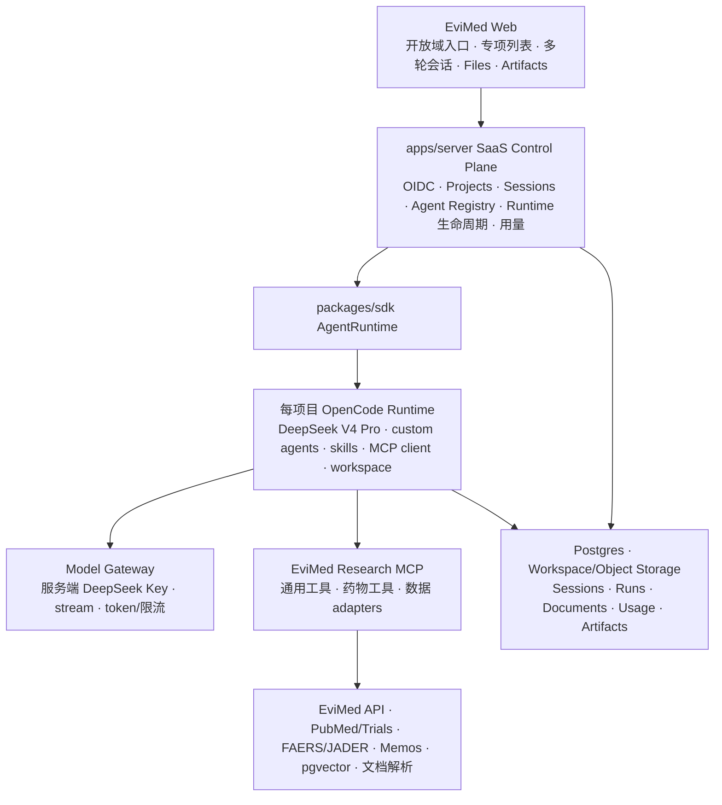

# EviMed SaaS 科研 Agent 统一底座最终方案

- 文档状态：**v4 Final（定版）**
- 日期：2026-07-16
- 产品目标：保留 Open Science 的开放域自主科研能力，并让 EviMed 已有 ADR、超说明书、循证评价、药品遴选等专项科研能力获得更稳定的工具、数据和输出质量。
- 核心形态：**一个 SaaS、一套 Agent runtime 架构（每项目一个隔离实例）、一套工具与数据底座、开放域与多个专项入口。**
- 范围原则：这是新项目，不迁移旧用户或历史业务数据；不建设临床签署、复杂 RBAC、重型工作流、重型合规审计或多地域容灾。

---

## 0. 最终结论

EviMed 不再维护“每个专项功能一套 Agent 后端”。最终产品在每个项目的隔离 runtime 中采用：

```text
开放域科研入口 ─┐
ADR 专项入口 ───┤
超说明书入口 ───┤
循证评价入口 ───┼── 同一 OpenCode runtime
文献综述入口 ───┤   同一 EviMed Research MCP
其他专项入口 ───┘   同一数据、资料库、会话、产物与运行体系
```

不同入口只决定：

- 本次会话绑定哪个 Agent Package；
- 默认加载什么专业指引；
- 优先提供哪些工具和数据源；
- 期望生成哪些产物。

它们不会创建不同的 Agent 框架、任务系统、数据库或前端会话实现。

### 定版后的关键修正

1. **专项 Agent 不等于一个 `SKILL.md`。**
   - 专项 Agent 是一个轻量 Agent Package：`agent.yaml + SKILL.md + references/templates/tests`。
   - `SKILL.md` 负责专业判断和可变路径；`agent.yaml` 负责产品入口、依赖和产物契约。
2. **不设计工作流 DSL。**
   - `agent.yaml` 不描述固定步骤、分支和状态流转。
   - 必须严格按顺序执行的局部逻辑封装成确定性组合工具。
3. **工具层正式命名为 `EviMed Research MCP`。**
   - 下载版 Open Science 的 `runtime/harness` 是一个自演化 Agent 工作区，不是工具服务，避免同名混淆。
4. **专项会话在每一轮固定 Agent 身份。**
   - 不是首轮发送一次 Skill 后就依赖上下文记忆。
   - `apps/server` 保存 `agent_id + agent_version`，每次调用 `sendPrompt` 都传入对应 OpenCode agent。
5. **以当前 hosted Web 版为 SaaS 基线，选择性吸收下载版 0.2.0。**
   - hosted 版提供 Web server、OIDC、Docker runtime 和部署能力。
   - 下载版提供更新的 AgentRuntime、Goal、Runs、国际化和科研 skill。

---

## 1. 审查范围与代码基线

本方案基于以下真实代码，而不是只根据产品想象设计：

| 代码资产 | 已验证的主要能力 | 最终处理 |
|---|---|---|
| 当前 `OpenScience/` 0.1.3 | React/Tauri、OpenCode SDK、hosted `apps/server`、OIDC、项目隔离、Docker runtime、Web 部署、artifact/provenance | **SaaS 主基线** |
| 下载的 `open-science-master/` 0.2.0 | `AgentRuntime` 接口、Goal 模式、Runs 执行账本、项目/会话分组、i18n、更新的科研 skills | **选择性前移合并** |
| `循证药品综合评价agent/` | 多轮会话、Agent 路由、Plan–Execute–Critique、工具重试、循证检索、报告撰写 | 吸收方法与工具契约，不搬 Spring Agent 框架 |
| `循证药品综合评价/` | 文献、指南、试验、说明书、HTA、报告和策展数据 | 作为内部数据 API 与业务规则来源 |
| `超说明书用药/` | 多国说明书、指南、文献、质量评价、报告、部分信号计算 | 作为 off-label 数据和方法来源 |
| `安全性分析/` | FAERS/JADER、MedDRA、ROR/IC/EBGM、图表与安全性报告 | 作为 ADR 数据与算法来源 |
| `药品遴选/` | 评价量表、药价、同义词、评分、报告 | 后续转成确定性工具和专项 Agent |
| `记忆模块/` | Memos 用户与 PRIVATE memo | 可选长期记忆服务 |

### 1.1 下载版 Open Science 中可吸收的核心变化

下载版不是 hosted SaaS，但有几项科研执行能力明显优于当前副本：

1. `packages/sdk/src/runtime.ts` 已抽象 `AgentRuntime`，UI 不再必须依赖具体 `OpenCodeClient` 类型。
2. `sendPrompt` 支持按 turn 指定 `agent` 与 `model`，适合稳定绑定专项 Agent。
3. Goal 模式可让 Agent 在多个自动 turn 中持续完成目标，并支持暂停、继续和完成证据。
4. Runs 记录命令、代码哈希、环境、输入输出和日志，可复现科研计算。
5. 项目下组织多会话，符合 SaaS 中“一个科研项目、多次研究任务”的产品模型。
6. 新增中文等多语言界面以及更完整的科研 skill。

### 1.2 不直接吸收的部分

- Tauri 桌面更新、系统托盘、OS 打开文件等桌面专属实现；
- 本地 SQLite Runs 索引的原样实现；SaaS 改用 Postgres 查询摘要，workspace 保存详细记录；
- 本地 API Key 设置与桌面凭据流程；SaaS Key 只在服务端；
- 本地人工 permission 模式；SaaS runtime 在隔离边界内默认执行；
- `runtime/harness` 自修改规则和每日 notes 机制；项目知识由 workspace 与 Memos 承担，不允许生产 Agent 自动改平台规则。

---

## 2. 产品形态：一个平台，两类入口

### 2.1 开放域科研 Agent

“新建研究”就是开放域入口，直接复用 Open Science 的主会话页面。

用户可以提出任意科研任务，Agent 自主：

1. 理解目标并拆解任务；
2. 检索文献或读取用户文件；
3. 编写和运行 Python/R/TS；
4. 调用 EviMed Research MCP；
5. 按需加载 ADR、off-label、循证评价等专项 Skill；
6. 生成报告、表格、图、代码、Notebook 和引用；
7. 将全部产物保存在当前项目 workspace。

开放域 Agent 不受某个专项模板限制，必须保留 Open Science 的探索性和跨学科能力。

### 2.2 专项科研 Agent

专项入口是对同一 runtime 的“专业预配置启动”，不是另一个系统。

首批专项 Agent：

| 分类 | Agent | 首要价值 |
|---|---|---|
| 药物分析 | 药品安全性分析 | FAERS/JADER 信号、说明书和证据综合 |
| 药物分析 | 超说明书用药分析 | 多国说明书、指南、文献与适应症判断 |
| 证据合成 | 循证证据梳理 | PICO、检索、纳排、证据表和综合 |
| 文献阅读 | 文献综述 | 文献检索、阅读笔记、分类和综述 |
| 药物分析 | 药品循证综合评价 | 有效性、安全性、经济性综合 |
| 辅助工具 | 统计分析 | 方法选择、计算、图表与结果解释 |

后续按真实数据与工具成熟度增加：药品遴选、HTA 快评、Meta、系统综述、定量分析、课题申报、说明书对比和孟德尔随机化。

### 2.3 两类入口的关系

- 开放域 Agent 可以自主发现并加载专项 Skill。
- 专项 Agent 也拥有通用检索、文件、代码、图表和报告能力。
- 同一工具只有一份实现。
- 同一数据源只有一个 adapter。
- 同一会话组件支持流式输出、工具过程、文件、产物和多轮追问。

---

## 3. 最终信息架构与页面设计

### 3.1 左侧导航

参考用户截图，并保留 Open Science 的既有信息层级：

```text
EviMed

+ 新建研究             → 开放域科研 Agent 空白会话
  搜索                 → 全局搜索会话、文件与资料
  知识库               → 个人资料库
  文件                 → 当前项目 Files
  科研 Agent           → 专项 Agent 功能列表
  运行与产出           → Runs、报告、图表、表格和可复现记录

────────────────────
最近任务 / 全部任务
  [ADR] 阿司匹林信号分析
  [开放] 肿瘤免疫研究方向
  [OSU] 某药超说明书证据
```

“科研 Agent”放在 Files 下方，视觉上参考截图中的“科研工作流”，但产品文案使用“科研 Agent”，避免暗示后台存在固定工作流引擎。

### 3.2 专项 Agent 列表页

页面采用截图中的纵向列表，不采用大面积卡片宫格：

```text
科研 Agent
按研究目标选择一个专项 Agent；所有 Agent 都支持多轮对话和文件协作。

[DS]  药品安全性分析
      药物分析 · 支持多轮 · 约 20–40 分钟
      完成药物/事件标准化、信号检测、说明书和证据汇总。         →

[OL]  超说明书用药分析
      药物分析 · 支持多轮 · 约 15–30 分钟
      对比说明书、指南和文献，形成可追踪的证据结论。           →
```

每条展示：

- 简短缩写或图标；
- 分类；
- 名称和一句话说明；
- 是否支持文件；
- 预计耗时范围；
- 可选产物标签，如“报告 / 表格 / 图表”。

不展示虚构的固定“4 步、6 步”。只有确实存在确定性步骤的工具才描述步骤数。

支持分类筛选和搜索，但首版不做复杂商城、评分或用户发布。

### 3.3 点击专项 Agent 后

点击后创建一个专项会话，并进入与开放域完全相同的 `LiveSessionPage`：

```text
┌ 药品安全性分析 · 多轮科研 Agent ───────────────────┐
│ 可以分析 FAERS/JADER 信号、说明书与安全性证据。     │
│ 建议提供：药物名、目标不良事件、时间范围或文件。     │
│ [上传文件] [示例：分析奥希替尼的心脏毒性信号]       │
└───────────────────────────────────────────────────┘

对话流 / 工具状态 / 计划 / 追问
────────────────────────────────────────────────────
输入消息、拖入文件或选择资料库……
```

差异只体现在：

- 会话头部显示专项 Agent 名称；
- 首屏显示该 Agent 的推荐输入和 starter prompts；
- runtime 每一轮固定传入该 Agent 的 OpenCode agent id；
- 右侧仍使用 Open Science 的 Artifact/Inspector；
- 用户可以继续追问、补充文件、要求重算或改写报告。

### 3.4 会话与任务历史

每个顶层会话记录：

- `mode=open-domain|specialist`；
- `agent_id` 与 `agent_version`；
- `project_id`；
- OpenCode `session_id`；
- 标题、状态、创建和更新时间；
- 最近一次运行状态和主要产物。

专项会话在后续多轮中保持原 Agent。若用户希望转成开放域研究，创建一个继承选定上下文的新会话，不在原会话中静默改变 Agent 身份。

---

## 4. Agent Package：专项能力的唯一产品定义

### 4.1 目录结构

```text
OpenScience/runtime/skills/evimed/
└── adr-analysis/
    ├── agent.yaml
    ├── SKILL.md
    ├── references/
    ├── templates/
    └── tests/
```

整个目录在 runtime 启动时同步。OpenCode 将 `SKILL.md` 作为标准 Skill；EviMed registry 读取 `agent.yaml`。

### 4.2 `agent.yaml`

```yaml
id: adr-analysis
version: 1.0.0
title: 药品安全性分析
category: 药物分析
description: 完成不良事件信号挖掘、说明书对比和安全性证据汇总
skill: adr-analysis
estimatedMinutes: [20, 40]

starterPrompts:
  - 分析奥希替尼与心脏毒性相关的安全信号
  - 汇总某药在 FAERS 中的主要不良事件

requiredInputs:
  - drug
optionalInputs:
  - adverseEvent
  - dateRange
  - uploadedFiles

requiredTools:
  - evimed_drug_term_normalize
  - evimed_adr_case_query
  - evimed_adr_signal_analysis
optionalTools:
  - evimed_drug_label_search
  - evimed_literature_search

dataSources:
  - faers
  - meddra
  - drug-labels

outputs:
  - path: safety-report.md
    required: true
  - path: signal-table.csv
    required: true
  - path: signal-chart.png
    required: false

completionChecks:
  - requiredOutputsExist
  - citationsResolvable
```

这不是流程 DSL，因为它没有 `steps`、分支、跳转、人工节点或状态机。

### 4.3 `SKILL.md`

只使用 OpenCode 标准 frontmatter：

```yaml
---
name: adr-analysis
description: Use when the user asks for pharmacovigilance, FAERS/JADER signal analysis, adverse-event comparison, or a drug safety report.
compatibility: opencode
metadata:
  evimed-agent: adr-analysis
---
```

正文按业务需要包含：

- 适用和不适用范围；
- 如何澄清最小输入；
- 推荐的研究策略；
- 工具选择原则；
- 证据不足时的降级；
- 关键方法学提醒；
- 输出和引用要求。

不强制所有 Agent 使用统一章节模板，也不要求每个工具配套完整 Algorithm Specification、oracle 和验证数据集。

### 4.4 从 Agent Package 生成 OpenCode agent

`apps/server` 的 Agent Registry 在部署或启动时：

1. 扫描所有 `agent.yaml`；
2. 校验 id、版本、Skill、工具和数据源；
3. 生成画廊列表；
4. 生成或写入对应 OpenCode custom agent 配置；
5. custom agent 的 prompt 引用同目录 `SKILL.md`，不复制正文；
6. 创建专项会话时保存 agent id；
7. 每次 `sendPrompt` 都指定该 agent。

开放域 Agent 不绑定某一个专项包，但可以通过 OpenCode `skill` tool 加载其中任意 Skill。

---

## 5. 统一执行架构



### 5.1 选用当前 hosted 版作为主干

主干继续使用当前 `OpenScience/`，因为它已经具备：

- `apps/server` hosted Web boundary；
- OIDC 与用户/项目；
- 每项目 runtime 生命周期；
- Docker 隔离、资源限制和 runtime proxy；
- hosted Web 构建、测试和部署脚本；
- 文件、Notebook、Artifact、Inspector 和 provenance。

不直接用下载版覆盖当前目录；应按功能逐项前移合并，避免丢失 hosted server 的 230 余个新增文件和部署加固。

### 5.2 必须从下载版合并的 SDK 能力

第一批必须前移：

1. `AgentRuntime` 接口；
2. `OpenCodeClient implements AgentRuntime`；
3. `sendPrompt(sessionId, text, agent?, model?)`；
4. 项目下多会话分组；
5. Runs 类型与前端展示的可复用部分；
6. 中文 i18n 基础。

OpenCode 仍是唯一 runtime；抽象接口不是为了同时维护第二个 runtime，而是防止 EviMed UI 和 OpenCode 私有协议耦合。

### 5.3 Runtime Bootstrap

当前 hosted runtime 启动主要同步 Skill，还没有服务端托管的 EviMed MCP/agent/provider 注入。需要增加一个 bootstrap：

1. 创建项目级 XDG config；
2. 写入 DeepSeek-compatible Model Gateway provider；
3. 写入 `EviMed Research MCP` remote 配置；
4. 写入生成的 EviMed custom agents；
5. 配置默认 permission 执行；
6. 注入短期 project token；
7. 启动 OpenCode；
8. 通过 `/mcp`、`/agent` 和 `/api/skill` 做 readiness 检查。

浏览器只能读取 runtime 能力和调用会话接口，不能修改 `/global/config`、MCP 或 provider。

### 5.4 Runtime 内部网络

Model Gateway 和 remote MCP 需要可达，因此生产 runtime 不能继续使用完全断网的 `network=none`，也不能直接放开公网。

采用一个最小内部网络：

```text
OpenCode runtime ── internal-only network ── Model Gateway
                                      └───── EviMed Research MCP

Model Gateway / Research MCP ── service network ── DeepSeek 与获准数据源
```

- runtime 只加入 `internal: true` 的专用网络；
- 该网络只包含 runtime、Model Gateway 和 Research MCP；
- runtime 没有公网默认路由，不能直连外部 URL 或其他内部服务；
- Gateway/MCP 在另一侧代表 runtime 调用 DeepSeek 和获准数据源；
- project token 只允许访问当前用户/项目，并具有短有效期；
- OpenCode 的 server→runtime 控制仍优先使用现有 Unix socket。

这条网络既满足 Agent 自动调用模型/工具，也保留 hosted runtime 的最小出网面。

---

## 6. DeepSeek V4 Pro 接入

模型统一使用：

```json
{
  "model": "deepseek-v4-pro",
  "thinking": { "type": "enabled" },
  "reasoning_effort": "high",
  "stream": true
}
```

Runtime 的 OpenAI-compatible base URL 指向内部 Model Gateway：

```json
{
  "provider": {
    "deepseek": {
      "name": "DeepSeek",
      "npm": "@ai-sdk/openai-compatible",
      "options": {
        "baseURL": "http://model-gateway.internal/v1",
        "apiKey": "${PROJECT_RUNTIME_TOKEN}"
      },
      "models": {
        "deepseek-v4-pro": {
          "name": "DeepSeek V4 Pro"
        }
      }
    }
  },
  "model": "deepseek/deepseek-v4-pro"
}
```

真实 DeepSeek Key：

- 只在 `apps/server`/Model Gateway 的 secret 中；
- 不进入浏览器、workspace、OpenCode project token、日志或文档；
- 不直接放进 runtime 环境；
- Model Gateway 统一补充 thinking/reasoning 参数、统计 token 和处理限流。

在进入专项开发前先实测 OpenCode 1.17.13 与 `deepseek-v4-pro` 的 stream、tool calling、长工具循环和结构化输出。若字段不能完整透传，由 Gateway 兼容。

---

## 7. EviMed Research MCP：统一工具与数据接入面

### 7.1 为什么必须有 MCP

`apps/server/src/commands.mjs` 是浏览器/Tauri 调用服务端能力的 API，不会自动成为 OpenCode 的 LLM tool。

Agent 要自主调用 ADR 信号、说明书、指南、文档解析等能力，必须通过 OpenCode 原生支持的 MCP/custom tool 暴露。

实现建议：

```text
OpenScience/runtime/mcp/evimed-research/
├── src/
│   ├── server.ts
│   ├── registry.ts
│   ├── tools/
│   │   ├── common/
│   │   ├── evidence/
│   │   ├── safety/
│   │   ├── offlabel/
│   │   └── selection/
│   └── adapters/
│       ├── evimed-api/
│       ├── public-literature/
│       ├── document-parser/
│       ├── library/
│       └── memos/
└── test/
```

首版可作为 `apps/server` 的内部模块或同一部署单元中的 sidecar，不先拆独立微服务。

### 7.2 工具设计原则

1. 工具名稳定、明确、有域前缀，如 `evimed_adr_signal_compute`。
2. 输入为窄 JSON Schema，不接受模糊大对象。
3. 输出结构固定。
4. 常用动作使用中等粒度工具。
5. 严格顺序或高往返成本的流程使用组合工具。
6. 不为每个数据库 endpoint 暴露一个 tool，防止工具爆炸和上下文浪费。
7. LLM 负责检索策略、证据判断和写作；代码负责计算、格式、校验和数据访问。
8. MVP 不维护用户级工具权限；所有部署工具默认执行。工具数量变大后，可由 custom agent 内部隐藏无关工具以减少上下文，这不产生用户审批流程。

### 7.3 统一返回契约

```ts
type ToolResult<T> = {
  status: "success" | "warning" | "error";
  summary: string;
  data?: T;
  sources?: Array<{
    id?: string;
    title?: string;
    url?: string;
    source: string;
    retrievedAt: string;
  }>;
  warnings?: string[];
  next_actions?: string[];
  artifacts?: Array<{ path: string; type: string }>;
  error?: {
    code: string;
    message: string;
    retryable: boolean;
    stopReason?: string;
  };
};
```

工具失败必须给出根因提示、安全重试方式和停止条件，避免 Agent 无意义重复调用。

### 7.4 首批通用工具

**检索与证据**

- `evimed_query_structure`：PICO/关键词结构化；
- `evimed_term_normalize`：药物、疾病、事件中英术语和同义词；
- `evimed_literature_search`：内部文献 + PubMed/Crossref 等；
- `evimed_guideline_search`；
- `evimed_clinical_trial_search`；
- `evimed_evidence_block_search`：内部向量文本块；
- `evimed_evidence_deduplicate`；
- `evimed_evidence_rerank`；
- `evimed_citation_resolve`。

**文件、资料库与产物**

- `evimed_document_parse`；
- `evimed_library_search`；
- `evimed_table_render`；
- `evimed_chart_render`；
- `evimed_report_export`。

### 7.5 ADR 专项工具

- `evimed_drug_term_normalize`；
- `evimed_adr_case_query`；
- `evimed_adr_contingency_build`；
- `evimed_adr_signal_compute`；
- `evimed_adr_signal_rank`；
- `evimed_adr_signal_chart`；
- `evimed_adr_signal_analysis`：组合查询、列联表、信号计算和产物输出。

专项 Skill 默认调用组合工具，开放域 Agent 或排错时可以使用原子工具。

### 7.6 超说明书专项工具

- `evimed_drug_label_search`；
- `evimed_drug_label_compare`；
- `evimed_offlabel_evidence_retrieve`；
- `evimed_population_dose_extract`；
- `evimed_offlabel_evidence_packet`：组合说明书、指南、试验和文献证据包。

“是否属于 off-label”“证据是否足够”等判断仍由 Skill/LLM 基于证据完成，不伪装成确定性数据库函数。

### 7.7 工具验证分级

| 等级 | 示例 | 最小验证 |
|---|---|---|
| Adapter | 检索、说明书、文件解析 | contract test、分页/超时/空结果/错误处理 |
| 普通确定性工具 | 去重、RRF、引用、评分汇总 | 单元测试和关键边界 |
| 方法计算 | ROR/IC/EBGM、Meta、MR | 明确实际采用口径、少量可复核样例和边界测试 |

不要求全部工具套用相同文档模板。只有方法计算或真实发现过错误的工具才增加更深验证。

---

## 8. 数据源接入与旧代码吸收

### 8.1 吸收 `EvidenceSearchPort` 思想

旧 Agent 中 `EvidenceSearchPort` 已经把工具和底层 Zilliz、Elasticsearch、说明书、FAERS 隔离，是正确方向。

在新架构中转为 TypeScript adapter interface：

```ts
interface EvidenceSourceAdapter {
  searchPapers(input: PaperSearchInput): Promise<EvidenceItem[]>;
  searchBlocks(input: BlockSearchInput): Promise<EvidenceItem[]>;
  searchGuidelines(input: GuidelineSearchInput): Promise<EvidenceItem[]>;
  searchDrugLabels(input: DrugLabelInput): Promise<EvidenceItem[]>;
  searchAdverseEvents(input: AdverseEventInput): Promise<EvidenceItem[]>;
}
```

MCP tool 不知道 Elasticsearch/MongoDB/Milvus 的细节，只调用 adapter。

### 8.2 旧系统资产如何处理

| 旧资产 | 吸收方式 | 不做什么 |
|---|---|---|
| `AgentDispatcher`/`BaseAgent` | 吸收 Agent 绑定、会话延续、停止、工具重试思想 | 不复制 Spring Agent 生命周期 |
| Plan–Execute–Critique | 转成开放域/专项 Skill 的研究策略；Goal 模式支持超长任务 | 不做通用流程状态机 |
| `EvidenceSearchPort`/`EvidenceRetrievalTool` | 转为 MCP schema 和 adapter | 不让新 Agent 直接依赖 Java 类 |
| 文献、指南、试验、说明书检索 | 优先包装为稳定内部 API | 不迁移旧用户操作数据 |
| RRF、去重、类型平衡 | 转为 TS 确定性工具 | 不交给 LLM 临时编写 |
| FAERS/JADER、MedDRA、ROR/IC/EBGM | 第一版调用现有可信 API；再按需要移植计算 | 不未经核对直接翻译算法 |
| off-label 说明书和报告逻辑 | 数据变 adapter，判断变 Skill，模板进入 Agent Package | 不复制旧页面流程 |
| 报告模板与导出 | 可用模板进入 `templates/`，复杂导出暂调用旧服务 | 不优先重写全部 Aspose/iText 代码 |
| 药品遴选量表和评分 | 评分转确定性工具，解释和报告转 Skill | 不迁移历史遴选任务 |
| 旧会话、任务、用户、收藏、OSS 记录 | 不迁移 | 新项目从零建立 SaaS 状态 |

### 8.3 数据接入顺序

1. **先 API 包装**：保留现有 Java 服务作为内部数据/算法提供者。
2. **再稳定契约**：MCP adapter 统一鉴权、超时、分页、字段和错误。
3. **后选择性移植**：只有维护成本高或性能不满足的逻辑才移植到 TS。

这样能最快获得原专项效果，同时避免把五个旧服务的耦合带入新底座。

### 8.4 个人资料库

```text
upload → 文件校验 → 文档解析 → 分块 → embedding → pgvector
                                               ↓
                                         library_search
```

- 用户明确选择是否让当前会话使用资料库；
- 强制 `user_id + project_id + document_id` 过滤；
- 记录文档哈希、分块版本和 embedding 版本；
- embedding 通过 provider adapter，首版在中英医学资料小样本上选型，不把架构绑定单一模型；
- URL 解析拒绝内网地址，上传限制大小、扩展名和 MIME。

### 8.5 Memos 长期记忆

- 每个 EviMed 用户映射一个 Memos 用户；
- 默认 PRIVATE；
- 只保存用户明确要求长期记住的偏好、项目背景和稳定结论；
- 不自动保存所有聊天和检索内容；
- 由 server 代理，PAT 不进入浏览器或 runtime；
- 自演化 Agent 的“知识积累”只通过受控 Memos/workspace 实现，不自动修改平台 Skill 或规则。

---

## 9. 开放域自主执行、Goal 与 Runs

### 9.1 普通执行

普通问题使用一个 OpenCode turn：Agent 可以在 turn 内多次调用工具、运行代码和生成产物。用户可以停止并从已有 workspace 继续。

### 9.2 Goal 模式

下载版的 Goal 能力适合真正的开放域长任务，但不作为所有任务的默认流程。

EviMed 提供可选“持续完成此研究”模式：

- 保存 objective；
- Agent 在一次 turn 结束且目标未完成时自动继续；
- 显示 running/paused/blocked/complete；
- 用户可以暂停、继续或停止；
- 只有存在可说明的完成证据时标记完成；
- 设置 turn、token、时间和费用上限。

它是自主续跑控制，不是业务工作流 DSL。第一版在 DeepSeek 长任务验证通过后启用。

### 9.3 Runs 是科研可复现性，不是重型审计

从下载版吸收 Runs 的核心字段：

- 命令或工具；
- 代码/Skill/Agent 版本；
- 模型；
- 输入文件哈希；
- 输出产物；
- 状态、耗时和简化日志；
- 可选重现入口。

不记录 API Key、完整用户文档、完整 prompt 或全部工具返回。

Runs 用于回答“这个图和数字怎么得到”，不是建设合规审计平台。

---

## 10. SaaS 状态与存储

这是新项目，不复制旧业务表。最小 Postgres 模型：

| 表 | 用途 |
|---|---|
| `users` | OIDC identity mapping |
| `projects` | 用户科研项目和 workspace 引用 |
| `research_sessions` | OpenCode session、open/specialist 模式、agent id/version、状态 |
| `agent_runs` | turn/goal 执行摘要、模型、token、耗时、错误和主要产物 |
| `documents` | 上传文件元数据、哈希和解析状态 |
| `library_chunks` | pgvector 文档分块 |
| `usage_ledger` | 模型、embedding 和外部 API 用量 |
| `memos_user_mapping` | Memos 用户映射和 secret 引用 |

Agent catalog、Skill 和工具 schema 保存在版本化代码中，不做数据库后台配置中心。

详细运行产物保存在项目 workspace/对象存储：

```text
workspace/
├── project-files/
├── sessions/<session-id>/
│   ├── inputs/
│   ├── work/
│   └── artifacts/
└── .evimed/
    ├── provenance.jsonl
    └── runs.jsonl
```

Memos 可使用同一 Postgres 集群，但采用独立 database/schema。

---

## 11. 必要安全边界

用户不需要逐动作审批。OpenCode question/permission 也不承担临床签署。

默认执行建立在以下边界上：

1. OIDC 登录和用户/项目归属校验；
2. 每项目独立 runtime 与 workspace；
3. 容器限制 CPU、内存、磁盘、进程和最长运行时间；
4. Agent 只能访问当前 workspace；
5. 只开放部署方提供的工具和固定内部网关；
6. Runtime 不持有 DeepSeek、EviMed、Memos 等真实 Key；
7. Model/MCP 使用短期、项目级 token；
8. 上传路径、文件类型、MIME、大小和 URL 目标校验；
9. 所有数据 adapter 强制注入 user/project 范围；
10. 基础限流、并发和费用上限。

不建设：

- 逐工具用户授权配置中心；
- 医学、统计、药物警戒三方签署；
- 电子签名和版本重新验证流程；
- WORM 审计存储；
- 多地域双活。

### 最小备份

- 每日备份 Postgres；
- workspace/对象存储按日备份；
- 保留最近若干天；
- 上线前做一次真实恢复测试。

---

## 12. 质量策略

### 12.1 平台测试

- Agent Package schema/registry 测试；
- OpenCode runtime bootstrap 测试；
- 专项 session 每轮 agent pinning 测试；
- MCP tool discovery/readiness 测试；
- 两用户/两项目隔离测试；
- Model Gateway stream 与 tool calling 测试；
- Files/Artifacts/Runs 关联测试。

### 12.2 专项 Agent 测试

每个专项 Agent 只准备少量高价值代表问题，检查：

- 是否识别并补齐最小输入；
- 是否选择正确数据源和工具；
- 是否生成声明的必需产物；
- 数字是否来自工具结果；
- 引用是否存在；
- 工具失败时是否说明缺口并合理降级；
- 多轮补充条件后是否保持同一专项上下文。

不建设一开始就覆盖所有医学问题的庞大评测平台。

### 12.3 开放域能力回归

重构不能为了专项 Agent 破坏开放域能力。至少保留以下回归：

1. 单提示完成“读取/获取数据 → 编写代码 → 运行 → 生成图 → 写报告”；
2. 任意领域文件可以被 Files/Notebook/Inspector 使用；
3. 开放域 Agent 能自主加载专项 Skill；
4. Artifact 能回到产生它的会话和 Run；
5. 中断后能基于已有 workspace 继续。

---

## 13. 实施路线与验收

### 阶段 0：统一主干和最小闭环

1. 以当前 `OpenScience/` hosted 版为主干；
2. 前移下载版 `AgentRuntime` 和按 turn 指定 agent/model；
3. 增加 `research_sessions` 和 `agent_runs`；
4. 增加 Runtime Bootstrap；
5. 接入 DeepSeek Model Gateway；
6. 建立 Agent Package registry；
7. 建立 EviMed Research MCP，先实现 2–3 个简单工具；
8. 左侧加入“科研 Agent”入口和列表页。

**验收：**

- “新建研究”创建开放域会话；
- 点击一个演示专项 Agent 创建绑定会话；
- 两种会话都在同一 `LiveSessionPage` 多轮运行；
- Agent 能自主调用 MCP 并生成 workspace artifact；
- 专项会话第二轮仍使用同一 Agent。

### 阶段 1：完整保留 Open Science 开放域能力

1. 合并下载版项目/会话组织和中文 i18n；
2. 吸收 Runs 与可复现产物；
3. 接文献、指南、临床试验和文档解析；
4. 上线个人资料库；
5. 整合最新版 research-explorer、literature-survey、experiment-suite、paper-writer 等 Skill；
6. 验证后上线可选 Goal 模式。

**验收：**开放科研任务可以从问题/文件出发，自动检索、分析、运行代码并生成可追踪报告。

### 阶段 2：两个专项样板

#### ADR Agent

- 先通过 adapter 调现有 FAERS/JADER/MedDRA 与信号 API；
- 上线术语归一、信号查询、信号分析、图表和报告；
- 针对 ROR/IC/EBGM 做少量边界验证；
- 支持用户多轮追加不良事件、时间和对照条件。

#### 超说明书 Agent

- 接多国说明书、指南、文献和临床试验；
- 生成结构化 evidence packet；
- Skill 完成适应症、人群、剂量、途径和证据判断；
- 产出证据表和报告。

**验收：**两个专项 Agent 的效果不低于旧入口，并能使用 Open Science 的文件、代码、资料库和多轮会话能力。

### 阶段 3：扩展专项与 SaaS 稳定性

- 循证证据梳理、文献综述、药品综合评价；
- 药品遴选、HTA、Meta、统计分析；
- Memos 长期记忆；
- 并发、长任务、Goal 和费用压测；
- 备份恢复演练。

---

## 14. 完整重构的最终验收矩阵

| 能力 | 必须达到的结果 |
|---|---|
| 开放域入口 | 用户可以像使用 Open Science 一样提出任意科研任务 |
| 专项入口 | 列表点击进入同一会话页面，不跳旧系统 |
| 多轮会话 | 专项 Agent 在后续 turn 中保持 agent id/version |
| 自主执行 | 默认不逐动作询问，Agent 可连续调用工具和写产物 |
| 统一工具 | 开放域与专项 Agent 调用同一个 MCP tool 实现 |
| 统一数据 | 同一文献/指南/说明书/ADR adapter 不重复建设 |
| 专项效果 | 专业 Skill + 组合工具 + 旧数据资产形成比纯开放 Agent 更好的结果 |
| 文件能力 | 专项会话能使用上传、Files、Notebook、资料库和 Artifact Inspector |
| 可追踪 | 报告中的关键数字、图表和引用能回到工具/Run/来源 |
| SaaS 隔离 | 不同用户和项目不能互读 workspace、资料库或 token |
| 失败恢复 | 工具错误给出原因和可重试方式；中断后可从 workspace 继续 |
| 密钥安全 | 真实模型和数据源 Key 不进入浏览器或 runtime workspace |
| 无旧迁移 | 新平台不依赖旧用户/任务/收藏/报告表才能启动 |

只有这些验收全部通过，才能称为“完整重构完成”；仅做专项列表或仅写几个 Skill 不算完成。

---

## 15. 最终锁定的架构决策

1. **主干**：当前 hosted `OpenScience/`，不直接覆盖为下载版。
2. **上游吸收**：前移下载版 0.2.0 的 AgentRuntime、agent/model per turn、Runs、项目会话、i18n 和 curated skills。
3. **产品入口**：“新建研究”是开放域；Files 下方“科研 Agent”是专项列表。
4. **会话**：开放域与专项共用 `LiveSessionPage`、OpenCode session、Files 和 Artifacts。
5. **专项定义**：`agent.yaml + SKILL.md` 的 Agent Package。
6. **专项稳定性**：每一轮 pin OpenCode custom agent，不依赖一次性 Skill 提示。
7. **流程**：不建设通用工作流 DSL；确定性局部流程封装组合工具。
8. **工具**：统一 `EviMed Research MCP`，不复用 `runtime/harness` 名称。
9. **旧代码**：优先 API 包装和 adapter，选择性移植，绝不原样搬五个服务。
10. **数据**：不做历史业务迁移，只建最小 SaaS 状态、资料库和 Memos 映射。
11. **模型**：DeepSeek V4 Pro，经服务端 Model Gateway。
12. **权限**：隔离 runtime 内默认执行；无逐动作权限配置和临床签署。
13. **科研质量**：保留 Open Science 的 provenance/Run，定位为可复现，不扩张成合规平台。
14. **首批专项**：ADR、超说明书、循证证据梳理、文献综述。

这套方案最终实现的是：**一个开放域科研平台，通过同一套 Agent runtime 架构、工具和数据，在不同专项入口下获得更强的领域效果；新增一个专项 Agent 主要是增加一个 Agent Package 和必要工具，而不是再造一套应用。**
