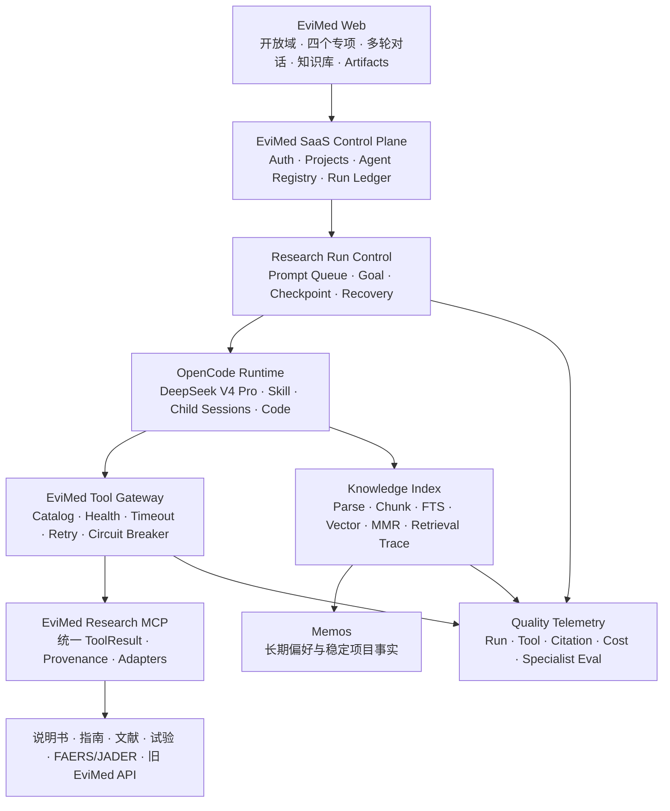

# EviMed × Grok Build Harness 融合建设方案

- 文档状态：v2 Implemented Baseline
- 日期：2026-07-17
- 上位方案：[EviMed SaaS 科研 Agent 统一底座最终方案](./2026-07-16-evimed-openscience-platform-design.md)
- 审查对象：本地 `grok-build-main/`，`SOURCE_REV=2ec0f0c8488842da03a71eeee3c61154957ca919`
- 适用范围：EviMed SaaS 开放域科研 Agent 与现有四个专项科研 Agent

---

## 0. 执行结论

Grok Build 有一批成熟的 Harness 机制值得吸收，但不适合作为 EviMed 的第二套运行时，也不应替换 OpenCode。

最终架构继续锁定为：

1. **OpenCode 是唯一 Agent 执行内核**，负责模型循环、工具调用、Skill、子会话和流式事件。
2. **EviMed `apps/server` 是 SaaS 控制面**，负责用户/项目隔离、运行账本、连接器、知识库、队列、成本和恢复。
3. **EviMed Research MCP 是统一工具与数据接入面**，开放域和专项 Agent 共用。
4. **`agent.yaml + SKILL.md` 是专项能力定义**，不引入 Grok 的另一套 Agent YAML/Markdown DSL。
5. **Grok Build 作为 Harness 设计样本**：吸收其运行中追加指令、MCP 生命周期、熔断、混合记忆检索、受控子任务、检查点、压缩恢复和低泄露遥测等机制。

一句话概括：

> 不把 Grok Build 接进来再跑一个 Agent，而是把它已经验证过的 Harness 机制，按 EviMed 的 Node/OpenCode/MCP/SaaS 边界重建到现有统一底座中。

这能填补当前方案中的真实空白，尤其是：

- 长任务运行期间无法继续追加要求；
- 数据源只完成“接上”，缺少健康检查、熔断和安全重试；
- 个人知识库目前以文件同步为主，缺少精准检索；
- 多来源科研任务缺少受控并行和父任务汇总契约；
- 长会话压缩后，目标、约束和证据状态可能丢失；
- 现有平台指标偏基础设施，尚不能证明专项 Agent 是否真的更好。

这些增强不会引入临床签署、复杂权限、重型工作流、插件商城或第二套存储体系。

---

## 1. 审查方法与边界

本结论来自本地源码静态审查，不只依据 README。重点检查了以下代码域：

| 能力域 | Grok Build 代码位置 |
|---|---|
| Agent 定义与系统提示 | `crates/codegen/xai-grok-agent/` |
| 工具注册、类型和执行 | `crates/codegen/xai-grok-tools/` |
| 会话与运行时 | `crates/codegen/xai-grok-shell/` |
| Prompt Queue | `crates/codegen/xai-prompt-queue/` |
| 运行中插入消息 | `crates/common/xai-interjection-core/` |
| MCP 生命周期 | `crates/codegen/xai-grok-mcp/` |
| 跨会话记忆与检索 | `crates/codegen/xai-grok-memory/` |
| 上下文压缩 | `crates/common/xai-grok-compaction/` |
| 子 Agent/后台任务 | `crates/codegen/xai-grok-tools/src/implementations/grok_build/task*` |
| Workspace 检查点 | `crates/codegen/xai-grok-workspace/src/session/` |
| Hook/Plugin | `crates/codegen/xai-grok-hooks/` |
| 熔断器 | `crates/common/xai-circuit-breaker/` |
| Sandbox | `crates/codegen/xai-grok-sandbox/` |
| 遥测 | `crates/codegen/xai-grok-telemetry/` |
| ACP/Headless | `crates/codegen/xai-acp-lib/`、`xai-grok-shell` |

该 Rust workspace 有 79 个显式成员。当前机器没有可用的 `cargo` 命令，因此本轮没有编译 Grok Build；本文评价的是源码架构、契约和可融合性，不是对其二进制质量的运行认证。正式复制任何实现前仍需对目标 crate 做单独构建和许可证复核。

同时对照了当前 EviMed 的真实实现：

- `OpenScience/apps/server/src/agentRegistry.mjs`
- `OpenScience/apps/server/src/agentRuns.mjs`
- `OpenScience/apps/server/src/taskManager.mjs`
- `OpenScience/apps/server/src/researchContext.mjs`
- `OpenScience/apps/server/src/runtimeManager.mjs`
- `OpenScience/apps/desktop/src/app/routes/LiveSessionPage.tsx`
- `OpenScience/runtime/mcp/evimed-research/server.py`
- `OpenScience/runtime/skills/evimed/*/agent.yaml`

因此本文所有建议都以“现有能力是否已经存在”为前提，避免重复建设。

---

## 2. 当前 EviMed 已有基础，不应重复建设

Grok Build 的很多能力看起来完整，但 EviMed 已经有对应基础。以下内容保持现状，只做增量增强。

### 2.1 已实现的统一 Agent 底座

当前 EviMed 已经具备：

- 开放域和专项 Agent 共用 OpenCode runtime；
- 专项会话按 `agent_id + agent_version` 固定绑定；
- `agent.yaml + SKILL.md` 专项包；
- DeepSeek-compatible 服务端 Model Gateway；
- EviMed Research MCP；
- 项目级 runtime、workspace、文件和 Artifact；
- 运行账本、幂等 dispatch、终态恢复；
- 后台任务队列、并发限制和重启后状态收敛；
- Docker runtime 隔离、资源配额和服务端密钥管理；
- provenance、审计摘要和基础 Prometheus 指标。

### 2.2 当前四个真实专项 Agent

本方案只围绕代码中已经注册的四个专项包建设：

| Agent | 必需能力 | 主要产物 |
|---|---|---|
| `adr-analysis` | 药物归一、ADR case、信号分析 | 安全性报告、信号表、可选图 |
| `off-label-analysis` | 药物归一、说明书、off-label evidence packet | 报告、证据表、可选来源清单 |
| `comprehensive-drug-evaluation` | 药物归一、综合评价 | 综合报告、证据表、可选摘要 |
| `drug-selection` | 药物归一、遴选评价 | 遴选报告、评分卡、可选决策摘要 |

Grok 融合不能修改这四个 Agent 的产品定义方式，也不能为它们再设计固定流程。

### 2.3 当前工具契约已经优于通用 Harness

`EviMed Research MCP` 已经定义了：

- 窄 JSON Schema；
- `success / warning / error`；
- `summary`；
- `sources` 与 `retrievedAt`；
- `warnings`；
- `next_actions`；
- `retryable` 与 `stopReason`；
- user/project/workspace provenance；
- adapter URL、超时、响应大小、重定向和 workload token 检查。

因此不采用 Grok 的通用 `ToolOutput` 替换现有契约。只吸收它的两点：

1. 将“机器可用结构”和“给模型看的简洁文本”分开；
2. 在元工具或别名工具中记录 `effective_tool_name`，保证追踪到真正执行者。

---

## 3. Grok Build 能力总评

### 3.1 决策分级

| Grok 能力 | 当前 EviMed 状态 | 融合决策 | 价值 | 优先级 |
|---|---|---|---|---|
| Prompt Queue | 运行中 composer 被锁定 | **改造吸收** | 长任务可追加要求，避免中断重跑 | P1 |
| Mid-turn Interjection | OpenCode 能力尚未确认 | **条件吸收** | 运行中纠偏更快 | P2/探针后 |
| MCP liveness/reconnect | 固定 MCP + adapter URL，缺少连接器状态面 | **重点吸收** | 数据源更稳定、错误更可解释 | P0 |
| Side-effect-safe retry | 当前只有一次重试提示 | **重点吸收** | 防止重复写入或重复任务 | P0 |
| Circuit breaker | 尚无 adapter 级熔断 | **重点吸收** | 外部源故障时快速降级 | P0 |
| Hybrid memory search | 当前个人知识库主要同步整文件 | **重点吸收** | 大资料库精准召回、少占上下文 | P0 |
| MMR/时间衰减/查询扩展 | 尚未形成完整检索管线 | **改造吸收** | 降低重复结果和陈旧会话噪声 | P1 |
| Subagent depth/background | OpenCode 有子会话展示，缺少研究任务契约 | **基于 OpenCode 吸收** | 多来源并行，降低总时长 | P1 |
| Goal/completion requirement | 已有 Goal 方向和 completionChecks | **小幅增强** | 长任务可持续、可判定完成 | P1 |
| Workspace checkpoint/rewind | 已有 runs/provenance，无研究状态快照 | **研究化改造** | 复现中间状态、分支比较 | P2 |
| Compaction | OpenCode 自己管理上下文 | **不替换，只补恢复状态** | 防止长会话目标和证据丢失 | P1 |
| Durable TurnCompleted | 已有 run ledger 与终态恢复 | **只补事件一致性测试** | 避免 UI 永久“执行中” | P1 |
| Typed telemetry/redaction | 已有基础指标，缺研究质量指标 | **轻量吸收** | 可证明开放域与专项效果 | P1 |
| Tool search/lazy catalog | 当前仅 13 个工具，尚无上下文压力 | **达到规模阈值后吸收** | 工具扩张时控制 action space | P2/按指标 |
| Hooks | 尚无通用插件 Hook | **仅非关键扩展** | 通知、导出、可观测性 | P2 |
| Plugin marketplace | 不需要 | **不引入** | 风险和维护成本高于价值 | — |
| Grok agent definitions | 已有 Agent Package | **不引入** | 会形成重复 DSL | — |
| Grok OS sandbox | 已有 Docker 隔离 | **不引入** | 重复且弱于 SaaS 容器边界 | — |
| SQLite journal/memory | 已有 JSONL/Postgres/pgvector/Memos 方向 | **不引入** | 会形成双存储 | — |
| ACP | 当前 HTTP + SSE SDK 已稳定 | **暂不引入** | 没有当前产品缺口 | — |
| TUI/LSP/VCS/worktree/voice | 编码 Agent 专属 | **不引入** | 与科研 SaaS 主场景无关 | — |

### 3.2 最重要的架构判断

Grok Build 的价值主要落在 Harness 的四个约束：

- **Action Space**：工具和连接器是否稳定、清晰、可发现；
- **Observation Quality**：工具是否返回可追踪、可恢复、可判断的数据；
- **Recovery Quality**：长任务、外部源故障、SSE 丢失或上下文压缩后能否继续；
- **Context Budget**：个人知识库、工具定义和长对话是否会挤爆模型上下文。

EviMed 的下一阶段应围绕这四项建设，而不是继续增加提示词章节或复制工作流。

### 3.3 价值与建设成本排序

| 建设项 | 填补的主要空白 | 相对价值 | 相对成本 | 结论 |
|---|---|---:|---:|---|
| Connector health + circuit breaker | 数据源波动导致重复调用和错误结论 | 很高 | 中 | 立即建设 |
| Knowledge hybrid retrieval | 个人知识库无法规模化精准使用 | 很高 | 中高 | 立即建设 |
| Prompt Queue | 长任务期间无法补充条件 | 高 | 中 | 紧随 P0 |
| Research State Snapshot | 压缩、重连后目标/约束丢失 | 高 | 中 | 与长任务一起建设 |
| Bounded child tasks | 多来源串行、耗时长 | 高 | 中高 | 复用 OpenCode 建设 |
| Quality telemetry/eval | 无法证明专项优于开放域 | 高 | 中 | 从基线阶段开始 |
| Checkpoint/fork | 研究方案分支比较 | 中 | 高 | 有使用需求后再做 |
| Tool lazy discovery | 工具 schema 上下文膨胀 | 当前低、未来高 | 中高 | 工具规模达到阈值后做 |
| ACP/Plugin marketplace | 当前无产品缺口 | 低 | 高 | 不做 |

Grok 的 `search_tool` 可以按描述搜索工具，但当前 EviMed 只有 13 个研究工具，直接暴露窄 schema 更清晰。优先用专项 Agent 的工具 allowlist 和 MCP 域划分控制 action space；只有当工具数量、schema token 或选错工具率实测明显上升时，才引入 lazy catalog。即使引入，也应保留 typed tool 调用，不退化成一个接受任意 JSON 的万能 dispatcher。

---

## 4. 最终融合架构



这里的 `Research Run Control` 和 `Tool Gateway` 是现有 `apps/server` 的职责扩展，不是新建两个微服务。首版可以仍在 Node server 和现有 MCP sidecar 内完成。

### 4.1 不形成双 Harness

禁止以下结构：

```text
EviMed UI → OpenCode → Grok Build → MCP
```

它会造成：

- 两个模型循环；
- 两套会话和终态；
- 两套工具定义；
- 双重上下文和 token 成本；
- 中断、重试、子任务和 artifact 归属不清；
- DeepSeek 与 Grok 专用模型行为互相牵制。

正确结构是：

```text
EviMed UI → EviMed Control Plane → OpenCode → EviMed Tool Gateway/MCP
                               ↑
                     吸收 Grok 的 Harness 机制
```

---

## 5. 融合项一：服务端连接器注册表与 MCP 生命周期

这是最高优先级，也是 Grok 对当前 EviMed 最大的补强。

### 5.1 当前缺口

当前 MCP 已定义 13 个稳定工具，外部数据能力通过 `ADAPTER_ENV` 映射到固定 URL。它已经有：

- 调用超时；
- 禁止重定向；
- 最大响应限制；
- 结构校验；
- 一次安全重试提示。

但还没有：

- 数据源/adapter 的统一状态目录；
- 启动时 capability snapshot；
- 持续 liveness；
- 熔断状态；
- `retry_after`；
- 按工具配置超时和幂等性；
- runtime 更新工具目录的滚动刷新策略。

### 5.2 目标设计

增加服务端托管的 Connector Registry，但不做用户插件商城或逐人授权。

```ts
type ConnectorManifest = {
  id: string;
  version: string;
  transport: "internal-http" | "stdio" | "streamable-http";
  endpointSecretRef?: string;
  tools: string[];
  dataSources: string[];
  timeoutMs: number;
  healthTimeoutMs: number;
  retryClass: "read-only" | "idempotent" | "side-effecting";
  enabled: boolean;
};

type ConnectorStatus = {
  connectorId: string;
  state: "ready" | "degraded" | "open" | "offline";
  checkedAt: string;
  toolCount: number;
  failureCode?: string;
  retryAfterMs?: number;
};

type ToolExecutionRecord<T> = {
  effectiveToolName: string;
  result: ToolResult<T>;      // 完整机器可读结构，进入 Run/provenance
  modelText: string;          // 有界摘要，返回模型上下文
  connectorId?: string;
  attempt: number;
};
```

`modelText` 只保留状态、摘要、下一步和必要引用，不重复塞入大型原始数据；完整结构写入 artifact/Run 并按需读取。这是对 Grok“clean output 与 prompt text 分离”思想的直接吸收。

### 5.3 重试与熔断规则

借鉴 Grok MCP 和 circuit breaker 的关键约束：

1. 只读检索在 transport error 后允许重新连接并重试一次；
2. 确定性计算可在没有外部副作用时重试一次；
3. 写 artifact、创建任务或其他副作用工具，除非有幂等键，否则超时后不得自动再执行；
4. 熔断采用滑动窗口 + 最小样本数 + 错误率阈值；
5. `open` 状态直接返回结构化 warning/error，不让 Agent 连续撞同一故障源；
6. half-open 只允许少量探针，成功后恢复；
7. ToolResult 增加可选 `retry_after_ms`，但不改变现有主体契约。

### 5.4 对科研场景的价值

| 场景 | 没有该层 | 增加后 |
|---|---|---|
| PubMed 短时不可用 | Agent 反复检索、浪费 token | 一次重试后熔断并切换其他源 |
| FAERS 查询超时 | 可能重复发起重任务 | 查询任务有幂等键，安全恢复 |
| 说明书源部分故障 | 生成“没有证据”的错误结论 | 明确标记数据源不可用，不能当作阴性证据 |
| 旧 Java 服务重启 | MCP 只看到连接失败 | Registry 暴露 degraded/retryAfter |
| 必需专项工具未就绪 | 会话启动后才发现 | runtime readiness 提前阻止不完整部署 |

### 5.5 与专项 Agent 的关系

- Agent Package 的 `requiredTools` 在发布时校验“工具定义存在”；
- 会话启动时校验“必需工具可用或有明确降级策略”；
- `optionalTools` 不可用不阻断会话，只产生可见 warning；
- 不向普通用户展示权限配置，只展示必要的“数据源暂不可用”。

---

## 6. 融合项二：个人知识库从“同步文件”升级为“检索服务”

### 6.1 当前缺口

当前 `researchContext.mjs` 会把项目知识库同步到 runtime 的 `.evimed-knowledge`，让 Agent 自行读取。这适合少量文件，但在文件变多后会出现：

- Agent 不知道该先读哪一份；
- 重复读取和上下文浪费；
- 大 PDF/报告无法稳定定位到页和段；
- 压缩后已读信息可能丢失；
- 个人资料、会话记忆和公开证据混在同一上下文中。

### 6.2 吸收 Grok Memory 的方法，不复制其存储

Grok Memory 已实现：

- Markdown-aware chunking；
- 内容哈希；
- FTS5 BM25；
- 可选向量 KNN；
- 混合得分；
- MMR 去冗余；
- 会话内容时间衰减；
- curated memory 与 session memory 分离；
- 向量不可用时退化为全文检索。

EviMed 应吸收该检索管线，但继续采用上位方案中的 Postgres/pgvector 和 Memos，不引入 Grok SQLite。

```text
上传/知识库文件
  → 文档解析
  → 结构化分块
  → 内容哈希与增量索引
  → FTS + vector 召回
  → source 权重 + MMR
  → project/user 范围过滤
  → 带页码/段落/文件版本的 RetrievalHit
  → evimed_library_search
```

### 6.3 检索返回契约

```ts
type RetrievalHit = {
  documentId: string;
  documentVersion: string;
  chunkId: string;
  title: string;
  text: string;
  score: number;
  sourceType: "personal-library" | "project-file" | "session-memory";
  locator: {
    path?: string;
    page?: number;
    section?: string;
    startLine?: number;
    endLine?: number;
  };
  contentHash: string;
};
```

医学证据检索还必须保留：

- 外部来源 URL/数据库 id；
- 获取时间；
- 文档版本；
- 适用 user/project；
- 不把个人文件误标成公开文献。

### 6.4 三类存储严格分开

| 类型 | 保存什么 | 不保存什么 |
|---|---|---|
| 个人知识库 | 用户上传文档、机构资料、项目文件 | 自动推断的用户偏好 |
| 会话/长期记忆 | 用户确认的偏好、稳定项目事实 | 所有聊天、所有工具原始返回 |
| 研究证据库 | 文献、指南、说明书、试验、FAERS 来源 | 无来源的模型结论 |

### 6.5 注入策略

- 首轮只注入项目说明和 top-k 相关片段，不注入全部知识库；
- 研究进行中由 `evimed_library_search` 按需检索；
- 上下文压缩后重新注入“当前目标 + 关键约束 + 已采用证据索引”，不重放整段历史；
- 所有命中写入 retrieval trace，便于报告引用和问题复盘。

---

## 7. 融合项三：运行中追加指令与纠偏

### 7.1 当前缺口

当前 `LiveSessionPage` 用 `working = sending || running` 锁定 Composer。用户在 20–60 分钟的研究任务中无法继续输入，只能停止或等待。

科研任务很容易中途出现新条件：

- “只看成人”；
- “把时间限制到 2020 年以后”；
- “再比较另一个药”；
- “忽略刚上传的旧版文件”；
- “先给我证据表，报告稍后再写”。

这类变更不应要求用户终止整个任务。

### 7.2 第一阶段：服务端 Prompt Queue

优先实现 Grok 的 server-authoritative queue 语义：

```ts
type PromptQueueEntry = {
  id: string;
  sessionId: string;
  version: number;
  ownerUserId: string;
  text: string;
  position: number;
  status: "queued" | "dispatching" | "accepted" | "canceled";
  createdAt: string;
  updatedAt: string;
};
```

要求：

- 稳定 id；
- 乐观版本，防止多客户端覆盖；
- 可编辑、排序、取消；
- 一个会话一个队列；
- 当前 turn 结束后自动 dispatch 下一条；
- 队列项继承原会话 Agent Package 绑定；
- dispatch 使用现有幂等 `dispatchId`；
- 服务重启后队列可以恢复。

UI 不再完全禁用输入框：运行中发送按钮显示“加入队列”，下方显示待执行消息。

### 7.3 第二阶段：安全边界上的 Mid-turn Interjection

Grok 能在模型循环的安全 hook 点，将运行中消息按 FIFO 作为独立 synthetic user message 注入当前 turn。

EviMed 只有在 OpenCode 版本实测支持稳定注入后才启用：

1. 不得通过伪造 tool result 实现；
2. 不得把多条用户消息合并；
3. 附件保持独立归属；
4. 只在工具调用结束等安全边界注入；
5. 注入失败时自动降级到“下一 turn 队列”；
6. 必须有 E2E 测试证明消息不会丢失或重复。

没有可靠注入能力时，Prompt Queue 已经能解决大部分产品问题，不需要强行实现同 turn 纠偏。

---

## 8. 融合项四：基于 OpenCode 的受控并行科研子任务

### 8.1 原则

不复制 Grok 的 Subagent runtime。OpenCode 已经有 child session/tool call 体系，EviMed UI 也能解析子会话。需要吸收的是调度约束和任务契约。

### 8.2 约束

- 最大嵌套深度固定为 1；
- 单个研究 Run 的并行子任务数量有上限；
- 子任务只能访问父项目范围内的工具和文件；
- 子任务不能改变父会话绑定的专项 Agent；
- 子任务只返回证据/数据/草稿，最终结论由父 Agent 汇总；
- 前台等待超过预算后自动转后台；
- 支持 wait-any、wait-all、poll 和 cancel；
- 父 Run 记录所有 child session/task id；
- 失败子任务不得使其他成功证据消失。

```ts
type ResearchChildTask = {
  id: string;
  parentRunId: string;
  childSessionId: string;
  role: string;
  objective: string;
  status: "queued" | "running" | "succeeded" | "failed" | "canceled";
  sourceScope: string[];
  resultArtifacts: string[];
  errorCode?: string;
};
```

### 8.3 场景映射

| 主任务 | 可并行子任务 |
|---|---|
| ADR | FAERS/JADER 查询、信号计算、说明书核对、文献交叉验证 |
| 超说明书 | 不同法域说明书、指南、试验、文献 |
| 综合评价 | 有效性、安全性、经济性、HTA/指南 |
| 药品遴选 | 各候选药证据检索、价格/经济性、评分资料 |
| 开放域 | 文献、数据、代码验证、反证搜索 |

这些不是固定步骤。主 Agent 按任务复杂度决定是否并行，SKILL.md 只能提供建议拆分方式。

### 8.4 防止“并行越多越好”

子任务只在以下情况下使用：

- 数据源相互独立；
- 各分支输出可以结构化汇总；
- 并行节省的时间大于额外 token 和协调成本。

单一说明书查询、一次术语归一或小文件阅读不应创建子 Agent。

---

## 9. 融合项五：Goal、完成门槛与停止条件

Grok 的 Goal Orchestrator、completion requirement 和 stop detector 对长任务有参考价值，但不引入其完整角色系统。

### 9.1 保留一个最小 Research Goal

```ts
type ResearchGoal = {
  objective: string;
  runId: string;
  status: "running" | "paused" | "blocked" | "complete" | "failed";
  budget: {
    maxTurns: number;
    maxDurationMs: number;
    maxCost?: number;
  };
  completionEvidence: {
    requiredArtifacts: string[];
    citationsResolved: boolean;
    summary?: string;
  };
};
```

这只是自主续跑控制，不是业务工作流 DSL。

### 9.2 复用当前 completionChecks

当前四个专项包都已经声明：

- `requiredOutputsExist`；
- `citationsResolvable`。

继续使用这两个基础门槛。以后只有真实业务需要时，才增加少量确定性检查，例如：

- ADR 的信号表能否解析为数值；
- 药品遴选评分卡是否包含全部候选药；
- off-label 报告是否明确法域和目标用法。

不要求每个工具配齐 Algorithm Specification、oracle、验证数据集等理想化文档，也不增加医学/统计/药物警戒签署。

### 9.3 完成判定

Agent 只有在以下条件满足时才能标记 complete：

- 必需产物存在；
- 引用可解析；
- 没有未说明的 required source 故障；
- 当前目标没有被队列中的新约束推翻；
- 预算内已经完成，或明确说明 blocked 原因。

“模型说完成了”不等于 Run 完成；最终以 server completion check 为准。

---

## 10. 融合项六：长会话压缩后的科研状态恢复

### 10.1 不替换 OpenCode Compaction

Grok 有完整的 token 阈值、summary 清洗、分块总结和重压缩校验机制，但 EviMed 不应在 OpenCode 外再维护一份对话压缩器。

应吸收的是“压缩前后保持什么科研状态”的方法。

### 10.2 Research State Snapshot

在长任务阶段边界保存一个小型、结构化、可覆盖的状态快照：

```ts
type ResearchStateSnapshot = {
  runId: string;
  objective: string;
  agentBinding: { mode: "open-domain" | "specialist"; id?: string; version?: string };
  constraints: string[];
  evidenceInventory: Array<{ sourceId: string; locator?: string; status: string }>;
  completedArtifacts: string[];
  openQuestions: string[];
  nextActions: string[];
  updatedAt: string;
};
```

使用规则：

- 只保存稳定事实和任务状态，不保存思维链；
- 每个阶段结束或 compaction 事件后更新；
- 恢复时注入最新快照和相关知识片段；
- 快照不能替代原始来源和 provenance；
- Agent Package id/version 不允许被压缩摘要改写。

### 10.3 价值

- 40–60 分钟专项任务不因上下文压缩忘记法域、剂量或人群；
- 开放域研究在多轮后仍知道哪些来源已经查过；
- 服务重连后能说明当前进度，而不是从头猜测；
- 降低重复检索和重复计算。

---

## 11. 融合项七：研究检查点与分支比较

Grok 的 checkpoint 会保存文件前后快照、Git 状态和 prompt index，适合编码 Agent。EviMed 只吸收研究场景需要的部分。

### 11.1 EviMed Research Checkpoint

一个检查点包含：

- Research State Snapshot；
- 当前 evidence inventory；
- 查询和工具调用摘要；
- 输入文件哈希；
- 已生成 artifact 版本；
- 使用的 Agent/Skill/model/tool 版本；
- 可选的中间数据文件引用。

### 11.2 支持的操作

- 从检查点继续；
- 从检查点 fork 一个新会话比较另一种方法；
- 对比两个分支的证据、参数和产物；
- 不对用户知识库做 rewind；
- 不直接恢复外部数据源状态，只恢复查询条件和已保存结果。

### 11.3 优先级

这是 P2 能力。现有 provenance 和 runs 已经能满足基础追踪，只有在长任务、分支分析和方法比较成为高频需求后再建设完整 UI。

---

## 12. 融合项八：低泄露的科研质量遥测

### 12.1 当前缺口

当前指标主要覆盖：

- server 资源；
- task queue；
- runtime 状态；
- API 错误与限流；
- 项目存储。

它能证明平台活着，但不能证明科研 Agent 做得好。

### 12.2 吸收 Grok 的 typed/closed telemetry 思路

增加闭集、低基数、默认无内容的事件：

```text
research.run_started
research.run_completed
research.tool_result
research.connector_state
research.retrieval
research.citation_check
research.compaction_recovery
research.child_task
research.completion_check
```

默认不记录：

- 完整 prompt；
- 工具参数原文；
- 用户文档正文；
- PHI/PII；
- 模型思维链；
- API Key 和 workload token。

### 12.3 核心指标

| 指标 | 目的 |
|---|---|
| Run completion rate | 长任务能否真正完成 |
| Required artifact pass rate | 专项产物契约是否满足 |
| Citation resolution rate | 引用是否可追踪 |
| Tool first-call success / retry count | 工具契约和数据源稳定性 |
| Connector availability | 哪个源正在拖累效果 |
| Retrieval hit usage rate | 知识库结果是否被实际使用 |
| Time to first useful artifact | 用户多久看到有用结果 |
| Cost/tokens per successful run | 自主性是否带来不可控成本 |
| Specialist vs open-domain score | 专项包是否真的带来提升 |
| Constraint retention rate | 多轮后是否仍遵守人群/剂量/法域 |

这不是重型合规审计，也不承担临床签署；它是研发质量与运营指标。

---

## 13. Hooks、Plugins、ACP 与 Headless 的处理

### 13.1 Hooks

Grok 支持 session、tool、subagent、compaction 等事件 Hook，但其 `pre_tool_use` 在 Hook 崩溃、超时或输出错误时采用 fail-open。

因此 EviMed 中：

- Hook 可以用于通知、非关键导出、遥测和开发调试；
- 引用完整性、数据范围、ToolResult 校验和 completion check 必须在核心代码中 fail-closed；
- 不用 Hook 充当医学安全规则或工具权限系统；
- 首版不需要通用 Hook 配置 UI。

### 13.2 Plugins

首版不开放用户安装任意 Plugin/MCP：

- SaaS 需要可预期的数据范围和出网；
- 任意工具会膨胀模型 action space；
- 第三方依赖和密钥生命周期复杂；
- 可能绕过 EviMed ToolResult 和 provenance。

只允许部署方审核并注册的 Connector。

### 13.3 ACP

ACP 对 IDE 嵌入有价值，但当前 EviMed Web 已通过 SDK + HTTP/SSE 工作，不存在必须由 ACP 解决的产品问题。暂不引入。

### 13.4 Headless

以后可提供批量科研 API，但应基于现有 SaaS API、Run Ledger 和任务队列实现：

```text
POST /api/research-runs
GET  /api/research-runs/:id
POST /api/research-runs/:id/cancel
GET  /api/research-runs/:id/artifacts
```

不需要启动 Grok headless 进程。

---

## 14. 明确不吸收的能力

| 不吸收项 | 原因 |
|---|---|
| Grok TUI/Pager/主题/快捷键 | EviMed 是 Web SaaS，当前 UI 已完整 |
| Grok Agent Definition | 与 `agent.yaml + SKILL.md` 重复，形成第二 DSL |
| Permission Mode/逐工具审批 | 用户已经明确要求隔离内默认执行 |
| Grok Plugin Marketplace | 工具失控、供应链和出网风险 |
| Grok SQLite Journal | 当前 runs/tasks/provenance 已有持久化，未来 SaaS 查询用 Postgres |
| Grok Memory SQLite | 个人知识库采用 Postgres/pgvector，长期记忆采用 Memos |
| Grok OS Sandbox | EviMed 已有项目级 Docker runtime 和内部网络 |
| Git/JJ/worktree/hunk rewind | 编码 Agent 特性，不是科研主流程 |
| LSP/codebase graph | 与四个医学专项无直接价值 |
| Voice/computer hub/video | 当前产品范围外 |
| Grok 模型/Auth 层 | EviMed 继续使用 DeepSeek V4 Pro + 服务端 Gateway |
| Grok Goal 多角色全套 | 会增加隐式工作流和 token 成本 |
| Hook 作为关键安全门 | Grok Hook 失败时可 fail-open，不适合关键科研校验 |

---

## 15. 建议的代码落点

以下是增量改造位置，不要求一次全部拆成独立模块。

### 15.1 `apps/server`

建议逐步增加：

```text
apps/server/src/
├── connectorRegistry.mjs      # 连接器 manifest、状态、capability snapshot
├── circuitBreakers.mjs        # adapter/tool 级熔断
├── promptQueue.mjs            # 会话队列、版本、幂等 dispatch
├── knowledgeIndex.mjs         # 文档索引协调与范围过滤
├── researchState.mjs          # snapshot/checkpoint
├── researchChildTasks.mjs     # OpenCode child session 的账本和限额
└── researchTelemetry.mjs      # 闭集质量事件
```

继续复用：

- `agentRuns.mjs` 的事件折叠和终态；
- `taskManager.mjs` 的队列、并发和重启收敛；
- `runtimeManager.mjs` 的 runtime bootstrap；
- `researchSessions.mjs` 的 Agent 绑定；
- `security.mjs` 的 no-follow、原子写和范围校验。

### 15.2 EviMed Research MCP

当前单文件实现可以先增量加入：

- connector status lookup；
- `retry_after_ms`；
- idempotency key 透传；
- effective tool name；
- circuit-open fast failure；
- `evimed_library_search`；
- `evimed_research_state_update`，仅接受窄结构状态，不接受思维链。

当 `server.py` 继续增长时，再按 `contracts / registry / adapters / tools` 拆分；不要为了目录美观先做大规模重写。

### 15.3 Web UI

重点改造：

- `LiveSessionPage.tsx`：运行中允许输入并加入队列；
- Composer：发送/加入队列两种状态；
- 会话页：显示 queued prompt、编辑、取消；
- Tool/Run 状态：显示数据源 degraded/open，不显示权限配置；
- 知识库页：显示索引状态、引用位置和检索可用性；
- 子任务：继续复用现有 ToolGroup/child session 视图。

---

## 16. 实施顺序

为避免过度设计，按真实缺口推进，不一次移植 Grok 全部能力。

### Wave 0：能力探针与基线

1. 固定当前 OpenCode、DeepSeek、MCP 版本组合；
2. 实测 OpenCode 是否支持运行中第二条 prompt、同 turn 注入和 child session 控制；
3. 建立开放域与四专项的小型基线题集；
4. 记录当前成功率、引用率、耗时、重试和成本；
5. 为连接器定义只读/幂等/副作用分类。

**验收：**所有后续增强都有可比较基线，不凭主观判断“更好”。

### Wave 1：工具与数据可靠性

1. Connector Registry；
2. 健康检查和 capability snapshot；
3. per-tool timeout；
4. 安全重试；
5. circuit breaker；
6. runtime readiness 与专项 requiredTools 联动；
7. 结构化 connector 状态指标。

**验收：**模拟某数据源超时、429、5xx、连接中断和无 provenance 时，Agent 不重复撞源、不把故障当成阴性证据，并给出正确降级。

### Wave 2：知识库与运行中追加指令

1. 文档解析、分块、哈希和增量索引；
2. FTS + vector + MMR；
3. `evimed_library_search`；
4. retrieval trace；
5. 服务端 Prompt Queue；
6. UI 加入、编辑、取消队列消息；
7. 重启恢复和幂等 dispatch。

**验收：**大型知识库任务不需要扫描全部文件；用户在 Agent 运行中追加人群/剂量/法域约束，下一 turn 自动执行且不丢失。

### Wave 3：长任务与受控并行

1. OpenCode child session 调度契约；
2. depth=1、并行上限、后台化和取消；
3. Research State Snapshot；
4. Goal completion evidence；
5. compaction/reconnect 恢复测试；
6. 可选同 turn interjection 探针通过后上线。

**验收：**ADR/off-label 多源任务可以并行检索并由父 Agent 汇总；压缩或重连后保持目标、Agent 绑定、关键约束和证据清单。

### Wave 4：检查点、分支与批量 API

仅在使用数据证明有需求时建设：

- Research Checkpoint；
- fork/compare；
- headless batch API；
- 非关键 Hook；
- 更完整的质量看板。

---

## 17. 测试与效果验收

### 17.1 Harness 合同测试

- Queue entry 版本冲突、排序、取消、重启恢复；
- 同一 dispatchId 不产生重复 turn；
- side-effecting tool 超时不自动二次执行；
- read-only transport error 最多重试一次；
- circuit open/half-open/close；
- connector capability 变化后的 runtime 更新；
- compaction/reconnect 后 research state 恢复；
- child task 深度和并行上限；
- terminal event 丢失后的 run reconciliation；
- telemetry 不包含 prompt、token、文件正文和工具原始参数。

### 17.2 知识库测试

- user/project/document 范围隔离；
- 中文医学术语、英文缩写和同义词；
- PDF 页码、Markdown 标题和表格定位；
- 文件版本更新后的增量索引；
- FTS-only 降级；
- MMR 去重；
- top-k 命中引用可回到原文；
- 无关个人资料不被注入。

### 17.3 开放域回归

必须保持：

1. 任意科研问题可以自主规划；
2. 可以读文件、检索、写代码、运行、画图和写报告；
3. 可以按需调用 EviMed 工具，但不会被医学专项限制；
4. 工具增多后不会因 schema 全量注入导致明显上下文退化；
5. 中断、队列和子任务不会破坏现有多轮会话。

### 17.4 四专项对比评测

每个专项建立少量高价值用例，至少比较：

```text
同一问题 + 同一模型 + 同一工具/数据源
  A. 开放域 Agent
  B. 对应专项 Agent Package
  C. 可用时与旧专项入口结果对照
```

评估维度：

- 输入条件识别；
- 正确工具和数据源选择；
- 证据覆盖；
- 引用可解析；
- 数值与工具结果一致；
- required artifact 完成；
- 多轮条件保持；
- 故障降级；
- 运行时间和成本。

架构本身不能诚实地保证“专项效果绝对更好”。发布门槛应是：在专项基线题集上，专项 Agent 相对同底座开放域 Agent 有可重复的净提升，并且开放域回归不下降。没有评测结果时，只能说具备提升条件，不能说已经证明提升。

---

## 18. 安全、隐私与许可证

### 18.1 必要安全，不扩张权限系统

- 所有已部署工具在隔离 runtime 内默认执行；
- 不增加用户级工具 permission 页面；
- Connector Registry 是运维配置，不是用户权限中心；
- 真实 Key 仍只在服务端；
- runtime 只访问内部 Model Gateway 和 Research MCP；
- side-effecting 工具使用幂等键或禁止超时自动重试；
- PHI/PII 不进入默认 telemetry；
- 关键 ToolResult/provenance/completion 校验在核心路径 fail-closed。

### 18.2 Grok Build 许可证

本地 Grok Build 第一方代码为 Apache-2.0，同时包含大量第三方依赖以及来自 `openai/codex`、`sst/opencode` 的 in-tree ports，仓库提供 `THIRD-PARTY-NOTICES` 和工具 crate 级 notice。

处理原则：

1. 优先吸收架构思想并在 EviMed 技术栈中重新实现；
2. 若复制具体 Rust/算法实现，保留原许可证、版权和 attribution；
3. 修改的 Apache 文件标明已修改；
4. 分发时包含适用的 NOTICE/第三方声明；
5. 不使用 Grok/SpaceXAI 商标作为 EviMed 产品标识；
6. 每个实际复制项在 PR 中记录来源路径和 commit SHA。

---

## 19. 对原统一底座方案的修订

原 v4 定版方案保持有效，只增加以下明确项：

1. `EviMed Research MCP` 前增加轻量 Tool Gateway/Connector Registry 职责；
2. 个人知识库明确采用混合检索，不再只依赖整文件同步；
3. 多轮会话增加服务端 Prompt Queue；
4. 长任务增加 Research State Snapshot；
5. 子任务使用 OpenCode child session，限制深度 1；
6. Goal 的 complete 由 server completion checks 判定；
7. 外部 adapter 增加 circuit breaker 和副作用安全重试；
8. 增加研究质量遥测和开放域/专项对照评测；
9. Grok Build 不成为运行依赖，不增加第二 Harness；
10. 不引入新的工作流 DSL、权限中心、临床签署或重型审计。

---

## 20. 最终定版决策

### 必须建设

- Connector Registry + health + timeout + circuit breaker；
- 个人知识库 hybrid retrieval + provenance；
- Prompt Queue；
- Research State Snapshot；
- 开放域/专项质量基线和研究质量指标。

### 应当建设

- 基于 OpenCode 的 depth=1 受控并行子任务；
- Goal completion evidence；
- durable terminal/reconnect/compaction recovery 测试；
- side-effecting tool 的幂等和重试分类。

### 需求验证后再建设

- 同 turn interjection；
- Research Checkpoint/fork/compare；
- headless batch API；
- 非关键 Hooks。

### 明确不建设

- 第二套 Grok runtime；
- Grok TUI/ACP/permission/agent DSL；
- 插件商城；
- Grok SQLite memory/journal；
- Grok OS sandbox；
- 编码专属 LSP/VCS/worktree 能力。

最终形态仍然是：

> 一个 EviMed SaaS、一个 OpenCode 执行内核、一套 Research MCP/数据连接器、一套知识与运行底座；开放域入口保持自由探索，四个专项入口通过专业 Skill、受控工具、可靠数据源和确定性产物门槛取得更好的领域效果。Grok Build 提供的是 Harness 增强方法，不是新的产品主干。

---

## 21. 2026-07-17 实施审计与能力取舍复核

本节记录本方案第一轮真实落地结果。它区分“已经实现”“当前阶段明确不做”和“有价值但尚未到建设时点”，避免把未来路线写成已完成能力。

### 21.1 已经落地并通过回归的能力

| 方案项 | 当前实现 | 结论 |
|---|---|---|
| 唯一 OpenCode runtime | 非生产默认也启动版本固定的 OpenCode；只有显式选择才允许 mock；缺少二进制或模型时返回明确错误 | 已完成 |
| DeepSeek 服务端边界 | Model Gateway 已固定 `deepseek-v4-pro`、thinking 和高推理强度，真实 key 只从仓库外的服务端私有文件读取；官方 API 真实流式、多工具调用和结构化输出探针均通过 | 已完成并完成真实外部调用验收 |
| 四个专项 Agent | `adr-analysis`、`off-label-analysis`、`comprehensive-drug-evaluation`、`drug-selection` 均以 `agent.yaml + SKILL.md` 注册并拥有独立多轮入口 | 已完成 |
| 统一 Research MCP | 四专项和开放域共用同一 MCP；运行时启动时同步受管配置，workspace 切换和密钥后启用可安全收敛 | 已完成 |
| Connector circuit breaker | 私有 adapter 与公共 connector 都有 closed/open/half-open 状态、失败阈值、冷却时间和显式 `retryAfter` | 首轮完成 |
| 真实公共数据源 | PubMed/Crossref、ClinicalTrials.gov v2、openFDA label、openFDA FAERS 已接入；所有结果保留来源标识、链接和检索时间 | 首轮完成 |
| 专项公共降级 | off-label、综合评价、安全性可组合公共证据包；药品遴选只返回证据覆盖清单，不伪造院内评分、价格或 EBGM | 已完成且诚实降级 |
| Memos 长期记忆 | 服务端使用 PAT 访问 Memos；按 EviMed 用户加入不可见租户标签；支持新增、查询、编辑、置顶、归档、恢复和删除 | 已完成 |
| 记忆参与科研 | 发起科研任务前按当前问题检索相关 Memos，作为“不可信的用户长期记录”单独注入，不冒充公共证据 | 已完成 |
| 中文原生记忆看板 | “科研记忆”位于“知识库”下方；提供编辑器、标签、搜索、当前/归档、置顶和完整生命周期操作 | 已完成 |
| 本地登录体验 | 启动后进入中文账号密码登录；模型、MCP 与数据源均由后台统一配置，不暴露用户权限/模型设置页 | 已完成 |
| 失败可见性 | 未配置模型时直接返回 `model_provider_not_configured`，UI 显示中文可操作错误，不再生成 `mock-agent-artifact.md` | 已完成 |
| Run 终态真相 | 服务端读取 OpenCode `/session/status`；只有会话 `idle` 才终态化，单个已完成工具步骤不会提前结束；产物从本轮全部 assistant 消息聚合 | 已完成并有竞争条件回归 |
| 医学证据边界 | PubMed/Crossref 公共结果在 ToolResult 层明确标记为仅书目元数据；没有摘要/全文不得从标题推断设计、等级、结局、效应或因果 | 已完成并通过真实专项回归 |
| FAERS 数值边界 | 2×2 表任一单元格为零时 ROR/PRR/IC 返回 `not_estimable`，不使用 0.5 连续性校正制造伪信号 | 已完成 |
| 说明书边界 | 单次最多返回 3 条说明书，每个高文本字段限 1 段/1500 字符；盒装警示与普通警告分别输出 | 已完成 |
| Artifact provenance | 宿主机/运行时绝对路径统一转换为工作区相对路径；写入在项目锁内按 `sessionId + callId` 幂等，兼容旧客户端的内容去重 | 已完成 |

当前公共连接器是“可运行的基础能力”，不是对旧业务系统的替代。旧 Java 服务的认证、状态和接口契约并不等同于 MCP 工具契约，后续若要复用院内评分、内部综合评价或专有数据，应增加窄适配层，而不是把旧接口地址直接填进 MCP 配置。

### 21.2 Memos 看板的呈现决策

Memos 自带完整记忆看板。源码中的 `web/src/pages/Home.tsx` 使用 `PagedMemoList` 与 `MemoEditor`，`MemoExplorer` 还提供搜索、统计、快捷入口和标签。因此“是否有记忆存储知识的看板”的答案是肯定的。

EviMed 没有直接 iframe 或复制整套 Memos 前端，原因不是它无用，而是直接嵌入会带来第二套登录、导航、视觉系统和租户边界。最终采用：

```text
EviMed 中文科研记忆看板
        ↓ EviMed server API
Memos native REST API + PAT
        ↓
Memos 持久化、置顶、归档和标签能力
```

这样保留 Memos 的存储与生命周期能力，同时让用户始终停留在一套 EviMed 账号、中文导航和科研交互里。Memos PAT 不进入浏览器，内部租户标签也不会显示给用户。

### 21.3 “无关能力”不是一刀切：最终复核

#### 当前产品确实无关，继续不引入

| Grok Build 能力 | 源码证据与定位 | 不引入原因 |
|---|---|---|
| TUI、Pager、终端主题和 Ratatui Markdown | `xai-grok-shell`、`xai-grok-markdown` 直接面向终端 cell、escape sequence 和 Ratatui buffer | EviMed 是 React Web SaaS，复制后不能提升科研质量 |
| Grok Agent Definition | `xai-grok-agent` 自己定义 Agent 与提示装配 | 与现有 `agent.yaml + SKILL.md` 形成第二 DSL 和两套版本治理 |
| Permission Mode/逐工具审批 UI | Grok 运行时围绕交互式编码工具做权限切换 | 本产品采用隔离 runtime 内默认执行，用户已明确不建设复杂权限配置 |
| Plugin Marketplace | `xai-grok-plugin-marketplace/src/installer.rs` 承担远程插件发现和安装 | 会扩大供应链、工具出网和兼容面，当前注册式 MCP/Skill 足够 |
| Grok SQLite journal/memory | Grok 以本地会话为中心持久化 journal 与 memory | EviMed 已有 run ledger、项目存储和 Memos，再接入会形成双真相源 |
| Grok OS sandbox | Grok 为本地 CLI 命令提供 OS 隔离 | SaaS 生产边界应继续由项目级容器、内部网络和服务端密钥承担 |
| Git/JJ/worktree/hunk rewind | `xai-tool-types/src/task.rs` 的 `isolation: worktree` 和 `xai-grok-config-types/src/pool.rs` 都以代码分支/合并为目标 | 医学科研产物不是 Git 补丁；需要的是 artifact 版本和研究检查点，而非代码 worktree |
| LSP/codebase graph | `xai-codebase-graph` 针对源码符号和目录索引 | 与说明书、文献、试验和药物警戒证据检索不是同一问题 |
| Voice/video/computer hub | `xai-computer-hub-*` 面向 GUI/设备和通用工具路由 | 当前科研 SaaS 没有语音、桌面代操作或视频任务需求 |
| Grok 模型与认证层 | Grok 自有 provider/auth 生命周期 | EviMed 已锁定 DeepSeek 服务端 Gateway，双模型认证没有收益 |
| 全套多角色 Goal | Grok Goal 机制可扩展多角色与复杂完成条件 | 当前只保留窄的目标/产物完成条件，避免把研究任务重新 DSL 化 |
| Hook 作为关键安全门 | Grok Hook 是扩展机制，不应替代核心路径校验 | provenance、租户隔离和完成条件必须由服务端 fail-closed 代码保证 |

这些能力不是“技术质量差”，而是它们解决的对象与 EviMed 当前产品边界不一致。删除或不引入它们不会削弱开放域科研能力。

#### 有价值但不应误标为“无用”

| 能力 | 当前决定 | 触发建设条件 |
|---|---|---|
| Prompt Queue | 保留 P1 | 长任务运行中确有持续追加约束需求，并完成 OpenCode 同会话排队语义探针 |
| Mid-turn interjection | 暂不做 | OpenCode 能稳定接受同 turn 注入，且不会破坏工具调用顺序与 run ledger |
| Bounded child tasks | 保留 P1 | 建立深度 1、并发上限、取消和父任务汇总契约后上线 |
| Research State/Checkpoint | 保留 P1/P2 | 长会话压缩、重连或方案分支的真实失败数据达到阈值 |
| Headless batch API | 需求后做 | 出现批量药品/批量课题运行场景，继续基于现有 SaaS API 实现 |
| Lazy tool search | 规模后做 | 工具数量、schema token 或误选率显著增长；当前 13 个窄工具无需万能 dispatcher |
| Hybrid vector retrieval | 分阶段做 | 当前 Memos 使用有界相关性检索；知识库文件规模增长后再引入 chunk/FTS/vector/MMR，不伪装为已完成 |
| 非关键 Hooks | 可选 | 仅用于通知、导出或可观测性，不进入科研结论正确性的关键路径 |

### 21.4 当前验证证据

- Server：443 项，442 项通过，1 项仅因 Linux 目录句柄能力在当前平台跳过；
- Desktop：445 项全部通过；
- EviMed Research MCP：33 项全部通过；
- TypeScript typecheck、ESLint、Web production build 全部通过；
- Hosted Web E2E：开放域与四专项绑定回归通过；
- 浏览器人工回归：中文登录、错误密码、退出/重登、首页、知识库、科研记忆完整生命周期、工作流搜索及四专项入口均通过；最终页面控制台 0 error / 0 warning；
- 真实网络探针：PubMed、ClinicalTrials.gov、openFDA label、openFDA FAERS 返回可追溯结果；
- 真实开放域回归：`deepseek-v4-pro` 经 OpenCode 完成多步工具循环并生成 `reports/open-domain-validation.md`，Run 在 38.268 秒后随会话 idle 正确成功；
- 真实 ADR 专项回归：固定 `adr-analysis@1.0.0`，完成术语、FAERS、说明书、文献和产物链，生成 `safety-report.md` 与 `signal-table.csv`；零单元格指标均为“不可估计”；
- 真实专项多轮回归：同一 ADR 会话继续执行 provenance 和文献边界测试；新产物各只有一个 `v1`，版本日志只显示相对路径；即使标题含 `randomised, controlled, phase 3 trial`，设计、证据等级、结局、效应和因果仍为“不可判断”；
- 健康检查：`/api/health`、`/api/ready`、`/api/me`、`/api/memory/status` 均为 200；运行模式为真实 OpenCode，模型为 `deepseek-v4-pro`，Memos 显示已连接；
- 缺少或不合规 DeepSeek 密钥文件时的 fail-closed 回归仍保留，系统不会生成 mock 产物。

### 21.5 尚未宣称完成的事项

1. 旧 Java 专项服务尚未全部封装为窄 MCP adapter，公共数据源只构成真实基线；
2. 药品遴选的院内评分、价格和内部评价口径没有可靠私有源时不会生成；
3. Prompt Queue、受控子任务、Research State 与完整 hybrid vector index 仍按使用数据分波建设；
4. 四个本地代码对应的专项包均已注册、可进入、可保持多轮身份并通过合同回归；本轮真实外部全链路深测以 ADR 为代表，不能把它表述为四专项都已完成相同规模的效果对照评测；
5. “专项效果绝对更好”仍须通过同模型、同工具、同问题的对照题集证明。当前已经证明统一底座可真实运行、专项约束能修正开放域输出边界，但架构本身不替代持续评测证据。

---

## 22. 2026-07-18 最终能力口径、真实实跑与发布边界

本节覆盖前文中已过时的“4 个专项”、“16 个 Skill”和旧测试数量。最终口径必须分清五个层次：被审查、被编目、运行时已发布、真实联网已通过、仍需外部条件。

### 22.1 123 个医学数据源不等于 123 个都已接入

| 最终状态 | 数量 | 当前意义 |
|---|---:|---|
| `active_tool` | 35 | 有受控公共连接器，35/35 完成真实联网、结构和可追溯探针 |
| `active_skill` | 13 | 以分析 Skill/库能力生效，不是远程 API 连接器 |
| `catalogued` | 39 | 已编目和评估，但尚无已发布的受控运行路径 |
| `ready_credentials` | 5 | 代码路径可建设，需合法账号/凭据后才能启用 |
| `ready_private_adapter` | 3 | 需部署 EviMed 私有业务适配器，不能用公开元数据替代 |
| `blocked_license` | 13 | 需 License/商业授权，本轮不规避条款抓取 |
| `blocked_approval` | 4 | 需机构、伦理或数据主体批准 |
| `blocked_no_api` | 11 | 无稳定可用 API/下载契约，不伪装为已接入 |

因此，当前可直接运行的是 48 种受管能力映射（35 个工具路由 + 13 个 Skill 路由），不是 123 个都完成实时 API 接入。

### 22.2 149 个外部 Skills 的最终处置

- 149/149 全部完成逐项审查和去向记录；
- 127 个来源能力被最终运行时覆盖：113 个经 EviMed 重组/加固后覆盖，14 个由 OpenScience 原有平台包覆盖；
- 实际运行时发布 66 个高内聚包：38 curated scientific、9 EviMed 专项、8 review/compute、7 AI4S 开放域研究、4 Office；
- 13 个保留为“可选、非默认”，其中 11 个需商业服务/凭据，2 个需实体实验硬件；
- 9 个不进入医学科研运行时：7 个无独立能力缺口/重复或运行模式不合适，2 个属于临床决策/治疗建议边界。

“127 个已覆盖”不表示把 127 份外部文件原样复制进来。实际只有 4 个来源包原样加载，其余通过合并重复能力、补齐依赖预检、来源/隐私/失败契约和可评分产物门禁后发布。被排除的源快照保留为审计证据，但从生产运行时剔除。

### 22.3 工具不只是 EviMed 自建工具

统一 Harness 当前同时保留五层工具面：

1. 21 个 EviMed Research MCP 工具，21/21 真实运行探针通过；
2. 35 个公共医学数据源路由，35/35 联网探针通过；
3. OpenCode 原生 13 个动态工具，继续负责文件、命令、检索和多步研究执行；
4. Notebook、Files/知识库、Runs、provenance、文档/科学数据查看器等 OpenScience 平台原有能力；
5. 原桌面科学连接器仍保留 7 类：Paper Search、BioMCP、Materials Project、FRED、Space Weather、Open-Meteo、USGS Water。它们是桌面/可选能力，不全部是 EviMed SaaS 默认医学连接器；Materials Project 和 FRED 需凭据，其余尚需按部署面安装/启用。

### 22.4 专项 Agent 是 9 个，后台是一套架构

已注册且有独立中文多轮入口的专项为：药品安全性分析、综合药品评价、药品遴选评价、超说明书用药分析、自动化 Meta 分析、孟德尔随机化、文献计量分析、科研选题、论文审稿。

- 前 4 个保留原有 Java 专项的业务入口与公共证据降级；旧业务评分、院内数据和专有报告仍须部署窄的 `EVIMED_*` 私有适配器；
- 后 5 个已纳入受管专项 Job 管线。孟德尔随机化、文献计量和论文审稿完成真实端到端样例；Meta 完成检索和统计管线，但 DAPA-CKD 样例只有 1 篇主研究满足全文纳入，因此发布门正确阻断，没有把摘要包装成可发布 Meta 结论；
- 科研选题真实实跑暴露了成人问题混入儿科证据、研究设计误分类、虚构双侧冲突、技术/机制外推、样本量与期刊指标伪精确、高推理模型超时预算冲突和保守兜底对象少证据理由字段等问题。修复采用成人范围过滤、确定性设计分类、双侧 PMID 门、`direct/indirect/speculative` 依据、选题一对一继承、待验证/规划性标签、统一超时预算和异常资源清理，且不放宽发布门。

### 22.5 50 篇开放获取原文的题目→正文对照实验

这个思路可行，但正确的目标不是让 EviMed 逐字复制原文，而是评估“只给已发表题目时，能否通过自主检索重建一篇结构完整、关键数字正确、重大主张有依据且不抄原文的研究文本”。

本轮从 Europe PMC/PMC 获取了 50 篇可合法访问的开放全文，覆盖 10 类、每类 5 篇：随机试验、系统综述/Meta、观察队列、诊断/预后、公共卫生/流行病学、药物警戒/安全性、基因组/组学、生物医学 AI、方法/软件、病例报告。以已发表题目作为 EviMed query，保存每次输出和原文结构化对照结果。

最终组合成绩：

- 50/50 终态成功，50/50 总体门通过；
- 要求章节覆盖率 1.0000；
- 有来源数字主张平均精度 0.9172；
- 重大无依据主张 0；
- 原文 8-gram 平均复用率 0.0108，说明输出不依赖大段复制；
- 41 篇保留已通过基线成绩，9 篇在修复后重跑；不把“未全部重跑”写成“50 篇都重跑”。

这个结果支持当前 Harness 已经具备稳定的开放域证据研究基线，但不等于“已自动达到每一本期刊的发表标准”，也不能用文字相似度代替事实、方法、数字和引用的逐项评审。

### 22.6 最终发布判断

这套重构已经实现用户要求的统一底座：开放域和 9 个专项共用同一 OpenCode Harness、DeepSeek V4 Pro 模型网关、MCP/数据源、知识库与 Memos、Notebook、Run/provenance 和产物查看面；专项通过 `SKILL.md + agent.yaml + 窄工具/独立统计管线` 增加领域约束，没有引入第二套工作流 DSL。

但“全部已无条件生效”仍然是错误表述。需凭据、License、机构批准、私有数据/适配器、实体硬件和生产 Release Manifest 的项目必须保持显式阻断；它们已记入最终阻断表，不伪造通过。

### 22.7 科研选题长任务、故障恢复与最终回归

科研选题最终真实任务 `topic-20260718211716-79e3c155aed6` 使用受管 DeepSeek V4 Pro 完成，耗时 1003.462 秒，检索并保留 128 条成人危重症精准给药证据，M4 产出 2 组待全文复核的双侧证据冲突，M5 产出 2 个明确标记为 `speculative` 的待验证机会，M6 产出 2 个一一对应选题。最终确定性重验证证明：

- 成人问题中儿科主导记录为 0；
- 22 条模块支撑证据的摘录均与原始摘要逐字对应；
- M5 叙述中没有未检索到的 PMID，M6 严格继承 M5 的证据 PMID 和支持等级；
- 样本量和期刊指标不预设；无原文依据的药代阈值、百分比阈值、中心数与宣传性“首创/范式飞跃”表述被发布门禁改为待复核规划；
- `module-outputs.json` 与 `research-topic-run.json` 中的公开模块完全一致，不存在“展示稿已清洗、复现稿仍保留原始过度结论”的双真相。

长任务期间还实际暴露了两个 Harness 故障：运行中受管模型 token 旋转后客户端仍持有旧 token，以及项目目录只变更空格时受管 MCP/模型/专项路径仍指向旧根目录。现在前者仅在真实 401 且私有 token 文件已变更时重建客户端并限定重试一次；后者只对具有受管标记、同名归一根目录、足够深目录后缀且旧服务路径已消失的配置执行安全重绑定，外来配置仍被拒绝。

最终回归结果：科研选题 47/47，EviMed Research MCP 61/61，Server 457/458（仅 1 项 Linux 目录句柄平台跳过），Desktop 473/473，Hosted E2E 1/1，并通过 TypeScript、ESLint、Web 生产构建、59 项 Hosted Compliance 和生产依赖 0 已知漏洞门。本地 EviMed 和 Memos 从新根目录重启后，真实浏览器逐页验证首页、知识库、科研笔记本、科研记忆、运行记录和 9 个专项对话入口，标题为 EviMed，可见界面无 OpenScience/ai4s/Model not set 残留，最终控制台 0 error / 0 warning。
