# EviMed「前沿动态」方案：把 AIHOT 做成医学版，集成进 EviMed Science

2026-09-21 · 集成方案、设计方案、交互方案与信源清单 · 信源与网络事实均为当天实测

> **怎么读**：第 0–4 章给决定「要不要做、做成什么样」的人看，先讲价值和界面；第 5 章是信源，回答「监测谁、多少个、读不读得到」；第 6–8 章给动手实现的人看。文中界面图均为按产品现有设计令牌绘制的**设计稿**，条目为示意内容，不是线上截图。

---

# 0. 一页结论

**AIHOT 是什么。** aihot.news（旧址 aihot.virxact.com），「数字生命卡兹克」做的中文 AI 资讯聚合站：机器每天读一两百个 AI 信源，大模型筛掉噪声、打分、写中文摘要和推荐理由，编成精选、热点榜和日报。

**GitHub 地址与开源状态。** 官方仓库是 `github.com/KKKKhazix/khazix-skills`，其中 `aihot/` 目录是官方的 Agent Skill（一份调用说明加安装脚本）。**网站本身——抓取、打分、聚类、页面——没有开源。** 已 clone 到本机 `/home/coder/workspace/aihot-reference/`，连同四个有参考价值的周边仓库（见 1.1）。另外，它的公开接口写明：对外商业产品要先拿书面授权。所以这个方案**不接它的接口，整条管线自己建**；AI 那一栏的信源也自己配。

**我们做什么。** 在 EviMed 里加一个栏目「前沿动态」：平台每天替用户读 267 个医学与 AI 信源，只留下值得看的二三十条，每条标明**谁说的、证据有多硬**，点开就是原文；并且每一条都能接着往下做——带着它开一个研究、存进知识库、让主动科研持续盯着。

| | AIHOT | EviMed 前沿动态 |
|---|---|---|
| 读者 | 匿名访客，AI 从业者 | 登录用户：医生、临床药师、医学研究者 |
| 个性化 | 无（没有账号） | 有，零设置：读记忆胶囊里的专科和课题，自动排出「与你相关」 |
| 内容判断 | 新不新、热不热 | 再加一条：**证据有多硬**（RCT、系统评价、指南、监管决定、新闻稿、预印本分开标） |
| 必看内容 | 无 | **安全警示**不看热度，发布即置顶 |
| 看完之后 | 跳去原文 | 原文、深入研究、存入知识库、收藏；对话里的模型也能查这个库 |
| 信源主体 | X 账号占 55% | 期刊、监管机构、循证机构、专业媒体；不依赖 X |

**去掉的**：Tibo 重置监控、GitHub 与 HuggingFace 动态、开发工具更新日志、API 价格、工程师的 X 账号、通用模型榜。**保留并改写的 AI 内容**：大厂的重要发布、AI 监管与政策、医学 AI 研究与产业、科研可用的 AI 工具，全部用「对医生意味着什么」的口吻写，不写参数量和基准分数。

**信源数量。** AIHOT 自称 168 个；实测它近 7 天的公开池来自 211 个信源，其中 116 个是 X 账号。我们的登记表现在有 **753 个**，全部在 9 月 21 日逐个实测过，分三个梯队：

- 第一梯队 **267 个**：今天就能从生产机用程序直接读到、价值明确，首发就上。其中 154 个是走同一个接口的期刊，需要单独维护读取配置的只有 113 个；
- 第二梯队 **246 个**：生产机读得到，但要为它写列表页解析规则、或价值排后一步的（234 个），以及要用无头浏览器读的（12 个，国家药监局、药审中心、器审中心、卫健委都在这里），第二阶段分批上；
- 第三梯队 **240 个**：要经东京代理读的（67 个，东京的服务器 9 月 22 日已验收，这一批提到第二阶段）、要渲染或过质询（55 个）、只在公众号发布（28 个，随第 11 章的 100 个号提到第二阶段）、需登录付费或两地都读不到（32 个），以及读得到但价值排后的（58 个），第三阶段按需上。

**一个必须先知道的事实。** 我们的生产机在北京腾讯云。从那里实测：NEJM、Cochrane、NICE、NIH 的网站都把机房 IP 挡在 Cloudflare 门外，X、Substack、纽约时报连不上；FDA 官网拒绝的只是冒充浏览器的请求，用平台如实的爬虫标识从北京就能读（9 月 22 日复测）；而 Crossref、PubMed、Europe PMC、openFDA、ClinicalTrials.gov、JAMA、BMJ、Nature、EMA、WHO 接口、医保局、疾控局、科学网都畅通。所以方案里有四条硬裁决（5.3）：**期刊一律走 Crossref 加 PubMed 的开放接口，不爬出版商网站**；FDA 走 openFDA 与 Federal Register，官网的新闻稿与药物安全通讯从北京直接读；国家药监局、卫健委、药审中心这类带瑞数防护的站点，用北京主机上我们自己的无头浏览器读（9 月 22 日实测每页 1–5 秒，不用按时长计费的云端浏览器）；剩下连不上的，由北京的采集器经东京的一条加密代理去读。

**花费。** 内容管线全平台只跑一份，和用户数无关：按干跑实测的文本量重算，模型费用首发每天约 1.4 元、全量约 2.8 元（全部用 deepseek-flash）。和用户数有关的只有「与你相关」的画像：每个活跃用户每天一次小模型调用，约 0.3 分钱（10.7）。

**分期。** 第一阶段（约 1.5 周）：能读、能筛、能看——精选和全部两个列表上线。第二阶段（约 1.5 周）：能编、能推、能接——热点事件、日报、与你相关、收件箱与飞书、深入研究、存入知识库、对话工具，以及要用无头浏览器读的四个监管站、100 个公众号、资料检索接口的两个扫描、境外主机到位后的海外信源。第三阶段：专题、周报、公众号扩到 100 个以外、医学大模型榜、接主动科研。

**需要业主提供的，逐项列在第 9 章**：第一阶段开工前只要 NCBI 密钥和 openFDA 那封邮件里的密钥（openFDA 已替业主注册好）；第二阶段开工前要 Wechat2RSS 授权与两个专用微信号、31 个公众号的文章链接、用飞书扫一次码；再加一句「开始」。境外主机已验收并接通了联网搜索与代读，文档解析不需要密钥，AgentBay 只作后备，EviMed 接口不限量，联系邮箱沿用生产机上已有的那一个。

**数据工程写在第 10 章**：爬虫怎么部署和调度、每条数据从抓到到入库的十五步（去残缺、去重、补全、初筛、翻译与导读、复核、标签、向量、事件、日报）、数据库的 21 张表、线上怎么读。那一章的数字来自一次真实的采集干跑：首发信源每天 479 条新条目，模型花费每天约 1.4 元。

**公众号、资料检索接口和方案复查，分别写在第 11、12、13 章。**

- **公众号（第 11 章）。** 7 月 30 日起，微信关掉了公众号后台的文章列表；搜狗、必应、360、百度实测都拿不到新文章。所以列表改由业主选定的 Wechat2RSS 提供（每年 150 元，两个专用微信号），全文从北京直接读文章页，结构化由我们自己的解析器做。100 个号的清单与免登录部分的试跑已经完成，拿到授权码后一条命令跑完。
- **资料检索接口与联网搜索（第 12 章）。** EviMed 资料检索接口接管中文指南和 ChiCTR 两类信源，并给期刊条目补影响因子、核心期刊标签和说明书；国际期刊仍走 Crossref 与 PubMed。联网搜索不作任何信源的定时读法。
- **方案复查（第 13 章）。** 找出并改掉了 23 处问题，其中一处会让平台停发版：备份自带的恢复校验。

---

# 1. AIHOT 拆解：看了什么，量了什么

## 1.1 地址与仓库

| 仓库 | 是什么 | 对我们的用处 |
|---|---|---|
| `KKKKhazix/khazix-skills`（`aihot/`） | **官方**。AIHOT 的 Agent Skill：接口契约、字段语义、同步算法、安装脚本。MIT 许可只覆盖这份说明，不覆盖网站和数据 | 读懂它的数据模型和对外接口设计，是本方案第 6、7 章的主要参照 |
| `life-is-blue/aihot-news-mirror` | 第三方把 AIHOT 全部精选同步成 Markdown 的镜像，4,014 条 | 用来统计它历史上用过哪些信源、各出了多少精选 |
| `nicky-gu/infosechot` | 照着 AIHOT 做的信息安全版，Supabase 加 Cloudflare Workers | 「换领域重做一遍」的先例，结构可参考 |
| `zycyyyya/finhot` | 照着做的金融保险版（Skill 形态） | 换领域时信源与分类怎么改的先例 |
| `tbang6860-commits/aihot` | 同名但无关的热点聚合项目（Express 加 React） | 仅作对照 |

位置：`/home/coder/workspace/aihot-reference/`，在 EviMed 仓库之外，不进版本库。

## 1.2 它的产品形态

| 页面 | 内容 | 值得注意的做法 |
|---|---|---|
| 精选 | 高门槛策展流，每条有中文标题、AI 导读、**推荐理由**、标签、评分 | 精选只占全量的约 3% |
| 全部 AI 动态 | 过了初筛的全量池，可按模型、产品、行业、论文、技巧筛选 | 精选查不到的冷门内容，在这里查得到 |
| 热点榜 | 近 48 小时 Top 10 **事件**，按多源讨论热度排 | 一次发布只占一个位置；同事件的报道并在一起 |
| 事件页 | 事实说明、最新进展、官方一手、报道时间线、热度走势 | **一手来源优先于转述**；综述随事件更新，矛盾处标出 |
| 日报、周报、月报 | 每天北京时间 8 点出，按事件逐条呈现 | 日报是固定日切的成品，不等于滚动 24 小时 |
| 主题 | 38 个主题，分公司与模型、技术方向、内容形态三组 | 每个主题有收录数、精选数和近 14 天焦点 |
| 收藏 | 只存在浏览器本地（它没有账号体系） | —— |
| 模型榜 | 汇总多家公开评测的共识排名 | 与资讯无关，独立一块 |
| Tibo 重置监控 | 盯一个人的 X 账号，记录 Codex 额度重置 | 纯粹的小圈子功能 |
| Agent 接入 | Skill、MCP、RSS、REST 四条匿名只读通道 | 它的增长渠道 |

一个细节值得照搬：它的时间口径。原文发布后 72 小时内被收录的，按收录时间排；超过 72 小时才收录的历史回填，归位到原发布日。这样慢信源不会从「今天」里消失，旧文也不会冒充新闻。

## 1.3 实测数据（2026-09-14 至 09-21）

通过它的公开接口翻完了 7 天的全量池：

| 指标 | 数值 |
|---|---|
| 全量池条目 | 2,772 条，工作日每天约 450 条，周末约 270 条 |
| 活跃信源 | 211 个（官方口径 168 个；镜像里历史上出过精选的信源累计 255 个） |
| 精选条目 | 80 条，约每天 11 条，**入选率 2.9%** |
| 出过精选的信源 | 51 个 |

按读取方式拆开看（图 9 左）：

| 类型 | 信源数 | 占信源 | 占全量条目 | 出的精选 |
|---|---|---|---|---|
| X 账号 | 116 | 55% | 53% | 17 |
| RSS | 43 | 20% | 31% | 24 |
| 网页 | 29 | 14% | 11% | 25 |
| 微信公众号 | 17 | 8% | 2% | 8 |
| GitHub、HuggingFace | 5 | 2% | 3% | 3 |
| API | 1 | 0.5% | 0.1% | 3 |

两点结论。第一，它超过一半的信源是 X 账号，但这一半只贡献了两成精选；产出精选最多的是官方网页和 RSS。第二，它一天处理四五百条、留下十来条——我们的管线按同一个量级设计就够了。

## 1.4 照搬的与不照搬的

**照搬**：精选与全部两个池子；「推荐理由」作为一等字段；72 小时时间口径；事件层（多源聚类、一手置顶、一次发布一个位置、48 小时无新报道即收束）；固定日切的日报；列表接口带 ETag 与不透明游标。

**不照搬**：匿名与本地收藏（我们有账号，收藏存服务端）；对外的 Skill、MCP、RSS（先服务站内，对外分发放到最后再议）；卡片上的评分数字（医生不需要看 66/100，需要看证据类型）；48 小时热点窗口（医学节奏慢，改 72 小时）；以 X 为主体的信源结构。

---

# 2. 为什么 EviMed 要有它

EviMed 现在的每一个入口都要用户**先有问题**：打开对话提问、选一个科研工具、往知识库放资料。但医生和研究者每天最先发生的事是「今天有什么我该知道的」——新的试验结果、改了的指南、药监局的公告、医保目录的变化、一个能用在科研上的新 AI 工具。这件事他们现在靠刷七八个公众号、几个期刊邮件和同行的朋友圈完成，信息重复、来源混杂、看完就散。

「前沿动态」补的就是这个入口，并且把它和平台已有的能力接成一个环：

**看到 → 研究 → 留存 → 更懂你。** 看到一条新证据，点「深入研究」就带着它开一个对话，平台的证据综合、药物安全、Meta 分析工具接着干活；觉得有用就存进知识库，以后检索得到；平台从记忆胶囊里知道你的专科和课题，明天排给你的内容更准。没有一步需要用户去设置。

三类用户各自得到的：

| 用户 | 每天打开它，得到什么 |
|---|---|
| 临床医生 | 本专科改变实践的新证据和新指南，中文两三句讲清；药物安全警示不会漏 |
| 临床药师 | 说明书修订、召回、药物警戒信号、医保与集采、超说明书用药证据，集中在两个栏目里 |
| 医学研究者 | 方向相关的新论文和预印本、方法学进展、撤稿、基金指南发布、能用的 AI 科研工具 |

对平台自己：这是第一个让用户**每天都有理由打开**的栏目，也是对话之外新的研究起点。

---

# 3. 保留、改造、去掉

| AIHOT 的东西 | 处置 | 在 EviMed 里的样子 |
|---|---|---|
| 精选 | **保留** | 「精选」视图，每天 15–30 条 |
| 全部 AI 动态 | **保留** | 「全部」视图，过了初筛的全量，可搜可筛 |
| 分类：模型、产品、行业、论文、技巧 | **改造** | 八个栏目：临床证据、指南共识、审批监管、药物安全、研发产业、公共卫生、科研与基金、AI 与医学 |
| 热点榜与事件页 | **保留并改造** | 72 小时窗口；热度按独立信源数与信源权威计算，不按讨论量；一手来源指论文和官方公告 |
| 日报 | **保留并改造** | 加「与你相关」「安全警示」「AI 一分钟」三段；周报放第三阶段，月报不做 |
| 主题 | **改造，后置** | 约 30 个医学专题（疾病与专科、药物与技术、政策与产业、科研与 AI），第三阶段 |
| 推荐理由 | **保留** | 「为什么值得看」：一句话说它会改变什么 |
| AI 评分 66/100 | **去掉数字** | 卡片上不显示分数；折叠区里给四个维度的高、中、低 |
| 收藏（本地） | **改造** | 存服务端，跟账号走 |
| 导出 Markdown | **保留** | 单条与日报都可复制为 Markdown |
| 模型榜 | **替换，后置** | 「医学大模型榜」：直接展示 MedHELM 等公开医学评测的官方结果并链回原榜，不自己算共识分；第三阶段 |
| Tibo 重置监控 | **去掉** | —— |
| Agent 接入（Skill、MCP、RSS、API） | **改造** | 先做站内的对话工具 `frontier_search`；对外分发暂不做 |
| 更新日志、关于、反馈 | **去掉** | 用平台现有的 |
| X 账号、GitHub、HuggingFace、开发工具日志 | **去掉** | —— |
| 多模态读图 | **暂不做** | 医学信源以文字为主 |
| （AIHOT 没有） | **新增** | 证据类型与来源类型标签、安全警示通道、数字复核、与你相关、深入研究、存入知识库、信源公开页 |


---

# 4. 交互方案

设计上守三条业主已经定过的规矩：**与现有界面保持一致，不另起风格**（沿用页面外壳、卡片、分段控件、折叠区、空状态这些现成零件和设计令牌）；**第一次来的人要一眼看懂这一页是干什么的**（标题下一句话说清）；**能由系统自动做的，不让用户填**（没有「选择你感兴趣的领域」的开场问卷）。

## 4.1 入口与信息架构

左侧导航加一行「前沿动态」，放在「新对话」之后。一个页面，四个视图，用一个分段控件切换：

| 视图 | 回答的问题 | 默认 |
|---|---|---|
| 精选 | 今天有什么值得我看的？ | ✓ |
| 热点 | 这两三天大家都在报道什么事？ | |
| 日报 | 给我一份编好的、可以转给同事的 | |
| 全部 | 我要找一条具体的，或者想自己筛 | |

没有第五个。收藏是一个筛选条件（「只看收藏」），专题是一个筛选条件（第三阶段），信源公开页藏在页面底部的折叠区里。

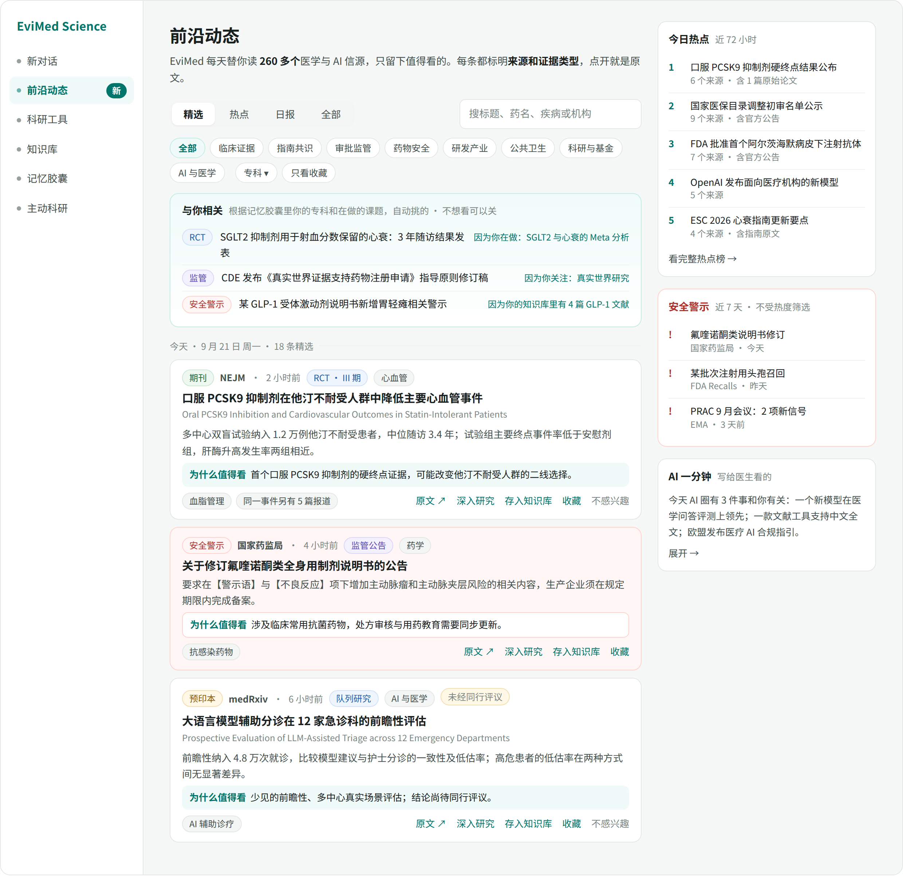

## 4.2 精选视图

从上到下：

1. **标题和一句话定义**：「EviMed 每天替你读 N 个医学与 AI 信源，只留下值得看的。每条都标明来源和证据类型，点开就是原文。」
2. **视图切换 + 搜索框**。搜索走服务端，搜标题、药名、疾病、机构；搜索时范围自动扩大到「全部」，并在结果里标出哪些是精选。
3. **筛选行**：八个栏目（单选）、专科（下拉，约 20 个）、只看收藏。栏目名都是读者的词，不是实现的词。
4. **与你相关**（4.6）：最多 5 条，每条后面写明为什么排给你。
5. **按天分组的卡片流**：今天、昨天、更早，每组头部写当天条数。
6. **右侧栏**（宽屏才有，窄屏折到列表下方）：今日热点前 5、安全警示（近 7 天）、AI 一分钟。

## 4.3 一张卡片

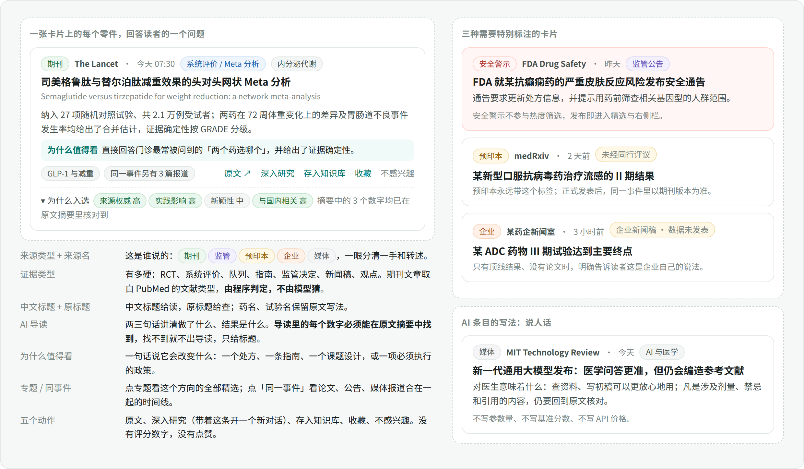

卡片上的每个零件回答读者一个问题：**谁说的**（来源类型加来源名）、**有多硬**（证据类型）、**说了什么**（中文标题、原标题、两三句导读）、**关我什么事**（为什么值得看）、**还有谁在说**（同一事件的其他报道）、**我能拿它做什么**（五个动作）。

三种卡片必须特别标注，这是医学版与 AI 版最大的不同：

- **安全警示**：红色底，不参与热度和分数筛选，监管机构发布即进精选和右侧栏。
- **预印本**：永远带「未经同行评议」；同一研究正式发表后，事件里以期刊版本为准。
- **企业新闻稿**：只有顶线结果、没有论文时，标「企业新闻稿 · 数据未发表」。

卡片上**没有**：评分数字、点赞、评论、阅读量。折叠区「为什么入选」里给四个维度的高、中、低和数字复核的结果，想知道的人点开看。

## 4.4 热点与事件页

热点视图是近 72 小时的 Top 10 事件。每行：名次、事件标题、一句报道摘要、「N 个来源报道 · 含原始论文」或「含官方公告」、最近更新时间。不显示热度数值。

点进去是事件页：

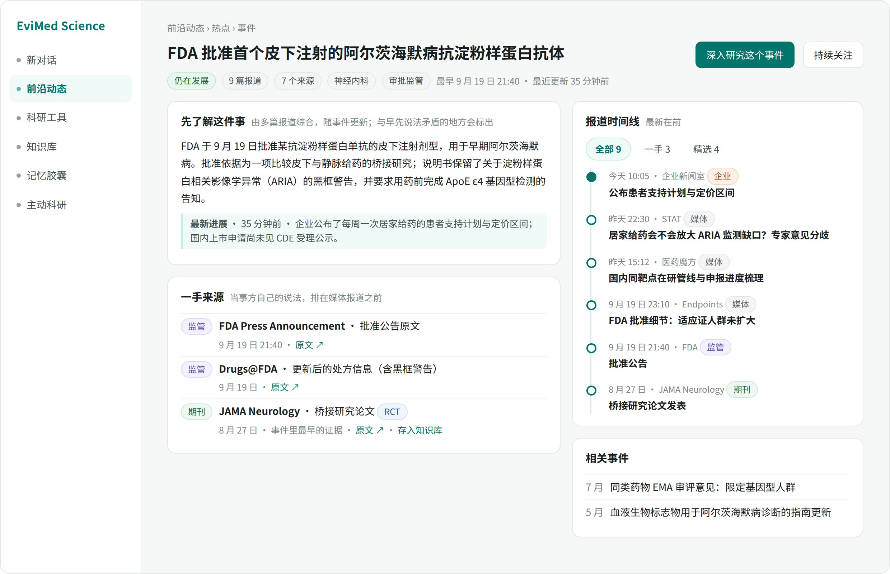

- **先了解这件事**：多篇报道综合出的事实说明，随事件更新；与早先说法矛盾的地方明确标出。
- **最新进展**：一句话，带时间。
- **一手来源**：当事方自己的文本——论文、监管公告、说明书、指南原文——排在所有媒体报道之前。医学里「一手」的含义比 AI 圈更严格，这是事件页最有价值的一块。
- **报道时间线**：可按全部、一手、精选过滤，每条带来源类型标签。
- **状态**：仍在发展，或已收束（72 小时无新报道）。
- 两个动作：**深入研究这个事件**（带着整个事件的一手来源开对话）、**持续关注**（第三阶段，生成一个主动科研议程）。

## 4.5 日报与周报

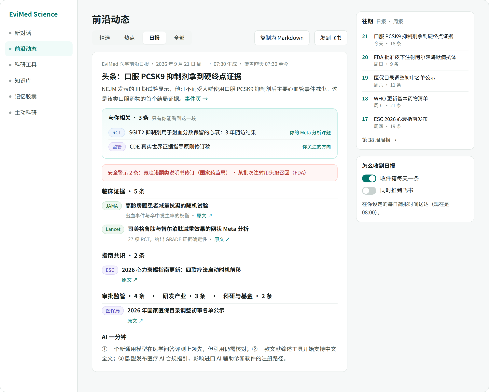

每天北京时间 07:30 定稿，覆盖前一天 07:30 至当时。结构固定：头条一条（带事件页链接）、**与你相关**（只有本人可见，读的时候现算，不写进公共日报）、**安全警示**、按栏目分段、**AI 一分钟**。右侧是往期列表和送达设置。「复制为 Markdown」可以直接贴到科室群或周会材料里。

周报每周一出，是七天日报的再编辑，第三阶段做。月报不做。

## 4.6 与你相关：零设置的个性化

平台已经通过记忆胶囊知道用户的专科、研究方向、在做的课题、知识库里有哪些主题。「与你相关」直接读这些：

- 精选页顶部一块，最多 5 条；日报里一段。
- **每条后面必须写明为什么排给你**：「因为你在做：SGLT2 与心衰的 Meta 分析」「因为你的知识库里有 4 篇 GLP-1 文献」。理由指向的是记忆胶囊里真实存在的一条记忆，点得开。
- 它可以捞出**全站精选没选中**的条目：一篇小众的中医药 RCT 对全站不够格，对做这个方向的人是头条。
- 用户的显式动作只有两个，都是一次点击、随时可撤：卡片上的「不感兴趣」（降低同类），专题和专科上的「关注」。没有设置页。
- 记忆功能关闭、或新用户还没有任何记忆时，这一块整个不出现，其余照常。不放空壳，不催用户去填资料。

## 4.7 五个动作及其去向

| 动作 | 发生什么 |
|---|---|
| 原文 ↗ | 新标签页打开来源页面。期刊文章有开放获取版本时，旁边多一个「免费全文」 |
| 深入研究 | 弹出三个预设问法（这项研究可靠吗、对我的课题意味着什么、围绕这个问题做一份证据综合）加「自己写问题」；选中后跳到新对话，草稿已填好、条目的链接和摘要已附上，**由用户按发送** |
| 存入知识库 | 开放获取论文存 PDF，网页存快照，进当前项目的知识库，照常解析和索引；非开放获取的只存题录和链接，并如实告知 |
| 收藏 | 存服务端；筛选行「只看收藏」可找回 |
| 不感兴趣 | 这条从列表里收起，同专题同信源的内容对该用户降权；页面底部 toast 提供撤销 |

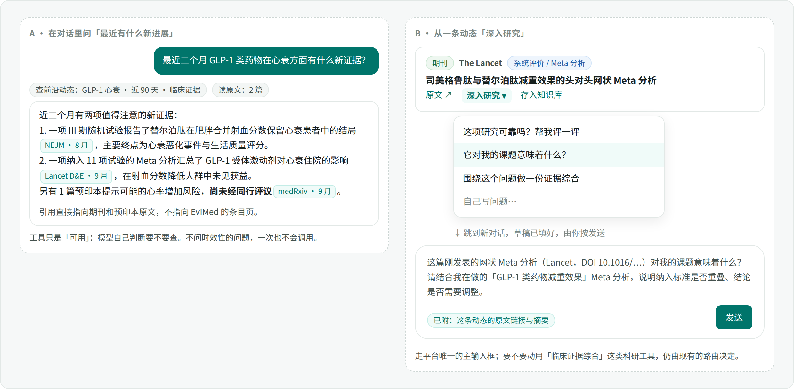

「深入研究」走平台唯一的主输入框，不在动态页里另放输入区；要不要动用「临床证据综合」这类科研工具，仍由现有的路由决定。

## 4.8 对话里怎么用

对话里的模型多一个只读工具 `frontier_search`。用户问「最近三个月 GLP-1 在心衰方面有什么新证据」，模型可以先查这个库拿到线索，再去读原文，回答里的引用**直接指向期刊和公告原文**，不指向 EviMed 的条目页。预印本在回答里同样要说明「尚未经同行评议」。

工具只是「可用」。模型自己判断要不要查；不涉及时效的问题，一次也不会调用。这是平台的既定原则：普通问题零工具作答，不强制任何调用顺序。

## 4.9 三个触达位置

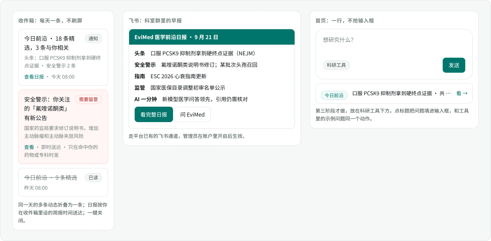

- **收件箱**：每天一条「今日前沿 · N 条精选，M 条与你相关」，在用户自己设的简报时间送达（默认 08:00）；同一天的更新折叠进这一条，不刷屏。命中用户关注的药物或专科的**安全警示**单独即时发一条（第三阶段）。一键关闭。
- **飞书**：走平台已有的飞书通道，管理员开启后，日报以卡片形式推到绑定的会话。
- **首页一行**（第三阶段）：在首页科研工具下方放一行「今日前沿：头条标题 · 共 N 条」，点标题把问题填进输入框——和科研工具里点示例问题是同一个动作。只有一行，不抢输入框。

## 4.10 信源公开页

页面底部折叠区「我们在读哪些信源」：按栏目列出全部信源、读取方式、最近一次读到的时间和状态（正常、暂时读不到）。AIHOT 不公开信源清单；对一个讲循证的产品，**公开信源本身就是可信度**。用户可以在这里「建议一个信源」，进反馈通道，由运营决定是否加进登记表。

## 4.11 四种状态

| 状态 | 页面表现 |
|---|---|
| 加载中 | 卡片骨架屏，和其他页面同一套 |
| 空 | 首次启用：「正在读第一批信源，大约 20 分钟后这里会有内容。」筛选无结果：「这个条件下暂时没有，换个栏目或时间范围。」 |
| 出错 | 「暂时读不到，下面是上次读到的内容（更新于 HH:MM）。」加重试按钮；单个信源失败不在这里打扰用户，只体现在信源公开页 |
| 模块关闭 | 导航里这一行不出现；直接访问地址时给一句说明 |

## 4.12 明确不做的交互

不做评论和点赞；不做「关注某个作者或账号」；不做开场兴趣问卷；不做浏览器推送和红点轰炸；不在动态页里放第二个输入框；不把条目页做成站内阅读器去转载全文——正文永远在原站。


---

# 5. 信源方案

完整清单在**附录 A**（按分组列出全部 753 个，含读法、梯队、出口和两地核查结果），同时提供 `sources.csv`（可在 Excel 里筛选）和 `sources.json`（程序用的登记表原件）。本章讲怎么定的数量、怎么分的层、哪些读得到、每组里最要紧的是谁。

## 5.1 数量怎么定：对照 AIHOT

AIHOT 自称 168 个信源，实测近 7 天活跃 211 个。它的结构是「少数高产信源加大量 X 账号」：IT 之家一家就占全量池的 18%，116 个 X 账号合计只出了 17 条精选。

医学不一样，三点决定了我们的数量和结构：

1. **权威信源本身就是结构化的。** 期刊有 DOI 登记，监管机构有公告栏，循证机构有订阅源。不需要靠盯人来发现新闻。
2. **长尾交给查询，不交给信源数量。** 医学期刊有上万种，不可能一种一种加。我们用 155 种必看期刊加十几条 PubMed 查询流（例如「核心临床期刊里新发表的 RCT」「新的实践指南」「药物警戒与不良反应信号」「中医药 RCT 与系统评价」）覆盖长尾：一条查询顶几百种期刊。
3. **中文医学信息的主场在公众号和没有订阅源的网站上。** 这部分读取成本高，按价值分批上，不追求一次到位。

**裁决：登记表 753 个，首发 267 个，第二阶段到 513 个，第三阶段按需补到全量。** 首发规模略大于 AIHOT 实测的活跃信源数（211），但其中 154 个是走同一接口的期刊，需要单独维护读取配置的只有 113 个；结构也完全不同（图 9）：

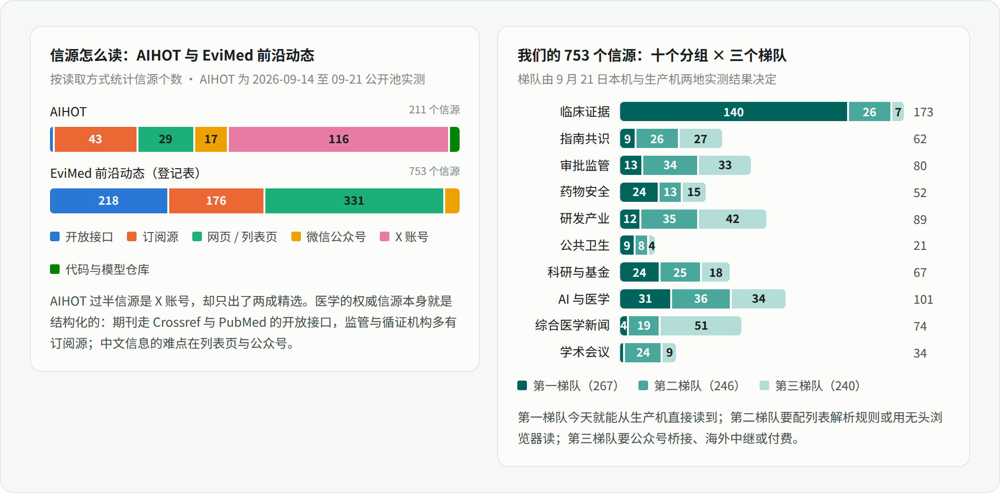

| 读法 | 登记表 | 其中第一梯队 | 说明 |
|---|---|---|---|
| Crossref + PubMed | 155 | 154 | 155 种期刊，一个适配器 |
| 开放接口 | 56 | 36 | PubMed 查询流、Europe PMC、ClinicalTrials.gov、openFDA、Federal Register、WHO、medRxiv、arXiv、MedHELM 等 |
| 订阅源 | 176 | 69 | RSS 与 Atom，通用解析 |
| 列表页 | 325 | 8 | 每个信源配一组选择器；含要用无头浏览器读的 |
| 公众号 | 28 | 0 | 第三阶段经桥接服务 |
| 需登录 | 3 | 0 | 暂不读 |
| 付费接口 | 7 | 0 | 暂不读 |
| 仅邮件 | 3 | 0 | 暂不读 |

再往上加信源，边际价值很低；往后该加的不是数量，而是查询流和专题。

## 5.2 十个分组、三个梯队

| 分组 | 合计 | 第一梯队 | 第二梯队 | 第三梯队 |
|---|---|---|---|---|
| 临床证据：期刊、文献流、预印本 | 173 | 140 | 26 | 7 |
| 指南共识：循证机构与学会 | 62 | 9 | 26 | 27 |
| 审批监管：监管机构、医保与 HTA | 80 | 13 | 34 | 33 |
| 药物安全：安全通告、药物警戒、药学期刊 | 52 | 24 | 13 | 15 |
| 研发产业：产业媒体、药企、试验注册 | 89 | 12 | 35 | 42 |
| 公共卫生 | 21 | 9 | 8 | 4 |
| 科研与基金：方法学、诚信、基金、科学媒体 | 67 | 24 | 25 | 18 |
| AI 与医学 | 101 | 31 | 36 | 34 |
| 综合医学新闻（中英文） | 74 | 4 | 19 | 51 |
| 学术会议 | 34 | 1 | 24 | 9 |
| **合计** | **753** | **267** | **246** | **240** |

登记表里有 3 行是补摘要、查开放获取状态用的工具接口（PubMed esummary、Europe PMC 按 DOI 取摘要、Unpaywall），不产生条目，也计在内。

梯队不是拍的，是 9 月 21 日**从本机（境外网络）和生产机（北京腾讯云）各读一遍**之后按规则定的：

| 梯队 | 条件 | 什么时候上 |
|---|---|---|
| 第一梯队 | 生产机直连读得到；是订阅源或开放接口，或者是不设防、结构干净的列表页；价值明确 | 第一阶段 |
| 第二梯队 | 生产机读得到但要为它写列表解析规则；或者带脚本质询、要用无头浏览器读 | 第二阶段 |
| 第三梯队 | 只在公众号发布；生产机连不上或被按 IP 拒绝、要经东京代理读；需登录或付费；或价值排后 | 海外那一批随境外主机到位、公众号那一批随 Wechat2RSS 到位，都提到第二阶段；其余第三阶段按需 |

## 5.3 四条关键裁决

**裁决一：期刊一律走 Crossref 加 PubMed，不爬出版商网站。** 从生产机实测，NEJM、柳叶刀、Cell、Science、Wiley、牛津、AHA、ASCO、LWW 的站点全部对机房 IP 返回 Cloudflare 403，逐个去找出版商订阅源是死路。而 Crossref 和 PubMed 的开放接口两地都通。我们把 155 种期刊逐一解析出 ISSN 并量了新鲜度：Crossref 近 7 天登记 1,796 篇，PubMed 同期入库 1,860 篇，两者吻合；NEJM 最新一批文章的 Crossref 登记时间就是发表当天。分工是：**Crossref 负责发现**（当天可见，一个适配器管 155 种期刊），**PubMed 和 Europe PMC 负责补摘要和文献类型**（155 种期刊里 Crossref 自带摘要的只有 55 种）。附带的好处：只拿题录和摘要，正文永远在原站，没有转载问题。

**裁决二：FDA 走 openFDA 和 Federal Register，官网栏目从北京直接读。** `api.fda.gov` 和 `federalregister.gov` 的接口畅通，审批、召回、短缺、法规文件都有对应的数据集。FDA 官网原先测得「把生产机 IP 判为滥用来源」；9 月 22 日复查发现，它拒绝的是**冒充浏览器**的请求——探测工具当时发的是 Chrome 的标识，被跳到 abuse-detection 页。换成平台如实的爬虫标识 `EviMedBot`，从北京就能读新闻稿、药物安全通讯、MedWatch、召回等全部 14 个栏目。所以这些栏目改为北京直连，安全类条目照样走安全直通。同一次复查还让 CDC 健康警报、加拿大健康产品通讯、Medscape 等，一共 33 个原先走海外或读不到的信源改为北京直连。**从此探测和采集一律用同一个如实的标识，不冒充浏览器。**

**裁决三：国内监管站点用我们自己的无头浏览器读。** 国家药监局、药审中心、器审中心、卫健委用的是瑞数动态防护，普通请求无论从哪里发都只拿到一段脚本（412 或 202）。对国内用户，这几个站是最不能缺的信源。瑞数只认「有没有一个真浏览器把它的脚本跑完」。9 月 22 日在北京生产机上实测：一个普通的 Chromium 容器（就是运行时镜像里那一版）打开这四个站的 7 个栏目，全部拿到完整列表，每页 1–5 秒，7 页连同浏览器启动共 22 秒；开发机上的结果相同。所以不用按时长计费的云端浏览器：北京主机上起一个自己的无头浏览器容器，只在渲染时占内存，没有额外费用；AgentBay 只作后备，等瑞数哪天开始识别无头浏览器再切过去。国家药典委员会不设防，普通请求就能读。在这条路上线之前，有两个不设防的替代口先顶上：**中国政府网政策库**（卫健、医保、药监的上位文件当天可见）和**广东省药监局的转载栏**。RSSHub 有国家药监局的路由，但公共实例都不可用，不采用。

**裁决四：首发不依赖公众号和 X；公众号第二阶段上，X 不监测。** 公众号没有官方订阅方式，而公众号后台「选择其他公众号」的文章列表 7 月 30 日已被微信关闭，靠它的桥接（例如 we-mp-rss）随之失效；业主选定 Wechat2RSS 私有部署（每年 150 元，经微信读书取列表），第二阶段上 100 个号，设计和试跑见第 11 章。X 从生产机不可达，接口要付费，而 AIHOT 的数据已经说明 X 账号的精选产出很低；医学圈值得看的个人（例如 Eric Topol）大多另有博客或 Substack，经东京代理读订阅源即可。X 的接口在 2026 年已改为纯按量计费（每读一条 0.005 美元），没有面向商业读取的免费额度。

另有一条小裁决：**OpenAlex 从 2026 年起匿名额度极小，必须申请免费密钥**；它只是「学术关注度信号」里的一个可选项，首发不用。

## 5.4 出口：从哪里读

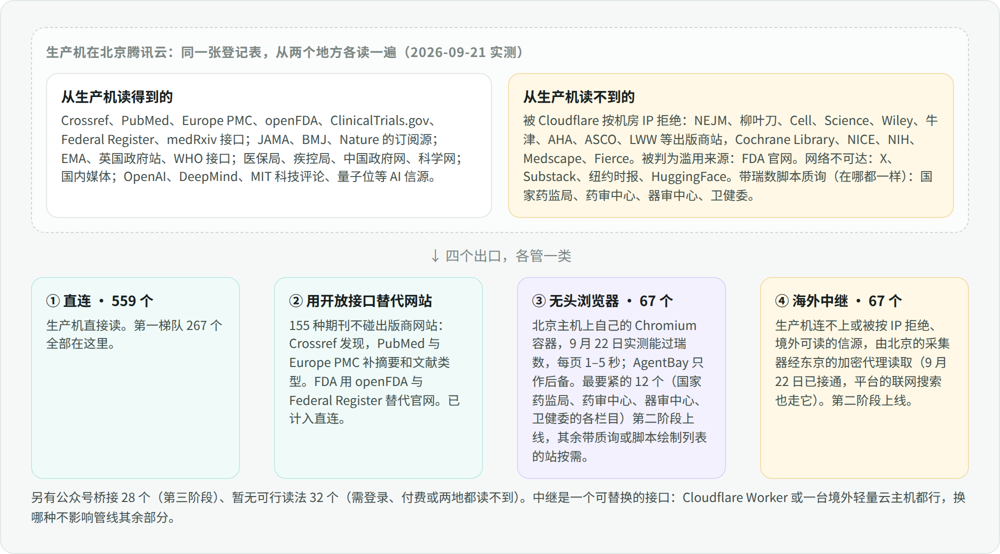

| 出口 | 信源数 | 第一梯队 | 第二梯队 | 第三梯队 |
|---|---|---|---|---|
| 直连（含用开放接口替代网站） | 559 | 267 | 234 | 58 |
| 无头浏览器 | 67 | 0 | 12 | 55 |
| 海外中继 | 67 | 0 | 0 | 67 |
| 公众号桥接 | 28 | 0 | 0 | 28 |
| 暂无可行读法 | 32 | 0 | 0 | 32 |

两地核查的结果并不对称：**境外读不到、生产机读得到**的只有 5 个（医师报、澎湃、上海阳光医药采购网这类国内站点对境外 IP 的限制，外加本机 IP 的 OpenAlex 匿名额度当天已用尽）；**生产机读不到、境外读得到**的有 70 个，是 Cloudflare、Akamai 对机房 IP 的拒绝和网络不可达——FDA 官网的全部栏目、NICE、Fierce 系、BBC、卫报、梅奥、Substack 上的专栏都在里面。所以信源核查必须在爬虫真正运行的那台机器上做——登记表里每个信源都记着两地各自的结果，`tools/probe_registry.py` 可以随时重跑。

「海外」这一路由东京的一台云主机承担（Vultr，9 月 22 日验收）。它是一条**加密代理出口**，不跑任何采集代码：北京的采集器照常抓取、解析、归一，只有出口为「海外」的那几十个信源经它发出请求。HTTPS 请求走 CONNECT 隧道，加密从北京一直到原站，这台机器看不到也改不了内容；它只接受北京主机的地址、要密码、不许访问内网，上面不放数据库、不放模型密钥、没有用户数据。这条代理 9 月 22 日已为平台的联网搜索和三个北京连不上的数据库接通（`apps/server/src/edgeProxy.mjs`），前沿动态直接复用。原先设想的 Cloudflare Worker 核对后放弃：它发出的每个请求都带可被目标站一条规则整体拒绝的标识头，使用条款也不允许拿它做代理类服务；更早一版设计的「境外采集节点」（在东京跑一份采集代码、签名推回批次）也因为有了这条代理而不再需要。验收与实测见 10.2.5。表里的出口名沿用「海外中继」，指的就是这条代理。

## 5.5 各组里最要紧的信源

每组先说第一梯队（首发就读）有谁，再说后面两个梯队卡在哪。

**一、临床证据（173 个，第一梯队 140）。** 155 种期刊走同一个接口，近 7 天合计约 1,800 篇：综合与基础顶刊 40 种（NEJM 每周约 23–31 篇、柳叶刀 27、JAMA 36、BMJ 57、Nature Medicine 15–23，以及 CMJ、STTT、Cell Research 等国内主办的英文刊）；专科顶刊 57 种，每个专科取一到三种真正改变实践的；中医药英文刊 14 种（Journal of Ethnopharmacology、Phytomedicine、Chinese Medicine、CJIM、JIM 等）。长尾交给 **13 条 PubMed 查询流**，每条都量过周产量：核心临床期刊里的 RCT 3 篇（精度极高）、核心循证期刊的系统评价 13 篇、实践指南与共识 54 篇、网状 Meta 分析 62、孟德尔随机化 88、药物警戒与不成比例分析 65、超说明书用药 30、药物相互作用 31、药物性肝损伤 25、药物经济学与 HTA 68、中医药 RCT 与系统评价 19、中国机构发在五大顶刊的 13、撤稿与关注声明 23；另有 4 条产量偏大的（真实世界证据 203、GRADE 154、大模型临床评测 163、医学文献计量 69）放第二梯队，等精选规则稳定后再开。预印本取 medRxiv 八个学科（每周共约 185 篇）加 Europe PMC 里「预印本中的 RCT」（每周 19 篇），都带「未经同行评议」标签。中文期刊没有 Crossref 登记，要走各刊网站：中国药学杂志、中国现代应用药学有可用的订阅源（玛格泰克平台的 `/CN/rss_first_<ISSN>.xml` 这类通用路径），进第一梯队；中国全科医学的两个订阅源都能读、都有条目，但干跑时发现内容停在 2021–2022 年，改读网站列表页，降到第二梯队；中华医学杂志、中华内科杂志、中国循证医学杂志、中国中药杂志、中草药等十四种是各刊网站的列表页，第二梯队；中华医学期刊网是脚本绘制的，中医杂志只有知网入口，放第三梯队。

**二、指南共识（62 个，第一梯队 9）。** 第一梯队：Cochrane 新闻与「证据摘要」两个订阅源（新系统评价本身已由 CDSR 期刊接口覆盖，每周 13 篇）、WHO 的出版物与新闻两个 OData 接口（它的新闻订阅源 2026 年 2 月后停更）、GIN、AHA 新闻室、GOLD，以及两个读页面脚本才发现的开放接口——**国际实践指南注册平台 PREPARE**（8,603 条注册记录，最新在前；接口会带出联系人邮箱和电话，入库前要滤掉）和 **STAR 指南评级**（6,047 部已评级指南，只接受 POST）。第二梯队是二十多个只有列表页的学会：USPSTF、SIGN、ACC、ESC、ADA、IDSA、KDIGO、AASLD、EULAR、AAN、AAP、SCCM、ESICM、NCCN 版本列表，以及梅斯指南、CSCO、中华医学会、中国医师协会。第三梯队：NICE 三个列表从生产机被拒（403），GINA、AGA、ACG 同样，进中继批；EASD、ESMO 指南页两地都被质询；医脉通指南要登录；NEJM Journal Watch（已改名 NEJM Clinician）、UpToDate、DynaMed、BMJ Best Practice 是付费内容，登记但不读；ECRI 指南库正在迁移、暂时下线。PubMed 的「实践指南与共识」查询流是各学会列表页上线之前的兜底。

**三、审批监管（80 个，第一梯队 13）。** 第一梯队：EMA 四个订阅源（全站更新、新闻、新药与 CHMP 意见、科学指南）、英国 MHRA 的 Atom、ECDC 两个订阅源、美国 CDC 新闻、openFDA 的 Drugs@FDA 审批接口；国内是**医保局三个栏目**（通知公告含目录调整与集采、征求意见、政策解读）和**中国政府网政策库**。第二梯队里最要紧的是走无头浏览器的八个：国家药监局的公告通告、法规文件、创新药械专题，药审中心的指导原则、突破性治疗公示、上市药品信息，器审中心指导原则，卫健委政策文件与诊疗规范；其余是干净的列表页：疾控局、中国疾控中心、中医药管理局、不良反应监测中心、WHO 新闻与出版物页、ICH、PMDA 英文站、ICER、IQWiG、SMC。第三梯队：FDA 官网的八个栏目（新闻稿、药品动态、新分子实体批准、指导原则、顾问委员会日程、AI 医疗器械清单等）和 CMS、加拿大卫生部、TGA、台湾食药署从生产机读不到，进中继批；NIH 新闻两地都被 Cloudflare 挡；NICE 技术评估、CDA-AMC、法国 HAS、卫健委药政司被质询。上海阳光医药采购网正相反：境外 403，生产机可读。

**四、药物安全（52 个，第一梯队 24）。** 第一梯队：openFDA 的三个接口——召回、不良事件、**药品短缺**（FDA 没有短缺订阅源，只有这个接口）；英国 MHRA 的药物安全通报与警示召回；EMA PRAC 安全信号建议；日本 PMDA 安全对策更新（一个没写进文档的分栏订阅源）；**国家药品不良反应监测中心的安全警示和《药物警戒快讯》**；再加 15 种药学与药物安全期刊。第二梯队：国家药监局的「药品说明书修订公告」和「其他公告通告」（含不良反应信息通报）走无头浏览器——对国内药师这两条最要紧；DailyMed 说明书更新、EMA 致医务人员公开信与短缺、新西兰 Medsafe、新加坡 HSA、瑞士 Swissmedic、PMDA 注意事项修订、WHO 医疗产品警报、**广东省药学会**（超说明书用药目录与专家共识的发布地）是列表页。第三梯队：FDA 官网的 MedWatch、药物安全通讯、召回、FAERS（已更名 AEMS）季度信号页，以及加拿大、澳大利亚 TGA 的安全警示，从生产机读不到，进中继批。中继上线前，FDA 的安全信息由 openFDA 的召回与不良事件接口顶着，新闻稿式的安全通讯会缺。

**五、研发产业（89 个，第一梯队 12）。** 第一梯队：STAT（总站加 Pharmalot、Biotech 两个频道）、Endpoints、BioPharma Dive、ApexOnco、药时代，以及 **ClinicalTrials.gov 的五条查询**（新登记的 III 期、首次公布结果、中国中心的干预性试验、中医药干预、终止或暂停的 III 期，每周共约 220 条）——这是「研发产业」栏最硬的一手来源。第二梯队：医药魔方、米内、动脉网、界面医药、医药网、钛媒体、财新健康等中文列表页和订阅源；药智新闻要渲染；三十多家药企新闻室（阿斯利康是唯一有完整公开订阅源的跨国药企，其余多是列表页，PR Newswire 健康类和 GlobeNewswire 临床研究主题流可以兜底）。第三梯队：Fierce Pharma 与 Fierce Biotech、BioSpace、PharmaTimes、GEN、In the Pipeline、Drugs.com 从生产机被拒，进中继批；同写意、新浪医药两地都读不到，医药经济报有质询，赛柏蓝只有公众号；欧盟 CTIS 的检索接口只接受 POST，ChiCTR 和药物临床试验登记平台读不到。

**六、公共卫生（21 个，第一梯队 9）。** WHO 疾病暴发新闻（OData）、CDC 的 MMWR、Emerging Infectious Diseases、ECDC 流行病学更新、CIDRAP、UKHSA、香港卫生防护中心、China CDC Weekly、Our World in Data。第二梯队：国家疾控局疫情信息（条目藏在页面里的一段 JSON，不用浏览器也能解析）、中国疾控中心要闻、Eurosurveillance、Africa CDC、IHME、Gavi、CEPI。CDC 健康警报网络的订阅源 2020 年后就没更新过，ProMED 的订阅源 2023 年起关闭。

**七、科研与基金（67 个，第一梯队 24）。** 第一梯队：Retraction Watch、Crossref 撤稿接口（每周约 1,200 条，要按期刊白名单过滤）、Frank Harrell 与 Andrew Gelman 的统计博客、UKRI 两个订阅源、PubMed Trending，11 种方法学与循证期刊，以及**科学网的三个订阅源**（论文频道的医药健康与生命科学带「小柯机器人」写的顶刊中文摘要，外加首页要闻）和环球科学。第二梯队里对国内研究者价值最高的是基金委的项目指南与通知公告、科技部通知通告、国家科技管理信息系统——都是列表页，第二阶段优先配；还有 EQUATOR、datamethods、ERC、Nature 新闻、知识分子、果壳、中国科学报。第三梯队：NIH 基金指南与 NIH 新闻两地都被 Cloudflare 挡住；Science 新闻进中继批；中科院《国际期刊预警名单》和科研诚信网的案件通报当天两地都读不到（后者证书过期），登记待复查；基金委的科研不端处理决定在生产机上可读，归第二梯队；OpenAlex 要密钥，Altmetric 已关闭免费层。

**八、AI 与医学（101 个，第一梯队 31）。** 取舍见 5.6。第一梯队：17 种医学 AI 期刊；OpenAI 官方新闻（订阅源一次返回 1,210 条、738 KB，采集器要按日期开窗）、Google 的 The Keyword AI 频道与 DeepMind 博客；MIT 科技评论 AI 频道、The Decoder、One Useful Thing、量子位、雷峰网；Google 健康频道、STAT Health Tech、Endpoints AI 频道、HIT 专家网；PubMed 新功能通报；**MedHELM 的评测结果接口**（页面是个空壳，但它的配置脚本暴露了版本号和结果文件地址）。第二梯队：Anthropic 没有官方订阅源，用社区镜像或列表页；DeepSeek、通义的官方动态目前靠第三方 RSSHub 实例转发，稳定性一般；Kimi、智谱、Seed、混元、MiniMax、The Verge AI、TechCrunch AI、WIRED、Ars Technica、IEEE Spectrum、极客公园、IT 之家，以及斯坦福 HAI 与 AIMI、哈佛 DBMI、Elicit、Consensus、Zotero 等。第三梯队：Google Research、微软官方博客、Mistral、Import AI、Eric Topol 的 Ground Truths（Substack）、OpenEvidence 公告从生产机读不到，进中继批；xAI、Perplexity、Healthcare IT News、MobiHealthNews、Rock Health 两地都被质询；机器之心网站是空壳，只能走公众号。Google 系站点从生产机时通时不通（单次 20–30 秒），即使列在第一梯队也要容忍偶发超时。

**九、综合医学新闻（74 个，第一梯队 4）。** 第一梯队只有 MedPage Today、Medical Xpress、ScienceDaily、KFF Health News。BBC 健康、卫报医学研究、The Conversation、梅奥新闻、2 Minute Medicine、CancerNetwork、Fierce Healthcare 从生产机读不到，进中继批；Medscape、Healio、TCTMD、OncLive、美联社健康两地都被拦。中文侧没有一家第一梯队：丁香园（资讯与文献频道）、梅斯、医学界、壹生、健康报、中国医药报、中国中医药报、国际循环、生物谷是第二梯队的列表页；医师报、澎湃健康境外读不到、生产机可读；健康界、好医生有脚本质询；医脉通需登录。**只在公众号发布**的 26 个账号（丁香园矩阵、医学界、梅斯、医脉通、药明康德系的学术经纬与医药观澜、八点健闻、赛柏蓝、医药魔方、BioArt、iNature、解螺旋、协和八、国家医保局、健康中国等）登记在第三梯队。

**十、学术会议（34 个）。** 国内外主要学术会议的官方页面：ASCO、ESMO、AACR、ASH、SABCS、WCLC，AHA、ACC、ESC、TCT，ADA、EASD，AAN、AAIC，IDWeek、CROI、ESCMID，ATS、ERS，DDW、UEG、EASL、AASLD，ASN，ACR、EULAR，RSNA，ISPOR、DIA、ISoP、ICPE、Cochrane Colloquium，以及 CSCO、长城会、CSC、中国药学大会、世界中医药大会。会期新闻进「临床证据」和「研发产业」栏，会议日期将来做日历用。只有 ASN Kidney Week 有订阅源，其余都是列表页，放第二、三梯队。


## 5.6 AI 这一栏：保留什么，去掉什么

用户想了解 AI，但他们是医生和研究者，不是工程师。取舍标准只有一条：**这条消息会不会改变一个医生或研究者用 AI 的方式，或者他们所在行业被 AI 改变的方式。**

| 保留 | 去掉 |
|---|---|
| 大厂的重要发布：OpenAI、Anthropic、Google、微软、Meta、DeepSeek、通义、Kimi、智谱、豆包、混元、MiniMax 的官方新闻 | GitHub 发布与 Trending、HuggingFace 模型上新与每日论文 |
| 非技术向的媒体与解读：MIT 科技评论、The Decoder、The Verge AI、TechCrunch AI、Ethan Mollick 的 One Useful Thing、量子位、雷峰网等 | 开发工具更新日志（Claude Code、Cursor、Codex）、API 价格与额度、Tibo 重置 |
| 医学 AI：Google 健康、Eric Topol 的 Ground Truths、STAT Health Tech、Endpoints AI 频道、FDA 的 AI 医疗器械清单、HIT 专家网、动脉网；AI 制药公司新闻 | 工程师与研究员的 X 账号、Hacker News、智能体框架与 MCP、芯片与算力 |
| 医学 AI 期刊：NEJM AI、柳叶刀数字健康、npj Digital Medicine 等 17 种 | arXiv 的机器学习全量流（只留「医学相关」的三条查询） |
| 科研可用的 AI 工具：Elicit、Consensus、OpenEvidence、NotebookLM、Zotero、Paperpal 以及 PubMed 自己的功能通报 | 通用模型榜、基准分数的逐项报道 |
| 医学大模型评测：MedHELM（有机器可读接口）、Open Medical-LLM Leaderboard、MedBench | —— |

写法上，AI 条目的导读固定回答「对医生或研究者意味着什么」，不写参数量、不写基准分数、不写接口价格。每天在日报和右侧栏合成一段「AI 一分钟」。

AIHOT 自己的四个订阅源也实测可读，但它的使用条款要求对外商业产品先取得书面授权，所以**登记在第三梯队、默认不启用**，只用来事后比对我们的 AI 栏目有没有漏掉大事。

## 5.7 信源怎么运营

- **登记表是数据。** 增、删、调节奏、换出口，改一行数据，走正常的代码评审，不改程序。
- **健康度自动记。** 每个信源记最近一次成功时间、连续失败次数、近 7 天条数。连续失败 3 天标为「暂时读不到」，进就绪检查和信源公开页；近 30 天零产出的，月度清理时提示下线。
- **三个调表信号。** 某信源的条目长期过不了初筛（噪声源，降频或下线）；某信源被用户大量点「不感兴趣」；用户在信源公开页提的建议。
- **复查工具留在仓库里。** `tools/verify_feed.py`（单个地址探测，能识别 Cloudflare、瑞数、阿里云与火山引擎的质询页和空壳页）、`tools/probe_registry.py`（整表两地探测，可续跑）、`tools/resolve_journals.py`（期刊 ISSN 解析与新鲜度测量）、`tools/classify_registry.py`（定出口和梯队、生成附录）。上线后其中的探测逻辑就是信源健康检查的原型。


---

# 6. 设计方案：从信源到读者

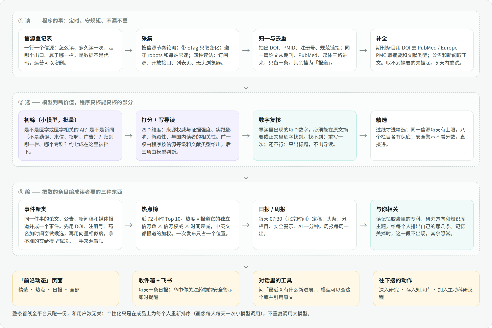

整条管线分三段：**读**是程序的事，**选**由模型判断、程序复核，**编**把散条目编成事件、热点和日报。分工遵守平台的第一条开发原则：确定性的东西（去重、文献类型、数字核对、限速、计数）交给代码，语言判断（值不值得看、属于哪个专科、怎么用中文讲清楚）交给模型，两边都不越界。

内容全平台只跑一份，和用户数无关。个性化只在成品上为每个人重新排序，不为每个人重新写内容；唯一按人计的是每个活跃用户每天一次的画像提取（小模型，约 0.3 分钱，10.5.3）。

## 6.1 读

**信源登记表。** 一个数据文件，一行一个信源：名称、栏目、读法、地址、节奏、出口、梯队、来源类型、权威等级。它是数据不是代码——和 `clinical-safety-rules.json` 让药师能改用药安全规则是同一个道理，运营加一个信源不用动程序。

**九种读法**（信源再多，要写的适配器就这九个）：

| 读法 | 覆盖 | 说明 |
|---|---|---|
| `crossref-issn` | 全部 155 种国际期刊 | 按 ISSN 取最近登记的 DOI，当天可见 |
| `eutils-query` | PubMed 查询流与期刊补摘要 | 查询式、按入库日期滚动 |
| `europepmc` | 预印本与补摘要 | PubMed 还没收录时的第二路 |
| `json-api` | openFDA、ClinicalTrials.gov、Federal Register、WHO OData、medRxiv、arXiv、MedHELM 等 | 每个一段字段映射，读法相同 |
| `rss` / `atom` | 监管、循证机构、媒体、AI 厂商的订阅源 | 通用解析 |
| `html-list` | 没有订阅源的列表页（国内政府站、学会、中文媒体） | 每个信源配一组选择器：条目、标题、链接、日期 |
| `browser-list` | 带瑞数或脚本质询的站（药监局、卫健委、药审中心、器审中心） | 自有无头浏览器渲染后，按 `html-list` 的选择器解析 |
| `relay` | 从生产机连不上或被按 IP 拒绝的境外站 | 同一套读法，北京的采集器经东京的加密代理发请求（10.2.5） |
| `wechat-bridge` | 公众号（第 11 章的 100 个号） | 第二阶段，经北京主机上的 Wechat2RSS 容器转成订阅源；全文另从北京读文章页 |

**守规矩。** 复用平台读网页的那一套受保护传输：每一跳核对 DNS 并钉住地址、拒绝内网地址、每站限速（默认每秒至多 1 次，站点声明了 crawl-delay 就按它的）、响应大小封顶、爬虫标识写明是谁和怎么联系。带 ETag 和 Last-Modified 做条件请求，没变化就不取。**robots 管的是网页，不是接口**：列表页和网站上的订阅源先查 robots；Crossref、E-utilities、openFDA 这类开放接口按接口方公布的使用规则办——E-utilities 的 robots.txt 本身写着 `Disallow: /`，照 robots 办就一条 PubMed 也读不到，平台现有的接口通道也从不查 robots。公众号文章页同样是整站 `Disallow: /`，由业主授权、在登记表里逐个主机记一条例外（11.3）。

**节奏。** 每个信源自己的节奏：安全警示和监管公告 30 分钟，媒体和 AI 1 小时，期刊接口 3 小时，预印本和试验注册 6 小时，学会与会议页每天一次。连续失败按指数退避，失败 3 天标为「暂时读不到」，出现在信源公开页和就绪检查里，不打扰用户。

**归一与去重。** 从每条里抽出 DOI、PMID、试验注册号（NCT、ChiCTR）和规范化链接。同一篇论文会从期刊接口、PubMed 查询流、媒体报道三路进来：DOI 相同的只留一条作为**条目**，媒体那几篇挂到同一事件下作为**报道**。标题近似（归一化后三元组相似度 ≥ 0.85）且 7 天内的，也并。

**补全。** 期刊条目拿 DOI 去 PubMed 取摘要和**文献类型**（Randomized Controlled Trial、Meta-Analysis、Practice Guideline……），PubMed 还没收录就问 Europe PMC；都没有就先只有标题，挂起，5 天内每天重试一次。公告和新闻用平台现成的网页阅读器取正文。开放获取状态用平台现成的 DOI 解析。

**时间口径。** 照搬 AIHOT：发布后 72 小时内收录的按收录时间排，超过 72 小时才收录的归位到原发布日。

## 6.2 四套词表

都是封闭词表，存在登记表旁边的数据文件里，模型只能从中选，不能自造：

- **栏目（8）**：临床证据、指南共识、审批监管、药物安全、研发产业、公共卫生、科研与基金、AI 与医学。
- **来源类型（6）**：期刊、监管、循证机构与学会、预印本、企业、媒体。由登记表决定，不由模型判断。
- **证据类型（10）**：RCT、系统评价与 Meta 分析、队列与病例对照、真实世界研究、指南与共识、监管决定、安全通告、企业新闻稿、综述与观点、其他。期刊条目**由 PubMed 文献类型经代码映射**，其余由模型从词表里选。
- **专科（约 20）**：心血管、肿瘤、内分泌代谢、神经、精神、感染、呼吸、重症、消化与肝病、肾脏、风湿免疫、血液、儿科、妇产、老年、外科与麻醉、影像、药学、中医药、公共卫生、全科。
- 第三阶段再加**专题（约 30）**：GLP-1 与减重、ADC、细胞与基因治疗、阿尔茨海默病新药、抗菌药物耐药、中医药循证、真实世界研究、医保谈判与集采、罕见病、AI 辅助诊疗、大模型与科研写作……每个专题一行定义。

## 6.3 选：初筛、打分、写导读

**初筛**（小模型，20 条一批，关闭思考，JSON 输出）。回答四个问题：是不是医学或与医学相关的 AI；是不是「新闻」（勘误、读者来信、封面、招聘、广告、会议通知一律不是）；归哪个栏目、哪几个专科；语言。预计挡掉七成。

**打分**（同一个小模型，单条）。满分 100，四个维度：

| 维度 | 分值 | 谁来给 | 怎么给 |
|---|---|---|---|
| 来源权威与证据强度 | 30 | **代码** | 登记表里的信源权威等级 × 证据类型系数：指南、监管决定、RCT、系统评价最高，队列次之，预印本和新闻稿再次，观点最低 |
| 实践或科研影响 | 30 | 模型 | 会不会改变一个处方、一条指南、一个课题设计，或一项必须执行的政策 |
| 新颖性 | 20 | 模型 | 首次报告、重要更新，还是重复已知 |
| 与国内读者的相关性 | 20 | 模型 | 药物在国内已上市或在审、国内疾病负担、国内政策与指南、国内研究者常用的方法 |

模型同时输出：中文标题、两三句导读、「为什么值得看」一句、专科、实体（药物、试验、机构、疾病，供聚类用）。提示词只讲角色和原则，短而稳定；AI 栏目多一条原则——写给医生看，讲它意味着什么，不写参数量、基准分数和接口价格。

**数字复核**（代码）。导读里出现的每一个数字，必须能在送给模型的原文摘要或正文里逐字找到（归一化千分位、百分号、中英文数字写法后匹配）。找不到：带着具体哪个数字不对，让模型重写一次；还不行：这条**只出标题、不出导读**，并记一次失败。这是平台「模型判断、代码复核可复核的部分、复核不过就丢弃而不是放软」原则的直接应用，也是这个栏目在医学场景下站得住的底线。

**精选规则**（代码）。总分 ≥ 70 进精选；同一信源每天至多 3 条（NEJM、柳叶刀这类周刊出刊日放宽到 5 条）；八个栏目只要当天有 ≥ 60 分的条目就至少保 1 条；**安全通告不看分数，直接进**；目标每天 15–30 条。阈值是配置，上线后按实际分布调。

## 6.4 编：事件、热点、日报

**事件聚类。** 三步，从确定到不确定：

1. 代码：DOI、试验注册号相同的，直接并。
2. 向量：共享至少一个药物、试验或机构实体，且 7 天内，且标题加导读的向量余弦 ≥ 0.82 的，并。用平台已有的嵌入服务（知识库在用的那个模型），向量存在条目表里。
3. 模型：相似度落在 0.72–0.82 之间拿不准的，成对问一次「是不是同一件事」。

事件里**一手来源置顶**：论文、监管公告、说明书、指南原文。事件的「事实说明」由模型从成员条目综合，来了新的一手来源就重写，与旧版本矛盾的地方标出。72 小时无新报道，状态转为已收束。

**热度。** 事件热度 = Σ（报道它的每个独立信源的权威权重 × 时间衰减，半衰期 36 小时）；中英文信源都有报道的 ×1.3；含一手来源的 ×1.5。热点榜取近 72 小时热度前 10，要求至少 2 个独立信源（含监管一手来源的可以只有 1 个）。同一次发布的多条附属消息只占一个位置。界面上只显示名次和来源数，不显示热度数值。

**日报。** 每天北京时间 07:30 由稍大的模型定稿：从前 24 小时的精选与事件里选头条、按栏目排、写「AI 一分钟」。日切用显式的 `Asia/Shanghai` 时区计算——容器是 UTC，平台在这上面吃过亏。日报是固定成品，生成后不再变；「与你相关」那一段不写进去，读的时候现算。

## 6.5 与你相关

每个用户一份**兴趣画像**，由服务端从三处现算、缓存一天：记忆胶囊里的身份、背景知识、偏好类记忆（专科、研究方向、关注的药物）；当前项目的项目事实（在做什么课题）；知识库的资料主题。画像是一组专科标签加至多 10 条兴趣短语，每条短语都记着它来自哪一条记忆。

排序两步：先用专科和实体标签做粗筛（不花钱），再用平台已有的重排服务，以兴趣短语为查询、近 72 小时的条目为文档做精排，取前 5。命中的那条短语就是界面上「因为你在做……」的出处。

记忆是只读输入：这个模块不往记忆里写任何东西；用户点的「关注」和「不感兴趣」存在模块自己的表里。记忆服务不可用时返回「个性化暂不可用」，列表照常——平台原则：可选服务挂了，给状态，不装作命中。

## 6.6 数据模型

独立库表 `evimed_frontier`，与知识库索引 `evimed_kb` 同一做法：真实的列和索引，迁移内联在模块里、带咨询锁、幂等。高频大表不进 `documents` 账本。下表是主干；完整的 21 张表、建表语句、索引、保留策略与容量在 10.4，SQL 已实际执行验证。

| 表 | 内容 | 量级与保留 |
|---|---|---|
| `sources` | 登记表的运行态：开关、出口、上次轮询、ETag、连续失败数、近 7 天条数 | 数百行 |
| `entries` | 采集到的原始条目：信源、链接、DOI、PMID、注册号、原标题、原摘要、发布与收录时间、初筛结论 | 首发每天约 480 行、全量约 1,100 行；未入选的保留 30 天 |
| `items` | 过了初筛的条目：中文标题、导读、理由、栏目、证据类型、来源类型、专科、实体、四维分与总分、是否精选、是否安全通告、标记（预印本、新闻稿、无摘要）、数字复核结果、向量、所属事件、时间轴时间 | 每天约 300 行；长期保留 |
| `events` / `event_items` | 事件、事实说明、最新进展、状态、热度、成员与角色（一手、报道、背景） | 每天约 30 个 |
| `dailies` | 日报成品：头条、分栏、安全警示、AI 一分钟、Markdown | 每天 1 行 |
| `user_state` | 每个用户对条目的收藏、隐藏、已读 | 随使用增长 |
| `user_follows` | 关注与屏蔽：专题、专科、药物、信源 | 少量 |

检索照抄知识库的三条腿：`tsvector` 全文、三元组模糊、向量近邻，缺哪个扩展就跳过哪条腿。

后台任务不另造轮子，但也不淹没平台的任务账本：每天数千次的采集与处理，队列就放在本模块自己的表里（`sources` 的到期索引、`entries` 与 `items` 的状态与租约列，语义与 `ProductJobs` 相同）；任务账本只新增两个低频种类 `frontier-daily` 与 `frontier-rebuild`，记在一个不可登录的系统账户和它的内部项目名下（10.4.4）；模型花费同样记在这个账户，用途标为新增的 `frontier`，在用量报表里单独成行。

## 6.7 容量与花费

| 项 | 估计 |
|---|---|
| 每天采集到的原始条目 | 首发信源**实测每天 479 条**（期刊 241、开放接口 126、订阅源 112；10.1）；全量上线后估约 1,000–1,200 条 |
| 过初筛进入打分 | 首发约 150 条，全量约 300 条 |
| 每天精选 | 15–30 条，入选率约 2–3%，与 AIHOT 实测的 2.9% 同一量级 |
| 模型调用（全量） | 初筛约 50 批，打分约 300 次，聚类裁决与日报约 40 次 |
| 模型费用 | 全部用 deepseek-flash，不设第二个模型（与业主 9 月 18 日「全部用 flash」的决定一致）。按现行价目（未命中缓存每百万词元 2 元、输出 8 元）和干跑实测的文本量逐项重算：**首发每天约 1.4 元，全量约 2.8 元**，错峰后更低（10.3.11） |
| 嵌入与重排 | 每天不到 0.1 元 |
| 无头浏览器 | 12 个国内监管栏目，每天约 240 次页面、每页 1–5 秒，跑在北京主机自己的容器里，没有额外费用 |
| 对上游的请求量 | Crossref 约 1,300 次/天，NCBI 约 600 次/天，都远低于它们的礼貌上限 |

设每日预算上限（默认 10 元）。超了就停止打分、只采集，第二天恢复；不会影响任何用户的对话和运行额度。

## 6.8 上线后看哪几个数

| 指标 | 期望 |
|---|---|
| 信源健康率（近 24 小时读成功的比例） | ≥ 95% |
| 数字复核一次通过率 | ≥ 90%；最终无导读的比例 ≤ 3% |
| 每天精选条数与栏目分布 | 15–30 条，八个栏目都不长期为零 |
| 精选的点击率、「深入研究」与「存入知识库」的使用率 | 基线先跑两周再定目标 |
| 「不感兴趣」的集中度 | 某个信源或专题被大量点掉，就是登记表该调的信号 |
| 对话工具的三组对照（不挂工具、挂工具、挂了再关） | 「最近有什么进展」类问题的回答质量要有可见提升，才保留这个工具 |


---

# 7. 集成方案：落在 EviMed 的哪里

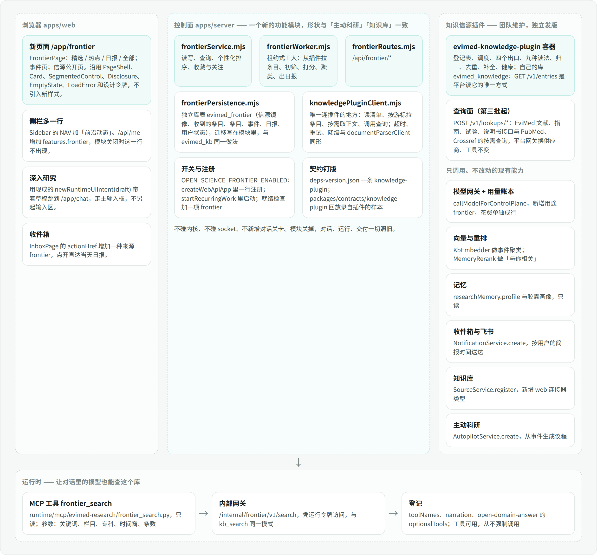

**一句话：一个控制面功能模块，加一个页面，加一个只读工具。** 不碰内核，不碰 socket，不新增任何对话关卡。模块关掉，对话、运行、交付一切照旧。

## 7.1 落在哪一层

| 层 | 动什么 | 不动什么 |
|---|---|---|
| 1 浏览器 | 新页面 `/app/frontier`；导航一行；收件箱多认一种来源 | 会话界面、内核界面 |
| 2 控制面 | 新模块 `frontier`：服务、工人、路由、库表、受保护抓取，形状与「主动科研」「知识库」一致；一个开关 `OPEN_SCIENCE_FRONTIER_ENABLED` | 鉴权、项目、运行账本、交付关卡 |
| 3 内部网关 | 新增一条 `/internal/frontier/v1/search`，凭运行令牌访问；对外抓取复用读网页那一套受保护传输 | 不绕过任何现有网关 |
| 4 领域包 | 信源登记表与四套词表（数据文件）；用量用途加 `frontier`；工具名与旁白各加一行 | 交付规则、契约 |
| 5–6 防腐层与 socket | **不动** | —— |
| 7 运行时镜像 | MCP 服务多一个只读工具 `frontier_search` | 预设、技能根 |
| 8 能力包 | `open-domain-answer` 的可选工具加一项；评测集加至少 3 个「最近有什么进展」类问题 | 十八个能力包的交付关卡 |
| 10 外部服务 | Crossref、NCBI、Europe PMC、openFDA 等都是匿名开放接口，无新凭据；第二阶段复用已上线的东京代理，并加北京主机上的无头浏览器与 Wechat2RSS 两个容器 | —— |

为什么不是能力包：能力包是「一次运行产出一份交付物」的单位，前沿动态是常驻的后台管线加一个页面，属于第 2 层功能模块——平台给这类东西规定的形状就是「服务 + 路由 + 租约工人 + 一个开关 + 自己的迁移」。以后要是做「围绕某个专题出一份前沿简报」这样的文件交付，那才是一个新的能力包，数据就从这个模块读。

## 7.2 新增与改动的文件

**新增（控制面 `apps/server/src/`）**

| 文件 | 职责 |
|---|---|
| `frontierPersistence.mjs` | `evimed_frontier` 的全部 DDL 与 `migrateFrontier(database)`；咨询锁、幂等、缺扩展就跳过对应索引 |
| `frontierService.mjs` | 查询（精选、全部、搜索、热点、事件、日报、信源）、个性化排序、收藏与关注、存入知识库的编排 |
| `frontierWorker.mjs` | 租约式工人，与 `AutopilotWorker` 同形：`start / tick / status / close`；三个循环：采集（领到期信源）、处理（领待处理条目）、编排（聚类、热点、日报、清理），队列在模块自己的表里（10.4.4） |
| `frontierFetch.mjs` | 组合 `webReadNetwork` 的钉扎传输、`RobotsPolicy`、`HostPacer`，返回 XML / JSON 原始字节；条件请求（平台读网页通道目前没有，这里新写）；每主机令牌桶；选择出口（直连、无头浏览器；海外那一路由边缘节点执行） |
| `frontierAdapters.mjs` | 九种读法，每种一个纯函数：原始响应 → 归一化条目 |
| `frontierEditor.mjs` | 初筛、打分、数字复核、聚类裁决、日报；所有模型调用走 `callModelForControlPlane`，用途 `frontier` |
| `frontierRoutes.mjs` | `createFrontierRoutes({ store, service, maxJsonBytes })`，浏览器接口 |
| `frontierGateway.mjs` | `createFrontierGatewayHandler(config, runtimeManager, { service })`，运行时工具的内部接口 |
| `edgeProxy.mjs`（平台已有，9 月 22 日上线） | 采集器对出口为 `relay` 的信源经它发请求：HTTPS 走东京代理的 CONNECT 隧道，端到端加密；代理不可用时只是这些信源暂停 |

**新增（其他）**

| 文件 | 职责 |
|---|---|
| `packages/domain/src/frontier-sources.json` | 信源登记表（由本方案的 `sources.json` 裁剪而来） |
| `packages/domain/src/frontierVocabulary.mjs` | 栏目、来源类型、证据类型、专科四套词表，及 PubMed 文献类型到证据类型的映射 |
| `apps/web/src/app/routes/FrontierPage.tsx`、`FrontierEventPage.tsx` | 页面 |
| `apps/web/src/components/frontier/*` | 卡片、与你相关、热点侧栏、日报、信源表、骨架屏 |
| `apps/web/src/lib/frontierClient.ts` | 接口客户端 |
| `runtime/mcp/evimed-research/frontier_search.py` | 只读工具，照 `kb_search.py` 的样子写 |
| `deploy/web/docker-compose.frontier.yml` | 北京主机上的两个容器：Wechat2RSS 与无头浏览器 `frontier-browser`（固定版本的 Chromium，内存封顶 1 GB，不开公网端口，只准访问登记表里的监管站域名） |
| `scripts/ops/seed-frontier-glossary.mjs` | 从药学基础数据生成术语表种子 |
| 对应测试 | `frontier*.test.mjs`、`frontier*.integration.test.mjs`、`FrontierPage.test.tsx`、`test_frontier_search.py` |

**改动（都是一两行的登记）**

| 文件 | 改什么 |
|---|---|
| `apps/server/src/config.mjs` | 配置项（7.4） |
| `apps/server/src/server.mjs` | `createWebApiApp` 里构造与注册；`startRecurringWork` / `pauseRecurringWork` 里加工人；内部网关路径加入分发与 `routeLabel`；`/api/me` 增加 `features.frontier`；就绪检查加 `frontier` 一项 |
| `apps/server/src/runtimeManager.mjs` | 开关打开时向容器注入 `EVIMED_FRONTIER_GATEWAY_URL` |
| `apps/server/src/productPersistence.mjs` | 任务种类加两项（`frontier-daily`、`frontier-rebuild`），各配一个约束迁移块 |
| `scripts/ops/postgres-backup.py` | 对 `item_vectors`、`fetches` 只导结构不导数据（10.4.6） |
| `packages/domain/src/usagePurpose.mjs` | 用途加 `frontier`（约束名随词表变化，迁移自动替换） |
| `apps/server/src/notificationService.mjs`、`imService.mjs` | 通知开关加 `frontier` 一项；日报通知的来源类型用现成的 `digest`，推送时机走现成的简报时间与 `pushNotBefore` 分支，不新增来源类型 |
| `apps/server/src/internalProjects.mjs` | `isInternalProject` 认 `evimed-frontier`，模型花费记在运营账户的这个内部项目下 |
| `apps/server/src/runtimeGatewayEntry.mjs` | `RUNTIME_GATEWAY_NAMES` 与 `publicRuntimeGatewayUrls` 加 `frontier`，AgentBay 上的会话才能用 `frontier_search` |
| `apps/server/src/server.mjs`（维护期） | 模块自己的领取语句也检查维护租约（`maintenanceAllowsClaims`），工人登记进维护期的后台活动清单（`inspectActivity`），维护窗口会等它写完 |
| `scripts/ops/configure-production-state.mjs`、compose `secrets:` | 生成 Wechat2RSS 的服务密码文件 |
| `apps/server/src/sourceService.mjs` | 连接器类型加 `web`（存入知识库用，第二阶段） |
| `apps/web/src/app/router.tsx`、`components/sidebar/Sidebar.tsx`、`app/routes/InboxPage.tsx`、`components/cards/Skeletons.tsx` | 路由、导航一行、收件箱跳转、骨架屏 |
| `packages/domain/src/toolNames.mjs`、`narration.mjs` | 工具名与旁白「查前沿动态：……」 |
| `runtime/mcp/evimed-research/server.py` | 挂载与分发，列入可选工具 |
| `runtime/skills/evimed/open-domain-answer/agent.yaml`、`SKILL.md` | 可选工具加一项，正文加两句用法 |
| `deploy/web/docker-compose.yml` | 环境变量逐项透传 |

## 7.3 接口草案

浏览器接口（登录态，列表带 ETag 与不透明游标）：

```text
GET  /api/frontier/status                      模块状态、最近采集与日报时间、信源健康数
GET  /api/frontier/items?view=selected|all&lane=&specialty=&topic=&window=24h|3d|7d|30d&q=&starred=1&cursor=&limit=
GET  /api/frontier/for-you                     与你相关（条目 + 每条的理由与出处记忆）
GET  /api/frontier/hot                         近 72 小时热点 Top 10
GET  /api/frontier/events/:publicId            事件页
GET  /api/frontier/dailies?limit=              日报索引
GET  /api/frontier/dailies/:date               某天日报
GET  /api/frontier/sources                     信源公开页（登记信息 + 健康状态）
POST /api/frontier/items/:id/star | unstar | hide | unhide | read
POST /api/frontier/follows        DELETE /api/frontier/follows/:id
POST /api/frontier/items/:id/save-to-library   存入当前项目的知识库（第二阶段）
```

运行时工具：

```text
frontier_search(q, lane?, specialty?, window = "30d", mode = "selected", limit = 8)
→ 每条返回：标题、导读、为什么值得看、来源名与来源类型、证据类型、发布时间、收录时间、
  原文链接、DOI / PMID / 注册号、标记（预印本、企业新闻稿、无摘要）、是否精选
```

工具说明只写三句：查什么、什么时候用、**结果是线索不是证据——要引用就用返回的 DOI 或链接去读原文**。参数写清必填与默认、范围与单位；结果写清事实、来源、口径和缺项。这是平台对工具的既定要求。

## 7.4 配置项

| 键 | 默认 | 含义 |
|---|---|---|
| `OPEN_SCIENCE_FRONTIER_ENABLED` | 关（第一阶段验收后改为生产默认开） | 总开关 |
| `OPEN_SCIENCE_FRONTIER_POLL_MS` / `_LEASE_MS` | 5000 / 600000 | 工人轮询与租约 |
| `OPEN_SCIENCE_FRONTIER_FETCH_CONCURRENCY` | 4 | 同时抓取数 |
| `OPEN_SCIENCE_FRONTIER_MODEL` | `deepseek-flash` | 管线里所有模型步骤共用这一个，不设分档 |
| `OPEN_SCIENCE_FRONTIER_DAILY_TIME` / `_TIMEZONE` | `07:30` / `Asia/Shanghai` | 日报定稿时间 |
| `OPEN_SCIENCE_FRONTIER_DAILY_BUDGET_CNY` | 10 | 每日模型预算，超出只采集不打分 |
| `OPEN_SCIENCE_FRONTIER_CONTACT` | 无（必填） | 联系邮箱，写进爬虫标识与 Crossref、NCBI 的礼貌参数 |
| `OPEN_SCIENCE_EDGE_PROXY_*`（平台已有） | 生产已配置 | 前沿动态复用平台的东京代理；出口为 `relay` 的信源经它读，不另设海外开关与密钥 |
| `OPEN_SCIENCE_FRONTIER_PROCESS_CONCURRENCY` | 2 | 同时处理的条目批数 |
| `OPEN_SCIENCE_FRONTIER_OFFPEAK` | 开 | 非紧急条目攒到模型半价时段处理 |

每个键都进 `docker-compose.yml` 的逐项透传清单，并登记到「环境变量真的到了容器」那个测试里——平台在这件事上出过事故：变量存在，但没有任何 compose 文件把它传进去。

## 7.5 与现有模块的接缝

| 现有模块 | 怎么用 | 备注 |
|---|---|---|
| 读网页（`webRead*`） | 订阅源和接口用它的受保护传输；公告与新闻正文用 `webReader.read()`；国内监管站点由自有无头浏览器容器渲染，和平台连 AgentBay 用的是同一个接口（`playwright-core` 的 `connectOverCDP`） | 新增 `OPEN_SCIENCE_FRONTIER_BROWSER_URL`（容器的调试口）；AgentBay 只作后备 |
| 模型网关与用量账本 | `callModelForControlPlane`，关闭思考、JSON 输出、温度 0 | 账本要求真实用户行，所以用一个不可登录的系统账户 |
| 嵌入与重排 | `KbEmbedder.embedDocuments` 做聚类向量；`MemoryRerank.order` 做个性化精排 | 两者未配置时，聚类退回到只按 DOI 与实体，个性化退回到只按标签 |
| 记忆 | `researchMemory.profile` 与胶囊画像，只读 | 记忆关掉则无「与你相关」 |
| 收件箱与飞书 | `NotificationService.create`，`noticeType: notify`，来源类型 `digest`，幂等键 `frontier-daily:<日期>`，分组键按天 | 推送时机沿用用户的简报时间；推到飞书的正文不带个人化理由（飞书绑定可能是群聊） |
| 知识库 | `SourceService.register`：开放获取论文走现成的按 DOI 取 PDF，网页走快照 | 新增 `web` 连接器类型 |
| 主动科研 | 第三阶段：`AutopilotService.create` 由事件生成议程，主题取事件的实体 | 预算与时区用用户已有默认 |
| 对话 | `newRuntimeUiIntent(draft)` 带草稿跳到 `/app/chat` | 不新增输入区 |

## 7.6 必须登记的地方

平台有几处「不登记就等于没上线」的检查，这个模块都要过：`serverComposition.test.mjs` 的周期任务清单（否则工人写了也不会被启动）；`deploymentEnvReachesTheContainer.test.mjs` 的运维开关清单；就绪检查 `frontier`；`audit:saas-alignment` 的模块证据路径；`evimedMcp.test.mjs` 的工具清单与 `vocabulary.test.mjs`；`check:tokens-css` 与前端禁用任意值的 lint；`PROGRESS.md` 每个里程碑一行。

## 7.7 对照开发约束

| 约束 | 这个模块怎么满足 |
|---|---|
| 按能力类别放逻辑 | 去重、文献类型、数字核对、限速、配额在代码；值不值得看、怎么讲清楚在模型 |
| 原生是对照组 | 对话工具上线前后做三组对照（不挂、挂、挂了再关），同一批问题、同一模型配置，多次采样；没有可见提升就不保留 |
| 普通问题零工具作答 | 工具只是可选项，不强制、不设调用顺序 |
| 不设整段回答的放行条件 | 模块不拦截、不改写任何回答 |
| 工程边界留在代码里 | 鉴权、租户、出站地址检查、预算都在代码；一个信源失败只影响它自己 |
| 限制保护资源而非观点 | 每个上限都有配置键和可观测计数：每站限速、并发、每日预算、响应大小 |
| 记忆是一个带出处的端口 | 只读记忆；「与你相关」每条都能指回一条具体记忆；记忆服务不可用时给状态，不装作命中 |
| 失败保留部分结果 | 导读生成失败，标题和原文链接照常给；日报生成失败，列表照常 |
| 新增规则前的五个问题 | 本模块不新增任何对话规则、路由或校验 |


---

# 8. 分期与验收

三个阶段，每个阶段结束都是一个能上线、能关掉的完整状态。

## 第一阶段 · 能读、能筛、能看（约 1.5 周）

| 交付 | 内容 |
|---|---|
| 库表与登记表 | `evimed_frontier` 迁移；先把探测清单改成运行时登记表（地址模板、运行时字段、装载测试，10.2.9），再载入第一梯队中**从生产机直连可达**的信源 |
| 六种读法 | `crossref-issn`、`eutils-query`、`europepmc`、`json-api`（openFDA、ClinicalTrials.gov、Federal Register、WHO、medRxiv、arXiv）、`rss / atom`、`html-list`（先配医保局、中国政府网、疾控局、科学网等不设防的站） |
| 受保护抓取 | 钉扎传输、网页的 robots（接口按接口方规则）、每主机令牌桶（计数入库）、NCBI 与 openFDA 用密钥、条件请求与增量读取、失败退避、信源健康状态、400 天的去重记忆 |
| 选 | 初筛、打分、导读、数字复核、精选规则；用量用途 `frontier`；每日预算 |
| 页面 | 「前沿动态」的精选与全部两个视图：栏目与专科筛选、服务端搜索、卡片（含三种特别标注）、收藏、不感兴趣、信源公开页、四种状态 |
| 登记 | 开关、compose 透传、周期任务清单、就绪检查、审计证据、测试 |

**验收**：连续 3 天信源健康率 ≥ 95%；每天精选 15–30 条，八个栏目至少六个有内容；随机抽 100 条导读，数字与原文不符的为 0；期刊条目的证据类型在 PubMed 类型到位后与之一致（模型先判、程序后核）；首次接入没有为旧条目付费；模块开关关掉后，平台其余行为与关掉前逐项一致；全量测试与审计通过。

## 第二阶段 · 能编、能推、能接（约 1.5 周）

| 交付 | 内容 |
|---|---|
| 事件层 | 聚类、事实说明、一手置顶、状态；热点视图与事件页 |
| 日报 | 07:30 定稿；日报视图、往期、复制为 Markdown |
| 与你相关 | 兴趣画像、粗筛加重排、每条的理由与出处 |
| 触达 | 收件箱每天一条（按用户简报时间）；飞书卡片 |
| 往下接 | 深入研究（三个预设问法，带草稿跳新对话）；存入知识库（开放获取 PDF 与网页快照） |
| 对话工具 | `frontier_search`、内部网关、登记；评测集新增 ≥ 3 个问题并做三组对照 |
| 信源扩充 | `browser-list` 读法（北京主机上的自有无头浏览器），上线国家药监局、药审中心、器审中心、卫健委；第二梯队里的中文媒体与学会列表页分批配选择器；列表选择器自愈 |
| 公众号 | Wechat2RSS 部署与两个身份；登记表里的 100 个号自动订阅；每 60 分钟读取；过了初筛的读文章页并结构化；独立来源按运营主体算（第 11 章） |
| 资料检索接口 | ChiCTR 每日扫描；中文指南每周复查一次接口、新指南仍读学会列表页；影响因子、核心期刊标签与说明书补全（第 12 章） |
| 境外信源 | 经东京代理读（平台 9 月 22 日已接通）：按登记表的出口字段分流，出口为 `relay` 的经代理，要脚本绘制的由北京的无头浏览器经代理打开；上线 NICE、Fierce、BBC、卫报等境外信源（10.2.5） |

**验收**：同一篇论文加它的媒体报道能并成一个事件，一手来源排在最前；抽 30 个事件，错并率 ≤ 5%；日报连续 7 天按时生成；关掉记忆后「与你相关」消失而其余不变；「深入研究」落到主输入框且不自动发送；对话工具在三组对照里对时效类问题有可见提升，对非时效类问题调用次数为 0。

## 第三阶段 · 做深（按需排期）

第三梯队里其余的境外信源；公众号扩到 100 个以外；专题页与「关注」；周报；安全警示命中用户关注药物时的即时提醒；「持续关注」接主动科研；医学大模型榜（MedHELM、Open Medical-LLM Leaderboard、MedBench 的官方结果原样展示）；首页一行；学术会议日历（登记表里已有约四十个会议的官方页面）。

更后面、现在不做但值得记一笔的：对外的公开日报页与订阅源——对一个面向个人用户的产品，这是现成的获客与被 AI 搜索引用的素材。

# 9. 需要业主提供的

下面是做完整个方案要业主提供的全部东西。2026 年 9 月 22 日从生产机只读核对过现状，并按业主当天的答复更新。

**还要准备的（6 项）**

| 事项 | 用在 | 怎么办 |
|---|---|---|
| 1. NCBI 密钥（免费） | 第一阶段：PubMed 的摘要与文献类型 | 登录 NCBI 账户，Account Settings → API Key Management → Create an API Key |
| 2. openFDA 密钥（免费） | 第一阶段：FDA 召回、不良事件、说明书 | 9 月 22 日已由我从东京注册，密钥发到了生产机上配给 Unpaywall 的那个邮箱；把邮件里的密钥写进本机密钥文件即可 |
| 3. Wechat2RSS 年费授权 | 第二阶段：公众号的列表 | 150 元/年；付款时备注一个全小写的邮箱，激活码 24 小时内发到那里（11.8） |
| 4. 两个专用微信号 | 第二阶段：公众号 | 不用个人主号，最好是注册有一段时间、平时在用的号；各自开通微信读书；部署时各扫一次码（11.8） |
| 5. 31 个公众号各一篇文章链接 | 第二阶段：公众号 | 试跑没拿到这些号的账号键，名单在 11.8。搜索引擎不收录公众号文章（9 月 22 日从东京查了 18 个号，一条也没有）；微信号准备好后我先试微信读书自带的按名搜号，搜不到的再请业主在微信里打开任意一篇、复制链接 |
| 6. 用飞书扫一次码 | 第二阶段：日报卡片与运营告警 | 用运营账号登录平台 → 账户 → 手机与飞书 → 扫码 |

**已经到位或不再需要的：**

- **境外云主机**：Vultr 东京（45.32.58.204），业主 9 月 22 日重装后可以登录，当天验收通过（10.2.5），联网搜索、北京连不上的三个库和被拒网页的代读当天已接通。
- **文档解析接口不需要密钥**：9 月 22 日在生产机实测，不带密钥解析 PDF 与 docx 都成功（我先前测到的 500 是 .txt 文件，平台对纯文本本来就本地读取）。
- **AgentBay 密钥只作后备。** 国内监管站点改由北京主机上的自有无头浏览器读（9 月 22 日实测可行，10.2.6）。业主会照样提供，用于瑞数开始识别无头浏览器时的切换，以及运行时迁到 AgentBay。
- **EviMed 资料检索接口**是业主自己开发的、不限量，不需要同意或确认余额；索引新鲜度 9 月 22 日量过一次（12.2）。
- **生产机磁盘** 9 月 22 日按业主指示清过一次：99% 降到 87%。
- **联系邮箱**沿用生产机上已配给 Unpaywall 的那个。
- **EviMed 接口、DeepSeek、DashScope 的密钥**都已在服务端；每日模型预算默认 10 元，由我来设。

**要点头的只剩一句「开始」。** 包括：改产品代码、提交并推送、发版到生产；在生产机上新建一份密钥文件（Wechat2RSS 的服务密码），并存放业主给的密钥；在生产机上起 Wechat2RSS 与无头浏览器两个容器。

**密钥怎么交：** 第 1、2 项的密钥、第 3 项的激活码，以及后备用的 AgentBay 密钥，不贴进对话，写进本机 `.evimed-local/secrets/` 下的文件；由我装进生产机的密钥文件（权限 0600），不进仓库、不进日志、不出现在文档里。

总账见 10.7：不含「与你相关」时每月约 240 元，与用户数无关；「与你相关」每个活跃用户每月约 0.09 元。


---

# 10. 数据工程详案：采集、处理、入库、支撑线上

第 6 章讲了管线的三段，第 7 章讲了它落在平台的哪里。这一章把工程上的四件事写到能开工的程度：**爬虫怎么部署和调度、每一条数据从抓到到入库经过哪些步骤、数据库怎么建、线上页面和对话工具怎么被它撑起来**。写这一章之前又做了四件核查，结论都在正文里用上了：对首发信源做了一次真实的采集干跑；从生产机只读查了数据库的版本、扩展和容量；逐个核对了上游接口现行的限速规则；查了境外云主机的现价和线路。库表的完整 SQL 已经在本机 PostgreSQL 16 上实际建过一遍。

## 10.0 先说结论

1. **爬虫不是一个「集群」，是一个调度加四个出口。** 全量 753 个信源、424 个主机名，一天约 7,000 次请求、首发约 2,700 次——单进程绰绰有余。分成四路是为了**从读得到的那个网络位置去读**，不是为了吞吐。
2. **数据库只有一个，就是生产 PostgreSQL 里一个新的库表 `evimed_frontier`。** 生产库现在是 PostgreSQL 16.15，已装 pgvector 0.8.6 和 pg_trgm，整库只有 23 MB。这个模块一年约增加 2 GB，不需要分区、不需要第二个数据库、不需要任何新的中间件。
3. **海外服务器已经租好，它只是一条加密代理出口。** 北京的采集器经它读那几十个境外信源，加密从北京一直到原站，它看不到也改不了内容；上面不放数据库、不放模型密钥、没有任何用户数据。它停机只影响那几十个境外信源；首发的 267 个信源全部从北京直连，不依赖任何境外设施。原计划第三阶段的海外信源因此**提前到第二阶段**。
4. **处理管线十五步，模型只出现在四步，每条目一生只花一次钱。** 残缺、重复、补全、标签里能由程序定的，都不问模型；模型写出来的东西，程序紧跟着复核。
5. **线上读取路径上没有大模型、没有跨境请求、不访问原站。** 页面读的全是预先算好的成品，用户数涨十倍，内容的模型花费不变；按人计的只有「与你相关」的画像，每个活跃用户每天约 0.3 分钱。
6. **花费：** 境外主机每月约 140 元（备选约 42 元），Wechat2RSS 每年 150 元，内容模型每天约 1.4 元（首发）到 2.8 元（全量），全部用 flash，嵌入每天不到 0.1 元；「与你相关」每个活跃用户每月约 0.09 元（10.7）。

## 10.1 实测：首发信源一周的数据长什么样

9 月 21 日对首发信源做了一次只读的采集干跑（`tools/dryrun_ingest.py`，结果在 `research/dryrun-p0-2026-09-21.json`）：154 种期刊走 Crossref（严格串行，间隔 1.25 秒，零次 429），再用 DOI 去 PubMed 补全；70 个订阅源和 33 个开放接口各读一次；8 个列表页不在这次范围内。下面的设计每一条都对应这里的一个数字。

| 量到的事实 | 数字 | 对设计意味着什么 |
|---|---|---|
| 近 7 天真正的新条目 | 3,352 条，**每天 479 条**：期刊 241、开放接口 126、订阅源 112 | 首发的处理量级。这是**下限**：干跑沿用了登记表里探测用的地址，有几条（medRxiv、Europe PMC 预印本、ClinicalTrials.gov、Crossref 撤稿）被每页条数截断，按真实翻页估首发约每天 650 条以上；全量上线后约每天 1,000–1,200 条 |
| 订阅源返回的条目里，30 天以前的旧条目 | **79%**（7,179 条里的 5,703 条）。MMWR 一次返回 2,325 条、上溯到 2019 年；CDC 新闻 1,842 条、上溯到 2006 年；OpenAI 1,210 条 | 「在订阅源里」不等于「新」。必须有首次接入保护，否则第一轮就为五千多条旧闻付模型费 |
| Crossref 自带摘要的期刊文章 | 44%（1,687 篇里 738 篇） | 一半以上要靠 PubMed 或 Europe PMC 补摘要 |
| 发表当天在 PubMed 查不到的 | 0–1 天的文章 **77% 还查不到**；2–3 天 40%；4–7 天 25% | 补全不能等。先以标题入库，摘要到了再生成导读 |
| PubMed 文献类型 | 已收录的 1,132 篇里：**只有非研究类型**（来信、评论、社论、新闻、勘误）的占 17.5%；带明确研究类型的 13.4%；其余 69% 只标了笼统的 Journal Article | 文献类型能可靠地挡掉一批非研究文章，但挡不全，也分不细——其余要靠初筛 |
| 勘误、更正、目录、编委会 | 带 `update-to` 的 3.1%；标题以 Correction、Editorial Board、Table of Contents 等开头的 3.4%；两者只部分重合 | 两个信号都要用；「Editorial Board」在 7 种期刊里同名，不能按标题合并 |
| 同一 DOI 从不止一路进来 | 3.3%（期刊接口与 PubMed 查询流是最常见的一对）；同一链接跨信源 1.0%（EMA 全站更新与它的分栏订阅源） | 去重必须在调用模型之前 |
| 订阅源摘要被截断 | RSS 16.8%，Atom **50.7%**；带全文的只有 4.7%；最长一条 79,565 字符 | 过了初筛的条目才去取正文；送模型前一律截断 |
| 没有日期的条目 | 订阅源条目的 1.3%；两个中文期刊订阅源整个不带日期 | 用首次见到的时间代替，并标记「日期为推断」 |
| 周末 | Crossref 登记量周一 366、周四 339，**周六 64、周日 23** | 「当天条数过低」的告警要分工作日与周末，否则每个周末都会响 |
| 一个能读、却早已停更的订阅源 | 《中国全科医学》的两个订阅源都返回 200、都有条目，内容却停在 2021–2022 年 | 已据此把它从第一梯队降到第二梯队（首发由 268 改为 267）。「读得到」不等于「还在更新」，信源健康要看新条目，不只看状态码 |
| 送给模型的文本量 | 全部条目的「标题加最好的一段文字」合计每天约 17.9 万词元；只送标题是 1.5 万 | 初筛只送标题和前三百字；逐条打分才送全文摘要 |

干跑还踩出十个会让一个想当然的采集器出错的坑，列在 10.2.4。

## 10.2 采集：一个调度，四个出口

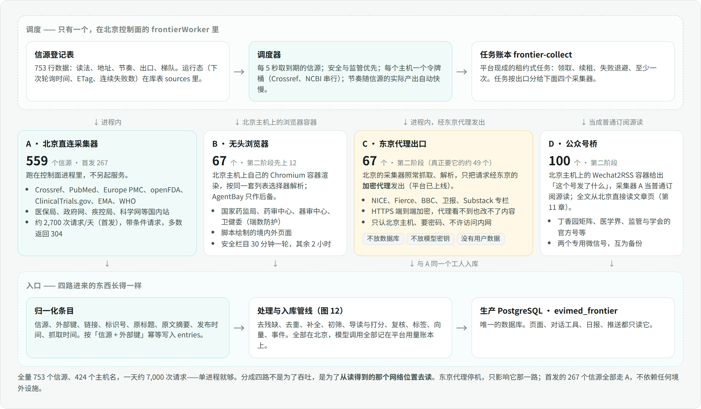

### 10.2.1 规模与形态

| 出口 | 信源数 | 跑在哪 | 每天请求 | 何时上 |
|---|---|---|---|---|
| A 北京直连 | 559（首发 267） | 控制面进程内，`frontierWorker` | 首发约 2,700，全量约 5,200 | 第一阶段 |
| B 无头浏览器 | 67（先上 12 个国内监管站） | 北京主机上的自有 Chromium 容器；境外的脚本页由它经东京代理打开；AgentBay 只作后备 | 约 150–750 | 第二阶段 |
| C 东京代理出口 | 67（按 9 月 22 日复测，真正要它的约 49 个） | 北京的采集器经东京的加密代理发请求（平台已上线） | 约 800 | **第二阶段**（原第三阶段） |
| D 公众号桥 | 100 | 北京主机上的 Wechat2RSS 容器，采集器 A 把它当普通订阅源读；全文从北京读文章页（第 11 章） | 约 2,400（本地请求） | 第二阶段 |

平均下来每 12 秒一次请求，多数带条件请求、返回空的 304。一天的下行流量在几百 MB 以内。所以**不需要消息队列、不需要分布式调度、不需要爬虫框架**：一个租约式工人加一张到期表就够。以后信源翻几倍，要加的也只是同一个工人的并发数。

### 10.2.2 调度

**队列就是 `sources` 表本身。** 每个信源一行，记着下次轮询时间和租约。工人每 5 秒用一条 `FOR UPDATE SKIP LOCKED` 取出到期且未被租走的信源，取几条由并发上限决定。不为每次轮询建一条任务记录——一天 7,000 条会把平台的任务账本淹掉；轮询结果记在模块自己的 `fetches` 表里，保留 14 天。平台的任务账本 `ProductJobs` 只用于低频的整件工作：每天的日报、重建向量、重新打分这类。

**优先级。** 同时到期时，安全通告与监管公告先读，其次期刊与开放接口，再次媒体，最后学会与会议页。

**每个主机一个令牌桶。** 限速按主机名而不是按信源：154 种期刊共用 Crossref 一个桶。桶的参数来自对各家现行规则的逐个核对（2026-09-21）：

| 主机 | 并发 | 最小间隔 | 每日自设上限 | 依据 |
|---|---|---|---|---|
| Crossref | 1 | 1.2 秒 | 3,000 | 2026 年 7 月 21 日起的新规：列表查询匿名池每秒 1 次、礼貌池每秒 3 次；429 要求降速，403 是人工封禁；限额现在按邮箱加 IP 计 |
| NCBI E-utilities | 1 | 0.4 秒（有密钥后 0.15 秒） | 2,000 | 无密钥**每个 IP** 每秒 3 次——平台的研究运行（经公开信源网关）和两个专科引擎也从同一个 IP 调它，所以第一阶段就要一个免费密钥（每秒 10 次），前沿动态只用其中三成；`tool` 与 `email` 参数必带；大批量作业放在美东夜间或周末 |
| Europe PMC | 1 | 1 秒 | 1,500 | 官方论坛口径每秒 10 次、每分钟 500 次；没有密钥这回事 |
| openFDA | 1 | 1 秒 | 800 | 匿名每 IP 每天 1,000 次、有密钥 12 万次。研究运行与药物安全引擎共用这个 IP 的匿名额度，所以密钥是第一阶段的**必需项**（配置槽 `OPEN_SCIENCE_OPENFDA_API_KEY` 已经有），不是建议项 |
| ClinicalTrials.gov、Federal Register | 1 | 1.5 秒 | 500 / 200 | 都没有公布限速，自我约束 |
| medRxiv / bioRxiv | 1 | 2 秒，超时放宽到 30 秒 | 300 | 无公布限速；`/details` 每页是 30 条不是 100 条 |
| arXiv | 1 | 3 秒 | 100 | 使用条款：每 3 秒至多 1 次、单连接 |
| WHO、EMA、GOV.UK | 1 | 1–2 秒 | 各 300 | 只有 GOV.UK 内容接口写了每秒 10 次；EMA 的数据文件每天 06:00 和 18:00（阿姆斯特丹时间）更新 |
| 其余订阅源与列表页 | 每主机 1 | 1–2 秒，且遵守 robots 的 crawl-delay | —— | 业界惯例是每小时一次；只有二十来个官方安全通告源设为 30 分钟 |

**只取增量。** 期刊查询不必每次重扫 7 天：只取上次成功之后新登记的（Crossref 的 `from-index-date`，重叠 1 天），每天一次 7 天全扫补漏。干跑量过，每 3 小时重扫一遍 7 天窗口，一天要下载约 50 MB、只为了其中每轮约 30 篇新文章；改成增量后约 10 MB。

**摊开而不是排队。** 154 种期刊不同时到期：按信源 id 的哈希把它们均匀摊在 3 小时窗口里，约每 70 秒一种。平台现有的限速器等待超过 15 秒就报「主机繁忙」，靠排队会大面积误报失败。

**节奏自己调。** 每个信源有下限和上限（登记表给定）。连续三次轮询都没有新条目，间隔乘 1.5，直到上限；一旦出现新条目，回到下限。周刊在出刊日自然变快，停更的博客自然变慢，不需要人维护。

**条件请求。** 平台现有的读网页通道没有条件请求（核对过代码：没有任何 ETag 或 If-Modified-Since 的处理），这是 `frontierFetch.mjs` 里要新写的一小段：每个信源记住上次的 `ETag`、`Last-Modified` 和内容哈希，下次带上；服务端不支持的（Europe PMC 实测不支持），就比对内容哈希，没变则不解析。

**失败与退避。** 失败后间隔按 2 的幂退避，上限 6 小时；遇到 429 或 `Retry-After`，整个主机的令牌桶一起暂停，而不只是这个信源。连续失败满 3 天标为「暂时读不到」。

**首次接入保护。** 一个信源第一次被读到时，只有近 7 天的条目进入处理，其余标为「回填」：留档、不进时间轴、不送模型。没有这一条，首发第一轮就会为约 5,700 条旧闻付费。

### 10.2.3 一次采集的全过程

1. 领取到期信源，写租约（10 分钟，超时自动释放）。
2. 读网页的先查 robots（平台现成的策略，缓存 1 小时，爬虫标识 `EviMedBot` 加联系邮箱）；开放接口按接口方的使用规则，不查 robots；登记表里带业主授权例外的主机（目前只有公众号文章页）跳过这一步并计数。然后等令牌。
3. 经钉扎传输发请求：每一跳核对 DNS 并钉住地址、拒绝内网地址、手工跟随至多 5 次跳转、响应封顶 16 MiB、超时 35 秒。
4. 判定结果：正常、未变化、空、质询页、被拒、超时、过大、解析失败。质询页和空壳页的识别沿用平台读网页已有的判定（瑞数、Cloudflare 等厂商标记，可见文字少于 300 字符）。
5. 适配器把响应变成归一化条目（10.2.4）。
6. 按「信源 + 外部键」幂等写入 `entries`：没见过的插入；见过且内容哈希没变的跳过；内容变了的更新并把修订号加一。
7. 写一行 `fetches`，更新信源的运行态（ETag、下次轮询时间、健康状态），释放租约。

整个过程至少执行一次、重复执行无害：任何一步崩了，租约到期后别的工人重做，第 6 步保证不会多出条目。

### 10.2.4 适配器：九种读法，一个契约

每种读法是一个纯函数：`(原始响应, 信源配置) → 归一化条目[]`，不联网、不读库，所以可以用录下来的真实响应做单元测试。归一化条目只有这些字段：外部键、链接、标题、摘要或正文片段、发布时间及其精度、语种、DOI / PMID / 注册号、少量适配器事实（Crossref 的 `update-to`、试验分期与状态、openFDA 的召回级别）。**字段是白名单**：国际实践指南注册平台的接口会带出联系人邮箱和电话，白名单之外的东西在这一步就不存在了。

干跑踩出来、适配器必须处理的十件事：

| 上游 | 坑 | 处理 |
|---|---|---|
| Crossref | `rows=100` 会悄悄截断：Nature Communications 一周 224 篇、Frontiers in Pharmacology 121 篇，都只回了 100 | 窗口内总数大于返回数就用游标翻页；回看窗口固定 7 天、按 DOI 幂等，所以登记延迟不会漏 |
| Crossref | 期刊路由不接受 `subtype` 和 `language` 这两个 `select` 字段 | 不取；文章类型靠 `update-to`、作者数为零（5.1%）和 PubMed 文献类型判断 |
| PubMed | `<doi>[doi]` 不是精确匹配：查 1,687 个 DOI，回来的记录里 14% 的 DOI 根本没问过 | 取回后按 DOI 重新对齐，不按条数信任 |
| PubMed | `datetype` 写错不报错，直接返回 0 条，看起来和「今天没新闻」一模一样 | 客户端校验取值只能是 `edat`、`pdat`、`mdat`、`crdt`、`mhda`；查询流统一用 `edat` |
| Europe PMC | 约 20% 的请求返回 200 却只有一行版本号、没有 `hitCount`，放慢速度也一样 | 缺 `hitCount` 视为可重试的故障，不当作「零条」 |
| Europe PMC | MEDLINE 记录的首次发表日期中位数在 46 天之后的未来 | 按入库日期 `FIRST_IDATE` 取新，不用 `FIRST_PDATE` |
| openFDA | 短缺接口的日期是 `MM/DD/YYYY`，其余是 `YYYYMMDD`；所有记录都没有链接字段；不良事件数据按季度更新、滞后三个月以上 | 按接口分别解析；链接由申请号或召回号拼到官方页面；不良事件接口只在 `meta.last_updated` 变化时出一条「数据已更新」 |
| ClinicalTrials.gov | 按结果首次公布日期排序的查询，记录里第一个日期字段却是多年前的首次登记日期 | 每条查询在配置里写明「以哪个日期字段为准」 |
| WHO 新闻接口 | 只有标题和日期，没有正文，链接字段还是半截路径 | 链接补全域名；过了初筛再用读网页取正文 |
| 订阅源 | 有的整个不带日期；有的 200、有条目却是几年前的；有的一条 8 万字符 | 无日期用首次见到时间并标记；信源健康看「最近一次出现新条目的时间」；文本入库前封顶 2 万字符 |

### 10.2.5 海外出口：东京代理

**它是什么。** 一条加密代理出口，不跑任何采集代码。9 月 22 日为平台的联网搜索和三个北京连不上的数据库先接通了（`apps/server/src/edgeProxy.mjs`，发版 `evimed-3957b1579bae-1`），前沿动态的采集器直接复用：登记表里出口为 `relay` 的信源，请求经它发出；其余照旧从北京直连。

**它怎么工作。**

- 东京那台跑一个 squid 正向代理，监听 443，用 Let's Encrypt 的 IP 证书（6 天有效，自动续期）。北京到代理这一段是 TLS；访问 HTTPS 原站时再走 CONNECT 隧道，第二层 TLS 从北京一直到原站。
- 抓取、解析、归一、状态、ETag、限速，全部仍在北京的同一个工人里，只是出口换了。所以东京那台**坏了就重建**，上面没有要迁移的数据；它停机时，那几十个信源在信源页标为「暂时读不到」，恢复后下一轮照常读。
- 要脚本绘制的境外页面，由北京的无头浏览器容器经同一条代理打开。

**怎么防它。**

- 代理只接受北京主机的地址（东京那台的防火墙与 squid 各拦一道），要账号密码；只放行 443 的隧道；拒绝一切内网地址，不给「让它去读它自己或它所在网络」留口子；不缓存、不记访问日志。
- 账号密码是一份密钥文件：本机与北京各存一份（root 只读），东京只存它的哈希。泄露的最坏结果是别人借北京的地址用这条代理，而防火墙本来就只认北京的地址。
- **东京那台伪造不了内容。** 早先的设计让境外节点自己抓取、解析、推回条目，节点一旦被攻破就能伪造一条带 fda.gov 链接的安全警示，所以当时规定这类条目不走安全直通。换成代理后，HTTPS 的内容由原站的证书直接对北京负责，代理只能拦、不能改，这条限制随之取消；经代理读到的安全类消息与北京直连同等对待。
- 上面不放数据库、不放模型密钥、没有任何用户数据；联网搜索的检索词会经过它（本来也要发给搜索引擎），它不记日志。

**质询页怎么办。** 北京的无头浏览器经代理打开境外页面时，只用于**脚本绘制的页面**（内容由脚本填充、没有任何防护）。遇到质询页就如实记为「质询」，不伪装浏览器指纹、不买住宅代理、不解验证码。理由不只是体面：调研时从一个干净的家用宽带 IP、用真实浏览器标识去读 NEJM、柳叶刀、NIH、Medscape，照样是 Cloudflare 质询——这几家卡的是请求指纹而不是 IP，换主机没有用；而我们本来也不需要期刊的网站（期刊走 Crossref 与 PubMed）；NIH 与 Medscape 留在「暂无可行读法」里，不硬读。和防护方拼指纹是一件没有尽头的维护工作，不做。

**租哪一台。** 配置 2 核、4 GB 内存、60 GB 以上硬盘就够，流量用不到套餐的十分之一。

| | 首选 | 备选 |
|---|---|---|
| 厂商与地域 | Vultr，东京 | 腾讯云轻量应用服务器，东京或新加坡 |
| 套餐与现价 | `vc2-2c-4gb`：2 核 / 4 GB / 80 GB / 3 TB，每月 20 美元，按小时计费 | 入门型：2 核 / 4 GB / 60 GB / 30 Mbps / 1,536 GB，每月 42 元 |
| 付款 | 支持支付宝 | 现有腾讯云账号直接买，人民币、可开票，境外地域不需要备案 |
| 为什么 | 这台机器的全部价值是「被目标站点接受」。非中国云厂商的网段；IP 被拒可以销毁重开换一个，一小时几分钱 | 省事省钱。但平台历史上已经遇到过上游按腾讯云网段整体拒绝的情况（Materials Project） |

不要选香港入门型：腾讯云自己的价目页写着它不保证与内地之间的跨境线路质量，而且更贵。也不要因为「到北京延迟低」去选线路优化产品——我们是小批量、可重试的请求，晚高峰丢几个包的代价只是一次重试。

**买了先验，再付长期。** 需要特别说明的一点：第 5 章「境外读得到」的结论是从本机测的，而本机是一条**台湾的家用宽带线路**（AS3462），不是云主机。所以那 67 个「走海外」的信源，从云主机的 IP 去读是否同样被接受，要在真机上再验一次。已经给探测工具加了按出口筛选的参数，一条命令、十分钟、由我来跑：

```text
tools/probe_registry.py ssh:<新主机> research/probe-edge.jsonl --egress relay,browser
```

验收线：67 个海外信源读到 80% 以上，且 FDA 新闻稿与药物安全通讯、NICE、Fierce 在其中；20 次向北京推送全部成功、95 分位耗时在 1.5 秒内。不过线就销毁换地域（大阪、洛杉矶），再不行换备选厂商。

**9 月 22 日验收：过线。** 主机是 Vultr 东京（AS20473），2 核、3.4 GB 内存、47 GB 盘，Ubuntu 26.04。

| 验收项 | 结果 |
|---|---|
| 67 个海外信源 | 用平台如实的爬虫标识读到 59 个（88%），FDA 的 16 个栏目、NICE 5 个里的 4 个、Fierce 3 个都在。探测工具原先用的冒充浏览器标识只读到 43 个：FDA、CDC、加拿大卫生部对「机房 IP 加浏览器标识」一律拒绝，对如实的标识照常回答 |
| 向北京推送 | 20 次全部送达。复用一条连接时 95 分位 1.46 秒，每次新建加密连接是 2.6 秒，所以节点对北京保持一条长连接 |
| 要浏览器的境外站 | 普通请求两地都读不到的 36 个，用无头浏览器又救回 9 个（澳大利亚 TGA 两个、Cochrane 临床答案、ESMO 两个、AHRQ、约翰霍普金斯、拜耳、Mayo Clinic Platform）。Cloudflare 托管质询挡住的 9 个（NIH 四个、加拿大 CDA-AMC、SSRN、Healthcare IT News、Digital Health、Perplexity）无头浏览器也过不去；另有 6 个是登记表里的地址过期（404），开工时改地址 |
| 联网搜索 | 同一版 SearXNG 查 20 个医学检索词：北京只有 1 个有结果；东京 20 个都有结果、每个约 30 条，但**大多不对题**——机房 IP 下 Bing 返回无关页面（Wordle、浏览器插件），对题的只有 Google CSE 的一两条，而它当天就被限流；学术引擎（PubMed、Semantic Scholar、Crossref）从东京都正常（12.3） |

同一天用如实标识从北京复测，原先走海外或读不到的信源里，有 33 个从北京就能直接读，其中包括 FDA 官网全部 14 个栏目（裁决二）。所以真正要经东京代理的是：普通请求 40 个，外加用浏览器的 9 个；登记表在开工时按这两次复测更新出口。改为代理后，「向北京推送」这一项换成经代理的请求：实测每个新连接多 1–2 秒（GTEx 经代理 2.6–3.4 秒），对 2 小时的时延目标没有影响。

**业主 9 月 22 日的补充：海外主机不只做采集。** 业主要求充分利用它做联网搜索、数据库接入和数据获取。落法三条，都守同一条边界——它上面不放模型密钥、不放用户数据、不落盘任何检索词：

- **联网搜索（9 月 22 日已接通，`evimed-3957b1579bae-1`）。** 平台搜索现在同时问两路、合并去重：百炼上千问自带的联网搜索（用平台现有的 DashScope 密钥，每次 2–4 秒、8–9 条带标题与站点的结果，覆盖公众号文章和今年的中文新闻），以及东京那台的 SearXNG——经东京的 TLS 代理访问，只对北京主机开放、带密码、不记日志；它上面的 Bing、DuckDuckGo、Brave、Startpage、Qwant 因为返回无关页面或验证码已关掉，只留 Google CSE 与学术引擎。北京那台 SearXNG 退为后备。实测平台搜索每次 1.7–2.4 秒、4–8 条对题结果。
- **数据库接入（同日已接通）。** 平台连的 79 个外部库逐个两地实测：72 个北京直连正常，照旧直连（走代理每次多 1–2 秒）；北京连不上的 GTEx（卡死）、OMIM（被 Cloudflare 拒）、Materials Project（拒腾讯云网段）改走东京。网页读取在北京被 403/429/451/503 拒绝或连不上时，经东京重读一次（NICE、Fierce 已验证）。Cochrane 和 NIH 从东京也被 Cloudflare 托管质询挡住，无头浏览器同样过不去。前沿动态自己的数据库仍放北京：离页面近，数据不出境。
- **数据获取。** 就是上面的 67 个境外信源；其中要脚本绘制的页面，用它上面同样一套无头浏览器。

三件事都已在 9 月 22 日验收，结果见上一段。

**Cloudflare Worker 不再作为首选。** 第 5.4 节原来写的是「首选 Cloudflare Worker」。核对后改了：Worker 发出的每个请求都带 `CF-Worker` 头，任何目标站一条规则就能整体拒绝；免费档每次调用只有 10 毫秒 CPU；它的使用条款不允许用来提供代理类服务；`workers.dev` 在国内的可达性也没有保证。

### 10.2.6 无头浏览器与公众号桥

**无头浏览器用自己的，不用云端的。** 瑞数的防护只认「有没有一个真浏览器把它的脚本跑完」，不认是谁的浏览器。9 月 22 日从北京生产机实测：一个普通的 Chromium 容器打开国家药监局（公告通告、说明书修订公告、创新药械专题）、药审中心（指导原则）、器审中心（指导原则）、卫健委（文件、司局页）共 7 个页面，全部拿到完整列表，每页 1–5 秒，7 页连同浏览器启动共 22 秒；开发机上 5 个页面结果相同。同样的页面用普通请求，两地都只拿到 412 或 202 的脚本页。所以这条路这样搭：

- 北京主机上起一个 `frontier-browser` 容器：固定版本的无头 Chromium，内存封顶 1 GB，不开任何对外端口，只在控制面所在的内部网络上暴露调试口；
- 采集器用平台已经依赖的 `playwright-core` 连过去（`connectOverCDP`，和平台读网页时连 AgentBay 是同一个接口），在一个浏览器上下文里依次打开各栏目，再按同一套列表选择器解析；新条目的详情页也由它打开；
- 只准访问登记表里这几个站的域名，其余请求一律拦下，页面脚本碰不到内网；
- 没有按时长的计费，也不占研究者网页渲染的并发闸门，所以不再「集中成批」：两个药品安全栏目（说明书修订公告、其他公告通告）和其他官方安全通告一样 30 分钟一轮，其余栏目 2 小时一轮，每天约 240 次页面、合计十来分钟；
- AgentBay 只作后备：自有容器连续失败 2 小时（例如瑞数开始识别无头浏览器），这几个栏目才切到云端浏览器。

**公众号桥见第 11 章。** 这里原先写的 we-mp-rss 靠公众号后台的文章列表取数，而那个列表 7 月 30 日已被微信关闭；业主已选定 Wechat2RSS，第二阶段上 100 个号。

**X 不监测，结论不变，理由更硬了：** X 的接口在 2026 年取消了所有固定档位，按量计费，每读一条 0.005 美元，没有面向商业读取的免费额度；Nitter 已于 9 月再次停止维护。

### 10.2.7 边界：采集器不做什么

- 不登录、不付费墙、不抓全文：只取题录、摘要和公开页面的正文片段；原文永远在原站，点标题跳过去。
- 不绕过防护：网页遵守 robots 和站点声明的抓取间隔，例外只有登记表里逐条写明、业主授权的主机；质询页如实记录。
- 不隐身：爬虫标识写明产品名和联系邮箱，出了问题对方找得到人。
- 不把自己的连接能力给别人用：东京代理只接受北京主机、要密码、不许访问内网；采集器只让登记表里出口为 `relay` 的主机经它。

### 10.2.8 信源健康与选择器自愈

健康状态由 `fetches` 算出来，四档：正常；退化（近 24 小时成功率低于 80%）；暂时读不到（连续失败满 3 天）；**漂移**——请求成功、页面也在，但条目数从一向有突然变成零，或者解析出的日期全部为空。漂移几乎总是网站改版导致列表选择器失效，是列表页这种读法（全表 325 个）最主要的维护成本。

漂移的修复交给模型、由程序把关：把页面 HTML 给模型，让它提出新的选择器；程序用新选择器在**连续两次**抓取上验证——至少 8 个带文字的链接、日期能解析、与上一次成功时的条目有重合——通过才自动启用，启用记录留痕，产出下降则自动回滚。模型提建议，程序验证可验证的部分，验证不过就不用。这是平台第一条开发原则的直接应用，也符合业主「尽量自动、少要人点」的要求。第二阶段做。

### 10.2.9 登记表：从探测清单变成运行时登记表

现在的 `sources.json` 是为探测而建的：每行记着一个能读通的地址。复查发现它还不能直接装进 `sources` 表。缺运行时要的字段：来源类型、权威等级、是否安全通告源、轮询的上下限、允许的主机名、允许的栏目、列表选择器、以哪个字段为日期。栏目值里还有 `news`、`conference` 两个不在八栏词表里的。另有 163 个地址里写死了核查当天的日期或样例编号，例如 openFDA 召回接口写的是 `report_date:[20260801 TO 20260930]`，照原样装进去，10 月 1 日起就再也读不到新召回，而且没有任何报错。

所以第一阶段的头一件事是把它变成**运行时登记表**：

- 地址写成带占位的模板（`{since}`、`{cursor}`、`{today}`）；
- 补齐上面那些字段；
- `news` 并入「综合资讯」、`conference` 并入「临床证据」；
- 三个补全用的工具接口（PubMed esummary、Europe PMC 按 DOI 取摘要、Unpaywall）移出信源清单，归到补全步骤的配置里；
- 加一个测试：把登记表每一行都装进 `sources` 表的定义里跑一遍，缺字段、词表外的值、写死的日期都会在评审时变红。

## 10.3 处理与入库管线

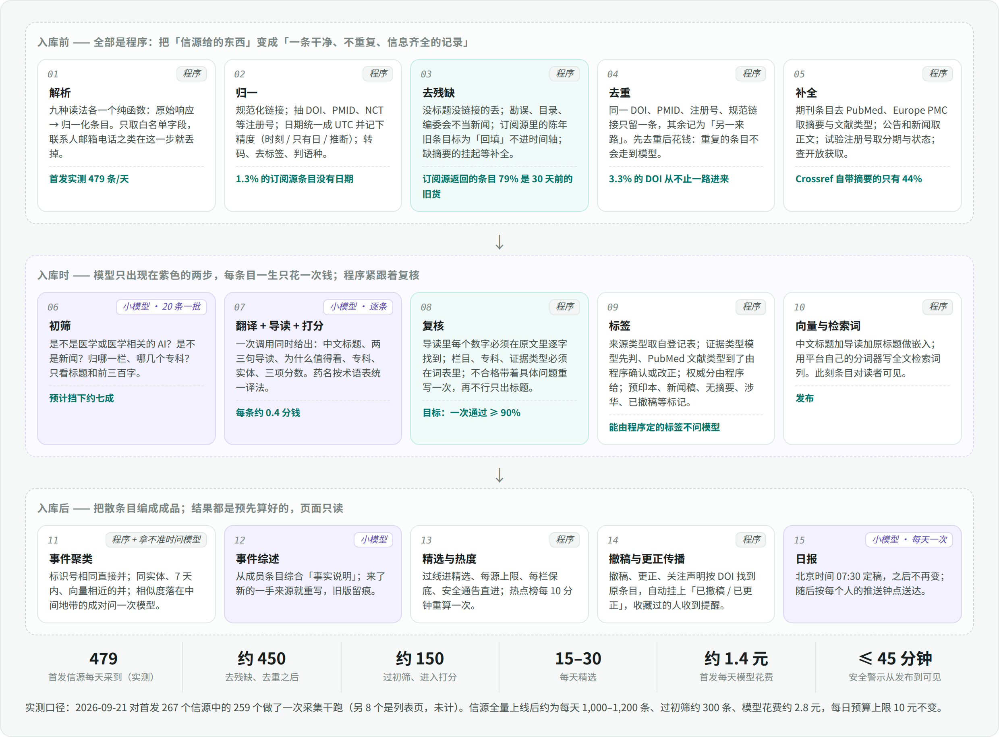

### 10.3.1 十五步总览

| # | 步骤 | 谁做 | 输入 → 输出 | 失败了怎么办 |
|---|---|---|---|---|
| 01 | 解析 | 程序 | 原始响应 → 归一化条目 | 记为解析失败，计入信源健康 |
| 02 | 归一 | 程序 | 规范链接、标识号、UTC 时间与精度、语种、清洗后的文本 | 单字段失败不影响整条 |
| 03 | 去残缺 | 程序 | 给每条打上残缺标记，决定丢弃、挂起、回填或放行 | —— |
| 04 | 去重 | 程序 | 同一作品只留一条，其余记为「另一来路」 | —— |
| 05 | 补全 | 程序 | 摘要、文献类型、正文片段、试验事实、开放获取状态 | 挂起重试，5 天后以「无摘要」放行 |
| 06 | 初筛 | 小模型，20 条一批 | 是否医学、是否新闻、栏目、专科 | 整批重试一次，再失败逐条 |
| 07 | 翻译、导读、打分 | 小模型，逐条 | 中文标题、导读、理由、专科、实体、三项分数 | 重试一次；仍失败则只出标题 |
| 08 | 复核 | 程序 | 数字逐字核对、词表校验、长度与格式 | 带着具体问题重写一次，再不过只出标题 |
| 09 | 标签 | 程序 | 来源类型、证据类型、权威分、各种标记 | —— |
| 10 | 向量与检索词 | 程序调用嵌入服务 | 1024 维向量、全文检索词列；**条目此刻可见** | 嵌入失败不挡发布，稍后补 |
| 11 | 事件聚类 | 程序；拿不准时问模型 | 条目 → 事件 | 失败则条目暂不属于任何事件 |
| 12 | 事件综述 | 小模型 | 事件的「事实说明」 | 保留上一版 |
| 13 | 精选与热度 | 程序 | 精选标记；每 10 分钟一份热点榜 | —— |
| 14 | 撤稿与更正传播 | 程序 | 给原条目挂上「已撤稿 / 已更正」 | —— |
| 15 | 日报 | 小模型，每天一次 | 当天的固定成品 | 07:45 未生成则告警，列表照常 |

处理队列也不另建：`entries` 和 `items` 各有一个状态列和租约列，工人按状态领一批、处理、改状态。状态机：

```text
entries:  collected → held（等补全）→ merged（并入已有条目）
                                    → screened-out（初筛未过，30 天后清除）
                                    → promoted（生成 item）
                    → backfill（首次接入的旧条目）   → dropped（残缺）   → failed（重试三次仍失败）
items:    screened → scored → published（读者可见）      → withdrawn（运营撤下，留痕）
```

### 10.3.2 去残缺

「残缺」不是一个笼统的感觉，是一张明确的表。每一项都是程序能判定的，判定结果写进条目的残缺标记里，便于事后统计哪个信源最脏。

| 残缺 | 实测占比 | 处置 |
|---|---|---|
| 没有标题或没有链接 | 订阅源 0%；开放接口 4%（openFDA 无链接字段） | 链接能由标识号拼出的，拼；否则丢弃并计入信源健康 |
| 没有日期 | 1.3% | 用首次见到时间，精度记为「推断」；界面上不显示具体时刻 |
| 日期在未来超过 24 小时，或早于回看窗口 | 订阅源 79% 是旧条目 | 旧的标为回填；未来的按首次见到时间处理 |
| 更正、勘误、撤稿声明 | 3.1% | **不丢**，转入第 14 步，去找它指向的原条目 |
| 目录、封面、编委会、本期导读、回复 | 3.4% | 丢弃。判据是 Crossref 的结构信息加零作者，再加一张很短的**整标题精确匹配表**（Editorial Board、Table of Contents、Issue Information 这类期刊固定栏目名），不做标题的模糊匹配 |
| PubMed 文献类型只有来信、评论、社论、新闻、传记 | 已收录文章的 17.5% | 期刊研究栏不要；其中「新闻」类型改投对应栏目，其余降为只在「全部」里可见 |
| 期刊文章没有摘要 | Crossref 侧 56% | 挂起等补全（见 10.3.4） |
| 订阅源摘要被截断，或短于 80 字符 | RSS 16.8%，Atom 50.7% | 标记；过了初筛再取正文，不为七成会被筛掉的条目白读网页 |
| 文本超长 | 个别，最长 79,565 字符 | 入库封顶 2 万字符，送模型封顶约 6,000 字符 |
| 乱码与编码错误 | 国内老站点偶发（GBK、GB18030） | 按响应头与 `meta` 声明转码；仍含大量替换字符的丢弃并计入信源健康 |
| 接口带出的个人信息 | 个别接口 | 第 01 步的字段白名单已经挡掉，到不了这里 |

### 10.3.3 去重

去重键按可靠程度排序：DOI、PMID、公众号文章的 `biz:mid:idx`、规范化链接的哈希。规范化链接是去掉跟踪参数和锚点、统一协议与大小写之后的链接。一个条目的所有键都记在 `item_keys` 里，所以先由 DOI 进来、后由 PMID 进来的同一篇论文也能认出来。

**注册库和监管数据库的键是「事件」，不是「对象」。** ClinicalTrials.gov 的「首次公布结果」「试验终止」与这个试验当初的「新登记」是三条不同的新闻；Drugs@FDA 的一次补充申请（例如新适应症）与这个申请号当初的批准也是两条。如果身份键只到注册号或申请号，后来的新闻会被当成「另一来路」并掉。所以这类信源的身份键写成 `reg:<注册号>:<事件>:<日期>`、`fda:<申请号>:<补充号>`；注册号本身只作为聚类键，把同一个试验的几条新闻串进同一个事件。

- 键与已发布条目相同：这条记为该条目的「另一来路」，不再往下走。
- 键与另一条还在处理中的相同：后来的那条等着，随前一条的结局一起定。来源权威更高的那条当主条目。
- 键都不同、但标题高度相似：只在**已发布条目、同栏目、7 天内**的范围里用三元组相似度找，阈值 0.85，命中则并。不对「Editorial Board」这种通名生效——它们在第 03 步已经被丢掉了。

注意区分两件事：**同一作品的另一来路**（期刊接口、PubMed 查询流、Europe PMC 各看到一次）在这里合并，不产生新条目；**对这篇论文的一篇媒体报道**是另一条独立的条目，它到第 11 步才和论文并进同一个事件、角色是「报道」。

### 10.3.4 补全

期刊文章的时间线是实测出来的：Crossref 当天可见，但 56% 没有摘要；PubMed 当天只有两成多能查到。所以：

1. 先问 PubMed（按 DOI 批量，取回后按 DOI 重新对齐）：拿摘要、文献类型、MeSH、期刊名、作者。
2. 查不到就问 Europe PMC。
3. 都没有：**有 Crossref 摘要的直接往下走；没有的挂起**，每 12 小时重试一次，至多 5 天。5 天后以「无摘要」标记放行：能进「全部」，只有标题和来源，不写导读、不参与精选。
4. 顶刊不等：NEJM、柳叶刀、JAMA、BMJ、Nature Medicine 等二十来种，没有摘要也先以标题入库并进入初筛，摘要到了再补导读。对这些期刊，「今天发了什么」本身就是新闻。

其余补全：正文片段（过了初筛才取，用平台现成的读网页；境外读得到、北京读不到的，经东京代理读）；试验事实（条目里有 NCT 号的，从 ClinicalTrials.gov 取分期、状态、入组人数、申办方，作为确定性事实附在条目上）；开放获取状态（平台现成的 DOI 解析）；预印本与正式发表的对应关系（Europe PMC 给出，写进 `item_links`）。

### 10.3.5 初筛

小模型，20 条一批，关闭思考，JSON 输出，温度 0。每条只送标题、来源名、前三百字。回答四件事：是不是医学或与医学相关的 AI；是不是新闻（招聘、广告、会议通知、征稿不是）；栏目；专科（至多 3 个，从词表选）。程序校验：返回条数与送入条数一致、每个取值都在词表里，否则整批重试一次、再不行逐条。

按平台的调用约定，模型调用一律经 `callModelForControlPlane`，用量用途为新增的 `frontier`。平台没有「系统账户」这种东西（用户表只有本地、OIDC、开发三种登录类型），新造一个就要动认证代码。所以照学习环和资料理解的做法：记在运营账户下一个专门的内部项目 `evimed-frontier` 名下（加进 `isInternalProject`，研究者看不到、不占任何人的项目数与运行名额），并在它身上用模块自己的每日预算，不受每用户的花费上限约束。每次调用都显式给 `max_tokens`——不给时网关按 65,536 个输出词元预留，一次小模型调用会预占约 0.52 元而实际只花 0.4 分钱。网关本身不带超时和重试，由调用方自己给（初筛 60 秒，逐条打分 45 秒）。

### 10.3.6 翻译、导读、打分：一次调用

**不单独做「翻译」这一步。** 读者要的不是英文摘要的逐句中译，而是用中文讲清楚这条消息。所以一次调用同时产出：

```json
{
  "title_zh": "中文标题，40 字以内",
  "summary_zh": "两三句导读，160 字以内；只用原文里有的事实和数字",
  "reason_zh": "一句话：为什么值得看",
  "lane": "evidence",
  "specialties": ["cardiology"],
  "evidence_type": "只有非期刊条目由模型给",
  "entities": { "drugs": ["司美格鲁肽"], "trials": ["SELECT"], "orgs": [], "diseases": ["肥胖"] },
  "scores": { "impact": 0, "novelty": 0, "relevance": 0 },
  "flags": ["press-release"]
}
```

几个决定：

- **术语表管译名一致。** 药物通用名、机构名的中英对照存在 `glossary` 表里，种子来自平台已有的药学基础数据（药品说明书库里的通用名与英文名）加一份手工维护的短表。调用前，程序在原文里找出命中的词条，只把**命中的那几条**随提示词送给模型。试验缩写、基因符号标记为「保留原文」。界面上中文标题下面永远同时显示原标题。
- **中文信源不翻译。** 中文条目的中文标题就是原标题，只写导读。
- **完整的中文摘要是按需的。** 精选条目在入库时生成；其余条目在第一次有人点开「中文摘要」时生成一次，之后全平台共用缓存。这是读路径上唯一一处模型调用，有预算上限，超了就显示原文摘要。
- **提示词写成「长而稳定的前缀加短的条目」。** 角色、原则、四套词表放在最前面且逐字不变，条目放在最后。DeepSeek 按前缀缓存计费，命中缓存的输入每百万词元 0.04 元、未命中 2 元，差五十倍；这样写，每条只有条目本身那四五百个词元按未命中计。
- **错峰。** DeepSeek 工作日北京时间 09:00–12:00 与 14:00–18:00 是高峰，其余时段半价。安全通告、监管公告、顶刊随到随处理；其余条目白天攒着，18:00 后一起处理，日报 07:30 定稿正好也在半价时段。

### 10.3.7 复核

模型输出进库之前，程序逐项检查，任何一项不过都带着**具体是哪一项**让模型重写一次：

- **数字逐字核对。** 提示词要求中文标题和导读里的一切数量都用阿拉伯数字写。程序抽出其中所有数字（含小数、百分号、千分位），同时抽出用汉字写的数量（「三成」「两倍」「近五成」「百分之三十」——这是一张封闭的数字字表加单位字，不是开放词表），换算后与阿拉伯数字一起核对；归一化全角半角与千分位后，每一个都必须在「送给模型的那段原文」里找到数值相等的数字。「3.2 万」要能对上原文的 32,000，「三成」要能对上原文的 30%。不允许四舍五入；换算不了的汉字数量按原样逐字匹配。送给模型的原文连同它的哈希存在 `item_texts` 里，所以事后任何一条导读都能复查。单位是否一致先作为指标观察，不作为拒绝理由。
- **词表。** 栏目、专科、证据类型、标记只能取词表里的值。
- **格式。** 长度上限；导读里不得出现链接；语言必须是中文；实体数量有上限。

重写一次仍不过：这条只出标题、不出导读，复核结果记为「仅标题」，计入指标。复核从不「放软」——要么通过，要么不出。

### 10.3.8 标签：哪个标签由谁定

| 标签 | 谁定 | 依据 |
|---|---|---|
| 来源类型（期刊、监管、循证机构与学会、预印本、企业、媒体） | 程序 | 登记表 |
| 栏目 | 登记表给默认值；模型可以在该信源允许的栏目里改 | 一个综合媒体的条目可能属于任何栏目，NMPA 的公告不可能属于「AI 与医学」 |
| 证据类型 | 先由模型按摘要从词表选；PubMed 给出明确的研究类型后，由程序按映射确认或改正 | 干跑里新文章带明确研究类型的只有 9%（PubMed 要到 MEDLINE 标引时才给，常在几周后），只靠映射，新条目几乎都会落成「其他」。依据记为「模型」或「文献类型」，改正时留痕 |
| 专科、实体 | 模型 | 实体经术语表归一后，另存一份规范键用于聚类和关注 |
| 权威与证据强度分（30 分） | 程序 | 信源权威等级 × 证据类型系数 |
| 影响、新颖、相关三项分 | 模型 | —— |
| 预印本、企业新闻稿、无摘要、日期为推断 | 程序 | 登记表与残缺标记 |
| 涉华 | 程序 | PubMed 作者单位的国家字段；国内信源直接为真 |
| 已撤稿、已更正、已正式发表 | 程序 | 第 14 步 |
| 安全通告 | 程序 | 信源行上的属性，只有官方安全通告源有 |
| MeSH | 程序 | PubMed 给的，只用于检索，不显示 |

### 10.3.9 撤稿与更正传播

这是循证产品该有、而新闻聚合类产品没有的一步。三个来源：Crossref 的 `update-to`（实测一周 52 条，含 1 条撤稿、1 条关注声明）、PubMed 的撤稿类文献类型、Crossref 每个工作日更新的 Retraction Watch 数据。每条声明按 DOI 写进 `item_links`；被指向的条目如果在库里，立刻挂上「已撤稿」或「已更正」并在卡片上醒目显示；它要是进过精选或日报，事件页补一条进展；收藏过它的用户收到一条收件箱提醒。声明可能先于原文入库，所以按 DOI 存、每次新条目入库时反查一次。

### 10.3.10 时延、补做与背压

| 类别 | 从原站发布到读者可见 |
|---|---|
| 北京直连的官方安全通告（MHRA、EMA、openFDA 召回、FDA 药物安全通讯与 MedWatch、国家药品不良反应监测中心） | 45 分钟内（30 分钟轮询加 5 分钟处理，不看分数） |
| 国家药监局的安全类公告（自有无头浏览器） | 45 分钟内（30 分钟一轮，与其他官方安全通告相同） |
| 经东京代理读到的安全类消息 | 与北京直连相同：代理只转发加密流量，看不到也改不了内容，照样走安全通告直通 |
| 监管公告、顶刊 | 2 小时内 |
| 其余期刊 | 标题当天出现在「全部」；摘要到位后 4 小时内补导读并**重新打分** |
| 媒体与 AI | **先以原标题和来源发布**（10.3.1 的状态机多一条「仅标题」直发路径），白天 90 分钟内进「全部」；导读与打分在非高峰时段补齐后才可能进精选 |
| 公众号 | 取决于 Wechat2RSS 的收录，平均 6 小时（11.3） |

队列积压时按优先级处理：安全通告、监管、顶刊、其余期刊、媒体。当日预算用到八成，媒体与 AI 停止打分、只采集；用完则全部只采集。第二天零点恢复，先补昨天欠下的。任何一条重试三次仍失败的，标为失败并留下原因，不无限重试、不当作成功。

### 10.3.11 花费（按干跑实测的文本量重算）

| 项 | 首发（每天约 479 条） | 全量（每天约 1,100 条） |
|---|---|---|
| 初筛 | 约 24 批，约 0.2 元 | 约 0.5 元 |
| 逐条导读与打分（约三成过初筛；每条输入约 500 词元未命中缓存、输出约 350 词元，约 0.4 分钱） | 约 150 条，0.6 元 | 约 330 条，1.3 元 |
| 复核后的重写（按一成计） | 0.1 元 | 0.15 元 |
| 事件综述（每天约 30 个） | 0.17 元 | 0.26 元 |
| 日报（每天一次） | 0.04 元 | 0.04 元 |
| 按需的中文摘要（估每天 50 篇） | 0.3 元 | 0.5 元 |
| **模型合计** | **约 1.4 元/天** | **约 2.8 元/天**；错峰后更低 |
| 嵌入（每百万词元 0.5 元）与重排 | 不到 0.1 元 | 不到 0.1 元 |

价目按 2026-09-21 核对的官方价：deepseek-flash 输入每百万词元命中缓存 0.04 元、未命中 2 元、输出 8 元；非高峰时段半价。所有步骤都用它：业主 9 月 18 日定过全平台只用 flash、不设分档，事件综述与日报原先按 v4-pro（0.3、9、27 元）估的两行已按 flash 重算。与平台参考价目表逐项一致（核对时发现平台的高峰时段判断没有排除法定节假日，节假日会多算一点，不影响这里）。每日预算上限 10 元不变。另有一处已知缺口要顺手补：平台的嵌入与重排调用目前不写用量账本，只有本地计数；这个模块按同样方式先用，账本缺口作为平台级问题单独处理。

### 10.3.12 质量闭环

管线里没有人工审核环节。质量靠三件事：复核挡住可验证的错误；每天离线抽 20 条导读，由模型在全新的上下文里对照原文打分，结果只进指标、不拦截；每一次真实的差错都变成一条评测用例，而不是提示词里的一条禁令。运营只保留三个动作：撤下一条、置顶一条、停用一个信源，都留痕。


## 10.4 数据库

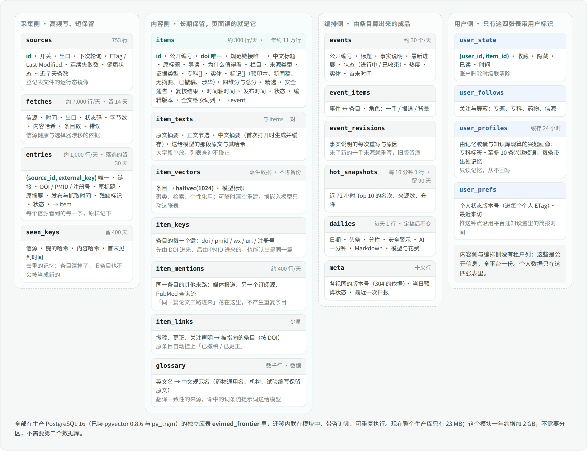

### 10.4.1 建在哪，为什么

**建在生产 PostgreSQL 里，一个新的库表 `evimed_frontier`，和知识库索引 `evimed_kb` 同一做法。** 不建在海外服务器上，也不另起一个数据库实例。

| 考虑 | 结论 |
|---|---|
| 读者在哪 | 在国内。页面每次打开都读这个库，库必须和控制面在同一台机器、同一个网络里。放到境外，每次翻页都要过一次跨境链路 |
| 要和谁关联 | 用户的收藏与已读、收件箱、记忆画像、知识库、用量账本，全在同一个 PostgreSQL 里。放在一起，收藏是一次索引查询，账户删除是一条级联 |
| 现有库撑不撑得住 | 9 月 21 日只读查过：PostgreSQL 16.15，pgvector 0.8.6 与 pg_trgm 已安装，编码 UTF8；整库 23 MB，最大的库表是用量账本 7 MB。连接上限 100，控制面连接池 10。主机 4 核、15 GB 内存、磁盘余 39 GB |
| 量级 | 每年约 2 GB（见 10.4.6）。这个模块会成为库里最大的库表，但离需要分区、只读副本或独立实例还差两个数量级 |
| 备份 | 平台每天对整库做一次加密的 `pg_dump` 并做恢复演练，新库表自动在内 |
| 东京服务器上放什么 | 代理与搜索的配置和证书，没有数据；坏了就重建，步骤记在 `research/edge-acceptance-2026-09-22.md` |

将来如果要做面向境外读者的公开日报页，再从这个库每晚导出一份只读快照过去；现在不做。

### 10.4.2 二十一张表

完整的建表语句在 `tools/frontier-schema.sql`，已经在本机 PostgreSQL 16 上实际执行过两遍（第二遍必须是空操作，验证可重复执行），得到 21 张表、53 个索引（9 月 22 日改为经代理读境外信源后，去掉了海外节点的两张表）；`tools/check_schema.sh` 会灌入两万行样例数据并检查下面几条关键查询确实走了预期的索引。上线时这份 SQL 搬进 `frontierPersistence.mjs`，按 `kbPersistence.mjs` 的方式执行：一个事务、`pg_advisory_xact_lock` 咨询锁、每条语句幂等、缺哪个扩展就跳过哪个索引。

四组表的分工见图 13。几个值得说明的设计：

**`sources` 既是登记表的运行态，也是采集队列。** 登记表文件说一个信源「是什么」，这张表记它「发生了什么」：开关、下次轮询时间、租约、ETag、最近一次成功与最近一次出现新条目的时间、连续失败数、健康状态。文件里删掉的信源在表里标为退役而不是删除，因为历史条目还指着它。运营的「停用」写在表里，重新加载文件不会把它冲掉。

**`entries` 和 `items` 分开。** `entries` 是每个信源看到的每一条，原样记下，状态列就是处理队列；没过初筛的 30 天后清除。`items` 是读者看到的东西，长期保留。分开的好处：采集可以无脑幂等地写，处理可以随时重做，而读者看到的表始终干净。

**`items` 故意做窄。** 列表页只读它。长文本（原文摘要、正文片段、送给模型的原文、按需生成的中文摘要）单独放在 `item_texts`；向量单独放在 `item_vectors`。

```sql
CREATE TABLE evimed_frontier.items (
  id                bigint GENERATED ALWAYS AS IDENTITY PRIMARY KEY,
  public_id         text NOT NULL UNIQUE,              -- 对外的不透明编号
  primary_source_id text NOT NULL REFERENCES evimed_frontier.sources(id),
  canonical_url     text NOT NULL,
  identity_key      text NOT NULL,                     -- 最强的那个去重键：doi: / pmid: / reg: / wx:<biz>:<mid>:<idx> / url:
  doi               text,  pmid text,  registry_ids text[] NOT NULL DEFAULT '{}',
  title_raw         text NOT NULL,                     -- 原标题，永远保留、永远显示
  title_zh          text,  summary_zh text,  reason_zh text,
  lane              text NOT NULL,  source_type text NOT NULL,
  evidence_type     text,  evidence_basis text,        -- 证据类型，以及它是谁定的：文献类型 / 登记表 / 模型
  specialties       text[] NOT NULL DEFAULT '{}',
  entities          jsonb  NOT NULL DEFAULT '{}',      -- 显示用
  entity_keys       text[] NOT NULL DEFAULT '{}',      -- 归一后的键，聚类与关注用
  flags             text[] NOT NULL DEFAULT '{}',
  score_authority   smallint, score_impact smallint, score_novelty smallint, score_relevance smallint,
  score_total       smallint,
  selected          boolean NOT NULL DEFAULT false,  selected_rule text,   -- 过线 / 栏目保底 / 安全直进 / 运营置顶
  safety_alert      boolean NOT NULL DEFAULT false,
  verification      text NOT NULL DEFAULT 'pending',   -- passed / repaired / title-only
  published_at      timestamptz(3),  first_seen_at timestamptz(3) NOT NULL,
  timeline_at       timestamptz(3) NOT NULL,           -- 72 小时规则，入库时算一次，之后不再变
  state             text NOT NULL DEFAULT 'screened',  -- screened → scored → published；withdrawn
  editor_version    text,  editor_model text,          -- 哪一版提示词与词表、哪个模型写的中文
  lexemes           tsvector NOT NULL DEFAULT ''::tsvector,
  event_id          bigint,
  ...
);
CREATE UNIQUE INDEX ON evimed_frontier.items (lower(doi)) WHERE doi IS NOT NULL;
CREATE UNIQUE INDEX ON evimed_frontier.items (identity_key);
CREATE INDEX ON evimed_frontier.items (timeline_at DESC, id DESC) WHERE state = 'published';
CREATE INDEX ON evimed_frontier.items (timeline_at DESC, id DESC) WHERE state = 'published' AND selected;
CREATE INDEX ON evimed_frontier.items (lane, timeline_at DESC, id DESC) WHERE state = 'published';
CREATE INDEX ON evimed_frontier.items USING gin (specialties);
CREATE INDEX ON evimed_frontier.items USING gin (entity_keys);
CREATE INDEX ON evimed_frontier.items USING gin (lexemes);
```

DOI 和身份键上的两个唯一索引是去重的最后一道保险：管线里的去重逻辑即使有缺陷，库也不会接受第二条同 DOI、同一篇公众号文章的条目。规范链接只建普通索引：同一站点的两个订阅源给同一篇东西同一个链接（干跑里 EMA 有 99 例），那是一次合并，不该是一次插入失败。

**`item_vectors` 是派生数据，不进备份。** 向量可以随时由文本重算（一年的量重算一遍约十几元）。单放一张表有三个好处：换嵌入模型只动这一张表；备份里不装一堆压不动的浮点数；列表查询碰不到它。用 `halfvec(1024)` 而不是知识库用的 `vector(1024)`：半精度向量的召回差异可以忽略，体积少一半，而生产机内存正紧（交换区已满）。`halfvec` 需要 pgvector 0.7 以上，生产是 0.8.6；迁移里做版本判断，低版本回落到 `vector`——本机 PostgreSQL 的 pgvector 就是 0.6.2，校验脚本走的正是这条回落路径。嵌入模型与知识库是同一个（`qwen3.7-text-embedding`，1024 维），`model_key` 列的写法也与知识库一致，模型一换就知道哪些行要重算。

**时间轴时间在发布那一刻定。** 等摘要的期刊条目可能在首次见到后 1–5 天才发布。如果时间轴时间用首次见到的时间，它们一出现就已经排在几天前，错过「今天」、错过日报的「前 24 小时」、也错过 72 小时热点窗口。所以 `timeline_at` 在条目发布时计算：发布时刻距原发布时间不超过 72 小时，就用发布时刻，否则用原发布时间。日报和热点的时间窗也按发布时刻算。摘要晚到的条目补完导读后重新打分一次（`rescored_at`），不会因为最初只有标题就永远进不了精选。

**去重的记忆比条目活得久。** `seen_keys` 记着每个信源见过的每一个键和内容哈希，保留 400 天；`entries` 里没用上的条目 30 天后可以放心清掉。

**`item_links` 按 DOI 存撤稿与更正关系。** 声明可能比原文先到，所以两端都存 DOI，条目 id 后补。

**内容侧和编排侧没有租户列。** 这些是公开信息，全平台一份。带用户标识的只有四张表（收藏与已读、关注、兴趣画像缓存、推送偏好），都以 `evimed_control.users(id)` 为外键并级联删除，账户注销时一并清除，和知识库的做法一致。

### 10.4.3 中文检索怎么办

生产库没有、也不打算装任何中文分词扩展（zhparser、pg_jieba、pg_bigm 都不在镜像里）。**照抄知识库已经跑通的做法**：全文检索词不交给 PostgreSQL 的文本检索配置，而是由平台自己的分词器（中文按二元组、英文按词）生成，直接写成 `tsvector` 字面量存进 `lexemes` 列，查询时同样由应用生成 `tsquery`。三条腿：

| 腿 | 索引 | 管什么 |
|---|---|---|
| 分词全文 | `lexemes` 上的 GIN | 中英文关键词，主力 |
| 三元组 | 标题上的 `gin_trgm_ops` | 拼写相近的药名、试验缩写、拉丁词 |
| 向量近邻 | `item_vectors` 上的 HNSW（余弦），开启 pgvector 0.8 的迭代扫描以配合栏目与时间窗过滤 | 换一种说法的同一件事 |

三条腿各取 50 条，按倒数排名融合（常数 60，与知识库一致）。向量腿需要对查询做一次嵌入，不可用时自动只用前两条并在结果里如实标为「关键词检索」。

聚类用的「找相近条目」不走 HNSW：候选总是限定在近 7 天、共享至少一个实体的条目里，通常几十到几百条，直接精确计算余弦距离更快也更准。

### 10.4.4 队列放在表里，不放在任务账本里

第 6.6 节原来写「新增三个任务种类」，这里收窄了。采集每天 7,000 次、处理每天上千条，如果每次都在平台的任务账本里落一行，一年就是几百万行，会把一个本来只有几千行的共享账本淹掉。所以：

- **采集队列** = `sources` 表的「到期且未被租走」部分索引。
- **处理队列** = `entries` 与 `items` 的状态列加租约列，同样用 `FOR UPDATE SKIP LOCKED` 领取。
- **平台任务账本** 只新增两个种类：`frontier-daily`（每天一条，幂等键是日期）和 `frontier-rebuild`（重建向量、改了提示词之后对近 72 小时重新打分这类运维作业）。日报推送沿用已有的 `notify`。

租约、续租、到期释放、失败退避的语义和平台的任务账本完全一样，只是存在自己的表里。现在控制面是单实例，但这套写法在多实例下同样安全。

### 10.4.5 保留与清理

工人每小时跑一次清理，每张表一条带上限的删除语句，删不完下次接着删：

| 表 | 保留 |
|---|---|
| `fetches` | 14 天 |
| `entries` 里未过初筛、残缺丢弃、回填、失败的 | 30 天；但它们的键留在 `seen_keys` 里 400 天，这样深订阅源（MMWR 回溯到 2019 年）和不带日期的条目不会在一个月后被当成新的再进一遍 |
| `entries` 里已并入或已生成条目的 | 长期（条目的来路记录） |
| `hot_snapshots` | 90 天 |
| `items`、`item_texts`、`events`、`dailies` | 长期。这是产品的档案，也是对话工具能回答「上个月有什么进展」的原因 |
| `user_profiles` | 缓存，随算随换 |

### 10.4.6 一年长多少

样例数据实测加估算：

| 表 | 每年行数 | 每年体积 |
|---|---|---|
| `items`（含 8 个索引） | 约 11 万（全量后） | 约 450 MB |
| `item_texts` | 同上 | 约 300 MB（长文本由 TOAST 压缩） |
| `item_vectors`（含 HNSW） | 同上 | 约 750 MB。本机用未压缩的 `vector` 实测每行 13 KB，`halfvec` 约一半 |
| `entries`（长期保留的部分加 30 天滚动窗口） | 约 15 万 | 约 400 MB |
| 其余 | —— | 不到 100 MB |
| **合计** | | **约 2 GB / 年** |

**备份会跟着长，要提前处理，而且要和备份自己的校验一起改。** 平台的备份是整库 `pg_dump`、保留 30 份。这个模块上线一年后，每份备份会从现在的几 MB 长到三四百 MB，30 份就是十来 GB，而生产机磁盘只剩 39 GB。所以 `item_vectors`、`fetches` 两张表只导结构不导数据（都是可重建或短保留的）。但备份脚本在快照时数过每张表的行数，恢复演练后再数一遍，对不上就报 `restore_application_mismatch`，备份就绪检查随之变红，而发布以就绪检查全绿为准。所以这不是「一处小改」：`pg_dump --exclude-table-data`、行数校验（这三张表预期为 0）、备份回执、`postgresBackupReadiness` 四处一起改，并加一个「演练时有一张排除表」的测试；恢复后补跑一次向量重建。

**数据库参数。** 生产库的 `shared_buffers` 还是默认的 128 MB，对现在 23 MB 的库没有影响，对 2 GB 的库就偏小了。建议上线时调到 512 MB；主机内存紧，不建议更高。控制面没有设置语句超时，这个模块的查询在自己的连接上设 5 秒。

## 10.5 支撑线上应用

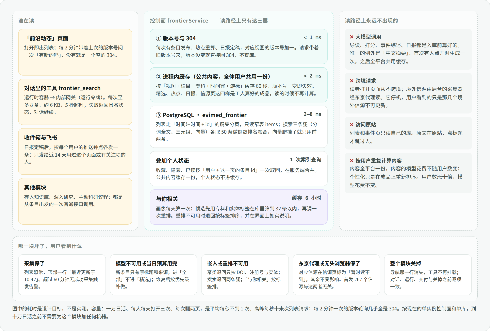

### 10.5.1 读路径的四个「永不」

页面读的是成品。导读、分数、事件综述、热点榜、日报都在入库时或入库后由工人算好存进库里，读的时候不再计算。所以读路径上：**没有大模型调用**（唯一的例外是按需的中文摘要，首次点开时生成一次、全平台缓存）；**没有跨境请求**（境外信源由后台的采集器经东京代理读，读者的请求从不经它）；**不访问原站**；**不按用户重复计算内容**（个性化只是在成品上重新排序）。

这四条决定了两件事：页面的速度和稳定性与上游无关；内容的模型花费与用户数无关（「与你相关」的画像是唯一按人计的一项，每个活跃用户每天约 0.3 分钱，10.5.3）。

### 10.5.2 接口与缓存

第 7.3 节的接口不变，补上缓存语义。平台现有接口一律 `no-store`，也没有 ETag 的先例，所以这一段是这个模块自己的小约定：

- **每个视图一个版本号。** 存在 `meta` 表里：条目发布、精选变化、热点重算、日报定稿时，由工人在同一个事务里把对应视图的版本号加一。
- **ETag 由两个版本号加查询参数哈希而成：内容版本和这个用户自己的状态版本。** 内容版本在任何一条条目被改动时都加一（发布、精选、撤稿标记、补了导读、运营撤下），不只是发布时；个人状态版本在用户每次收藏、隐藏、标已读、改关注时加一（`user_prefs.state_version`）。否则收藏之后「我的收藏」会回一个 304，浏览器拿着缓存里的旧列表，刚收藏的那条不在里面。响应头 `Cache-Control: private, no-cache`：浏览器每次都要来问，但带着 `If-None-Match`；两个版本都没变，控制面不查库、直接回 304。
- **「有 N 条新的」不用长连接。** 页面每 2 分钟带着版本号问一次，绝大多数是一个空的 304。内容几分钟才变一次，为它维持一条常驻的事件流不划算；平台的事件流留给运行。
- **进程内缓存。** 公共内容按「视图、栏目、专科、时间窗、游标」缓存 60 秒，版本号一变整体失效。全体用户共用一份。
- **个人状态不进缓存。** 一页 30 条，按「用户 + 这 30 个条目 id」一次索引查询取回收藏、隐藏、已读，在服务端叠到公共内容上。
- **分页用键集游标。** 游标是「时间轴时间 + id」的不透明编码，翻到多深都是一次索引范围扫描，不用 `OFFSET`。

写操作（收藏、隐藏、已读、关注）走平台现成的跨站请求防护和维护期准入，各是一条 `INSERT … ON CONFLICT`。

这些路由不涉及模型花费，接入时要确认它们**不走按请求计算用量配额的那条准入路径**——平台在这上面吃过亏：打开一次运行界面要发三十个请求，每个请求都算一遍配额，启动拖到 29 秒。

### 10.5.3 与你相关

- **画像**每个活跃用户（近 14 天来过）每天算一次，存 `user_profiles`。记忆是自由文本，从里面提出「专科」和「兴趣短语」是语言判断，所以由小模型做，一人一天一次（约 0.3 分钱）；只读**状态为有效且来源是用户陈述或用户确认**的记忆，推断出来的、待确认的不用。结果是一组专科标签和至多 10 条兴趣短语，每条记着它来自哪一条记忆；读的时候再核对一遍那条记忆还在不在，用户删了的记忆立刻不再出现在「因为你在做……」里。
- **候选**用 SQL 粗筛：近 72 小时、专科或实体与画像有交集、没被隐藏，按分数取前 32 条。32 是平台重排服务一次调用的文档上限。
- **排序不用重排服务，用向量。** 平台的重排服务只返回一个顺序、不给分数，要知道每条命中的是哪一句兴趣短语就得每句调一次，成本随用户数线性增长。改为：画像刷新时把兴趣短语各做一次嵌入（一人一天十来句，几乎不花钱），排序时在库里直接算这些短语向量与近 72 小时条目向量的余弦相似度，最高的那一句就是理由。结果缓存 6 小时；个性化的边际成本就是那一次小模型调用加十来句嵌入，一个活跃用户一天约 0.3 分钱，一万日活约每天 30 元——这一项和用户数有关，已计入 10.7。
- 记忆服务不可用：这一段不显示，并说明「个性化暂不可用」。重排不可用：按标签顺序给，不假装排过。

### 10.5.4 对话工具

`frontier_search` 在运行时容器里，经内部网关 `/internal/frontier/v1/search` 到控制面，凭运行令牌访问，和知识库检索工具同一条路。它调用的就是页面搜索的同一个服务方法，默认只查精选、近 30 天、至多 8 条，整个返回约 6 KB。超时 5 秒；模块关闭或出错时返回一个具名状态，对话照常继续。工具从不被强制调用，普通问题仍然是零工具作答。

### 10.5.5 推送

日报 07:30 定稿。推送时间**不另设**：沿用平台通知设置里已有的「简报时间」（`digestTime`）和免打扰时段，开关也放进同一套通知开关（`switches.frontier`）。之后每分钟一次的扫描找出「已到简报时间、今天还没推过」的用户，各建一条收件箱通知，来源类型记为 `digest`，这样飞书推送走的就是现成的简报分支（`pushNotBefore`），幂等键 `frontier-daily:<日期>`；启用了飞书的，由平台现成的消息外发表送达，失败重试 3 次、指数退避。**推到飞书的内容里不带「与你相关」的理由**：飞书绑定可能是群聊，个人记忆不能出现在群里；理由只在应用内显示。

**只推给会看的人**：近 14 天打开过这个页面、或者有任何关注项的用户。推送时间就是用户已有的简报时间，不要求任何人另外设置。安全警示命中用户关注的药物时即时推送，是第三阶段的事。

### 10.5.6 容量

| 场景 | 负载 | 结论 |
|---|---|---|
| 一万日活，每人每天打开 3 次、每次翻 2 页，页面开着时每 2 分钟问一次新 | 列表请求平均每秒 0.7 次、高峰约每秒 10 次；版本轮询高峰约每秒 40 次，几乎全是 304 | 单实例控制面、单库，无压力。样例库上列表查询走部分索引，是毫秒级的索引范围扫描 |
| 十万日活 | 上面乘十 | 304 与进程内缓存仍然顶得住；届时瓶颈在控制面整体而不在这个模块 |
| 写入侧 | 每天约 1,100 条条目、7,000 行抓取日志、几千次用户点击 | 对 PostgreSQL 可以忽略 |
| 控制面内存 | 登记表、词表、术语表、60 秒缓存 | 几十 MB |
| 工人 | 采集并发 4，处理并发 2，绝大部分时间在等网络 | 不与用户请求争 CPU，也不占用任何运行时名额 |

### 10.5.7 坏了会怎样

| 故障 | 用户看到什么 | 系统做什么 |
|---|---|---|
| 采集停了（工人挂了、出口断了） | 列表照常，顶部一行「最近更新于 10:42」 | 60 分钟无成功采集告警 |
| 模型不可用，或当日预算用完 | 新条目只有原标题和来源，出现在「全部」，不进「精选」 | 恢复后按优先级补做 |
| 嵌入或重排不可用 | 搜索退回关键词；「与你相关」按标签排；新条目暂不并入事件 | 稍后补嵌入、补聚类 |
| 东京代理停机或链路中断 | 那几十个境外信源在信源页标为「暂时读不到」；联网搜索只剩百炼 | 恢复后下一轮照常读；经代理的请求连续 30 分钟全部失败即告警 |
| 无头浏览器被识别或容器挂了 | 国内监管站点暂停更新 | 政府网政策库与广东省药监局转载栏继续顶着；连续失败 2 小时切到 AgentBay 后备 |
| 某个信源改版 | 无感 | 标为漂移，触发选择器自愈 |
| 日报没生成 | 日报视图显示昨天的，并注明 | 07:45 告警；补生成后按原计划推送 |
| 整个模块关掉 | 导航那一行消失，对话里不再挂这个工具 | 对话、运行、交付与关掉之前逐项一致 |

### 10.5.8 看什么、什么时候响

指标按平台现成的方式导出：模块给出一组指标族，挂到 `/api/ops/metrics`，命名 `open_science_frontier_*`。

| 指标 | 告警线 |
|---|---|
| 采集次数，按出口与结果分 | 连续 60 分钟没有任何成功 |
| 信源健康状态分布；最近一次出现新条目的时间 | 第一梯队健康率低于 95% 持续 2 小时 |
| 每个主机的 429 次数、令牌等待时间 | 任一主机 1 小时内 429 超过 10 次 |
| 各处理阶段的积压与最老一条的年龄 | 最老一条超过 6 小时 |
| 当天入库条数，分工作日与周末两条基线 | 低于同类日基线的一半 |
| 复核一次通过率；「仅标题」占比 | 低于 85%；高于 5% |
| 当日模型花费与预算占比 | 达到 80% |
| 精选条数与栏目分布 | 中午 12 点精选少于 5 条 |
| 东京代理 | 经它的请求连续 30 分钟全部失败；证书 3 天内到期 |
| 日报生成时间 | 07:45 仍未生成 |
| 接口耗时与 304 比例 | 95 分位超过 300 毫秒 |

**就绪检查只查内部不变量**：迁移已应用、工人已登记、登记表已载入且通过校验、联系邮箱已配置、系统账户存在。外部信源读不到**不**让就绪检查变红——平台的发布流程以就绪检查全绿为准，不能因为 FDA 网站今天挂了就发不了版。

### 10.5.9 日常运维

| 要做的事 | 怎么做 |
|---|---|
| 加一个信源、调节奏、换出口 | 改登记表一行，走代码评审，随一次发布上线 |
| 立刻停掉一个信源 | 运营接口把 `sources.enabled` 置假，立即生效，重新加载登记表不会冲掉 |
| 撤下一条、置顶一条 | 运营接口；撤下是改状态并留原因，不是删除 |
| 改了提示词或词表 | 编辑版本号加一；只对近 72 小时的条目重新打分，更早的保留当时的版本 |
| 换嵌入模型 | 清空 `item_vectors`，跑 `pnpm rebuild:frontier-index` |
| 轮换东京代理的密码 | 东京那台改 `/etc/squid/passwd`，北京换同一个密钥文件，再重建 web 容器 |
| 海外主机坏了或 IP 被目标站拒绝 | 销毁重开，跑一遍部署脚本；节点上没有需要迁移的数据 |
| 从生产机复查全部信源 | `tools/probe_registry.py ssh:evimed …`，与方案阶段用的是同一个工具 |

### 10.5.10 上线节奏

开关打开之后先**空跑一周**：管线在生产上完整运行，页面只对运营账户可见。这一周用来校准三个只能靠真实分布定的东西——精选阈值、初筛通过率、工作日与周末的条数基线——并确认花费与 10.3.11 的估算相符。然后对所有人打开。

## 10.6 这一章对前文的修订

写这一章时的核查推翻或收紧了前文几处，已在对应章节改过：

| 位置 | 原来 | 现在 |
|---|---|---|
| 首发信源数 | 268 | 267：干跑发现《中国全科医学》的订阅源早已停更，降到第二梯队 |
| 5.3 裁决四、第 9 章 | 公众号桥用 wechat2rss（约每年 200 元） | 一度改为 we-mp-rss；公众号后台列表 7 月 30 日关闭后，业主选定 Wechat2RSS（每年 150 元，第二阶段，第 11 章） |
| 5.4、7.4 | 海外中继是一个很薄的转发接口，首选 Cloudflare Worker | 改为东京的加密代理出口（9 月 22 日起，平台已上线；此前一度设计成境外采集节点）：采集仍在北京，只换出口 |
| 6.1 读法表 | `relay`（一层薄转发） | `relay`，北京的采集器经东京代理执行（10.2.5） |
| 6.6 | 新增三个任务种类 | 采集与处理的队列放在模块自己的表里；任务账本只新增 `frontier-daily` 与 `frontier-rebuild` |
| 6.6 数据模型 | 7 张表 | 21 张表，见 10.4 |
| 6.7 容量 | 每天约 1,000 条是估计 | 首发实测每天 479 条；全量估 1,000–1,200 条 |
| 7.2 文件清单 | —— | 复用已上线的 `edgeProxy.mjs`；改动 `scripts/ops/postgres-backup.py` |
| 第 8 章分期 | 海外信源在第三阶段 | 提到第二阶段 |
| 第 9 章 | 「没有新的密钥」 | 基本成立：只要 NCBI、openFDA 两把免费密钥（openFDA 已替业主注册）；文档解析不需要密钥；AgentBay 只作后备（第 9 章） |

## 10.7 需要业主做的，和一张总账

逐项清单在第 9 章，按用上的时间排：**第一阶段开工前**只要 NCBI 与 openFDA 两把免费密钥——研究运行、专科引擎和前沿动态共用生产机这一个 IP 的匿名额度（NCBI 每秒 3 次、openFDA 每天 1,000 次），不申请就会互相挤占；平台的配置槽已经有（`OPEN_SCIENCE_NCBI_API_KEY`、`OPEN_SCIENCE_OPENFDA_API_KEY`），密钥放密钥文件。**第二阶段开工前**要其余各项，外加一句「开始」。

**每月总账（全量上线后）：**

| 项 | 每月 | 和用户数的关系 |
|---|---|---|
| 境外主机 | 约 140 元（备选约 42 元） | 无关 |
| Wechat2RSS 授权 | 约 13 元（150 元/年） | 无关 |
| 模型：初筛、导读、事件、日报、按需中文摘要（全部 flash） | 约 85 元 | 无关 |
| 无头浏览器：北京主机上自己的 Chromium 容器，每天约 240 次页面 | 0（只在渲染时占约 300 MB 内存；AgentBay 只作后备） | 无关 |
| EviMed 资料检索接口：每天约 170 次 | 0（业主自己的接口，不限量） | 无关 |
| 嵌入 | 约 3 元 | 无关 |
| 「与你相关」：每个活跃用户每天一次小模型调用加十来句嵌入 | 一万日活约 900 元 | **随活跃用户数增长**，每个活跃用户每月约 0.09 元 |
| 公众号的商业接口后备 | 平时为 0；Wechat2RSS 停摆时约 14 元/天 | 无关 |

**不含「与你相关」时每月约 240 元，与用户数无关；「与你相关」每个活跃用户每月约 0.09 元。**


---

# 11. 微信公众号专项：设计与 100 个号的试跑

业主判断「其余信源里大头是公众号，而现在好多办法都不让用了」，要求单独设计，并拿 100 个号实际跑一遍获取和结构化。授权与版权不在考虑范围（业主已说明具备相应权限），这一章只按技术上能不能用、稳不稳、要人做什么、花多少钱来定。

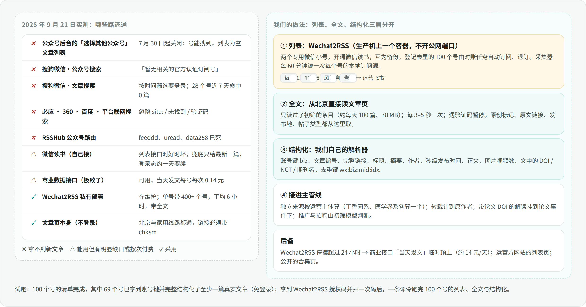

## 11.0 先说结论

1. **公众号确实是中文医学信息的大头。** 我们整理了 100 个值得监测的号，分布在九个栏目（11.1）；其中 26 个只在公众号发布，没有别的读法。
2. **今年 7 月 29–30 日起，业界最常用的那条路被微信关掉了**：公众号后台编辑器里「选择其他公众号」的文章列表。账号还能搜到，文章列表却一律为空，两个主流开源工具的问题区都有记录。免登录的路我们逐条实测过，都拿不到新文章（11.2）。
3. **现在还能稳定拿到「某个号发了什么」的，只有经由微信读书的桥接。** 业主已定：生产方案用付费的 Wechat2RSS 私有部署。它每年 150 元，单个微信号能带 400 多个公众号，平均 6 小时收录（一半在 4 小时内），带全文，自带风控退避和告警。
4. **Wechat2RSS 只管「列表」，别的都在我们自己的管线里。** 全文直接从北京读公众号文章页，不需要登录；实测两地都通，前提是链接完整。结构化、去重、独立来源判定、与论文的关联，都用第 10 章那套处理。
5. **试跑分两半。** 免登录的一半已经做完：100 个号的清单，其中 69 个号各找到至少一篇真实文章并完整结构化，另外逐条实测了各条免登录的路（11.5）。有登录的一半等授权码：到手后部署、扫一次码，一条命令跑完 100 个号的列表、全文和结构化，约 1 小时。
6. **上线提前到第二阶段。** 代价是每年约 150 元，外加两个专用微信号。

## 11.1 100 个号

完整清单在 `research/wechat-accounts-100.jsonl`（名称、微信号、运营主体、栏目、biz、已核实的一篇文章）。按栏目：

| 栏目 | 个数 | 例子 |
|---|---|---|
| 综合医学资讯 | 22 | 丁香园及心血管、肿瘤等专科号，医学界及肿瘤、心血管、内分泌、神经、智库频道，梅斯医学，医脉通及肿瘤科，协和八，健康界，医师报，健康报，中国医学论坛报，中国医药报，中华医学信息导报，中国中医药报 |
| 研发产业 | 19 | E药经理人，药明康德，医药观澜，八点健闻，赛柏蓝，医药魔方，深蓝观，氨基观察，智药局，健识局，新浪医药，同写意，医药经济报，米内网，动脉网，研发客，药时代，Insight 数据库，思宇 MedTech |
| 科研与基金 | 14 | 返朴，学术经纬，BioArt 与 BioArtMED，iNature，解螺旋，科研圈，科学网，中国科学报，知识分子，赛先生，生物谷，国家自然科学基金委员会，中国科学基金 |
| 临床证据 | 13 | NEJM 医学前沿，柳叶刀，JAMA，BMJ，中华医学杂志及英文版 CMJ，中华内科杂志，中国循证医学杂志，中国全科医学，协和医学杂志，医咖会，Cochrane 中国，GRADE 中国中心 |
| 审批监管 | 10 | 中国药闻，国家药监局，中国药审，中国器审，中国药检，国家药典委员会，国家医保局，中国医疗保险，健康中国，国家中医药管理局 |
| AI 与医学 | 8 | 机器之心，量子位，新智元，智东西，雷峰网，医健 AI 掘金志，蛋壳研究院，HIT 专家网 |
| 指南共识 | 6 | 中华医学会，中国医师协会，CSCO，中国抗癌协会，医脉通指南，中华医学会心血管病学分会 |
| 药物安全 | 4 | 药评中心，药物警戒，中国药学会，临床药师 |
| 公共卫生 | 4 | 中国疾控动态，国家疾控局，中华预防医学会，世界卫生组织 |

监管类的号不是这些机构的首选读法：国家药监局、医保局、卫健委的网站本身就在登记表里，它们的公众号只作补充和校对。

## 11.2 2026 年 9 月，哪些路还通

9 月 21 日逐条实测或核对原始出处：

| 路 | 现状 | 依据 |
|---|---|---|
| 公众号后台「选择其他公众号」的文章列表 | **7 月 30 日起关闭** | 两个主流开源工具的问题区（we-mp-rss #439、#456，wechat-article-exporter #199、#200）：账号能搜到，文章列表为空，所有人同时触发频率控制 |
| 搜狗微信·公众号搜索 | **无结果** | 实测「丁香园」「人民日报」都返回「暂无……相关的官方认证订阅号」 |
| 搜狗微信·文章搜索 | **找不到新文章** | 按时间筛选要登录。不带时间筛选时按相关性排序：实测 28 个号，22 个能搜到本号的文章（共 104 篇），**近 7 天的一篇都没有**；本号最新一篇的中位年龄是 1,153 天 |
| 必应、360、百度、平台自建的联网搜索 | **拿不到** | 必应忽略 `site:`；360 答「未找到相关搜索结果」；百度直接给安全验证；生产机上的 SearXNG 里百度已因验证码被暂停（12.3） |
| 腾讯云联网搜索接口 | 内容源不含公众号 | 产品页列的是腾讯新闻、搜狗百科、企鹅号 |
| 微信读书 | 能用，但在变 | 列表接口 `/web/mp/articles` 时好时坏：9 月 4 日开源工具改回用它，9 月 11 日起又有多人报告列表为空；兜底的 `/api/mp/cover` 只给最新一篇，同一次群发里的其他几篇会漏。登录态约半天到一天就要续期 |
| **Wechat2RSS**（私有部署，走微信读书） | **能用** | 7 月 31 日发布 v1.4.9；它的公开服务里，今天有一篇文章在发布后 4 小时内收录，并带全文 |
| 商业数据接口（极致了） | 能用，按次计费 | 当天发文每号每次 0.14 元，历史列表每页 0.14 元，正文每篇 0.03–0.04 元，每秒至多 3 次 |
| RSSHub 的公众号路由 | 基本失效 | feeddd、uread、data258 都已不可用；合集和主页两个路由只覆盖作者放进合集或主页的文章 |
| **公众号文章页本身** | **能读，但链接必须完整** | 北京生产机和台湾的家用线路上，带 `chksm` 参数的完整链接都返回 200 和全文（压缩后约 780 KB）；不带 `chksm` 的长链接一律跳验证码页；美国的数据中心连短链接也给验证码 |
| 文章页的 robots.txt | 整站 `Disallow: /` | 由业主授权，在登记表里记一条主机例外（11.3） |

## 11.3 设计：列表、全文、结构化分三层

**列表层：Wechat2RSS。**

- **部署位置。** 在生产机上起一个容器，单独的 compose 配置档，不开公网端口，数据目录挂卷，内存封顶。生产机是北京的腾讯云，正是它文档里推荐的环境：共享出口的云平台，会因抓全文被封 IP。
- **授权与密码。** 授权码绑定一台机器上的一个容器，换机器前先在它的自助页面取消激活。服务密码 `RSS_TOKEN` 放在生产机的密钥文件里；订阅地址开启加密（`RSS_ENC_FEED_ID=1`）。
- **身份。** 用两个专用微信号，都开通微信读书。Wechat2RSS 在两个号之间分摊负载，一个号被风控时另一个顶上。
- **订阅。** 登记表里的公众号行带着 biz，由它得出公众号 ID（biz 的 base64 解码）。一个对账任务把登记表和 Wechat2RSS 的订阅列表对齐：缺的用 `/add/<ID>` 补订，退役的退订。每补订一个就会触发一次抓取，所以间隔 20–30 秒。
- **读取。** 采集器每 60 分钟读一次每个号的 `/feed/<ID>.json`。这是容器之间的本地请求，几乎没有成本；读到的条目按 `wx:<biz>:<mid>:<idx>` 写进 `entries`。
- **健康。** 每 10 分钟读 `/login/list`：两个身份是否可用、是否在风控中。Wechat2RSS 自己的告警 `BOT_WEBHOOK_URL` 指向控制面的一个内部入口，转成运营的飞书消息。以下两种情况告警：两个身份同时在风控中；全部 100 个号 24 小时没有任何新文章。

**全文层：北京直接读文章页。** Wechat2RSS 的订阅源里已经有全文。但只对**过了初筛**的条目（约每天 100 篇），我们还是从北京再读一次文章页：因为订阅源里没有原创标记、原文链接、发布地、合集、帖子类型这些字段，而它们都写在文章页里。

- 每天约 78 MB 下行。
- 每 3–5 秒一次请求。
- 连续 3 次遇到验证码页就暂停 10 分钟。
- 按业主授权跳过 robots，只限这一个主机。

**结构化层：我们自己的解析器。** `tools/wechat_article.py` 是一个纯函数，文章页的 HTML 进去，一条标准记录出来，字段见 11.4。它只读页面自带的数据对象和标签，外加微信界面自身的一张固定字符串表，不做任何语言判断。「这是不是新闻、是不是推广」留给初筛模型。

**后备链。**

| 顺序 | 用什么 | 什么时候用 |
|---|---|---|
| 1 | Wechat2RSS | 平时 |
| 2 | 商业数据接口「当天发文」 | Wechat2RSS 两个身份都不可用超过 24 小时，只在这期间启用：100 个号每天一次，约 14 元/天 |
| 3 | 运营方网站 | 已在登记表里的列表页：医药魔方、健康界、动脉网、界面、36 氪…… |
| 4 | 合集页 | 公开的 JSON，只对把日常资讯放进固定合集的号有效 |

## 11.4 一篇公众号文章变成一条记录

| 字段 | 从哪来 | 进哪一列 |
|---|---|---|
| 账号 biz、文章 mid 与 idx | 链接参数，或页面数据对象 | `external_key` = `biz:mid:idx`；去重键 `wx:biz:mid:idx` |
| 完整链接（含 sn 与 chksm） | 页面数据对象里的 `link` | `url`；读者点开的就是它 |
| 账号名、原始 ID（gh_ 开头） | `nick_name`、`user_name` | 附加字段；账号改名时靠原始 ID 认人 |
| 标题、摘要、封面、作者 | `title`、`desc`、`cdn_url`、`author` | `title_raw`、`summary_raw` 与附加字段 |
| 发布时间 | `ori_create_time`，精确到秒 | `published_at`，精度记为「时刻」 |
| 原创标记 | `copyright_stat`，1 表示原创 | 附加字段；判断是不是转载的依据之一 |
| 原文链接 | `source_url`，即「阅读原文」 | 附加字段；常常就是论文或公告的原址 |
| 发布地 | `ip_wording` 里的省份 | 附加字段 |
| 帖子类型 | `item_show_type`：文章、图片帖、视频帖、音频、短内容 | 残缺标记；图片帖和视频帖只进「全部」 |
| 正文 | `#js_content` 去标签；去掉微信界面自身的一张固定字符串表 | `item_texts`；送模型前截断 |
| 图片与视频个数、外链 | 正文标签 | 附加字段 |
| 文中的 DOI、PMID、NCT、ChiCTR 号与期刊名 | 格式匹配；期刊名来自登记表 | 聚类用：把这篇解读挂到对应论文的事件下 |
| 状态 | 页面自带的提示：已删除、违规、迁移、验证码 | 抓取结果；删除与违规的条目撤下并留痕 |

## 11.5 试跑结果（免登录部分，9 月 21 日）

- **清单**：100 个号，其中 69 个已经拿到 biz，这是订阅和读取都要用的账号键：25 个来自清单整理时逐个核实的文章页，其余来自搜狗文章搜索里本号的一篇旧文章。剩下的号在 Wechat2RSS 里按任意一篇文章的链接订阅（它支持按账号 ID 或按文章链接订阅，不支持按名称）：在微信里把该号的任意一篇文章「复制链接」即可，每个号几秒钟。
- **结构化**：给 69 个号各找到至少一篇真实文章，共读取 74 次，72 次得到完整页面，没有一次撞上验证码，因为这些链接都是完整的；其余是页面自带的状态提示，例如「Insight 数据库」的旧号显示「该公众号已迁移」——号会迁移，登记表要能跟着改。字段齐全程度：账号键、文章编号、原始 ID、标题、摘要、发布时间都是 100%；作者 56%；发布地 72%；原创占 28%。正文中位数 1,937 字；文中带 DOI 等标识号的 4%，提到登记表里期刊名的 19%。
- **新鲜度**：结构化的文章里近 7 天发布的占 18 / 72，但这些近期文章大多是整理清单时为核实账号专门找来的。搜狗 103 次查询里，68 次能给出本号的文章，给出近 7 天文章的只有 5 次。免登录拿不到新文章，是今天实测出来的，不是推测；这也正是生产必须走 Wechat2RSS 的原因。
- **按栏目**：找到文章的号——资讯 21/22、研发 16/19、科研 11/14、AI 6/8、证据 6/13、指南 3/6、监管 3/10、公卫 2/4、安全 1/4。资讯、研发、科研、AI 类的号大多能找到；监管、指南、证据类的官方号在搜狗里几乎搜不到。这些号在 Wechat2RSS 里订阅时，要各复制一篇文章链接。
- **踩到的事实**：
  - 有个号已经改名：搜到的「肿瘤资讯」页面上写着「良医汇肿瘤资讯」。所以认人要靠原始 ID，不能靠名字。
  - 搜狗的临时链接读得到正文，但没有 `sn` 与 `chksm`，拼不出给读者的永久链接。
  - 文章页压缩后约 780 KB，解压后约 3.5 MB，所以只为过了初筛的条目去读。

**有登录的一半，拿到授权码以后跑。** `tools/wechat_trial.py` 已经写好三个命令：`w2r-subscribe` 订阅 100 个号，`w2r-collect` 读取全部订阅源、结构化、为近 7 天的文章读页面，`w2r-health` 查看两个身份的状态。部署和扫码见 11.8，跑完约 1 小时，结果补进这一节。

## 11.6 接进主管线时的几处特殊处理

- **独立来源按运营主体算。** 丁香园系、医学界系、医脉通系、药明康德系（药明康德、学术经纬、医药观澜）各自算一个来源；登记表给每个号记上主体。转载的文章，即不是原创、且写明了来源或带「阅读原文」的，计到原作者名下。否则一篇通稿被十个号转发，就会被当成十个独立来源，冲上热点榜。
- **公众号文章多半是「报道」而不是「一手」。** 文中带论文 DOI、试验注册号或「阅读原文」指向期刊的，挂到那篇论文的事件下，作为中文解读；一手来源仍然置顶。监管号转发的公告，与无头浏览器读到的原公告并成同一事件。
- **推广、招聘、会议通知、课程广告**，由初筛模型判断，不用关键词。
- **图片帖、视频帖**只有标题和少量文字，进「全部」，不进「精选」。
- **数字复核**同样适用，包括汉字写的数量（10.3.7）。公众号文章里「近三成」「翻倍」这类写法很常见。
- **时间**：群发时间精确到秒，照常套用 72 小时规则。Wechat2RSS 的收录延迟平均 6 小时，所以公众号条目的「收录时间」会比发布晚几个小时，按发布时间归位即可。

## 11.7 风险与运维

| 风险 | 怎么办 |
|---|---|
| 微信号被限制或封禁 | 用两个专用号：不用任何人的个人主号，但最好是注册有一段时间、平时在用的号（它的文档说常用号不容易触发风控）。Wechat2RSS 自带退避：从 15 分钟起每次翻倍，最长 6 小时。一个号风控时另一个顶上，两个都风控才告警 |
| 登录失效 | Wechat2RSS 告警，经控制面转到运营飞书。经 SSH 隧道打开它的管理页放出二维码，用原来的号重新扫一次（不用删号）；不开放公网端口 |
| 只收群发 | 非群发的「发表」只进公众号主页，阅读量低，漏掉可以接受 |
| 每号只抓最新 20 篇 | 首次订阅时没有历史回补，与「只看新的」的定位一致 |
| Wechat2RSS 停更或失效 | 后备链第 2 条（商业接口）24 小时内接上；接口形状在采集器里是可替换的一个读法 |
| 授权绑定一台机器 | 迁移生产机前先在它的自助页面取消激活，再在新机器上启动 |

## 11.8 业主要做的，和接下来的一小时

1. **购买 Wechat2RSS 年费授权（150 元）。** 付款时备注一个**全小写**的邮箱，激活码 24 小时内发到这个邮箱。邮箱告诉我；激活码写进本机的密钥目录，我只把它装进生产机上的一个密钥文件（权限 0600），不进仓库、不进日志、不出现在方案文档里。
2. **准备两个专用微信号。** 不用任何人的个人主号：它的使用协议提示「可能导致微信号被限制或封禁」。也不要刚注册的新号：它的文档说常用微信号不容易触发风控。最好是注册有一段时间、平时在正常使用的工作号；一部手机切换账号也可以。每个号：安装微信读书、用微信登录一次；再在微信里打开任意一篇公众号文章，点「分享」→「在微信读书中阅读」，按提示完成授权。
3. **给下面 31 个号各找一篇文章链接。** 试跑没拿到它们的账号键，而 Wechat2RSS 只认账号键或文章链接。在微信里搜到这个号（同名的挑带认证、名字完全一致的那个），打开任意一篇文章，复制链接发给我：
   - 审批监管 7 个：国家药监局、中国药审、中国器审、国家医保局、健康中国、国家中医药管理局、国家药典委员会
   - 临床证据 7 个：JAMA、BMJ、CMJ 中华医学杂志英文版、中国循证医学杂志、中国全科医学、Cochrane 中国、GRADE 中国中心
   - 指南共识 3 个：中华医学会、CSCO、医脉通指南
   - 药物安全 3 个：药物警戒、中国药学会、临床药师
   - 公共卫生 2 个：国家疾控局、中华预防医学会
   - 研发产业 3 个：八点健闻、深蓝观、Insight 数据库
   - 科研与基金 3 个：返朴、中国科学报、知识分子
   - AI 与医学 2 个：蛋壳研究院、HIT 专家网
   - 综合医学资讯 1 个：医学参考报
4. **部署好后，我在预览窗口里放出 Wechat2RSS 的登录二维码**，用这两个号各扫一次。手机若提示「异地登录验证」，把手机上显示的内容告诉我，我在它的管理页里提交。

然后由我在生产机上部署容器，订阅 100 个号，收集、结构化并出报告，约 1 小时。之后这 100 个号就作为第二阶段的公众号信源保留，不用重做。

**之后偶尔要做的两件事：** 登录失效时飞书会收到提醒，用原来的号重新扫一次码（不用删号）；两个号同时被风控时，一般几小时到几天内自动解除，急用可以在手机上手动解除——微信读书 → 书架 → 文章收藏 → 点任意一个公众号的**名称**（不是文章标题），按提示操作。


---

# 12. 文献与指南：能不能交给 EviMed 资料检索接口和联网搜索

业主问：文献库这一块，能不能用我们自己的 EviMed 资料检索接口加联网搜索来解决。9 月 21 日对照了接口契约（`接口文档/EviMed医学证据检索.md`、`EviMed对外接口文档-v2.md`）、平台里已经接好的调用路径（`publicSourceGateway.mjs` 里的 `evimed-evidence` 凭据与接口白名单），并从生产机实测了平台自建的联网搜索。

## 12.1 结论

**部分能，而且能补上我们现在读不到的三样东西；但国际期刊的「今天发了什么」不能交给它。**

| 信源 | 交给 EviMed 接口 / 联网搜索？ | 理由 |
|---|---|---|
| 155 种国际期刊、13 条 PubMed 查询流、预印本 | **不换**，仍走 Crossref 与 PubMed | 这两家是一手来源、免费、当天可见、能按期刊和日期增量取，带 DOI、PMID 和文献类型。EviMed 文献接口是按相关性排序的检索，只能按年份过滤，一次至多 100 条且没有翻页，记录里没有 DOI 字段，还按次计费——回答不了「NEJM 今天发了什么」 |
| 中文临床指南与共识（中华医学会各分会、CSCO、中国医师协会等二十来个学会的列表页） | **暂不换**：新指南仍读学会的列表页，接口只用来按标题取全文 | 9 月 22 日实测（12.2）：30 组按制定者的查询合起来，今年的指南只有 69 篇，最新一篇发布于 3 月 4 日，此后半年没有新的；而且按制定者过滤不生效。接口每周自动复查一次，出现近 14 天内的新指南就改成每日扫描 |
| 中国临床试验注册中心 ChiCTR | **换**，这是唯一的读法 | ChiCTR 网站对程序访问返回 405，登记表里原本记为「两地都读不到」。EviMed 临床试验接口（`registry=0`）能取到，记录带注册号、注册日期、分期和状态。9 月 22 日实测：20 个专科检索共 1,418 条今年的注册，最新的注册日期是 9 月 18 日，只晚 4 天 |
| 国家药监局说明书 | **用于补全，不作信源** | 接口能直接给出说明书正文（药监局网站本身有瑞数防护），但记录没有修订日期，发现不了「今天改了哪份说明书」。用法是：一条安全通告点名某个药，就把它现行说明书的相关段落挂到事件上 |
| 中文期刊论文 | **用于补全，发现仍靠各刊网站** | 文献接口覆盖知网、万方来源的中文文献（`language=zh`），还给出北大核心、科技核心等标签，但没有按期刊过滤的参数、只能按年份，列不出「某刊本期新文章」 |
| 全部期刊条目的影响因子与中文核心期刊标签 | **用于补全** | PubMed 查询流带进来的文章来自几百种登记表之外的期刊，程序不知道它们的分量；接口给出的影响因子和核心期刊标签可以作为「来源权威」分的输入，只对过了初筛的条目各查一次 |
| 微信公众号 | **不能** | EviMed 的库里没有公众号文章；联网搜索也找不到（见 12.3） |

## 12.2 EviMed 资料检索接口：怎么用进管线

**不需要新凭据。** 平台已经接好了这套接口：凭据由服务端注入（`publicSourceGateway.mjs` 的 `evimed-evidence` 配置项），运行时只提交校验过的业务参数；代码注释记着 8 月 27 日用部署自己的密钥逐个验证过五种返回形状。前沿动态模块在服务端直接复用这条路径和同一份凭据，新增的只是一种读法 `evimed-api`。

**三个定时扫描任务：**

| 任务 | 请求 | 频率与调用量 | 新条目怎么认 |
|---|---|---|---|
| 中文指南（暂缓） | `v2/literature-guide`，`type=guide`，`startYear=今年`，`count=100` | 每周一次复查，约 30 次调用；出现近 14 天内的新指南才恢复每天一次 | 指南 id 没见过，且发布日期在近 30 天内 |
| ChiCTR | `v2/clinical-trial`，`registry=0`，`startYear=今年`，按 20 个专科各一个检索词，`count=100` | 每天一次，约 20 次调用 | 注册号没见过，且注册日期在近 14 天内 |
| 补全 | `v2/literature-guide` 按标题查文献；`v2/instruction` 按药名查说明书 | 只对过了初筛的条目，约每天 150 次 | —— |

合计每天约 170 次调用。这是业主自己开发的接口，业主 9 月 22 日确认不限量。

**索引有多新：9 月 22 日量过一次，结论已经够用，不再量 14 天。** 在生产机上用部署自己的密钥跑了一遍上面两个扫描（密钥只在服务端读取，没有打印）。ChiCTR 部分是新的：20 个专科检索共 1,418 条今年的注册，最新的注册日期是 9 月 18 日，只晚 4 天，照用。指南部分不新：30 组查询一共返回 634 条，去重后只有 69 篇今年的指南，最新一篇发布于 3 月 4 日，此后半年没有新的；按制定者过滤也不生效，「中华医学会」这一组返回的是韩国妇科肿瘤学会的指南。所以新指南仍读学会网站的列表页；接口的指南部分只用来按标题取全文，并每周复查一次。原始记录在 `research/evimed-freshness-2026-09-22.jsonl`。

**接进管线的位置。** 三个扫描产生的条目和其他信源一样写进 `entries`，来源类型分别记为「循证机构与学会」和「企业」（试验注册按申办方），证据类型由接口给的字段按词表映射（指南记为「指南与共识」，试验注册记为「其他」并带「注册，未发表结果」标记）。补全调用的结果只进 `item_texts`，不改变条目的来源。

## 12.3 联网搜索：做不了定时监测

平台的联网搜索是一套自建的 SearXNG。9 月 21 日从生产机的容器里直接查了五个问题（只读）：

| 查询 | 时间范围 | 结果 |
|---|---|---|
| `site:mp.weixin.qq.com 丁香园` | 一周 | 0 条。百度处于「验证码，暂停」状态 |
| `site:mp.weixin.qq.com 医学界` | 一周 | 0 条 |
| `丁香园 公众号` | 一天 | 7 条，全部来自 360，都是旧页面，没有日期 |
| `site:nmpa.gov.cn 公告` | 一周 | 7 条，全是栏目首页，没有具体公告 |
| `国家药监局 公告 2026年9月` | 一周 | 7 条，有两条是今日头条、搜狐上的转载 |

从本机（台湾的家用线路）另查了三家：必应忽略 `site:` 限定，返回的是丁香园的官网与百科；360 对公众号内容回答「未找到相关搜索结果」；百度直接给安全验证页。

**9 月 22 日补测：北京的联网搜索已形同不可用，东京那台能用。** 用同一版 SearXNG 查 20 个医学检索词：北京只有 1 个有结果、一共 8 条（夸克被验证码暂停）；东京 20 个都有结果、每个约 30 条，但大多不对题——机房 IP 下 Bing 返回无关页面，对题的只有 Google CSE 的一两条，且当天就被限流。真正对题的是百炼上千问自带的联网搜索：北京直连，每次 2–4 秒、8–9 条，带公众号文章和今年的中文新闻。所以平台搜索（9 月 22 日起，`evimed-3957b1579bae-1`）同时问百炼和东京的 SearXNG（只留 Google CSE 与学术引擎），合并去重。这不影响前沿动态（它不靠搜索），但影响所有研究运行。搜索引擎也不收录公众号文章：拿 31 个缺账号键的号名去搜，查了 18 个，一条可用的文章链接都没有。

所以联网搜索不作为任何一类信源的定时读法。它在管线里只有一个用途：**原站读不到时找替身**——例如无头浏览器暂时读不到，用「国家药监局 2026年第N号公告」找到转载页，先以「转载，待核对原文」的标记放进「全部」，原文可读后再以一手来源替换。

## 12.4 对登记表的改动

- 新增一种读法 `evimed-api`，三个扫描任务各记一行；ChiCTR 从「两地都读不到」改为「经 EviMed 接口」，进第二梯队。
- 中文学会的二十来个指南列表页仍是指南的主读法（EviMed 的指南索引 9 月 22 日实测滞后半年）；接口每周复查，追上之后再把列表页降为备用。
- 这一章的改动不影响首发：首发的 267 个信源不依赖 EviMed 接口。


---

# 13. 方案复查：发现的问题和改法

业主要求排查方案设计有没有问题。复查分两路：一路由没有参与写作的审阅者独立通读第 10 章与建表语句，逐条对照平台代码与实测数据；另一路是写作者在做公众号和资料检索接口核查时自己撞到的。审阅者提出的每一条都回到代码里核对过（例如备份脚本的行数校验、Caddy 对 `/internal/*` 的 404、已有的简报时间设置），没有一条是凭印象采纳的。

共 23 条：1 条会让平台停发版，14 条会让功能达不到承诺或出错，8 条是遗漏或浪费。**全部已经改进正文**，改在哪里见最后一列。

| # | 级别 | 问题 | 改法 | 改在 |
|---|---|---|---|---|
| 1 | 阻断 | 备份时几张表只导结构不导数据，但备份脚本在恢复演练后逐表核对行数，对不上就判失败；备份就绪检查变红，发版随之停下 | 排除数据、行数校验、备份回执、备份就绪检查四处一起改，并加一个测试 | 10.4.6 |
| 2 | 重要 | robots 被写成对每个请求都查；而 PubMed 接口和公众号文章页的 robots.txt 都是整站禁止，照做就一条也读不到 | robots 只管网页；开放接口按接口方的使用规则；公众号文章页由业主授权、按主机记例外 | 6.1、10.2.3、10.2.7 |
| 3 | 重要 | 数字复核只抽阿拉伯数字，「三成」「翻倍」这类汉字数量逃过核对 | 提示词要求一律写阿拉伯数字，程序另外抽出汉字数量换算后一起核对 | 10.3.7 |
| 4 | 重要 | 公众号后台的文章列表 7 月 30 日已被微信关闭，原方案选的桥接工具因此失效 | 整章重做：列表交给 Wechat2RSS，全文从北京读文章页 | 第 11 章 |
| 5 | 重要 | 公众号长链接不带 `chksm` 就跳验证码页；去重若按链接，同一篇文章会有好几个样子 | 身份键用 `wx:biz:mid:idx`，展示用完整链接 | 10.3.3、11.4 |
| 6 | 重要 | 同一主体的一串号、一篇通稿的十次转载，会被当成多个独立来源冲上热点 | 独立来源按运营主体算，转载计到原作者 | 11.6 |
| 7 | 重要 | 登记表是探测清单：缺运行时字段；163 个地址写死了日期，openFDA 召回接口 10 月 1 日起就读不到新的，且不报错；干跑的每天 479 条因此只是下限 | 改成运行时登记表：地址模板、补字段、词表对齐、补全接口移出，加装载测试；首发量级改估为每天 650 条以上 | 10.2.9、10.1 |
| 8 | 重要 | 海外节点被攻破，就能伪造一条「FDA 安全警示」直进精选，数字复核挡不住（对照的就是它自己交来的原文）；它报的时间也被直接信任 | 经海外节点的条目不走安全直通，有北京直连的对应记录才升级；时间夹在租出与收到之间。9 月 22 日改为经加密代理读取后，节点伪造不了内容，这一条随之取消 | 10.2.5 |
| 9 | 重要 | NCBI 与 openFDA 的额度按 IP 算，研究运行和专科引擎共用同一个 IP，却被当成前沿动态独享；计数只在内存里，重启就清零 | 两个免费密钥列为第一阶段必需项，前沿动态只用三成；计数入库 | 10.2.2、10.7 |
| 10 | 重要 | 注册库「公布结果」「终止」和监管库的「补充批准」，身份键只到注册号或申请号，会被当成旧条目的另一来路并掉 | 这类信源的身份键写到事件级；所有键记进 `item_keys` | 10.3.3、建表语句 |
| 11 | 重要 | 等摘要的期刊条目发布时，时间轴时间用的是首次见到的时间，一出现就排在几天前，错过「今天」、日报和热点；只凭标题打的分也不再更新 | 时间轴时间在发布时定；摘要晚到的重新打分一次 | 10.4.2、建表语句 |
| 12 | 重要 | 新文章带明确研究类型的只有 9%，只靠 PubMed 映射，「证据有多硬」这个核心标签在新条目上几乎都是「其他」 | 先由模型按摘要判断，PubMed 类型到了再由程序确认或改正 | 10.3.8 |
| 13 | 重要 | 时延表与自己的规则矛盾：非紧急条目攒到 18:00 才处理，而处理完才可见；国家药监局的安全栏目每天只读 4–8 次，却承诺 45 分钟 | 加一条「仅标题」直发路径；药监局安全栏目每 2 小时一批、排批首；时延表按出口分开写 | 10.3.10、10.2.6 |
| 14 | 重要 | 304 缓存不看个人状态：收藏之后「我的收藏」返回旧列表；撤稿标记、补导读这类改动不涨版本号，也会读到旧的 | 缓存标识里加个人状态版本；任何条目改动都涨内容版本 | 10.5.2、建表语句 |
| 15 | 重要 | 云端浏览器按时长计费，而且与研究者自己的网页渲染共用一个并发闸门，原方案写成「可忽略」 | 渲染集中成批，计入花费；9 月 22 日起国内监管站改用北京主机上的自有无头浏览器，不再按时长计费 | 10.2.6、10.7 |
| 16 | 重要 | 平台没有「不可登录的系统账户」；新造一个要动认证代码，还会受每用户花费上限约束。另外不给输出上限时，网关按 65,536 个词元预留，一次调用预占约 0.52 元 | 照学习环的做法，记在运营账户下的内部项目 `evimed-frontier`，用模块自己的预算；每次调用都给输出上限 | 10.3.5、7.2 |
| 17 | 重要 | 「与你相关」怎么从记忆里提兴趣没写；重排服务只给顺序不给分数，没法说明命中的是哪一句；成本算少了几十倍，而且随用户数增长 | 画像由小模型每人每天提一次，只读有效且经用户陈述或确认的记忆；排序改用兴趣短语向量与条目向量的相似度；成本按活跃用户单列 | 10.5.3、10.7 |
| 18 | 次要 | 一次要把期刊的 7 天窗口重扫 8 遍，每天约 50 MB | 增量读取，每天一次 7 天全扫补漏，约 10 MB | 10.2.2 |
| 19 | 次要 | 登记表的出口值（`relay`、`none`）与建表语句的约束（`edge`）对不上 | 约束改用登记表的值，`none` 不装载 | 建表语句 |
| 20 | 次要 | 规范链接上建了唯一索引，同一站点两个订阅源给同一篇东西同一个链接时会插入失败 | 改为普通索引，按合并处理 | 10.4.2 |
| 21 | 次要 | 漏了几处平台接缝：维护期的领取检查和后台活动清单、AgentBay 会话的内部网关登记、`/internal/*` 对公网 404（当时海外节点得另走公开前缀，改为代理后不再需要）、密钥文件的生成 | 逐项补进改动清单 | 7.2 |
| 22 | 次要 | 推送时间另起了一套设置，而平台已有「简报时间」；飞书绑定可能是群聊，个人化理由会被推到群里 | 沿用简报时间与现成的简报推送分支；推送正文不带个人化理由 | 10.5.5 |
| 23 | 次要 | 30 天清理会连去重的记忆一起清掉，深订阅源和不带日期的条目一个月后会被当成新的再进一遍 | 另存 400 天的键记录 `seen_keys` | 10.4.5、建表语句 |

**复查确认没有问题的部分：**

- 建表语句可重复执行，在本机 PostgreSQL 上重跑过；
- 10.3.11 的花费算术与价目表一致；
- 10.4.6 的容量增长估算；
- 对 `callModelForControlPlane` 的用法：网关不自带超时与重试，用途 `frontier` 符合词表；
- 适配器做成纯函数、用录下来的真实响应测试；
- 外部信源读不到时不让就绪检查变红。


---

# 附录 A　信源清单（753 个，2026-09-21 两地实测）

读法、梯队、出口的含义见第 5 章。「本机 / 生产机」两栏是核查工具的结论：`feed-ok` 订阅源可解析且有条目，`api-ok` 接口返回有效 JSON，`page-ok` 页面可读且确有列表，`blocked` 被防护拦截，`failed` 读不到。期刊表的数字是该刊近 7 天、近 30 天在 Crossref 登记与 PubMed 入库的篇数。个别接口地址里的日期是核查当天的窗口，上线时换成滚动窗口。

## 一、临床证据：期刊、文献流与预印本

共 173 个：第一梯队 140，第二梯队 26，第三梯队 7。

### 综合与基础顶刊（40）

| 期刊 | ISSN | 梯队 | 近 7 天 Crossref / PubMed | 近 30 天 | 出口 |
|---|---|---|---|---|---|
| BMJ Medicine | 2754-0413 | P0 | 4 / 0 | 5 / 4 | 直连 |
| BMJ Open | 2044-6055 | P0 | 89 / 88 | 288 / 289 | 直连 |
| Cell Reports Medicine | 2666-3791 | P0 | 8 / 8 | 37 / 36 | 直连 |
| JAMA Health Forum | 2689-0186 | P0 | 5 / 5 | 24 / 24 | 直连 |
| JAMA Network Open | 2574-3805 | P0 | 42 / 42 | 190 / 189 | 直连 |
| JAMA 内科学 | 2168-6106 | P0 | 6 / 6 | 32 / 31 | 直连 |
| Mayo Clinic Proceedings | 0025-6196 | P0 | 3 / 3 | 26 / 22 | 直连 |
| Med（Cell Press） | 2666-6340 | P0 | 5 / 5 | 16 / 16 | 直连 |
| NEJM Evidence | 2766-5526 | P0 | 0 / 0 | 17 / 17 | 直连 |
| PLOS Medicine | 1549-1676 | P0 | 7 / 7 | 30 / 30 | 直连 |
| The Innovation | 2666-6758 | P0 | 2 / 0 | 20 / 22 | 直连 |
| eBioMedicine（柳叶刀子刊） | 2352-3964 | P0 | 1 / 1 | 37 / 36 | 直连 |
| eClinicalMedicine（柳叶刀子刊） | 2589-5370 | P0 | 6 / 17 | 48 / 59 | 直连 |
| eLife | 2050-084X | P0 | 11 / 19 | 68 / 78 | 直连 |
| 中华医学杂志英文版 CMJ | 0366-6999 | P0 | 22 / 22 | 50 / 51 | 直连 |
| 临床研究杂志 JCI | 1558-8238 | P0 | 20 / 20 | 57 / 56 | 直连 |
| 信号转导与靶向治疗 STTT | 2059-3635 | P0 | 15 / 17 | 54 / 54 | 直连 |
| 内科学年鉴 Annals of Internal Medicine | 0003-4819 | P0 | 17 / 17 | 55 / 55 | 直连 |
| 军事医学研究 MMR | 2054-9369 | P0 | 1 / 0 | 3 / 4 | 直连 |
| 加拿大医学会杂志 CMAJ | 0820-3946 | P0 | 20 / 10 | 42 / 32 | 直连 |
| 国家科学评论 NSR | 2053-714X | P0 | 8 / 12 | 83 / 52 | 直连 |
| 新英格兰医学杂志 NEJM | 0028-4793 | P0 | 23 / 31 | 92 / 106 | 直连 |
| 柳叶刀 The Lancet | 0140-6736 | P0 | 27 / 24 | 125 / 110 | 直连 |
| 柳叶刀-全球健康 | 2214-109X | P0 | 2 / 2 | 19 / 19 | 直连 |
| 柳叶刀-公共卫生 | 2468-2667 | P0 | 1 / 1 | 8 / 8 | 直连 |
| 柳叶刀-区域健康（西太平洋） | 2666-6065 | P0 | 6 / 3 | 20 / 29 | 直连 |
| 澳大利亚医学杂志 MJA | 0025-729X | P0 | 10 / 9 | 28 / 26 | 直连 |
| 科学 Science | 0036-8075 | P0 | 37 / 35 | 152 / 146 | 直连 |
| 科学-转化医学 | 1946-6234 | P0 | 5 / 6 | 27 / 28 | 直连 |
| 科学通报（英文版） | 2095-9273 | P0 | 20 / 8 | 103 / 77 | 直连 |
| 细胞 Cell | 0092-8674 | P0 | 19 / 19 | 48 / 47 | 直连 |
| 细胞研究 Cell Research | 1748-7838 | P0 | 3 / 3 | 10 / 10 | 直连 |
| 美国医学会杂志 JAMA | 0098-7484 | P0 | 36 / 32 | 142 / 127 | 直连 |
| 美国国家科学院院刊 PNAS | 0027-8424 | P0 | 95 / 95 | 374 / 373 | 直连 |
| 自然 Nature | 0028-0836 | P0 | 89 / 94 | 336 / 349 | 直连 |
| 自然-医学 Nature Medicine | 1078-8956 | P0 | 15 / 23 | 68 / 73 | 直连 |
| 自然-生物技术 | 1087-0156 | P0 | 4 / 5 | 32 / 33 | 直连 |
| 自然-通讯 | 2041-1723 | P0 | 210 / 265 | 938 / 1080 | 直连 |
| 自然综述-药物发现 | 1474-1776 | P0 | 4 / 2 | 21 / 19 | 直连 |
| 英国医学杂志 The BMJ | 1756-1833 | P0 | 57 / 46 | 216 / 186 | 直连 |

### 专科顶刊（57）

| 期刊 | ISSN | 梯队 | 近 7 天 Crossref / PubMed | 近 30 天 | 出口 |
|---|---|---|---|---|---|
| Blood | 0006-4971 | P0 | 11 / 12 | 65 / 66 | 直连 |
| Brain | 0006-8950 | P0 | 8 / 13 | 30 / 42 | 直连 |
| CA：临床医师癌症杂志 | 0007-9235 | P0 | 1 / 1 | 7 / 5 | 直连 |
| CHEST | 0012-3692 | P0 | 11 / 10 | 57 / 53 | 直连 |
| Cancer Cell | 1535-6108 | P0 | 10 / 10 | 20 / 20 | 直连 |
| Cancer Discovery | 2159-8274 | P0 | 8 / 9 | 29 / 29 | 直连 |
| Cell Metabolism | 1550-4131 | P0 | 2 / 2 | 19 / 19 | 直连 |
| Critical Care | 1364-8535 | P0 | 14 / 8 | 58 / 32 | 直连 |
| Gut | 0017-5749 | P0 | 10 / 10 | 34 / 34 | 直连 |
| JAMA 儿科学 | 2168-6203 | P0 | 7 / 7 | 30 / 29 | 直连 |
| JAMA 外科学 | 2168-6254 | P0 | 10 / 10 | 30 / 29 | 直连 |
| JAMA 心脏病学 | 2380-6583 | P0 | 7 / 7 | 35 / 34 | 直连 |
| JAMA 皮肤病学 | 2168-6068 | P0 | 7 / 6 | 25 / 24 | 直连 |
| JAMA 眼科学 | 2168-6165 | P0 | 5 / 4 | 24 / 23 | 直连 |
| JAMA 神经病学 | 2168-6149 | P0 | 5 / 4 | 17 / 16 | 直连 |
| JAMA 精神病学 | 2168-622X | P0 | 6 / 6 | 16 / 15 | 直连 |
| JAMA 肿瘤学 | 2374-2437 | P0 | 9 / 8 | 25 / 24 | 直连 |
| Kidney International | 0085-2538 | P0 | 33 / 25 | 42 / 34 | 直连 |
| Pediatrics | 0031-4005 | P0 | 18 / 14 | 60 / 60 | 直连 |
| World Psychiatry | 1723-8617 | P0 | 0 / 38 | 0 / 38 | 直连 |
| 临床感染病 CID | 1058-4838 | P0 | 7 / 13 | 41 / 54 | 直连 |
| 临床肿瘤学杂志 JCO | 0732-183X | P0 | 13 / 13 | 42 / 41 | 直连 |
| 卒中 Stroke | 0039-2499 | P0 | 6 / 6 | 45 / 45 | 直连 |
| 外科学年鉴 | 0003-4932 | P0 | 2 / 2 | 33 / 33 | 直连 |
| 循环 Circulation | 0009-7322 | P0 | 19 / 16 | 107 / 89 | 直连 |
| 放射学 Radiology | 0033-8419 | P0 | 8 / 8 | 38 / 38 | 直连 |
| 柳叶刀-HIV | 2352-3018 | P0 | 1 / 1 | 13 / 13 | 直连 |
| 柳叶刀-健康长寿 | 2666-7568 | P0 | 5 / 5 | 12 / 12 | 直连 |
| 柳叶刀-儿童青少年健康 | 2352-4642 | P0 | 1 / 1 | 14 / 14 | 直连 |
| 柳叶刀-呼吸医学 | 2213-2600 | P0 | 7 / 7 | 22 / 22 | 直连 |
| 柳叶刀-微生物 | 2666-5247 | P0 | 8 / 8 | 22 / 21 | 直连 |
| 柳叶刀-感染病学 | 1473-3099 | P0 | 3 / 3 | 25 / 23 | 直连 |
| 柳叶刀-神经病学 | 1474-4422 | P0 | 0 / 0 | 22 / 21 | 直连 |
| 柳叶刀-精神病学 | 2215-0366 | P0 | 1 / 1 | 16 / 16 | 直连 |
| 柳叶刀-糖尿病与内分泌学 | 2213-8587 | P0 | 0 / 0 | 7 / 5 | 直连 |
| 柳叶刀-肿瘤学 | 1470-2045 | P0 | 6 / 6 | 36 / 36 | 直连 |
| 柳叶刀-胃肠病学与肝病学 | 2468-1253 | P0 | 2 / 2 | 13 / 13 | 直连 |
| 柳叶刀-血液病学 | 2352-3026 | P0 | 2 / 2 | 18 / 15 | 直连 |
| 柳叶刀-风湿病学 | 2665-9913 | P0 | 2 / 2 | 12 / 11 | 直连 |
| 欧洲心脏杂志 EHJ | 0195-668X | P0 | 2 / 20 | 41 / 121 | 直连 |
| 眼科学 Ophthalmology | 0161-6420 | P0 | 11 / 5 | 45 / 37 | 直连 |
| 神经病学 Neurology | 0028-3878 | P0 | 14 / 14 | 61 / 61 | 直连 |
| 糖尿病护理 Diabetes Care | 0149-5992 | P0 | 10 / 10 | 23 / 23 | 直连 |
| 美国呼吸与危重症医学杂志 AJRCCM | 1073-449X | P0 | 7 / 22 | 24 / 44 | 直连 |
| 美国妇产科杂志 AJOG | 0002-9378 | P0 | 29 / 25 | 55 / 51 | 直连 |
| 美国心脏病学会杂志 JACC | 0735-1097 | P0 | 8 / 6 | 61 / 53 | 直连 |
| 美国肾脏病学会杂志 JASN | 1046-6673 | P0 | 8 / 8 | 28 / 26 | 直连 |
| 肝病学 Hepatology | 0270-9139 | P0 | 5 / 5 | 14 / 14 | 直连 |
| 肝病学杂志 J Hepatol | 0168-8278 | P0 | 10 / 7 | 34 / 32 | 直连 |
| 肿瘤学年鉴 | 0923-7534 | P0 | 6 / 4 | 13 / 11 | 直连 |
| 胃肠病学 Gastroenterology | 0016-5085 | P0 | 13 / 6 | 35 / 28 | 直连 |
| 自然综述-临床肿瘤学 | 1759-4774 | P0 | 3 / 3 | 8 / 8 | 直连 |
| 自然综述-内分泌学 | 1759-5029 | P0 | 2 / 2 | 10 / 10 | 直连 |
| 自然综述-心脏病学 | 1759-5002 | P0 | 5 / 5 | 14 / 14 | 直连 |
| 重症医学 ICM | 0342-4642 | P0 | 0 / 0 | 12 / 12 | 直连 |
| 风湿病年鉴 ARD | 0003-4967 | P0 | 3 / 3 | 23 / 23 | 直连 |
| 麻醉学 Anesthesiology | 0003-3022 | P0 | 4 / 4 | 62 / 53 | 直连 |

### 中医药期刊（英文）（14）

| 期刊 | ISSN | 梯队 | 近 7 天 Crossref / PubMed | 近 30 天 | 出口 |
|---|---|---|---|---|---|
| Acupuncture in Medicine | 0964-5284 | P0 | 0 / 0 | 2 / 2 | 直连 |
| Chinese Medicine（BMC） | 1749-8546 | P0 | 3 / 3 | 9 / 10 | 直连 |
| Frontiers in Pharmacology | 1663-9812 | P0 | 121 / 95 | 429 / 377 | 直连 |
| Integrative Medicine Research | 2213-4220 | P0 | 0 / 0 | 2 / 0 | 直连 |
| Journal of Traditional and Complementary Medicine | 2225-4110 | P0 | 2 / 0 | 5 / 9 | 直连 |
| Pharmacological Research | 1043-6618 | P0 | 22 / 20 | 62 / 57 | 直连 |
| Phytomedicine | 0944-7113 | P0 | 12 / 17 | 74 / 88 | 直连 |
| 世界中医药杂志（英文版） | 2311-8571 | P0 | 0 / 0 | 3 / 0 | 直连 |
| 中医杂志（英文版）JTCM | 0254-6272 | P0 | 0 / 0 | 0 / 25 | 直连 |
| 中国结合医学杂志（英文版）CJIM | 1672-0415 | P0 | 3 / 3 | 15 / 15 | 直连 |
| 中草药（英文版）CHM | 1674-6384 | P0 | 1 / 0 | 20 / 0 | 直连 |
| 民族药理学杂志 | 0378-8741 | P0 | 12 / 11 | 77 / 76 | 直连 |
| 结合医学学报（英文版）JIM | 2095-4964 | P0 | 1 / 3 | 9 / 8 | 直连 |
| 针灸和草药（英文） | 2765-8619 | P0 | 0 / 0 | 1 / 0 | 直连 |

### 中文期刊（23）

| 信源 | 读法 | 梯队 | 出口 | 本机 / 生产机 | 入口 |
|---|---|---|---|---|---|
| 中国现代应用药学 | 订阅源 | P0 | 直连 | feed-ok / feed-ok | `http://www.chinjmap.com/rss/current.xml` |
| 中国药学杂志 | 订阅源 | P0 | 直连 | feed-ok / feed-ok | `http://journal11.magtechjournal.com/Jwk_zgyxzz/CN/rss_dqml_1001-2494.xml` |
| 中华内科杂志 | 开放接口 | P1 | 直连 | api-ok / api-ok | `https://eutils.ncbi.nlm.nih.gov/entrez/eutils/esearch.fcgi?db=pubmed&retmod…` |
| 中华医学杂志 | 开放接口 | P1 | 直连 | api-ok / api-ok | `https://eutils.ncbi.nlm.nih.gov/entrez/eutils/esearch.fcgi?db=pubmed&retmod…` |
| 中华心血管病杂志 | 开放接口 | P1 | 直连 | api-ok / api-ok | `https://eutils.ncbi.nlm.nih.gov/entrez/eutils/esearch.fcgi?db=pubmed&retmod…` |
| 中华流行病学杂志 | 列表页 | P1 | 直连 | page-ok / page-ok | `http://chinaepi.icdc.cn/` |
| 中华肿瘤杂志 | 开放接口 | P1 | 直连 | api-ok / api-ok | `https://eutils.ncbi.nlm.nih.gov/entrez/eutils/esearch.fcgi?db=pubmed&retmod…` |
| 中国中药杂志 | 开放接口 | P1 | 直连 | api-ok / api-ok | `https://eutils.ncbi.nlm.nih.gov/entrez/eutils/esearch.fcgi?db=pubmed&retmod…` |
| 中国中西医结合杂志 | 列表页 | P1 | 直连 | page-ok / page-ok | `http://www.cjim.cn/web/ch/index.aspx` |
| 中国全科医学 | 订阅源 | P1 | 直连 | feed-ok / feed-ok | `https://www.chinagp.net/CN/rss_first_1007-9572.xml` |
| 中国医学科学院学报 | 订阅源 | P1 | 直连 | feed-ok / feed-ok | `http://journal13.magtechjournal.com/yxkxy/CN/rss_first_1000-503X.xml` |
| 中国医院药学杂志 | 列表页 | P1 | 直连 | page-ok / page-ok | `https://zgyyyx.magtechjournal.com/CN/1001-5213/home.shtml` |
| 中国实验方剂学杂志 | 列表页 | P1 | 直连 | page-ok / page-ok | `https://www.syfjxzz.com/cn` |
| 中国循证医学杂志 | 列表页 | P1 | 直连 | page-ok / page-ok | `https://www.cjebm.com/journal/zgxzyxzz` |
| 中国新药杂志 | 列表页 | P1 | 直连 | page-ok / page-ok | `http://www.newdrug.cn/CN/home` |
| 中草药 | 列表页 | P1 | 直连 | page-ok / page-ok | `https://www.tiprpress.com/zcy/home` |
| 协和医学杂志 | 列表页 | P1 | 直连 | page-ok / page-ok | `https://xhyxzz.pumch.cn/` |
| 世界科学技术-中医药现代化 | 列表页 | P2 | 无头浏览器 | failed / failed | `http://www.wst.ac.cn/` |
| 中医杂志 | 列表页 | P2 | 无头浏览器 | failed / failed | `http://zzyz.cbpt.cnki.net/` |
| 中华中医药杂志 | 列表页 | P2 | 暂无 | failed / failed | `https://www.zhzyyzz.com/` |
| 中华医学期刊网 yiigle（中华医学会系列期刊） | 列表页 | P2 | 无头浏览器 | failed / failed | `https://www.yiigle.com/` |
| 中国药房 | 列表页 | P2 | 无头浏览器 | failed / failed | `https://www.china-pharmacy.com/` |
| 药学学报 | 列表页 | P2 | 暂无 | failed / failed | `https://www.yxxb.com.cn/CN/volumn/current.shtml` |

### 文献查询流（20）

| 信源 | 读法 | 梯队 | 出口 | 本机 / 生产机 | 入口 |
|---|---|---|---|---|---|
| Europe PMC · DOI 批量补摘要 | 开放接口 | P0 | 直连 | api-ok / api-ok | `https://www.ebi.ac.uk/europepmc/webservices/rest/search?query=DOI%3A%2210.1…` |
| PubMed E-utilities esummary（PMID → 书目元数据） | 开放接口 | P0 | 直连 | api-ok / api-ok | `https://eutils.ncbi.nlm.nih.gov/entrez/eutils/esummary.fcgi?db=pubmed&retmo…` |
| PubMed 检索流 · 中医药 RCT 与系统综述 | 开放接口 | P0 | 直连 | api-ok / api-ok | `https://eutils.ncbi.nlm.nih.gov/entrez/eutils/esearch.fcgi?db=pubmed&retmod…` |
| PubMed 检索流 · 中国机构在五大顶刊 | 开放接口 | P0 | 直连 | api-ok / api-ok | `https://eutils.ncbi.nlm.nih.gov/entrez/eutils/esearch.fcgi?db=pubmed&retmod…` |
| PubMed 检索流 · 孟德尔随机化 | 开放接口 | P0 | 直连 | api-ok / api-ok | `https://eutils.ncbi.nlm.nih.gov/entrez/eutils/esearch.fcgi?db=pubmed&retmod…` |
| PubMed 检索流 · 指南与共识 | 开放接口 | P0 | 直连 | api-ok / api-ok | `https://eutils.ncbi.nlm.nih.gov/entrez/eutils/esearch.fcgi?db=pubmed&retmod…` |
| PubMed 检索流 · 撤稿与关注声明 | 开放接口 | P0 | 直连 | api-ok / api-ok | `https://eutils.ncbi.nlm.nih.gov/entrez/eutils/esearch.fcgi?db=pubmed&retmod…` |
| PubMed 检索流 · 核心临床期刊 RCT | 开放接口 | P0 | 直连 | api-ok / api-ok | `https://eutils.ncbi.nlm.nih.gov/entrez/eutils/esearch.fcgi?db=pubmed&retmod…` |
| PubMed 检索流 · 核心循证期刊系统综述/Meta 分析 | 开放接口 | P0 | 直连 | api-ok / api-ok | `https://eutils.ncbi.nlm.nih.gov/entrez/eutils/esearch.fcgi?db=pubmed&retmod…` |
| PubMed 检索流 · 网状 Meta 分析 | 开放接口 | P0 | 直连 | api-ok / api-ok | `https://eutils.ncbi.nlm.nih.gov/entrez/eutils/esearch.fcgi?db=pubmed&retmod…` |
| PubMed 检索流 · 药物性肝损伤 | 开放接口 | P0 | 直连 | api-ok / api-ok | `https://eutils.ncbi.nlm.nih.gov/entrez/eutils/esearch.fcgi?db=pubmed&retmod…` |
| PubMed 检索流 · 药物相互作用 | 开放接口 | P0 | 直连 | api-ok / api-ok | `https://eutils.ncbi.nlm.nih.gov/entrez/eutils/esearch.fcgi?db=pubmed&retmod…` |
| PubMed 检索流 · 药物经济学与卫生技术评估 | 开放接口 | P0 | 直连 | api-ok / api-ok | `https://eutils.ncbi.nlm.nih.gov/entrez/eutils/esearch.fcgi?db=pubmed&retmod…` |
| PubMed 检索流 · 药物警戒与不成比例分析 | 开放接口 | P0 | 直连 | api-ok / api-ok | `https://eutils.ncbi.nlm.nih.gov/entrez/eutils/esearch.fcgi?db=pubmed&retmod…` |
| PubMed 检索流 · 超说明书用药 | 开放接口 | P0 | 直连 | api-ok / api-ok | `https://eutils.ncbi.nlm.nih.gov/entrez/eutils/esearch.fcgi?db=pubmed&retmod…` |
| PubMed 自建 RSS（Create RSS 的 POST 接口） | 订阅源 | P0 | 直连 | feed-ok / feed-ok | `https://pubmed.ncbi.nlm.nih.gov/rss/search/1ZIrvZUsS72-d2tYfo6LacyS-UVyWkW3…` |
| PubMed 检索流 · GRADE 与证据确信度 | 开放接口 | P1 | 直连 | api-ok / api-ok | `https://eutils.ncbi.nlm.nih.gov/entrez/eutils/esearch.fcgi?db=pubmed&retmod…` |
| PubMed 检索流 · 医学文献计量 | 开放接口 | P1 | 直连 | api-ok / api-ok | `https://eutils.ncbi.nlm.nih.gov/entrez/eutils/esearch.fcgi?db=pubmed&retmod…` |
| PubMed 检索流 · 大模型/生成式 AI 的临床评测 | 开放接口 | P1 | 直连 | api-ok / api-ok | `https://eutils.ncbi.nlm.nih.gov/entrez/eutils/esearch.fcgi?db=pubmed&retmod…` |
| PubMed 检索流 · 靶试验仿真与真实世界证据 | 开放接口 | P1 | 直连 | api-ok / api-ok | `https://eutils.ncbi.nlm.nih.gov/entrez/eutils/esearch.fcgi?db=pubmed&retmod…` |

### 预印本（19）

| 信源 | 读法 | 梯队 | 出口 | 本机 / 生产机 | 入口 |
|---|---|---|---|---|---|
| Europe PMC · medRxiv 预印本流 | 开放接口 | P0 | 直连 | api-ok / api-ok | `https://www.ebi.ac.uk/europepmc/webservices/rest/search?query=SRC%3APPR%20A…` |
| Europe PMC · 预印本里的随机对照试验 | 开放接口 | P0 | 直连 | api-ok / api-ok | `https://www.ebi.ac.uk/europepmc/webservices/rest/search?query=SRC%3APPR%20A…` |
| medRxiv Details API（按日期窗口全量拉取） | 开放接口 | P0 | 直连 | api-ok / api-ok | `https://api.medrxiv.org/details/medrxiv/2026-09-14/2026-09-21/0/json` |
| medRxiv · 公共卫生与全球健康 | 订阅源 | P0 | 直连 | feed-ok / feed-ok | `https://connect.medrxiv.org/medrxiv_xml.php?subject=Public_and_Global_Health` |
| medRxiv · 医学信息学 | 订阅源 | P0 | 直连 | feed-ok / feed-ok | `https://connect.medrxiv.org/medrxiv_xml.php?subject=Health_Informatics` |
| medRxiv · 心血管医学 | 订阅源 | P0 | 直连 | feed-ok / feed-ok | `https://connect.medrxiv.org/medrxiv_xml.php?subject=Cardiovascular_Medicine` |
| medRxiv · 感染性疾病 | 订阅源 | P0 | 直连 | feed-ok / feed-ok | `https://connect.medrxiv.org/medrxiv_xml.php?subject=Infectious_Diseases` |
| medRxiv · 流行病学 | 订阅源 | P0 | 直连 | feed-ok / feed-ok | `https://connect.medrxiv.org/medrxiv_xml.php?subject=Epidemiology` |
| medRxiv · 精神病学与临床心理学 | 订阅源 | P0 | 直连 | feed-ok / feed-ok | `https://connect.medrxiv.org/medrxiv_xml.php?subject=Psychiatry_and_Clinical…` |
| medRxiv · 肿瘤学 | 订阅源 | P0 | 直连 | feed-ok / feed-ok | `https://connect.medrxiv.org/medrxiv_xml.php?subject=Oncology` |
| medRxiv · 药理学与治疗学 | 订阅源 | P0 | 直连 | feed-ok / feed-ok | `https://connect.medrxiv.org/medrxiv_xml.php?subject=Pharmacology_and_Therap…` |
| ChinaXiv 中国科学院科技论文预发布平台 | 列表页 | P1 | 直连 | page-ok / page-ok | `https://chinaxiv.org/home.htm` |
| Research Square 预印本（经 Europe PMC） | 开放接口 | P1 | 直连 | api-ok / api-ok | `https://www.ebi.ac.uk/europepmc/webservices/rest/search?query=SRC%3APPR%20A…` |
| arXiv · cs.CL 临床/医学 NLP | 订阅源 | P1 | 直连 | feed-ok / feed-ok | `https://export.arxiv.org/api/query?search_query=cat:cs.CL+AND+%28abs:clinic…` |
| arXiv · eess.IV 医学影像 | 订阅源 | P1 | 直连 | feed-ok / feed-ok | `https://export.arxiv.org/api/query?search_query=cat:eess.IV+AND+%28abs:medi…` |
| arXiv · q-bio.QM 定量生物学方法 | 订阅源 | P1 | 直连 | feed-ok / feed-ok | `https://export.arxiv.org/api/query?search_query=cat:q-bio.QM&sortBy=submitt…` |
| bioRxiv · 全学科新预印本 | 订阅源 | P1 | 直连 | feed-ok / feed-ok | `https://connect.biorxiv.org/biorxiv_xml.php?subject=all` |
| bioRxiv · 药理学与毒理学 | 订阅源 | P1 | 直连 | feed-ok / feed-ok | `https://connect.biorxiv.org/biorxiv_xml.php?subject=pharmacology_and_toxico…` |
| SSRN · Preprints with The Lancet | 列表页 | P2 | 无头浏览器 | blocked / failed | `https://papers.ssrn.com/sol3/Jeljour_results.cfm?form_name=journalBrowse&jo…` |

## 二、指南共识：循证机构与学会

共 62 个：第一梯队 9，第二梯队 26，第三梯队 27。

### 循证机构与证据摘要（19）

| 信源 | 读法 | 梯队 | 出口 | 本机 / 生产机 | 入口 |
|---|---|---|---|---|---|
| Cochrane 新闻 | 订阅源 | P0 | 直连 | feed-ok / feed-ok | `https://www.cochrane.org/about-us/news/all/rss` |
| Cochrane 证据摘要（新发表系统评价） | 订阅源 | P0 | 直连 | feed-ok / feed-ok | `https://www.cochrane.org/evidence/rss` |
| Campbell 协作网 | 订阅源 | P1 | 直连 | feed-ok / feed-ok | `https://www.campbellcollaboration.org/feed/` |
| JBI（乔安娜布里格斯研究所）新闻 | 列表页 | P1 | 直连 | page-ok / page-ok | `https://jbi.global/news` |
| 牛津循证医学中心 CEBM | 列表页 | P1 | 直连 | page-ok / page-ok | `https://www.cebm.ox.ac.uk/news` |
| AHRQ 有效医疗保健计划（EPC 证据报告） | 列表页 | P2 | 无头浏览器 | blocked / blocked | `https://effectivehealthcare.ahrq.gov/` |
| BMJ Best Practice 重要更新 | 付费接口 | P2 | 暂无 | feed-ok / feed-ok | `https://bestpractice.bmj.com/info/feed/` |
| Cochrane China 中国协作网 | 列表页 | P2 | 直连 | page-ok / page-ok | `https://china.cochrane.org/news` |
| Cochrane Library 特辑与社论 Special Collections | 列表页 | P2 | 无头浏览器 | blocked / blocked | `https://www.cochranelibrary.com/collections` |
| Cochrane 临床答案 Cochrane Clinical Answers | 列表页 | P2 | 海外中继 | page-ok / blocked | `https://www.cochranelibrary.com/cca` |
| DynaMed 循证临床决策支持 | 付费接口 | P2 | 暂无 | page-ok / page-ok | `https://www.dynamed.com/whats-new` |
| Epistemonikos 证据数据库（L·OVE） | 付费接口 | P2 | 暂无 | page-ok / blocked | `https://www.epistemonikos.org/` |
| EvidenceAlerts（McMaster PLUS 文献预警） | 需登录 | P2 | 暂无 | page-ok / page-ok | `https://www.evidencealerts.com/` |
| Evidently Cochrane 博客 | 订阅源 | P2 | 暂无 | failed / failed | `https://www.evidentlycochrane.net/feed/` |
| NEJM Clinician（原 NEJM Journal Watch） | 付费接口 | P2 | 暂无 | page-ok / page-ok | `https://clinician.nejm.org/browse/journal-watch` |
| NIHR Evidence（英国国家卫生研究院证据摘要） | 订阅源 | P2 | 直连 | feed-ok / feed-ok | `https://evidence.nihr.ac.uk/feed/` |
| PROSPERO 系统评价注册平台 | 列表页 | P2 | 无头浏览器 | failed / failed | `https://www.crd.york.ac.uk/prospero/` |
| TRIP 循证检索数据库 | 付费接口 | P2 | 暂无 | failed / failed | `https://www.tripdatabase.com/` |
| UpToDate 实践变更更新 Practice Changing UpDates | 付费接口 | P2 | 暂无 | failed / failed | `https://www.uptodate.com/contents/table-of-contents/practice-changing-updates` |

### 指南与学会（43）

| 信源 | 读法 | 梯队 | 出口 | 本机 / 生产机 | 入口 |
|---|---|---|---|---|---|
| GOLD 慢阻肺全球倡议 | 订阅源 | P0 | 直连 | feed-ok / feed-ok | `https://goldcopd.org/feed/` |
| STAR 指南评级平台 | 开放接口 | P0 | 直连 | api-ok / api-ok | `https://www.star-guidelines.cn/server/api/getAllArticleList` |
| WHO 出版物（含指南）OData 接口 | 开放接口 | P0 | 直连 | api-ok / api-ok | `https://www.who.int/api/hubs/publications?$orderby=PublicationDateAndTime%2…` |
| WHO 新闻 OData 接口 | 开放接口 | P0 | 直连 | api-ok / api-ok | `https://www.who.int/api/news/newsitems?$orderby=PublicationDateAndTime%20de…` |
| 国际实践指南注册与透明化平台 PREPARE | 开放接口 | P0 | 直连 | api-ok / api-ok | `https://www.guidelines-registry.cn/api/registration/guide/?page=1&page_size=20` |
| 国际指南协作网 GIN | 订阅源 | P0 | 直连 | feed-ok / feed-ok | `https://g-i-n.net/feed` |
| 美国心脏协会 AHA 新闻室 | 订阅源 | P0 | 直连 | feed-ok / feed-ok | `https://newsroom.heart.org/rss.xml` |
| ASCO 指南播客（新指南发布同步） | 订阅源 | P1 | 直连 | feed-ok / feed-ok | `https://rss.libsyn.com/shows/115284/destinations/654501.xml` |
| KDIGO 肾脏病改善全球预后 | 列表页 | P1 | 直连 | page-ok / page-ok | `https://kdigo.org/guidelines/` |
| NCCN 肿瘤临床实践指南（版本列表） | 列表页 | P1 | 直连 | page-ok / page-ok | `https://www.nccn.org/guidelines/category_1` |
| USPSTF 制订中的推荐 | 列表页 | P1 | 直连 | page-ok / page-ok | `https://www.uspreventiveservicestaskforce.org/uspstf/recommendation-topics/…` |
| 中华医学会 学会动态 | 列表页 | P1 | 直连 | page-ok / page-ok | `https://www.cma.org.cn/col/col14/index.html` |
| 中国临床肿瘤学会 CSCO 动态 | 列表页 | P1 | 直连 | page-ok / page-ok | `https://www.csco.org.cn/cn/nlist.aspx?cids=158` |
| 中国医师协会 通知公告 | 列表页 | P1 | 直连 | page-ok / page-ok | `https://www.cmda.net/tzgg11/index.jhtml` |
| 梅斯医学 临床指南 | 列表页 | P1 | 直连 | page-ok / page-ok | `https://www.medsci.cn/guideline/search` |
| 欧洲心脏病学会 ESC 临床指南 | 列表页 | P1 | 直连 | page-ok / page-ok | `https://www.escardio.org/Guidelines/Clinical-Practice-Guidelines` |
| 欧洲心脏病学会 ESC 新闻稿 | 列表页 | P1 | 直连 | page-ok / page-ok | `https://www.escardio.org/news/press/press-releases/` |
| 欧洲抗风湿病联盟 EULAR 推荐 | 列表页 | P1 | 直连 | page-ok / page-ok | `https://www.eular.org/recommendations-management` |
| 欧洲肝病学会 EASL 临床实践指南 | 订阅源 | P1 | 直连 | feed-ok / feed-ok | `https://easl.eu/publication-category/clinical-practice-guidelines/feed/` |
| 欧洲重症医学会 ESICM 指南与共识 | 列表页 | P1 | 直连 | page-ok / page-ok | `https://www.esicm.org/resources/guidelines-consensus-statements/` |
| 美国儿科学会 AAP 政策与指南 | 列表页 | P1 | 直连 | page-ok / page-ok | `https://www.aap.org/en/policy/` |
| 美国内分泌学会 临床实践指南 | 列表页 | P1 | 直连 | page-ok / page-ok | `https://www.endocrine.org/clinical-practice-guidelines` |
| 美国心脏病学会 ACC 指南与临床政策 | 列表页 | P1 | 直连 | page-ok / page-ok | `https://www.acc.org/Guidelines` |
| 美国感染病学会 IDSA 实践指南 | 列表页 | P1 | 直连 | page-ok / page-ok | `https://www.idsociety.org/practice-guideline/all-practice-guidelines/` |
| 美国神经病学学会 AAN 指南 | 列表页 | P1 | 直连 | page-ok / page-ok | `https://www.aan.com/practice/guidelines` |
| 美国糖尿病协会 ADA 新闻室 | 列表页 | P1 | 直连 | page-ok / page-ok | `https://diabetes.org/about-us/newsroom` |
| 美国肝病研究学会 AASLD 实践指南 | 列表页 | P1 | 直连 | page-ok / page-ok | `https://www.aasld.org/practice-guidelines` |
| 美国重症医学会 SCCM 指南 | 列表页 | P1 | 直连 | page-ok / page-ok | `https://www.sccm.org/clinical-resources/guidelines` |
| 美国风湿病学会 ACR 临床实践指南 | 列表页 | P1 | 直连 | page-ok / page-ok | `https://rheumatology.org/clinical-practice-guidelines` |
| 苏格兰 SIGN 指南 | 列表页 | P1 | 直连 | page-ok / page-ok | `https://www.sign.ac.uk/guidelines/` |
| ECRI 指南信托 ECRI Guidelines Trust | 列表页 | P2 | 直连 | page-ok / page-ok | `https://guidelines.ecri.org/` |
| GINA 哮喘全球倡议 | 订阅源 | P2 | 海外中继 | feed-ok / blocked | `https://ginasthma.org/feed/` |
| 医脉通 临床指南 | 列表页 | P2 | 暂无 | failed / failed | `https://guide.medlive.cn/` |
| 欧洲呼吸学会 ERS 指南 | 列表页 | P2 | 直连 | page-ok / page-ok | `https://channel.ersnet.org/channel-25-guidelines/` |
| 欧洲糖尿病研究协会 EASD | 列表页 | P2 | 无头浏览器 | blocked / blocked | `https://www.easd.org/news.html` |
| 欧洲肿瘤内科学会 ESMO 指南 | 列表页 | P2 | 无头浏览器 | failed / failed | `https://www.esmo.org/guidelines` |
| 美国妇产科医师学会 ACOG 临床指导 | 列表页 | P2 | 直连 | page-ok / page-ok | `https://www.acog.org/clinical/clinical-guidance` |
| 美国胃肠病协会 AGA | 订阅源 | P2 | 海外中继 | feed-ok / blocked | `https://gastro.org/feed/` |
| 美国胃肠病学院 ACG 指南 | 订阅源 | P2 | 海外中继 | feed-ok / blocked | `https://gi.org/feed/` |
| 美国胸科学会 ATS 官方文件 | 列表页 | P2 | 直连 | page-ok / page-ok | `https://site.thoracic.org/about-us/news/official-ats-documents` |
| 英国NICE 已发布指南与质量标准 | 列表页 | P2 | 海外中继 | page-ok / blocked | `https://www.nice.org.uk/guidance/published` |
| 英国NICE 征求意见中的指南 | 列表页 | P2 | 海外中继 | page-ok / blocked | `https://www.nice.org.uk/guidance/inconsultation` |
| 英国NICE 新闻 | 列表页 | P2 | 海外中继 | page-ok / blocked | `https://www.nice.org.uk/news/articles` |

## 三、审批监管：监管机构、医保与卫生技术评估

共 80 个：第一梯队 13，第二梯队 34，第三梯队 33。

### 监管与官方机构（65）

| 信源 | 读法 | 梯队 | 出口 | 本机 / 生产机 | 入口 |
|---|---|---|---|---|---|
| openFDA Drugs@FDA 审批数据库 API | 开放接口 | P0 | 直连 | api-ok / api-ok | `https://api.fda.gov/drug/drugsfda.json?search=submissions.submission_status…` |
| 中国政府网 最新政策 | 列表页 | P0 | 直连 | page-ok / page-ok | `https://www.gov.cn/zhengce/` |
| 国家医保局 通知公告（含目录调整与集采） | 列表页 | P0 | 直连 | page-ok / page-ok | `http://www.nhsa.gov.cn/col/col109/index.html` |
| 欧洲疾控中心 传染病威胁周报 CDTR | 订阅源 | P0 | 直连 | feed-ok / feed-ok | `https://www.ecdc.europa.eu/en/taxonomy/term/1505/feed` |
| 欧洲疾控中心 新闻 ECDC News | 订阅源 | P0 | 直连 | feed-ok / feed-ok | `https://www.ecdc.europa.eu/en/taxonomy/term/1307/feed` |
| 欧洲药品管理局 全站更新 EMA What's New | 订阅源 | P0 | 直连 | feed-ok / feed-ok | `https://www.ema.europa.eu/en/whats-new.xml` |
| 欧洲药品管理局 新药与CHMP意见 New Medicines: Human | 订阅源 | P0 | 直连 | feed-ok / feed-ok | `https://www.ema.europa.eu/en/new-human-medicine-new.xml` |
| 欧洲药品管理局 新闻与新闻稿 EMA News | 订阅源 | P0 | 直连 | feed-ok / feed-ok | `https://www.ema.europa.eu/en/news.xml` |
| 欧洲药品管理局 科学指南 EMA Scientific Guidelines | 订阅源 | P0 | 直连 | feed-ok / feed-ok | `https://www.ema.europa.eu/en/scientific-guidelines.xml` |
| 美国CDC 新闻中心 CDC Newsroom | 订阅源 | P0 | 直连 | feed-ok / feed-ok | `https://tools.cdc.gov/api/v2/resources/media/132608.rss` |
| 英国MHRA 全部发布 MHRA on GOV.UK | 订阅源 | P0 | 直连 | feed-ok / feed-ok | `https://www.gov.uk/government/organisations/medicines-and-healthcare-produc…` |
| 世界卫生组织 出版物与指南 WHO Publications | 列表页 | P1 | 直连 | page-ok / page-ok | `https://www.who.int/publications/i` |
| 世界卫生组织 新闻 WHO News | 列表页 | P1 | 直连 | page-ok / page-ok | `https://www.who.int/news` |
| 中国疾控中心 全国法定传染病疫情 | 列表页 | P1 | 直连 | page-ok / page-ok | `https://www.chinacdc.cn/jksj/jksj01/` |
| 器审中心 指导原则 CMDE Device Guidance | 列表页 | P1 | 无头浏览器 | blocked / blocked | `https://www.cmde.org.cn/flfg/zdyz/index.html` |
| 国家中医药管理局 通知公告 | 列表页 | P1 | 直连 | page-ok / page-ok | `http://www.natcm.gov.cn/a/tzgg/` |
| 国家医保局 医保动态 | 列表页 | P1 | 直连 | page-ok / page-ok | `http://www.nhsa.gov.cn/col/col14/index.html` |
| 国家医保局 政策法规 | 列表页 | P1 | 直连 | page-ok / page-ok | `http://www.nhsa.gov.cn/col/col104/index.html` |
| 国家卫生健康委 政策文件与诊疗规范 | 列表页 | P1 | 无头浏览器 | blocked / blocked | `https://www.nhc.gov.cn/wjw/index.shtml` |
| 国家卫生健康委英文站 NHC English | 列表页 | P1 | 直连 | page-ok / page-ok | `http://en.nhc.gov.cn/` |
| 国家疾控局 疫情信息 | 列表页 | P1 | 直连 | page-ok / page-ok | `https://www.ndcpa.gov.cn/jbkzzx/c100016/second/list.html` |
| 国家疾控局 通知公告 | 列表页 | P1 | 直连 | page-ok / page-ok | `https://www.ndcpa.gov.cn/jbkzzx/c100014/common/list.html` |
| 国家药品不良反应监测中心 通知通告 | 列表页 | P1 | 直连 | page-ok / page-ok | `https://www.cdr-adr.org.cn/tzgg_home/` |
| 国家药监局 公告通告 NMPA Announcements | 列表页 | P1 | 无头浏览器 | blocked / blocked | `https://www.nmpa.gov.cn/xxgk/ggtg/index.html` |
| 国家药监局 创新药械审批信息专题 | 列表页 | P1 | 无头浏览器 | blocked / blocked | `https://www.nmpa.gov.cn/zhuanti/cxylqx/index.html` |
| 国家药监局 法规文件 NMPA Laws & Regulations | 列表页 | P1 | 无头浏览器 | blocked / blocked | `https://www.nmpa.gov.cn/xxgk/fgwj/index.html` |
| 国家药监局英文站 NMPA English News | 列表页 | P1 | 直连 | page-ok / page-ok | `https://english.nmpa.gov.cn/news.html` |
| 国际人用药品注册技术协调会 ICH News | 列表页 | P1 | 直连 | page-ok / page-ok | `https://www.ich.org/news` |
| 广东省药监局 通知公告（NMPA 转载镜像） | 列表页 | P1 | 直连 | page-ok / page-ok | `https://mpa.gd.gov.cn/xwdt/tzgg/index.html` |
| 日本PMDA 英文站 PMDA English | 列表页 | P1 | 直连 | page-ok / page-ok | `https://www.pmda.go.jp/english/` |
| 欧洲疾控中心 科学与技术出版物 | 订阅源 | P1 | 直连 | feed-ok / feed-ok | `https://www.ecdc.europa.eu/en/taxonomy/term/1244/feed` |
| 欧洲药品管理局 公开征求意见 EMA Public Consultations | 订阅源 | P1 | 直连 | feed-ok / feed-ok | `https://www.ema.europa.eu/en/public-consultations.xml` |
| 欧洲药品管理局 委员会议程与纪要（CHMP等） | 订阅源 | P1 | 直连 | feed-ok / feed-ok | `https://www.ema.europa.eu/en/agendas-and-minutes.xml` |
| 美国AHRQ 新闻室 AHRQ Newsroom | 列表页 | P1 | 直连 | page-ok / page-ok | `https://www.ahrq.gov/news/newsroom/press-releases/index.html` |
| 美国预防服务工作组 USPSTF 推荐更新 | 列表页 | P1 | 直连 | page-ok / page-ok | `https://www.uspreventiveservicestaskforce.org/uspstf/topic_search_results?t…` |
| 药审中心 上市药品信息 | 列表页 | P1 | 无头浏览器 | blocked / blocked | `https://www.cde.org.cn/main/xxgk/listpage/b40868b5e21c038a6aa8b4319d21b07d` |
| 药审中心 指导原则（发布与征求意见） | 列表页 | P1 | 无头浏览器 | blocked / blocked | `https://www.cde.org.cn/zdyz/index` |
| 药审中心 突破性治疗公示 | 列表页 | P1 | 无头浏览器 | blocked / blocked | `https://www.cde.org.cn/main/xxgk/listpage/da6efd086c099b7fc949121166f0130c` |
| 香港特区政府 新闻公报（含卫生署） | 订阅源 | P1 | 直连 | feed-ok / feed-ok | `https://www.info.gov.hk/gia/rss/general_en.xml` |
| 世界卫生组织 预认证 WHO Prequalification | 列表页 | P2 | 直连 | page-ok / page-ok | `https://extranet.who.int/prequal/news` |
| 中国疾控中心 科技进展与学术动态 | 列表页 | P2 | 直连 | page-ok / page-ok | `https://www.chinacdc.cn/kxyj/kjjz/` |
| 中国食品药品检定研究院 工作动态 | 列表页 | P2 | 直连 | page-ok / page-ok | `https://www.nidc.org.cn/gzdt/index.html` |
| 加拿大卫生部 新闻 Health Canada News | 列表页 | P2 | 海外中继 | page-ok / failed | `https://www.canada.ca/en/health-canada/news.html` |
| 台湾食药署 本署公告 TFDA | 列表页 | P2 | 海外中继 | page-ok / failed | `https://www.fda.gov.tw/TC/news.aspx` |
| 国家中医药管理局 工作动态 | 列表页 | P2 | 直连 | page-ok / page-ok | `http://www.natcm.gov.cn/a/gzdt/` |
| 国家中医药管理局 政策解读 | 列表页 | P2 | 直连 | page-ok / page-ok | `http://www.natcm.gov.cn/a/zcjd/` |
| 国家疾控局 政策法规 | 列表页 | P2 | 直连 | page-ok / page-ok | `https://www.ndcpa.gov.cn/jbkzzx/c100012/common/list.html` |
| 国家药典委员会 ChP | 列表页 | P2 | 无头浏览器 | failed / failed | `https://www.chp.org.cn/` |
| 国家药品不良反应监测中心 要闻动态 | 列表页 | P2 | 直连 | page-ok / page-ok | `https://www.cdr-adr.org.cn/yjj_center_news/` |
| 新加坡卫生科学局 公告 HSA Announcements | 列表页 | P2 | 直连 | page-ok / page-ok | `https://www.hsa.gov.sg/announcements` |
| 欧盟委员会 卫生与食品安全总司 DG SANTE | 列表页 | P2 | 无头浏览器 | blocked / blocked | `https://health.ec.europa.eu/news_en` |
| 澳大利亚TGA 新闻 TGA News | 列表页 | P2 | 海外中继 | page-ok / failed | `https://www.tga.gov.au/news` |
| 瑞士药监局 网站更新 Swissmedic What's New | 订阅源 | P2 | 直连 | feed-ok / feed-ok | `https://fetchrss.com/feed/X-CSwP0MWGVCaG_Z2JbPgiti.rss` |
| 科技部政务服务平台 通知通告（含人类遗传资源） | 列表页 | P2 | 直连 | page-ok / page-ok | `https://fuwu.most.gov.cn/html/tztg/` |
| 美国CMS 新闻中心 CMS Newsroom | 列表页 | P2 | 海外中继 | page-ok / blocked | `https://www.cms.gov/newsroom` |
| 美国FDA 人工智能医疗器械清单 AI-Enabled Medical Devices | 列表页 | P2 | 海外中继 | page-ok / failed | `https://www.fda.gov/medical-devices/software-medical-device-samd/artificial…` |
| 美国FDA 医疗器械新闻与活动 CDRH News & Events | 列表页 | P2 | 海外中继 | page-ok / failed | `https://www.fda.gov/medical-devices/medical-devices-news-and-events` |
| 美国FDA 年度新分子实体批准 Novel Drug Approvals | 列表页 | P2 | 海外中继 | page-ok / failed | `https://www.fda.gov/drugs/novel-drug-approvals-fda/novel-drug-approvals-2026` |
| 美国FDA 指导原则检索 FDA Guidance Documents | 列表页 | P2 | 海外中继 | page-ok / failed | `https://www.fda.gov/regulatory-information/search-fda-guidance-documents` |
| 美国FDA 新闻发布 FDA Press Announcements | 订阅源 | P2 | 海外中继 | feed-ok / failed | `https://www.fda.gov/about-fda/contact-fda/stay-informed/rss-feeds/press-rel…` |
| 美国FDA 生物制品动态 What's New for Biologics (CBER) | 列表页 | P2 | 海外中继 | page-ok / failed | `https://www.fda.gov/vaccines-blood-biologics/news-events-biologics/whats-ne…` |
| 美国FDA 药品动态 What's New: Drugs | 订阅源 | P2 | 海外中继 | feed-ok / failed | `https://www.fda.gov/about-fda/contact-fda/stay-informed/rss-feeds/drugs/rss…` |
| 美国FDA 顾问委员会日程 Advisory Committee Calendar | 列表页 | P2 | 海外中继 | page-ok / failed | `https://www.fda.gov/advisory-committees/advisory-committee-calendar` |
| 美国NIH 新闻发布 NIH News Releases | 订阅源 | P2 | 无头浏览器 | blocked / blocked | `https://www.nih.gov/news-events/news-releases/feed.xml` |
| 英国NICE 新闻 NICE News | 列表页 | P2 | 海外中继 | page-ok / blocked | `https://www.nice.org.uk/news` |

### 卫生技术评估、医保与准入（15）

| 信源 | 读法 | 梯队 | 出口 | 本机 / 生产机 | 入口 |
|---|---|---|---|---|---|
| 国家医保局 征求意见 | 列表页 | P0 | 直连 | page-ok / page-ok | `http://www.nhsa.gov.cn/col/col113/index.html` |
| 国家医保局 政策解读 | 列表页 | P0 | 直连 | page-ok / page-ok | `http://www.nhsa.gov.cn/col/col105/index.html` |
| ISPOR 新闻（国际药物经济学与结果研究学会） | 列表页 | P1 | 直连 | page-ok / page-ok | `https://www.ispor.org/heor-resources/news-top/news` |
| 上海阳光医药采购网 / 国家组织药品联合采购办公室 | 列表页 | P1 | 直连 | blocked / page-ok | `https://www.smpaa.cn/gjsdcg/` |
| 中国医疗保险（杂志/门户） | 列表页 | P1 | 直连 | page-ok / page-ok | `https://www.zgylbx.com/` |
| 德国IQWiG 新闻（英文） | 列表页 | P1 | 直连 | page-ok / page-ok | `https://www.iqwig.de/en/presse/press-releases/` |
| 美国ICER 评估与新闻 ICER News & Insights | 列表页 | P1 | 直连 | page-ok / page-ok | `https://icer.org/news-insights/` |
| 苏格兰SMC 用药建议 Medicines advice | 列表页 | P1 | 直连 | page-ok / page-ok | `https://www.scottishmedicines.org.uk/medicines-advice/` |
| 《健康事务》Health Affairs | 订阅源 | P2 | 海外中继 | feed-ok / blocked | `https://www.healthaffairs.org/action/showFeed?type=etoc&feed=rss&jc=hlthaff` |
| 世卫组织 基本药物专家委员会 / EML | 列表页 | P2 | 直连 | page-ok / page-ok | `https://www.who.int/groups/expert-committee-on-selection-and-use-of-essenti…` |
| 加拿大药品管理局 CDA-AMC（原CADTH） | 列表页 | P2 | 无头浏览器 | blocked / blocked | `https://www.cda-amc.ca/reports` |
| 国家卫健委 药政司（基本药物、药品临床综合评价） | 列表页 | P2 | 无头浏览器 | blocked / blocked | `https://www.nhc.gov.cn/yzygj/new_index.shtml` |
| 法国HAS 高等卫生管理局 | 列表页 | P2 | 无头浏览器 | blocked / blocked | `https://www.has-sante.fr/` |
| 澳大利亚PBAC 评审结果 PBAC Outcomes | 列表页 | P2 | 海外中继 | page-ok / failed | `https://www.pbs.gov.au/info/industry/listing/elements/pbac-meetings/pbac-ou…` |
| 英国NICE 技术评估 Technology Appraisals | 列表页 | P2 | 无头浏览器 | blocked / blocked | `https://www.nice.org.uk/guidance/published?type=ta` |

## 四、药物安全：安全通告、药物警戒与药学期刊

共 52 个：第一梯队 24，第二梯队 13，第三梯队 15。

### 安全通告与药物警戒（37）

| 信源 | 读法 | 梯队 | 出口 | 本机 / 生产机 | 入口 |
|---|---|---|---|---|---|
| openFDA 不良事件（FAERS/AEMS）API | 开放接口 | P0 | 直连 | api-ok / api-ok | `https://api.fda.gov/drug/event.json?search=receivedate:%5B20260601+TO+20260…` |
| openFDA 药品召回（enforcement）API | 开放接口 | P0 | 直连 | api-ok / api-ok | `https://api.fda.gov/drug/enforcement.json?search=report_date:%5B20260801+TO…` |
| 国家药品不良反应监测中心 安全警示 | 列表页 | P0 | 直连 | page-ok / page-ok | `https://www.cdr-adr.org.cn/drug_1/aqjs_1/` |
| 日本PMDA 安全对策更新（RSS） | 订阅源 | P0 | 直连 | feed-ok / feed-ok | `https://www.pmda.go.jp/rss_018.xml` |
| 欧洲EMA PRAC 安全信号建议 | 列表页 | P0 | 直连 | page-ok / page-ok | `https://www.ema.europa.eu/en/human-regulatory-overview/post-authorisation/p…` |
| 美国FDA 药品短缺（openFDA shortages）API | 开放接口 | P0 | 直连 | api-ok / api-ok | `https://api.fda.gov/drug/shortages.json?sort=update_date:desc&limit=5` |
| 英国MHRA 药物安全通报 Drug Safety Update | 订阅源 | P0 | 直连 | feed-ok / feed-ok | `https://www.gov.uk/drug-safety-update.atom` |
| 英国MHRA 警示与召回 Alerts and recalls | 订阅源 | P0 | 直连 | feed-ok / feed-ok | `https://www.gov.uk/drug-device-alerts.atom` |
| 药物警戒快讯（月刊） | 列表页 | P0 | 直连 | page-ok / page-ok | `https://www.cdr-adr.org.cn/drug_1/aqjs_1/drug_aqjs_jjkx/` |
| DailyMed 说明书更新（近七天） | 订阅源 | P1 | 直连 | feed-ok / feed-ok | `https://dailymed.nlm.nih.gov/dailymed/rss.cfm` |
| 世卫组织 医疗产品警报 WHO Medical Product Alerts | 列表页 | P1 | 直连 | page-ok / page-ok | `https://www.who.int/teams/regulation-prequalification/incidents-and-SF/full…` |
| 世卫组织 药物通讯 WHO Pharmaceuticals Newsletter | 列表页 | P1 | 直连 | page-ok / page-ok | `https://www.who.int/publications/b/77229` |
| 国家药监局 药品其他公告通告（含不良反应通报） | 列表页 | P1 | 无头浏览器 | blocked / blocked | `https://www.nmpa.gov.cn/xxgk/ggtg/ypggtg/ypqtggtg/index.html` |
| 国家药监局 药品说明书修订公告 | 列表页 | P1 | 无头浏览器 | blocked / blocked | `https://www.nmpa.gov.cn/xxgk/ggtg/ypggtg/ypshmshxdgg/index.html` |
| 广东省药学会 通知公告（超说明书用药目录） | 列表页 | P1 | 直连 | page-ok / page-ok | `http://www.sinopharmacy.com.cn/notification` |
| 新加坡HSA 安全警示 Safety Alerts | 列表页 | P1 | 直连 | page-ok / page-ok | `https://www.hsa.gov.sg/announcements?contentType=Safety%20Alerts` |
| 新西兰Medsafe 处方者更新 Prescriber Update | 列表页 | P1 | 直连 | page-ok / page-ok | `https://www.medsafe.govt.nz/profs/PUarticles.asp` |
| 新西兰Medsafe 安全通讯 Safety Communications | 列表页 | P1 | 直连 | page-ok / page-ok | `https://www.medsafe.govt.nz/safety/SafetyCommunications.asp` |
| 日本PMDA 使用注意事项修订（英文） | 列表页 | P1 | 直连 | page-ok / page-ok | `https://www.pmda.go.jp/english/safety/info-services/drugs/revision-of-preca…` |
| 欧洲EMA 致医务人员公开信 DHPC | 列表页 | P1 | 直连 | page-ok / page-ok | `https://www.ema.europa.eu/en/human-regulatory-overview/post-authorisation/p…` |
| 欧洲EMA 药品短缺与供应问题 | 列表页 | P1 | 直连 | page-ok / page-ok | `https://www.ema.europa.eu/en/human-regulatory-overview/post-authorisation/m…` |
| 瑞士Swissmedic 药品安全（RSS） | 订阅源 | P1 | 直连 | feed-ok / feed-ok | `https://fetchrss.com/feed/X-CSwP0MWGVCaCbucMe8csni.rss` |
| ISMP Canada 用药安全公报 | 列表页 | P2 | 海外中继 | page-ok / blocked | `https://ismpcanada.ca/safety-bulletins/` |
| ISMP 用药安全警示 Medication Safety Alert! | 仅邮件 | P2 | 暂无 | page-ok / page-ok | `https://www.ismp.org/alerts` |
| 《Prescrire》国际版 | 列表页 | P2 | 暂无 | failed / failed | `https://english.prescrire.org/en/Summary.aspx` |
| 中国医院协会（药事专业委员会） | 列表页 | P2 | 无头浏览器 | blocked / blocked | `https://www.cha.org.cn/` |
| 中国药学会 | 列表页 | P2 | 直连 | page-ok / page-ok | `https://www.cpa.org.cn/` |
| 乌普萨拉监测中心 Uppsala Reports | 列表页 | P2 | 直连 | page-ok / page-ok | `https://who-umc.org/pharmacovigilance-communications/uppsala-reports/` |
| 加拿大 健康产品通讯 Health Product InfoWatch | 列表页 | P2 | 海外中继 | page-ok / failed | `https://www.canada.ca/en/health-canada/services/drugs-health-products/medef…` |
| 加拿大 召回与安全警示（健康产品） | 列表页 | P2 | 海外中继 | page-ok / blocked | `https://recalls-rappels.canada.ca/en/search/site?f%5B0%5D=category%3A3` |
| 澳大利亚TGA 安全警示 Safety alerts | 列表页 | P2 | 海外中继 | page-ok / failed | `https://www.tga.gov.au/safety/safety-alerts` |
| 美国FDA FAERS/AEMS 季度数据文件 | 列表页 | P2 | 海外中继 | page-ok / failed | `https://www.fda.gov/drugs/fda-adverse-event-monitoring-system-aems/fda-adve…` |
| 美国FDA FAERS/AEMS 季度潜在风险信号 | 列表页 | P2 | 海外中继 | page-ok / failed | `https://www.fda.gov/drugs/fda-adverse-event-monitoring-system-aems/new-safe…` |
| 美国FDA MedWatch 安全警示 MedWatch Safety Alerts | 订阅源 | P2 | 海外中继 | feed-ok / failed | `https://www.fda.gov/about-fda/contact-fda/stay-informed/rss-feeds/medwatch/…` |
| 美国FDA 召回与安全警示 Recalls/Safety Alerts | 订阅源 | P2 | 海外中继 | feed-ok / failed | `https://www.fda.gov/about-fda/contact-fda/stay-informed/rss-feeds/recalls/r…` |
| 美国FDA 药物安全通讯 Drug Safety Communications | 列表页 | P2 | 海外中继 | page-ok / failed | `https://www.fda.gov/drugs/drug-safety-and-availability/drug-safety-communic…` |
| 美国FDA 说明书安全性修订数据库 SrLC | 列表页 | P2 | 海外中继 | page-ok / failed | `https://www.accessdata.fda.gov/scripts/cder/safetylabelingchanges/` |

### 药学与药物安全期刊（15）

| 期刊 | ISSN | 梯队 | 近 7 天 Crossref / PubMed | 近 30 天 | 出口 |
|---|---|---|---|---|---|
| Drug Safety | 0114-5916 | P0 | 7 / 7 | 16 / 16 | 直连 |
| Drugs | 0012-6667 | P0 | 1 / 1 | 10 / 10 | 直连 |
| Expert Opinion on Drug Safety | 1474-0338 | P0 | 1 / 0 | 3 / 3 | 直连 |
| Value in Health | 1098-3015 | P0 | 3 / 2 | 17 / 14 | 直连 |
| 中国药理学报 APS | 1671-4083 | P0 | 9 / 9 | 19 / 19 | 直连 |
| 临床药代动力学 | 0312-5963 | P0 | 2 / 2 | 12 / 12 | 直连 |
| 临床药理学与治疗学 CPT | 0009-9236 | P0 | 4 / 4 | 33 / 29 | 直连 |
| 国际临床药学杂志 | 2210-7711 | P0 | 6 / 6 | 15 / 15 | 直连 |
| 欧洲临床药理学杂志 | 0031-6970 | P0 | 3 / 2 | 15 / 14 | 直连 |
| 美国卫生系统药学杂志 AJHP | 1079-2082 | P0 | 1 / 1 | 41 / 40 | 直连 |
| 英国临床药理学杂志 BJCP | 0306-5251 | P0 | 16 / 15 | 83 / 48 | 直连 |
| 药学学报（英文版）APSB | 2211-3835 | P0 | 3 / 43 | 32 / 43 | 直连 |
| 药物治疗年鉴 | 1060-0280 | P0 | 2 / 2 | 11 / 11 | 直连 |
| 药物流行病学与药物安全 PDS | 1053-8569 | P0 | 6 / 5 | 28 / 25 | 直连 |
| 药物经济学 PharmacoEconomics | 1170-7690 | P0 | 3 / 3 | 10 / 10 | 直连 |

## 五、研发产业：产业媒体、药企与试验注册

共 89 个：第一梯队 12，第二梯队 35，第三梯队 42。

### 医药产业媒体（英文）（24）

| 信源 | 读法 | 梯队 | 出口 | 本机 / 生产机 | 入口 |
|---|---|---|---|---|---|
| ApexOnco（原 Evaluate Vantage 肿瘤线） | 订阅源 | P0 | 直连 | feed-ok / feed-ok | `https://www.apexonco.com/rss.xml` |
| BioPharma Dive | 订阅源 | P0 | 直连 | feed-ok / feed-ok | `https://www.biopharmadive.com/feeds/news/` |
| Endpoints News | 订阅源 | P0 | 直连 | feed-ok / feed-ok | `https://endpts.com/feed/` |
| STAT Biotech 频道 | 订阅源 | P0 | 直连 | feed-ok / feed-ok | `https://www.statnews.com/category/biotech/feed/` |
| STAT News | 订阅源 | P0 | 直连 | feed-ok / feed-ok | `https://www.statnews.com/feed/` |
| STAT Pharmalot 专栏 | 订阅源 | P0 | 直连 | feed-ok / feed-ok | `https://www.statnews.com/category/pharmalot/feed/` |
| BioCentury | 订阅源 | P1 | 直连 | feed-ok / feed-ok | `https://www.biocentury.com/rss/BioCentury.xml` |
| Drug Hunter | 订阅源 | P1 | 直连 | feed-ok / feed-ok | `https://drughunter.com/rss.xml` |
| PR Newswire 健康类新闻稿总汇 | 订阅源 | P1 | 直连 | feed-ok / feed-ok | `https://www.prnewswire.com/rss/health-latest-news/health-latest-news-list.rss` |
| BioSpace | 订阅源 | P2 | 海外中继 | feed-ok / blocked | `https://www.biospace.com/index.rss` |
| C&EN 制药频道 | 列表页 | P2 | 直连 | page-ok / page-ok | `https://cen.acs.org/topics/pharmaceuticals.html` |
| Drugs.com 新药批准与FDA警示 | 订阅源 | P2 | 海外中继 | feed-ok / blocked | `https://www.drugs.com/feeds/new_drug_approvals.xml` |
| European Pharmaceutical Review | 列表页 | P2 | 海外中继 | page-ok / blocked | `https://www.europeanpharmaceuticalreview.com/?feed=rss2` |
| Fierce Biotech | 订阅源 | P2 | 海外中继 | feed-ok / blocked | `https://www.fiercebiotech.com/rss/xml` |
| Fierce Pharma | 订阅源 | P2 | 海外中继 | feed-ok / blocked | `https://www.fiercepharma.com/rss/xml` |
| FirstWord Pharma | 列表页 | P2 | 直连 | page-ok / page-ok | `https://www.firstwordpharma.com/` |
| GEN（基因工程与生物技术新闻） | 订阅源 | P2 | 海外中继 | feed-ok / blocked | `https://www.genengnews.com/feed/` |
| GlobeNewswire 临床研究主题流 | 订阅源 | P2 | 海外中继 | feed-ok / failed | `https://www.globenewswire.com/RssFeed/subjectcode/22-Clinical%20Study/feedT…` |
| In the Pipeline（Derek Lowe 专栏） | 订阅源 | P2 | 海外中继 | feed-ok / blocked | `https://www.science.org/blogs/pipeline/feed` |
| Labiotech.eu | 订阅源 | P2 | 直连 | feed-ok / feed-ok | `https://www.labiotech.eu/feed/` |
| Medscape 药师频道 | 订阅源 | P2 | 无头浏览器 | blocked / blocked | `https://www.medscape.com/cx/rssfeeds/2700.xml` |
| PharmaTimes | 订阅源 | P2 | 海外中继 | feed-ok / blocked | `https://pharmatimes.com/feed/` |
| PharmaVoice | 订阅源 | P2 | 直连 | feed-ok / feed-ok | `https://www.pharmavoice.com/feeds/news/` |
| Pharmaceutical Technology | 列表页 | P2 | 无头浏览器 | blocked / failed | `https://www.pharmaceutical-technology.com/news/` |

### 医药产业媒体（中文）（19）

| 信源 | 读法 | 梯队 | 出口 | 本机 / 生产机 | 入口 |
|---|---|---|---|---|---|
| 药时代 DrugTimes | 订阅源 | P0 | 直连 | feed-ok / feed-ok | `https://www.drugtimes.cn/feed/` |
| 动脉网 VBDATA | 列表页 | P1 | 直连 | page-ok / page-ok | `https://www.vbdata.cn/intelList` |
| 医药网 · 医药资讯 | 列表页 | P1 | 直连 | page-ok / page-ok | `https://news.pharmnet.com.cn/` |
| 医药魔方 · ByDrug 资讯 | 列表页 | P1 | 直连 | page-ok / page-ok | `https://bydrug.pharmcube.com/news` |
| 澎湃新闻 · 健康/科学 | 列表页 | P1 | 直连 | blocked / page-ok | `https://www.thepaper.cn/` |
| 界面新闻 · 医药 | 列表页 | P1 | 直连 | page-ok / page-ok | `https://www.jiemian.com/lists/472.html` |
| 米内网 | 列表页 | P1 | 直连 | page-ok / page-ok | `https://www.menet.com.cn/article/list?c=46` |
| 药智新闻 | 列表页 | P1 | 无头浏览器 | page-ok / blocked | `https://news.yaozh.com/` |
| 财新健康 | 列表页 | P1 | 直连 | page-ok / page-ok | `https://www.caixin.com/health/` |
| 钛媒体（医疗健康） | 订阅源 | P1 | 直连 | feed-ok / feed-ok | `https://www.tmtpost.com/feed` |
| 36氪 · 医疗健康 | 列表页 | P2 | 直连 | page-ok / page-ok | `https://36kr.com/information/medical` |
| E药经理人 | 公众号 | P2 | 公众号桥接 | – / – | `微信公众号：E药经理人（微信号 eyjlr2013）` |
| 亿欧大健康 | 列表页 | P2 | 无头浏览器 | blocked / blocked | `https://www.iyiou.com/` |
| 医药经济报 | 列表页 | P2 | 无头浏览器 | failed / failed | `https://www.yyjjb.com.cn/` |
| 同写意 | 列表页 | P2 | 暂无 | failed / failed | `https://www.tongxieyi.com/` |
| 新浪医药 | 列表页 | P2 | 暂无 | failed / failed | `https://med.sina.com/` |
| 研发客 PharmaDJ | 列表页 | P2 | 直连 | page-ok / page-ok | `https://www.pharmadj.com/` |
| 第一财经（医药健康） | 列表页 | P2 | 直连 | page-ok / page-ok | `https://www.yicai.com/` |
| 药渡 Pharmacodia | 列表页 | P2 | 直连 | page-ok / page-ok | `https://www.pharmacodia.com/` |

### 药企新闻室（36）

| 信源 | 读法 | 梯队 | 出口 | 本机 / 生产机 | 入口 |
|---|---|---|---|---|---|
| 中国生物制药 新闻中心 | 列表页 | P1 | 直连 | page-ok / page-ok | `https://www.sbpgroup.com/news-center/` |
| 传奇生物 Legend Biotech | 列表页 | P1 | 直连 | page-ok / page-ok | `https://www.legendbiotech.com/` |
| 再鼎医药 Zai Lab | 列表页 | P1 | 无头浏览器 | page-ok / blocked | `https://www.zailaboratory.com/` |
| 君实生物 新闻资讯 | 列表页 | P1 | 直连 | page-ok / page-ok | `http://www.junshipharma.com/news/` |
| 安进 Amgen 新闻室 | 列表页 | P1 | 直连 | page-ok / page-ok | `https://www.amgen.com/newsroom/press-releases` |
| 康方生物 公司新闻 | 列表页 | P1 | 直连 | page-ok / page-ok | `https://www.akesobio.com/cn/media/akeso-news/` |
| 武田 Takeda 新闻稿 | 列表页 | P1 | 直连 | page-ok / page-ok | `https://www.takeda.com/newsroom/newsreleases/` |
| 百时美施贵宝 BMS 公司新闻 | 列表页 | P1 | 直连 | page-ok / page-ok | `https://www.bms.com/media.html` |
| 百济神州 BeOne Medicines | 列表页 | P1 | 直连 | page-ok / page-ok | `https://www.beonemedicines.com/` |
| 科伦博泰 新闻 | 列表页 | P1 | 直连 | page-ok / page-ok | `https://www.kelun-biotech.com/` |
| 罗氏 Roche 媒体发布 | 列表页 | P1 | 直连 | page-ok / page-ok | `https://www.roche.com/media/releases` |
| 艾伯维 AbbVie 新闻中心 | 列表页 | P1 | 直连 | page-ok / page-ok | `https://news.abbvie.com/` |
| 荣昌生物 新闻 | 列表页 | P1 | 直连 | page-ok / page-ok | `https://www.remegen.com/` |
| 药明康德 新闻 | 列表页 | P1 | 直连 | page-ok / page-ok | `https://www.wuxiapptec.com/news` |
| 药明生物 新闻 | 列表页 | P1 | 直连 | page-ok / page-ok | `https://www.wuxibiologics.com/news/` |
| 莫德纳 Moderna 新闻 | 开放接口 | P1 | 直连 | api-ok / api-ok | `https://investors.modernatx.com/news/` |
| 葛兰素史克 GSK 新闻稿 | 列表页 | P1 | 直连 | page-ok / page-ok | `https://www.gsk.com/en-gb/media/press-releases/` |
| 诺华 Novartis 新闻 | 列表页 | P1 | 直连 | page-ok / page-ok | `https://www.novartis.com/news` |
| 诺和诺德 Novo Nordisk 新闻稿 | 列表页 | P1 | 直连 | page-ok / page-ok | `https://www.novonordisk.com/news-and-media/news-and-ir-materials.html` |
| 赛诺菲 Sanofi 媒体室 | 列表页 | P1 | 直连 | page-ok / page-ok | `https://www.sanofi.com/en/media-room` |
| 辉瑞 Pfizer 新闻室 | 列表页 | P1 | 直连 | page-ok / page-ok | `https://www.pfizer.com/newsroom/press-releases` |
| 默沙东 MSD（Merck & Co.）新闻 | 列表页 | P1 | 直连 | page-ok / page-ok | `https://www.merck.com/media/news/` |
| BioNTech 媒体室 | 列表页 | P2 | 直连 | page-ok / page-ok | `https://www.biontech.com/int/en/home/media.html` |
| 信达生物 Innovent | 列表页 | P2 | 无头浏览器 | failed / failed | `https://www.innoventbio.com/` |
| 再生元 Regeneron 新闻室 | 列表页 | P2 | 暂无 | failed / failed | `https://newsroom.regeneron.com/` |
| 勃林格殷格翰 Boehringer Ingelheim 新闻 | 列表页 | P2 | 无头浏览器 | blocked / blocked | `https://www.boehringer-ingelheim.com/press-releases` |
| 吉利德 Gilead 新闻稿 | 列表页 | P2 | 直连 | page-ok / page-ok | `https://www.gilead.com/news-and-press/press-room/press-releases` |
| 和黄医药 HUTCHMED | 列表页 | P2 | 暂无 | failed / failed | `https://www.hutchmed.com/media/` |
| 强生 Johnson & Johnson 新闻中心 | 列表页 | P2 | 无头浏览器 | failed / failed | `https://www.jnj.com/media-center` |
| 恒瑞医药 新闻 | 列表页 | P2 | 无头浏览器 | failed / failed | `https://www.hengrui.com/` |
| 拜耳 Bayer 新闻 | 列表页 | P2 | 无头浏览器 | blocked / blocked | `https://www.bayer.com/en/news-stories` |
| 石药集团 CSPC | 列表页 | P2 | 无头浏览器 | failed / failed | `https://www.cspc.com.hk/en/` |
| 礼来 Eli Lilly 新闻 | 列表页 | P2 | 无头浏览器 | blocked / blocked | `https://www.lilly.com/news` |
| 福泰制药 Vertex 新闻稿 | 列表页 | P2 | 暂无 | failed / failed | `https://news.vrtx.com/press-releases` |
| 翰森制药 Hansoh | 列表页 | P2 | 暂无 | failed / failed | `https://www.hansohpharma.com/` |
| 阿斯利康 AstraZeneca 新闻稿（RSS） | 订阅源 | P2 | 海外中继 | feed-ok / blocked | `https://www.astrazeneca.com/rss.xml` |

### 临床试验注册（10）

| 信源 | 读法 | 梯队 | 出口 | 本机 / 生产机 | 入口 |
|---|---|---|---|---|---|
| ClinicalTrials.gov · 中医药干预试验 | 开放接口 | P0 | 直连 | api-ok / api-ok | `https://clinicaltrials.gov/api/v2/studies?query.intr=%22traditional%20Chine…` |
| ClinicalTrials.gov · 中国研究中心的干预性试验 | 开放接口 | P0 | 直连 | api-ok / api-ok | `https://clinicaltrials.gov/api/v2/studies?query.locn=China&filter.advanced=…` |
| ClinicalTrials.gov · 新登记的 3 期试验 | 开放接口 | P0 | 直连 | api-ok / api-ok | `https://clinicaltrials.gov/api/v2/studies?filter.advanced=AREA%5BPhase%5DPH…` |
| ClinicalTrials.gov · 终止/暂停/撤回的 3 期试验 | 开放接口 | P0 | 直连 | api-ok / api-ok | `https://clinicaltrials.gov/api/v2/studies?filter.overallStatus=TERMINATED%7…` |
| ClinicalTrials.gov · 首次公布结果的试验 | 开放接口 | P0 | 直连 | api-ok / api-ok | `https://clinicaltrials.gov/api/v2/studies?filter.advanced=AREA%5BResultsFir…` |
| ISRCTN 临床试验注册库 API | 开放接口 | P1 | 直连 | api-ok / api-ok | `https://www.isrctn.com/api/query/format/default?q=lastEdited%20GE%202026-09…` |
| WHO 国际临床试验注册平台 ICTRP | 列表页 | P2 | 直连 | page-ok / page-ok | `https://trialsearch.who.int/` |
| 中国临床试验注册中心 ChiCTR | 列表页 | P2 | 直连 | page-ok / page-ok | `https://www.chictr.org.cn/` |
| 欧盟临床试验信息系统 CTIS 公开检索 API | 开放接口 | P2 | 无头浏览器 | blocked / blocked | `https://euclinicaltrials.eu/ctis-public-api/search` |
| 药物临床试验登记与信息公示平台（CDE） | 列表页 | P2 | 无头浏览器 | blocked / blocked | `https://www.chinadrugtrials.org.cn/index.html` |

## 六、公共卫生

共 21 个：第一梯队 9，第二梯队 8，第三梯队 4。

### 公共卫生与疫情（21）

| 信源 | 读法 | 梯队 | 出口 | 本机 / 生产机 | 入口 |
|---|---|---|---|---|---|
| CIDRAP 传染病新闻 (明尼苏达大学) | 订阅源 | P0 | 直连 | feed-ok / feed-ok | `https://www.cidrap.umn.edu/news/178636/rss` |
| ECDC 流行病学更新 Epidemiological updates | 订阅源 | P0 | 直连 | feed-ok / feed-ok | `https://www.ecdc.europa.eu/en/taxonomy/term/1310/feed` |
| Our World in Data 健康数据 | 订阅源 | P0 | 直连 | feed-ok / feed-ok | `https://ourworldindata.org/atom.xml` |
| 世界卫生组织 疾病暴发新闻 WHO Disease Outbreak News | 开放接口 | P0 | 直连 | api-ok / api-ok | `https://www.who.int/api/news/diseaseoutbreaknews?$orderby=PublicationDateAn…` |
| 中国疾病预防控制中心周报 China CDC Weekly | 订阅源 | P0 | 直连 | feed-ok / feed-ok | `https://weekly.chinacdc.cn/rss/current.xml` |
| 新发传染病杂志 Emerging Infectious Diseases (CDC EID) | 订阅源 | P0 | 直连 | feed-ok / feed-ok | `https://wwwnc.cdc.gov/eid/rss/ahead-of-print.xml` |
| 美国CDC《发病率与死亡率周报》MMWR | 订阅源 | P0 | 直连 | feed-ok / feed-ok | `https://tools.cdc.gov/api/v2/resources/media/342778.rss` |
| 英国卫生安全局 UKHSA 新闻 | 订阅源 | P0 | 直连 | feed-ok / feed-ok | `https://www.gov.uk/search/news-and-communications.atom?organisations%5B%5D=…` |
| 香港卫生防护中心 新闻公报 | 订阅源 | P0 | 直连 | feed-ok / feed-ok | `https://www.chp.gov.hk/rss/pressreleases_en_RSS.xml` |
| IHME 健康测量与评价研究所 新闻 | 列表页 | P1 | 直连 | page-ok / page-ok | `https://www.healthdata.org/news-events/all-news-releases` |
| Think Global Health (美国外交关系委员会) | 列表页 | P1 | 直连 | page-ok / page-ok | `https://www.thinkglobalhealth.org/` |
| 中国疾病预防控制中心 最新要闻 | 列表页 | P1 | 直连 | page-ok / page-ok | `https://www.chinacdc.cn/zxyw/` |
| 全球疫苗免疫联盟 Gavi 新闻 | 列表页 | P1 | 直连 | page-ok / page-ok | `https://www.gavi.org/news-insights` |
| 欧洲监测周刊 Eurosurveillance | 列表页 | P1 | 直连 | page-ok / page-ok | `https://www.eurosurveillance.org/` |
| 流行病防范创新联盟 CEPI 新闻 | 列表页 | P1 | 直连 | page-ok / page-ok | `https://cepi.net/news` |
| 美国CDC 本土暴发通报 CDC Outbreaks (US) | 订阅源 | P1 | 直连 | feed-ok / feed-ok | `https://tools.cdc.gov/api/v2/resources/media/285676.rss` |
| 非洲疾控中心 Africa CDC 新闻 | 列表页 | P1 | 直连 | page-ok / page-ok | `https://africacdc.org/news/` |
| Global Health NOW (约翰霍普金斯) | 仅邮件 | P2 | 暂无 | blocked / blocked | `https://globalhealthnow.org/rss.xml` |
| ProMED-mail 全球疫情通报 | 仅邮件 | P2 | 暂无 | page-ok / page-ok | `https://promedmail.org/` |
| 台湾疾病管制署 新闻稿 | 订阅源 | P2 | 海外中继 | feed-ok / failed | `https://www.cdc.gov.tw/RSS/RssXml/Hh094B49-DRwe2RR4eFfrQ?type=1` |
| 美国CDC 健康警报网络 Health Alert Network (HAN) | 列表页 | P2 | 海外中继 | page-ok / blocked | `https://www.cdc.gov/han/php/notices/index.html` |

## 七、科研与基金：方法学、科研诚信、基金与科学媒体

共 67 个：第一梯队 24，第二梯队 25，第三梯队 18。

### 方法学与科研诚信（16）

| 信源 | 读法 | 梯队 | 出口 | 本机 / 生产机 | 入口 |
|---|---|---|---|---|---|
| Crossref 撤稿与更正数据接口 | 开放接口 | P0 | 直连 | api-ok / api-ok | `https://api.crossref.org/works?filter=update-type:retraction&sort=deposited…` |
| Retraction Watch 撤稿观察 | 订阅源 | P0 | 直连 | feed-ok / feed-ok | `https://retractionwatch.com/feed/` |
| Statistical Modeling, Causal Inference, and Social Science（Gelman） | 订阅源 | P0 | 直连 | feed-ok / feed-ok | `https://statmodeling.stat.columbia.edu/feed/` |
| Statistical Thinking（Frank Harrell） | 订阅源 | P0 | 直连 | feed-ok / feed-ok | `https://www.fharrell.com/index.xml` |
| Clarivate 博客（JCR/影响因子发布） | 列表页 | P1 | 直连 | page-ok / page-ok | `https://clarivate.com/blog/` |
| Cochrane Methods 方法学动态 | 列表页 | P1 | 直连 | page-ok / page-ok | `https://methods.cochrane.org/news` |
| EQUATOR Network 报告规范 | 订阅源 | P1 | 直连 | feed-ok / feed-ok | `https://www.equator-network.org/feed/` |
| ICMJE 国际医学期刊编辑委员会 | 列表页 | P1 | 直连 | page-ok / page-ok | `https://www.icmje.org/news-and-editorials/` |
| JAMA 统计与方法学指南（合辑） | 开放接口 | P1 | 直连 | api-ok / api-ok | `https://eutils.ncbi.nlm.nih.gov/entrez/eutils/esearch.fcgi?db=pubmed&retmod…` |
| datamethods 讨论社区 | 订阅源 | P1 | 直连 | feed-ok / feed-ok | `https://discourse.datamethods.org/latest.rss` |
| 国家自然科学基金委 科研不端案件处理决定 | 列表页 | P1 | 直连 | page-ok / page-ok | `https://www.nsfc.gov.cn/p1/2812/2816/cljd.html` |
| 科技部 科研诚信建设 工作动态 | 列表页 | P1 | 直连 | page-ok / page-ok | `https://www.most.gov.cn/zxgz/kycxjs/kycxgzdt/` |
| COPE 出版伦理委员会 | 列表页 | P2 | 无头浏览器 | blocked / blocked | `https://publicationethics.org/news` |
| PubPeer 同行评议后讨论 | 列表页 | P2 | 直连 | page-ok / page-ok | `https://pubpeer.com/` |
| 《国际期刊预警名单》（中科院文献情报中心） | 列表页 | P2 | 暂无 | failed / failed | `https://earlywarning.fenqubiao.com/README.md` |
| 科研诚信网 案件通报 | 列表页 | P2 | 暂无 | failed / failed | `https://www.orichina.cn/channels/6.html` |

### 方法学与循证期刊（12）

| 期刊 | ISSN | 梯队 | 近 7 天 Crossref / PubMed | 近 30 天 | 出口 |
|---|---|---|---|---|---|
| BMC 医学研究方法学 | 1471-2288 | P0 | 8 / 0 | 29 / 4 | 直连 |
| Cochrane 系统评价数据库 CDSR | 1465-1858 | P0 | 13 / 13 | 38 / 38 | 直连 |
| Epidemiology | 1044-3983 | P0 | 2 / 1 | 6 / 5 | 直连 |
| JBI Evidence Synthesis | 2689-8381 | P0 | 0 / 4 | 2 / 17 | 直连 |
| Research Synthesis Methods | 1759-2879 | P0 | 3 / 3 | 5 / 5 | 直连 |
| Systematic Reviews（BMC） | 2046-4053 | P0 | 7 / 2 | 21 / 6 | 直连 |
| 临床流行病学杂志 JCE | 0895-4356 | P0 | 6 / 6 | 32 / 27 | 直连 |
| 医学统计学 Statistics in Medicine | 0277-6715 | P0 | 4 / 4 | 33 / 32 | 直连 |
| 国际流行病学杂志 IJE | 0300-5771 | P0 | 0 / 10 | 10 / 41 | 直连 |
| 循证医学杂志 JEBM | 1756-5383 | P0 | 3 / 3 | 11 / 11 | 直连 |
| 美国流行病学杂志 AJE | 0002-9262 | P0 | 4 / 4 | 27 / 27 | 直连 |
| BMJ 循证医学 | 2515-446X | P1 | 0 / 0 | 0 / 0 | 直连 |

### 科研基金与科研政策（21）

| 信源 | 读法 | 梯队 | 出口 | 本机 / 生产机 | 入口 |
|---|---|---|---|---|---|
| 英国研究与创新署 UKRI 新闻 | 订阅源 | P0 | 直连 | feed-ok / feed-ok | `https://www.ukri.org/news/feed/` |
| 英国研究与创新署 UKRI 资助机会 | 订阅源 | P0 | 直连 | feed-ok / feed-ok | `https://www.ukri.org/opportunity/feed/` |
| PCORI 以患者为中心结局研究所 资助公告 | 列表页 | P1 | 直连 | page-ok / page-ok | `https://www.pcori.org/funding-opportunities` |
| Undark Magazine | 订阅源 | P1 | 直连 | feed-ok / feed-ok | `https://undark.org/feed/` |
| 《自然》新闻 Nature News | 订阅源 | P1 | 直连 | feed-ok / feed-ok | `https://www.nature.com/nature.rss` |
| 国家科技管理信息系统公共服务平台 | 列表页 | P1 | 直连 | page-ok / page-ok | `https://service.most.gov.cn/` |
| 国家自然科学基金委员会 业务资讯（通知公告） | 列表页 | P1 | 直连 | page-ok / page-ok | `https://www.nsfc.gov.cn/p1/3381/2822/tzsm1.html` |
| 国家自然科学基金委员会 项目指南 | 列表页 | P1 | 直连 | page-ok / page-ok | `https://www.nsfc.gov.cn/p1/3381/2824/zntg.html` |
| 欧洲研究理事会 ERC 新闻 | 订阅源 | P1 | 直连 | feed-ok / feed-ok | `https://erc.europa.eu/rss.xml` |
| 欧盟健康与数字执行局 HaDEA 新闻（EU4Health / Horizon 健康 call） | 列表页 | P1 | 直连 | page-ok / page-ok | `https://hadea.ec.europa.eu/news_en` |
| 科学网 新闻（含基金与科研政策） | 列表页 | P1 | 直连 | page-ok / page-ok | `https://news.sciencenet.cn/` |
| 科技部 通知通告 | 列表页 | P1 | 直连 | page-ok / page-ok | `https://www.most.gov.cn/tztg/` |
| NIH Extramural Nexus（院外科研博客） | 订阅源 | P2 | 无头浏览器 | blocked / blocked | `https://nexus.od.nih.gov/all/feed/` |
| NIH 基金指南 资助机会 (NIH Guide for Grants and Contracts) | 订阅源 | P2 | 无头浏览器 | blocked / blocked | `https://grants.nih.gov/grants/guide/newsfeed/fundingopps.xml` |
| NIH 新闻稿 / NIH Research Matters | 订阅源 | P2 | 无头浏览器 | blocked / blocked | `https://www.nih.gov/news-events/news-releases/feed` |
| The Scientist | 订阅源 | P2 | 无头浏览器 | blocked / blocked | `https://www.thescientist.com/rss` |
| 《科学》新闻 Science News / ScienceInsider | 订阅源 | P2 | 海外中继 | feed-ok / blocked | `https://www.science.org/rss/news_current.xml` |
| 上海市科学技术委员会 | 列表页 | P2 | 直连 | page-ok / page-ok | `https://stcsm.sh.gov.cn/` |
| 加拿大卫生研究院 CIHR | 列表页 | P2 | 暂无 | failed / failed | `https://www.cihr-irsc.gc.ca/e/49505.html` |
| 北京市科学技术委员会、中关村管委会 | 列表页 | P2 | 直连 | page-ok / page-ok | `https://kw.beijing.gov.cn/` |
| 惠康基金会 Wellcome 观点与新闻 | 列表页 | P2 | 直连 | page-ok / page-ok | `https://wellcome.org/insights/articles` |

### 学术关注度信号（7）

| 信源 | 读法 | 梯队 | 出口 | 本机 / 生产机 | 入口 |
|---|---|---|---|---|---|
| Crossref · 撤稿更新流 | 开放接口 | P0 | 直连 | api-ok / api-ok | `https://api.crossref.org/works?filter=update-type%3Aretraction%2Ctype%3Ajou…` |
| PubMed Trending 热门文章页 | 列表页 | P0 | 直连 | page-ok / page-ok | `https://pubmed.ncbi.nlm.nih.gov/trending/` |
| Unpaywall 开放获取状态 API | 开放接口 | P0 | 直连 | api-ok / api-ok | `https://api.unpaywall.org/v2/10.1212/CPJ.0000000000200659?email=unpaywall_0…` |
| OpenAlex · 医学领域最新论文 | 开放接口 | P1 | 直连 | blocked / api-ok | `https://api.openalex.org/works?filter=primary_topic.field.id%3Afields%2F27%…` |
| OpenAlex · 近 30 天医学高被引 | 开放接口 | P1 | 直连 | blocked / api-ok | `https://api.openalex.org/works?filter=primary_topic.field.id%3Afields%2F27%…` |
| Altmetric 关注度 API | 付费接口 | P2 | 暂无 | blocked / blocked | `https://api.altmetric.com/v1/citations/1d?num_results=25` |
| Semantic Scholar Academic Graph 检索 API | 开放接口 | P2 | 无头浏览器 | blocked / blocked | `https://api.semanticscholar.org/graph/v1/paper/search?query=pharmacovigilan…` |

### 中文科学与科研媒体（11）

| 信源 | 读法 | 梯队 | 出口 | 本机 / 生产机 | 入口 |
|---|---|---|---|---|---|
| 环球科学（《科学美国人》中文版） | 订阅源 | P0 | 直连 | feed-ok / feed-ok | `https://www.huanqiukexue.com/?feed=rss2` |
| 科学网新闻 · 首页要闻 | 订阅源 | P0 | 直连 | feed-ok / feed-ok | `https://www.sciencenet.cn/xml/news-0.aspx?di=1` |
| 科学网论文 · 医药健康（小柯机器人中文摘要） | 订阅源 | P0 | 直连 | feed-ok / feed-ok | `https://www.sciencenet.cn/xml/paper.aspx?di=1` |
| 科学网论文 · 生命科学（小柯机器人中文摘要） | 订阅源 | P0 | 直连 | feed-ok / feed-ok | `https://www.sciencenet.cn/xml/paper.aspx?di=2` |
| 中国科学报 | 列表页 | P1 | 直连 | page-ok / page-ok | `https://news.sciencenet.cn/todaynews.aspx` |
| 小柯机器人（按期刊的中文摘要列表） | 列表页 | P1 | 直连 | page-ok / page-ok | `https://paper.sciencenet.cn/AInews/` |
| 果壳 | 列表页 | P1 | 直连 | page-ok / page-ok | `https://www.guokr.com/scientific/` |
| 知识分子 | 列表页 | P1 | 直连 | page-ok / page-ok | `https://www.zhishifenzi.com/news/` |
| X-MOL 资讯 | 需登录 | P2 | 暂无 | page-ok / page-ok | `https://www.x-mol.com/news` |
| 中国生物技术网 | 列表页 | P2 | 暂无 | failed / failed | `https://www.biotech.org.cn/` |
| 返朴 | 公众号 | P2 | 公众号桥接 | – / – | `微信公众号：返朴` |

## 八、AI 与医学

共 101 个：第一梯队 31，第二梯队 36，第三梯队 34。

### 医学 AI 期刊（17）

| 期刊 | ISSN | 梯队 | 近 7 天 Crossref / PubMed | 近 30 天 | 出口 |
|---|---|---|---|---|---|
| BMJ Health & Care Informatics | 2632-1009 | P0 | 5 / 5 | 7 / 7 | 直连 |
| Communications Medicine | 2730-664X | P0 | 13 / 3 | 50 / 16 | 直连 |
| Health Data Science | 2765-8783 | P0 | 0 / 1 | 1 / 5 | 直连 |
| JMIR AI | 2817-1705 | P0 | 3 / 2 | 21 / 16 | 直连 |
| JMIR Medical Informatics | 2291-9694 | P0 | 8 / 8 | 29 / 28 | 直连 |
| NEJM AI | 2836-9386 | P0 | 1 / 0 | 7 / 3 | 直连 |
| PLOS Digital Health | 2767-3170 | P0 | 15 / 15 | 54 / 54 | 直连 |
| Patterns（Cell Press） | 2666-3899 | P0 | 0 / 13 | 10 / 24 | 直连 |
| Radiology: Artificial Intelligence | 2638-6100 | P0 | 0 / 0 | 5 / 5 | 直连 |
| npj 数字医学 | 2398-6352 | P0 | 35 / 5 | 93 / 14 | 直连 |
| 医学互联网研究杂志 JMIR | 1438-8871 | P0 | 31 / 31 | 142 / 134 | 直连 |
| 医学人工智能 AIM | 0933-3657 | P0 | 8 / 9 | 21 / 20 | 直连 |
| 柳叶刀-数字健康 | 2589-7500 | P0 | 1 / 1 | 15 / 15 | 直连 |
| 生物医学信息学杂志 JBI | 1532-0464 | P0 | 5 / 3 | 11 / 9 | 直连 |
| 美国医学信息学会杂志 JAMIA | 1067-5027 | P0 | 1 / 5 | 1 / 10 | 直连 |
| 自然-机器智能 | 2522-5839 | P0 | 2 / 1 | 16 / 1 | 直连 |
| 自然-生物医学工程 | 2157-846X | P0 | 4 / 3 | 20 / 20 | 直连 |

### 医学 AI：机构、产业、监管（26）

| 信源 | 读法 | 梯队 | 出口 | 本机 / 生产机 | 入口 |
|---|---|---|---|---|---|
| Endpoints News · AI 频道 | 订阅源 | P0 | 直连 | feed-ok / feed-ok | `https://endpoints.news/channel/ai/feed/` |
| Google 官方博客 · 健康频道 | 订阅源 | P0 | 直连 | feed-ok / feed-ok | `https://blog.google/technology/health/rss/` |
| HIT专家网 | 订阅源 | P0 | 直连 | feed-ok / feed-ok | `https://www.hit180.com/feed` |
| STAT · Health Tech 频道 | 订阅源 | P0 | 直连 | feed-ok / feed-ok | `https://www.statnews.com/category/health-tech/feed/` |
| Doctor Penguin 医学 AI 研究周报 | 列表页 | P1 | 直连 | page-ok / page-ok | `https://doctorpenguin.com/` |
| Isomorphic Labs 新闻 | 列表页 | P1 | 直连 | page-ok / page-ok | `https://www.isomorphiclabs.com/news` |
| 动脉网 / 蛋壳研究院 | 列表页 | P1 | 直连 | page-ok / page-ok | `https://www.vbdata.cn/` |
| 哈佛医学院生物医学信息学系 DBMI | 列表页 | P1 | 直连 | page-ok / page-ok | `https://dbmi.hms.harvard.edu/news` |
| 斯坦福医学影像人工智能中心 AIMI | 列表页 | P1 | 直连 | page-ok / page-ok | `https://aimi.stanford.edu/recent-news` |
| 斯坦福医学院新闻中心 | 列表页 | P1 | 直连 | page-ok / page-ok | `https://med.stanford.edu/news.html` |
| 晶泰科技 XtalPi 资讯 | 订阅源 | P1 | 直连 | feed-ok / feed-ok | `https://www.xtalpi.com/category/news/feed/` |
| 英矽智能 Insilico Medicine 新闻 | 列表页 | P1 | 直连 | page-ok / page-ok | `https://insilico.com/news` |
| BiopharmaTrend | 列表页 | P2 | 直连 | page-ok / page-ok | `https://www.biopharmatrend.com/` |
| CHIMA 中国医院协会信息专业委员会 | 列表页 | P2 | 直连 | page-ok / page-ok | `https://www.chima.org.cn/` |
| Digital Health（英国） | 订阅源 | P2 | 无头浏览器 | blocked / blocked | `https://www.digitalhealth.net/feed/` |
| Ground Truths（Eric Topol） | 订阅源 | P2 | 海外中继 | feed-ok / failed | `https://erictopol.substack.com/feed` |
| Healthcare IT News | 订阅源 | P2 | 无头浏览器 | blocked / blocked | `https://www.healthcareitnews.com/home/feed` |
| MIT Jameel Clinic（健康 AI） | 列表页 | P2 | 海外中继 | page-ok / blocked | `https://jclinic.mit.edu/news/` |
| Mayo Clinic Platform 资源与博客 | 列表页 | P2 | 海外中继 | page-ok / blocked | `https://www.mayoclinicplatform.org/resources/` |
| MobiHealthNews | 订阅源 | P2 | 无头浏览器 | blocked / blocked | `https://www.mobihealthnews.com/rss.xml` |
| Recursion Pharmaceuticals | 列表页 | P2 | 直连 | page-ok / page-ok | `https://www.recursion.com/` |
| Rock Health Insights | 订阅源 | P2 | 无头浏览器 | blocked / blocked | `https://rockhealth.com/feed/` |
| 国家药品监督管理局 NMPA | 列表页 | P2 | 无头浏览器 | blocked / blocked | `https://www.nmpa.gov.cn/` |
| 欧盟委员会「塑造欧洲数字未来」新闻 | 列表页 | P2 | 直连 | page-ok / page-ok | `https://digital-strategy.ec.europa.eu/en/news` |
| 药时代 DrugTimes | 列表页 | P2 | 直连 | page-ok / page-ok | `https://www.drugtimes.cn/` |
| 薛定谔 Schrödinger 新闻稿 | 列表页 | P2 | 直连 | page-ok / page-ok | `https://ir.schrodinger.com/press-releases/` |

### AI 厂商官方动态（18）

| 信源 | 读法 | 梯队 | 出口 | 本机 / 生产机 | 入口 |
|---|---|---|---|---|---|
| Google DeepMind 博客 | 订阅源 | P0 | 直连 | feed-ok / feed-ok | `https://deepmind.google/blog/rss.xml` |
| Google 官方博客 The Keyword · AI 频道 | 订阅源 | P0 | 直连 | feed-ok / feed-ok | `https://blog.google/technology/ai/rss/` |
| OpenAI 官方新闻 | 订阅源 | P0 | 直连 | feed-ok / feed-ok | `https://openai.com/news/rss.xml` |
| Anthropic 官方新闻（社区镜像） | 订阅源 | P1 | 直连 | feed-ok / feed-ok | `https://raw.githubusercontent.com/taobojlen/anthropic-rss-feed/main/anthrop…` |
| DeepSeek 深度求索 官方动态 | 订阅源 | P1 | 直连 | feed-ok / feed-ok | `https://rsshub.bestblogs.dev/deepseek/news` |
| Meta 新闻室 · 技术与创新 | 订阅源 | P1 | 直连 | feed-ok / feed-ok | `https://about.fb.com/news/category/technology-and-innovation/feed/` |
| Microsoft Research 博客 | 订阅源 | P1 | 直连 | feed-ok / feed-ok | `https://www.microsoft.com/en-us/research/feed/` |
| MiniMax 稀宇科技 官方新闻 | 列表页 | P1 | 直连 | page-ok / page-ok | `https://www.minimax.io/news` |
| NVIDIA 官方博客 | 订阅源 | P1 | 直连 | feed-ok / feed-ok | `https://blogs.nvidia.com/feed/` |
| 字节跳动 Seed 技术博客 | 列表页 | P1 | 直连 | page-ok / page-ok | `https://seed.bytedance.com/en/blog` |
| 智谱 Z.ai 官方新闻 | 列表页 | P1 | 直连 | page-ok / page-ok | `https://zhipuai.cn/news` |
| 月之暗面 Kimi 开放平台更新记录 | 列表页 | P1 | 直连 | page-ok / page-ok | `https://platform.kimi.com/docs/changelog` |
| 腾讯混元大模型 更新动态 | 列表页 | P1 | 直连 | page-ok / page-ok | `https://cloud.tencent.com/document/product/1729/104753` |
| 阿里通义千问 Qwen 官方博客 | 订阅源 | P1 | 直连 | feed-ok / feed-ok | `https://rsshub.bestblogs.dev/qwen/blog` |
| Google Research 博客 | 订阅源 | P2 | 海外中继 | feed-ok / failed | `https://research.google/blog/rss/` |
| Mistral AI 官方新闻 | 订阅源 | P2 | 海外中继 | feed-ok / failed | `https://mistral.ai/news/rss` |
| xAI 官方新闻 | 列表页 | P2 | 无头浏览器 | blocked / failed | `https://x.ai/news` |
| 微软官方博客 The Official Microsoft Blog | 订阅源 | P2 | 海外中继 | feed-ok / blocked | `https://blogs.microsoft.com/feed/` |

### AI 媒体与解读（非技术向）（22）

| 信源 | 读法 | 梯队 | 出口 | 本机 / 生产机 | 入口 |
|---|---|---|---|---|---|
| One Useful Thing（Ethan Mollick） | 订阅源 | P0 | 直连 | feed-ok / feed-ok | `https://www.oneusefulthing.org/feed` |
| The Decoder | 订阅源 | P0 | 直连 | feed-ok / feed-ok | `https://the-decoder.com/feed/` |
| 《麻省理工科技评论》AI 频道 | 订阅源 | P0 | 直连 | feed-ok / feed-ok | `https://www.technologyreview.com/topic/artificial-intelligence/feed/` |
| 量子位 | 订阅源 | P0 | 直连 | feed-ok / feed-ok | `https://www.qbitai.com/feed` |
| 雷峰网（含 AI 科技评论、医疗科技频道） | 订阅源 | P0 | 直连 | feed-ok / feed-ok | `https://www.leiphone.com/feed` |
| AI as Normal Technology（Narayanan & Kapoor） | 订阅源 | P1 | 直连 | feed-ok / feed-ok | `https://www.aisnakeoil.com/feed` |
| Ars Technica · AI 频道 | 订阅源 | P1 | 直连 | feed-ok / feed-ok | `https://arstechnica.com/ai/feed/` |
| Epoch AI · Gradient Updates | 列表页 | P1 | 直连 | page-ok / page-ok | `https://epoch.ai/gradient-updates` |
| IEEE Spectrum · AI 专题 | 订阅源 | P1 | 直连 | feed-ok / feed-ok | `https://spectrum.ieee.org/feeds/topic/artificial-intelligence.rss` |
| IT之家 | 订阅源 | P1 | 直连 | feed-ok / feed-ok | `https://www.ithome.com/rss/` |
| TechCrunch · AI 频道 | 订阅源 | P1 | 直连 | feed-ok / feed-ok | `https://techcrunch.com/category/artificial-intelligence/feed/` |
| The Batch（DeepLearning.AI，吴恩达） | 列表页 | P1 | 直连 | page-ok / page-ok | `https://www.deeplearning.ai/the-batch/` |
| The Verge · AI 频道 | 订阅源 | P1 | 直连 | feed-ok / feed-ok | `https://www.theverge.com/rss/ai-artificial-intelligence/index.xml` |
| Understanding AI（Timothy B. Lee） | 订阅源 | P1 | 直连 | feed-ok / feed-ok | `https://www.understandingai.org/feed` |
| WIRED · AI 标签 | 订阅源 | P1 | 直连 | feed-ok / feed-ok | `https://www.wired.com/feed/tag/ai/latest/rss` |
| 斯坦福 HAI 以人为本人工智能研究院 新闻 | 列表页 | P1 | 直连 | page-ok / page-ok | `https://hai.stanford.edu/news` |
| 极客公园 | 订阅源 | P1 | 直连 | feed-ok / feed-ok | `https://www.geekpark.net/rss` |
| AIHOT AI 热点聚合 | 订阅源 | P2 | 直连 | feed-ok / feed-ok | `https://aihot.news/feed.xml` |
| Import AI（Jack Clark） | 订阅源 | P2 | 海外中继 | feed-ok / failed | `https://importai.substack.com/feed` |
| MIT News · 人工智能专题 | 订阅源 | P2 | 海外中继 | feed-ok / failed | `https://news.mit.edu/rss/topic/artificial-intelligence2` |
| VentureBeat · AI 频道 | 订阅源 | P2 | 直连 | feed-ok / feed-ok | `https://venturebeat.com/category/ai/feed` |
| 机器之心 | 列表页 | P2 | 直连 | page-ok / page-ok | `https://www.jiqizhixin.com/articles` |

### 科研可用的 AI 工具（11）

| 信源 | 读法 | 梯队 | 出口 | 本机 / 生产机 | 入口 |
|---|---|---|---|---|---|
| PubMed 新功能通报（NLM Technical Bulletin） | 订阅源 | P0 | 直连 | feed-ok / feed-ok | `https://www.nlm.nih.gov/rss/auto/PubMedNews.rss` |
| Consensus 博客 | 列表页 | P1 | 直连 | page-ok / page-ok | `https://consensus.app/home/blog/` |
| Elicit 博客 | 列表页 | P1 | 直连 | page-ok / page-ok | `https://elicit.com/blog` |
| Google Labs 博客（NotebookLM 等） | 订阅源 | P1 | 直连 | feed-ok / feed-ok | `https://blog.google/technology/google-labs/rss/` |
| Paperpal 博客（Editage） | 订阅源 | P1 | 直连 | feed-ok / feed-ok | `https://paperpal.com/blog/feed` |
| Zotero 博客 | 订阅源 | P1 | 直连 | feed-ok / feed-ok | `https://www.zotero.org/blog/feed/` |
| Ai2 博客（Semantic Scholar 母体） | 订阅源 | P2 | 海外中继 | feed-ok / blocked | `https://allenai.org/rss.xml` |
| Litmaps 博客 | 列表页 | P2 | 直连 | page-ok / page-ok | `https://www.litmaps.com/blog` |
| OpenEvidence 公告 | 列表页 | P2 | 海外中继 | page-ok / blocked | `https://www.openevidence.com/announcements` |
| Perplexity 博客 | 列表页 | P2 | 无头浏览器 | blocked / failed | `https://www.perplexity.ai/hub/blog` |
| scite 博客 | 列表页 | P2 | 海外中继 | page-ok / failed | `https://scite.ai/blog` |

### 医学大模型评测榜（7）

| 信源 | 读法 | 梯队 | 出口 | 本机 / 生产机 | 入口 |
|---|---|---|---|---|---|
| Stanford MedHELM 医学大模型评测 | 开放接口 | P0 | 直连 | api-ok / api-ok | `https://storage.googleapis.com/crfm-helm-public/medhelm/benchmark_output/re…` |
| Artificial Analysis 模型与 API 对比 | 列表页 | P2 | 直连 | page-ok / page-ok | `https://artificialanalysis.ai/` |
| LMArena（原 Chatbot Arena）文本榜 | 开放接口 | P2 | 海外中继 | api-ok / failed | `https://huggingface.co/api/spaces/lmarena-ai/chatbot-arena-leaderboard` |
| MedBench 中文医疗大模型评测 | 列表页 | P2 | 直连 | page-ok / page-ok | `https://medbench.opencompass.org.cn/` |
| Open Medical-LLM Leaderboard | 开放接口 | P2 | 海外中继 | api-ok / failed | `https://huggingface.co/api/datasets/openlifescienceai/results/tree/main` |
| OpenAI HealthBench | 开放接口 | P2 | 直连 | api-ok / api-ok | `https://api.github.com/repos/openai/simple-evals/commits?per_page=20` |
| SuperCLUE 中文大模型测评基准 | 列表页 | P2 | 直连 | page-ok / page-ok | `https://www.superclueai.com/` |

## 九、综合医学新闻（条目按内容分到上面八栏）

共 74 个：第一梯队 4，第二梯队 19，第三梯队 51。

### 英文专业医学新闻（26）

| 信源 | 读法 | 梯队 | 出口 | 本机 / 生产机 | 入口 |
|---|---|---|---|---|---|
| KFF Health News | 订阅源 | P0 | 直连 | feed-ok / feed-ok | `https://kffhealthnews.org/feed/` |
| MedPage Today 医学新闻 | 订阅源 | P0 | 直连 | feed-ok / feed-ok | `https://www.medpagetoday.com/rss/headlines.xml` |
| Medical Xpress 医学研究速递 | 订阅源 | P0 | 直连 | feed-ok / feed-ok | `https://medicalxpress.com/rss-feed/` |
| ScienceDaily 健康与医学 | 订阅源 | P0 | 直连 | feed-ok / feed-ok | `https://www.sciencedaily.com/rss/health_medicine.xml` |
| Becker's Hospital Review | 订阅源 | P1 | 直连 | feed-ok / feed-ok | `https://www.beckershospitalreview.com/feed/` |
| Healthcare Dive | 订阅源 | P1 | 直连 | feed-ok / feed-ok | `https://www.healthcaredive.com/feeds/news/` |
| NPR 健康（Shots 栏目） | 订阅源 | P1 | 直连 | feed-ok / feed-ok | `https://feeds.npr.org/1128/rss.xml` |
| News-Medical.net | 订阅源 | P1 | 直连 | feed-ok / feed-ok | `https://www.news-medical.net/syndication.axd?format=rss` |
| The ASCO Post | 订阅源 | P1 | 直连 | feed-ok / feed-ok | `https://ascopost.com/rss/` |
| 克利夫兰诊所 Consult QD | 列表页 | P1 | 直连 | page-ok / page-ok | `https://consultqd.clevelandclinic.org/` |
| 2 Minute Medicine | 订阅源 | P2 | 海外中继 | feed-ok / blocked | `https://www.2minutemedicine.com/feed/` |
| BBC 健康新闻 | 订阅源 | P2 | 海外中继 | feed-ok / failed | `https://feeds.bbci.co.uk/news/health/rss.xml` |
| CancerNetwork（《Oncology》期刊网站） | 订阅源 | P2 | 海外中继 | feed-ok / blocked | `https://www.cancernetwork.com/rss` |
| EurekAlert! 医学与健康新闻稿 | 列表页 | P2 | 暂无 | failed / failed | `https://www.eurekalert.org/rss/medicine_health.xml` |
| Fierce Healthcare | 订阅源 | P2 | 海外中继 | feed-ok / blocked | `https://www.fiercehealthcare.com/rss/xml` |
| Healio 专科医学新闻 | 订阅源 | P2 | 无头浏览器 | failed / blocked | `https://www.healio.com/about/rss` |
| MDedge | 列表页 | P2 | 直连 | page-ok / page-ok | `https://www.mdedge.com/rss` |
| OncLive 肿瘤临床新闻 | 订阅源 | P2 | 无头浏览器 | blocked / blocked | `https://www.onclive.com/rss/news` |
| Physician's Weekly | 订阅源 | P2 | 无头浏览器 | blocked / blocked | `https://www.physiciansweekly.com/feed/` |
| TCTMD 介入心脏病学 | 订阅源 | P2 | 无头浏览器 | blocked / blocked | `https://www.tctmd.com/rss.xml` |
| The Conversation 健康板块 | 订阅源 | P2 | 海外中继 | feed-ok / failed | `https://theconversation.com/us/health/articles.atom` |
| 卫报 医学研究 | 订阅源 | P2 | 海外中继 | feed-ok / failed | `https://www.theguardian.com/science/medical-research/rss` |
| 梅奥诊所 新闻网络 Mayo Clinic News Network | 订阅源 | P2 | 海外中继 | feed-ok / blocked | `https://newsnetwork.mayoclinic.org/feed/` |
| 约翰霍普金斯医学院 新闻室 | 列表页 | P2 | 无头浏览器 | blocked / blocked | `https://www.hopkinsmedicine.org/news/newsroom` |
| 美联社 健康 | 订阅源 | P2 | 无头浏览器 | blocked / blocked | `https://apnews.com/hub/health.rss` |
| 英国国家健康研究所 NIHR 新闻 | 列表页 | P2 | 暂无 | failed / failed | `https://www.nihr.ac.uk/news` |

### 中文医学媒体与社区（22）

| 信源 | 读法 | 梯队 | 出口 | 本机 / 生产机 | 入口 |
|---|---|---|---|---|---|
| 丁香园 · 医学资讯 | 列表页 | P1 | 直连 | page-ok / page-ok | `https://www.dxy.cn/res/medical/news` |
| 丁香园 · 文献频道（PubMed 解读） | 列表页 | P1 | 直连 | page-ok / page-ok | `https://paper.dxy.cn/` |
| 中国中医药报 · 中国中医药网 | 列表页 | P1 | 直连 | page-ok / page-ok | `https://www.cntcm.com.cn/col2120.html` |
| 中国医学论坛报 · 壹生 | 列表页 | P1 | 直连 | page-ok / page-ok | `https://www.cmtopdr.com/` |
| 中国医药报 · 中国食品药品网（药品频道） | 列表页 | P1 | 直连 | page-ok / page-ok | `https://www.cnpharm.com/yp/` |
| 临床药师网 | 订阅源 | P1 | 直连 | feed-ok / feed-ok | `https://www.clinphar.cn/forum.php?mod=rss&fid=88` |
| 健康报网 | 列表页 | P1 | 直连 | page-ok / page-ok | `https://www.jkb.com.cn/news/` |
| 医学界 | 列表页 | P1 | 直连 | page-ok / page-ok | `https://www.yxj.org.cn/` |
| 医师报 | 列表页 | P1 | 直连 | failed / page-ok | `https://www.mdweekly.com.cn/` |
| 国际循环 | 列表页 | P1 | 直连 | page-ok / page-ok | `https://www.icirculation.com/index/article/list` |
| 梅斯医学 MedSci · 学术资讯 | 列表页 | P1 | 直连 | page-ok / page-ok | `https://www.medsci.cn/article/list.do` |
| 生物谷 Bioon | 列表页 | P1 | 直连 | page-ok / page-ok | `https://news.bioon.com/` |
| 转化医学网 | 列表页 | P1 | 直连 | page-ok / page-ok | `https://www.360zhyx.com/` |
| 365医学网 | 列表页 | P2 | 无头浏览器 | blocked / failed | `http://www.365heart.com/` |
| 丁香园用药助手 | 列表页 | P2 | 直连 | page-ok / page-ok | `https://drugs.dxy.cn/pc` |
| 健康界 | 列表页 | P2 | 无头浏览器 | blocked / blocked | `https://www.cn-healthcare.com/` |
| 医脉通 · 最新进展 | 需登录 | P2 | 暂无 | failed / failed | `https://news.medlive.cn/all/info-progress/list.html` |
| 医谷 | 列表页 | P2 | 暂无 | failed / failed | `https://www.yigoonet.com/` |
| 奇点网 | 列表页 | P2 | 直连 | page-ok / page-ok | `http://www.geekheal.com/` |
| 好医生 | 列表页 | P2 | 无头浏览器 | blocked / failed | `http://www.haoyisheng.com/` |
| 生物探索 | 列表页 | P2 | 暂无 | failed / failed | `https://www.biodiscover.com/` |
| 良医汇 · 肿瘤资讯 | 列表页 | P2 | 直连 | page-ok / page-ok | `https://www.liangyihui.net/` |

### 只在公众号发布的账号（26）

| 信源 | 读法 | 梯队 | 出口 | 本机 / 生产机 | 入口 |
|---|---|---|---|---|---|
| BioArt | 公众号 | P2 | 公众号桥接 | – / – | `微信公众号：BioArt` |
| iNature | 公众号 | P2 | 公众号桥接 | – / – | `微信公众号：iNature` |
| 丁香园 | 公众号 | P2 | 公众号桥接 | – / – | `微信公众号：丁香园（微信号 dingxiangwang）` |
| 丁香园心血管时间 | 公众号 | P2 | 公众号桥接 | – / – | `微信公众号：丁香园心血管时间（微信号 dxy_heart_today）` |
| 丁香园肿瘤时间 | 公众号 | P2 | 公众号桥接 | – / – | `微信公众号：丁香园肿瘤时间（微信号 oncolatdxy）` |
| 中国药闻 | 公众号 | P2 | 公众号桥接 | – / – | `微信公众号：中国药闻（微信号 CNDAnews）` |
| 健康中国 | 公众号 | P2 | 公众号桥接 | – / – | `微信公众号：健康中国` |
| 健识局 | 公众号 | P2 | 公众号桥接 | – / – | `微信公众号：健识局` |
| 八点健闻 | 公众号 | P2 | 公众号桥接 | – / – | `微信公众号：八点健闻` |
| 募格学术 | 公众号 | P2 | 公众号桥接 | – / – | `微信公众号：募格学术` |
| 医学界 | 公众号 | P2 | 公众号桥接 | – / – | `微信公众号：医学界` |
| 医脉通 | 公众号 | P2 | 公众号桥接 | – / – | `微信公众号：医脉通` |
| 医药观澜 | 公众号 | P2 | 公众号桥接 | – / – | `微信公众号：医药观澜` |
| 医药魔方 | 公众号 | P2 | 公众号桥接 | – / – | `微信公众号：医药魔方` |
| 协和八 | 公众号 | P2 | 公众号桥接 | – / – | `微信公众号：协和八` |
| 国家医保局 | 公众号 | P2 | 公众号桥接 | – / – | `微信公众号：国家医保局（微信号 gh_cfebb676d443）` |
| 学术经纬 | 公众号 | P2 | 公众号桥接 | – / – | `微信公众号：学术经纬` |
| 智药局 | 公众号 | P2 | 公众号桥接 | – / – | `微信公众号：智药局` |
| 梅斯医学 MedSci | 公众号 | P2 | 公众号桥接 | – / – | `微信公众号：梅斯医学 MedSci` |
| 氨基观察 | 公众号 | P2 | 公众号桥接 | – / – | `微信公众号：氨基观察` |
| 深蓝观 | 公众号 | P2 | 公众号桥接 | – / – | `微信公众号：深蓝观` |
| 科研圈 | 公众号 | P2 | 公众号桥接 | – / – | `微信公众号：科研圈` |
| 药明康德 | 公众号 | P2 | 公众号桥接 | – / – | `微信公众号：药明康德（微信号 WuXiAppTecChina）` |
| 药评中心 | 公众号 | P2 | 公众号桥接 | – / – | `微信公众号：药评中心` |
| 解螺旋 | 公众号 | P2 | 公众号桥接 | – / – | `微信公众号：解螺旋` |
| 赛柏蓝 | 公众号 | P2 | 公众号桥接 | – / – | `微信公众号：赛柏蓝（微信号 MIC366）` |

## 十、学术会议（日历与会期新闻）

共 34 个：第一梯队 1，第二梯队 24，第三梯队 9。

### 学术会议（34）

| 信源 | 读法 | 梯队 | 出口 | 本机 / 生产机 | 入口 |
|---|---|---|---|---|---|
| ASN Kidney Week 美国肾脏病学会年会 | 订阅源 | P0 | 直连 | feed-ok / feed-ok | `https://www.asn-online.org/about/press/releases/rss.aspx` |
| AACR 美国癌症研究协会 新闻室 | 列表页 | P1 | 直连 | page-ok / page-ok | `https://www.aacr.org/about-the-aacr/newsroom/news-releases/` |
| AAIC 阿尔茨海默病协会国际会议 | 列表页 | P1 | 直连 | page-ok / page-ok | `https://aaic.alz.org/` |
| AAN 美国神经病学学会 年会 | 列表页 | P1 | 直连 | page-ok / page-ok | `https://www.aan.com/events/annual-meeting` |
| AASLD 美国肝病学会 The Liver Meeting | 列表页 | P1 | 直连 | page-ok / page-ok | `https://www.aasld.org/the-liver-meeting` |
| ACC 美国心脏病学会（ACC.xx 年会） | 列表页 | P1 | 直连 | page-ok / page-ok | `https://www.acc.org/Latest-in-Cardiology` |
| ADA 美国糖尿病学会 科学年会 | 列表页 | P1 | 直连 | page-ok / page-ok | `https://professional.diabetes.org/scientific-sessions` |
| ASH 美国血液学会年会 | 列表页 | P1 | 直连 | page-ok / page-ok | `https://www.hematology.org/newsroom` |
| ATS 美国胸科学会 国际会议 | 列表页 | P1 | 直连 | page-ok / page-ok | `https://conference.thoracic.org/` |
| CROI 逆转录病毒与机会性感染大会 | 订阅源 | P1 | 直连 | feed-ok / feed-ok | `https://www.croiconference.org/feed/` |
| CSCO 中国临床肿瘤学会 年会 | 列表页 | P1 | 直连 | page-ok / page-ok | `https://www.csco.org.cn/cn/index.aspx` |
| Cochrane Colloquium 科克伦年会 | 列表页 | P1 | 直连 | page-ok / page-ok | `https://colloquium-2026.cochrane.org/` |
| EASL 欧洲肝病学会 年会 | 列表页 | P1 | 直连 | page-ok / page-ok | `https://easlcongress.eu/` |
| ERS 欧洲呼吸学会 年会 | 列表页 | P1 | 直连 | page-ok / page-ok | `https://www.ersnet.org/congress-and-events/congress/` |
| ESC 欧洲心脏病学会 新闻稿（ESC Congress） | 列表页 | P1 | 直连 | page-ok / page-ok | `https://www.escardio.org/The-ESC/Press-Office/Press-releases` |
| ESCMID Global（原 ECCMID） | 列表页 | P1 | 直连 | page-ok / page-ok | `https://www.escmid.org/` |
| EULAR 欧洲风湿病学会联盟 年会 | 列表页 | P1 | 直连 | page-ok / page-ok | `https://www.eular.org/` |
| IDWeek 美国感染病周 | 列表页 | P1 | 直连 | page-ok / page-ok | `https://idweek.org/` |
| ISPOR 国际药物经济学与结果研究学会 会议 | 列表页 | P1 | 直连 | page-ok / page-ok | `https://www.ispor.org/conferences-education/conferences` |
| ISoP 国际药物警戒学会 年会 | 列表页 | P1 | 直连 | page-ok / page-ok | `https://isoponline.org/` |
| RSNA 北美放射学会 年会 | 列表页 | P1 | 直连 | page-ok / page-ok | `https://www.rsna.org/annual-meeting` |
| SABCS 圣安东尼奥乳腺癌研讨会 | 列表页 | P1 | 直连 | page-ok / page-ok | `https://sabcs.org/` |
| TCT 经导管心血管治疗学术会议 | 列表页 | P1 | 直连 | page-ok / page-ok | `https://www.crf.org/tct` |
| UEG Week 欧洲消化疾病周 | 列表页 | P1 | 直连 | page-ok / page-ok | `https://ueg.eu/week` |
| WCLC 世界肺癌大会（IASLC） | 列表页 | P1 | 直连 | page-ok / page-ok | `https://www.iaslc.org/news` |
| ACR Convergence 美国风湿病学会年会 | 列表页 | P2 | 直连 | page-ok / page-ok | `https://rheumatology.org/annual-meeting` |
| ASCO 美国临床肿瘤学会年会 | 列表页 | P2 | 直连 | page-ok / page-ok | `https://www.asco.org/` |
| DDW 消化疾病周 | 列表页 | P2 | 海外中继 | page-ok / blocked | `https://ddw.org/` |
| DIA 国际药物信息协会 会议 | 列表页 | P2 | 直连 | page-ok / page-ok | `https://www.diaglobal.org/en/conference-listing` |
| EASD 欧洲糖尿病研究学会 年会 | 列表页 | P2 | 无头浏览器 | blocked / blocked | `https://www.easd.org/annual-meeting.html` |
| ESMO 欧洲肿瘤内科学会年会 | 列表页 | P2 | 无头浏览器 | failed / failed | `https://www.esmo.org/newsroom` |
| GW-ICC 长城心脏病学大会 | 列表页 | P2 | 直连 | page-ok / page-ok | `https://www.gw-icc.org/index.html` |
| ICPE 国际药物流行病学大会（ISPE） | 列表页 | P2 | 海外中继 | page-ok / blocked | `https://www.pharmacoepi.org/meetings/` |
| 世界中医药学会联合会（世界中医药大会） | 列表页 | P2 | 直连 | page-ok / page-ok | `https://www.wfcms.org/` |


---

# 附录 B　AIHOT 实测明细

数据来源：它的公开接口 `/api/v1/items?mode=all&window=7d`（翻完 28 页）、`/api/v1/hot-topics`、`/api/v1/stories/{id}`、`/api/v1/dailies`，以及第三方镜像仓库里的 4,014 条历史精选。

**近 7 天全量池里条目最多的信源（条目数 / 其中精选）**

| 信源 | 条目 | 精选 |
|---|---|---|
| IT 之家（RSS） | 493 | 3 |
| X：Rohan Paul | 163 | 1 |
| Hacker News 热门（中文翻译） | 140 | 3 |
| X：Alexandr Wang | 130 | 1 |
| X：Kim | 87 | 0 |
| TechCrunch：AI（RSS） | 80 | 2 |
| HuggingFace Daily Papers | 76 | 1 |
| Hacker News：AI 热帖 | 60 | 4 |
| The Decoder（RSS） | 49 | 3 |

**历史精选里出得最多的信源**：IT 之家 245、Hacker News 热门 212、HuggingFace Daily Papers 178、Hugging Face 博客 135、OpenAI 官网动态 128、OpenRouter 公告 97、Claude 博客 87、The Decoder 73。历史精选按类别：产品 983、技巧与观点 965、模型 624、行业 569、论文 475。

**它的数据模型（对我们第 6 章的直接参照）**：条目有 `title`、`originalTitle`、`summary`、`reason`、`source.name`、`links.original`、`publishedAt`、`discoveredAt`、`category`、`score`、`selected`；热点只给 `rank`、`sourceCount`、`signalCount`、`sourceNames`，不给热度值；事件有 `digest`（随事件更新的综述）、`latest`、`reports` 时间线、`status`（超过 48 小时无新报道为 settled）、`storyline` 与 `related`；日报有 `lead`、`sections`、`flashes`。

**它公开的管线口径**（来自第三方拆解文章，未经它官方确认）：初筛用小模型、通过率约三成；打分四个维度是信源权威 30%、内容新颖 25%、行业影响 25%、实用价值 20%。

# 附录 C　本次核查怎么做的，怎么复跑

所有材料在 `docs/superpowers/specs/2026-09-21-medical-frontier-feed-assets/`：

| 路径 | 内容 |
|---|---|
| `sources.json` / `sources.csv` | 登记表：每个信源的读法、入口、备用入口、节奏、两地核查结果、出口、梯队、备注 |
| `stats.json` | 正文里引用的全部计数 |
| `research/*.jsonl` | 十个分片的原始调研记录（每行一个信源，含核查工具的原始输出） |
| `research/probe-dev.jsonl`、`probe-prod.jsonl` | 整表从本机、从生产机各读一遍的结果 |
| `research/aihot-measured-7d.json` | AIHOT 7 天实测的分类计数 |
| `tools/verify_feed.py` | 单个地址探测：状态码、类型、条目数、最新日期、近 7 天条数、质询识别（Cloudflare、瑞数、阿里云与火山引擎 WAF、Akamai、Incapsula、DataDome）、空壳页识别 |
| `tools/probe_registry.py` | 整表探测，`local` 或 `ssh:<主机>`，可续跑；对远端只通过标准输入传脚本，不落任何文件；`--egress relay,browser` 只测某个出口的那一批（境外主机验收用） |
| `tools/resolve_journals.py`、`journals.tsv` | 期刊名 → ISSN → Crossref 与 PubMed 近 7、30 天篇数 |
| `tools/merge_registry.py`、`classify_registry.py` | 合并去重；定出口与梯队；生成 CSV、附录与计数 |
| `tools/dryrun_ingest.py`、`research/dryrun-p0-2026-09-21.json`、`research/dryrun-findings.json` | 对首发信源的采集干跑（可续跑，原始响应有缓存）、它的全部统计、以及据此对登记表做的修正（由 `classify_registry.py` 读取） |
| `tools/frontier-schema.sql`、`frontier-schema-smoke.sql`、`check_schema.sh` | `evimed_frontier` 的完整建表语句、样例数据与关键查询、在本机 PostgreSQL 上的校验脚本 |
| `tools/wechat_article.py` | 公众号文章页 → 标准记录的纯函数解析器（11.4） |
| `tools/wechat_trial.py` | 100 个号的试跑：免登录的种子与搜狗测量、Wechat2RSS 的订阅、读取与健康检查、微信读书登录备用；可续跑，原始页面缓存在状态目录 |
| `research/edge-acceptance-2026-09-22.md` 及同日的 `probe-edge*`、`probe-prod-honest-ua`、`edge-browser`、`search-compare`、`push-latency-*`、`wechat-search-engines` | 东京服务器验收：两种标识的两地探测、往返延迟、东京无头浏览器、两地搜索对比、搜索引擎找公众号链接（10.2.5） |
| `tools/browser_probe.mjs`、`research/regulator-browser-2026-09-22.md` | 用自有无头浏览器打开监管站列表页的测试脚本与两地实测记录（10.2.6） |
| `tools/evimed_api_freshness.py` | EviMed 资料检索接口的索引新鲜度测量；9 月 22 日在生产机上跑过一次，记录在 `research/evimed-freshness-2026-09-22.jsonl`（12.2） |
| `research/wechat-accounts-100.jsonl`、`wechat-trial-2026-09-21.json`、`wechat-routes-2026-09-21.md` | 100 个号的清单、试跑统计、各条路的实测与出处 |
| `research/design-review-2026-09-21.md`、`design-review-own-findings-2026-09-21.md` | 第 13 章的两路复查原文 |
| `research/upstream-limits-2026-09-21.md`、`upstream-limits-detail-2026-09-21.md` | 上游接口的限速与模型价格核对 |
| `src/` | 十张图的源文件、正文分段、组装与导出脚本 |

复跑：`merge_registry.py` → `probe_registry.py local …` 与 `probe_registry.py ssh:evimed …` → `classify_registry.py` → `src/make-charts.py` → `src/render.mjs` → `src/build-doc.py` → `src/export-pdf.mjs`。

核查中踩到、实现时要记住的几件事：

- **Crossref 匿名池对并发很敏感。** 8 并发探测时 155 个期刊接口有 126 个返回 429，串行后 155 个全部正常。采集器对 Crossref 必须串行、每秒至多 1 次，并带联系邮箱进礼貌池。
- **PubMed 的 `jsubsetaim`（核心临床期刊子集）在 E-utilities 里已经失效**，查询不报错但命中为零；「核心期刊里的 RCT」这条查询流改用显式的 26 种期刊列表。
- **PubMed 的订阅源可以无浏览器创建**（对 `/create-rss-feed-url/` 发 POST，字段名是 `name` 和 `limit`），但不依赖它；主路线是 E-utilities。
- **Crossref 每周能看到约 1,200 条撤稿更新，PubMed 同期只有 23 条**，因为 PubMed 要等 MEDLINE 标注文献类型。撤稿监测订 Crossref。
- **OpenAlex 已改为按额度计费的模型，匿名请求共享按 IP 的每日额度，当天已用尽；Altmetric 在 2025 年 11 月关闭了匿名免费层。**
- **WHO 的新闻订阅源 2026 年 2 月之后没有再更新**，改用它的 OData 接口。
- **若干「返回 200」的假阳性**：药审中心首页 200 但没有任何条目；健康界 200 其实是阿里云 WAF 的质询页；丁香园的 atom 订阅源 200、78 条，但最新一条是 2022 年。核查工具现在要求列表页确有 8 个以上带文字的链接才算读到。
- **国内不少站点对境外 IP 关门，境外不少站点对国内机房 IP 关门。** 信源核查必须在爬虫真正运行的机器上做。
- **本机是一条台湾的家用宽带线路（AS3462），不是云主机。** 「境外读得到」的那一批信源，上线前要从真正的境外云主机再测一遍（10.2.5）。
- **「读得到」不等于「还在更新」。** 探测工具看的是状态码和条目数；《中国全科医学》的订阅源两项都正常，内容却停在 2021–2022 年，是采集干跑才发现的。
