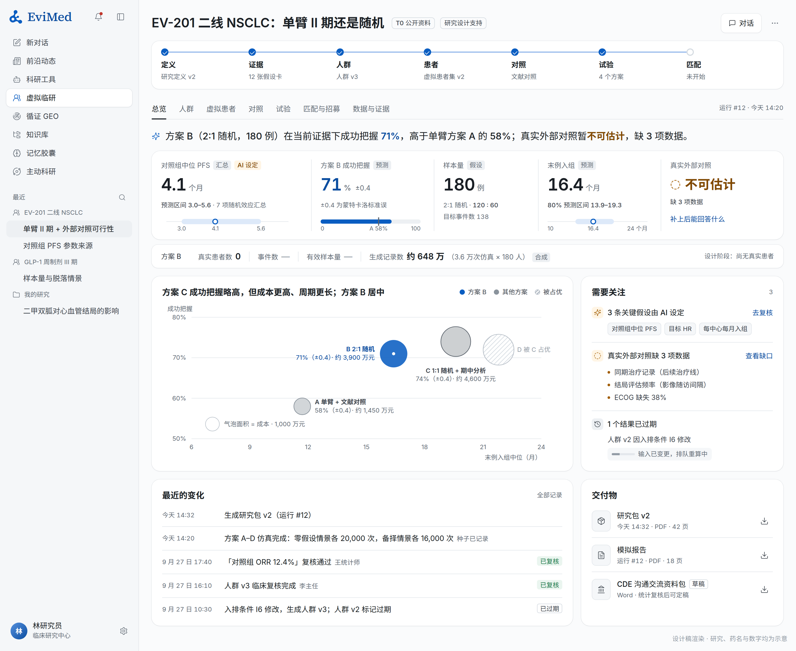
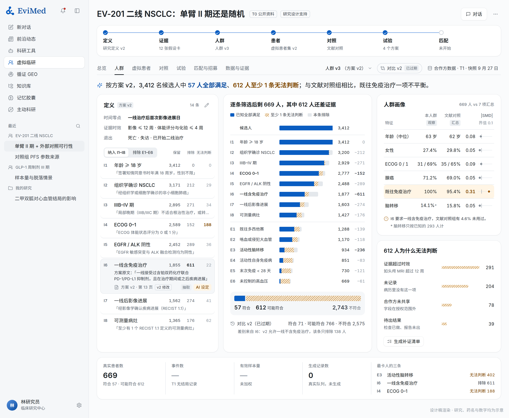
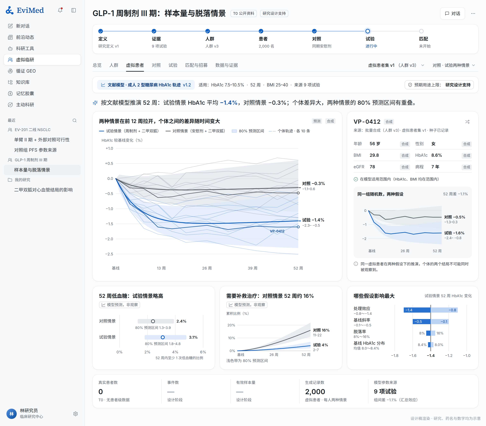
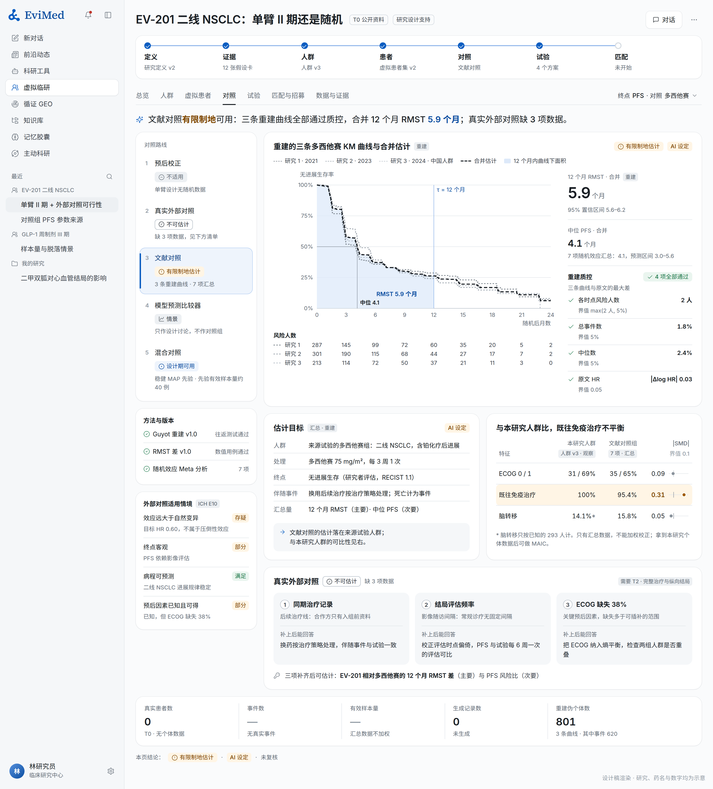
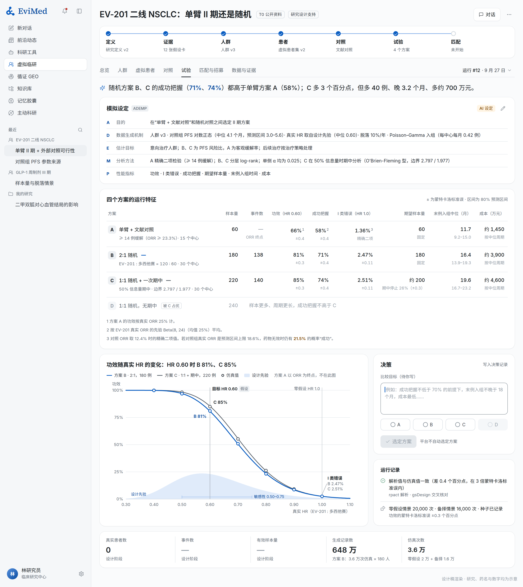
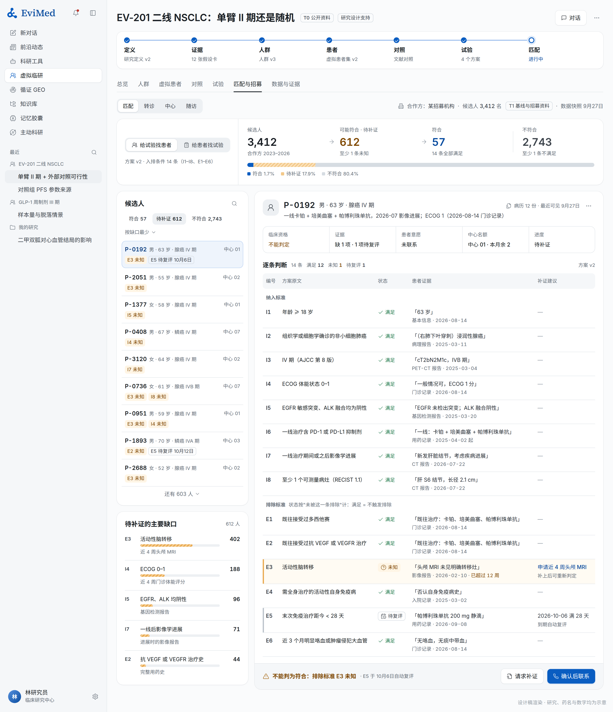
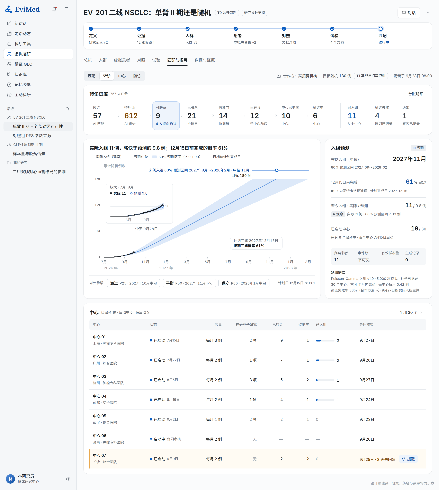
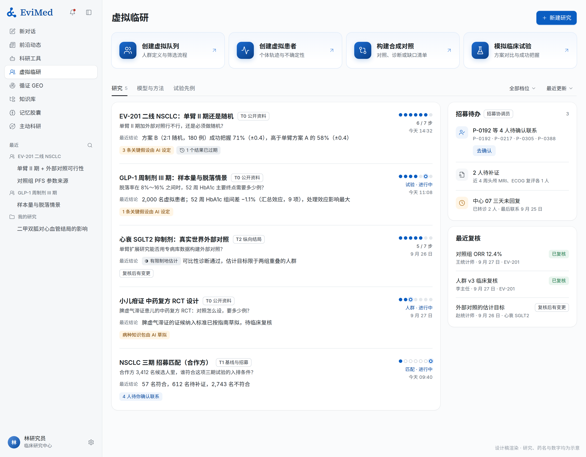
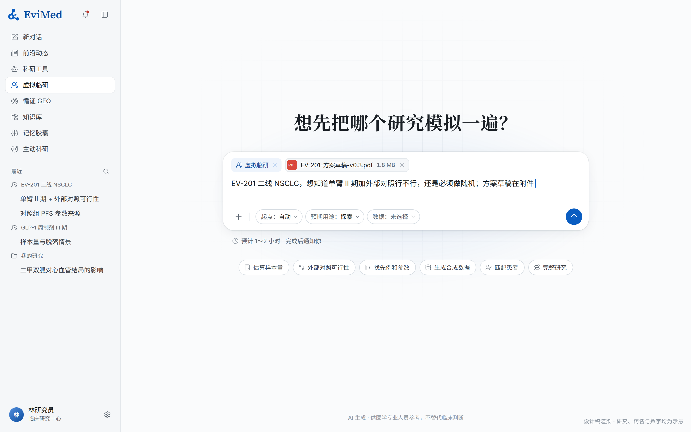

# EviMed 虚拟临研：虚拟临床研究平台方案（v2.0）

2026-09-28 · 方案，未改产品代码 · 在你的 v1.0 基础上评估并完善 · 效果图是设计渲染，研究、药名和数字均为示意

附件在 `2026-09-28-virtual-clinical-research-assets/`，包括：
- `research/`：A1 海外数字孪生与合成对照产品、A2 海外设计仿真与匹配招募产品、B 国内产品与生态、C1 方法学（对照、设计、仿真、招募）、C2 方法学（虚拟患者、合成数据、AI）、D 监管科学、E 现有代码盘点；
- `mockups/`：效果图的 HTML 源文件；
- `source/`：你的 v1.0 英文原稿。

怎么读：先看 §0 一页结论和 §1 对 v1.0 的评估；产品看 §3～§10；技术与排期看 §11～§13。

---

## 0. 一页结论

**做什么**。「虚拟临研」把一个临床研究问题做成一份能检查、能复现的研究包：
- 用真实数据或已发表的证据构建研究人群；
- 生成虚拟患者；
- 设计并检验对照；
- 在真正开展之前，把试验方案模拟一遍。

方案选定后，接到真实患者的匹配、招募和随访上，再用实际发生的结果回头校准。病种不写死：通用性来自统一的研究流程、统计方法，以及按适用范围运行、带版本的模型。

**放在哪**。侧栏一级入口，在「科研工具」下面、「循证 GEO」上面，按账号开放。
- **首页**：顶部是四个主要动作——创建虚拟队列、创建虚拟患者、构建合成对照、模拟临床试验；下面是研究列表和共享的模型与方法库。
- **研究页**：七个页签，依次为总览、人群、虚拟患者、对照、试验、匹配与招募、数据与证据。四个核心工作区排在最前。

**对你的 v1.0，我的判断**：方向对、科学边界清楚，它最难得的地方是知道什么不能说。这些全部保留：
- 值级来源标签，四个数分开；
- "不可估计"是完整的研究成果；
- 大模型不产生数字；
- 预后校正不是对照组；
- 不自动选最佳方案；
- 24 项验收场景。

需要补和改的有七处：

1. **参数从证据里来**。v1.0 的参数靠用户填。这版加了"证据参数化"：先例和文献自动抽取、带原文位置，交 Meta 引擎汇总成带预测区间的假设卡。这是 EviMed 最强、同类产品最弱的一环。
2. **新增"文献对照"**。国内大部分客户手里只有文献、没有对照组的个体数据，v1.0 的四条对照路线全要个体数据或现成模型。补上第五条：Meta 分析基准、KM 曲线重建、MAIC。
3. **虚拟试验补齐决策方法**：
   - 按 ADEMP 组织设定，用设计网格比较方案；
   - 每个数都带蒙特卡洛误差；
   - 给出按证据不确定性平均的"成功把握"；
   - 解析优先、仿真复核。
4. **患者级数据走单独的数据平面**。今天知识库挂在运行时里，原始行可能进入模型上下文。改成行级数据只给统计引擎，AI 只看结构和聚合结果。
5. **合作方数据用在对的地方**。它缺试验期间的疗效数据，但它的历史转诊和漏斗，正好是中文匹配评测集和入组预测的先验。
6. **交互和已上线的循证 GEO 一致**。十一个子页收成"首页 + 研究页七页签"；"待确认"改成先生效、后复核，人只在三处停：联系真实患者前、超出计算预算时、出现临床安全问题时。
7. **排期**：约 3～4 周上线首版全部功能。真正的长线是数值验证和合作方数据到位，不是写代码。

**和别家不一样的三点**：

1. **参数来自证据**。海外只有 Unlearn 在 2026 年 1 月才把"先例 → 参数 → 情景"串起来；国内的情报库停在检索，统计工具停在跑分析。我们每一个参数都能点回原文的那一句话。
2. **没有患者数据也能从头走到尾**。四个工作区在"只有公开资料"这一档全部能用，外部对照也能先用文献做。在国内，这一段竞争最少、最容易卖。
3. **每个数都经得起追问**，具体做法：
   - 来源标签；
   - 蒙特卡洛误差；
   - "不可估计"与缺口清单；
   - 结局封存（证明分析计划定在看结局之前）；
   - 报告数字由计算结果渲染；
   - 模拟报告按 FDA 复杂创新设计指导原则的结构出。

**你只需要给三样**：
- 说一声"开始"；
- 合作方的一份样例数据和历史转诊记录（第三阶段用）；
- 一台独立计算节点（设计网格大规模开放前用）。

---

## 1. 对 v1.0 的评估

**总的判断**：v1.0 方向对、科学边界清楚，是一份站得住的方案，它最难得的地方是知道什么不能说。它缺的是三样东西：

1. **没有把 EviMed 自己最强的能力接进来**：中英文文献检索、全文解析、Meta 分析和引文约束。参数都靠用户填，而这正是同类产品最弱、我们最强的一环。
2. **没有落到国内的数据现实上**：国内的患者级数据几乎都锁在医院和 SMO、招募公司手里（附件 B），大部分客户手里只有文献和方案。v1.0 的对照路线却全部要求个体数据或现成模型。
3. **没有和平台已经定下的交互与工程纪律对齐**：十一个子页配一条独立二级导航、大量"待确认"环节、患者级数据没有工程边界，而且统计引擎还不存在。

下面分三部分：原样保留的、要补的缺口、要改的判断。

### 1.1 站得住、原样保留的

| v1.0 的判断 | 调研印证 |
|---|---|
| 通用性来自统一流程、统计方法和按适用范围运行的模型，不来自"全病种模型" | 海外成熟产品全都按适应症发布带版本的模型：Unlearn 列了 15 个数字孪生生成器，Simcyp 按人群发布 29 个虚拟人群（附件 A1） |
| 值级来源标签，真实患者数、事件数、有效样本量、生成记录数分开 | 独立研究一再显示合成数据复现不了结局的异质性：Synthea 的高血压控制率 0%，真实值 74.5%（A1） |
| 预期用途与复核状态分开，不发"监管级""已批准"徽章 | ICH M15（2026 年 1 月 Step 4）、FDA AI 可信度框架、ASME V&V 40 都按"使用情境 × 模型风险"要求证据，没有"已验证模型"一说（附件 D） |
| "不可估计"本身是完整的研究成果 | FDA 外部对照指导原则草案；2022 年 omburtamab 因外部对照"不适合目的"被咨询委员会 16:0 否决，2023 年依氟鸟氨酸靠预先规定、高质量的外部对照获批（D） |
| 大模型不产生数字 | 平台原则 1；海外做"试验成败预测"的产品都只有厂商口径的准确率（A1、A2） |
| 预后校正是提效方法，不是对照组 | EMA 2022 年的 PROCOVA 资格意见只覆盖连续终点的随机试验，FDA 回函称其为 ANCOVA 的特例（A1、D） |
| 不自动选"最佳方案" | Cytel、Berry 的设计软件都是展示取舍，不替人做决定（A2） |
| 出组不等于读出；三种时间；缺失原因分类；不推断看不见的分组 | 与目标试验模拟的时间零点纪律一致；时间零点错位是观察性研究最常见的"自伤"偏倚（附件 C1） |
| 业务对象持久保存，对话只是过程记录 | 与循证 GEO 的做法一致 |
| 24 项验收场景 | 覆盖面完整，全部保留，另补 14 项（§12） |

### 1.2 要补的缺口

| # | 缺口 | 为什么要紧 | 这版怎么补 | 见 |
|---|---|---|---|---|
| 1 | 参数靠用户填，没用上 EviMed 的证据能力 | 设计阶段最难的就是"对照组事件率、效应量、脱落、入组速度取多少"；海外只有 Unlearn 在 2026 年 1 月把"先例 → 参数 → 情景"串起来 | **证据参数化**：先例与文献自动抽取（带原文位置）→ Meta 引擎汇总 → 带预测区间的假设卡 | §6 |
| 2 | 对照路线全要个体数据或现成模型 | 国内客户最常见的处境是"有文献、没有对照组的个体数据"（B） | 新增第五条路线**文献对照**：Meta 分析基准、KM 曲线重建、MAIC | §5.3 |
| 3 | 虚拟试验缺决策指标和方法框架 | 只看单点假设下的功效，会高估把握 | ADEMP 设定、设计网格、每个数带蒙特卡洛误差、按证据平均的**成功把握**、解析优先仿真复核 | §5.4 |
| 4 | 入组仿真的方法没定 | 入组延误是试验最常见的失败原因，也是招募客户最关心的数 | Poisson–Gamma 模型，先例给弱先验，合作方漏斗更新，预测登记后与实际对照 | §7.2 |
| 5 | 患者级数据没有工程边界 | 今天知识库挂进每个运行时，原始行可能进入模型上下文（附件 E） | **独立数据平面**：行级数据只给统计引擎，AI 只看结构与聚合 | §8.1 |
| 6 | 确定性的统计与仿真引擎还不存在 | 运行时只有 numpy、statsmodels 和 R 基础包，没有 MatchIt、survRM2、rpact 等（E） | 新引擎 `vcr-engine`，以 R 为主，版本锁定，按冻结的场景运行，出签名回执 | §11.4 |
| 7 | 合作方数据的价值被低估 | 只看到"缺疗效数据"；这类数据在国内招募、SMO 行业普遍存在，最适合做的恰是匹配和招募（B） | 历史转诊 + 是否入组 = 中文匹配评测集；历史漏斗 = 入组预测的先验 | §7.4 |
| 8 | 模型只有模型卡，缺"按用途要证据"的规则 | 同一个模型用于探索和用于申报，要求完全不同（D） | 按"模型分量 × 决策后果"定四级模型风险；证据不够时自动降低结果的预期用途，不拦截 | §8.2 |
| 9 | "事先规定"无法被证明 | 外部对照最常被质疑"看了结局再定方案"（D） | **结局封存**：确证性用途下结局字段在分析计划冻结前不可读，研究包给出两个时间戳 | §6.5 |
| 10 | "报告数字与计算一致"只是一条验收 | 靠检查去追，永远追不完 | 报告数字由结果渲染，从构造上保证一致 | §8.3 |
| 11 | 缺面向监管与卫生技术评估的交付 | 药企买的是"能拿去沟通"的材料 | 模拟报告按 FDA 复杂创新设计指导原则的结构；可选 CDE 沟通交流资料包；监管沟通记录 | §5、§8.3 |
| 12 | 定位和价格没落到国内市场 | 医生侧统计工具年费几百到几千元，药企侧项目几十万到几百万元，用一个中间价两边都卖不动（B） | 两条价目；先用"设计阶段"低价入口获客 | §3.7 |

### 1.3 要改的判断

| v1.0 | 这版 | 理由 |
|---|---|---|
| 十一个子页加总览，放在一条独立的二级导航里 | **首页 + 研究页**：首页四个主要动作 + 研究列表 + 模型与方法；研究页七个页签 | 和已经上线的循证 GEO 同一结构；设计规范规定页签最多七个、全站只有一条导航（§9） |
| "待确认假设""专家审核"放在流程前面 | **先生效、后复核**：AI 设定的值立即生效并标来源；人只在三处停——联系真实患者前、超出计算预算时、出现临床安全问题时 | 平台的设计理念是 AI 全流程驱动、用户少确认；复核改成针对具体版本的签注（§10） |
| 首版 12～16 周，2 名应用工程师、1 名统计 / 数据工程师、1 名测试 | **工程约 3～4 周**，数值验证与之并行；先建数据平面和引擎 | 参照循证 GEO 的实际节奏（9 月 24 日出方案、25 日上线，7 个工作包并行）；真正的长线是数值验证和合作方数据到位（§13） |
| §15.5"当前代码里没有 GEO 一级路由" | 已不成立：GEO 自 9 月 25 日起就在侧栏「科研工具」下面，「虚拟临研」插在两者之间即可 | 附件 E §2.1 |
| 通篇用"数字孪生"讨论虚拟患者 | 主名称用"虚拟患者"，"数字孪生"只给患者条件化、有验证记录的模型 | 国内"数字孪生"热度高、验证少（齐鲁医院 2026 年 9 月以 262.5 万元采购"数字孪生虚拟临床试验体系"），名字要经得起追问（B） |
| 对照路线的顺序按方法类别 | 按"有无先例、要什么数据"排序，预后校正排第一并写明它的范围 | 让用户先看到最有把握的路线（§5.3） |
| 外部对照可用多种估计目标 | 默认 ATT（加权到试验人群），换估计目标必须标明 | 单臂试验加外部对照时，要回答的就是试验人群里的效应（C1） |

---

## 2. 调研看到的（详见附件 A～E）

这次查了五十多家海外和国内产品、一百多篇方法学文献，以及 ICH、FDA、EMA、CDE 的现行文件，并盘点了现有代码。本章只写对方案有直接影响的发现；每条的出处和更多细节见附件。

### 2.1 海外：数字孪生、合成对照与 in silico 试验（附件 A1）

- **没有"通用虚拟患者"**。成熟产品都是按适应症发布、带版本号的模型：Unlearn 官网列了 15 个数字孪生生成器（阿尔茨海默病 4.1、ALS 4.0……抑郁症 1.0），规格书要申请才给；Certara 的 Simcyp 按人群发布 29 个虚拟人群，其中有中国人群。
- **监管明确接受过的"AI 数字孪生"用法只有一种**：在随机试验里做预后协变量校正（PROCOVA）。EMA 2022 年的资格意见只覆盖连续终点；FDA 回函说它是 ANCOVA 的特例，并提醒"未校正的样本量往往更保守"。AbbVie 与 Unlearn 合著的再分析显示残差方差降 9～15%，对照组可以少 17～26%；一项独立研究复现了约 10～20% 的效率增益。
- **外部对照的先例都是逐案判断，"获 FDA 支持"不等于获批**：Medidata 为 Medicenna 做的混合合成对照在 2020 年获得 FDA 对设计的支持，但这项 III 期到 2026 年仍在找合作方，没有启动。**卫生技术评估更严**：2021～2023 年法、英、德、挪威四国 123 份肿瘤评估报告涉及 175 个外部对照，没有一个被无条件接受，只有 17% 没被拒，德国和挪威全部拒绝。Flatiron 自己也说，用回顾性病历做外部对照"近期可行性有限"，更现实的是自然史基准和对照选择。
- **外部对照产品的护城河是数据，不是算法**：Medidata 称有 3 万多项试验、900 万患者的数据，Phesi 称 3 亿多条患者记录；倾向得分、加权、双稳健估计都是公开方法。
- **队列构建的交互已经收敛**：OHDSI ATLAS 的"入组事件 → 命名纳入规则（逐条计数）→ 退出"、TriNetX 的即时计数和一键比较、Truveta 的定义库。不需要自创范式。
- **合成数据的独立证据只支持结构、流程和可行性，不支持疗效**：Synthea 的高血压控制率 0%（真实 74.5%）、髋膝置换并发症 0%（真实 2.9%）；MDClone 的合成数据在 5 项观察性研究里"大体"复现了结论，但不是全部。
- **"试验成败预测"类产品只有厂商口径的准确率**（QuantHealth 称 85%，VeriSIM 称近 90%），没有独立同行评审。Nova 的 jinkō 在 FLAURA2 读出前 3 天公开预测 HR 0.602（95% 预测区间 0.49～0.736），实测 0.62，是少数公开的前瞻案例，但只是一次、一个病种；它的做法——读出前公开带时间戳的预测——值得借。

### 2.2 海外：设计仿真、先例与匹配招募（附件 A2）

- **虚拟试验最接近的成熟参照是统计设计软件**：Cytel East Horizon（2024 年由 East 与 Solara 合并）主打"数千个设计变体 × 几十种不确定性"的设计网格和取舍可视化；Berry FACTS 以"情景网格 + 设计比较"为主界面，并能导出每一次模拟的结果。它们都展示取舍，不替人选。
- **入组预测一定是概率式的，并且要接实时数据**：Cytel Enforesys 给出"按期完成的概率"和"激进 / 平衡 / 保守"三档；2026 年 7 月接入 Citeline 的历史中心数据。Lokavant 在 2025 年被试验执行平台收购，说明预测必须接运营数据才有价值。
- **Unlearn TrialPioneer 在 2026 年 1 月重新发布**，把先例（Scout）、历史数据核对假设（Hindsight）和情景比较（SimLab）放进同一个工作台——与本方案的"先例 → 参数 → 情景"同一思路，而我们多了中英文文献和 Meta 引擎。
- **方案正在变成结构化对象**：Faro Health 和 Medidata Protocol Optimization（2025 年 5 月）把方案拆成访视与操作日程，由代码算出患者负担、中心负担和成本；Faro 能导出 CDISC USDM JSON。
- **公开的试验登记足以支撑首版先例库**：ClinicalTrials.gov API v2 有实际与预计入组人数、起止日期、入排原文、中心列表和结果模块；但**没有**筛选失败率、每个中心的入组数和中心启动日期，这些只能来自合作方。
- **匹配以 TrialGPT 为参照**：检索 → 逐条判定并附证据句 → 排序；NIH 在 2026 年 9 月 1 日发布了 2.0 版，加了临床优先级排序和 6 个月的前瞻部署。**公开准确率远弱于营销口径**：TrialGPT 的 87.3% 来自 183 名合成病例；在真实病历上，PRISM 研究的逐条准确率为 63%～68%，医生之间的一致率也只有 64%～70%；合作机构引用的"约 95%"其实是"前 3 名里含合格试验"的试验级指标。Deep 6 AI 在 2025 年 3 月以 1,740 万美元被 Tempus 收购。招募侧已分化为中心网络、患者端市场和 AI 材料生成三类。

### 2.3 国内：产品、数据与买家（附件 B）

- **国内没有"通用虚拟临研"的现成对手**，只有三类局部玩家：
  - 医院里的真实世界数据与科研平台，靠院内部署和项目制。医渡 2026 财年收入 8.19 亿元，首次全年盈利。
  - 临床运营数字化与招募，如太美、SMO、招募公司。
  - 刚冒头的"数字孪生虚拟试验"：山东大学齐鲁医院 2026 年 9 月公开采购"数字孪生虚拟临床试验体系"，预算 262.5 万元；另有哲源科技等初创。
- **患者级数据几乎都锁在医院和 SMO、招募公司手里**。平台公司拿数据的方式是部署进医院加项目制服务。**院内观察性队列这条路已经很挤**：森亿的院内科研平台已经把"文献选题 → 用历史全量数据验证样本量 → 纳排与随访 → 匹配统计方法"做成一体。
- **没有患者数据的"设计阶段链路"竞争最少、最好卖**：
  - 国内情报库（医药魔方、摩熵、药智）停在检索和竞品情报；
  - 统计工具停在"跑分析"；
  - 没有人把"先例 → 参数 → 仿真"做成一条链。
- **招募是真实的付费点，但 C 端流量模式已被证伪**。肿瘤入组一例在高峰期要 8～10 万元，约为常年的两倍；京东健康的招募中心一年挂出 400 多项试验，108 个项目只收到 670 例报名。行业共识是"互联网用户和试验要的患者是两拨人"。头部 SMO 已经在卖用历史执行数据做的选点和入组模型（普蕊斯），太美的智能体把中心评估从 7 天压到 16 小时。
- **合作方这类数据在国内招募、SMO 行业普遍存在**（入组前资料、方案、出组日期与原因、出组后常规诊疗），最适合校准招募仿真。
- **外部对照在国内以咨询项目交付，方法质量参差**：一篇综述统计的 67 项单臂 + 外部对照研究里，82% 用历史对照，只有 37% 提到混杂控制。
- **价格两极**：医生侧在线统计工具，例如 SPSSAU 个人版每年 2,588 元；药企侧的真实世界研究、统计外包、数字孪生项目是几十万到几百万元，太美 2023 年年贡献 50 万元以上的核心客户有 235 家。
- **中文入排结构化已有公开基础**：CHIP-CTC 把中国临床试验注册中心的入排条件分成 44 类，约 4 万条标注；CHIP 2025 出了"按入排条件找出合格患者"的评测。中医证候只有 TCM-SD（54,152 份病历、148 种证候）等少量资源，这既是空白，也是门槛。
- **国内试验量在涨**：2025 年登记新药临床试验 2,997 项（+18%），其中 1 类创新药占 72.4%，抗肿瘤占 37.5%。

### 2.4 方法学：对照、设计、仿真与招募（附件 C1）

- **目标试验模拟**（Hernán 的七要素）加上 **ICH E9(R1) 估计目标**的五个属性，是外部对照和虚拟试验共同的骨架；2025 年发表的 TARGET 报告规范把它变成了报告条目。
- **观察性研究模拟 RCT 能不能对上**：RCT-DUPLICATE 用美国理赔数据模拟 32 项 RCT：设计要素能紧密模拟的 16 对，结果相关系数 0.93；不能紧密模拟的 16 对只有 0.53。能不能逐项模拟目标试验，决定了结果可不可信。**Trial Pathfinder**（Nature 2021）发现许多入排条件对疗效几乎没有影响：按数据放宽后，合格人群平均增加约 107%。
- **外部对照首版用一个加权内核**：熵平衡加权到试验人群（ATT），时间事件终点以限制平均生存时间（RMST）为主；R 生态（MatchIt、WeightIt、cobalt、survRM2、adjustedCurves）明显比 Python 成熟。
- **文献对照有成熟方法**：Guyot 重建 KM、MAIC / STC（NICE DSU TSD 18）、生存外推（TSD 14、21，flexsurv）；MAIC 的权重与熵平衡在数学上等价，可以共用一个内核。
- **贝叶斯借用**：稳健 MAP 先验（RBesT）可以直接从文献 Meta 分析推出来。但在严格控制 I 类错误的前提下，借用一般换不来功效（Kopp-Schneider 等 2020）；异质性还给能借到的信息设了上限。
- **仿真研究要按 ADEMP 设定**，每个指标带蒙特卡洛标准误，重复次数由目标精度推算。设计比较按"假设 × 方案 × 指标"三轴组织（Clinical Scenario Evaluation）；**成功把握**（assurance）用证据推出的设计先验计算。
- **入组预测**：Poisson–Gamma 模型（Anisimov & Fedorov 2007）是多中心入组预测的主流，可以随实际入组做贝叶斯更新；注册库推出的中心入组率会系统性偏低，只能当弱先验。

### 2.5 方法学：虚拟患者、合成数据与 AI（附件 C2）

- **首版合成人群只用"白盒"生成器**：声明式的参数化定义（simstudy 的语义），或按列顺序的 CART 合成（synthpop）。深度生成模型以后再加，而且没有一个模型能在保真、效用和隐私上同时最好（Yan 等 2022）。
- **合成不等于匿名**：合成数据的隐私收益不可预测，离群记录风险最高（Stadler 等，USENIX Security 2022）；基于相似度的检查能被重建攻击绕过。
- **数字孪生的严格定义**（美国国家科学院 2023）要求随新数据更新、服务于决策，并贯穿验证、确认与不确定性量化；只基于基线的一次性预测不算。
- **EHR 基础模型**（Delphi-2M、Foresight、MOTOR、CoMET）可以作为标明的"研究模型"提供人群轨迹，但它们学到的是记录里的共现，不是治疗效应。
- **大模型扮演的病人**（AgentClinic、Agent Hospital、Patient-Ψ）是训练对话能力的环境。"硅样本"研究显示大模型代答会压缩方差、把群体扁平化，所以不能当人群数据用。
- **匹配**：最常见的错误是时间窗、否定句和"缺失当满足"（合成病例上逐条准确率约 87%，真实病历上约 63%～68%，见 §2.2）。正确的做法是：
  - 大模型负责抽取证据，并给出原文位置；
  - 代码用三值逻辑判定；
  - 评估以合格者召回率和误排除率为主。
- **标准只对齐、不实现**：
  - 方案字段对齐 ICH M11（2025 年 11 月定稿）和 CDISC USDM v4；
  - 统计引擎统一读 ADaM 形状的三张表；
  - 数据质量检查按 Kahn 框架分类。

### 2.6 监管科学：各方要什么（附件 D）

- **全球口径已统一为"问题 → 使用情境 → 模型风险 → 可信度证据"**，不存在"模型已获批"：ICH M15 于 2026 年 1 月 29 日达到 Step 4，FDA 于 2026 年 6 月定稿；FDA 的 AI 可信度七步框架仍是 2025 年 1 月的草案；FDA 与 EMA 在 2026 年 1 月联合发布了药物研发良好 AI 实践的十条原则。
- **外部对照**：FDA 2023 年的外部对照指导原则至今仍是草案；EMA 的单臂试验反思文件已定稿；CDE 在 2026 年发布了《药物临床试验中应用贝叶斯外部信息借用方法的指导原则（试行）》，FDA 在 2026 年 1 月发布了贝叶斯方法指导原则草案。几方的共同要求：分析计划要在接触结局之前定下，时间零点、终点、随访要可比，要有患者级数据、偏倚分析和敏感性分析。
- **先例**：
  - 2022 年，omburtamab 用跨越 25 年的登记数据做外部对照，被 FDA 咨询委员会以 16:0 否决；
  - 2023 年，依氟鸟氨酸用预先规定、来自高质量临床试验的外部对照（1:3 倾向得分匹配），加上多重敏感性分析获批；
  - 药物领域没有任何监管机构接受"模型生成的对照组"替代同期对照。
- **模拟报告有成文结构**：FDA 复杂创新设计指导原则（2020）要求写明情景（含零假设）、数据生成模型、运行特征、蒙特卡洛误差、代码与种子。
- **审计与可复现**：ICH E6(R3) 于 2025 年定稿；中国 2026 版 GCP 于 2026 年 9 月 1 日施行，新增"数据治理"一章。执行快照不可变、全量审计追踪，正是申办方做系统验证时要看的东西。
- **国内路径**：
  - CDE 的真实世界证据系列（2020、2021、2023）和沟通交流指导原则（2023）；
  - 罕见病自然史研究指导原则（2023）；
  - 中药"三结合"审评证据体系与人用经验；
  - 海南乐城试点：至 2025 年 3 月，已有 21 个产品经该路径获批。

### 2.7 借什么、不借什么

| 借 | 来自 | 用在 |
|---|---|---|
| 按适应症、终点、时间窗发布带版本号的模型；规格书就是模型卡 | Unlearn、Simcyp | §8.2 |
| "先例 → 参数 → 情景"一条链，假设显式可追溯 | Unlearn TrialPioneer | §6 |
| 入组事件 → 命名纳入规则（逐条计数）→ 退出；定义与生成分开；定义库 | ATLAS、Truveta | §5.1 |
| 改一条条件立刻出人数；两个人群并排比较 | TriNetX | §5.1 |
| 设计网格、取舍可视化、逐次模拟结果可导出 | Cytel、Berry FACTS | §5.4 |
| 概率式入组里程碑、风险档位 = 承诺哪个分位数、随实际重算 | Cytel Enforesys、Lokavant | §7.2 |
| 逐条判定 + 证据句 + 解释，排序与资格分开 | TrialGPT | §7.1 |
| 从结构化入排条件生成预筛问卷 | Antidote、Carebox、太美药试圈 | §7.2 |
| 校正后与未校正的样本量并排显示 | FDA 对 PROCOVA 的提醒 | §5.3 |
| "设计 → 复核"工作流：先在合成数据上写分析，再在真实数据上跑 | MDClone | §5.1 |
| 读出前公开带哈希时间戳的预测，读出后并排对照 | Nova（FLAURA2） | §5.4 |
| 外部对照前先单独交付"数据适用性评估"；可比性按十个维度逐项评估 | BPGbio 与 Truveta、FDA 外部对照指导原则草案 | §5.3 |

| 不借 | 为什么 |
|---|---|
| "合成对照替代对照组""数字孪生可以替代试验数据"的说法 | 药物领域没有这样的监管先例；我们的研究包要经得起追问 |
| 无法复核的精度宣称（"预测准确度提升 70 倍""准确率 85%"） | 我们报告校准和覆盖率，不报口径不明的准确率 |
| 单一的"试验成败分" | 与"不自动选最佳方案"冲突；我们给的是有公式、可复现的成功把握 |
| 自动挑选"成功概率最高"的设计 | 选择由研究团队做，理由进决策记录 |
| 大模型直接生成先例数字、患者档案或结局 | 数字只来自原文抽取（可逐字核对）或统计引擎 |
| 院内部署 + 专病库、EDC / CTMS、医学写作自动化 | 那是别人的主战场，不是我们的差异点 |
| 面向患者的招募市场和流量补贴 | 单位经济被补贴扭曲，互联网用户和试验需要的患者不是一拨人 |

---

## 3. 产品定义

### 3.1 一句话

**「虚拟临研」把一个临床研究问题做成一份能检查、能复现的研究包**：用真实数据或已发表的证据构建研究人群，生成虚拟患者，设计并检验对照，在真正开展之前把试验方案模拟一遍；方案选定后，再接到真实患者的匹配、招募和随访上，用实际发生的结果回头校准。

它回答五个问题，每个问题对应一个工作区：

| 问题 | 工作区 | 交付什么 |
|---|---|---|
| 我要研究的这群人怎么定义，现有数据能覆盖多少？ | 虚拟队列 | 人群定义、筛选流程、人群画像、人群快照 |
| 在给定模型和情景下，这类患者可能怎样变化？ | 虚拟患者 | 个体轨迹、群体分布、不确定性、影响因素 |
| 应该和谁比，这个比较有多可靠？ | 合成对照 | 对照定义、可比性诊断、效应估计或"不可估计"结论与缺口清单 |
| 试验怎么设计，成功把握多大、要多久、花多少？ | 虚拟试验 | 方案 A/B/C 的功效、成功把握、样本量、周期、成本和敏感性 |
| 谁符合条件，怎样把他们带进研究？ | 匹配与招募 | 逐条件判断与证据、转诊进度、入组预测与实际对照 |

### 3.2 按数据条件分四档：每一档都能完整用

v1.0 的"数据条件表"是整个产品最重要的一张表，这里把它扩成"数据档位 × 模块"。**没有任何患者数据的用户也能从头走到尾**，这是和海外同类产品拉开距离的地方：它们大多要求先有历史患者数据（见 §2）。

| 档位 | 手里有什么 | 虚拟队列 | 虚拟患者 | 合成对照 | 虚拟试验 | 匹配、招募与随访 |
|---|---|---|---|---|---|---|
| **T0 公开资料** | 方案草稿、文献、试验登记、说明书、指南 | 情景人群、文献人群 | 情景模型、文献模型 | 文献对照（基准率、重建生存曲线） | 设计仿真、成功把握、入组预测（先例参数） | 试验先例、入排条件结构化 |
| **T1 基线与招募资料** | 入组前病历、招募漏斗、出组日期与原因、出组后常规随访 | 真实队列、覆盖检查、经验合成人群 | 基线条件化的情景 / 文献模型 | 文献对照 + 人群可比性检查（我方基线对比文献对照组基线） | 用真实漏斗校准入组预测 | 双向匹配、转诊、中心协作、出组后观察研究 |
| **T2 完整治疗与纵向结局** | 专病库、登记研究、既往真实世界数据 | 同上 + 纵向覆盖 | 数据模型（内部验证） | 真实外部对照 | 用真实结局分布做仿真 | 同上 |
| **T3 随机试验个体数据** | 申办方既往或当前试验 | 同上 | 验证模型（外部验证） | 预后校正、混合对照 | 用试验数据校准 | 同上 |

现在的合作方属于 T1：入组前资料、方案、出组日期与原因、出组后常规诊疗都有，试验期间的分组、实际用药和结局没有。它最有价值的用途是**匹配、招募预测和出组后的观察研究**：它的历史转诊记录连同后来是否入组（有出组记录的人一定入过组；若还保留了筛选失败原因，评测更完整），正好是一套真实的中文匹配评测集；它的招募漏斗正好用来校准入组预测（§7.4）。它不能用来估计原试验的疗效，平台也不会从出组后的记录反推试验期间的分组。以后拿到 T2、T3 数据的客户不受这家合作方的限制。

### 3.3 "通用"怎么成立

病种不写死。一个研究落到某个病种上，靠的是四样东西，每样都单独版本化：

| 资源 | 内容 | 它不能证明什么 |
|---|---|---|
| **病种知识包** | 术语与编码、表型定义、常用终点、常见入排条件、数据映射、临床背景；中医病种可带证候维度 | 不代表有预测能力 |
| **证据参数** | 从试验先例和文献里抽出、带原文出处、经 Meta 分析汇总的参数：对照组事件率、中位生存、效应量、脱落率、每中心每月入组数、筛败率 | 不代表适用于你的人群；异质性和预测区间照实显示 |
| **模型包** | 输入要求、输出语义、适用范围、版本、验证与限制（§8.2 模型卡） | 超出声明范围的因果或预测结论 |
| **方法包** | 估计方法、仿真方法、支持的终点、前提假设、数值测试 | 不代表你的数据适合用它 |

一个新病种第一次出现时，AI 从文献和指南里起草一个最小知识包（术语、终点、常见入排条件），标"AI 草拟"，研究照常往下走；后续用得多了再补全。**证据参数是 v1.0 没有单列、这版新增的一样**：它把 EviMed 已有的文献检索、全文解析和 Meta 分析引擎，直接变成虚拟研究的参数来源（§6）。

### 3.4 核心对象：一条血缘链

所有工作区共用一组对象，每个对象都有版本，下游永远引用上游的某个具体版本（对象之间的关系见 §4 的流程图）：

- **研究**：挂在一个普通项目上（和循证 GEO 一样：一个虚拟临研研究 = 一个普通项目 + 一份研究档案），对话、文件、记忆照常归这个项目。
- **研究定义**：研究问题、PICO、估计目标（ICH E9(R1) 的五个属性：人群、处理、终点、伴随事件及处理策略、群体层面汇总量）、预期用途。AI 从第一句话或上传的方案里起草，所有下游都引用它的某一版。
- **假设卡**：每个参数一张（§6.1），贯穿四个工作区。
- **数据快照**：一次接入的数据冻结成不可变版本，带哈希、字段映射、可见时间窗和质量画像。
- **人群版本 → 虚拟患者集 → 对照设计 → 试验情景 → 运行 → 结果包**：一次运行冻结它用到的全部输入（人群版本、模型与方法版本、假设卡版本、随机种子、计算环境），结果不可改，只能被新版本取代。
- **匹配评估、转诊记录、随访片段、决定记录**：业务侧对象，各自持久保存，不写回临床事实。

上游任何一处改动（改了一条入排条件、换了一张假设卡、修正了一条源数据），平台沿血缘链把受影响的结果标成"已过期"，并列出需要重算的内容（§6.3）。

### 3.5 来源标签和四个数

沿用 v1.0 的值级来源标签，并补两类文献来源的标签，一共九类。界面上每个数字都能看到它属于哪一类：

| 标签 | 含义 | 例 |
|---|---|---|
| 观察 | 可访问来源里记录的值 | 病历里的基线 ECOG |
| 抽取 | 从来源转写或标准化，带原文位置 | 从出院小结抽出的既往治疗线数 |
| 计算 | 由其他值确定性算出 | 由身高体重算出的 BSA |
| 插补 | 按声明的缺失数据方法填补 | 多重插补的基线 LDH |
| **汇总** | 已发表文献报告的汇总统计量（新增） | 某试验对照组 ORR 12.4% |
| **重建** | 从已发表图表重建的伪个体数据（新增） | 从 KM 曲线重建的 213 例伪个体生存数据 |
| 预测 | 某个具名模型的输出 | 模型预测的 12 个月无进展概率 |
| 假设 | 情景参数 | 设定的脱落率 15% |
| 合成 | 模拟出来的记录或轨迹 | 生成的 2,000 名虚拟患者 |

混合了几类来源的结果，保留每一部分的来源，不因为显示在同一张表里就被当成"观察"。**重建数据永远不画成真实的 KM 曲线，汇总数据永远不当作个体数据参与加权**。

凡是涉及样本量的地方，至少分开显示四个数：**真实患者数、事件数、加权有效样本量、生成记录数**；用到先验借用时，再单独显示**先验有效样本量**；用到文献重建时，单列**重建伪个体数**。生成 1 万名虚拟患者不会让任何一个区间变窄。

### 3.6 三种状态分开说

一个结果同时有三种互不替代的状态，界面分开显示：

| 状态 | 取值 | 谁决定 |
|---|---|---|
| **运行状态** | 进行中 / 已完成 / 已完成·有提示 / 未完成 / 已取消（沿用平台现有词表） | 系统 |
| **科学结论** | 可估计 / 有限制地估计 / 不可估计（附缺口清单） | 方法本身的诊断 |
| **复核状态** | AI 设定 / 已复核（谁、何时、针对哪个版本）/ 复核后有变更 | 复核人签注 |

"不可估计"是一份完成的研究成果：它写清楚缺哪几项数据、每项数据补上后能回答什么。**运算完成不等于科学上成立，科学上成立不等于有人复核过**，三者任何一个都不替代另外两个。

模型另有一个**可信度层级**，决定它的输出能用在哪里（详见 §8.2）：

| 层级 | 含义 | 能用于 |
|---|---|---|
| 情景模型 | 数学仿真，参数全部是设定值 | 探索、设计讨论 |
| 文献模型 | 参数由已发表证据估计，适用范围等于来源人群 | 设计支持、可行性评估 |
| 数据模型 | 用授权的个体数据拟合，有内部验证 | 设计支持、指定研究的分析（在声明范围内） |
| 验证模型 | 有独立数据的外部验证，适用范围逐项声明 | 指定研究的分析、申报准备的支撑材料（在声明范围内） |

预期用途沿用 v1.0 的四级（探索、研究设计支持、指定研究分析、申报准备），与可信度层级对照使用：一个结果能标的最高用途，由它用到的最低一级模型决定。

### 3.7 买家、切入顺序和收费结构

**对外定位**：院外的、从设计阶段做起的、证据驱动的研究设计与模拟工作台。不做院内数据中台和专病库（医渡、森亿的主业，靠院内部署和项目制），不做 EDC / CTMS（太美的主业），不在医学写作和统计编程自动化上正面竞争（深度智耀等在做）。国内目前没有"通用虚拟临研"的现成对手，只有三类局部玩家：医院里的真实世界数据与科研平台、临床运营数字化与招募、刚冒头的"数字孪生虚拟试验"项目（附件 B）。

| 买家 | 他们要完成的事 | 最先用哪块 | 愿意为什么付钱 |
|---|---|---|---|
| 生物科技公司的临床开发与统计 | 选设计、定样本量、判断单臂加外部对照是否可行 | 虚拟试验、合成对照、证据参数 | 设计阶段的决策依据；外部对照可行性评估；能拿去和监管沟通的材料 |
| CRO 与统计外包 | 把方案变成可执行的计划，做可行性 | 虚拟试验、先例、匹配 | 省下的统计与可行性工时 |
| 医院研究者（研究者发起的研究） | 样本量、方案统计部分、可行性 | 设计阶段链路 | 低价、自助、快 |
| 招募公司与 SMO | 从候选人里更快找到合格的人，转介给中心 | 匹配、招募与中心协作 | 每例有效转介少花的预筛工时；筛选失败率 |
| 医院科研处 | 管理本院研究 | 以后 | —— |

**切入顺序**：先用没有任何患者数据也能跑通的**设计阶段链路**（先例 + 证据参数 + 样本量与功效仿真 + 文献对照 + 方案统计部分草稿）获客，这是国内竞争最少、最容易卖的一段（B）；同时和合作方把**匹配与招募**跑起来，这是最直接的收入；外部对照先以"**可行性评估包**"作为第一个标准化商品，结论允许是"不可估计"。

**收费结构分两条价目，不用一个中间价同时卖两类人**：

- **个人 / 科室订阅**：设计阶段链路 + 一定的计算额度，价位对标国内在线统计工具（年费几百到几千元量级，例如 SPSSAU 个人版每年 2,588 元）；试验先例检索和参考情景的设计仿真可以免费，作为入口（Unlearn 2024 年的免费 TrialPioneer 也是这么获客的，附件 A1）。
- **机构订阅 + 项目包**：数据接入、真实队列、外部对照可行性与分析、模型验证服务，价位对标 CRO 统计与真实世界研究项目（几十万到几百万元量级）。每个统计方法的**验证文档包**可以单独收费（rpact 的做法），申办方做系统验证时要用。海外设计软件的价格可作参照：nQuery 每人每年约 995～7,795 美元，PASS 约 1,195 美元（附件 A2）。
- **匹配与招募按"活跃研究方案 × 月"或席位计费**，不按生成患者数、候选人数或转诊人数计价——那样计价会和"生成的记录不是证据""候选不等于入组"自相矛盾（附件 A2）。

收费的落地随平台的结算一起做（9 月 19 日定的：C 端的底座和结算等上线推广时再说）；这里先把结构定下来，首版按账号开放、不收费。

---

## 4. 总流程：七步，每一步都能单独用

v1.0 的主线是"定义研究问题 → 构建研究人群 → 生成虚拟患者 → 设计对照 → 模拟试验 → 匹配真实患者 → 用可获得的数据验证与改进"。这版保留这条主线，只在第一步后面插入"找证据、定参数"：没有这一步，后面每一步的参数都只能靠用户手填，而这恰好是 EviMed 最擅长、同类产品最弱的一环。

| 步骤 | AI 自动做什么 | 你看到什么 | 产出对象 |
|---|---|---|---|
| **1 定义问题** | 从一句话或上传的方案里起草 PICO、估计目标、主要终点及其类型、预期用途；只在答案会改变下一步时才问 | 研究定义卡，每个字段标来源（"方案第 12 页""AI 设定"） | 研究定义 |
| **2 找证据、定参数** | 检索试验登记和文献里的同类研究，逐项抽出对照组事件率、中位生存、效应量、脱落率、入组速度（带原文位置），交 Meta 分析引擎汇总 | 试验先例表、每个参数的森林图和预测区间 | 试验先例、假设卡 |
| **3 构建人群** | 按数据档位选路：有数据就筛真实队列，没数据就按文献基线表或设定分布生成 | 筛选流程（每步保留、排除、无法判断的人数）、人群画像、与文献对照组的可比性 | 人群版本 |
| **4 生成虚拟患者** | 选用能覆盖该人群和终点的最高一级模型；没有就用文献模型或情景模型，并标明 | 单个虚拟患者的轨迹与区间、群体分布、哪些假设影响最大 | 虚拟患者集 |
| **5 设计对照** | 按数据档位列出可行的对照路线，逐条做可比性诊断；不可行就交付缺口清单 | 重叠与平衡、有效样本量、效应估计与敏感性，或"不可估计"与缺口 | 对照设计与结果 |
| **6 模拟试验** | 默认起草三个对比方案（例如单臂 + 文献对照、2:1 随机、1:1 随机加期中分析），跑功效、成功把握、周期、成本和敏感性 | 方案 A/B/C 并排，每个数带蒙特卡洛误差 | 试验情景与结果 |
| **7 匹配、招募与校准** | 把选定方案的入排条件结构化，双向匹配授权患者，跟踪转诊与入组，用实际入组和筛选结果回头校准参数 | 逐条件判断与证据、转诊看板、预测与实际对照 | 匹配评估、转诊、校准记录 |

**任何一步都能单独用，缺的上游由 AI 补一个最小版本**，补出来的部分标"AI 设定"，以后想做完整流程，在同一个研究里接着说，做过的不重做。常见的单项用法：

| 你说 | AI 做 | 大约多久 |
|---|---|---|
| "PFS 预计 HR 0.70、对照中位 6 个月、两年入组，要多少例？" | 最小研究定义 + 三张假设卡 → 解析公式给答案，再用仿真核对并加上脱落和入组节奏 | 几分钟 |
| "近五年国内 NSCLC 二线单臂 II 期的 ORR 和入组速度是多少？" | 先例检索、抽取、汇总 | 20～40 分钟 |
| "这个单臂试验能不能用外部对照？"（附数据字典） | 数据覆盖检查 + 可行对照路线 + 缺口清单 | 半小时左右 |
| "这 300 个患者里谁可能符合这个方案？"（附方案和资料） | 入排条件结构化 + 逐人逐条件判断 | 取决于人数，约每人十几秒 |
| "把我们上传的队列生成一份可以外发的合成数据" | 经验合成人群 + 保真度、可用性和泄露风险报告 | 几分钟 |

每一步的结果都进同一个研究：研究页的对应页签里是结构化结果，对话里是 AI 的过程和简短汇报，二者互相跳转（§9.5）。

---

## 5. 四个核心工作区

四个工作区是这个板块的主体，首版都能真正运行：不放"即将上线"的占位，不放静态示意数字。每个工作区都照同一个结构：先说它回答什么，再说从哪里开始、怎么做、首版用什么方法、交付什么。方法清单的出处和数值验收用例见附件 C1、C2。

### 5.1 虚拟队列：这群人怎么定义，现有数据能覆盖多少

**五个起点**（v1.0 的四个，加一个"从文献出发"）：

| 起点 | 适用档位 | 做什么 |
|---|---|---|
| 从真实数据出发 | T1 及以上 | 在授权数据快照上按条件筛出真实队列 |
| 从真实分布出发 | T1 及以上 | 按已有患者的联合分布生成经验合成人群 |
| 从参数假设出发 | 任何档位 | 按设定的分布和依赖关系生成情景人群 |
| 从试验方案出发 | 任何档位 | 先定义目标人群，再检查现有数据能覆盖多少、哪几条条件最卡人 |
| **从文献出发**（新增） | 任何档位 | 按一项或几项已发表试验的基线表（均数、标准差、比例）生成文献人群，相关结构取自文献或设为假设 |

**对象模型照 OHDSI ATLAS 的三段式**，这是开源社区用了十年、已经收敛的做法：

1. **时间零点**（入组事件）：从哪一天开始算，例如"确诊后首次接受二线治疗的日期"；
2. **命名的纳入规则**：每条规则单独命名、单独计数，每一步显示"保留 / 排除 / 无法判断"三个数；
3. **退出与删失**：什么时候不再观察。

"定义"和"在某个数据快照上生成"是两个对象：同一个定义换一个快照可以重跑，结果可以比较。定义存进**定义库**，有作者、版本和使用次数，别的研究可以直接复用（Truveta 的做法）。

**交互**：改一条条件立刻出人数，筛选流程画成瀑布图，"无法判断"单独成列，不并入"排除"（TriNetX 的即时计数）。两个版本的人群可以并排比较：人数、构成和标准化差异都列出来。筛选流程和患者匹配的"条件漏斗"是同一个组件。

**首版方法**：

| 人群类型 | 方法 | 说明 |
|---|---|---|
| 真实队列 | 结构化条件在数据快照上确定性求值 | 缺失字段按缺失原因分类，不当作不满足 |
| 情景人群 | 声明式定义表（simstudy 的语义）：边际分布（正态、对数正态、Beta、分类）+ 公式或高斯 copula 表达依赖；约束（年龄 ≥ 18、eGFR 范围）在生成时执行；参数不确定性用"外层抽参数、内层抽个体"的两层抽样 | AI 从一句话起草定义表，每个参数都是一张假设卡 |
| 文献人群 | 按基线表的均数、标准差和比例设边际；相关结构取自文献，没有就设为假设并做敏感性分析 | 标"文献人群"，适用范围等于来源试验人群 |
| 经验合成人群 | 按列顺序的 CART 合成（synthpop，数值变量加平滑、稀有类别合并、生成 m ≥ 5 份）；高斯 copula 作备选 | 只在有授权个体数据时可用；深度生成模型（CTGAN、扩散模型等）以后用同一套质量报告评估后再加 |

**质量报告随人群一起交付，指标集合固定，只报告、不拦截**（绿 / 黄 / 红三档是产品默认的着色，不是文献阈值，积累约 20 个真实数据集后按实际分布复核）：

- **保真度**：单变量分布差异（KS、TVD）、缺失率差异、两两相关的差异、真实与合成记录的可区分性（倾向得分 AUC、标准化 pMSE）、声明的硬约束违例数（必须为 0）、稀有组合；
- **可用性**：声明的分析在两份数据上的置信区间重叠；在合成数据上训练、在真实数据上检验的表现（有真实数据时）；
- **泄露风险**：精确复制率、与最近真实记录的距离（DCR、NNDR，和未参与训练的留出数据对比，不用绝对阈值）、成员推断攻击、Anonymeter 的三类风险。只报"测了什么、数值多少"，不下"安全"或"匿名"的结论：合成数据的隐私收益不可预测，离群记录风险最高，相似度检查还能被重建攻击绕过（附件 C2）。

合成人群另外入库两个数：**生成器训练用了多少真实记录**、**生成了几份合成副本**；样本量相对变量数太少时（经验上少于变量数的 5 倍），质量报告给出警示——这时合成数据的保真度明显下降（附件 A1）。在合成数据上做的任何推断默认标"探索性"，正式推断回到真实数据。

合成人群带一个**允许用途**：设计、可行性、测试、培训、共享预览。它不能进入"真实外部对照"路线，平台在那条路线上直接拒收合成来源的记录。独立研究一再显示合成数据能复现结构和流程，复现不了结局的异质性（附件 A1：Synthea 的高血压控制率 0%，真实值 74.5%）。

**交付**：人群定义、成员名单或生成记录、筛选流程、人群画像（基线分布、亚组、相关关系、来源 / 中心 / 年代构成、观察覆盖）、质量报告、局限说明。覆盖不足的人群照样交付一份可行性报告，但不会悄悄进入下游的结局估计。

### 5.2 虚拟患者：在给定模型和情景下，这类患者可能怎样变化

**三种创建方式**（沿用 v1.0）：研究原型患者（研究者指定一组特征）、批量合成患者（从保存的人群生成）、**基线条件化预测**（用授权的真实基线输入适用模型）。前两种用情景模型或文献模型就能做；第三种需要模型与人群、终点、时间范围匹配。

**"数字孪生"是自动推导的标签，不能手工授予**。按美国国家科学院 2023 年的定义，数字孪生要同时具备：以个体为条件、随新数据更新（新观测 → 重新条件化 → 新版本）、带校准过的不确定性、有明确的使用情境和验证记录。模型卡上这四项证据齐了，界面才显示"数字孪生"；只基于基线的一次性预测，只叫"基线条件化预测"。

**大模型扮演的"虚拟病人"不是虚拟患者**。AgentClinic、清华 Agent Hospital 这类由大模型扮演的病人，是训练和评测对话能力的仿真环境，不复现人群分布；社会科学研究也显示大模型代答会压缩方差、把群体扁平化（附件 C2）。它们不能作为任何人群或结局的来源，只能作为标明虚构的测试材料。

**首版的生成器按终点类型组织，不按病种**：

| 终点类型 | 生成方式 | 参数从哪来 |
|---|---|---|
| 连续指标轨迹 | 线性混合模型：基线 + 斜率 + 随机效应 + 残差；处理效应是情景参数 | 文献的均数变化与标准差、客户数据拟合 |
| 二分类结局 | logistic 模型，协变量效应可设 | 文献的比例与亚组效应 |
| 事件时间 | 参数生存模型（指数、Weibull、对数 logistic、分段指数）+ 协变量效应；脱落与行政删失单独建模 | 由重建的 KM 数据拟合（文献模型），或设定值（情景模型） |

同一个虚拟患者在两个情景下用同一组随机数生成（共同随机数），所以"换了治疗假设，同一个人会怎样"是可以并排看的；界面上始终写明这是模型在假设下的推演，个体的两个潜在结局不可能同时被观察到。

**每个虚拟患者的内容**（沿用 v1.0）：稳定编号与来源、基线特征及其来源与缺失、所属人群、模型与版本及适用范围、情景与参数、模型支持的未来轨迹或事件分布、正确命名的不确定性（预测区间）、敏感性结果与模型局限。

**看法**：单个虚拟患者的卡片（基线、来源、轨迹和区间，不可见的时段用不同底色）；一组虚拟患者的扇形图和代表个体；"哪些假设影响最大"的敏感性条形图。AI 能回答"为什么这两组差这么多"，但只读保存的结果，不自己编轨迹。

**模型包接口**：留两个接口形状，给以后接入的临床模型——（1）基线 → 对照条件下的结局分布（Unlearn 数字孪生生成器的形状）；（2）截至某时点的事件历史 → N 条未来轨迹（Epic CoMET 这类生成式事件模型的形状）。机制模型（QSP、PBPK）不自建，以外部模型包或结果导入的方式接入。

### 5.3 合成对照：应该和谁比，比较有多可靠

页面叫「合成对照」，里面五条路线分开命名，每一份贡献都能看到它来自哪条路线。按"有没有先例、要什么数据"排序：

| 路线 | 输入 | 产出 | 先例与定位 |
|---|---|---|---|
| **预后校正** | 真实随机试验数据 + 预先锁定的预后评分 | 校正后的随机试验效应 | **唯一有监管资格意见的"数字孪生"用法**：EMA 2022 年认可，限连续终点的 II/III 期随机试验；它提高效率，不产生对照组 |
| **真实外部对照** | 目标研究数据 + 外部患者的治疗与结局个体数据 | 匹配或加权的对照、诊断、效应估计 | 逐案判断；FDA 相关指导原则仍是草案；有获批也有被否决的先例（附件 D） |
| **文献对照**（新增） | 已发表的对照组汇总数据或重建的伪个体数据 | 历史基准、单臂试验的目标阈值、重建 KM 对比；有自己的个体数据后可做 MAIC | 单臂试验设计和卫生技术评估里最常用；汇总数据不当作个体数据参与加权 |
| **模型预测比较器** | 目标人群基线 + 适用的结局模型 + 对照情景 | 预测的对照分布及不确定性 | 药物领域没有监管机构接受它替代同期对照；报告里只叫"模型预测比较器"，不叫"对照组" |
| **混合对照** | 当前随机对照 + 外部信息 + 借用计划 | 借用后的分析、信息贡献、冲突诊断、运行特征 | 中美都有了贝叶斯借用的专门文件（FDA 2026 年 1 月草案、CDE 2026 年试行指导原则）；**首版做设计期**（由文献 Meta 分析得到稳健 MAP 先验、先验有效样本量、冲突情景下的运行特征），分析期借用随后发布 |

**流程按目标试验模拟来组织**：先把想做的那个"理想随机试验"写清楚——入选标准、处理策略、分组、时间零点、随访、结局、因果对比、分析计划——再逐项检查外部数据能不能对得上，每一项标"精确模拟 / 近似 / 无法模拟"和理由；只要有一项"无法模拟"，结果默认最多"有限制地估计"。估计目标的五个属性与目标试验逐字段对齐，后续治疗、换药、死亡这类伴随事件的处理方式必须一致。在做任何效应估计之前，先单独交付一份**数据适用性评估**（海外已经有人把它作为独立研究先登记，附件 A1）。

**首版每类终点只做一条经过验证的路径**（沿用 v1.0 §18.1 的约束）。外部对照的默认估计目标是 **ATT**：把外部对照加权到试验人群，回答"对试验里这群人，治疗的效应是多少"。重叠权重会把目标人群悄悄换成"重叠人群"，只能作为标明"估计目标已变更"的敏感性分析。三类终点共用一个加权内核——**熵平衡**（精确平衡各协变量的均值；无解本身就是"人群不重叠"的信号），逻辑回归倾向得分的权重作并行实现，区间一律用包含权重估计在内的整条流程做 bootstrap（至少 2,000 次，记录种子）：

| 终点 | 真实外部对照（个体数据） | 文献对照 |
|---|---|---|
| 连续 | 加权均数差；双稳健估计（AIPW）作敏感性 | 汇总均数的 Meta 分析基准与敏感性范围 |
| 二分类 | 加权风险差（RR、OR 为次要）；AIPW 作敏感性 | 汇总率的 Meta 分析基准 + 单臂试验的目标阈值 |
| 事件时间 | 加权 KM + 预先设定时点 τ 的限制平均生存时间（RMST）差为主，τ 时生存率差为次；加权 Cox 的 HR 只作次要并附比例风险诊断 | Guyot 重建伪个体数据 → KM 与 RMST 对比；有自己的个体数据后做 MAIC（有共同对照时 anchored；无共同对照时 unanchored，结论最多"有限制地估计"） |

**文献重建有硬性质控**：重建的伪个体数据要复现原文的各时点风险人数（差 ≤ max(2 人, 5%)）、总事件数（≤ 5%）、中位数（≤ 5%）和原文 HR（|Δlog HR| ≤ 0.05），不过质控不进入分析。大模型可以定位图、读坐标轴和风险表（记为"抽取"，带原文位置），但**曲线上的坐标必须来自确定性的数字化程序或人工点选**，不由大模型"看图报数"。重建的伪个体不计入真实患者数，单列"重建伪个体数"。

**"不可估计"由确定性规则触发**，不靠判断：熵平衡无解（试验人群的协变量均值落在对照人群的范围之外）；共同支持域外的比例或有效样本量越过预设界限；加权后任一关键协变量的标准化差异 ≥ 0.1；RMST 的 τ 超过任一组的最长随访；重建 KM 未过质控；MAP 先验与当前数据的冲突检验越界。这些规则只改变结果的科学结论状态，与平台的交付阻断预算无关。

**预后校正在首版是"样本量计算器 + 预先设定的 ANCOVA"**：连续终点的样本量约为未校正时的 (1−ρ²) 倍（ρ=0.5 时省 25%），ρ 取**独立验证数据**上相关系数的保守下限。三条路径并排显示——不校正、常规协变量的 ANCOVA、加预后评分的 ANCOVA——折减后的样本量再乘 EMA 意见里说的相关系数折减系数（它的阿尔茨海默病示例取 0.9；在同一份数据上开发又验证时建议约 0.5）并做敏感性分析（FDA 的提醒：外部数据里的相关性与试验不同，按它算的功效会偏高）。二分类和事件时间终点不套公式，用仿真，并标"研究性"。平台不宣称自带预后模型。

**混合对照的设计期**：从文献抽出历史对照组 → 随机效应 Meta 分析 → MAP 先验 → 加入模糊成分变成稳健 MAP → 报告**先验有效样本量**（异质性越大，能借到的信息上限越低，文献再多也借不到超过这个上限的量）→ 在"真实对照率偏离历史"的一组情景上仿真 I 类错误和功效。页面展示的是"在多大冲突下、用多少 I 类错误的膨胀换多少功效"，不宣传"借用必然省样本量"：在严格控制 I 类错误的前提下，借用外部信息一般带不来功效增益（Kopp-Schneider 等 2020，附件 C1）。

**诊断**（至少这些，v1.0 已列）：人群重叠与基线平衡（标准化差异图）、权重分布与有效样本量、纳入排除原因、效应估计与区间、缺失 / 删失 / 潜在混杂的影响、更换合理假设后的变化（E 值、截断权重、换协变量集、阴性对照结局、缺失结局的临界点分析）、方法 / 数据 / 模型版本。另加两张表，都只提示、不拦截，结论写进报告的局限一节：**可比性逐项评估表**，按 FDA 外部对照指导原则草案列的十个维度——时期、地域、诊断、预后因素、治疗、其他与治疗相关的因素、随访、伴随事件、结局定义与评估、缺失数据；以及**适用情境自检**，按 ICH E10 的四个条件——效应远大于自然变异、终点客观、病程可预测、预后因素已知可得。

**结论三种状态**：可估计 / 有限制地估计 / 不可估计。数据撑不起比较时，交付可行性结论和缺口清单，而不是一个没有依据的效应值。确证性用途下，外部数据的结局字段在分析计划冻结前封存（§6.5）。

**交付**：估计目标与分析计划、对照定义、来源血缘、诊断、效应与不确定性、敏感性分析、执行代码与环境、复核意见、决策记录；另设"监管沟通记录"（机构、日期、会议类型、原文结论）和受众（监管 / 卫生技术评估）两个栏目，因为卫生技术评估对外部对照通常更苛刻。

### 5.4 虚拟试验：怎么设计，成功把握多大，要多久，花多少

虚拟试验把人群、患者模型和对照组合起来，比较研究方案。最接近的成熟参照是统计设计仿真软件（Cytel East Horizon、Berry FACTS），不是做"成败预测"的 AI 公司（附件 A1、A2）。

**设定用 ADEMP 五段组织**（模拟研究的标准框架，Morris 等 2019）：

| 段 | 内容 | 来自 |
|---|---|---|
| 目的 | 要做的决定（例如"随机还是单臂 + 外部对照"） | 研究定义 |
| 数据生成机制 | 人群版本、虚拟患者模型、处理效应、脱落 / 缺失 / 删失、入组节奏 | 人群、模型、假设卡 |
| 估计目标 | 与研究定义一致 | 研究定义 |
| 分析方法 | 预先设定的检验或估计方法 | 方法包 |
| 性能指标 | 功效、I 类错误、偏倚、区间覆盖率、期望样本量、周期、成本 | 默认全开 |

**设计网格**：设计维度（样本量、分配比、α、随访时长、中心数、期中分析）× 真值情景（含零效应情景、脱落与入组速度的变化）。每一格是一次不可变的运行。结果页给出每个设计的运行特征表，**每个数都带蒙特卡洛标准误**。**解析优先、仿真复核**：固定设计和成组序贯的边界、样本量、事件数先用解析方法算（rpact，并用 gsDesign 交叉核对），蒙特卡洛只用于解析不可得的部分（非比例风险、借用、缺失、入组节奏），两者重叠处互相核对，差异超出蒙特卡洛误差时提示。重复次数按目标精度自动定：比例型指标按 p(1−p)/MCSE² 推算，例如单侧 α=0.025 的 I 类错误要把标准误压到 0.1 个百分点需要 24,375 次；默认零假设情景不少于 2 万次、备择情景不少于 5,000 次，每次重复用独立的随机数流，可断点续跑。

**四类仿真**（沿用 v1.0）：人群情景、招募流程、统计设计、疾病与干预轨迹。首版的设计范围：

- 固定样本的两组比较（连续、二分类、事件时间）；
- 单臂试验（精确二项、Simon 两阶段；事件时间对历史基准）；
- 单臂 + 外部对照（文献对照或真实外部对照）；
- 成组序贯（O'Brien-Fleming、Lan-DeMets 消耗函数，用开源的 rpact 实现，gsDesign 交叉核对）；
- 非劣效、复杂适应性、平台设计、动态借用：各自完成数值验证后逐项发布。

**成功把握**：在单一效应假设下的功效之外，再给一个**按证据的不确定性平均后的成功把握**（统计上叫 assurance）：效应量不取一个点值，而取假设卡里的整个分布。它是一个有公式、可复现的统计量，和 QuantHealth、VeriSIM 那类只有厂商口径准确率的"试验成败预测分"是两回事，后者我们不做（附件 A1）。

**方案比较按"假设 × 方案 × 指标"三轴组织**（Clinical Scenario Evaluation，Benda 等 2010）。设计网格用热图（设计 × 情景）、取舍散点图（圈出不被占优的设计）和里程碑时间线三种视图呈现（Cytel East Horizon 的做法）。研究团队写下并保存一个有版本的比较目标（必须包含零效应情景）之后，平台才按这个目标排序；排序不等于选定。A/B/C 并排，展示各自的假设、功效、成功把握、样本量、周期和成本，以及在所有指标上都不如另一个方案的"被占优"方案（确定性判定，置灰）。**平台不因为某个方案药效更好或 P 值更小就把它选为最佳**：研究团队先写下比较目标，选择理由和其他合理方案一起记进决策记录。

**入组与成本**：入组用 Poisson–Gamma 模型（§7.2），给出末例入组日期的分布和"某日前完成"的概率；成本按每例、每中心、每月三类费用计算，参数来自客户或合作方。

**预测登记**：每次仿真的关键预测（入组时间、事件数、效应估计的分布）冻结时生成带哈希的时间戳，不可改写，可以选择对外公开（Nova 在 FLAURA2 读出前 3 天公开预测的做法）；实际数据到来后自动出"预测与实际"对照。

**交付：模拟报告按 FDA 适应性设计与复杂创新设计指导原则列的清单生成**——设计总述、一个示例试验、情景参数及其充分性论证（零假设情景必填）、每个情景的重复次数及理由、各情景的运行特征与蒙特卡洛误差、敏感性情景、带随机种子的可运行代码与软件版本、总结（附件 D）。

---

## 6. 贯穿四个工作区的「假设与证据」

v1.0 已经提出"每个参数都有一张可追溯的记录"。这版把它做成一条自动流水线：**参数默认从证据里来，而不是从用户手里来**。这是虚拟临研和 EviMed 其他板块接得最紧的地方，也是和海外同类产品差距最大的地方：Cytel、FACTS、nQuery 要用户自己填参数，Unlearn 的 TrialPioneer 在 2026 年 1 月才把"先例 → 参数 → 情景"串起来（附件 A2），而 EviMed 本来就在做中英文文献检索、全文解析和 Meta 分析。

### 6.1 假设卡

每个参数一张卡，四个工作区共用：

| 字段 | 内容 |
|---|---|
| 参数 | 名称、终点与时点、单位（例："对照组 12 个月无进展生存率"） |
| 取值 | 点值或分布（Beta、对数正态、Gamma、经验分布），以及用于敏感性分析的范围 |
| 来源类型 | 本地观察 / 外部证据 / 专家设定 / 模型预测 / 情景假设（沿用 v1.0 的五类） |
| 来源明细 | 外部证据：研究列表，每项带原文位置（页码与原句，或登记记录字段）；本地观察：数据快照与计算口径；专家设定：谁、何时、理由 |
| 汇总方式 | 单项研究直接取值；多项研究用随机效应 Meta 分析，给出合并值、异质性（I²、τ²）和**预测区间**（下一个同类研究可能落在哪里，这才是仿真该用的范围） |
| 适用人群 | 来源人群与本研究人群的差异（地区、线数、生物标志物、年代）；中国人群研究单独标出 |
| 状态 | AI 设定 / 已复核（谁、何时、针对哪一版） |
| 被谁使用 | 引用这张卡的人群、虚拟患者集、对照和试验情景 |

### 6.2 证据参数化：从一句话到一组假设卡

1. **找先例**。按研究定义里的 PICO 检索试验登记（ClinicalTrials.gov、WHO ICTRP 汇集的中国临床试验注册中心等一级注册库、欧盟 CTIS、药物临床试验登记与信息公示平台（CDE））和中英文文献（EviMed 证据检索、PubMed），列出同类试验。
2. **逐项抽取**。从登记字段、摘要、全文和图表里抽出每个研究组的样本量、事件数、比例、中位时间、风险比、脱落、入组起止和中心数。每个数带原文位置，沿用平台现有的"直接引文"约束：抽出的数字必须能在原文里逐字找到。登记记录里的预计值和实际值分开（ClinicalTrials.gov 的 ESTIMATED 与 ACTUAL），预计值不进历史基准。
3. **重建个体数据**。已发表的 Kaplan–Meier 曲线用 Guyot 算法重建成伪个体数据（标"重建"），用于拟合参数生存模型和计算限制平均生存时间。AI 负责找到图、读出坐标轴和风险人数表；曲线上的点位由确定性的数字化程序取得，重建结果要复现原文的风险人数、事件数、中位数和 HR 才能使用（§5.3）。
4. **汇总**。交给 Meta 分析引擎做随机效应合并，给出合并值、异质性和预测区间；比例用 Beta，时间用对数正态或参数生存模型，风险比用对数正态，直接变成仿真能用的分布。
5. **检查适用性**。按地区、治疗线、年代、生物标志物分层看差异，差异大时 AI 选最接近本研究人群的子集作为默认，另外两种口径进敏感性分析。
6. **生成假设卡**，写明默认值、敏感性范围和理由。

找不到证据的参数（例如国内某病种每中心每月入组数），先用最接近的证据加宽范围，标"专家设定·待补证"；T1 档以后，用合作方的真实漏斗替换。

登记平台里**没有**的量——筛选失败率、每个中心的入组数、中心启动日期——只能来自合作方或客户自己，平台显示"不可得"，不写 0。

### 6.3 改一处，自动知道哪些结果要重算

平台记录每个结果用到了哪些对象的哪个版本，形成一张依赖图。任何一处变化都沿图传播：

| 你改了什么 | 平台做什么 |
|---|---|
| 一张假设卡（例如脱落率从 10% 改成 15%） | 列出受影响的虚拟患者集、对照分析和试验情景，全部标"已过期"；轻量结果自动重算，重的按预算排队 |
| 一条入排条件 | 列出要重算的队列、匹配评估和已生成的招募材料；已做过的匹配评估保留原版本可查，新评估引用新版本 |
| 一条源数据被更正 | 列出所有用过这个数据快照的结果，标"已过期"并说明原因 |
| 方案正式修订 | 生成新的方案版本和影响清单，不改写过去的评估 |

过期的结果不删除、不隐藏，只是换一个状态；研究包导出时，过期结果要么重算，要么在封面上照实写明。

### 6.4 试验先例库

先例库是证据参数化的底座，也可以单独用（"近五年国内 NSCLC 二线 II 期单臂试验的入组速度"）：

- **一个先例的字段**：PICO、设计（随机、盲法、分配比、期中分析）、样本量（计划与实际）、入组起止、中心数和国家、入排条件原文、终点定义和评估方式、主要结果、来源（登记号、文献、监管审评文件）。
- **相似度只用来找候选**：终点定义不同、人群不同的研究不会因为"相似度高"就被当成可以直接合并；合并前逐项检查口径。
- **原文保留**：标准化的同时保留原始写法，界面上并排显示。
- **对比表并列"计划"与"实际"**：计划入组 120 例 18 个月，实际 96 例 26 个月，这本身就是入组预测最有用的先验。

### 6.5 结局封存：让"事先规定"可以被证明

外部对照和确证性分析最常被质疑的一点，是"看了结局再选数据、改方案"。监管机构的要求一致：分析计划要在接触结局数据之前定下来（FDA 外部对照指导原则草案、EMA 单臂试验反思文件、CDE 贝叶斯借用指导原则，附件 D）。平台在技术上保证这一点：

- 预期用途为"指定研究分析"或"申报准备"时，外部数据里的**结局字段默认封存**，AI 和用户在分析计划冻结之前只能看到基线和覆盖情况；
- 分析计划冻结时记下时间和哈希；结局字段第一次被读取时也记下时间；研究包里给出这两个时间，证明先后顺序；
- 探索性用途不封存，但研究包照实写"探索性分析，分析计划在接触结局后制定"。

封存由 AI 在冻结计划时自动完成，不需要用户多点一次；它不是审批，而是让事后无法说清的事情在事前就被记录。

---

## 7. 业务协作：匹配、招募与随访

业务协作连接真实的临床研究运营，但不取代四个核心工作区的位置。它只做三件事：找到可能合适的人、把转诊进度记清楚、把实际发生的结果带回来校准预测。

### 7.1 双向匹配

**两个入口，一套判断**：给一个患者找试验，给一个试验找患者。两个方向共用同一套逐条判断和同一个"条件漏斗"组件（虚拟队列的筛选流程也用它）。

**怎么判断**（按平台原则 1：确定的事交给代码，语言判断交给模型）：

1. **入排条件结构化一次**。AI 把方案的每条入排条件拆成结构化条件：类型（人口学、诊断、分子标志物、检验、既往治疗、时间窗、体能状态、其他）、正反向、阈值和单位、时间窗、需要什么证据；原文并排保留。每条条件都换算成一条资格要求（排除标准"既往接受过多西他赛"换算成"未接受过多西他赛"），状态针对这条要求计：排除标准显示"满足"就是"不被这一条排除"。结构化结果随方案版本走，匹配、队列和预筛问卷都复用它。
2. **患者事实带证据和时间**。从病历里抽出的每个事实都带原句位置和三种时间（发生、记录、平台可见）；回放历史匹配时，只用当时已经可见的信息。
3. **证据必须能在原文里找到**：大模型从自由文本里抽出的每个事实，都要带来源文档、字符区间和可见时间；在那个区间里找不到对应的值，这个事实作废，相关条件记为"未知"。
4. **判定由代码做**：在结构化条件和事实上，用三值逻辑（满足 / 不满足 / 未知）逐条求值，再加一个"待复评"（证据会在已知日期出现，例如洗脱期到 11 月 3 日结束，到期自动重评，不提前算满足）。只能靠语言理解的条件，由模型判断并给出引用原句，判断不了就是"未知"。
5. **未知不偷换**："未知"不并入"不满足"，也不当成"满足"；缺失的治疗史不满足洗脱要求；**任何一条排除标准是"未知"，这个患者整体就不能判为"符合"**。"不适用"（例如只针对女性的条件）是单独的适用性字段，不是第五种状态，也不和"未知"混用——TrialGPT 的错误分析里，这两者混淆是常见错误之一。

**分开记录**：临床资格、证据是否充分、患者意愿、中心是否有名额、业务进度，五件事各记各的。排序拆成两部分：确定性的资格汇总（按状态计数），以及模型给出的临床优先级，后者界面上写明"不是获益概率"。只由模型判为"不满足"的患者进入"待复核排除"区，不悄悄丢掉，这样才能统计误排除率。

**参照的做法**：NIH 的 TrialGPT 是"检索 → 逐条判定并附证据句 → 排序"三段式，我们沿用它的结构。**但公开的准确率要打折看**：TrialGPT 的 87.3% 来自 183 名合成病例，"筛查时间减少 42.6%"来自 2 名专家的小规模试点；在真实病历上，同行评审的 PRISM 研究里逐条准确率只有 63%～68%，而医生之间的一致率本身也只有 64%～70%（附件 A2）。所以我们不引用任何外部准确率作为承诺，联系之前一定有人看，评测用**合作方的真实病例、两位医生独立判定**，把医生之间的一致率当作能达到的上限（§7.4）。

**怎么评**：逐条件看四种状态之间的混淆（单独盯住"未知被判成满足"和"满足被判成不满足"两类错），按时间、数值、否定、逻辑、适用性分层；逐患者看**合格者召回率**（预筛的主指标）、误排除率、阳性预测值、需要筛查的人数和每人的审阅时间。中文条件的分类体系以 CHIP-CTC 的 44 类为起点（附件 B、C2）。

**人在哪一步**：协调员在联系患者之前逐人确认（§10.1）。确认界面上，AI 已经把"为什么可能符合、还缺什么证据、怎么补"写好。

### 7.2 招募与中心协作

首版做**转诊台账 + 中心档案 + 入组预测**，不做面向患者的招募市场，不做广告投放。

- **转诊台账**：候选 → 待补证 → 可联系 → 已联系 → 有意向 → 已转诊 → 中心已响应 → 筛选中 → 已入组 / 筛选失败（原因）/ 退出（原因）。每一步谁负责、何时变化都留痕。知情同意、入组、随机化和首次给药在数据可得时分开记录。
- **中心档案**：能力、在研项目、容量、竞争研究、需要的转诊资料、联系人、**最后核实时间**。首版由合作方更新，医院系统对接是单独的适配项目。
- **材料草稿**：从结构化入排条件自动生成预筛问卷、患者说明和协调员话术，按人群出多个版本；在研究团队的审阅和发布流程走完之前，都只是草稿。患者在问卷里的回答以"患者自述"进入证据，不等同于病历事实。
- **筛选失败原因与入排条件逐条挂钩**：每一例筛选失败都记到具体的哪一条条件上。头部 SMO 已经在卖用历史执行数据做的选点和入组模型，我们的差异在于这一层——知道是哪一条条件卡人，就能在方案阶段改它（附件 B）。
- **入组预测**（事件时间终点另给"达到目标事件数的时间"分布）：用 Poisson–Gamma 模型（每个中心的入组率服从 Gamma 分布，入组过程为 Poisson，Anisimov & Fedorov 2007），输入中心启动计划、每中心入组率的先验（来自先例库或合作方漏斗）和筛选失败率，输出末例入组日期的分布和"某日前完成的概率"。"激进 / 平衡 / 保守"只是承诺哪个分位数。真实入组事件一到就重算，旧预测按时间戳保留，用来检验预测的校准。

### 7.3 随访

- 支持授权的常规诊疗观察和研究专属随访：记录观察窗口、实际暴露、结局定义、缺失、失访和源数据核对。
- **观察片段**和匹配证据分开存储；出组事件不改写已有证据。
- 对现在这家合作方（试验期间数据不可见）：保留入组前的病史；只保留允许的试验期间业务状态；试验期间的治疗和结局标"不可见"；出组日期和原因照原样记录，**不转换成进展日期或末次用药日期**；授权范围内，出组后单独建立新的观察片段。
- 出组后的队列只回答关于这群人本身的问题，不代表未治疗的自然病程、原试验的疗效，也不代表原来入组的全体。

### 7.4 合作方数据的正确用法

| 用途 | 能不能做 | 说明 |
|---|---|---|
| 匹配评测 | **能，而且最有价值** | 历史转诊记录 + 后来是否入组（有出组记录即入过组；若保留了筛选失败原因更好），就是一套真实的中文匹配评测集。上线前抽一批由两位医生独立判定，测一轮逐条状态混淆、合格者召回率、误排除率，作为基线 |
| 入组预测校准 | **能** | 历史漏斗（每个中心、每个项目的转诊数、筛选数、入组数和时间）直接给出每中心入组率和筛选失败率的先验 |
| 可行性评估 | **能** | 新方案的入排条件在历史候选人群上跑一遍漏斗，就知道哪几条最卡人 |
| 出组后观察研究 | 能，范围有限 | 只针对出组后的这群人 |
| 原试验疗效、外部对照 | **不能** | 试验期间的分组和结局不可见；平台不会从出组后的记录反推 |

这张表回答了一个常见误解：合作方的数据"缺了疗效数据所以没用"。恰恰相反，它最适合做匹配和招募这两件最直接产生收入的事。

### 7.5 越用越准

每一次人工确认、每一次中心的筛选结果、每一次实际入组，都自动回流：

- 协调员改判的条件 → 进入匹配评测集，下次同类条件不再错；
- 中心的实际入组速度 → 更新该中心的入组率先验；
- 预测和实际的差距 → 记录下来，定期报告预测的校准情况。

这就是虚拟临研的自迭代：不靠人写规则，靠真实结果回流。

---

## 8. 共享资源：数据、模型与方法、研究包

### 8.1 数据接入与数据平面

**首版格式**：CSV、Parquet、XLSX、数据字典，以及方案等文档；另做医院科研平台和专病库导出格式的适配器（第二阶段），因为国内的院内数据大多从这些平台导出。FHIR、OMOP、试验分析数据集（CDISC ADaM）、登记研究和客户接口，在映射和验证后逐个加适配器。不要求客户先把整个机构迁到一个通用模型上，才能用一份小的授权数据。

**患者级数据走单独的数据平面，不走知识库**。这是这版方案在工程上最重要的一处改动。今天知识库里的文件以只读方式挂进每个项目的运行时，内核可以直接读取，原始行因此可能进入模型上下文（附件 E §2.5）。对文献和方案这没有问题；对患者级数据，这既浪费上下文、让回答不稳定，也让数据暴露给不需要它的环节。所以：

- 患者级数据存进独立的数据平面（独立存储卷 + `evimed_vcr` 里的元数据），**不挂进运行时**；
- 只有确定性的统计引擎能读行级数据；AI 看到的是结构、数据字典、质量画像和聚合结果；
- 给 AI 的聚合结果里，人数少于 10 的格子合并或隐去，避免从聚合反推个体；
- 联系方式和直接标识留在合作方或单独的身份表里，研究里只用按研究派生的假名编号；
- 谁能看哪个数据源、哪些字段、哪个时间窗，由控制面按"组织 × 项目 × 角色 × 数据源 × 字段 × 时间窗"逐次判定（平台原则 14：数据归属和操作授权留在代码里）。

**接入流程**（v1.0 §5.1 的六步，由 AI 自动推进）：

1. 登记数据源：谁的数据、允许的用途、可见范围、保留期；
2. AI 提出字段映射（患者、就诊、治疗、观察、结局），代码校验类型、单位、编码和取值范围；
3. 确定单位、编码、事件时间、**平台可见时间**和原文证据；
4. 标出可观察的时间区间和受限字段（例如合作方试验期间的数据）；
5. 质量画像：完整性、一致性、合理性、重复、关联质量——直接复用 dataset-research-scoping 能力里已有的确定性剖析脚本（逐列填充率、基数、类型、跨表关联可达性、哨兵日期检测、标识列掩码，同样输入逐字节同样输出），补上字段映射、单位与编码、三种时间和缺失原因；
6. 冻结成不可变快照（带哈希），之后所有分析引用这个快照。

**引擎的输入形状统一**：每个快照在研究内派生出三张分析表——受试者级表（每人一行的基线与分组）、长表（每人每次测量一行）、事件表（每人每个事件一行，带时间零点和删失）。形状借 CDISC ADaM 的 ADSL / BDS / ADTTE：它与病种无关，统计程序只认这三张表，所以换一个病种不用改引擎；申办方也熟悉这个形状。

**三种时间和缺失原因**（沿用 v1.0 §5.2）：发生时间、记录时间、平台可见时间分开存；缺失原因分为未测量、未记录、未共享、试验期间受限、在观察窗外、待出结果、不适用；互相矛盾的证据单独表示；未知的治疗不等于没有治疗。

### 8.2 模型与方法库

这是整个板块共享的一页，不属于某一个研究。**方法包和模型包分开发布**：EMA 认可的是"预后评分协变量校正"这个统计方法，明确说无法认证模型开发的流程——方法的先例不会传递给模型（附件 A1）。海外成熟产品没有"通用虚拟患者"，都是**按适应症、终点和时间窗发布、带版本号的模型**（Unlearn 列了 15 个数字孪生生成器，Simcyp 按人群发布 29 个虚拟人群，附件 A1），我们照这个粒度组织。

**模型卡**（v1.0 §10.1 的字段全部保留，并对齐 ICH M15 的证据评估表）：

- 身份、提供方、不可变版本、执行接口；类型（数学仿真 / 拟合的预测模型 / 生成模型 / 机制模型）；
- 适用人群（含**地区人群**，例如是否含中国人群）、处理与对照、终点、时间范围、输入取值范围；
- 必需字段、单位、缺失时怎么处理、输出的含义；
- 训练、校准、验证数据分开描述（带数据哈希）；一张机器可读的**验证表**：分时点的校准（总体校准、校准斜率、ICI）、预测区间的实际覆盖率与宽度、CRPS、亚组表现、时间外验证（只用截止时点之后才可见的数据）、漂移；
- 不确定性方法、超出分布时的行为；依赖、资源、可复现性；已知局限、复核历史、退役规则。

**可信度按"用在哪"来要求，而不是给模型发一个"已验证"徽章**。ICH M15（2026 年 1 月达到 Step 4，FDA 2026 年 6 月定稿）、FDA 的 AI 可信度七步框架（草案）和 ASME V&V 40 是同一个结构：先说清问题和使用情境，再按"模型在决策里的分量 × 决策错了的后果"定模型风险，风险越高，要求的可信度证据越多（附件 D）。平台把它落成一个确定性的规则：

| 模型风险 | 典型用途 | 至少要有的证据 | 结果最高能标的预期用途 |
|---|---|---|---|
| 无（参考仿真） | 数学情景、流程演示 | 代码验证（对照解析解）、种子可复现 | 探索 |
| 低 | 入组预测、样本量情景、可行性 | 上一级 + 输入可溯源 + 敏感性分析 | 研究设计支持 |
| 中 | 预后评分用于随机试验校正、模型预测比较器作为支持性证据 | 上一级 + 独立外部验证（校准、区分度、亚组）+ 模型锁定 + 模型分析计划与报告 | 指定研究分析 |
| 高 | 模型输出构成疗效或安全性证据的主要部分 | 上一级 + 前瞻性验证 + 完整可信度证据 + 独立复核 + 监管沟通记录 | 申报准备（仅准备稿） |

一个结果用到的模型如果达不到它声明用途要求的证据，平台不拦截，而是把结果的预期用途**自动降到**模型证据撑得起的那一级，并写明原因。与 §3.6 的四级模型层级对应：情景模型对应"无"，文献模型通常够"低"，数据模型经外部验证后可到"中"。

**模型分析计划与报告**：每次用模型做分析，执行前冻结一份模型分析计划（哈希加时间戳），执行后自动生成模型分析报告，二者与执行快照一一对应（ICH M15 的要求）。

**首版目录里有什么**：

- 三个数学参考仿真器（连续、二分类、事件时间）；
- 每个研究在证据参数化中拟合出的**文献模型**（例如由重建 KM 数据拟合的对照组 Weibull 生存模型），可以一键收进目录供其他研究复用，适用范围自动写成来源试验的人群；
- 方法包清单：每个估计方法和仿真方法的版本、支持的终点、前提假设和数值测试结果；
- 以后：客户或合作方提供的数据模型、授权的外部模型、机制模型。**机制模型（QSP、PBPK、群体药动学）的接口现在就定下**：常微分方程模型 + NONMEM 风格的给药与观测事件表 + 参数不确定性、个体间变异、残差三者分开存放 + 协变量人群生成器 + 虚拟人群的选择方法（Allen 2016 的接受-拒绝法），宿主引擎为 mrgsolve、rxode2、nlmixr2 和 PK-Sim；以后接入时不用再开一条代码路径。

### 8.3 研究包与报告

每次完成的研究都交付一个可以检查、可以复现的研究包。结构对齐真实世界证据和模拟研究的通行模板（HARPER 方案模板、STaRT-RWE、TARGET 目标试验模拟报告规范、ADEMP，附件 C1）：

| 部分 | 内容 |
|---|---|
| 研究与分析概要 | 问题、人群、估计目标、预期用途、方法 |
| 输入清单 | 数据快照、可见范围、模型与方法版本、哈希 |
| 假设登记表 | 取值或分布、来源与原文位置、不确定性、复核状态 |
| 人群与对照定义 | 筛选或生成、时间零点、权重、排除 |
| 结果 | 机器可读的估计值和仿真汇总（CSV / Parquet / JSON） |
| 图表 | 分布、轨迹、平衡、不确定性、方案取舍 |
| 执行记录 | 代码与配置、计算环境、随机种子、时间、算力用量 |
| 验证与局限 | 数值检查、模型与数据的适用性、未解决的问题；结局封存的两个时间（§6.5） |
| 决策记录 | 复核意见、考虑过的其他方案、下一步用途、监管沟通记录 |

**报告里的数字由结果渲染，不由文字生成**。平台原则 10(c) 说"数字是渲染出来的，不是打出来的"，这条原则在全平台还没落地（附件 E §2.7），虚拟临研是最适合先落地的地方：报告模板里的每个数字都是指向结果文件某个字段的引用，由代码渲染；AI 写的只是数字之间的文字。于是 v1.0 的 AC-20（每个定量陈述都能对应到保存的结果或引用的输入）不靠再加一道检查，而是从构造上就成立。

**系统验证文档包**：平台为每个方法版本保存需求、测试、变更记录和数值基准结果，申办方可以直接纳入自己的计算机化系统验证（ICH E6(R3) 要求按风险验证系统，包括他方开发的系统）。

**导出**：可读的报告为 Word / PDF / HTML，机器可读的结果为 CSV / Parquet / JSON。可选再导出一份**CDE 沟通交流资料包**：按《真实世界证据支持药物注册申请的沟通交流指导原则》的要点组织必要性与可行性、数据适用性、方案与统计分析计划、偏倚控制和敏感性分析（附件 D）。区间一律写清是哪一种：置信区间、可信区间、预测区间，还是蒙特卡洛区间；模型生成的分布不画成观察到的 KM 曲线。

---

## 9. 界面

全部按《EviMed 前端设计规范》v2.1 和 9 月 20 日、23 日的界面裁定来做：一种强调色，标题下不写说明，页签最多七个，数据页用宽版 1200，每个数字都能下钻到来源，界面不解释系统。v1.0 的内部导航有十一个子页，加一个总览，放在一条独立的二级导航里；这版把它们收进**首页 + 研究页**两层，和循证 GEO 已经上线、你已经用过的结构一致。四个核心工作区始终排在最前。效果图中的研究、药名和数字都是示意。

### 9.1 侧栏：一级入口「虚拟临研」

- **位置**：「科研工具」下面、「循证 GEO」上面，图标用一组人形。和前沿动态、循证 GEO 一样按账号开放：服务端没开的账号整行不出现，先对运营账号和验收账号开放。
- **融合后的 EviMed 外壳**（Vue）：那边的侧栏没有「科研工具」这一行，Science 的页面在同一组里（前沿动态 · 知识库 · 记忆胶囊 · 主动科研 · 循证 GEO）。「虚拟临研」插在「循证 GEO」前面，读同一个开放开关（附件 E §2.1）。
- 一个虚拟临研研究就是一个普通项目加一份研究档案：侧栏"最近"里它和其他项目放在一起，图标换成人形，AI 干活的对话挂在它下面，文件和记忆也归它。

### 9.2 首页

页头："虚拟临研"和「新建研究」。下面是**四个主要动作**，这是这一页唯一的品牌时刻：

**创建虚拟队列 ｜ 创建虚拟患者 ｜ 构建合成对照 ｜ 模拟临床试验**

每个动作点下去，都是进入新对话、输入框挂上「虚拟临研」和对应的起点，不打开表单页。

动作下面是三个页签：

- **研究**：每个研究一行——名称、一句研究问题、数据档位（T0～T3）、七步进度、最近一个结论、需要关注的事（"3 条关键假设由 AI 设定""2 个结果已过期"）。
- **模型与方法**：整个板块共享的模型与方法库（§8.2）。
- **试验先例**：先例库的检索入口（§6.4）。

有招募职责的账号，右侧多一栏"招募待办"（待确认联系、待补证、中心未回复），其他账号看不到。

### 9.3 新建：输入框挂上「虚拟临研」

输入框挂「虚拟临研」，旁边三个可选项：**起点**（自动 / 队列 / 患者 / 对照 / 试验，默认自动）、**预期用途**（默认"探索"）、**数据**（上传或选择已接入的数据源，可不选）。下面一排常见的单项任务，点了把对应的话填进输入框：

估算样本量 · 外部对照可行性 · 找先例和参数 · 生成合成数据 · 匹配患者 · 完整研究

没有表单。人群、终点、对照、情景不说就由 AI 定，标"AI 设定"；想改就在对话里说一句（"主要终点改成 OS""加一个 1:1 随机的方案"），或者在研究页上直接改那一张卡。

### 9.4 研究页

（总览页签的效果图见 §0。）

**页头**：研究名、数据档位和预期用途两个标签、七步进度轨（定义 → 证据 → 人群 → 患者 → 对照 → 试验 → 匹配）、「对话」、「⋯」（导出研究包、导出 CDE 沟通交流资料包、设定计算预算、暂停、删除）。

**七个页签**（设计规范规定最多七个）：

| 页签 | 放什么 | 对应 v1.0 的子页 |
|---|---|---|
| 总览 | 一句结论、关键数字、方案对比、需要关注的事、最近的变化、交付物 | 总览工作台、报告与项目决策 |
| 人群 | 定义、筛选瀑布、画像、版本比较、质量报告 | 虚拟队列 |
| 虚拟患者 | 模型与层级、单个患者、群体分布、敏感性 | 虚拟患者 |
| 对照 | 路线、诊断、效应或缺口清单 | 合成对照 |
| 试验 | 设计网格、运行特征、方案对比、入组与成本 | 虚拟试验 |
| 匹配与招募 | 双向匹配、转诊台账、中心、随访 | 患者智能匹配、招募与中心协作、随访管理 |
| 数据与证据 | 假设卡、证据参数、试验先例、数据快照与质量 | 数据与证据、方案与试验先例 |

模型与方法是跨研究的，放在首页（§9.2）；报告与决策记录在总览和「⋯」导出里。还没做的步骤，页签照样在，点进去是一句话加「让 AI 做」。

**总览第一屏**：一句结论（"方案 B（2:1 随机，180 例）在当前证据下成功把握 71%，高于方案 A；真实外部对照暂不可估计，缺 3 项数据"）→ 关键数字带（每个数带来源标签，样本量相关的地方分开显示四个数）→ 方案对比小图 → 需要关注的事 → 最近的变化与交付物。

### 9.5 对话和研究页的分工

| | 对话（内核原生） | 研究页（我们的看板） |
|---|---|---|
| 放什么 | AI 干活的过程、简短汇报、产出文件 | 结构化结果：定义、假设卡、人群、轨迹、诊断、运行特征、匹配 |
| 用来做什么 | 提要求、改方向、追问"为什么" | 看结果、比方案、下钻到来源、直接改某一张卡 |
| 互相跳转 | 汇报里的链接跳到对应页签 | 页头「对话」、空页签的「让 AI 做」 |

研究页不放第二个输入框（沿用 9 月 20 日的裁定：工具挂在同一个输入框上）。**每个数字都能下钻**：点一个功效值，到那次运行的配置、种子和蒙特卡洛误差；点一个对照组中位 PFS，到那张假设卡和它背后的研究与原句。能在页面上直接改的只有结构化的卡片（假设卡、人群条件、方案设定）：改完生成新版本，下游自动标过期；其余改动都在对话里说。

### 9.6 状态和来源怎么画

- **三种状态分开显示**（§3.6）：运行状态用平台现有的词；科学结论用"可估计 / 有限制地估计 / 不可估计"；复核状态用"AI 设定 / 已复核 / 复核后有变更"。
- **"不可估计"不是空白、不是 0**：它是一张卡，写清缺哪几项数据、补上后能回答什么。计算失败也不画成 0、"无效应"或"没有候选"。
- **过期的结果**加一条浅色横条"输入已变更，排队重算中"，数字仍然显示，但变灰。
- **来源的视觉编码全板块统一**：观察数据用实线和实心点；文献汇总和重建数据用虚线；模型预测和合成数据用浅色区间带；假设值旁边加"假设"标签。我方方案用品牌蓝，对照和其他方案用灰阶。重建的 KM 曲线永远是虚线，不会被画成真实曲线。
- **区间写全名**：置信区间、可信区间、预测区间、蒙特卡洛区间，不写一个笼统的"区间"。
- **四个数**：真实患者数、事件数、有效样本量、生成记录数，在人群、对照、试验三个页签的数字带里固定出现。

### 9.7 其余效果图在哪

四个工作区的效果图在 §5，「数据与证据」在 §6.2，「匹配与招募」在 §7，模型与方法库和研究包在 §8。

---

## 10. 自动运行：AI 全程推进，人只在三处停

平台的设计理念是让 AI 全流程驱动，用户少确认、少点击。v1.0 里有大量"待确认假设""专家审核后才能用"的环节，这版全部改成**先生效、后复核**：AI 设定的每个值立即生效，带着"AI 设定"标签，写进版本历史，随时可以改、可以撤销；复核人看到的是签注入口，不是一道关卡。

### 10.1 人只在三处停

| 停在哪 | 为什么必须停 | 停多久 |
|---|---|---|
| **联系真实患者之前** | 这是平台之外、不可撤回的真实动作 | 协调员逐人确认，AI 已备好联系理由和待补证据 |
| **计算超出研究预算时** | 大规模仿真要花真金白银 | 每个研究设一次预算，超出时确认一次（与循证 GEO 的投放预算同一做法） |
| **出现临床安全问题时** | 沿用平台现有的临床安全规则 | 结论里涉及用药安全的部分先给人看 |

除此之外都不停：入排条件的解析、变量映射、对照路线的选择、仿真方案的起草、参数的来源选择，都由 AI 做完并标注来源。

### 10.2 复核是签注，不是关卡

- **复核人**分临床、统计、数据三类，由研究负责人指定（可以不指定）。
- 复核针对**某一个版本**：复核的是"人群 v3 + 假设卡 v5 + 方案 B 的第 2 次运行"，版本一变，复核状态自动变成"复核后有变更"。
- 研究包的封面照实写复核状态："统计复核：已复核（张三，10 月 2 日，针对运行 #12）"或"未复核"。**导出不因为未复核而被拦**，但未复核的研究包不能标"指定研究分析"及以上的预期用途。
- 复核人的每一条修改都自动变成评测用例（平台原则 6："每个事故都变成评测用例"），AI 下次在同类问题上不再犯。

### 10.3 一个研究的时间线（T0 档，没有任何患者数据）

以"EV-201 二线 NSCLC：单臂 II 期能否用外部对照，还是必须做随机"为例（示意）：

| 时间 | 发生了什么 | 你收到什么 |
|---|---|---|
| 0:00 | 你说一句话，附上方案草稿 | — |
| 0:02 | 研究定义卡起草完成：主要终点 PFS，次要 ORR，估计目标写明 | 研究页出现 |
| 0:03～0:40 | 检索试验登记和中英文文献，找到 23 项同类研究，逐项抽取对照组 ORR、中位 PFS、脱落率和入组速度 | — |
| 0:40 | 参数汇总：对照组中位 PFS 4.1 个月（预测区间 3.0～5.6）等 12 张假设卡 | — |
| 0:45 | 按 3 项主要先例的基线表生成文献人群，生成 2,000 名虚拟患者 | — |
| 0:50 | 文献对照：重建 3 条对照组 KM 曲线；判定"真实外部对照"目前不可估计，缺同期治疗数据 | — |
| 0:55～1:10 | 三个方案（单臂 + 文献对照、2:1 随机、1:1 随机加一次期中分析）在零假设情景各跑 2 万次、备择情景各跑 1.6 万次 | — |
| 1:25 | 研究包完成 | **通知一次**："研究包完成：方案 B 成功把握 71%，高于方案 A；真实外部对照缺 3 项数据" |

之后改了任何一张假设卡，轻量结果（队列画像、解析公式、单次仿真）自动重算；重的仿真按预算排队重算，研究页上显示"已过期，排队重算中"。

### 10.4 什么时候通知你

只有五种：研究包完成；结论是"不可估计"或关键假设之间冲突；计算预算需要确认；有新的匹配候选（按角色推送给协调员）；实际入组偏离预测超过设定幅度。其余进展只在研究页上更新。

### 10.5 出问题时

- **计算失败**：从最近的检查点续跑，不从头开始，也不换参数重跑；已经算完的部分保留并标明（平台原则 19：失败保留部分结果）。
- **数据有缺口**：能回答的先回答，回答不了的写进缺口清单，研究照常交付。
- **模型不适用**：给出"适用性问题"（哪一项超出范围），在"换一个合适的模型""用文献模型或情景模型""提一个数据需求"三条路里由 AI 选默认，照实标注；不用大模型编一条轨迹顶替。
- **引擎不可用**：只有依赖它的那一步报"暂不可用"，其余步骤和对话照常。

---

## 11. 技术方案

### 11.1 现在有什么（2026-09-28 盘点，附件 E）

| 已有 | 能直接用于虚拟临研的部分 | 缺什么 |
|---|---|---|
| **循证 GEO 模块** | 最新、最完整的一级模块模板：独立 schema、按账号开放、编排器在项目里派发能力包运行并按落库数据判定完成、运行时读写通道、租约 worker、只发几种通知 | — |
| **Meta 分析引擎** | 固定效应、DL / REML / HKSJ 随机效应、预测区间、异质性、率与发生率的 GLMM、由置信区间反推 HR、中位数转均数 | 只能作为"题目 → 检索 → 合并"整条流水线调用，没有"把这几组数合并一下"的接口；没有贝叶斯、MAP 先验和借用 |
| **数据集可行性勘查能力** | 确定性的数据剖析脚本（逐列填充率、类型、关联可达性、哨兵日期、标识列掩码） | 字段映射、单位与编码、三种时间、缺失原因 |
| **临床试验检索** | EviMed 接口覆盖 ChiCTR、ClinicalTrials.gov、Cochrane Central；知识信源插件在抓 ChiCTR 新注册和 CT.gov 三期 | 入排条件原文、分组、终点、结果都没有结构化抽取 |
| **交付闸门与引文约束** | 直接引文必须逐字可查、衍生结论必须写明输入与方法 | 报告数字由结果渲染（原则 10c）尚未落地，只有两个提示级测量 |
| **运行时镜像** | numpy、scipy、pandas、statsmodels、scikit-learn；R 基础包与推荐包（含 survival） | 没有 MatchIt、WeightIt、survRM2、rpact、flexsurv、synthpop、metafor、pyarrow |

结论有四条：

1. **GEO 是现成的模块模板**。
2. **确定性的统计与仿真引擎基本不存在**，这是最大的工程量。这件事不是理论问题：9 月 26 日的疳证 Meta 论文里，模型自己写的分析代码把 Egger 检验重复加权了一次。
3. **今天没有"患者级数据"这条边界**：DSH 方案里设计过数据保险箱，但没有建；知识库挂进运行时；现有引擎挂的是整个数据卷。任何患者级功能上线之前，先建数据平面（§8.1）。
4. **账号只有个人一级**，没有组织和角色。虚拟临研要让合作方的协调员、复核人和申办方看同一个研究，就需要"研究成员与角色"。它只做到项目这一级，不引入完整的组织体系。

### 11.2 按层落点

沿用平台十层的插件化结构（CLAUDE.md 的分层表），每一层照已有模块的形状做，不发明新机制：

| 层 | 落点 |
|---|---|
| 1 浏览器 | `/app/virtual-research`（首页）、`/app/virtual-research/:studyId/:tab?`（研究页）；`components/vcr/*`、`lib/vcrClient.ts`（`useVcrFeature`）；侧栏在「科研工具」后依次插入虚拟临研与 GEO 两行；同步改侧栏与路由测试、页面走查脚本、内核框架的导航词表。Vue 外壳改 `RESEARCH_NAV`、子应用页面表和标题表三处，以补丁形式交给 EviMed 团队合入 |
| 2 控制面 | 研究成员与角色（项目级：负责人、临床复核、统计复核、数据管理、招募协调员、中心，只读查看者；访问按角色 × 数据源 × 字段 × 时间窗判定）；`vcrService` / `vcrRoutes`（`/api/vcr/*`）/ `vcrPersistence`（schema `evimed_vcr`）/ `vcrOrchestrator`（七步状态机，派发能力包运行，按落库数据判完成）/ `vcrWorker`（租约循环：引擎作业、结果登记、重算队列、入组重预测）/ `vcrAccess`（逐次判定数据访问）/ `vcrDataPlane`（快照与剖析）/ `vcrRender`（按结果渲染报告数字）/ `vcrNotify`（五种通知）。开关 `OPEN_SCIENCE_VCR_ENABLED`、`_AUDIENCE`、`_PREVIEW_USERS`、`_DAILY_BUDGET_CNY`、`_ENGINE_URL`、`_MAX_CONCURRENT_JOBS`、`_JOB_CPU_SECONDS`；`/api/me` 下发 `features.virtualResearch`；用量新增用途 `vcr` |
| 3 内部通道 | `/internal/vcr/v1/{read,write,simulate}`：凭证是运行时自己的令牌，令牌决定账户和项目，字段封闭，逐项校验逐项拒绝；引擎通道 `EVIMED_VCR_ENGINE_URL`，工作负载令牌 + **签名回执**；引擎若调模型，一律经模型网关（这两条是缺口清单 E4、E9 里其他引擎的遗留问题，新引擎一开始就做对） |
| 4 领域 | 词表：九类来源、三种科学结论、复核状态、七类缺失原因、四级预期用途、四级模型风险；合约种类 `vcr-study-package`、`vcr-simulation-report`、`vcr-comparator-analysis`、`vcr-cohort-snapshot`、`vcr-matching-assessment`，**全部先作提示**（阻断预算已满，原则 4）；"不可估计"是合法交付 |
| 5 防腐层 | 不改 |
| 6 插件底座 | 不新增插件：工具经 MCP 提供 |
| 7 运行时镜像 | MCP 工具 `vcr_read`、`vcr_write`、`vcr_simulate`（start / status，和 `meta_analysis` 同一形状）、`trial_registry_record`（按登记号取结构化的入排、分组、终点、结果）、`evidence_pool`（把抽取到的几组数交给 Meta 引擎合并），归入可选工具 |
| 8 能力包 | 五个：`vcr-protocol`（研究定义、入排结构化、日程表）、`vcr-evidence`（先例与证据参数）、`vcr-analysis`（人群、虚拟患者、对照、试验的配置、运行与解读，四段技能按步骤注入）、`vcr-matching`（患者事实抽取、逐条件判断、招募材料草稿）、`vcr-package`（研究包文字与对外资料包）。全部 public + `display.listed: false`，只从虚拟临研进（不能用 internal，否则绑定的对话会 403）；每个至少 3 个真实 brief |
| 9 引擎 | 新引擎 `项目代码/vcr-engine`（下节）；Meta 引擎加一个"直接合并"端点 |
| 10 外部服务 | 试验登记（CT.gov v2 结构化模块、ChiCTR 经 EviMed 接口、CDE 登记平台经网页读取）、EviMed 证据接口、独立计算节点 |

### 11.3 数据：`evimed_vcr`

和 GEO 一样一套 DDL 管所有表，约三十张，按对象分组：

| 组 | 表 |
|---|---|
| 研究与定义 | `studies`（一个普通项目一行）、`members`（研究成员与角色）、`study_definitions`、`protocol_versions`、`criteria`、`soa_items` |
| 证据与假设 | `precedents`、`evidence_items`（每个抽取值带原文位置）、`assumptions`（版本化） |
| 数据平面 | `sources`（数据源登记）、`grants`（访问授权）、`snapshots`、`field_maps`、`analysis_tables` |
| 研究对象 | `populations`（定义与生成分开）、`patient_sets`、`comparator_designs`、`trial_scenarios`、`design_grids` |
| 执行 | `jobs`（检查点、取消、预算）、`executions`（冻结的输入与环境）、`results`、`forecasts`（预测登记） |
| 业务协作 | `matching_assessments`、`criterion_judgments`、`referrals`、`referral_events`、`sites`、`followup_episodes` |
| 治理 | `dependencies`（血缘边）、`stale_marks`、`reviews`、`decisions`、`regulatory_contacts`、`audit`、`schedule_marks` |

`audit` 记录谁、何时、改了什么、为什么，不可关闭；快照和执行不可变，只能被新版本取代。这既是可复现的基础，也正好是申办方做计算机化系统验证时要看的东西（ICH E6(R3)，附件 D）。

### 11.4 计算引擎：`vcr-engine`

**形状**：和 Meta 引擎、MR 引擎一样是一个独立容器，由控制面的作业队列驱动，运行时工具只能提交和查询。它只挂载本次作业用到的那个数据快照（只读），不像现有引擎那样挂整个数据卷。它只接受**冻结的场景 JSON 和数据快照引用**，输出 `result.json`、结果表（Parquet）和一份清单（输入哈希、随机种子、R 与 Python 版本、包锁文件哈希、输出哈希）。大模型从不直接算统计，也碰不到引擎的代码。

**以 R 为主、Python 为辅**：成熟、经同行评议且长期维护的统计实现大多在 R 生态里，用它们比自己重写更可靠，也更容易被申办方的统计师接受。首版方法与包（版本全部锁定，详见附件 C1、C2）：

| 用途 | 首版 |
|---|---|
| 生存与 RMST | survival、flexsurv、survRM2 |
| 设计与功效 | rpact（开源；正式验证文档随付费支持提供，公开的是安装确认测试）+ gsDesign 交叉核对、解析公式；仿真框架自写，按 ADEMP 输出性能指标与蒙特卡洛误差 |
| 外部对照 | WeightIt、MatchIt、cobalt、EValue |
| 数据生成 | 边际 + copula 的参数化生成、synthpop、simsurv |
| 文献重建 | Guyot 算法（自实现，与 IPDfromKM 交叉核对）；KM 图由解析服务从全文里取出，曲线点位由确定性的数字化程序提取（必要时人工点选校正），点位本身作为"抽取"来源保存 |
| 合并 | 复用 Meta 引擎的合并库（DL / REML / HKSJ、预测区间） |
| 入组预测 | Poisson–Gamma 模型（自写，按文献公式做数值测试） |

**可复现**：并行时用 L'Ecuyer 随机数流，保证同样的种子在不同核数下得到同样结果；每一批重复写一个检查点，失败从检查点续跑；取消即时生效，已完成的批次保留。

**算力**：生产机是 4 核、与其他产品共用的主机，运行时容器 2 核 8 GB，内核对一次工具调用 180 秒就放弃（附件 E §2.8）。所以：

- 首版引擎先放在现有主机，**全局并发 1、每个作业有 CPU 秒上限**，足够跑单个设计的仿真和中小规模的合成；
- 设计网格和大批量合成开放之前，把引擎挪到**一台独立的计算节点**（16 核级别即可：一个 300 例事件时间试验的一万次重复约几十秒，一个 30 个设计 × 4 个情景的网格在 16 核上约几分钟），接口不变；
- AgentBay 单次命令有 50～60 秒的上限，不适合长时间的仿真作业，不用它跑引擎。

**与平台已有需求合并**：缺口清单里的 E14"统计分析能力包"（你 9 月 9 日提过）可以直接建立在这个引擎上，不再另起一套。

### 11.5 与现有纪律的对齐

- **原则 1**：数字、分布、阈值、日期、结构化条件交给代码；方案解析、变量映射、自由文本条件、解释交给模型。
- **原则 2、3、4**：合约约束输出不约束输入；检查结果是可修复的返回值；新检查一律先作提示，"不可估计"是合法交付。
- **原则 9**：每个新功能都是能力包，带合约和至少 3 个真实 brief。
- **原则 10(c)**：报告数字由结果渲染（§8.3），虚拟临研是这条原则第一个完整落地的地方。
- **原则 11、12**：虚拟临研的工具都是可选工具；普通问题照样零工具作答，不因为挂了这个板块就强制走流程。
- **原则 14、15**：数据访问、预算、并发都在代码里，每个上限有配置项和可观测的计数。
- **原则 18、19**：推断不自动升格为事实；失败保留部分结果，异常可追溯。

---

## 12. 验收

### 12.1 三个不同的问题

沿用 v1.0 §19.1：（1）软件是否正确执行了声明的方法；（2）数据和模型是否适合声明的人群与用途；（3）这项具体研究是否支持它想做的推断。第一个通过不代表后两个通过，也没有一个跨任务通用的"准确率 95%"。

### 12.2 v1.0 的 24 项全部保留

| 编号 | 场景 | 通过条件 |
|---|---|---|
| AC-01 | 首次使用 | 四个研究动作都进入真实可配置的流程 |
| AC-02 | 没有患者级数据 | 一个声明的参数化人群能完成一次参考虚拟试验 |
| AC-03 | 队列来源 | 观察、合成、插补、预测的值始终可区分 |
| AC-04 | 复现 | 保存的输入、配置和环境在声明容差内复现结果 |
| AC-05 | 方案新版本 | 新评估引用新版本，旧评估仍可查看 |
| AC-06 | 试验期间受限 | 看不见的治疗和结局不被读取、不被当作事实推断、不被大模型填补 |
| AC-07 | 人群不重叠 | 外部对照报告局限，不给出没有依据的效应 |
| AC-08 | 加权 | 原始人数、权重、事件数和有效样本量与计算一致 |
| AC-09 | 生成样本扩增 | 更多生成轨迹不算新的真实患者，也不抹掉模型的不确定性 |
| AC-10 | 零假设仿真 | I 类错误带蒙特卡洛不确定性，按预设标准判定 |
| AC-11 | 备择仿真 | 功效、偏倚、覆盖率在声明精度内与参考过程一致 |
| AC-12 | 事件时间分析 | 时间零点、事件、删失和分析时点遵循冻结的定义 |
| AC-13 | 模型不适用 | 不支持的人群、终点或输入给出适用性问题，不编造预测 |
| AC-14 | 资格未知 | 缺证据既不变成"满足"，也不变成"肯定不符合" |
| AC-15 | 匹配时间旅行 | 评估日期之后才可见的信息不进入历史回放 |
| AC-16 | 源数据更正 | 受影响的结果标过期，并指出需要重新评估的内容 |
| AC-17 | 跨租户访问 | 读取、作业、缓存、下载、导出都遵守权限范围 |
| AC-18 | 联系授权 | 生成的消息不经授权流程不会联系到患者 |
| AC-19 | 作业失败与取消 | 状态、部分产物、费用和重试选项都准确 |
| AC-20 | 报告数字 | 每个定量陈述都对应保存的结果或引用的输入 |
| AC-21 | 复核完整性 | 相关版本变化时，复核失效或标为已被取代 |
| AC-22 | 出组与读出 | 出组不会开启原试验的结局分析 |
| AC-23 | 预测验证 | 预测先于结局打时间戳，变更产生新版本 |
| AC-24 | 真实研究流程 | 至少三个真实研究 brief，与合成基准分开评估；其中至少一个是用合作方历史漏斗做的入组仿真回测 |

### 12.3 新增 14 项

| 编号 | 场景 | 通过条件 |
|---|---|---|
| AC-25 | 证据参数可溯源 | 每张来自文献的假设卡都能追到带原文位置的抽取值和汇总计算；原文里找不到的数进不了假设卡 |
| AC-26 | 行级数据不进模型 | 用快照行的指纹扫描模型网关的请求日志，零命中；给 AI 的聚合结果里没有少于 10 人的格子 |
| AC-27 | 重建数据标识 | 重建的伪个体不计入真实患者数、不画成真实 KM 曲线；未过质控的重建不进入分析 |
| AC-28 | 蒙特卡洛精度 | 每个仿真指标都显示蒙特卡洛标准误；重复次数不少于按目标精度推算的数量 |
| AC-29 | 解析与仿真一致 | 标准设计上，解析值与仿真值之差在 3 倍蒙特卡洛标准误以内 |
| AC-30 | 跨软件一致 | 加权、RMST、组序贯边界等核心计算与参考软件逐项一致（用例与容差见附件 C1 的 N01～N21） |
| AC-31 | 并行可复现 | 同一种子在 1 核和 8 核下，汇总结果逐位一致 |
| AC-32 | 结局封存 | 确证性用途下，分析计划冻结前结局字段不可读；研究包里两个时间戳的先后正确 |
| AC-33 | AI 设定可见 | AI 设定的每个值在复核前始终带"AI 设定"标签；复核记录指向具体版本 |
| AC-34 | 预期用途自动降级 | 模型证据不够时，结果的预期用途降到撑得起的一级，并写明原因 |
| AC-35 | T0 全链路 | 不上传任何数据，从一句话到研究包在 2 小时内完成（示例研究） |
| AC-36 | 中文匹配基线 | 在合作方的真实病例上（两位医生独立判定，报告二者一致率作为上限），报告逐条件的状态混淆、未知率、合格者召回率、误排除率，以及有无工具时每例有效转介的预筛工时，作为上线基线；不设统一准确率门槛 |
| AC-37 | 入组预测回测 | 用合作方历史漏斗按时间切片回测，报告 80% 预测区间的实际覆盖率 |
| AC-38 | 计算预算与取消 | 超预算的作业停在确认处；取消即时生效，已完成的批次保留 |

### 12.4 数值验证怎么做

- **每个方法上线前过一组固定用例**：解析解（例如 Lan-DeMets O'Brien-Fleming 三次等距分析的边界 3.7103 / 2.5114 / 1.9930，HR 0.7、单侧 0.025、功效 90% 需要 331 个事件），已知真值的仿真（偏倚在 3 倍蒙特卡洛标准误内，覆盖率落在 0.95 ± 3 倍标准误），参考软件的交叉结果（WeightIt、survRM2、rpact、gsDesign、RBesT 的包内示例），以及往返测试（已知个体数据 → 画 KM → 加噪取点 → 重建 → 复现中位数和 HR）。全部用例附件 C1、C2 列出。
- **两套实现互相核对**：核心计算（加权、RMST、Poisson–Gamma 入组）各有一套独立实现做交叉核对，差异超出容差即报警。
- **可选的人工签注**：指定一位统计复核人时，他针对某个方法版本签注；不指定也不妨碍上线，研究包照实写"方法经自动数值验证，未经人工统计复核"。

### 12.5 匹配怎么评

沿用 v1.0 §19.2 的三个层次，分别计量、不混为一谈：当时可得信息下判断是否正确；补充证据和正式评估后最终是否符合；实际是否入组（它还取决于患者意愿和中心名额）。人数和"患者-研究"对分开计数；专家改判的病例进入评测集，修正针对的是一类错误，而不是某一句话。

---

## 13. 工作包与排期

### 13.1 做法

照循证 GEO 的做法：先由主线程定下共同契约（领域词表、`evimed_vcr` 的表结构、接口形状、引擎作业协议、验收夹具），再由七个工作包并行开发，主线程合并，最后由一轮独立审查找缺陷、全部修完再上线。GEO 9 月 24 日出方案、25 日上线，用的就是这套方法。

| 工作包 | 内容 | 依赖 |
|---|---|---|
| **P0 契约**（主线程） | 领域词表（九类来源、三种科学结论、复核状态、缺失原因、预期用途、模型风险）、表结构、`/api/vcr/*` 与 `/internal/vcr/v1` 的接口形状、引擎作业协议、验收夹具 | —— |
| **A 数据平面与成员** | 数据源登记、快照与哈希、字段映射、质量画像（复用现有剖析脚本）、三张分析表、研究成员与角色、逐次访问判定、审计 | P0 |
| **B 统计与仿真引擎** | `vcr-engine` 容器：三族参考仿真器、人群生成与质量报告、熵平衡加权与诊断、RMST、Guyot 重建与质控、解析设计与 rpact、ADEMP 仿真框架与蒙特卡洛误差、成功把握、Poisson–Gamma 入组、MAP 先验与运行特征；Meta 引擎的直接合并端点；全部数值用例 | P0 |
| **C 证据参数化** | 试验登记结构化抽取（入排、分组、终点、结果）、带原文位置的数值抽取、汇总成假设卡、先例库；`vcr-evidence` 能力与 3 个真实 brief | P0、B 的合并端点 |
| **D 编排与能力** | `vcrOrchestrator`、运行时工具与内部通道、`vcr-protocol` / `vcr-analysis` / `vcr-package` 三个能力与各 3 个 brief、报告按结果渲染、结局封存、过期传播、通知 | P0、A、B |
| **E 匹配与招募** | 入排结构化、事实抽取与原文校验、三值逻辑判定、转诊台账、中心档案、入组预测接入、随访片段；`vcr-matching` 能力与 3 个 brief | P0、A、B |
| **F 前端** | 侧栏行、首页、新建、研究页七个页签、模型与方法库、研究包阅读页、专用图表；Vue 外壳三处改动的补丁 | P0 |
| **G 验收** | 38 项验收场景、数值用例（附件 C1 的 N01～N21、C2 的 C2-01～C2-26）、跨软件核对、页面走查 | 全部 |

### 13.2 排期（工作日）

| 阶段 | 内容 | 时间 | 结束时能看到什么 |
|---|---|---|---|
| **第一阶段：设计阶段链路** | P0；A 的快照与分析表；B 的仿真器、设计、文献重建、合并、入组；C；D；F 的主体 | 约 7～8 个工作日 | 不上传任何数据，从一句话到研究包完整跑通（AC-35）；四个工作区在 T0 档全部可用；对运营账号和验收账号开放 |
| **第二阶段：真实数据** | A 的成员、访问判定和审计；B 的加权、外部对照、经验合成与质量报告；E 的匹配核心 | 约 5～6 个工作日 | 真实队列、真实外部对照（含"不可估计"）、经验合成人群、双向匹配可用 |
| **第三阶段：合作方接入** | 合作方样例数据接入；匹配评测基线（AC-36）；入组预测回测（AC-37）；转诊台账与随访 | 数据到位后约 5 个工作日 | 合作方的一个真实项目在平台上完成匹配、转诊和入组预测 |
| **之后** | 分析期借用、非劣效、复杂适应性设计、外部模型包、机制模型 | 按数值验证进度逐项发布 | —— |

合计约 **3～4 周**把首版全部功能上线，比 v1.0 估的 12～16 周短，原因是开发方式不同（多个工作包并行、AI 辅助），不是范围更小。真正的长线有两条，它们不随开发速度缩短：

- **数值验证**：每个方法过了固定用例才对外开放；方法越复杂，用例越多。
- **合作方数据到位的时间**：第三阶段从数据到手那天算起。

### 13.3 上线的方式

- 默认关闭，按账号开放：先对运营账号和验收账号，与循证 GEO 相同。
- 发版走现有的发布流程；有项目运行在进行时不切换版本（切换会中断运行）。
- 统计引擎先放在现有主机，全局并发 1、每个作业有 CPU 秒上限；设计网格和大批量合成开放之前，换到独立计算节点（§11.4）。
- 走查、验收和长期接入审查的登记表同步加上虚拟临研：一个新接入的东西，在审查登记表里是绿的，才算做完。

---

## 14. 不做的事

- **不让大模型产生数字**。虚拟患者的轨迹、对照组的效应、试验的功效，全部由版本固定的统计程序算出；大模型负责解析、起草、解释。没有合适的模型时交付适用性问题，不用大模型编一条轨迹顶替。
- **不宣称"全病种模型"**。每个模型只在它声明的人群、终点和时间范围内使用；超出范围就报适用性问题。
- **不自动选"最佳方案"**。方案比较只展示取舍；选哪个、为什么，由研究团队定，平台记下理由和其他合理方案。
- **不把生成的记录当成新证据**。生成再多虚拟患者也不会让区间变窄、不会增加"真实患者数"。
- **不推断看不见的东西**。试验期间的分组、实际用药和结局不可见时，不从出组后的记录或其他线索反推；"未知的治疗"不等于"没有治疗"。
- **不替代正式的资格确认**。匹配结果是给研究团队的初筛，正式资格由研究中心按方案确认。
- **不自动联系患者**。所有真实联系都经协调员逐人确认。
- **不说合成数据"天然匿名"**。合成数据保留"合成"标签，并附泄露风险指标。
- **不发"已获批准""监管级"之类的徽章**。只显示可信度层级、预期用途和复核状态。
- **不做 CTMS / EDC**。招募侧只做转诊看板和反馈回流；与现有 CTMS、EDC 的对接留接口，首版不做。
- **首版不做患者端、不接医院信息系统**。合作方资料按约定格式上传；医院系统对接是单独的适配项目。
- **不与循证 GEO 共享患者数据**。两个板块在侧栏相邻，但患者资料和研究目的不流向 GEO 的内容与投放。

---

## 15. 需要你给的

只有这几样是没有你就推进不了的，其余都由我按本方案直接定：

1. **说一声"开始"**。第一、二阶段不需要任何外部输入。
2. **合作方的一份样例数据和字段说明**（可以脱敏），以及他们的**历史转诊记录**（谁被转介、后来是否入组；若保留了筛选失败原因更好）。这是第三阶段的起点，也是匹配评测集和入组预测先验的来源。
3. **一台独立计算节点**（16 核级别）。设计网格和大批量合成开放之前需要；在那之前，引擎先在现有主机上低并发运行。

可选，不影响上线：

- 指定一位**统计复核人**和一位**临床复核人**。不指定时，研究包照实写"未经人工复核"。
- 如果将来要接商业试验情报库（Citeline、医药魔方等）或外部模型，按你们自己的许可接入，接口已经留好。

本方案里我已经替你定下的事项（你不同意再说）：
- 名称"虚拟临研"。
- 侧栏位置在「科研工具」与「循证 GEO」之间。
- 首页与研究页七个页签的结构。
- 五条对照路线，外部对照默认估计目标为 ATT。
- 首版方法清单。
- 先生效、后复核，只在三处停。
- 数据平面与统计引擎的落点。
- 两条价目的收费结构。
- 按账号开放。

---

## 16. 附件与主要出处

**附件**（`2026-09-28-virtual-clinical-research-assets/`）

| 文件 | 内容 |
|---|---|
| `research/A1-海外虚拟队列与数字孪生与合成对照产品.md` | Unlearn、Medidata、Phesi、Nova、Certara、Flatiron、TriNetX、ATLAS、MDClone、Synthea 等 |
| `research/A2-海外试验设计仿真与匹配招募产品.md` | Cytel、Berry FACTS、Faro、Citeline、TrialGPT、Tempus、Paradigm、Antidote 等 |
| `research/B-国内同类产品与生态.md` | 医渡、零氪、森亿、太美、SMO 与招募平台、医药魔方、CDE 登记平台、国内买家与价格 |
| `research/C1-方法学-对照设计仿真与招募.md` | 目标试验模拟、外部对照、文献对照、贝叶斯借用、PROCOVA、ADEMP、入组预测，数值验收用例 N01～N21 |
| `research/C2-方法学-虚拟患者合成数据与AI.md` | 合成数据与评估、机制模型接口、数字孪生、LLM 匹配、数据标准，验收用例 C2-01～C2-26 |
| `research/D-监管科学与方法学指导原则.md` | ICH、FDA、EMA、CDE 的现行文件与先例案例，模型可信度分级 |
| `research/E-现有代码盘点.md` | 可复用的代码、缺口与按层落点（带文件与行号） |
| `mockups/` | 效果图 HTML 源文件与渲染规格（`SPEC.md`，`node render.cjs` 重新渲染） |
| `source/v1.0-original-en.md` | 你的 v1.0 英文原稿 |

**主要出处**（完整列表见各附件）

监管与方法学文件：
1. ICH M15 Step 4（2026-01-29）：https://www.ich.org/news/harmonised-ich-m15-guideline-general-principles-model-informed-drug-development-adopted
2. ICH E9(R1)：https://database.ich.org/sites/default/files/E9-R1_Step4_Guideline_2019_1203.pdf
3. ICH M11 Step 4 模板（2025-11-19）：https://database.ich.org/sites/default/files/ICH_Step4_M11_Final_Template_2025_1119.pdf
4. FDA 外部对照试验指导原则（草案）：https://www.fda.gov/regulatory-information/search-fda-guidance-documents/considerations-design-and-conduct-externally-controlled-trials-drug-and-biological-products
5. FDA AI 支持监管决策（草案，2025-01）：https://www.fda.gov/regulatory-information/search-fda-guidance-documents/considerations-use-artificial-intelligence-support-regulatory-decision-making-drug-and-biological
6. FDA 贝叶斯方法指导原则（草案，2026-01）：https://www.federalregister.gov/documents/2026/01/12/2026-00325/use-of-bayesian-methodology-in-clinical-trials-of-drug-and-biological-products-draft-guidance-for
7. FDA 复杂创新试验设计：https://www.fda.gov/regulatory-information/search-fda-guidance-documents/interacting-fda-complex-innovative-trial-designs-drugs-and-biological-products
8. EMA PROCOVA 资格意见（2022）：https://www.ema.europa.eu/en/documents/regulatory-procedural-guideline/qualification-opinion-prognostic-covariate-adjustment-procovatm_en.pdf
9. CDE《药物临床试验中应用贝叶斯外部信息借用方法的指导原则（试行）》（2026）：https://cs.cnpharm.com/c/2026-01-21/1089278.shtml
10. FDA 依氟鸟氨酸批准综述（外部对照先例）：https://pmc.ncbi.nlm.nih.gov/articles/PMC11365752/

方法学文献：
11. Hernán & Robins, Am J Epidemiol 2016（目标试验模拟）：doi:10.1093/aje/kwv254
12. Wang 等, JAMA 2023（RCT-DUPLICATE）：doi:10.1001/jama.2023.4221
13. Liu 等, Nature 2021（Trial Pathfinder）：doi:10.1038/s41586-021-03430-5
14. Guyot 等, BMC Med Res Methodol 2012（KM 重建）：doi:10.1186/1471-2288-12-9
15. Schmidli 等, Biometrics 2014（稳健 MAP 先验）：doi:10.1111/biom.12242
16. Kopp-Schneider 等, Biom J 2020（借用与 I 类错误）：doi:10.1002/bimj.201800395
17. Schuler 等, Int J Biostat 2022（PROCOVA）：doi:10.1515/ijb-2021-0072
18. Morris, White & Crowther, Stat Med 2019（ADEMP）：doi:10.1002/sim.8086
19. O'Hagan 等, Pharm Stat 2005（assurance）：doi:10.1002/pst.175
20. Anisimov & Fedorov, Stat Med 2007（Poisson–Gamma 入组）：doi:10.1002/sim.2956
21. Nowok 等, J Stat Softw 2016（synthpop）：doi:10.18637/jss.v074.i11
22. Stadler 等, USENIX Security 2022（合成数据不等于匿名）：arXiv:2011.07018
23. 美国国家科学院, Foundational Research Gaps and Future Directions for Digital Twins（2023）：doi:10.17226/26894
24. Jin 等, Nat Commun 2024（TrialGPT）：https://www.nature.com/articles/s41467-024-53081-z
25. CBLUE（含 CHIP-CTC）：arXiv:2106.08087

产品与市场：
26. Unlearn 数字孪生生成器目录：https://www.unlearn.ai/digital-twin-generators ；TrialPioneer（2026-01-28）：https://www.newswire.com/news/unlearn-introduces-trialpioneer-an-ai-powered-workspace-to-strengthen-upstream
27. Cytel East Horizon：https://cytel.com/east-horizon/ ；Enforesys：https://cytel.com/solutions/trial-implementation-software/enforesys/
28. OHDSI（ATLAS 与 Book of OHDSI）：https://ohdsi.github.io/TheBookOfOhdsi/
29. Chen 等, BMC Med Inform Decis Mak 2019（Synthea 质量指标）：https://pmc.ncbi.nlm.nih.gov/articles/PMC6416981/
30. 第一财经（2026-09-28，齐鲁医院"数字孪生虚拟临床试验体系"采购）：https://finance.sina.com.cn/jjxw/2026-09-28/doc-initiwim9689170.shtml
31. 虎嗅（2025-03-26，国内患者招募的单位经济）：https://www.huxiu.com/article/4163794.html
32. ClinicalTrials.gov API v2：https://clinicaltrials.gov/data-api/api
