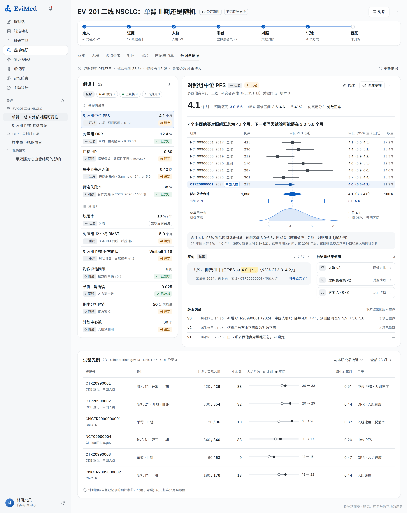

## 6. 贯穿四个工作区的「假设与证据」

v1.0 已经提出"每个参数都有一张可追溯的记录"。这版把它做成一条自动流水线：**参数默认从证据里来，而不是从用户手里来**。这是虚拟临研和 EviMed 其他板块接得最紧的地方，也是和海外同类产品差距最大的地方：Cytel、FACTS、nQuery 要用户自己填参数，Unlearn 的 TrialPioneer 在 2026 年 1 月才把"先例 → 参数 → 情景"串起来（附件 A2），而 EviMed 本来就在做中英文文献检索、全文解析和 Meta 分析。

### 6.1 假设卡

每个参数一张卡，四个工作区共用：

| 字段 | 内容 |
|---|---|
| 参数 | 名称、终点与时点、单位（例："对照组 12 个月无进展生存率"） |
| 取值 | 点值或分布（Beta、对数正态、Gamma、经验分布），以及用于敏感性分析的范围 |
| 来源类型 | 本地观察 / 外部证据 / 专家设定 / 模型预测 / 情景假设（沿用 v1.0 的五类） |
| 来源明细 | 外部证据：研究列表，每项带原文位置（页码与原句，或登记记录字段）；本地观察：数据快照与计算口径；专家设定：谁、何时、理由 |
| 汇总方式 | 单项研究直接取值；多项研究用随机效应 Meta 分析，给出合并值、异质性（I²、τ²）和**预测区间**（下一个同类研究可能落在哪里，这才是仿真该用的范围） |
| 适用人群 | 来源人群与本研究人群的差异（地区、线数、生物标志物、年代）；中国人群研究单独标出 |
| 状态 | AI 设定 / 已复核（谁、何时、针对哪一版） |
| 被谁使用 | 引用这张卡的人群、虚拟患者集、对照和试验情景 |

### 6.2 证据参数化：从一句话到一组假设卡

1. **找先例**。按研究定义里的 PICO 检索试验登记（ClinicalTrials.gov、WHO ICTRP 汇集的中国临床试验注册中心等一级注册库、欧盟 CTIS、药物临床试验登记与信息公示平台（CDE））和中英文文献（EviMed 证据检索、PubMed），列出同类试验。
2. **逐项抽取**。从登记字段、摘要、全文和图表里抽出每个研究组的样本量、事件数、比例、中位时间、风险比、脱落、入组起止和中心数。每个数带原文位置，沿用平台现有的"直接引文"约束：抽出的数字必须能在原文里逐字找到。登记记录里的预计值和实际值分开（ClinicalTrials.gov 的 ESTIMATED 与 ACTUAL），预计值不进历史基准。
3. **重建个体数据**。已发表的 Kaplan–Meier 曲线用 Guyot 算法重建成伪个体数据（标"重建"），用于拟合参数生存模型和计算限制平均生存时间。AI 负责找到图、读出坐标轴和风险人数表；曲线上的点位由确定性的数字化程序取得，重建结果要复现原文的风险人数、事件数、中位数和 HR 才能使用（§5.3）。
4. **汇总**。交给 Meta 分析引擎做随机效应合并，给出合并值、异质性和预测区间；比例用 Beta，时间用对数正态或参数生存模型，风险比用对数正态，直接变成仿真能用的分布。
5. **检查适用性**。按地区、治疗线、年代、生物标志物分层看差异，差异大时 AI 选最接近本研究人群的子集作为默认，另外两种口径进敏感性分析。
6. **生成假设卡**，写明默认值、敏感性范围和理由。

找不到证据的参数（例如国内某病种每中心每月入组数），先用最接近的证据加宽范围，标"专家设定·待补证"；T1 档以后，用合作方的真实漏斗替换。

登记平台里**没有**的量——筛选失败率、每个中心的入组数、中心启动日期——只能来自合作方或客户自己，平台显示"不可得"，不写 0。

### 6.3 改一处，自动知道哪些结果要重算

平台记录每个结果用到了哪些对象的哪个版本，形成一张依赖图。任何一处变化都沿图传播：

| 你改了什么 | 平台做什么 |
|---|---|
| 一张假设卡（例如脱落率从 10% 改成 15%） | 列出受影响的虚拟患者集、对照分析和试验情景，全部标"已过期"；轻量结果自动重算，重的按预算排队 |
| 一条入排条件 | 列出要重算的队列、匹配评估和已生成的招募材料；已做过的匹配评估保留原版本可查，新评估引用新版本 |
| 一条源数据被更正 | 列出所有用过这个数据快照的结果，标"已过期"并说明原因 |
| 方案正式修订 | 生成新的方案版本和影响清单，不改写过去的评估 |

过期的结果不删除、不隐藏，只是换一个状态；研究包导出时，过期结果要么重算，要么在封面上照实写明。

### 6.4 试验先例库

先例库是证据参数化的底座，也可以单独用（"近五年国内 NSCLC 二线 II 期单臂试验的入组速度"）：

- **一个先例的字段**：PICO、设计（随机、盲法、分配比、期中分析）、样本量（计划与实际）、入组起止、中心数和国家、入排条件原文、终点定义和评估方式、主要结果、来源（登记号、文献、监管审评文件）。
- **相似度只用来找候选**：终点定义不同、人群不同的研究不会因为"相似度高"就被当成可以直接合并；合并前逐项检查口径。
- **原文保留**：标准化的同时保留原始写法，界面上并排显示。
- **对比表并列"计划"与"实际"**：计划入组 120 例 18 个月，实际 96 例 26 个月，这本身就是入组预测最有用的先验。

### 6.5 结局封存：让"事先规定"可以被证明

外部对照和确证性分析最常被质疑的一点，是"看了结局再选数据、改方案"。监管机构的要求一致：分析计划要在接触结局数据之前定下来（FDA 外部对照指导原则草案、EMA 单臂试验反思文件、CDE 贝叶斯借用指导原则，附件 D）。平台在技术上保证这一点：

- 预期用途为"指定研究分析"或"申报准备"时，外部数据里的**结局字段默认封存**，AI 和用户在分析计划冻结之前只能看到基线和覆盖情况；
- 分析计划冻结时记下时间和哈希；结局字段第一次被读取时也记下时间；研究包里给出这两个时间，证明先后顺序；
- 探索性用途不封存，但研究包照实写"探索性分析，分析计划在接触结局后制定"。

封存由 AI 在冻结计划时自动完成，不需要用户多点一次；它不是审批，而是让事后无法说清的事情在事前就被记录。
