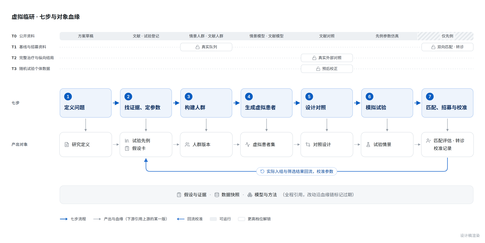

## 4. 总流程：七步，每一步都能单独用

v1.0 的主线是"定义研究问题 → 构建研究人群 → 生成虚拟患者 → 设计对照 → 模拟试验 → 匹配真实患者 → 用可获得的数据验证与改进"。这版保留这条主线，只在第一步后面插入"找证据、定参数"：没有这一步，后面每一步的参数都只能靠用户手填，而这恰好是 EviMed 最擅长、同类产品最弱的一环。

| 步骤 | AI 自动做什么 | 你看到什么 | 产出对象 |
|---|---|---|---|
| **1 定义问题** | 从一句话或上传的方案里起草 PICO、估计目标、主要终点及其类型、预期用途；只在答案会改变下一步时才问 | 研究定义卡，每个字段标来源（"方案第 12 页""AI 设定"） | 研究定义 |
| **2 找证据、定参数** | 检索试验登记和文献里的同类研究，逐项抽出对照组事件率、中位生存、效应量、脱落率、入组速度（带原文位置），交 Meta 分析引擎汇总 | 试验先例表、每个参数的森林图和预测区间 | 试验先例、假设卡 |
| **3 构建人群** | 按数据档位选路：有数据就筛真实队列，没数据就按文献基线表或设定分布生成 | 筛选流程（每步保留、排除、无法判断的人数）、人群画像、与文献对照组的可比性 | 人群版本 |
| **4 生成虚拟患者** | 选用能覆盖该人群和终点的最高一级模型；没有就用文献模型或情景模型，并标明 | 单个虚拟患者的轨迹与区间、群体分布、哪些假设影响最大 | 虚拟患者集 |
| **5 设计对照** | 按数据档位列出可行的对照路线，逐条做可比性诊断；不可行就交付缺口清单 | 重叠与平衡、有效样本量、效应估计与敏感性，或"不可估计"与缺口 | 对照设计与结果 |
| **6 模拟试验** | 默认起草三个对比方案（例如单臂 + 文献对照、2:1 随机、1:1 随机加期中分析），跑功效、成功把握、周期、成本和敏感性 | 方案 A/B/C 并排，每个数带蒙特卡洛误差 | 试验情景与结果 |
| **7 匹配、招募与校准** | 把选定方案的入排条件结构化，双向匹配授权患者，跟踪转诊与入组，用实际入组和筛选结果回头校准参数 | 逐条件判断与证据、转诊看板、预测与实际对照 | 匹配评估、转诊、校准记录 |

**任何一步都能单独用，缺的上游由 AI 补一个最小版本**，补出来的部分标"AI 设定"，以后想做完整流程，在同一个研究里接着说，做过的不重做。常见的单项用法：

| 你说 | AI 做 | 大约多久 |
|---|---|---|
| "PFS 预计 HR 0.70、对照中位 6 个月、两年入组，要多少例？" | 最小研究定义 + 三张假设卡 → 解析公式给答案，再用仿真核对并加上脱落和入组节奏 | 几分钟 |
| "近五年国内 NSCLC 二线单臂 II 期的 ORR 和入组速度是多少？" | 先例检索、抽取、汇总 | 20～40 分钟 |
| "这个单臂试验能不能用外部对照？"（附数据字典） | 数据覆盖检查 + 可行对照路线 + 缺口清单 | 半小时左右 |
| "这 300 个患者里谁可能符合这个方案？"（附方案和资料） | 入排条件结构化 + 逐人逐条件判断 | 取决于人数，约每人十几秒 |
| "把我们上传的队列生成一份可以外发的合成数据" | 经验合成人群 + 保真度、可用性和泄露风险报告 | 几分钟 |

每一步的结果都进同一个研究：研究页的对应页签里是结构化结果，对话里是 AI 的过程和简短汇报，二者互相跳转（§9.5）。
