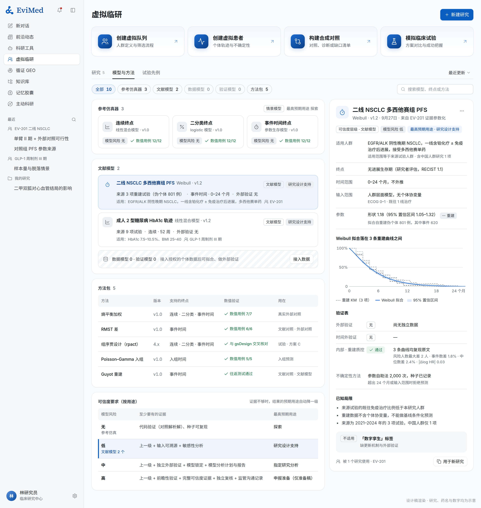
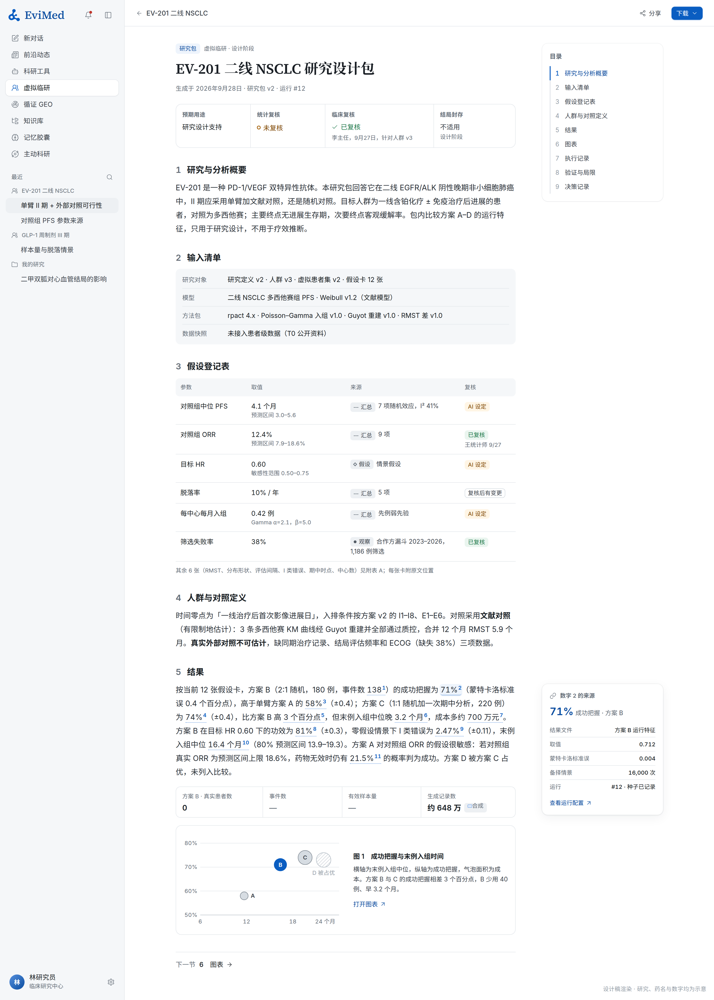

## 8. 共享资源：数据、模型与方法、研究包

### 8.1 数据接入与数据平面

**首版格式**：CSV、Parquet、XLSX、数据字典，以及方案等文档；另做医院科研平台和专病库导出格式的适配器（第二阶段），因为国内的院内数据大多从这些平台导出。FHIR、OMOP、试验分析数据集（CDISC ADaM）、登记研究和客户接口，在映射和验证后逐个加适配器。不要求客户先把整个机构迁到一个通用模型上，才能用一份小的授权数据。

**患者级数据走单独的数据平面，不走知识库。** 这是这版方案在工程上最重要的一处改动。今天知识库里的文件以只读方式挂进每个项目的运行时，内核可以直接读取，原始行因此可能进入模型上下文（附件 E §2.5）。对文献和方案这没有问题；对患者级数据，这既浪费上下文、让回答不稳定，也让数据暴露给不需要它的环节。所以：

- 患者级数据存进独立的数据平面（独立存储卷 + `evimed_vcr` 里的元数据），**不挂进运行时**；
- 只有确定性的统计引擎能读行级数据；AI 看到的是结构、数据字典、质量画像和聚合结果；
- 给 AI 的聚合结果里，人数少于 10 的格子合并或隐去，避免从聚合反推个体；
- 联系方式和直接标识留在合作方或单独的身份表里，研究里只用按研究派生的假名编号；
- 谁能看哪个数据源、哪些字段、哪个时间窗，由控制面按"组织 × 项目 × 角色 × 数据源 × 字段 × 时间窗"逐次判定（平台原则 14：数据归属和操作授权留在代码里）。

**接入流程**（v1.0 §5.1 的六步，由 AI 自动推进）：

1. 登记数据源：谁的数据、允许的用途、可见范围、保留期；
2. AI 提出字段映射（患者、就诊、治疗、观察、结局），代码校验类型、单位、编码和取值范围；
3. 确定单位、编码、事件时间、**平台可见时间**和原文证据；
4. 标出可观察的时间区间和受限字段（例如合作方试验期间的数据）；
5. 质量画像：完整性、一致性、合理性、重复、关联质量——直接复用 dataset-research-scoping 能力里已有的确定性剖析脚本（逐列填充率、基数、类型、跨表关联可达性、哨兵日期检测、标识列掩码，同样输入逐字节同样输出），补上字段映射、单位与编码、三种时间和缺失原因；
6. 冻结成不可变快照（带哈希），之后所有分析引用这个快照。

**引擎的输入形状统一**：每个快照在研究内派生出三张分析表——受试者级表（每人一行的基线与分组）、长表（每人每次测量一行）、事件表（每人每个事件一行，带时间零点和删失）。形状借 CDISC ADaM 的 ADSL / BDS / ADTTE：它与病种无关，统计程序只认这三张表，所以换一个病种不用改引擎；申办方也熟悉这个形状。

**三种时间和缺失原因**（沿用 v1.0 §5.2）：发生时间、记录时间、平台可见时间分开存；缺失原因分为未测量、未记录、未共享、试验期间受限、在观察窗外、待出结果、不适用；互相矛盾的证据单独表示；未知的治疗不等于没有治疗。

### 8.2 模型与方法库

这是整个板块共享的一页，不属于某一个研究。**方法包和模型包分开发布**：EMA 认可的是"预后评分协变量校正"这个统计方法，明确说无法认证模型开发的流程——方法的先例不会传递给模型（附件 A1）。海外成熟产品没有"通用虚拟患者"，都是**按适应症、终点和时间窗发布、带版本号的模型**（Unlearn 列了 15 个数字孪生生成器，Simcyp 按人群发布 29 个虚拟人群，附件 A1），我们照这个粒度组织。

**模型卡**（v1.0 §10.1 的字段全部保留，并对齐 ICH M15 的证据评估表）：

- 身份、提供方、不可变版本、执行接口；类型（数学仿真 / 拟合的预测模型 / 生成模型 / 机制模型）；
- 适用人群（含**地区人群**，例如是否含中国人群）、处理与对照、终点、时间范围、输入取值范围；
- 必需字段、单位、缺失时怎么处理、输出的含义；
- 训练、校准、验证数据分开描述（带数据哈希）；一张机器可读的**验证表**：分时点的校准（总体校准、校准斜率、ICI）、预测区间的实际覆盖率与宽度、CRPS、亚组表现、时间外验证（只用截止时点之后才可见的数据）、漂移；
- 不确定性方法、超出分布时的行为；依赖、资源、可复现性；已知局限、复核历史、退役规则。

**可信度按"用在哪"来要求，而不是给模型发一个"已验证"徽章。** ICH M15（2026 年 1 月达到 Step 4，FDA 2026 年 6 月定稿）、FDA 的 AI 可信度七步框架（草案）和 ASME V&V 40 是同一个结构：先说清问题和使用情境，再按"模型在决策里的分量 × 决策错了的后果"定模型风险，风险越高，要求的可信度证据越多（附件 D）。平台把它落成一个确定性的规则：

| 模型风险 | 典型用途 | 至少要有的证据 | 结果最高能标的预期用途 |
|---|---|---|---|
| 无（参考仿真） | 数学情景、流程演示 | 代码验证（对照解析解）、种子可复现 | 探索 |
| 低 | 入组预测、样本量情景、可行性 | 上一级 + 输入可溯源 + 敏感性分析 | 研究设计支持 |
| 中 | 预后评分用于随机试验校正、模型预测比较器作为支持性证据 | 上一级 + 独立外部验证（校准、区分度、亚组）+ 模型锁定 + 模型分析计划与报告 | 指定研究分析 |
| 高 | 模型输出构成疗效或安全性证据的主要部分 | 上一级 + 前瞻性验证 + 完整可信度证据 + 独立复核 + 监管沟通记录 | 申报准备（仅准备稿） |

一个结果用到的模型如果达不到它声明用途要求的证据，平台不拦截，而是把结果的预期用途**自动降到**模型证据撑得起的那一级，并写明原因。与 §3.6 的四级模型层级对应：情景模型对应"无"，文献模型通常够"低"，数据模型经外部验证后可到"中"。

**模型分析计划与报告**：每次用模型做分析，执行前冻结一份模型分析计划（哈希加时间戳），执行后自动生成模型分析报告，二者与执行快照一一对应（ICH M15 的要求）。

**首版目录里有什么**：

- 三个数学参考仿真器（连续、二分类、事件时间）；
- 每个研究在证据参数化中拟合出的**文献模型**（例如由重建 KM 数据拟合的对照组 Weibull 生存模型），可以一键收进目录供其他研究复用，适用范围自动写成来源试验的人群；
- 方法包清单：每个估计方法和仿真方法的版本、支持的终点、前提假设和数值测试结果；
- 以后：客户或合作方提供的数据模型、授权的外部模型、机制模型。**机制模型（QSP、PBPK、群体药动学）的接口现在就定下**：常微分方程模型 + NONMEM 风格的给药与观测事件表 + 参数不确定性、个体间变异、残差三者分开存放 + 协变量人群生成器 + 虚拟人群的选择方法（Allen 2016 的接受-拒绝法），宿主引擎为 mrgsolve、rxode2、nlmixr2 和 PK-Sim；以后接入时不用再开一条代码路径。

### 8.3 研究包与报告

每次完成的研究都交付一个可以检查、可以复现的研究包。结构对齐真实世界证据和模拟研究的通行模板（HARPER 方案模板、STaRT-RWE、TARGET 目标试验模拟报告规范、ADEMP，附件 C1）：

| 部分 | 内容 |
|---|---|
| 研究与分析概要 | 问题、人群、估计目标、预期用途、方法 |
| 输入清单 | 数据快照、可见范围、模型与方法版本、哈希 |
| 假设登记表 | 取值或分布、来源与原文位置、不确定性、复核状态 |
| 人群与对照定义 | 筛选或生成、时间零点、权重、排除 |
| 结果 | 机器可读的估计值和仿真汇总（CSV / Parquet / JSON） |
| 图表 | 分布、轨迹、平衡、不确定性、方案取舍 |
| 执行记录 | 代码与配置、计算环境、随机种子、时间、算力用量 |
| 验证与局限 | 数值检查、模型与数据的适用性、未解决的问题；结局封存的两个时间（§6.5） |
| 决策记录 | 复核意见、考虑过的其他方案、下一步用途、监管沟通记录 |

**报告里的数字由结果渲染，不由文字生成。** 平台原则 10(c) 说"数字是渲染出来的，不是打出来的"，这条原则在全平台还没落地（附件 E §2.7），虚拟临研是最适合先落地的地方：报告模板里的每个数字都是指向结果文件某个字段的引用，由代码渲染；AI 写的只是数字之间的文字。于是 v1.0 的 AC-20（每个定量陈述都能对应到保存的结果或引用的输入）不靠再加一道检查，而是从构造上就成立。

**系统验证文档包**：平台为每个方法版本保存需求、测试、变更记录和数值基准结果，申办方可以直接纳入自己的计算机化系统验证（ICH E6(R3) 要求按风险验证系统，包括他方开发的系统）。

**导出**：可读的报告为 Word / PDF / HTML，机器可读的结果为 CSV / Parquet / JSON。可选再导出一份**CDE 沟通交流资料包**：按《真实世界证据支持药物注册申请的沟通交流指导原则》的要点组织必要性与可行性、数据适用性、方案与统计分析计划、偏倚控制和敏感性分析（附件 D）。区间一律写清是哪一种：置信区间、可信区间、预测区间，还是蒙特卡洛区间；模型生成的分布不画成观察到的 KM 曲线。
