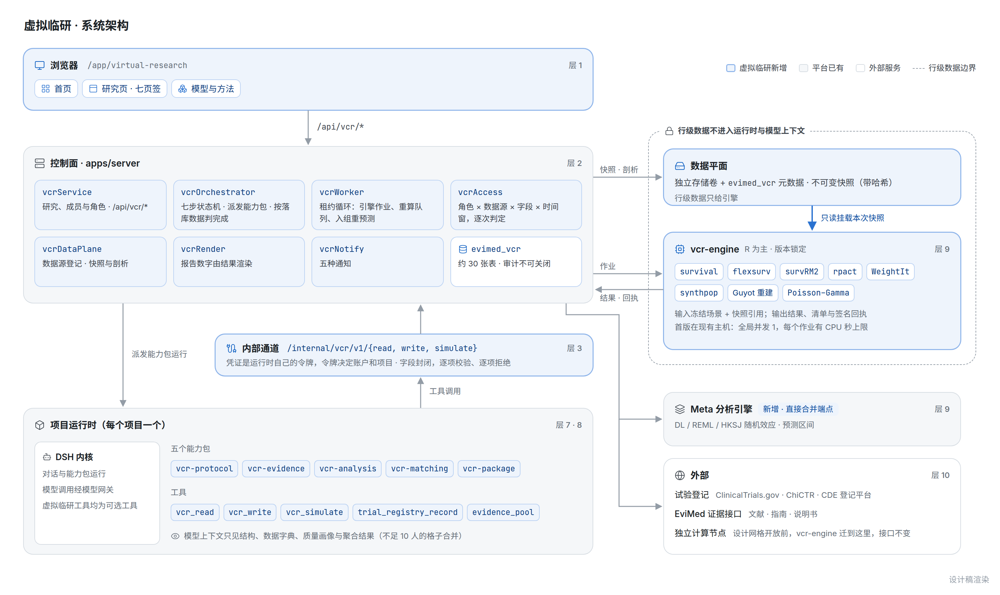

## 11. 技术方案

### 11.1 现在有什么（2026-09-28 盘点，附件 E）

| 已有 | 能直接用于虚拟临研的部分 | 缺什么 |
|---|---|---|
| **循证 GEO 模块** | 最新、最完整的一级模块模板：独立 schema、按账号开放、编排器在项目里派发能力包运行并按落库数据判定完成、运行时读写通道、租约 worker、只发几种通知 | — |
| **Meta 分析引擎** | 固定效应、DL / REML / HKSJ 随机效应、预测区间、异质性、率与发生率的 GLMM、由置信区间反推 HR、中位数转均数 | 只能作为"题目 → 检索 → 合并"整条流水线调用，没有"把这几组数合并一下"的接口；没有贝叶斯、MAP 先验和借用 |
| **数据集可行性勘查能力** | 确定性的数据剖析脚本（逐列填充率、类型、关联可达性、哨兵日期、标识列掩码） | 字段映射、单位与编码、三种时间、缺失原因 |
| **临床试验检索** | EviMed 接口覆盖 ChiCTR、ClinicalTrials.gov、Cochrane Central；知识信源插件在抓 ChiCTR 新注册和 CT.gov 三期 | 入排条件原文、分组、终点、结果都没有结构化抽取 |
| **交付闸门与引文约束** | 直接引文必须逐字可查、衍生结论必须写明输入与方法 | 报告数字由结果渲染（原则 10c）尚未落地，只有两个提示级测量 |
| **运行时镜像** | numpy、scipy、pandas、statsmodels、scikit-learn；R 基础包与推荐包（含 survival） | 没有 MatchIt、WeightIt、survRM2、rpact、flexsurv、synthpop、metafor、pyarrow |

结论有四条：

1. **GEO 是现成的模块模板**。
2. **确定性的统计与仿真引擎基本不存在**，这是最大的工程量。这件事不是理论问题：9 月 26 日的疳证 Meta 论文里，模型自己写的分析代码把 Egger 检验重复加权了一次。
3. **今天没有"患者级数据"这条边界**：DSH 方案里设计过数据保险箱，但没有建；知识库挂进运行时；现有引擎挂的是整个数据卷。任何患者级功能上线之前，先建数据平面（§8.1）。
4. **账号只有个人一级**，没有组织和角色。虚拟临研要让合作方的协调员、复核人和申办方看同一个研究，就需要"研究成员与角色"。它只做到项目这一级，不引入完整的组织体系。

### 11.2 按层落点

沿用平台十层的插件化结构（CLAUDE.md 的分层表），每一层照已有模块的形状做，不发明新机制：

| 层 | 落点 |
|---|---|
| 1 浏览器 | `/app/virtual-research`（首页）、`/app/virtual-research/:studyId/:tab?`（研究页）；`components/vcr/*`、`lib/vcrClient.ts`（`useVcrFeature`）；侧栏在「科研工具」后依次插入虚拟临研与 GEO 两行；同步改侧栏与路由测试、页面走查脚本、内核框架的导航词表。Vue 外壳改 `RESEARCH_NAV`、子应用页面表和标题表三处，以补丁形式交给 EviMed 团队合入 |
| 2 控制面 | 研究成员与角色（项目级：负责人、临床复核、统计复核、数据管理、招募协调员、中心，只读查看者；访问按角色 × 数据源 × 字段 × 时间窗判定）；`vcrService` / `vcrRoutes`（`/api/vcr/*`）/ `vcrPersistence`（schema `evimed_vcr`）/ `vcrOrchestrator`（七步状态机，派发能力包运行，按落库数据判完成）/ `vcrWorker`（租约循环：引擎作业、结果登记、重算队列、入组重预测）/ `vcrAccess`（逐次判定数据访问）/ `vcrDataPlane`（快照与剖析）/ `vcrRender`（按结果渲染报告数字）/ `vcrNotify`（五种通知）。开关 `OPEN_SCIENCE_VCR_ENABLED`、`_AUDIENCE`、`_PREVIEW_USERS`、`_DAILY_BUDGET_CNY`、`_ENGINE_URL`、`_MAX_CONCURRENT_JOBS`、`_JOB_CPU_SECONDS`；`/api/me` 下发 `features.virtualResearch`；用量新增用途 `vcr` |
| 3 内部通道 | `/internal/vcr/v1/{read,write,simulate}`：凭证是运行时自己的令牌，令牌决定账户和项目，字段封闭，逐项校验逐项拒绝；引擎通道 `EVIMED_VCR_ENGINE_URL`，工作负载令牌 + **签名回执**；引擎若调模型，一律经模型网关（这两条是缺口清单 E4、E9 里其他引擎的遗留问题，新引擎一开始就做对） |
| 4 领域 | 词表：九类来源、三种科学结论、复核状态、七类缺失原因、四级预期用途、四级模型风险；合约种类 `vcr-study-package`、`vcr-simulation-report`、`vcr-comparator-analysis`、`vcr-cohort-snapshot`、`vcr-matching-assessment`，**全部先作提示**（阻断预算已满，原则 4）；"不可估计"是合法交付 |
| 5 防腐层 | 不改 |
| 6 插件底座 | 不新增插件：工具经 MCP 提供 |
| 7 运行时镜像 | MCP 工具 `vcr_read`、`vcr_write`、`vcr_simulate`（start / status，和 `meta_analysis` 同一形状）、`trial_registry_record`（按登记号取结构化的入排、分组、终点、结果）、`evidence_pool`（把抽取到的几组数交给 Meta 引擎合并），归入可选工具 |
| 8 能力包 | 五个：`vcr-protocol`（研究定义、入排结构化、日程表）、`vcr-evidence`（先例与证据参数）、`vcr-analysis`（人群、虚拟患者、对照、试验的配置、运行与解读，四段技能按步骤注入）、`vcr-matching`（患者事实抽取、逐条件判断、招募材料草稿）、`vcr-package`（研究包文字与对外资料包）。全部 public + `display.listed: false`，只从虚拟临研进（不能用 internal，否则绑定的对话会 403）；每个至少 3 个真实 brief |
| 9 引擎 | 新引擎 `项目代码/vcr-engine`（下节）；Meta 引擎加一个"直接合并"端点 |
| 10 外部服务 | 试验登记（CT.gov v2 结构化模块、ChiCTR 经 EviMed 接口、CDE 登记平台经网页读取）、EviMed 证据接口、独立计算节点 |

### 11.3 数据：`evimed_vcr`

和 GEO 一样一套 DDL 管所有表，约三十张，按对象分组：

| 组 | 表 |
|---|---|
| 研究与定义 | `studies`（一个普通项目一行）、`members`（研究成员与角色）、`study_definitions`、`protocol_versions`、`criteria`、`soa_items` |
| 证据与假设 | `precedents`、`evidence_items`（每个抽取值带原文位置）、`assumptions`（版本化） |
| 数据平面 | `sources`（数据源登记）、`grants`（访问授权）、`snapshots`、`field_maps`、`analysis_tables` |
| 研究对象 | `populations`（定义与生成分开）、`patient_sets`、`comparator_designs`、`trial_scenarios`、`design_grids` |
| 执行 | `jobs`（检查点、取消、预算）、`executions`（冻结的输入与环境）、`results`、`forecasts`（预测登记） |
| 业务协作 | `matching_assessments`、`criterion_judgments`、`referrals`、`referral_events`、`sites`、`followup_episodes` |
| 治理 | `dependencies`（血缘边）、`stale_marks`、`reviews`、`decisions`、`regulatory_contacts`、`audit`、`schedule_marks` |

`audit` 记录谁、何时、改了什么、为什么，不可关闭；快照和执行不可变，只能被新版本取代。这既是可复现的基础，也正好是申办方做计算机化系统验证时要看的东西（ICH E6(R3)，附件 D）。

### 11.4 计算引擎：`vcr-engine`

**形状**：和 Meta 引擎、MR 引擎一样是一个独立容器，由控制面的作业队列驱动，运行时工具只能提交和查询。它只挂载本次作业用到的那个数据快照（只读），不像现有引擎那样挂整个数据卷。它只接受**冻结的场景 JSON 和数据快照引用**，输出 `result.json`、结果表（Parquet）和一份清单（输入哈希、随机种子、R 与 Python 版本、包锁文件哈希、输出哈希）。大模型从不直接算统计，也碰不到引擎的代码。

**以 R 为主、Python 为辅**：成熟、经同行评议且长期维护的统计实现大多在 R 生态里，用它们比自己重写更可靠，也更容易被申办方的统计师接受。首版方法与包（版本全部锁定，详见附件 C1、C2）：

| 用途 | 首版 |
|---|---|
| 生存与 RMST | survival、flexsurv、survRM2 |
| 设计与功效 | rpact（开源；正式验证文档随付费支持提供，公开的是安装确认测试）+ gsDesign 交叉核对、解析公式；仿真框架自写，按 ADEMP 输出性能指标与蒙特卡洛误差 |
| 外部对照 | WeightIt、MatchIt、cobalt、EValue |
| 数据生成 | 边际 + copula 的参数化生成、synthpop、simsurv |
| 文献重建 | Guyot 算法（自实现，与 IPDfromKM 交叉核对）；KM 图由解析服务从全文里取出，曲线点位由确定性的数字化程序提取（必要时人工点选校正），点位本身作为"抽取"来源保存 |
| 合并 | 复用 Meta 引擎的合并库（DL / REML / HKSJ、预测区间） |
| 入组预测 | Poisson–Gamma 模型（自写，按文献公式做数值测试） |

**可复现**：并行时用 L'Ecuyer 随机数流，保证同样的种子在不同核数下得到同样结果；每一批重复写一个检查点，失败从检查点续跑；取消即时生效，已完成的批次保留。

**算力**：生产机是 4 核、与其他产品共用的主机，运行时容器 2 核 8 GB，内核对一次工具调用 180 秒就放弃（附件 E §2.8）。所以：

- 首版引擎先放在现有主机，**全局并发 1、每个作业有 CPU 秒上限**，足够跑单个设计的仿真和中小规模的合成；
- 设计网格和大批量合成开放之前，把引擎挪到**一台独立的计算节点**（16 核级别即可：一个 300 例事件时间试验的一万次重复约几十秒，一个 30 个设计 × 4 个情景的网格在 16 核上约几分钟），接口不变；
- AgentBay 单次命令有 50～60 秒的上限，不适合长时间的仿真作业，不用它跑引擎。

**与平台已有需求合并**：缺口清单里的 E14"统计分析能力包"（你 9 月 9 日提过）可以直接建立在这个引擎上，不再另起一套。

### 11.5 与现有纪律的对齐

- **原则 1**：数字、分布、阈值、日期、结构化条件交给代码；方案解析、变量映射、自由文本条件、解释交给模型。
- **原则 2、3、4**：合约约束输出不约束输入；检查结果是可修复的返回值；新检查一律先作提示，"不可估计"是合法交付。
- **原则 9**：每个新功能都是能力包，带合约和至少 3 个真实 brief。
- **原则 10(c)**：报告数字由结果渲染（§8.3），虚拟临研是这条原则第一个完整落地的地方。
- **原则 11、12**：虚拟临研的工具都是可选工具；普通问题照样零工具作答，不因为挂了这个板块就强制走流程。
- **原则 14、15**：数据访问、预算、并发都在代码里，每个上限有配置项和可观测的计数。
- **原则 18、19**：推断不自动升格为事实；失败保留部分结果，异常可追溯。
