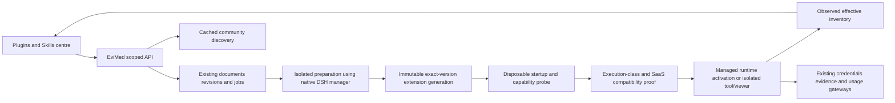

# DSH Ecosystem Adoption and EviMed Extension Center

Product and technical proposal, expanded market and SaaS review | 2026-10-01 | Design only, no installation or implementation performed

## 1. Decision and intended outcome

Build a user-facing **Plugins and Skills center** for the hosted EviMed workbench. Reuse DSH's package management, plugin composition, skill loading, invocation and plugin UI extension points. Reuse community implementations where they solve a real research task. Keep only EviMed's account/project ownership, deployment coordination, credentials, provenance and product presentation in the control plane.

The owner selected **self-service marketplace plugin installation plus personal skill import** for the first release. A catalogue with disabled install buttons, an operator-only configuration card, or a skill list with no import/use path does not satisfy this request.

The follow-up requirement is explicit: every offered installation must fit EviMed's SaaS ownership and permission model. **Self-service does not mean arbitrary community host code executes inside the trusted kernel.** Separate isolated tools, isolated viewers, managed host extensions and skills; offer actual self-service for packages admitted through the appropriate path. Discovery can remain broad, but source inspection or a successful boot must never be labelled multi-tenant compatibility.

The supplied Codex screenshot is the visual reference for the organization: a small Plugins/Skills navigation, an installed list, searchable discovery, restrained icon-and-text rows and contextual add/configure actions. It is not evidence that the pictured Codex connectors are DSH plugins, and it does not authorize installing anything in Codex or production.

Product promises:

- A researcher can discover an extension, add it to a personal library, enable it in a project, connect any required account and use it in a real conversation.
- A researcher can import or author a skill, inspect its instructions, publish a personal revision and invoke it through the existing DSH skill mechanism.
- Installation and activation are automatic within the supported hosted boundary. Do not introduce a manual approval committee or expert-review queue.
- The page distinguishes saved intent from actual availability. A package that downloaded but never loaded must not appear ready to use.
- Existing research keeps working when an optional extension fails. Current runs keep their pinned extension/skill generation; updates do not silently change their instructions or tools mid-turn.

This proposal is separate from the VCR production-integration plan. It reuses that plan's platform-wide document export contract and resource discipline, and must not become an unrelated prerequisite for opening VCR.

## 2. Current state, verified from the workspace

Repository: `/Users/wangzeyuan/Desktop/EviMedScience`. The inspected local/main ref is `04e8b3509297b81973f076a275f67535500aef05`, the merge of PR #1 from the platform follow-up branch. This is repository evidence, not a fresh production-host inspection. Read live release identity again before any future deployment. DSH remains pinned to `0.1.7-rc.2` in `OpenScience/deps-version.json`.

| Surface | What exists | Gap for the requested product |
|---|---|---|
| Settings | `apps/web/src/app/routes/AccountPage.tsx`: account, appearance, notifications, usage, data sources, projects; operators also see operations | No ordinary-user Plugins or Skills section |
| Plugin UI | `components/settings/PluginsCard.tsx`, mounted by `routes/OpsPage.tsx` | Project configuration UI in operations, not a discovery/install centre; its form understands `timeoutMs` |
| Plugin API | `apps/server/src/pluginRoutes.mjs`: project list/save/history/rollback/retry/remove | Removal disables an image-provided bundle; it does not uninstall a downloaded personal package |
| Application machinery | `pluginService.mjs`, `pluginApplyWorker.mjs`, revisions and leased jobs | Delivery path explicitly carries only `dsh-cite`; a second bundle needs real runtime/probe/account-export support |
| Runtime protocol | `runtimeManager.mjs` and privileged controller carry one `pluginConfig` | Cannot just add catalogue rows and assume several plugins' configurations reach the kernel |
| Native manager | `packages/socket/cordis.patch.yml` disables `plugin-manager` and `ui-plugin-manager` | Deliberate immutable-hosted-runtime choice, not a missing DSH feature |
| Native settings panels | `dshProfilePatch.mjs` hides plugin inventory/settings and management-related panels | Unhiding them alone does not grant a scoped or functioning backend |
| Browser/runtime separation | `runtimeUiFrames.mjs`, `runtimeUiServer.mjs`, `RuntimeUiFrame.tsx` and `runtimeUiBridge.ts` already provide a separate runtime origin, login-bound immutable project frames and a message bridge | Reuse these protections. They are not by themselves a proof that arbitrary new client code cannot affect a sibling frame, same-origin storage or another role. |
| Skills | Existing filesystem roots, scoped DSH registry, capability skill injection and `skills/list` seam | No complete personal skill CRUD/import/version/activation surface |
| Learned methods | Memory Hub and `/api/methods` already expose learned practices | Useful source for a Skills view, but not equivalent to a personal skill-package manager |
| Credentials | Settings data-source connections and control-plane gateways | Reuse these; do not create a second secrets store inside plugin settings |
| Availability | `plugin-availability.json` ships a deliberately stale placeholder until refreshed | Unknown upstream availability must remain unknown, never a green freshness badge |

Recorded ecosystem use already exists:

- `dsh-cite` 0.3.2, with managed public-source transport and a recorded 2026-09-28 startup probe.
- `@changfenhuang/dsh-annotation` 1.4.10 and `dsh-mermaid` 0.4.0, client bundles recorded as installed with deployment switches.
- Pinned community skills `dsh-ppt` and `deep-structural-analysis` in `runtime/skills/community/sources.json`.
- Core, curated-scientific and office skills, plus the capability packages. Files under a source directory are not proof that every skill is mounted in a particular runtime.

The earlier ecosystem shortlist from 2026-08-24 is historical input. For example, its MinerU recommendation predates the parser replacement. Recheck exact current artifacts rather than carrying forward every old recommendation.

## 3. Three implementation approaches

| Approach | Benefit | Cost / mismatch | Decision |
|---|---|---|---|
| EviMed centre over native DSH mechanisms | Familiar product UI, personal/project ownership, native package and skill execution | Requires a small control-plane adapter and preparation/activation workflow | **Recommended** |
| Unhide and embed the complete native manager/market unchanged | Least UI construction in a local single-user profile | Profile-wide writes, live loader changes, credential/settings scope and restart behavior do not directly match the hosted boundary | Use selected native components and slots, not unrestricted profile administration |
| Build a custom installer, skill parser, registry and loader | Full local control | Repeats DSH, grows upgrade debt and loses upstream fixes | Reject |

The official DSH plugin manager already supports bundle inspection, install/remove, selection, row toggles, installation progress and native compatibility handling. Its documented scope is the profile, affecting sessions using it; installed host code runs in the host process, and HMR-off compositions require restart for changes. Reuse it in the managed preparation environment, retaining immutable active runtimes. [Native manager reference](https://github.com/deepseek-ai/deepseek-harness/blob/dsh-v0.1.7-rc.2/packages/boot/plugin-manager/README.md)

DSH also supplies plugin configuration slots and its own manager page. Reuse suitable metadata/forms through adapters where their operations fit the tenant boundary. Its stock page is not itself an EviMed account/project permission model. [Native plugin UI](https://github.com/deepseek-ai/deepseek-harness/blob/dsh-v0.1.7-rc.2/packages/client/ui-plugin-manager/README.md)

## 4. One product vocabulary, distinct extension types

| Type | Meaning | User action |
|---|---|---|
| Plugin / bundle | Adds tools, a viewer or other runtime functionality | Install, enable, configure, update, remove |
| Skill | Instructions plus declared resources/scripts, loaded when used | Import/create, inspect/edit, enable, version, invoke |
| Connection | Authorization to an external service or user library | Connect, test, reconnect, revoke |
| Capability | EviMed's product deliverable and its contract | Start a research task; not an arbitrary plugin to uninstall |
| Learned method | A practice produced by the existing learning system | View/use/edit/retire via its existing record; Skills can link to it |
| Built-in component | Platform-supplied runtime/UI feature | View its source/version/status; expose only meaningful user preferences |

A bundle may include skills and connections. Its detail page shows these relationships without presenting duplicate independent installs. Imported personal skills do not automatically become public capability cards. A method shown in Skills remains the same method record used by Memory Hub.

## 5. Where ecosystem components fit the full research workflow

| EviMed stage / subsystem | Reuse opportunity | What EviMed continues to own |
|---|---|---|
| Asking and inspecting answers | Native skill picker; existing annotation and Mermaid components | Hosted conversation transport, project context, accessible UI |
| Research planning | Personal methods, reporting checklists, writing/analysis skills | Capability routing and output contracts; no second mandatory planning mode |
| Bringing in sources | Zotero integrations, document-reading tools, existing MCP support | Knowledge-base intake, permissions, content identity and provenance |
| Literature retrieval | Existing `dsh-cite`; selectively assess AI4Scholar's citation graph/related-work features | Managed network access, provider credentials, preserved sources and cost attribution |
| Reading PDFs and Office files | `dsh-pdf`; bounded document access from `dsh-cowork` | The existing document-parsing service remains canonical intake; local viewers supplement it |
| Data exploration | Notebook/spreadsheet document tools; optional specialist analysis packages | Dataset scope, deterministic analyses, patient-data plane and compute budgets |
| Writing and revision | Existing writing skills; scoped imported writing styles; Univer Office candidate | Evidence-backed numbers, citations, output versions and shared export contract |
| Diagrams and presentations | Existing Mermaid, annotation, `dsh-ppt`; optional Univer canvases/slides | Source-backed diagram counts, official result values and artifact storage |
| Scientific/clinical review | Existing AI review service plus additional skill-based perspectives | Version-bound findings, deterministic checks and non-blocking delivery policy |
| Memory and learning | Expose existing learned methods alongside explicit personal skills | PostgreSQL records and OpenViking recall; do not install a competing memory authority |
| Autopilot and notifications | Native tools/skills can participate in a task; external integrations through connections | Durable agenda scheduling, budgets, notification ownership and user-authorized sending |
| Evidence-based GEO | Writing, slides, diagrams and source-reading extensions | Private GEO methods, actual probe measurements and media-order money ledger |
| Virtual Clinical Research | Literature, reporting and shared document extensions | R engine, immutable numerical results, data isolation, AI review and user-selected collaboration |
| Operations | DSH manager/installer, package metadata, native probes and compatibility handling | Tenant boundary, deployed pins, activation coordination, resource limits and rollback |

Do not add a second generic search, parser, memory database, agent scheduler or statistics engine just because a community plugin contains one. Prefer a useful missing function within a package over mounting every tool by default.

## 6. Candidate shortlist and evidence strength

Research checked on 2026-10-01. Versions below are observed repository/package declarations, **not approved install pins**. Before installation, resolve the actual registry artifact or exact commit, provenance, licence, integrity and compatibility. No new candidate was installed or live-tested in this planning task. Test scripts being present does not mean their tests passed here.

Evidence labels used in this document: **recorded EviMed use**, **source-verified candidate**, **requires another environment**. Do not use stars, listing count or an official-looking market label as a maturity verdict.

### 6.1 Expanded market survey and reproducibility

The second pass retrieved [the community catalogue JSON](https://awesome-dsh-plugin.com/plugins.json), updated **2026-09-30**, containing **4,400 entries across 23 categories** (5,289,981 bytes; SHA-256 `d3e04f94adaecb87f762d58bc0c29229fb532dc10e6149aac7dd65cfdf3fe343`). All entries received category/task-keyword screening. This is not a claim that all 4,400 repositories were audited.

Thirty-two candidate repositories/subpackages were then read at **fixed commit SHAs**, covering README/package/bundle declarations where present. Ten implementation files across eight critical candidates received an additional targeted review of dispatch, route trust, path confinement, UI actions or telemetry. Monorepo root metadata was corrected with the actual guardian and Cowork subpackage manifests. Exact commits, source-file hashes, version discrepancies and per-candidate decisions are retained in [the machine-readable source survey](2026-10-01-dsh-ecosystem-assets/catalogue-source-survey.json).

The catalogue and repository can differ: for example, the catalogue's `dsh-context` is 0.60.0 while the fixed source snapshot declares 0.62.2. Neither means that version was installed or tested here. Every new candidate's SaaS result in the survey remains **unverified-source-review-only**.

### 6.2 Additional architecture and operating-experience candidates

`Platform` below means a reusable platform-controlled component, not a plugin ordinary users may use to replace the kernel. `Pilot` means evaluate the named adapter and the section 16 test matrix; it does not mean already compatible.

| Candidate / observed source version | Useful part | Hosted decision and required adaptation |
|---|---|---|
| [`bowenliang123/dsh-context`](https://github.com/bowenliang123/dsh-context), 0.62.2 | Context composition, growth, tool overhead and session diagnostics | Priority platform/read-only adapter. Scope every query to the actor's project/session. Default ordinary views to aggregates; raw prompt browsing needs a separate authorized surface. EviMed's usage ledger remains the money authority. |
| [`Letter2025/dsh-tool-search`](https://github.com/Letter2025/dsh-tool-search), 0.1.5 | Search/describe/call for long-tail tools | First tool-discovery pilot. Its inspected bridge uses native `ctx.tools.execute` with the current agent, which is useful; still prove blocked tools remain blocked. Move reranker keys/calls to the existing control-plane boundary. |
| [`PKUfudawei/dsh-capability-menu`](https://github.com/PKUfudawei/dsh-capability-menu), 0.1.5 | Unified tool/skill inventory and progressive visibility | Alternative to tool-search, not an additional router stacked on it. Preserve root/child restrictions and output-contract tool needs; native compatibility check must admit the exact pin. |
| [`leaforbook/dsh-mcp-lazy`](https://github.com/leaforbook/dsh-mcp-lazy), 0.5.1 | Session-local MCP activation | Alternative for MCP-heavy projects. Older declared peer line, process ownership, connection state and nested-call accounting require proof. Tool visibility is not data authorization. |
| [`overact/dsh-context-management`](https://github.com/overact/dsh-context-management), 0.3.0 | Window handoff, session notes and paged history recall | Platform benchmark against existing EviMed compaction. The documented toggle affects the running instance, not one tab. Do not install a second simultaneous compaction owner. |
| [`LuminariSoftwares/context-guardian`](https://github.com/LuminariSoftwares/context-guardian), 0.1.0-alpha.6 | Compaction failure fallback | Borrow/test the fallback method; no new public model proxy or unconditional request rewriting. Preserve numerical assumptions, citations and durable handles. |
| [`TsFreddie/dsh-compaction-instant`](https://github.com/TsFreddie/dsh-compaction-instant), 0.1.4 | Deterministic excerpt/recall approach | Offline method comparison only initially. No alias replacement of `@deepseek-ai/dsh-compaction-basic`; zero model calls does not prove semantic losslessness. |
| [`ranxianglei/billion-context`](https://github.com/ranxianglei/billion-context), 0.1.176 | Cross-client context management | Not in the hosted default: proxy/launcher and context ownership overlap the existing gateway/kernel. Claimed token reductions are unverified for EviMed. |
| [`PerryLink/dsh-observe`](https://github.com/PerryLink/dsh-observe), 0.2.18 | Event-to-span/metric mapping and bounded export buffers | Operator/internal metrics pattern, off by default. Do not enable external prompt/completion capture; regex secret redaction is not proof that clinical text is safe to export. No second billing ledger. |
| [`PerryLink/dsh-plugin-doctor`](https://github.com/PerryLink/dsh-plugin-doctor), 0.4.5 | Package structure, contract and sandbox smoke diagnostics | Priority preparation-worker tool, exact scoped package `@perrylink/dsh-plugin-doctor`. Supplement with EviMed tenant/role tests; its own PASS is insufficient for SaaS admission. |
| [`omdsh-dev/dsh-session-health`](https://github.com/omdsh-dev/dsh-session-health), 0.0.1 | Read-only session-file diagnostics | Offline/operator-only on explicitly authorized copies and supported log formats. Never give every project a tool that scans the entire host session root. |
| [`baosfeng/my-dsh-plugins`](https://github.com/baosfeng/my-dsh-plugins/tree/fd69069a4e59/plugins/dsh-my-guardian), guardian subpackage | Candidate isolation and rollback UX | Borrow the recovery pattern. Do not adopt its post-start hot-mount mechanism into immutable live runtimes. |

Do not activate every context optimizer at once. First measure schema size, cache hits, tool choice and useful output on real EviMed tasks; then select at most one long-tail discovery implementation and one compaction owner. Compare with the unchanged native/EviMed baseline and include multi-turn source changes, cancellation and tool failure. No PTC rollout or DSH 0.2 upgrade is implied.

### 6.3 Existing management plugins: reuse more, expose less authority

| Candidate | What can be reused | Why unchanged installation is not the SaaS solution |
|---|---|---|
| [`zebbkira/dsh-skills-mcp-manager`](https://github.com/zebbkira/dsh-skills-mcp-manager), 0.2.0 | Skill import/editor and MCP configuration UI patterns | Inspected `src/routes.ts` explicitly trusts loopback/localhost and same-origin markers while manipulating files and spawning servers. Those checks identify a local app, not an EviMed tenant. Never make it work by rewriting public requests to look like trusted localhost requests. |
| [`alone-tree/dsh-skill-mcp-manager`](https://github.com/alone-tree/dsh-skill-mcp-manager), 1.2.0 | Per-session MCP lifecycle and on-demand exposure | It takes over profile MCP configuration and keeps its own registry. Do not duplicate EviMed's connection authority, import gateway-managed servers blindly or spawn a browser process for every child agent. |
| [`wingsky-1/dsh-plugin-hub`](https://github.com/wingsky-1/dsh-plugin-hub/tree/77bff6d75970/packages/dsh-mcp-manager), manager 0.2.8 | Workspace routing, environment references and diagnostic presentation | A cwd or global configuration file is not a user/role grant. Map configuration to trusted project identity and keep credentials outside the research runtime. |

These discoveries strengthen the reuse plan: inspect their bounded import/editor components before creating equivalent UI from scratch. Keep EviMed's authenticated personal/project API as the authority, and DSH's native services as the loader/executor. Do not expose unrestricted local stdio commands, environment variables or URLs as an ordinary SaaS form.

### 6.4 Additional common tools and research interactions

| Candidate / source version | Research use | Hosted decision |
|---|---|---|
| [`FSMargoo/dsh-at-file`](https://github.com/FSMargoo/dsh-at-file), 0.7.0 | Explicit workspace file references in the composer | Priority UI adapter if not already covered natively. The inspected README describes a path reference, not automatic full-file injection; preserve that behavior and exclude protected data-plane paths. |
| [`Nagi-ovo/dsh-visualize`](https://github.com/Nagi-ovo/dsh-visualize), 0.1.4 | Interactive explanation/diagram cards | Priority restricted viewer pilot. Its opaque-origin iframe approach is useful; replace external static-CDN dependencies with controlled assets and test message/network/download boundaries. |
| [`omdsh-dev/dsh-genui`](https://github.com/omdsh-dev/dsh-genui), 0.11.3 | Structured charts, forms and scenario controls | Alternative/structured UI pilot, scoped package `@changfenhuang/dsh-genui`. Bind actions to the exact frame/run/user; do not let a UI event overwrite engine results. Match source values and label scenario assumptions. |
| [`hccccc01333/dsh-excel-chat`](https://github.com/hccccc01333/dsh-excel-chat/tree/3676f6b4901d/bundle), 0.38.1 | Formula checks, workbook edits and data review | Bounded project-file tool adapter; reuse shared export and artifact authorization. Validate macros, external references, concurrent writes and workbook-size limits. |
| [`omdsh-dev/dsh-tool-csv`](https://github.com/omdsh-dev/dsh-tool-csv), 0.0.1 | Fast deterministic public/aggregate table operations | Lightweight isolated-tool pilot. The API accepts CSV text that becomes logged tool input; patient rows must remain behind VCR's snapshot/data-plane operations, not be pasted into this tool. |
| [`AngelosZou/dsh-pdf-reader`](https://github.com/AngelosZou/dsh-pdf-reader), 0.2.0 | Page profiling, figures, formulas and selective visual reading | Candidate alongside basic PDF tools. Prepackage Python dependencies, use bounded rendering and the model gateway; do not install packages mid-research or replace the intake parser. |
| [`chendefine/dsh-web-fetch-playwright`](https://github.com/chendefine/dsh-web-fetch-playwright), 0.2.9 | Rendered page extraction | Gateway-side implementation reference. Retain existing DNS/socket/redirect controls and isolated browser contexts; do not expose direct `web_fetch` or a shared authenticated CDP profile. |
| [`dengpeihua/dsh-browser-use`](https://github.com/dengpeihua/dsh-browser-use), 0.1.0 | Session browser lifecycle and structured observations | Defer direct installation: old exact peer and local interactive-browser assumptions. Reuse lifecycle ideas only after fitting the current browser boundary. |
| [`mingzeng21/dsh-notion`](https://github.com/mingzeng21/dsh-notion), 0.1.0 | Research notes/pages through Notion MCP | Connection adapter; OAuth/PKCE callbacks, refresh tokens and allowed workspaces belong to EviMed, not a profile-global credentials file. |
| [`STARDUSTLC666/dsh-calendar`](https://github.com/STARDUSTLC666/dsh-calendar), 0.9.2 | User-requested research deadlines and appointments | Connection adapter with per-account CalDAV/OAuth and explicit mutation intent. Not a replacement for EviMed's durable autonomous-work scheduler. |
| [`xmanrui/dsh-im`](https://github.com/xmanrui/dsh-im), 4.32.0 | Additional communication channels | Reuse selected channel transports behind the existing inbox/outbox, account binding and sending authorization. No independent bot daemon in every project runtime. |

Further findings refine earlier candidates: Univer enables product telemetry by default and exposes its own HTTP/WebSocket document surfaces; disable telemetry and bind those surfaces to the existing project frame. Cowork's DSH subpackage has old exact peers, so its portable core/MCP path is the better trial. The current OpenViking DSH bundle would create another recall/write path; keep the existing PostgreSQL-owned memory service rather than installing it alongside that authority. Details are pinned in the source survey.

| Candidate | Evidence / observed version | Concrete use and recommendation |
|---|---|---|
| `dsh-cite` | Recorded EviMed use, 0.3.2 | Surface citation verification/configuration to researchers; retain the existing managed gateway integration. First release. |
| `dsh-annotation`, `dsh-mermaid` | Recorded EviMed use, 1.4.10 / 0.4.0 | Expose as built-in reading/diagram features, with actual scope explained. Do not describe deployment-wide code as personally installed software. |
| [`STARDUSTLC666/dsh-ppt`](https://github.com/STARDUSTLC666/dsh-ppt) | A pinned skill is already vendored; current repository declares 0.5.1, MIT, with tests | Use existing skill immediately in the catalogue; evaluate an upgrade against actual editable PPTX and long-table output, not the version string. |
| [`dream-num/dsh-univer-office`](https://github.com/dream-num/dsh-univer-office) | 0.3.6; Apache-2.0; active repository; detailed integration/render tests declared | Highest-priority new Office candidate: rich DOCX/XLSX/PPTX editing, preview and PDF printing. Benchmark against Chinese research packages and the current resource envelope before adoption. |
| [`Jesse-njx/dsh-cowork`](https://github.com/Jesse-njx/dsh-cowork) | Root 0.1.0; MIT; monorepo with core, DSH, MCP and CLI packages | Lightweight bounded Office/notebook reads; writes currently focus on XLSX/IPYNB. It does **not** currently supply full DOCX/PDF generation. Trial the MCP/core path first. |
| [`zhtx2024/dsh-pdf`](https://github.com/zhtx2024/dsh-pdf) | Package `@zhtx2026/dsh-pdf` 0.1.1, MIT, basic tests | Local PDF inspection/text/page rendering, including CJK handling. Small self-service pilot candidate; not a replacement for the external intake parser or a PDF export engine. |
| [`literaf/dsh-ai4scholar`](https://github.com/literaf/dsh-ai4scholar) | 0.3.7, MIT, test/typecheck scripts | Pilot citation/reference graphs and related-paper search. Its own API account/credits and native credential storage require a hosted gateway/connection adapter; do not inject its whole tool set and a new billing system into every session. |
| [`Vncntvx/dsh-zotero`](https://github.com/Vncntvx/dsh-zotero) | 0.11.0; MIT; exact DSH 0.1.7-rc.2 declaration; active tests | Strong library/evidence interaction candidate, but requires Zotero on the same machine and loopback access. Hosted adoption needs a real local bridge or a separate Zotero Web API adapter. Do not label direct cloud installation usable. |
| [`Hongcheng-LI/dsh-zotero`](https://github.com/Hongcheng-LI/dsh-zotero) | Source-verified alternative using local Zotero API | Alternative implementation, not an interchangeable package merely because its name matches. Verify registry ownership/repository provenance before choosing one. |
| [`fly233338/dsh-overleaf`](https://github.com/fly233338/dsh-overleaf) | Source-verified MCP wrapper, MIT | Optional manuscript-project connection after bibliography/Office. Requires Overleaf Git authorization; write-back is a Git push. The wrapper does not compile LaTeX/PDF itself. |
| Academic writing / translation bundles | Existing support record marks 0.2.0 versions incompatible | Re-evaluate an exact current artifact. Do not treat the old rejection as permanent, but do not copy a skill body that calls unavailable plugin tools. Existing writing skills remain usable. |
| [`omicverse/dsh-omicos`](https://github.com/omicverse/dsh-omicos) | 0.2.1; GPL-3.0; old exact 0.1.0-rc.6 peers; persistent Python environment | Specialist bioinformatics lane after compatibility, licence and compute evaluation. Not a default package on the constrained shared host. |

Univer's upstream workflow includes draft review/accept/discard. Check whether its public tools can finalize an already-authorized automated document without mandatory human clicks; do not copy a human-review requirement into EviMed's AI-native flow. Its README lists supported version lines, but the deployment's exact pin still needs a real boot test. [Office capabilities and supported versions](https://github.com/dream-num/dsh-univer-office#capabilities)

For Zotero, compatibility with our DSH pin is only one condition: the plugin's own README restricts network access to the local Zotero API. A server's `127.0.0.1` is not the researcher's computer. Initially show the dependency honestly and provide current file/reference imports; offer an authenticated bridge or Web API route as a separate connector implementation. [Zotero requirements and limits](https://github.com/Vncntvx/dsh-zotero#前置条件)

### Marketplace sources

- **Native DSH plugin manager:** first-party installation/composition mechanism.
- **[`dsh-market/dsh-market`](https://github.com/dsh-market/dsh-market):** preferred community discovery reference. Observed package `dshmarket` 1.66.7, MIT, maintained compatibility/web tests and a versioned update API. Reuse its catalogue integration and update metadata where the published interfaces permit; do not clone its entire installer/state system into EviMed.
- **[`awesome-dsh-plugin/awesome-dsh-plugin`](https://github.com/awesome-dsh-plugin/awesome-dsh-plugin):** supplementary community discovery. Fetch its documented distribution interface and normalize source identity; a guessed raw `main/plugins.json` returned 404 in this survey and must not be hardcoded as a working endpoint.
- **Verified catalogue endpoint:** `https://awesome-dsh-plugin.com/plugins.json`, fetched successfully in the expanded survey. Preserve its date/hash and last successful snapshot; the earlier guessed raw GitHub path remains unsuitable.
- **[`PetCT/dsh-plugin-marketplace`](https://github.com/PetCT/dsh-plugin-marketplace):** alternative visual catalogue reference. The inspected root declares 1.0.0 with fewer observable test/compatibility signals; keep as a comparison rather than adding a second market.

Community market discovery does not certify EviMed compatibility. Store the exact source, normalized package/repository coordinate, retrieval time, version requirement and available test evidence. Do not silently replace one author's package with another package of the same display name.

## 7. Native reuse boundaries

| Function | Reuse | Small EviMed addition |
|---|---|---|
| Package inspection and installation | Native `dsh plugin` / plugin-manager package operations | Tenant-scoped preparation job and immutable result record |
| Compatibility and install diagnostics | Native peer checks, structured outcomes and install progress | Persist the result beyond a disconnected browser; render concise states |
| Plugin inventory/configuration metadata | DSH bundle/row inventory and public configuration slots | Personal/project projection and credential-reference fields |
| Tool registration and restrictions | DSH tool registry and existing EviMed capability filters | Admit selected optional tools into the correct root/child scope and evidence adapters |
| Skill discovery/loading | `ctx.skills`, filesystem/package providers and scope-aware lookup | Explicitly imported/versioned user content and project selection |
| Skill invocation | Native `/name`, `skills/list`, skill tool and logged content | Library controls and a correct effective-skill view |
| Installation activation | Existing runtime lifecycle plus DSH startup composition | A staged extension generation, safe switch point and known-good rollback |
| Connections | Existing EviMed data-source/credential gateways | Plugin-to-connection relationship and user-facing setup |

### 7.1 Execution classes, not one universal installer privilege

| Class | Where code runs | Who may activate it |
|---|---|---|
| Isolated tool / MCP / CLI | Scoped sidecar or job with only allowed files, operations and connector references | Ordinary users self-service in projects where they may manage extensions |
| Restricted viewer / generated UI | Existing runtime-origin surface for platform-adapted components; opaque-origin sandbox for untrusted rendered content | Ordinary users after viewer/action isolation is verified |
| Personal skill | Native DSH skill provider; scripts remain in the permitted tool/runtime environment | Ordinary users importing their own skill revisions |
| Managed native host extension | Inside the trusted DSH process, at a fixed reviewed/adapted version | Platform admission once per artifact/adapter version; users may select supported features, not replace arbitrary core services |
| Local-only / unsupported package | Requires a real bridge, different host, missing credentials or incompatible API | Visible with its specific limitation; never falsely marked installed-and-ready |

Cordis scope and `tools.restrict` are registration/execution mechanisms, not a sandbox around arbitrary host JavaScript. A native host plugin can affect context, filesystem access or event handling inside that process. A disposable successful boot does not prove it is safe to trust with production session/evidence state. Unknown host-only packages therefore remain preparation candidates until a supported isolated entry or platform-managed adapter exists. There is no universal automatic transformation of a Cordis host bundle into an isolated MCP tool.

This is compatible with self-service: supported marketplace entries install without a per-customer human approval queue, while unsupported entries give a concrete technical result. Users cannot turn a source-declared `safe` flag or their own project configuration into authority to execute host code in the web service or weaken the EviMed base.

Native skill UI primarily provides slash suggestions, skill invocation cards and previews; it is not a complete account-level upload/editor/version-management application. Keep that execution UI and add the missing library workflow. [Native skill UI](https://github.com/deepseek-ai/deepseek-harness/blob/dsh-v0.1.7-rc.2/packages/client/ui-skill/README.md)

DSH's skill registry already merges scoped providers and its filesystem loader supports skill bundles. Use these mechanisms rather than building another parser or prompt injector. Keep EviMed's default workspace-root discovery disabled: an arbitrary uploaded `SKILL.md` is a document until the user explicitly imports it as a skill. [Skill subsystem](https://github.com/deepseek-ai/deepseek-harness/blob/dsh-v0.1.7-rc.2/docs/subsystems/skills.md)

## 8. Self-service installation that preserves the hosted model



1. The user selects a market entry or enters a supported package/repository coordinate. Show publisher/source, purpose, version compatibility, external connection requirements and intended scope in the same action sheet.
2. Default action: add to the personal library and enable in the selected project where the user has extension-management rights. Project collaborators do not acquire owner/administrator rights by installing something. The user can choose library-only. Built-ins do not pretend to need downloading.
3. The authenticated control plane records desired state and enqueues a job. It never imports or executes downloaded plugin code.
4. Resolve the precise artifact/commit in an isolated preparer using DSH's native inspection/install path. Reuse the pinned kernel/package-manager environment and registry fallback logic. Do not run npm/pnpm against the web container or the active research profile.
5. Run dependency build scripts only within the bounded preparation environment under the deployment's package policy, without secrets or customer data. A structural/runtime-compatibility failure reports a plugin-local problem; it does not trigger a manual approval queue for ordinary research.
6. Produce a read-only artifact with its execution class, exact source/lock/integrity, skill resources, schemas and connection requirements. A patch-row check is necessary but not a complete host-code security boundary. Only managed native extensions become part of the trusted DSH composition; isolated tools/viewers keep their separate boundary.
7. Run the candidate in a disposable environment without private data. Observe package/tool/client identity and test the required SaaS matrix for that class. Installed, enabled, usable and multi-tenant-verified are separate facts. Persist proof outside files writable by the package; a plugin's own health response cannot sign off its permissions.
8. For admitted native extensions, activate a fresh prepared generation at runtime startup; for isolated tools, use the existing runtime/job boundary and narrow adapter. Do not make the running installation writable or enable profile-wide HMR on active studies. Reuse cached artifacts instead of rebuilding the whole platform per user.
9. If the project has active work, show that activation will occur after it finishes. Queue the change rather than interrupting research. New runs bind the new generation; historical and active runs retain their own plugin/skill digests.
10. Register the resulting inventory and effective revision. If candidate startup fails, retain the last working generation and show a retryable extension error; the user's unrelated research remains available.

**Necessary existing-path generalization:** `APPLY_PATH_PLUGIN_IDS`, runtime launch payloads, privileged-controller protocol validation, `probePlugin`, account export/import, plugin settings rendering and capability tool filters must all support more than the current citation configuration. Merely adding another entry to `plugin-support.json` or removing its allowlist creates a false installation success.

Public package binaries may be shared by content hash as read-only cached artifacts. Private package/skill contents, account selections, credentials, writable state and runtime profiles are separately scoped. Data/response caches also include their authorization context and revision; a package hash or cwd alone is not a tenant key. No personal npm credential, private repository token or provider key enters a public snapshot, share export or installation log.

The immutable prepared-profile layout is an extension of the existing build-time preparation model. Record its path/peer-resolution contract in harness-port and controller tests before implementing it; do not invent a new DSH API, patch `node_modules`, or run a second kernel. Keep `evimed-universal` as the product preset.

**Explicit policy change to document during implementation:** current repository rules admit third-party bundles only through the platform-image build. Self-service requires moving package preparation out of the full platform-release cycle while retaining exact pins, startup verification and read-only active generations. Amend root `AGENTS.md` and `CLAUDE.md` together, plus `OpenScience/AGENTS.md` and runtime operations documentation, to describe this scoped preparation path. Do not implement it by silently deleting the existing manager/method bans or permitting live arbitrary code installation.

### Updates, removal and failures

- Check metadata periodically through the existing upstream matrix. Offer exact-version updates; do not auto-follow latest during a research run.
- Update by preparing a new generation and applying it at the same safe boundary. Existing stored configurations must be migrated or remain readable.
- Disabling affects the selected scope; removing a personal-library entry does not delete another project's results or another user's cached package reference.
- A package disappears physically only after no active/pinned generation references it. Retention is separate from user-visible removal.
- Connection revocation prevents new external calls immediately; it need not erase previous research artifacts. Installation removal does not revoke an unrelated shared connection unless the user asks.
- Market outage serves the last dated catalogue and keeps installed extensions usable. A failed new install never becomes an application-wide outage.
- No unqualified `pluginManager/*` or arbitrary kernel route proxy is exposed to the browser. New seams are explicit entries in the existing port manifest.
- Readiness is revoked for an affected operation when connection/project permission is revoked, even if the package remains installed. An earlier successful test is not an authorization cache with unlimited lifetime.

## 9. Personal skills and learned methods

Supported first-release actions:

- Browse the effective built-in/community/personal skill catalogue and search by research purpose.
- Import a `SKILL.md` bundle, a supported archive containing one or more bundles, or an explicit repository/subdirectory; create a skill in an editor.
- Preview parsed title/description, resource list, scripts and tool/connection dependencies before activating the user-requested import.
- Validate archive paths/size, manifest shape and resolvable dependencies mechanically. A script-bearing skill runs under the existing workspace/runtime permissions; skill text cannot grant itself credentials or host access.
- Save revisions, compare changes, duplicate a built-in as a personal version, disable, restore a prior revision and remove from the personal library.
- Activate for the current project or use as a personal default for future projects. Project override is explicit; do not silently replace existing project decisions.
- Invoke through native `/name` or the skill picker. Show a useful error if the catalogue could not load; do not quietly display an empty collection as authoritative.
- Link to learned methods from Memory Hub using their existing IDs/revisions. Explicit imports are user-authored skills; inferred learned methods keep their existing evidence/lifecycle and do not require copying into another store.

Keep display names separate from native unique identifiers. A user skill with the same display title as a platform skill may coexist, but it must not silently shadow a required capability method. Define deterministic namespacing/aliases and verify the actual DSH scope precedence with a real root and child session.

Store metadata, desired scopes and revisions in the existing product persistence layer; keep resource bytes in the existing scoped artifact/object storage. Materialize selected revisions into a deployment-owned read-only skill root. Reuse native discovery and explicit invalidation; do not rescan arbitrary uploaded research folders for instructions.

For every new run, record the effective skill revision/digest and its source. A user editing a skill while a run works creates a new revision for later use; it does not alter the text already given to that run. Native logged skill content remains the history source.

## 10. UI proposal based on the Codex reference

Add an ordinary-user **Extensions** entry near the lower workbench navigation, linking to `/app/extensions`. Settings contains links to Plugins and Skills; the operations page retains host health and deployment controls. Do not move ordinary plugin management behind the operator role.

Proposed routes:

- `/app/extensions/plugins` — discovery, installed and personal views.
- `/app/extensions/plugins/:id` — plugin detail/configuration/connections.
- `/app/extensions/skills` — built-in, personal and learned-method views.
- `/app/extensions/skills/:id` — instructions/resources, revisions and project use.

Suggested Chinese product labels: `插件`, `技能`, `发现`, `已添加`, `我的`, `添加`, `配置`, `更新`, `移除`, `在当前项目启用`. Keep English technical coordinates in the detail drawer only when useful to choosing or troubleshooting a package.

```text
EviMed global sidebar | Extensions navigation | Plugins                   Search...  + Add
                     | Plugins                | Discover  Added  Mine
                     | Skills                 |
                     |                        | Literature and evidence
                     | Added                  | [icon] Citation checking  [icon] Literature library
                     | Citation checking      |        one useful line           one useful line
                     | PDF tools              |
                     | Research writing       | Documents and presentation
                     |                        | [icon] Office workspace   [icon] Research slides
                     |                        |
                     |                        | Project scope selector
```

Borrow the screenshot's navigation/search/installed-list logic and calm two-column rows. Use EviMed's existing PageShell, design tokens, typography, blue accent and light/dark/system themes. Do not copy Codex's logo, every catalogue category, or its marketing subtitle; retain EviMed's no-subtitle convention. On narrow screens, collapse the inner navigation and use one column.

Plugin detail should answer: what it helps with, who supplies it, what was verified, where it applies, what account it needs, and how to start using it. An example research prompt is more useful than a raw list of internal tool IDs.

Expand discovery categories beyond research documents: context/experience, data tools, interactive reading/visuals, external connections and platform-managed runtime enhancements. Scope/status labels are functional: installable through a qualified hosted path, connection needed, local component needed, platform-managed, or unsupported here. A source-reviewed candidate must not receive the same badge as an actually qualified package, and a platform enhancement must not present an ordinary user with a switch that changes the shared kernel's authority.

Skills detail should show: instructions, source, selected project/default scope, required resources/connections, editable personal revision and a native invocation action. Bundled instructions are read-only; duplication creates a separate personal skill.

Use four real page states: loading, empty, error/retry and success. Surface these action states honestly: preparing, waiting for current research to finish, available, connection needed, unsupported here, and failed with a retry. Avoid a misleading green Installed badge when the model cannot actually invoke the tools.

Keep one connection-management record behind Settings data sources and plugin details. A plugin detail opens the same authorization/connect form rather than asking the user to paste the same key into multiple places.

## 11. Phased delivery with concrete owners

All paths below are under `OpenScience/`. This is a design/implementation outline; implementation requires current branch, production and resource verification first. Do not use yesterday's unmerged-main assumption: main has since incorporated the platform branch, while VCR and later work must be rechecked independently.

| Work package | Main files / new units | Verifiable result |
|---|---|---|
| W1 Current inventory and schemas | `apps/server/src/pluginService.mjs`, `pluginRoutes.mjs`, `runtimeManager.mjs`, `runtime/skills/community/{plugin-support,sources}.json`, `plugin-availability.json` | One accurate inventory distinguishes built-in, installed, desired and effective; no false availability from the placeholder record |
| W2 Ordinary-user centre | `apps/web/src/app/router.tsx`, `routes/AccountPage.tsx`, `routes/OpsPage.tsx`, `components/sidebar/Sidebar.tsx`; new `app/extensions/` pages and `lib/extensionsClient.ts` | Ordinary user can discover extensions and inspect existing supplied features; operators retain deployment controls |
| W3 Personal skill library | Existing product documents/revisions and learned-method API; new `skillLibraryService.mjs`/routes; existing socket skill integration and port | Import/create/edit/version/activate/invoke a personal skill in a real DSH session without silently overriding required methods |
| W4 Multi-plugin application | `pluginApplyWorker.mjs`, `runtimeManager.mjs`, `runtimeControllerClient.mjs`, `runtimeControllerServer.mjs`, `accountExport.mjs`, harness-port and socket probes | Two independently configured plugins reach the intended project, survive restart and rollback, and are included correctly in account export/import |
| W5 Native-managed preparation | New scoped `extensionPreparationWorker.mjs`; existing leased jobs, controller/job boundary, DSH CLI/manager adapter in harness-port | A market install resolves/pins/prepares/probes/applies automatically without writing the live runtime or executing code in the web service |
| W6 Architecture and research integrations | Existing source gateways/connector services, context/projection adapters, office renderer, tool vocabulary and capability manifests | Prioritized context diagnostics, one long-tail tool strategy, file/visual/table tools and Office support run actual journeys; competing managers/compactors are not stacked |
| W7 Release and maintenance | Existing upstream matrix, seam tests, runtime image probes, release checklist and operations runbook | DSH/plugin updates remain reproducible, reversible and scoped; shared-host capacity remains healthy |
| W8 SaaS compatibility harness | Existing `pluginService.integration.test.mjs`, `pluginRuntimeProbe.test.mjs`, `runtimeUiFrames.test.mjs`, `runtimeUiFrameBootstrap.test.mjs`, gateway and usage suites; new `extensionSaasCompatibility.integration.test.mjs` and `extensionIsolation.e2e.test.mjs` | Section 16's tenant/project/role/frame/cache/revocation cases produce proof tied to the exact artifact, adapter and runtime |

The first completed release includes W1–W5, W8 and at least one actually SaaS-verified new extension from W6. W2 alone is a catalogue demo; startup smoke alone is not W8. Compatibility checks qualify installation and exact operations, not a new whole-answer or human-review gate.

Adoption order:

1. Expose the already-used citation/annotation/Mermaid/community-skill capabilities accurately and ship personal skill import.
2. Complete multi-plugin application, native preparation and W8 with a lightweight isolated plugin, such as bounded PDF/CSV inspection on permitted non-patient data. Reuse a scoped package-doctor tool for preparation, supplemented by EviMed tests.
3. Evaluate Univer Office against the shared Word/PDF export boundary. If it meets the requirements, reuse its tools/export backend rather than independently building the same editor. If it does not, retain the shared renderer and expose Univer only for the verified editing functions. No separate VCR-only export stack.
4. Add literature graph/AI4Scholar and a usable Zotero connection path after account/egress adaptation. Keep desktop-only requirements visible.
5. Add workspace-reference and restricted interactive-visual pilots; expose useful context diagnostics through project-bound, read-only views. Evaluate exactly one long-tail tool-discovery strategy when measured schema overhead warrants it.
6. Consider Notion/calendar connection adapters and additional IM channel transports through existing account/inbox services. Overleaf and resource-heavy scientific ecosystems follow demonstrated demand; no broad default installation.

Do not upgrade DSH to 0.2 merely to make a plugin install. Select a compatible exact plugin version or report the specific incompatibility. An upstream kernel upgrade is its own acceptance change.

## 12. Required acceptance journeys

- [ ] A non-operator user discovers a real catalogue entry, installs it, sees progress, enables it in the current project and invokes its tool successfully in DSH.
- [ ] A second user/project cannot see the first user's private package resources, credentials or settings. Shared package bytes do not imply shared state.
- [ ] Two plugins with different settings are saved/applied independently. Neither uses `dsh-cite`'s document ID, timeout shape or probe by accident.
- [ ] A runtime verifies the installed package version and expected tool/client presence; a downloaded-but-unloaded bundle never reports ready.
- [ ] An install/update during an active research run waits for the safe boundary. Completed files and that run's logged context remain intact.
- [ ] Failed install, dependency incompatibility, cancelled preparation and failed candidate startup preserve the last working project generation. Recovery does not require a support engineer to edit the database.
- [ ] Import a skill bundle with resources; validate names/paths; activate it and invoke it through the native picker. Confirm the exact text/digest in the run record.
- [ ] Update, rollback and remove a personal skill; another project pinned to its earlier revision remains reproducible. An ordinary uploaded document called SKILL.md never auto-activates.
- [ ] Open the same learned method through Memory Hub and Skills. It is one record/revision with consistent lifecycle, not two diverging copies.
- [ ] Connect/revoke a library or API account from plugin details and Settings; both reflect the same connection. A runtime contains no real provider key.
- [ ] A package with external write actions does not send email, publish a report or edit an external library merely because it was installed. Actual requested actions follow existing user authorization and the connection's scope, without adding recurring approval gates to ordinary reading/research.
- [ ] Community-market outage leaves installed plugins usable and shows a dated catalogue; unsupported local Zotero dependency reports its actual cause.
- [ ] Chinese DOCX/PDF, long tables, citations and saved numerical results survive the selected Office/export integration. Editing does not fabricate or silently mutate authoritative research results.
- [ ] Catalogue/UI browsing does not inject thousands of tool schemas into every model request. Selected tools/skills are available in the correct root and child scopes, with required source provenance still captured.
- [ ] Measure first install, cached install, runtime restart, disk/RAM peak, per-run tool-schema size and actual task benefit. A plugin's marketing claim or test-title count is not acceptance.

## 13. Resource and maintenance rules

The previously reported serving host is shared and resource-constrained. Recheck current capacity before preparation jobs or Office/browser trials; do not assume cleanup from the earlier plan has already happened. Use the same bounded job admission and lifecycle cleanup, one package build/probe at a time initially, and hash-addressed package caches. Avoid one persistent installer or heavy Office daemon per user.

Catalogue synchronization is read-only and cached; do not make every browser issue its own GitHub/npm query burst. Personal installs record their dependency closure and size, then reuse prepared artifacts when the exact kernel/package identity matches. Cache eviction respects active generations, rollback references and private/public data separation.

Maintain a small descriptor per admitted extension: exact source and integrity, licence, tested DSH version, execution class, plugin/skill/tool/client surfaces, hosted dependencies, connection requirements, SaaS proof identity and last known working generation. Existing upstream checks consume it. Do not build a second package-manager database or duplicate DSH's compatibility parser. Permission descriptors are enforced by EviMed and the execution boundary; a plugin cannot grant itself permission by writing its own manifest.

Use thin adapters with removal conditions. If DSH later supplies an equivalent public hosted-management or personal-skill API, keep EviMed's ownership contract and replace the adapter. No fork of the kernel, no patched `node_modules`, no new mandatory expert-review flow.

## 14. Completion and remaining uncertainty

This design is complete when it is reviewable; product work is complete only when normal users can **install a SaaS-qualified marketplace plugin and import/use a personal skill end to end**. Existing configuration and learned-method pages are starting points. New candidates remain unverified until the exact runtime/adapter passes section 16, not merely because a package installed or a README says session-isolated.

Still requiring implementation-time proof: exact artefact compatibility, community plugin behavior under managed gateways, prepared-profile layout on Docker/AgentBay, shared-host resource peaks, and which Office functions are reliable enough to expose. The proposal names concrete trials and fallbacks; it does not label untested candidates mature or silently postpone self-service installation to an unspecified later release.

No plugins, personal skills or connections were installed, enabled, removed or changed while preparing this proposal. No product code or deployment was modified.

## 15. SaaS compatibility contract

These are operation-level engineering conditions required by the owner. They do not add manual scientific review, extra conversational approvals or whole-report withholding.

### 15.1 Identity and authority

The control plane derives the caller from authenticated state. Never accept a tenant, user, project, role or connection owner merely because a plugin supplied that field.

```text
effective permission = platform boundary
                     ∩ invoking user's current rights
                     ∩ selected project/study grants
                     ∩ extension's admitted operations
                     ∩ connection's delegated scopes
                     ∩ resource/data-use limits
```

Installation authority and invocation authority are different. A project owner installing a plugin does not let a viewer use the owner's credentials. A plugin-enabled run or delegated child must not inherit greater data authority than its actual caller. If a current owner-scoped runtime cannot express a collaborator's narrower access, route that operation through a properly scoped tool job; do not fake isolation with a display filter.

Recheck authority on reads, writes, downloads, background completion, cache hydration, callbacks and OAuth refresh. When a user loses membership or a grant is revoked, a queued job and an old browser card do not retain permission by having been created earlier.

### 15.2 Data, files, caches and credentials

- Private state keys include the authenticated account/project scope. Where grants differ, caches also include or revalidate the permission/connection revision. A cwd, a friendly library name, a filename or an unqualified global settings key is not sufficient.
- Public immutable package bytes can be deduplicated; private repositories, skill resources, response caches, browser profiles, documents and OAuth tokens cannot be mixed into that cache.
- Resolve and open files through the existing scoped/no-follow boundary or a minimal mounted input set. Cover archive traversal, symlinks, path replacement and malicious document assets; never mount another tenant's workspace or the VCR data plane into a generic plugin tool.
- Bulk patient data stays in the VCR data plane. The existing separately authorized/pseudonymized per-person document path keeps its specific policy; generic CSV/Office tools do not gain a new bulk-data-to-model route.
- Store real provider/API/OAuth credentials in the existing connection/control-plane boundary. Plugin configuration holds references, not secret values. No profile backup, skill share, npm install log, generic error or client settings response may export them.
- Public HTTP/MCP destinations use existing destination/DNS/redirect controls. Approved internal services stay reachable only through their fixed managed adapters; a user-entered URL cannot select the metadata service, Docker endpoint or internal databases.

### 15.3 Browser code and custom actions

Reuse existing `runtimeUiFrames.mjs` and `runtimeUiServer.mjs`, including login binding and method/path authorization. Current code deliberately uses the same hostname with a different origin/port and path-bound frame cookies. That is an existing design, not a reason to assume all extension JavaScript is isolated from sibling runtime frames or origin-wide storage.

- Keep untrusted generated content in an opaque-origin sandbox with controlled assets and network policy. Only platform-adapted client modules enter the native runtime UI's trusted client composition.
- Test sibling-frame access and storage independently from shell-versus-runtime-origin access. A frame path prefix is not a substitute for a browser execution boundary.
- Authorize every action through an exact frame/source-window binding plus user/project/run/generation and operation identity. Do not let `postMessage` payloads choose a more privileged user, destination URL or arbitrary control-plane command.
- Clear or partition extension localStorage/IndexedDB/cache state across account switches and scope changes. Prevent a plugin-installed service worker or persistent client artifact from taking over later users' sessions.
- Treat displayed charts as views of recorded data. A slider may propose a new scenario; it must not overwrite engine results or promote an assumption into an observation.

### 15.4 Runtime, preparation and lifecycle

Native host extensions are trusted code within their runtime process; a tool allowlist cannot contain a malicious host import. Platform-managed native versions therefore need source/adapter review and compatibility evidence. Arbitrary personal code uses a supported isolated entry, or receives a clear not-supported-here result.

Preparation jobs receive no customer data, serving-host socket or production credentials. Restrict dependency-script writes to disposable build state, verify produced content independently, and publish immutable artifacts through trusted code. Probe output is held outside a candidate package's writable directory so the candidate cannot mark itself passed by editing a receipt.

Nested tool discovery must use the native guarded execution route with the current actor/scope; `tool_call` is not a bypass. All calls remain cancellable and attributable to the correct run. Tool errors or plugin preparation failure affect that operation, not unrelated conversations.

Keep resource admission bounded and account for multiplicative fan-out: one MCP or browser instance per child can become dozens of processes. Prefer lazy per-scope lifecycle and existing worker limits; do not trade one user's performance improvement for another user's OOM or exhausted disk.

Do not enable external session telemetry as part of installing a diagnostic plugin. Reuse self-hosted, scoped, metrics-only observations when needed; prompt/clinical-content exports require a separately defined authorized surface. A sanitization claim does not prove absence of personal or sensitive data.

### 15.5 What the catalogue is allowed to say

| Evidence state | Meaning | Product treatment |
|---|---|---|
| Discovered | Catalogue metadata only | Browse, inspect source and dependencies; no compatibility claim |
| Source assessed | Manifest/README/selected code reviewed at a fixed commit | Show the proposed execution class and required adapter |
| Runtime verified | Exact artifact boots and its scoped smoke works on the pin | Still not a multi-tenant claim |
| SaaS qualified | Applicable section 16 cases pass for the artifact/adapter/runtime combination | Eligible for self-service installation through that tested path |
| Effective in project | Desired revision is actually active with its scoped connection requirements met | User can invoke it; report the current operation-specific availability |

All 32 new source-survey candidates remain in **Source assessed**, not SaaS qualified. Existing recorded EviMed integrations retain their current deployment behavior but do not supply blanket proof for new versions or arbitrary packages.

Qualification binds to the package integrity/commit, adapter revision, DSH pin, runtime image digest, execution class, permission-profile revision and test-suite revision. Changing a relevant element invalidates the corresponding proof and reruns affected cases. It is not a permanent badge attached to a package name.

## 16. Concrete multi-tenant validation before admission

Use disposable principals and synthetic canaries: user A with two projects, user B with another project, an owner/editor/viewer in a shared test study, and two distinct external-connection accounts. Keep real patient data and real production credentials out of these tests. Run two concurrent sessions and, for client packages, two simultaneous frames plus an account switch.

| Case | Exercise | Required observable result |
|---|---|---|
| SAAS-01 Account isolation | B requests A's plugin settings, skill resource, job, package revision and export | Refused without revealing A's private metadata; B's own operations continue |
| SAAS-02 Project isolation | A's project 1 reuses project 2's IDs, paths and cached results | Correct scope enforced, including hydration/download; no cwd-only permission assumption |
| SAAS-03 Role isolation | Viewer attempts install/configure, source write or owner-only connection use | Operation denied; ordinary allowed reads remain usable |
| SAAS-04 Caller continuity | Parent/child, queued job or callback submits another actor ID | Trusted original identity and current grants win; no owner-token borrowing |
| SAAS-05 Revocation | Remove study membership/revoke a connector during a queued or running job | No new unauthorized read/write; completed permitted output is retained appropriately |
| SAAS-06 Secret handling | Put canary credentials in the secret service; inspect settings, logs, errors, exports and package cache | No secret values outside the intended managed connection path |
| SAAS-07 Patient-data boundary | Generic CSV/PDF/Office request targets the protected data plane or logged bulk rows | No new bulk PHI route; authorized individual-document exception follows its existing policy |
| SAAS-08 Files and archives | Path traversal, symlink swaps, archive expansion and remote document assets | Confined reads/writes and bounded resource use; no other workspace touched |
| SAAS-09 Frontend origin | Extension content attempts shell access, sibling-frame access and origin-wide storage reads | No unauthorized project/session data; existing frame bindings are not bypassed |
| SAAS-10 Client persistence | Switch accounts/projects after extension storage or service-worker attempts | No prior account's private state or persistent script controls the new session |
| SAAS-11 UI action replay | Replay an old card action after project/run/generation change | Rejected or correctly deduplicated; no new study mutation under a different scope |
| SAAS-12 Network destination | Raw MCP/browser URLs redirect/rebind to private or link-local hosts | Existing egress rules apply; approved internal adapter operations still work |
| SAAS-13 Nested tool permissions | A search/router discovers and calls a blocked or foreign-scope tool | Same refusal as a direct native call; no discovery-induced permission expansion |
| SAAS-14 Metering and limits | Parallel/nested calls, retries and connector billing run under two accounts | Usage charged once to the correct scope; caps/cancellation apply without double debit |
| SAAS-15 Browser/session state | Two sessions use browser/CDP/Office connections concurrently | No cookie, tab, document, lock or result crossover; lifecycle cleanup is scoped |
| SAAS-16 Preparation containment | Install script attempts host writes, credential reads, network escape or receipt forgery | Cannot affect the serving host or author trusted qualification results |
| SAAS-17 Resource containment | Large workbook/PDF, child fan-out and stalled MCP process | Limits stop that work and release resources; other projects remain responsive |
| SAAS-18 Update/rollback | Update one plugin while another project runs and force candidate startup failure | Active work stays on its generation; known-good state survives and update result is truthful |
| SAAS-19 Context integrity | Compaction/discovery plugin sees multi-turn source changes, numeric assumptions and tool failures | Logged history remains explainable; protected instructions and provenance are not silently replaced |
| SAAS-20 External actions | Notion/calendar/IM action is requested, retried or revoked | Account-specific authorization and idempotency; installation alone sends or publishes nothing |
| SAAS-21 Telemetry | Enable diagnostics and inspect all outbound requests with content canaries | No unintended prompt/patient/key export; intended metrics remain scoped and cost estimates do not replace the ledger |
| SAAS-22 Proof freshness | Reuse a receipt after package/adapter/DSH/image/permission-profile change | Stale proof cannot produce a SaaS-qualified/effective claim |

Each applicable case records setup identity references, exact artifact and runtime, observed requests/state, expected versus actual result and cleanup. A case marked not applicable must explain why the execution class cannot reach that surface. A skipped, unavailable or unknown result is not a pass.

Run the common matrix once for each exact admitted artifact/adapter class and repeat affected cases on relevant changes; each user's installation then performs the narrower scope/configuration/startup check. Do not rerun a large benchmark or ask for expert approval on every click. A failed qualification excludes that plugin/path while keeping the user's research and already-working extensions available.

Implementation homes are the existing plugin, runtime UI, gateway, product-job, access and usage tests plus W8's focused harness. The test authority belongs to EviMed; a community plugin-doctor score, a package's self-reported health or the presence of test scripts can supplement it but cannot replace it.
