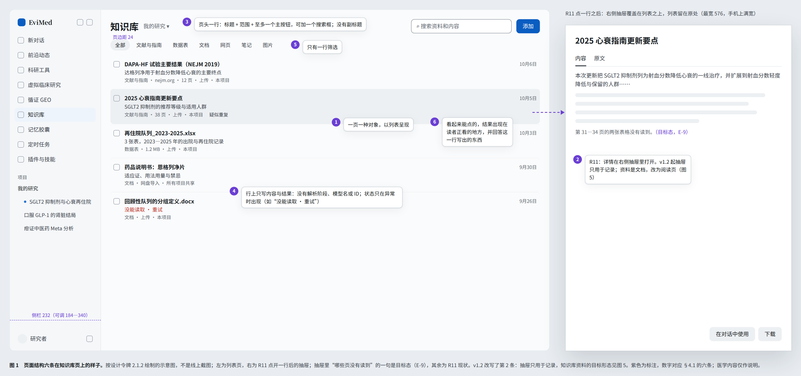
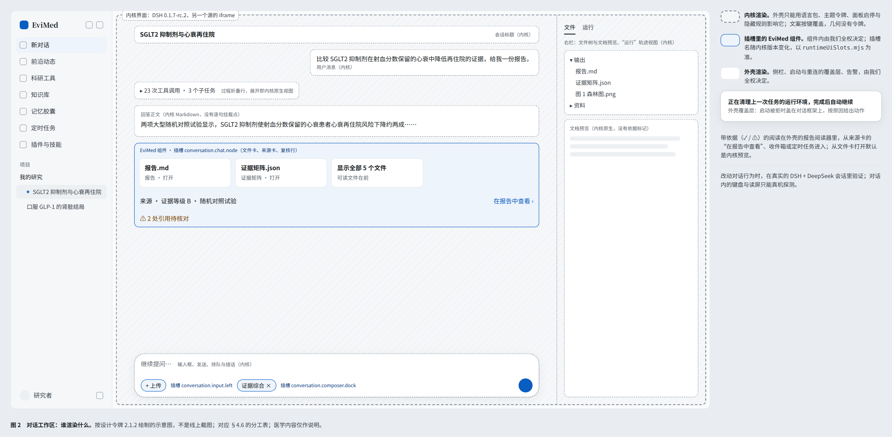
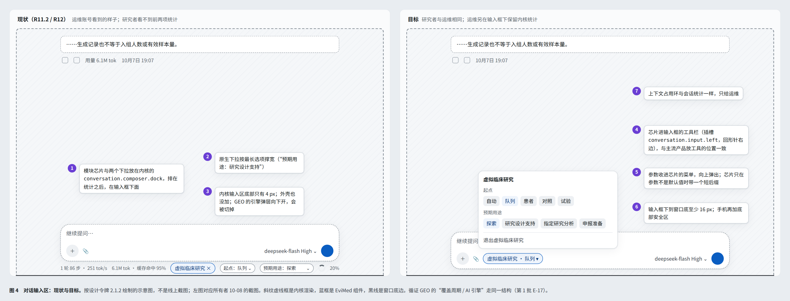
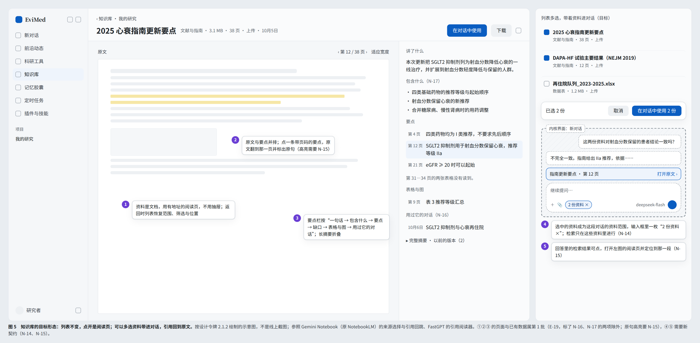
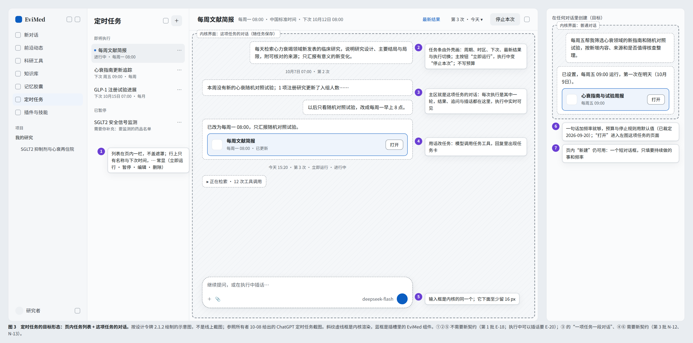

# EviMed AI 原生研究平台设计参考规范

版本 1.2 · 2026年10月8日 · 核对基线：线上 release 12（`adcd02e6b3d4`，2026-10-08 13:23Z 上线，同日并入 `github/main` `182211534`；前端与 R11.2 `3e52ca1f2` 相同）· 适用对象：产品、交互、视觉、前端、研究能力与质量团队

EviMed 的设计目标，是让研究者从问题和材料出发，持续得到可以阅读、核查、修改和复用的研究文件。对话负责表达意图，工作界面承接资料、分析与结果；用户离开对话后，仍能找到自己的研究，理解依据，并接着做下去。

本规范覆盖平台的产品理念、入口层级、布局、交互、视觉、内容、AI 状态、主要页面、响应式、无障碍、性能、验收和迭代次序。它延续现有的循证蓝与组件体系，把 AIHOT 的内容组织经验和人机交互研究落成 EviMed 的具体要求；事实以线上代码为准，规则以所有者裁定、项目规则文件和《前端设计规范 v2.1》为准。

## 本版要点（v1.2）

v1.2 是同一天的第二轮修订，起因是所有者 2026-10-08 下午在线上指出的四处问题，附了四张线上截图和一张 ChatGPT 定时任务的参照图（核对记录见 [research/F1、F2、G、H](2026-10-08-design-reference-assets/research/)）：循证 GEO 的信源点不进去；对话回答下方的模块芯片和选项堆在窗口最底下，没有留白；定时任务又是右侧拉出的抽屉，联动不了对话，也做不到即时驱动；知识库要参照主流 agent 平台。逐项读了线上 R12 的代码，用 Impeccable 的 critique 与 shape 方法评审了截图，并对照了 ChatGPT / Codex、Claude、Gemini、Manus、Gemini Notebook（原 NotebookLM）、FastGPT、RAGFlow 与几家 GEO 工具的做法。

1. **页面结构第 2 条改为按对象的性质打开（§4.1，目标；随 E-18、E-19 交付后转为现行约束）。** 记录在右侧抽屉里看；对话类对象（定时任务）在主区打开它的对话；文档（知识库资料）在有地址的阅读页打开。抽屉里不画对话，不放第二个输入框。第 6 条补一句：打开的内容要回答这一行写出的数字或状态。
2. **定时任务改为“页内任务列表 + 这项任务的对话”（§14.2，图 3）。** 即时驱动做不到的原因在服务端：每次执行单独占用项目的运行环境，执行期间这个项目的对话被拒（“项目正忙”）；反过来，只要开着对话页，“立即运行”就被拒，默认 31 分钟后才重试；抽屉里的输入框每发一句都会新起一次执行，并不是在对话里说话。
3. **知识库：列表不变，点开进阅读页（§13，图 5）。** 原文与要点并排，要点带页码；“在对话中使用”要带上资料本身，可以多选几份；回答里的引用能回到原文那一处。
4. **循证 GEO 信源（§15.3）。** 点一行打开右侧抽屉，列出能指到这个站的讲错与引用它的回答，并能进回答页。行上的“有 14 处讲错”其实是“引用它的回答里有 14 份讲错了我方”，抽屉要列出的正是这 14 份回答，文字也要改成不会被读成归因的说法。
5. **对话输入区（§4.6，图 4）。** 模块芯片放进输入框的工具栏，参数收进芯片的菜单，输入框下到窗口底至少留 16 px。
6. **第 21 节。** 第 1 批新增 E-15 至 E-20、V-10 至 V-12，并给出先后；B-1 至 B-4 按所有者 10-08 的裁定写为已完成或已裁定（R12）；B-8、B-9 已按建议采用，所有者有异议再改；第 3 批新增 N-11 至 N-17。验收新增 A17 至 A20。定稿前另做了一次独立复核（记录 I，32 条），已全部处理。

## v1.1 的要点

v1.0 对照的是一份没有合入 R10、R11 的本地检出（分支 `codex/research-evolution-engine-20261004`，HEAD `c1f02c3cc`，前端与线上相差 428 个文件），因此多处“现行约束”写的是旧界面。v1.1 以 R11.2 代码、所有者裁定与 v2.1 规范逐条重核，主要变化如下。

1. **纠正现行事实。** 模块名是虚拟临床研究；插件与技能的入口是 `/app/extensions/skills`；前沿动态是一行六个视图，证据专区是页头链接；外壳侧栏默认 232 px、收起为 0（280 与 56 是内核侧栏的常量）；`wide` 恒为 1200；所有宽度下页边距都是 24（“768 以下改 16”尚未实现）；`RunStatusDot` 没有生产使用；模拟钱包只剩充值与订单；研究者页面没有能力地图；报告阅读器的事实行只有检索截止日与生成日期。
2. **新增对话工作区的分工（§4.6，图 2）。** 对话页是 DSH 内核自己的界面，外壳只能通过插槽、语言包、主题令牌、面板启停、隐藏规则与消息桥影响它。凡涉及对话内行为的要求，先查这张表。
3. **写入页面结构六条（§4.1，图 1）与执行机制（§20.5）。** 每条现行约束都注明由测试、ESLint、组件陈列页比对、上线走查中的哪一项拦截，或只靠评审。
4. **已裁定或已由 R11 决定的事项，不再写成探索或待决定。** 所有者已裁定：不设命令面板；空白对话不放示例行；标题直接打开原文；不解释热度算法与推荐理由；研究者页面不放能力地图；404 页不放“返回上一页”。R11 已决定：不做全量 44 px 触区；不放找回密码链接；删除模拟会员与模拟退款页；不加推荐范围的调节面板。索引见附录 A。
5. **R11 已上线的能力改写为现状。** 结果版本与修改记录、知识库抽屉、前沿一行控件、收件箱的安全提醒、启动被拒时按原因给出动作等，v1.0 都写成了目标。目标只保留真实缺口。
6. **第 17 节的探索方向逐项给出处置**（采用、并入现有或不做）。第 20.6 节不再设计实验和基线，改用现有走查与真实会话验收。
7. **第 21 节按 R11 之后的状态重排为四批：** 文档与规则同步；不需要所有者决定的收尾；需要所有者裁定的事项；需要新数据契约的目标。
8. **用词对齐产品词表（附录 B）：** 研究、文件、资料、工具、灵豆。退役词只在说明裁定的地方与附录 B 中出现，不作为界面用语。

逐条修订记录见附录 D；核对证据与 v1.0 原文保存在 [2026-10-08-design-reference-assets/](2026-10-08-design-reference-assets/)。

## 1. 适用范围与规则效力

### 1.1 四种标记

| 标记 | 含义 | 使用方式 |
|---|---|---|
| 现行约束 | 已写入项目规则、设计系统或领域契约，并在 R11 中生效 | 必须遵守。每条注明执行机制，或注明“仅评审”。“现行”不等于所有页面都已符合，已知不符之处写在同一节的“缺口”里 |
| 已裁定 | 所有者已明确决定的事项，附日期（附录 A） | 不重开；要改变，须所有者重新决定 |
| 目标 | 本文提出、尚未实现的要求 | 作为下一轮设计与开发的验收条件，批次见第 21 节 |
| 探索 | 尚无数据契约或内核座位的能力 | 第 17 节逐项给出处置；未采用之前，不进入全局入口，也不纳入验收 |

在“现行约束”和“已裁定”条目里，“应”“必须”“不得”都是硬性要求；在“目标”条目里，它们是验收条件。文中的医学案例只用来说明交互，不构成医学结论。

### 1.2 事实源与优先级

规则冲突时，依次以下列来源为准：

1. 所有者最新的明确决定（附录 A 给出索引，原文在所有者批准的方案与记录里）。
2. 根目录与 `OpenScience/` 下的 AGENTS.md、CLAUDE.md。
3. 领域契约 `@evimed/domain`：状态词表、交付规则、错误码、退役名称等。
4. 视觉数值：[设计令牌源文件](../../OpenScience/packages/design-tokens/src/index.mjs)（2.1.2），这是数值的唯一来源。
5. 规则正文：《EviMed 前端设计规范 v2.1》（2026-09-27，[源文件目录](../superpowers/specs/2026-09-26-design-system-assets/)，未入库），即视觉与交互规则的完整散文版。比它更晚的裁定（如 2026-10-07 的页面结构）以 DESIGN.md 与本文为准。
6. [DESIGN.md](../../OpenScience/DESIGN.md)：令牌与规范的工程摘要。它与 v2.1 都有少量已知的陈旧项（§10.6），冲突时以令牌表和代码为准。
7. 本文：AI 原生交互、页面层级、模块现状与迭代次序。本文不新增令牌、数值或组件规则；需要新值时，先改令牌表或 DESIGN.md。

**核对基线。** 本文的“现状”指线上 R12 的代码（`adcd02e6b`，已在 main）。R12 没有改前端，界面与 R11.2 相同；它改的是后台运行位、模拟等待、删除流程等服务端行为（§21.1）。本地检出如果仍停在 `codex/research-evolution-engine-20261004`（HEAD `c1f02c3cc`），文中指向 `../../OpenScience/…` 的链接打开的是旧代码，请先更新到 main。

### 1.3 设计依据

- **Impeccable 4.5 的 Operate 与 Read 模式。** Impeccable 共有 Persuade、Operate、Read、Experience 四种模式，按页面选择，不按产品选择。工作台、列表、数据页与设置按 Operate 处理：完成任务、便于扫读、保持一致优先于表达。回答、报告、证据卡片与简报按 Read 处理：结构服务于理解，行宽与导航优先。登录页与 EviMed 主站的营销页不在本文范围内。加载记录见 [Impeccable 项目上下文](2026-10-07-impeccable/impeccable-context.txt)。
- **现状证据。** 2026-10-07 的两份线上审查（[Impeccable 逐页审查](2026-10-07-impeccable/report.md)与[线上实查](2026-10-07-live/index.html)，共 137 条，取自 R9.1）已在 R11 中逐条复核，或修复，或按裁定不采纳。记录在 release 工作区的 `docs/ui-ux-audit/2026-10-07-review/R11-两份审查整改方案.md` 与 `R11/triage-A…F.md`。本文不再把审查当日的问题当作现状。
- **所有者批准的方案。** 2026-09-20 的产品现状根因分析与一次性整改方案、2026-09-23 的界面与交互整改方案、2026-10-07 的页面与模块整改方案（其 §9.4 即页面结构规则）。
- **v1.2 的评审与对照。** 所有者 10-08 的四张线上截图按 Impeccable 4.5.0 的 critique（启发式评分、认知负荷清单）与 shape（目标结构）评审，记录 H（单上下文评审，没有运行检测器与浏览器取证）；对应代码在线上 R12 逐项核对，记录 F1、F2；主流产品的定时任务、知识库、GEO 来源分析与输入区底部的做法，记录 G（多数为官方帮助页，ChatGPT 与 Perplexity 的界面细节只有二手来源，已逐条标注）。
- **研究与外部参考**见第 22 节。它们提供方向，不能证明 EviMed 上线后的效果。

### 1.4 阅读路径

- 产品与交互：第 2—8 节、第 12—17 节、附录 A。
- 视觉与前端：第 4—5 节、第 9—11 节、第 18—20 节。
- 排期与验收：第 20—21 节，并回查对应的页面规范。

本文目录：[入口层级](#3-信息架构与入口层级) · [页面结构](#41-全局框架与页面结构) · [对话工作区](#46-对话工作区内核界面与外壳的分工) · [AI 状态](#7-ai-长任务与状态规范) · [视觉与排版](#10-视觉与排版) · [前沿动态](#12-前沿动态事件与简报) · [探索方向](#17-前沿交互与生成式界面) · [验收](#20-设计交付与验收) · [迭代次序](#21-迭代次序r11-之后) · [裁定索引](#附录-a-所有者裁定索引)

## 2. 产品理念与核心工作对象

### 2.1 四项产品原则与两条平台总则

| 原则 | 在界面上的含义 | 不符合的表现 |
|---|---|---|
| 简单 | 用户在当前位置就能认出下一步，必要信息就地给出 | 为一个操作新增入口、页面和解释文案 |
| 明确 | 名称、范围、状态与动作后果前后一致 | “完成”了却找不到结果；“重试”实际开了另一项工作 |
| 清楚 | 信息层级与研究者的阅读顺序一致 | 统计卡、流程图和标签先占满首屏 |
| 完整 | 成功、部分结果、未知、失败与恢复都有可走的路 | 只设计了有数据时的好看画面 |

四项原则是现行约束（`OpenScience/AGENTS.md`）。另有两条平台总则，均为**已裁定**：

1. **由 AI 驱动全流程，用户少确认、少点击**（2026-09-19）。系统能决定的不交给用户挑；改动直接生效，标明来源，可以撤销；唯一的人工关口是重大临床安全事件。花钱、删除和对外发布按真实业务契约确认（§6.5）。
2. **先用内核原生的界面**（2026-09-20：“我们不用创新，保持一致就行了”）。对话、输入框、过程视图、文件树与文档预览都沿用 DSH 内核。新增任何界面之前，先找内核已有的面；确需新增，要说明内核无法覆盖的理由（§4.6）。

### 2.2 AI 原生的六项设计要求

1. **围绕文件组织工作。** 一份报告、一张证据矩阵、一张分析表都可以单独打开、核查和继续使用，用户不必翻长对话找结果。
2. **自然语言与直接操作配合。** 问题用语言描述；排序、筛选、换单位、选范围用直接操作完成。直接操作放在文件页和模块页，不加进对话输入框，因为空白对话只有一个输入框（已裁定，§6.2）。
3. **让依据靠近判断。** 需要核查的结论可以直接打开对应的来源、原文或计算输入，不只在文末堆参考文献。
4. **让工作可以持续。** 用户离开、刷新或切换页面后，研究、草稿与文件仍有归处，后台工作有可找回的入口。
5. **让修改有范围。** 修改一句话、一个假设或一列变量时，生成新版本并标出改了什么，原版保留，不无意重做整份文件。R11 已实现结果版本与修改记录（§8.4）。
6. **让不确定性可以理解。** 界面状态把“没有读到”“没有发现”“存在冲突”“尚未核对”分开表达；回答正文把证据强度写进它所限定的那句话，不另外讲检索和核对的过程（§8.6）；不用一个 AI 分数概括一切。

混合界面（语言加直接操作）能减轻用户把意图完整写成提示词的负担。这一点来自对图像生成工具的观察性分析，是设计动机而不是实验结论：[NN/g，Overcoming the Articulation Barrier in Generative AI Using Hybrid Interfaces（2023）](https://www.nngroup.com/articles/ai-articulation-barrier/)。

### 2.3 稳定的工作对象

界面用词以附录 B 为准。

| 对象 | 用户理解 | 应具备的可见信息 | R11 中的典型操作 |
|---|---|---|---|
| 项目 | 一组资料与研究的范围 | 名称；同名时加创建日期 | 切换、重命名、导出、删除 |
| 对话 | 一条连续的交流 | 标题、最近时间、进行中的状态 | 继续、停止、重命名、归档、删除 |
| 研究 | 对话中一次实际执行的检索、分析与成稿 | 在做什么、真实状态、已有文件 | 看过程（内核的“运行”视图）、停止、追问 |
| 资料 | 上传或导入知识库的文献、数据与文档 | 来源、类型、读取状态、内容与原文 | 打开、在对话中使用、下载、重新读取（目标：打开是阅读页，可以多选带进对话，§13） |
| 文件 | 研究产出的报告、证据矩阵、表格与图 | 内容、依据、版本 | 阅读、查看依据、在对话中修改所选内容、导出、存入知识库 |
| 来源与依据 | 结论引用的文献，以及支撑这句话的原文引语 | 来源条目、引语、位置、核对结果 | 定位原文 |
| 动态与事件 | 一条资讯；同一件事的多篇报道与进展 | 发生了什么、最新变化、来源 | 看原文、收藏、关注事件、深入研究 |
| 证据卡片 | 审核后发布到证据专区的结构化证据 | 问题、结论、性质、时效、核对情况 | 阅读、问这条证据、质疑某条结论 |
| 记忆与胶囊 | 平台记住的偏好、做法与项目事实；可分享的一组记忆 | 内容、出处、适用范围、有效性 | 事实可编辑、可忘记（可撤销）；做法只能停用或回到上一版；胶囊可导出、导入 |
| 定时任务 | 按计划重复执行的研究；目标是一项任务就是一段对话 | 周期、时区、下次执行；每次执行的结果 | R11：新建、暂停、在抽屉里追问、查看每次执行的对话。目标：在对话里一句话新建，立即运行、暂停、编辑、删除，在任务的对话里追问与插话（§14.2） |
| 模块对象 | 一项虚拟临床研究、一个循证 GEO 项目 | 所属模块、当前阶段、可读结果 | 在模块内推进；底层是项目，界面上归入模块分组 |

这些是产品认知对象，不要求为每个对象增设一级菜单或新建数据库。研究归属于它发生的对话；模块对象归属于各自的模块分组，不与用户自建的项目平铺（R10 已实现）。

### 2.4 平台应形成的工作闭环

发现值得研究的问题 → 带着来源开始研究 → 得到可阅读的文件 → 核查关键依据 → 修改或比较版本 → 留存资料与记忆 → 有新证据时接着做。

每一次交接都要保留用户选中的对象、来源与项目。跨页后只剩一个空输入框，视为流程缺陷。R11 的交接载体是输入框里的草稿（§6.4）。

### 2.5 四种使用情境

| 使用情境 | 用户当下需要 | 设计侧重 |
|---|---|---|
| 短时间了解变化 | 判断有哪些新进展、和手头的工作有没有关系 | 有终点的简报、明确的变化、来源与收藏 |
| 深入核查问题 | 理解结论、证据和适用边界 | 舒适阅读、逐条依据、相反证据与原文定位 |
| 带数据开展研究 | 确认变量与方法，得到可复核的结果 | 资料抽屉与数据含义面板、可修改的假设、版本与计算文件 |
| 持续推进项目 | 接上之前的工作，管理定时任务，跟踪结果 | 项目范围、恢复位置、历史文件、有节制的通知 |

同一位用户一天里可能在这几种情境之间切换，界面密度和辅助信息随任务变化。情境不新增账户角色，也不改变后端的权限模型。

## 3. 信息架构与入口层级

### 3.1 四层入口

| 层级 | 解决的问题 | 应放内容 | 不应放内容 |
|---|---|---|---|
| 全局目的地 | 我到哪里做这类工作 | 新对话、前沿动态、科研工具、知识库等 | 单个工具、每一项技能、每一份报告 |
| 模块视图 | 在这里看哪一类内容 | 前沿的六个视图、记忆的四个页签、插件与技能的两个页签 | 重复的全局导航 |
| 工作对象 | 我正在处理什么 | 一个事件、一项研究、一份报告 | 与当前对象无关的推荐墙 |
| 就地操作 | 现在对这个对象做什么 | 查看依据、收藏、筛选、导出、修改 | 为轻量动作单独开一套页面 |

从全局入口到已有结果，目标路径是清楚的“列表 → 对象”。复杂任务可以多几步，但每一步都要带来真实的决策或信息，不用“三次点击”这类规则代替任务分析。

### 3.2 全局导航与地址

**现行约束：** 入口、顺序与可见性以 [Sidebar.tsx](../../OpenScience/apps/web/src/components/sidebar/Sidebar.tsx) 为准，路由以 [router.tsx](../../OpenScience/apps/web/src/app/router.tsx) 为准。首页进入对话，不设营销式的工作台首页。

| 入口 | 地址 | 主要任务 | 层级要求与 R11 现状 |
|---|---|---|---|
| 新对话 | `/app/chat` | 提问或开始研究 | 首要入口；历史对话在侧栏的项目分组里 |
| 前沿动态 | `/app/frontier` | 发现动态、读简报、跟踪事件 | 模块开通时紧接新对话；证据专区（`/app/frontier/zones…`）、事件页（`/app/frontier/events/:id`）、作者页（`/app/frontier/authors/:id`）都从这里进入 |
| 科研工具 | `/app/capabilities` | 选一项工具开始研究 | 工具只在这里铺开，不进全局导航（已裁定 2026-09-22） |
| 虚拟临床研究 | `/app/virtual-research` | 推进一项研究 | 模块开通时位于科研工具之后 |
| 循证 GEO | `/app/geo` | 为产品做循证内容的调研、制作与分享，并测量它在 AI 回答中的表现 | 模块开通时位于虚拟临床研究之后 |
| 知识库 | `/app/files` | 管理和使用资料 | 一张列表；R11 点开是右侧抽屉，目标是阅读页 `/app/files/:sourceId`（§13.1） |
| 记忆胶囊 | `/app/memory` | 查看和管理记忆 | 不与资料混排 |
| 定时任务 | `/app/autopilot` | 管理重复执行的研究 | R11 是列表加右侧抽屉（`?task=`）；目标是页内任务列表加这项任务的对话，`/app/autopilot/:taskId`（§14.2） |
| 插件与技能 | `/app/extensions/skills`（默认进技能页签） | 管理技能与插件 | 一页两个页签；`/app/extensions/plugins` 从页签或设置进入 |
| 收件箱 | `/app/inbox` | 查看需要注意的变化与结果 | 入口是侧栏顶部的铃铛，不是导航行；有未读的临床安全提醒时，铃铛换成盾形 |
| 设置 | `/app/account?tab=…` | 账户、外观、通知、用量（开通科研计费时叫“科研额度”）、数据源、项目；运维分区只对运维账号显示 | 入口是侧栏底部的齿轮 |

前沿动态、虚拟临床研究、循证 GEO 三行，只在 `/api/me` 返回对应功能已开通时出现：三个模块开关默认关闭，虚拟临床研究与循证 GEO 的受众默认只有运维。模块未开通时不显示导航行；旧深链显示一句具体说明（如“前沿动态还没有在这个工作空间开放。”），返回靠全局侧栏（**现行约束**）。旧地址（`/app/sources`、`/app/runs` 等）保留重定向，不报 404。

**已裁定（2026-10-07）：** 两个模块的用户可见名是循证 GEO 与虚拟临床研究；标识符 `geo`、`vcr` 和路由不变。“循证传播”“虚拟临研”是退役词，`retiredWords.test.ts` 与上线走查在任何页面上发现它们即判失败；搜索框把旧名读作新名，至 2027-01-07 为止。

### 3.3 项目范围与导航行为

**现行约束：** 项目是账户级的选择，普通路由不携带项目 ID；不为面包屑另造一套 URL。

- 同名项目由 `projectLabels()` 统一加上创建日期（如“名称 · 9月29日”），用于侧栏、知识库范围菜单、记忆、设置、定时任务、GEO 列表和删除确认；不用原始 ID 区分（**现行约束**，R11）。
- 切换项目时页面按项目重新挂载，旧请求迟到的响应不会进入新项目；对话框架按项目各自保留，至多 2 个，先释放再启动（**现行约束**，`AppShell.projectSwitch.test.tsx`）。正在编辑的内容留在原项目，不被静默移走。
- 跨项目的文件链接先解析所属项目，再把外壳切过去。属于他人或已删除的私有对象，用同一句话说明，不透露对象是否存在；连接失败单独给“重试”（**现行约束**，与 v2.1 的 AC03 一致）。
- 浏览器前进、后退应恢复筛选、排序、滚动位置与当前对象。R11 只有前沿动态做到了（视图与筛选在 URL 里，页数与滚动位置在浏览历史状态里）；知识库、收件箱、记忆与定时任务是**目标**（第 21 节 E-8）。恢复动作不得再次提交研究，也不得再次扣费。
- 一个模块只有一套内部导航。嵌入 EviMed 主站（`?embed=1` 或 wujie 容器）时只渲染内容区，全局导航由宿主承担（**现行约束**）。
- 每项虚拟临床研究、每个 GEO 项目在底层都是普通项目。侧栏与知识库范围菜单把它们收进“虚拟临床研究”“循证 GEO”两个分组（侧栏分组标题旁显示数量），不与用户自建的项目平铺（**现行约束**，R10）。

### 3.4 何时新增入口

同时满足以下条件，才考虑新增全局入口：有独立且高频的用户任务；有需要持续管理的对象；现有目的地无法自然承接；在手机和不同权限下仍有清楚的归属。

新增一种研究工具、一个结果视图或一种筛选，应进入科研工具目录、对象页面或就地操作。工具数量增长，导航数量不随之增长（已裁定 2026-09-22：“其余的工具都放到科研工具去”）。

### 3.5 搜索与快捷键

- **现行约束：** 搜索框的占位文字就是它的名字，用一个词或短语，如“搜索”“搜索工具”“搜索记忆”“搜索资料和内容”；范围由所在页面与页头的范围菜单表达，不写成长句（v2.1 §18.3）。前沿动态与插件与技能目前只写“搜索”，可改为“搜索动态”“搜索插件与技能”（低优先级目标）。
- **缺口：** 有输入时应出现“清除搜索”按钮，并支持 Esc 清空（`SearchInput.onClear`）。R11 产品页里的 15 个搜索框只有 3 个接了清除，其余 12 个隐藏了浏览器自带的清除按钮却没有替代（侧栏的“搜索对话”是原生搜索框，自带清除）。第 1 批修复。
- **目标：** 跨范围的搜索结果按项目与对象类型区分；资料、对话、动态和工具不以同一种无标识的卡片混排。
- **现行约束：** 前沿动态没有精确命中时，写明“没有找到包含‘…’的动态，下面是意思相近的内容”，并可清除。
- **已裁定（2026-09-22）：** 没有全局命令面板，也没有“快速跳转”行（`components/command-palette/` 已清空）。重新引入须由所有者决定。
- **现行约束：** 外壳的快捷键只有 ⌘/Ctrl+B（收起侧栏）、`?`（快捷键表）与 Esc；焦点在对话框架内时，⌘/Ctrl+B 与 `?` 经消息桥转给外壳；Esc 由各层自己处理。对话输入框里的 `/` 是内核的斜杠菜单（含 `/工具`），归内核。新增单字符快捷键须经设计评审，在输入框内和中文输入法组字期间不得触发。
- **缺口：** `?` 是单字符快捷键。WCAG 2.2 SC 2.1.4（A 级）要求这类快捷键可以关闭、可以改键，或只在相应组件获得焦点时生效；R11 只做到不在输入框里触发。第 1 批补上关闭开关（V-8）。

## 4. 页面布局与信息顺序

### 4.1 全局框架与页面结构

**现行约束：** 页面使用 `PageShell`。标题、操作与正文在同一栏、同一条左边线上，页边距 24 px；下钻页用 `back` 槽在标题上方放返回链接。页头只有一行：标题，可附灰色的数量、范围或更新时间；右侧至多一个主要按钮（实心强调色），外加至多两个图标按钮或一个搜索框。`PageHeader` 没有放副标题的位置，标题下不解释系统如何运作（DESIGN.md；上线走查对页头里的段落和第二个实心强调色按钮判失败）。

**现行约束：页面结构六条**（2026-10-07 所有者批准的页面整改方案 §9.4，见 DESIGN.md「页面结构」。W 表示上线走查拦截，R 表示只靠评审）：

1. 一页一种对象，以列表呈现。另一种对象进页签或另一页，不在上下堆叠。（W：只对 `SECTION_SHAPES_BY_PAGE` 列出的页面按区块形状计数——知识库、记忆的四个页签、前沿的五个视图、科研工具、插件与技能、虚拟临床研究首页与研究页签；收件箱、设置、循证 GEO 首页、证据专区与定时任务只靠评审）
2. 详情在右侧抽屉里打开，列表留在原处；一行不把读者带去另一页读它本来就有的内容。（R）

   **目标（v1.2，B-8）：** 按所有者 2026-10-08 对定时任务与知识库的意见，改为按对象的性质打开：
   - **记录**（记忆条目、收件箱消息、前沿动态、证据矩阵的一行、循证 GEO 的信源与讲错）在右侧抽屉里看，列表留在原处；记录类的行不把读者带去另一页读它本来就有的内容；
   - **对话类对象**（定时任务）在主区打开它的对话，列表留在页内一栏；
   - **文档**（知识库资料、报告、事件）在有地址的阅读页打开，返回时列表恢复原状；这两类对象的行本来就是页面的入口。

   抽屉里不画对话，不放第二个输入框。随 E-18、E-19 交付后转为现行约束，并回写 DESIGN.md（D-2）。
3. 页头 = 标题 + 范围 + 至多一个主要按钮，可以有搜索框；两个实心强调色按钮判失败。（W）
4. 只放能操作的东西和结果本身。系统状态、版本号、模型名、标识符、统计是怎么数的，都不上用户页面。（W 词汇闸门 + R）
5. 至多一行视图切换、一行筛选。第二排页签、一排芯片下面再一排芯片、页签上方再加一行导航，都算多出一行。（R）
6. 看起来能点的，要在读者正看着的地方给出结果：抽屉、新页、页签或就地展开，不能只改动折叠线以下的内容。打开的内容要回答这一行写出的数字或状态：红色的计数打开后列出被计数的条目（v1.2 补充，目标）。（W：只对 `ROW_CLICK_PAGES` 列出的 14 个页面点击首行，判断有没有出现结果；只有循证 GEO 信源（展开的详情出现）与定时任务（抽屉页头写了单次上限）另有内容断言，V-11 随新形态改写；其余页面只靠评审）

主体的阅读顺序是：当前对象或问题 → 有价值的内容或可用结果 → 与当前内容有关的操作 → 依据与补充信息。布局可以变化，这个优先级不能颠倒。

| 区域 | 作用 | R11 现状与要求 |
|---|---|---|
| 全局侧栏 | 目的地、项目与对话 | 默认 232 px，可拖动或用键盘在 184—340 之间调整，拖到 140 以下自动收起；收起后宽度为 0 且 `inert`，主区顶部留“展开侧边栏”按钮；每个项目分组先显示 5 条对话，其余“展开其余 N 条对话” |
| 页头 | 当前页面与主动作 | 见上；与正文同一条左边线 |
| 内容工具栏 | 视图与筛选 | `Tabs` 的 `trailing` 槽把当前视图的筛选和搜索放在页签同一行的右侧，640 px 以下落到页签下方 |
| 主体 | 阅读、比较或操作 | 先出现实际内容 |
| 右侧抽屉 | 记录的详情与短编辑 | 页面结构第 2 条；窄屏占满宽度 |
| 页内列表栏 | 对话类对象的列表（定时任务） | 目标：约 300 px，不盖遮罩；小于 1024 时列表就是页面（§14.2） |

### 4.2 页面模板

| 模板 | 适用页面 | 容器与结构 | R11 现状与要求 |
|---|---|---|---|
| 阅读型 | 报告、证据卡片、事件、文章 | 设计意图是 `read` 720；正文用 `max-w-measure-body` 640 限制行宽 | `PageShell` 还没有 `read` 档：报告阅读器靠退役别名 `max-w-content` 得到 720，证据卡片与事件页在 `page` 1040 的栏里靠行宽限制。给 `PageShell` 加 `read` 档并迁移这三类页面，是第 1 批目标 |
| 列表型 | 前沿动态、科研工具、收件箱、插件与技能、记忆 | `page` 1040；标题与工具栏之后直接是列表 | 同类信息成行，不堆重复的大卡片（**现行约束**） |
| 数据型 | 循证 GEO 项目页（七个页签）、虚拟临床研究首页与研究页 | `wide` 1200；结论与关键指标在前，解释性图表在后（循证 GEO 首页与回答详情页用 `page` 1040） | 数字带口径（§11）。令牌已定义 `wide-max` 1280，但没有页面使用；视口不小于 1440 时是否放宽，待评审 |
| 材料型 | 知识库 | R11：`wide` 1200 内一张资料列表 + 类型筛选行 + 右侧抽屉（“内容 / 原文”） | 不再是三栏；v2.1 与 DESIGN.md 里的“三栏知识库”已过时。目标：列表不变，点开是阅读页，原文与要点并排（§13.1，图 5） |
| 任务型 | 定时任务 | 目标：页内任务列表栏 + 主区（任务条与这项任务的对话） | R11 是列表加右侧抽屉；目标见 §14.2 与图 3 |
| 对话工作区 | 提问、研究、继续对话 | 内核界面（§4.6） | 外壳不重画输入框、消息流和过程视图 |

表格或大图需要更宽的空间时，在自己的容器内横向滚动（`ScrollRegion`），不让整页文字变成超长行。

### 4.3 首屏预算

**目标**（产品验收条件，不是行业定律）：在 1512 × 945（所有者的屏幕，上线走查的基准）与 390 × 844 两个视口中，普通列表页不滚动就能看到至少一条可理解的内容及其主操作；阅读页能看到标题与正文开头；模块页能看到当前对象与可用结果的入口。设计评审另看 1440 × 900。

**现行机制：** 上线走查对以下情况给出提示（不判失败）：手机上前沿首条标题的顶部低于 520 px；页面高于 12 个视口；首屏的数据行数超过该页上限。循证 GEO 的两项判失败：行动页签里“投放要等媒介集市接通……”那一句必须出现在首屏；手机上的进度栏必须折成一行并默认收起。

安全提示、必要的身份验证和真实的空状态按内容需要处理，不为满足首屏条件而隐藏。

达成手段：不重复页头；低频筛选收进“更多”或筛选选择器；精选页的热点只显示前三条（手机一条），完整榜单另开一页；手机上不同时展开全局菜单、往期、目录与详情；长流程只显示当前阶段，其他阶段的进度放进页签上的状态点。

### 4.4 边框、留白与密度

先用间距分组，再用背景差，最后才用线。至多一层带边框的容器；卡片标题下不画线；表格只画表头下的线和行间的淡线（**现行约束**；上线走查限制每页的边框种类，默认不超过 3 种）。

密度按任务决定：浏览用紧凑的行，判断用对比表，阅读用舒适的行距。不要把数据表的一行撑成高卡片，也不要把正文挤成仪表盘的密度。列表可以铺满容器，单条长摘要仍遵守阅读行宽。

### 4.5 典型页面排布（R11 现状）

| 页面 | 首区 | 主内容 | 辅助区 |
|---|---|---|---|
| 前沿 · 精选 | 页头：标题、“证据专区 ›”、搜索；一行页签（精选 · 全部 · 热榜 · 与我相关 · 关注 · 简报）及右侧筛选 | 近 48 小时的安全警示条（有则显示）；当前热点卡（前三条，“完整热榜 ›”）；动态列表 | 详情抽屉 |
| 研究报告 | 文档标题；事实行（检索截止日、生成日期）；临床安全结论块（有则显示，不折叠） | 正文、表格、图；句末的“依据”标记 | 目录、依据弹层、“结果版本”面板 |
| 知识库 | 页头：标题、范围菜单、搜索、“添加” | 类型筛选行；资料列表 | 右侧抽屉（“内容 / 原文”、“在对话中使用”“下载”） |
| 虚拟临床研究 · 研究 | 研究名；一行带状态点的页签（总览 · 定义与证据 · 人群 · 虚拟患者 · 对照 · 试验 · 匹配与招募） | 默认进总览：可读结果与最近变化 | 页头的“对话”是唯一的输入入口 |
| 循证 GEO · 项目 | 项目名；七个页签（总览 · 可见度 · 准确与安全 · 问题与回答 · 信源 · 行动 · 方案） | 总览：读数与变化（全站同一个 `readingChange()`）；进度栏只在总览，手机上折叠 | 分母写一行；明细进对应页签 |

知识库、定时任务与循证 GEO 信源的目标排布见 §13.1、§14.2 与 §15.3；上表只记 R11 的现状。

### 4.6 对话工作区：内核界面与外壳的分工

对话页是 DSH 内核自己的浏览器应用，放在另一个源的 iframe 里（`RuntimeUiFrame.tsx`）。它由 `SessionFrameHost` 挂在路由之上，离开对话页时只隐藏、不卸载，后台的研究照常进行。外壳能影响它的通道只有六种：插槽（`runtimeUiSlots.mjs`）、语言包 `zh-x-evimed`、主题令牌（`overrideTokens`）、面板启停（`dshProfilePatch.mjs`）、隐藏与摆放的样式规则（`runtimeUiShell.mjs`），以及消息桥（`runtimeUiBridge.mjs`）。内核版本钉在 `@deepseek-ai/dsh@0.1.7-rc.2`。

| 区域或行为 | 由谁渲染 | 外壳可用的手段 | 设计时要注意 |
|---|---|---|---|
| 对话滚动、流式输出、“回到底部” | 内核 | 无（只有防止横向滚动的样式） | 跟随规则沿用内核；v2.1 §29.4 的期望作为向内核核对的清单，不写进外壳验收；按钮文案归内核 |
| 输入框、发送、排队与插话 | 内核 | 语言包键（如“排队发送 · Ctrl/⌘+Enter 插话”）；插槽占位 | 外壳不能介入发送流程；输入框里不显示项目名 |
| 工具标签与示例 | EviMed 组件：空白对话在 `conversation.hero.agentPreset`；有会话时在 `conversation.composer.dock`（输入框下方那一行，排在内核的会话统计之后） | 组件内全权；可以换到 `conversation.input.left` / `.right`（输入框工具栏）或 `conversation.input.dock`（输入框上方，需自己限宽） | 只在选中工具后出现；示例至多 3 条，点一下即填入输入框；GEO 与虚拟临床研究另有参数控件。R11 的位置被所有者指出“堆在最底下”，目标见下（E-17） |
| 上传与附件 | 内核附件栏；上传按钮在 `conversation.input.left` | 限制路径与大小（单文件不超过 50 MiB） | 没有上传进度，只显示“发送中”；没有“已上传但尚未读完”这一态 |
| 输入区底部 | 内核：输入区底部内边距只有 4 px；输入框下方是 `conversation.composer.dock` 一行（会话统计、EviMed 的芯片与参数）与上下文占用环 | 样式规则（只用稳定的属性选择器）；会话统计已对研究者隐藏（`[data-composer-stats]`），占用环没有隐藏 | R11 的外壳与内核都没有底部留白，最下面一行离窗口底边约 4 px；目标见下（E-17） |
| 结构化提问（澄清卡） | 内核的 `ask_user_question` 视图 | 部署开关 `OPEN_SCIENCE_RUNTIME_ASK_USER`，默认关 | 默认只有正文里的提问；设计不能假定一定有澄清卡 |
| 过程视图 | 内核：折叠行“N 次工具调用 · M 个子任务”，以及“运行”页签（轨迹视图） | 语言包改名；面板启停 | 对研究者开放（已裁定 2026-09-22、09-29）；会话统计行与用量只对运维显示 |
| 回答末尾的文件卡、来源卡、复核行 | EviMed 组件，放在内核插槽 `conversation.chat.node` | 组件内全权 | 文件卡按类型排序，先显示 4 个；复核行只在有问题时出现 |
| 逐句的“依据”标记 | 只在外壳的报告阅读器里 | — | 内核的 Markdown 没有逐句挂载点，对话里的回答没有逐句标记 |
| 从文件卡打开文件 | 优先用内核原生预览，原生不可用时退到外壳阅读器 | 面板启停 | 同一份报告有两个阅读面：内核预览没有依据标记；带依据的阅读从来源卡的“在报告中查看”、收件箱或定时任务进入（已裁定 2026-09-22：预览用内核原生） |
| 连接、等待与启动被拒 | 外壳（覆盖层与告警） | 全权 | 见 §7.2；重连期间覆盖层会挡住对话 |
| 颜色与字体 | 主题令牌经 `overrideTokens` 进入内核（约 60 个变量） | 令牌层 | 内核没有间距与圆角的令牌族，§10.3 的几何规则约束不到内核自绘的部分 |
| 文案 | 语言包 `zh-x-evimed`（覆盖约 40 个键，其余用内核的 `zh`） | 按键覆盖 | 不能批量替换；改之前先确认内核的键名 |
| 对话内的键盘与读屏 | 内核 | 无（外壳只管框架名称与焦点交接） | 只能真机探测，不进外壳的自动化验收 |

**现行约束：**

1. 只用内核文档化的扩展点：插槽、语言包、主题令牌、面板启停与消息桥。样式规则只用后缀类名、`aria-label` 与内核稳定的 `data-*` 属性选择器，只用于隐藏、摆放与固定阅读宽度。不改内核的 DOM，不修补 `node_modules`（AGENTS.md）。
2. 新增对话内的元素，先找内核已声明的插槽。插槽与键名随内核版本变化，每次升级内核后重新核对。
3. 对话内的视觉以内核为基准，外壳向内核看齐（DESIGN.md）；EviMed 自绘的卡片照抄外壳的几何（`runtimeUiStyles.mjs`）。
4. 涉及对话行为的改动，在真实的 DSH + DeepSeek 会话上验证（CLAUDE.md “Verifying a conversation change”）。mock、HTTP 200 与 `stream_end` 都不算验证。

**目标：输入区（E-17，图 4；所有者 2026-10-08：选项“都堆到了最底下”，“一点没有底部的空白”）。**

- **R11 的情况（记录 F1）：** 选中的工具芯片（所有工具，不只两个模块）和虚拟临床研究的“起点”“预期用途”两个原生下拉放在 `conversation.composer.dock`，也就是输入框下面那一行，排在内核的会话统计（运维才看得到）之后，后面还有内核的上下文占用环。原生下拉按最长的选项撑宽（“预期用途：研究设计支持”）。内核输入区底部只有 4 px，外壳也没有补，整行贴着窗口底边。循证 GEO 的“AI 引擎”弹层向下展开，贴底时可能被截掉（按样式推断，未在浏览器里核实）。
- **所有工具芯片进输入框的工具栏**（`conversation.input.left`，回形针之后），芯片上保留一键移除的“×”。这是主流产品放已选工具的位置：ChatGPT 选中的工具是框内可移除的标签（二手：第三方对真实界面的探测），Gemini 把工具收进“+”菜单，Claude 把模型与推理强度放在发送键旁（记录 G §4）。只有两个模块有参数：参数收进芯片的菜单，向上弹出；芯片只在参数不是默认值时带一个短后缀（如“虚拟临床研究 · 队列”）。循证 GEO 的“覆盖周期”“AI 引擎”同样处理。空白对话没有工具栏插槽（插槽只在有会话时渲染），芯片与参数照旧在 `conversation.hero.agentPreset`，会话开始后才进工具栏。
- **窄屏：** 左侧容器能否收缩、怎样省略，要先在 0.1.7-rc.2 上量过再定（右侧放模型与发送键的容器不收缩）。390 × 844 的通过条件：工具栏不换行、不横向滚动，芯片可点，菜单不被裁；模块芯片与资料范围芯片（N-14）同时出现时，资料芯片只显示数量。
- **输入框下面不放 EviMed 的控件。** 最后一个控件到窗口底至少 `max(16px, env(safe-area-inset-bottom))`，写成外壳样式表里的一条摆放规则（约束 1）；跨源 iframe 里的安全区是否非零，要在 iPhone 或模拟器上验证，取不到就由外壳给框架的容器留底。上下文占用环与会话统计同样处理（2026-09-29“会话统计只给运维”的延伸，所有者有异议再改；附录 C），选择器用它稳定的 `button[aria-haspopup="dialog"]` 加语言包键 `context.aria` 给出的 `aria-label`。
- 改动在 `packages/harness-port`（`runtimeUiCommands.mjs`、`runtimeUiShell.mjs`），对话框架的脚本来自运行环境镜像，所以随镜像发布（发布会终止进行中的研究，挑没有研究在跑的时候）；按约束 4，用 1512 × 945 与 390 × 844、运维与研究者两个账号，在真实会话里验收，先量出 dock 为空时内核自己的底部间距。

## 5. 响应式、滚动与焦点

### 5.1 结构变化

**现行约束：** 断点用 Tailwind 的 640、768、1024、1280、1536 CSS px。小于 1024 时，全局侧栏变为覆盖式抽屉（至多 85% 视口宽，点遮罩或按 Esc 关闭，关闭后 `inert`）；390 px 下任何页面都不得横向滚动（上线走查）；小于 768 时输入框文字为 16 px，防止 iOS 聚焦时放大。响应式优先调整结构，不靠缩小字号塞进桌面布局。

**缺口：** DESIGN.md 与 v2.1 规定“小于 768 时正文侧边距 16 px”，但 `PageShell` 在所有宽度下都是 24（只有报告阅读器在 640 以下用 16）。第 1 批在 `PageShell` 落实。

| 场景 | 桌面 | 手机 |
|---|---|---|
| 全局导航 | 宽度可调、可收起的侧栏 | 顶部按钮打开抽屉；关闭后移出焦点序列 |
| 报告依据 | 依据弹层 | 单层弹层或抽屉，关闭后回到原来的标记 |
| 往期与分类 | 页头里的“往期”“分类”菜单 | 同一入口，不常驻 |
| 复杂筛选 | 常用条件在页签行右侧，其余进“更多” | 640 以下控件落到页签下一行，保留当前条件的摘要 |
| 宽表 | 表头固定，行标题列冻结，横向滚动区可聚焦（`ScrollRegion`） | 证据矩阵改为卡片；其他表格在表内横向滚动，重要字段放进行详情 |
| 对比结果 | 并排或差异表 | 按同一比较维度纵向成对排列 |
| 标题与固定宽度的侧列 | — | 标题至少两行可读；固定宽度的侧列在 768 以下改为纵向排列（目标；R11 修过同类缺陷） |
| 并排的列表与对话、原文与要点（目标） | 按内容区宽度而不是视口宽度决定：定时任务的对话窗格至少 640 px，阅读页的原文栏至少 560 px，不够时退成单栏 | 定时任务的列表就是页面，点一行进入任务；阅读页是“内容 / 原文”两个页签 |

### 5.2 滚动约定

- 阅读页以页面的纵向滚动为主，不给每个正文块各套一个滚动区。
- 多栏工作区可以各自滚动，但每栏边界要清楚，触控板、键盘和触摸都能到达全部内容；横向滚动区要可聚焦（**现行约束**，`ScrollRegion`，走查检查）。
- 对话里的流式跟随与“有新内容”按钮是内核的行为（§4.6）。v2.1 §29.4 的期望——停在底部时跟随、向上翻阅后不再被拉回、选中文字时段落不动、刷新或重连后不自动重新提交——作为向内核核对的清单。
- 新动态进入时显示可点击的更新提示，不插到用户正在读的那一行上方（前沿动态的“有 N 条新的”，**现行约束**）。
- 固定页头、底部输入区和软键盘不得遮住焦点、错误提示和最后一行内容（目标：除页签行外，固定区还没有统一的 `scroll-padding`）。
- 贴底的控件（对话输入区、抽屉与阅读页底部的操作条、多选条）到窗口底至少 `max(16px, env(safe-area-inset-bottom))`（目标：R11 的 `apps/web/src` 里没有任何安全区处理，对话页底部只有内核的 4 px；对话输入区是 E-17，外壳的其余底栏是 V-12，走查探针见 V-11）。

### 5.3 层级与返回

菜单用于短动作；Tooltip 用于图标名称和截断文字的全文；抽屉用于记录的详情和短编辑；对话类对象在主区打开它的对话；对话框用于需要集中处理的短决策；长文和可以单独引用的文件（包括知识库资料）用页面（页面结构第 2 条，v1.2）。

**现行约束：** 抽屉与对话框都是模态层：焦点限制在层内，点遮罩或按 Esc 关闭，关闭后焦点回到触发控件；第一次按 Esc 就关闭（R11.1 修复）；Esc 只关最上面一层。折叠的侧栏 `inert`，不在 Tab 序列里，焦点回到“展开侧边栏”（R11 修复了审查的 B02；上线走查检查折叠侧栏的 `inert`，以及 390 px 下的前两个 Tab 停靠点）。验收时仍应在关闭状态下走一遍完整的 Tab 路径。

**目标：** 路由切换后先更新页面标题，再把焦点移到新页面的 h1；只改地址参数（筛选、页签）时不移动焦点（v2.1 §10.3，R11 未实现）。触发控件已被删除时，焦点落到相邻的对象上。

## 6. 输入、澄清与跨页面交接

### 6.1 从用户已有的内容开始

| 用户输入 | 优先承接方式 | 不应强制发生 |
|---|---|---|
| 简单问题 | 直接回答，必要时引用依据（开放领域回答线，不产出文件） | 为每个问题建计划、表单或文件 |
| 明确的报告请求 | 识别交付目标，进入相应的工具 | 让用户先认识内部的智能体名称 |
| 已有数据 | 进入以数据为起点的研究范围确认 | 默认当作只需检索文献的任务 |
| 一篇文献或一个事件 | 带入原文链接、标识与研究问题（“深入研究”草稿） | 让用户重新粘贴已经打开的内容 |
| 对现有报告的修改 | 选中内容后“在对话中修改所选内容”（附结果版本引用） | 静默重写整份报告 |

**现行约束：** 普通问答与文件交付型研究是两条产品路径。路由顺序是：已绑定专项工具的对话留在该工具里；点名某个专项交付物的请求进该工具；其余由意图分类器判断（默认开启），规则只作兜底；分类失败与其他情况一律进回答线。简单问题不强制使用工具、记忆或规划流程（CLAUDE.md 原则 12）。

### 6.2 输入区

**已裁定（2026-09-22）：** 空白对话只有标题和一个输入框，下方不放工具宫格、示例问题行或推荐流。在科研工具里选中一项工具（或在输入框里输入 `/工具`）后，它成为输入框上的一个标签，旁边至多三条这项工具的示例，点一下即填入输入框。工具不是输入框上方的另一个页面，也不带第二个输入框。

**现行约束（R11）：**

- 输入框、发送、排队与插话、附件栏都属于内核（§4.6）。外壳只在内核插槽里放工具标签、示例与上传按钮，并提供用 `@` 引用知识库资料。
- 参数控件只有两处：循证 GEO 的“覆盖周期”“AI 引擎”，虚拟临床研究的“起点”“预期用途”。用户没说的由平台设定并标“AI 设定”，用户可以改。其他工具不加参数表单：参数从对话中获得，缺的由模型追问，或采用写明的默认值。R11 把它们和工具标签一起放在输入框下方，目标是收进工具栏里芯片的菜单（§4.6，E-17）。
- **输入只在对话里**（2026-09-20 裁定的延伸）：定时任务、模块页与资料页都不另画输入框。R11 的定时任务抽屉底部有一个外壳自绘的输入框，违反这一条，由 E-18 去掉。
- 工具卡上不写输入前提；选中工具之后，由输入框说明需要哪些资料。
- 输入框不显示当前项目，项目在侧栏分组里表达。

**目标：**

- 深度研究按发送即开始，不弹确认框。有可靠估计时，在输入框下方用一行写出预计时长与灵豆区间，如“预计 15～25 分钟 · 约 80～120 灵豆”（v2.1 §19.3）。费用部分的范围：模拟钱包部署的工具卡上已有估算（§15.1，现状）；真实钱包与输入框下方的估算行，随计费上线一起做（附录 A）。
- 外壳自己的按钮遵守动作语义：“开始研究”会启动研究并可能计费，“生成草稿”产出可编辑的预览，“保存”保存当前对象。同一名称在不同页面不得触发不同等级的副作用。对话框架里发送键的名称归内核语言包。

### 6.3 澄清与默认值

- 只追问会改变对象、方法、范围、费用或结论解释的缺失信息。一次问一个，给可点的选项，也允许自由输入；能先回答的先回答，其余写明假设（如“按成人、肾功能正常回答”）后继续推进，用户可以再改（v2.1 §29.6）。
- 用户补充信息后，在原来的研究里继续，不另起一项。
- 结构化的澄清卡取决于部署开关 `OPEN_SCIENCE_RUNTIME_ASK_USER`（默认关）；关闭时，模型在正文里提问。虚拟临床研究的做法是不问，先设默认值并标“AI 设定”。

例如：只要求整理一篇论文时，不先要求一份完整的研究方案；要比较两组数据却缺少分组字段时，先确认字段。默认假设写在受它影响的结果旁边，不用全局横幅反复提醒。

### 6.4 交接协议

**现行约束（R11）：** 从前沿动态、知识库、证据专区或模块页进入对话时，载体是输入框里的一条草稿（`RuntimeUiIntent`：类型、项目、请求、会话、草稿，以及可选的结果版本引用）。草稿从不自动提交，用户按下发送才开始研究。会话 ID 由外壳先生成、内核按 ID 幂等创建，所以点一次、返回再进入、刷新深链都不会重复提交。

| 入口 | 草稿携带的内容 |
|---|---|
| 前沿动态的“深入研究” | 标题、来源、原文链接、DOI / PMID / 注册号、导读 |
| 事件页的“深入研究” | 事件标题与一手材料列表 |
| 证据卡片的“问这条证据” | 证据问题与卡片引用 |
| 证据卡片的“用这张卡继续研究” | 新建一个项目，把卡片的主要来源存入知识库，问题草稿放进输入框（不发送）；它会写知识库，不只是一个草稿捷径 |
| 证据专区的“问这个专区” | 专区问题草稿（空专区不显示这个入口） |
| 知识库的“在对话中使用” | R11：切到资料所在项目，开一个新对话，草稿里只有资料标题与文件名，不附文件、不设范围，模型要按标题自己去找。目标：选中的资料作为输入框里的引用芯片带进对话，并成为这段对话的资料范围，可以多选（N-14）；草稿里不写资料标识或内部路径（§18.4） |
| 循证 GEO 信源抽屉的“在对话中处理”（目标，E-15） | 域名与能指到这个站的讲错句子 |
| 对话里任务卡的“打开”（目标，N-13） | 打开定时任务页并选中这项任务；需要在框架到外壳的导航目的地里加 `autopilot` |
| 循证 GEO 的“问 AI” | 数值、样本与测量日期 |
| 结果版本的“在对话中修改所选内容” | 所选内容与结果版本引用（随请求一起交给内核） |
| EviMed AI 搜索的“转为深度研究” | `/app/handoff`：首条消息放进输入框但不发送；没有内容时只给“开始新对话”，链接损坏时写“这条转入链接已失效” |

**已裁定（2026-09-24）：** “深入研究”这类捷径往输入框里放一条合适的草稿，不先弹出一个备选问题菜单。

**目标（低优先级）：** 在对话里保留可以点回原对象的结构化引用，而不只是草稿文字。这需要扩展 `RuntimeUiIntent`，并占用一个内核插槽（第 21 节 N-7；知识库资料这一类提前到 N-14）。

### 6.5 权限与确认

- **已裁定（2026-09-19）：** 不设等待用户批准的步骤。已有研究范围内的阅读、分析和可恢复的编辑，不加逐步确认。
- **现行约束：** 托管环境的审批策略为“从不询问”，只有一个“项目工作区”预设；越界的尝试直接被拒绝，不出审批弹窗，访问模式芯片也被隐藏。
- 涉及花钱的确认只限两种情况：超出余额，以及循证 GEO 的投放预算。深度研究按发送即开始（v2.1 §19.3、§29.11）。
- 删除不可恢复的数据、扩大分享范围、对外发布，用 ConfirmDialog 写明对象与后果：初始焦点在“取消”，进行中不可关闭，防止重复提交。这些权限不从记忆或资料内容中推导。
- 托管环境不允许的动作，要清楚说明并给出可行的替代，不生成一个实际上无法批准的弹窗。

## 7. AI 长任务与状态规范

### 7.1 状态分开说

一次研究同时有几种互相独立的状态，不能混成一个（采用 v2.1 §29.2）：

| 状态 | 回答的问题 | 用户看到的 |
|---|---|---|
| 研究进度 | 做到哪了 | 进行中 / 已完成 / 已完成 · 有提示 / 未完成（附原因）/ 已停止 |
| 等待用户 | 是不是在等我 | 澄清（开启时），或定时任务的“需要你补充：…” |
| 连接 | 页面与服务是否连通 | 只在中断时出现“正在重连”与“重新连接” |
| 文件 | 某个文件能不能用 | 生成中 / 可下载 / 有提示 / 未完成 |
| 核对 | 某句结论的引文是否在原文中找到 | 只出现在“依据”标记与弹层里：✓ / ⚠ |

规则：

1. “已完成”不等于“已核对”。研究完成只说明它结束了，结论是否核对上只由核对数据决定。
2. 连接状态不等于研究状态。页面断线不能推断研究失败，重新连上也不能推断研究仍在运行，以服务端记录为准。
3. 不显示后台的阶段名（交付中、修复中、检查中、已交付、核对 N 条）。
4. 遇到无法识别的状态值，显示“状态暂时无法识别”，不映射成成功或空白。

**现行约束（R11）：** 外壳自己的运行状态只有侧栏对话行上的“进行中”转圈与“未打开”小点；对话内的状态由内核绘制；定时任务、虚拟临床研究、循证 GEO 各有自己的状态词表。`RunStatusDot` 的五种形状（进行中为脉冲圆点、已完成为实心圆、已完成有提示为菱形、未完成为方形、已停止为空心圆）目前只出现在组件陈列页；今后任何列出运行状态的地方都用它，不另画圆点（目标）。`lib/runPresentation.ts` 里的“待核对”一词没有生产调用方，接入时改用“已完成 · 有提示”。

**现行约束（颜色）：** 已完成的绿色只表示执行结束；✓ 用品牌蓝，⚠ 用琥珀色，两者不混用。

### 7.2 状态与可执行动作

下表只列服务端已支持的动作。动作词采用 v2.1 §29.5：停止、重试、重新生成、编辑问题，以及只有服务端真正支持断点续做时才出现的“继续”。

| 场景 | 必须显示 | 可提供的动作（R11） | 禁止的表现 |
|---|---|---|---|
| 对话打开中 | 封面一句“正在打开” | — | 清单式的伪阶段 |
| 等待运行环境 | 具体原因：“正在清理上一次任务的运行环境，完成后自动继续”“所有研究环境都在使用中，空出后会自动开始”“正在准备运行环境” | 自动等待（清理最多约 2 分钟），之后给“重试”与“查看已有成果”；只有额度类拒绝才给额度入口；草稿保留 | 所有错误都引向“查看科研额度”；先清空输入 |
| 正在工作 | 内核的“EviMed 思考中…”、折叠的过程行与子任务行；已有的文件 | 停止（在输入框或侧栏的“⋯”里）；离开页面（研究在服务端继续） | 随时间自动增长的百分比、虚构的倒计时 |
| 长时间没有可观察的进展 | 一行：“约 N 分钟没有可观察的进展，研究仍在继续，可以停止它” | 停止 | ——（目标：服务端已产生 `run_stall_observed` 提示，前端尚未呈现） |
| 需要关键输入 | 缺什么、影响什么、在哪里补 | 定时任务的“需要你补充：…”，回复即继续；数据源补齐条“去配置”，保存后“继续”在同一对话里追发一轮 | 含糊的“请确认” |
| 连接中断 | “正在重连”覆盖层 | “重新连接”；续租按 1、3、10、30 秒退避 | 把前端断网判为研究失败 |
| 部分结果可用 | 可读的文件与具体缺项（逐句的 ⚠、模块的“部分结果”） | 打开、导出 | 隐藏全部文件，或写成全部完成 |
| 研究结束 | 回答末尾的文件卡，可读文件在前 | 阅读、查看依据、在对话中修改、导出、存入知识库 | 只有庆祝图标而没有内容 |
| 研究未完成 | 已保留的内容与具体原因 | 内核失败行上的“重试”；外壳的“重试”是重新打开对话 | 用“继续”指代重新开始 |
| 已停止 | “已停止”与仍保留的文件（确认框写“停止这条对话？已完成的文件会保留。”） | 阅读已有文件、另起一项研究 | 把停止说成删除 |

### 7.3 进度呈现

**现行约束：** AI 研究不用伪百分比、虚构倒计时或循环播放的固定阶段（DESIGN.md “Don't”）。只有总量已知的上传、下载与确定性批处理才用进度条，并说明它的范围。

- 过程默认折叠成一行“N 次工具调用 · M 个子任务”，展开即内核原生的过程视图。内核的“运行”页签（时间总览、逐步记录、记录检查器）对研究者开放（**已裁定** 2026-09-22、2026-09-29）。会话统计行、回合用量与“复制诊断信息”只对运维显示。
- 不在回答正文里播报过程（“我先检索了……然后……”）。外壳的等待文字写具体的事（“正在筛选文献”），不写“加载中”“处理中”（v2.1 §29.3，`copyRules.test.ts` 检查外壳文案；Apple 的生成式 AI 指南同样建议用描述实际动作的状态代替笼统的“Processing…”，[Apple HIG：Generative AI](https://developer.apple.com/design/human-interface-guidelines/generative-ai)）。**缺口：** 我们自己覆盖的语言包 `zh-x-evimed` 里还有五条带省略号的状态文案（“EviMed 思考中…”“正在连接…”“正在重试…”两条、“正在加载子任务…”），`copyRules.test.ts` 只扫 `apps/web/src`，扫不到它们。第 1 批改成不带省略号的“正在 + 动词”，并把语言包纳入文案测试（E-13）。
- 不把模型的内部推理或生成的工作日记冒充可验证的执行记录。过程视图展示的是工具调用的真实记录：读了哪份资料、检索了什么、写出了哪个文件。推理文本并不忠实反映模型的实际依据——对推理模型的测试中，思维链提到它实际用过的提示的比例常低于 20%（[Chen 等，Reasoning Models Don’t Always Say What They Think，2025](https://arxiv.org/abs/2505.05410)）。

Microsoft 的人机交互准则强调能力、状态、纠错与长期使用的可理解性；Microsoft Design 的 Agent UX 文章要求代理在前后台之间切换时，状态始终可见。EviMed 据此要求研究状态可以持续找回。“不要求逐步批准”是 EviMed 自己的立场（已裁定 2026-09-19），不是这两篇的主张。[Guidelines for Human–AI Interaction](https://www.microsoft.com/en-us/research/publication/guidelines-for-human-ai-interaction/) · [UX design for agents](https://microsoft.design/articles/ux-design-for-agents/)

### 7.4 失败与恢复

**现行约束（R11）：**

- 启动被拒时按原因处理（`runtimeStartRecovery`：清理中、定时任务占用、本账号运行位已满、全站研究环境已满（排队等候）、准备中、额度、其他可重试）：清理中与排队等候自动重试，草稿保留；只有额度类才给额度入口。
- 会让项目卡住的服务端状态必须自愈并可观测。运行环境关闭失败时，按容器的真实状态复核，以 15 秒到 5 分钟退避重试，并有计数与告警。这是 R11 修复的 P0 类缺陷。
- 恢复顺序：自动等待 → “重试”（重新打开对话）→ “查看已有成果”（该对话已交付的报告，没有时为项目文件）。

**缺口：** 运行环境不可用时，对话正文无法显示：对话文本只在内核的会话库里，读取需要运行环境，账本也不存回复正文。R11 只能给“查看已有成果”。要做到“仍可读历史”，需要新的数据契约（第 21 节 N-1）。

取消、重试与刷新都要防止重复的副作用。删除项目时如果还有后台作业在写入，应先停止作业再删除，或者返回可重试的具名错误并记日志，不能返回一个没有记录的 500（R12 已按此修改删除流程，第 21 节 B-4）。

### 7.5 部分交付

**现行约束：** 可读的文件与质量发现一起呈现，不因格式、模板或非阻断性检查而整体扣留（2026-09-17 裁定）。带“未核对”标记的交付照常可读；只有确实没有结果、运行环境故障、被取消、预算用尽、契约已不存在，或已保存来源的字节被改动时，才判为失败。

- 报告阅读器把临床安全结论放在正文之前，醒目且不折叠；逐句的 ✓ / ⚠ 在“依据”标记里。
- 非安全类的质量发现（必须修改、提示）不在报告上列成清单。读者从逐句的“依据 ⚠”和报告页头的“⚠ N 条待核对”看到需要留意的地方，其余发现留在研究记录里，供运维查看。对话回答下方的复核行“⚠ N 处引用待核对”来自模型复核，不是逐字核对的结果，两处不混写（§8.2）。DESIGN.md 对 `QualityNotices` 组件的描述已过时（R11 没有这个组件），第 0 批改写。
- 不得额外加入“所有结果必须由人工裁决后才能查看”的步骤（已裁定 2026-09-29）。
- 界面要给出“已有什么”和“还缺什么”，不用一整页红色的失败覆盖已有的研究。

## 8. 文件、依据与版本

### 8.1 阅读层级

文件首先回答研究问题，再交代适用范围、关键结果和会改变解释的限制。正文按内容组织，依据与方法可以逐层展开。短回答不套用长报告的模板。

**现行约束（R11，报告阅读器）：** 三层引用都已实现。

1. 正文里的结论，句末带“依据 ✓ / ⚠”标记。
2. 依据弹层：引文高亮、研究类型、位置（表 / 行 / 列 / 页）、PICO、确定性与偏倚。
3. “定位原文”：打开保存的原文，并高亮那段引语。从结论到原文不超过两次点击（v2.1 §30.1）。

- 对话里的回答没有逐句标记（内核不提供挂载点）。回答下方有来源卡（证据等级、研究类型、可展开的引文、“在报告中查看”）与复核行（只在有问题时出现）。
- 报告有两个阅读面：从对话的文件卡打开，默认是内核原生预览，没有依据标记；带依据的阅读从来源卡、收件箱或定时任务的链接进入（§4.6）。与依据相关的验收案例要从后一类入口进入。
- 原文缺失时如实写“仅有摘要”或“原文未保存”。

### 8.2 结论与来源的关系

**现行约束：** 平台的结论只有三类。类型来自领域契约的正式数据，前端不按措辞去猜。

| 结论类型（界面用词） | 读者需要看到 | 展示限制 |
|---|---|---|
| 直接证据 | 一个来源及其逐字引文 | 改写过的不能再称为直接引文 |
| 综合结论 | 至少两个已保存的来源，各有引文，并标出确定性 | 不把来源数量当作确定性 |
| 推导结果 | 有引文锚定的输入、方法、假设与敏感性；正文标明这是推导 | 遵守领域安全约束：推导结果不给出实际的安全建议 |

- 没有可核对引文的句子不是第四种类型。直接证据或综合结论没有可核对的引文时，判为“无法核对”（`no_quote`）：句末显示“依据 ⚠”，弹层写“这条结论没有给出可核对的引文”，不生成引用来补齐外观（v2.1 §29.7 的 ⚠ 含义）。推导结果不带 ✓ / ⚠；没有核对记录的句子不显示标记（v2.1 §29.2）。
- 核对标记要说明它检查了什么：✓ 是“引文已在保存的原文中核对”，⚠ 是没有找到或无法核对。引文与原文一致，不等于结论已被证实；来源存在、引文匹配、研究质量与临床适用性是四个不同的问题。
- 有引用不等于被支持。对 7 个大模型、800 个医学问题的评测发现，50%—90% 的回答没有被它所引的来源完全支持；而只要有引用，用户的信任就会上升，即使引用是随机的（[Wu 等，Nature Communications 2025](https://doi.org/10.1038/s41467-025-58551-6)；[Ding 等，AAAI 2025](https://arxiv.org/abs/2501.01303)）。所以 EviMed 把三件事分开：来源存在；引文与保存的原文一致（✓，由代码逐字核对，结果确定）；引文支持这句结论（由模型判断，不得与 ✓、⚠ 共用标记）。对话复核行目前也用 ⚠，与逐字核对的 ⚠ 混在一起，第 1 批改为不带 ⚠ 的文字（E-14）。
- **缺口：** 证据矩阵的核对列在数据缺失时写“未核对”，读取失败时写“暂无核对结果”，与 v2.1 §29.2（未核对或字段缺失时不显示标记）不一致。第 1 批改为 ✓、⚠ 或空白，加载中短暂显示“核对中”，读取失败按错误行处理并给“重试”；矩阵列的 ✓ 文字与弹层统一。
- AI 生成标识：整段对话已明确由 AI 回答时，不给每一段贴 AI 标签，每页至多一处说明（v2.1 §29.12）；修改版本的来源由修改记录区分。这是有意偏离 IBM Carbon“每个 AI 组件都要带 AI 标签”的做法：EviMed 的整个工作区都是 AI 产出，处处贴标签反而不提供信息。[Carbon for AI](https://www.carbondesignsystem.com/building-blocks/foundations/carbon-for-ai)

### 8.3 医学证据的呈现

- 研究类型、证据确定性、推荐价值（编辑评分）、讨论热度、与我相关分别命名，并出现在各自的位置。RCT 标签不自动等于高确定性，多篇报道也不自动等于多项独立研究。
- **现行约束：** 逐条结论显示“确定性 高 / 中 / 低 / 极低”与 PICO，和交付规则使用同一份计算。没有评价的结论不显示确定性标签；回答级的证据等级为 A—D，未分级时写“未分级”。GRADE 评价的是某个结局的整体证据，不是给单篇资讯贴一个通用的质量分（[Cochrane Handbook 第 14 章，v6.5](https://www.cochrane.org/authors/handbooks-and-manuals/handbook/current/chapter-14)）。
- 预印本、撤稿、更正、适应证或人群限制，放在会影响判断的位置：前沿详情抽屉的“性质”一行，证据卡片的“性质”与“时效”。临床安全发现不默认折叠；一般性的解释不扩展成每页重复的泛化警告。
- 证据确定性不用红黄绿暗示安全。三种呈现各有适用处：逐条结论与证据卡片用中性标签“确定性 高 / 中 / 低 / 极低”（现行）；四格单色刻度加文字（目标，v2.1 §15.5）；报告里的结果汇总表用 ⊕ 符号加文字（目标，见下）。
- **现行约束：** 结论句的措辞强度跟随确定性，用领域契约的措辞表 `CERTAINTY_WORDING_ZH`：高“可降低”、中“很可能降低”、低“可能降低”、极低“是否降低尚不确定”；快问线与深度研究共用这一份。本文不另立措辞表；GRADE 标准化陈述是它的依据（[Santesso 等，J Clin Epidemiol 2020](https://doi.org/10.1016/j.jclinepi.2019.10.014)；Cochrane Handbook 第 15 章表 15.6.b）。这是写作指引，由模型执行，不用正则检查（CLAUDE.md 原则 5）。
- 效应量写成绝对值，并写明分母与时间窗（如“每 1000 人减少 23 例，随访 2 年”）；相对指标（RR、HR、OR）不单独出现；同一页上的同类数字用同一个分母；NNT 不作为唯一的呈现（[Zipkin 等，Ann Intern Med 2014](https://doi.org/10.7326/M14-0295)；[Trevena 等，BMC Med Inform Decis Mak 2013](https://doi.org/10.1186/1472-6947-13-S2-S7)）。
- 来源计数（如“N 篇支持、M 篇反对”）不单独出现，要同时给出研究设计的构成；对一部分人群有效、对另一部分无效时单列“混合”，不折算成支持或反对。Consensus 在 2025 年承认按篇数等权计票“不是科学的做法”并改了版（[Consensus Meter 2.0](https://consensus.app/home/blog/new-consensus-meter/)）。
- 报告里的结果汇总表沿用 GRADE 的格式：结局、绝对效应（带分母）、确定性（⊕ 符号加文字，不靠颜色）与解释。表格一复杂，跨结局的比较最容易读错，专家也不例外，所以要把需要的比较直接写出来（[Vitlov 等，J Med Internet Res 2026](https://doi.org/10.2196/86045)；v2.1 §23.8）。

### 8.4 局部修改与版本

**现行约束（R11，结果版本面板）：** 选中文本、表格单元或图 → “在对话中修改所选内容”（草稿与结果版本引用一起交给内核输入框）→ 生成新的不可变版本，原版保留 → “修改记录”写明修改类型、你的要求、所选内容，以及“重新计算：修改前 → 修改后” → “与历史版本比较” → “检查来源更新”。“重算此结果”只在可以重放时可点，否则说明原因。所有版本都保留，没有“从几个版本里挑一个再确认”的步骤。

- 核对标记属于具体版本：新版本不沿用旧版本的 ✓（v2.1 §31.3）。历史版本只读取它自己的证据，不退回去读当前工作区的字节。
- 改写语句时，不得悄悄改变数字、单位、比较对象或不确定性。改一个数字要做一次全量排查：找出它的每一处出现和依赖它的推导结论，逐一重新核对（CLAUDE.md 原则 10c）。
- **缺口：** 没有人工直接编辑报告正文的功能（人工修改＝提出修改要求）；没有“只重算这一段”，也没有差异合并。在有能力支持之前，不出现这类按钮。

AI Chains 的小规模用户研究（20 人，非医学任务）支持“可编辑的中间结果”这个方向，但不能证明它会提高所有医学任务的正确性。[AI Chains，CHI 2022](https://arxiv.org/abs/2110.01691)

### 8.5 导出与传播

**现行约束（R11）：** 阅读器工具栏有“下载 Markdown”与“打印 / 存为 PDF”，打印用浅色副本，隐藏侧栏与工具栏，图保持白底。结果版本面板与虚拟临床研究可导出 Word、PDF、HTML，状态有排队、就绪、部分、失败、取消，可重试、可取消；另有“导出研究包”。

- 复制、下载、打印与分享都要保留内容的意义：标题、来源、图注、必要的限制、版本与时间。复制表格时保留单位与列名；单独导出图表时保留图例与来源；导出失败时不把空文件当作成功。
- **缺口：** 导出的文件名固定为 `report.<格式>`；导出页脚“由 EviMed 生成 · 生成于…”与“导出内容不含凭证与本地路径”（v2.1 §31.4）都没有落实。
- **已裁定（2026-09-19）：** 报告的分享链接属于所有者推迟到推广期的 to-C 事项，本文不排期。R11 能分享的只有记忆胶囊与公开的证据专区。

### 8.6 回答正文不带后台账

**已裁定（2026-09-24）：**

- 证据强度写进它所限定的那句话里；结论按实际读到的层级措辞并引用，只读了摘要就按摘要来说。
- 不宣布没能取到什么、核对了什么、用了哪条记忆或哪个方法；回答末尾不加“证据强度与不确定性”小节。报告保留它自己的“局限”一节。
- “什么证据会推翻它”只是交付文件的规则，不进普通回答。
- 验证要在新对话里做，因为旧对话的历史会让模型模仿旧的格式。
- 更长的解释并不更可信：研究发现，解释越长，用户对答案越有信心，即使多出来的篇幅没有提高准确性（[Steyvers 等，Nature Machine Intelligence 2025](https://doi.org/10.1038/s42256-024-00976-7)）。

同类问题：独立核对类研究的回复正文里出现过 `weakened`、`refuted`、`verification.json` 这样的词，第 1 批修复（相应工具的技能模板，加评测用例）。

## 9. 组件与通用交互

### 9.1 组件契约

**现行约束：** 页面使用 `components/ui/` 的原语、`components/layout/`（PageShell、PageHeader、PageTitle）与 `components/cards/`（EmptyState、LoadError、Skeletons）。每个交互控件都有默认、悬停、按下、键盘焦点、禁用、加载六种状态，有校验的控件另有错误状态；每个列表页都有加载骨架、空、出错并可重试、有内容四种状态。ESLint 拒绝在 `components/ui` 之外手写带边框的胶囊或按钮。`/__gallery` 陈列每个原语的每种状态，`pnpm gallery:check` 用浅色、深色两张基准图比对，像素差异超过 0.5% 判失败。

| 组件 | 现行行为（R11） | 验收重点与缺口 |
|---|---|---|
| Button | `primary` 实心强调色，每个视图一个；`secondary` 灰底无边框；`text`；`danger` 只用于确认不可撤销的操作；没有描边按钮；高 28 / 36 / 44；加载时 `aria-busy` 并禁用 | 文案是“动词 + 对象”，不超过 6 个字，不用“确定”“好的”确认不可撤销的操作（v2.1 §17.1）；提交防重复 |
| IconButton | `label` 必填，同时作可访问名称与 Tooltip；行内 28、页头 36；粗指针设备上点击区域加宽，可见尺寸不变 | 纯图标只用于通用动作，有后果的动作要带文字（v2.1 §8.3） |
| Tabs | 页面的视图：正文色文字加 2 px 正文色下划线（不用强调色）；`trailing` 放当前视图的控件；支持 ←→、Home、End；溢出时末端渐隐；`?tab=` 进 URL；可带状态点 | 至多 7 个；放不下时横向滚动，不折行（v2.1 §20.1） |
| FilterChips / FilterSelect | 一行只放一个主维度：28 高、13 px、无边框，选中时落在 `surface-2`；超过 6 个选项收进“更多 ▾”；其他维度用 FilterSelect；开关型筛选用可按下的芯片 | 一页至多一行筛选（页面结构第 5 条）；当前条件可见、可清除 |
| SearchInput | 占位文字就是名字（一个词）；`onClear` 提供清除按钮与 Esc；手机上占满栏宽 | 缺口：12 处没有接清除（§3.5） |
| Menu | 方向键、Home、End；Esc 不外溢；关闭后焦点回到触发器；菜单项高 32；只有一层，不做子菜单 | 危险动作分组放在最后；不可用的项置灰并说明原因（v2.1 §17.4） |
| Tooltip | 悬停 300 ms 或键盘聚焦时立即出现，离开 100 ms 后消失，Esc 关闭，指针可以移入；不超过 40 字；触屏上不出现；浏览器原生 `title` 被测试禁止 | 不能是任何信息的唯一载体；缺口：`RunStatusDot` 仍通过属性展开传入 `title` |
| Disclosure | 原生 `details` / `summary`；侧栏的项目分组与“展开其余 N 条”是按钮加 `aria-expanded`，是仅有的另一种折叠 | 展开状态能被辅助技术识别 |
| Drawer | 右侧整高面板（无圆角），默认最宽 576，手机上满宽；模态：焦点限制在层内，点遮罩或按 Esc 关闭，关闭后回到触发器 | 对象详情在这里打开（页面结构第 2 条）；有标题与关闭按钮。目标（v1.2）：只用于记录，不放对话，不放第二个输入框；文档与对话类对象不用抽屉。R11 有 28 个文件用它，其中定时任务与知识库要换掉（E-18、E-19） |
| ListRow | 标题是整行的目标；至多两个安静的动作加常显的“⋯”；只给 `onOpen` 时就地展开（`aria-expanded`） | 缺口（V-10）：悬停底色是 `surface-1`，DESIGN.md 写的是 `surface-2`，在页面底色上几乎看不出；就地展开的行没有任何可点的标记；右侧 `trailing` 盖在点击层上，点它没有反应；从表格改成列表时丢了表头，同类数字不再成列。用就地展开的有 7 处（收件箱、插件、技能、虚拟临床研究数据页、科研额度、循证 GEO 的方案与信源），展开的内容都要按页面结构第 6 条复核 |
| ConfirmDialog | 宽 400；初始焦点一律在“取消”；Enter 只触发获得焦点的按钮；进行中不可关闭；`role="alertdialog"` | 写明对象与后果；有未保存的输入时先问“放弃未保存的修改？”（v2.1 §22.7） |
| Toast | 成功 5 秒，带操作 10 秒，错误不自动消失；同时至多 3 条；悬停或聚焦时暂停计时 | 不用于临床安全、表单校验与引文核对；重要错误同时留在上下文里（v2.1 §22.1） |
| DataTable | 表头吸顶；行标题列冻结；横向滚动区可聚焦；四种状态；脚注说明一次分母；整列为空时不画这一列 | 缺口：没有排序、批量选择与行详情（v2.1 §21.4 要求）；全应用没有 `aria-sort` |
| EmptyState | 一个图标加一句话，可选一个动作 | 不重复页头已有的按钮；与加载失败、模块未开通、筛选无结果分别设计 |
| 其他原语 | Tag、List / ListRow、Panel、Switch、SegmentedControl、Card、StatTile、Delta、ChartCard、ScrollRegion，见 DESIGN.md 的组件表与 `/__gallery` | Card 只用于不同类的内容（如热点卡、工具网格），不用于同类内容的列表 |

真正改变位置的导航用链接，改变当前状态的动作用按钮。卡片里有多个动作时，整张卡片的点击区域不得与内部按钮互相争抢。键盘操作、复制链接和在新标签页打开都应符合预期。

**已裁定（2026-09-24）：** 动作不只在悬停时出现。所有者点名的例外是侧栏对话行的“⋯”，理由是与 DSH、ChatGPT、Claude 的侧栏一致。R11 的侧栏项目分组行上，“新建对话”“重命名”也只在悬停或键盘聚焦时出现（触屏上常显）；它们同属侧栏行，本文按同一例外处理，所有者若不同意则改为常显。

### 9.2 表单与校验

- 标签始终可见，占位文字只给格式或例子。例外：搜索框以占位文字为名。输入框文字在 768 px 以下为 16 px。
- 必填项、单位、范围和默认值在操作之前就能看到。错误紧贴字段（`aria-invalid` 加 `aria-errormessage`）；提交失败时，焦点引到错误摘要或第一个错误。
- 用户输入过的内容，在校验失败、网络失败和意外关闭后都尽量保留。自动保存要区分“正在保存”“已保存”“保存失败”，没有持久化成功之前不提前显示“已保存”。同名、重复上传与版本覆盖都要有明确的处理。
- 专业数值字段不把未知值自动转成零。剂量、时间、金额与比例的单位和数值绑定在一起；换单位时按真实换算执行，不只是换标签。
- **已裁定（2026-09-20）：** 系统能学会的东西不设撰写表单，做法由模型从使用中学出来。
- **现行约束（R11）：** 个人技能的“新建技能”是撰写表单的例外，依据是所有者授权的个人技能中心（`OpenScience/AGENTS.md`）；表单有示例、字段内报错和防重复保存。

### 9.3 表格与批量操作

- 表头写比较维度；数字右对齐，用等宽数字；文本左对齐；排序标记不靠颜色区分；缺失、零与不适用分别显示。表格只画表头下的线和行间的淡线，不画竖线和外框（v2.1 §7.2）。
- 批量选择要说明选的是“本页”还是“全部符合条件的记录”。筛选条件变化后，不得留着看不见的选择去执行危险操作。行内操作随对象出现；批量工具栏只在有选择时出现。
- 超长字段提供可展开的值，关键结论不依赖截断后的 Tooltip。
- 同类的长列表默认显示 8—30 行，其余“显示更多”（R11 已在循证 GEO 的信源、讲错清单、行动等页落实）。
- **现行约束（R11）：** 证据矩阵用紧凑的行（结论 · 核对 · 内容 · 来源 · 类型），有搜索，以及“全部 / 已核对 / 需要复核”与“类型”两组筛选；点一行打开抽屉，查看引文、PICO 与位置；容器窄于 640 时改为卡片。

### 9.4 空、慢、错与旧数据

| 真实情况 | 建议文案形式 | 下一步 |
|---|---|---|
| 首次使用，没有对象 | “还没有研究资料” | 上传资料 |
| 条件筛掉了全部结果 | “没有符合这些条件的结果” | 清除筛选、修改条件 |
| 检索正常完成但没有发现 | 说明在什么范围内没有发现 | 调整范围；保留“未发现”这个结论 |
| 暂时无法读取 | “暂时无法读取这份资料” | 重试、打开原文件 |
| 只有旧版本 | 显示内容与实际的更新时间 | 重试更新；不冒充最新 |
| 只有部分来源可读 | 可读内容与缺失范围同时呈现 | 查看已有结果、补充来源 |
| 私有对象不存在或无权访问 | 两种情况用同一句话（如“这个研究不存在或已删除。”），不透露对象是否存在 | 返回所属列表；全局侧栏保持可用 |
| 公开对象已下架 | “这条动态已下架，不再提供。” | 关闭；返回列表 |

- 加载中是一个独立的状态，不显示否定、零或“未核对”（R11 修过证据矩阵在加载时显示“未核对”的缺陷）。页面默认进入第一个有内容的页签（R11 记忆页）。
- 读取失败不能显示成空状态（v2.1 AC20）。
- 没有内容的卡片、零统计与无意义的搜索框不画（R11 用 `NoEmptySections.test.tsx` 守住虚拟临床研究的相关页面）。
- 等待时长分级（v2.1 §28.2）：300 ms 以内不显示加载指示；300 ms 到 2 秒在控件内显示；更长时用骨架屏；任何前端计时都不能宣告失败。
- 已经显示的有效内容，不因后台刷新变回整页骨架。错误提示里不出现原始堆栈、接口名、项目 ID 或未翻译的服务端异常：ESLint 拒绝直接渲染 `Error.message`，服务端的枚举与错误码经 `labelFor`、`webErrorMessage`、`errorCodeMessage` 转成中文（**现行约束**）。
- **现行约束（`copyRules.test.ts`）：** 状态写成“正在 + 动词”，不带省略号，不写“加载中”“处理中”“思考中”；引号用 “ ” 与 ‘ ’，不用「」『』。

## 10. 视觉与排版

本节是现行设计系统的引用快照。数值的唯一来源是 `packages/design-tokens/src/index.mjs`（2.1.2），DESIGN.md 与 v2.1 是它的文字说明；本文不新增令牌，也不从本表反向创建常量。对比度以构建时 `contrast.mjs` 的实算为准。

“执行”一列标出违反时由谁拦截：T 为令牌测试与 `pnpm tokens:check`；L 为 ESLint；W 为上线走查 `scripts/ops/ui-walk.mjs`；G 为陈列页比对 `pnpm gallery:check`；C 为对比度构建闸门；X 为文案与词汇测试（`copyRules`、`retiredWords`、`nativeTitles`、`vocabulary`）；R 为只靠评审。

### 10.1 颜色与主题

品牌延续循证蓝，浅色主题的 `accent` 为 `#0a5dc1`，这是 EviMed 线上的品牌色，不由我们调整；循证青 `#00756b` 已于 2026-09-26 退役。AIHOT 的青色不进入 EviMed 的品牌体系。

| 角色 | 浅色 | 深色 | 用途与限制 | 执行 |
|---|---|---|---|---|
| `bg` | `#fafbfc` | `#0f1318` | 页面底色，比白略灰，白卡不描边也有边界 | T C |
| `surface` | `#ffffff` | `#161b21` | 卡片、对话框、菜单、弹出层、阅读栏 | T C |
| `surface-1` | `#f5f7f9` | `#161b21` | 侧栏、表头、内嵌轨道、代码块 | T C |
| `surface-2` / `surface-3` | `#edf0f3` / `#e4e8ec` | `#1e242b` / `#262d35` | 悬停、中性选中行、骨架条 / 已在 `surface-2` 上的元素的悬停与按下 | T |
| `border-hairline` · `faint` · `light` | `#e4e8ec` · `#edf0f3` · `#d6dce2` | `#262d35` · `#1e242b` · `#262d35` | 装饰线：分隔、卡片边、列表里最弱的线、已靠底色区分的胶囊 | T |
| `border-control` | `#858e97` | `#646e78` | 控件的可见边界，不低于 3:1（画布上 3.21，侧栏上 3.10） | C |
| `text` / `text-2` / `text-3` | `#1a1f25` / `#3e454d` / `#5f686f` | `#eef1f4` / `#c3cad2` / `#8d96a0` | 正文与标题 16.00:1 / 次要文字 9.37:1 / 元信息 5.48:1；`text-3` 是能承载文字的最浅色 | C |
| `text-graphic` | `#939ca6` | `#535b64` | 只用于图标与线条（2.69:1），绝不承载文字，也不用于有含义的状态记号 | R |
| `accent` / `accent-fg` | `#0a5dc1` / `#ffffff` | `#5f97e0` / `#0f1318` | 主按钮、链接、焦点环、✓ 核对标记、图表中的“我方”；强调色实底上的文字用 `accent-fg`（白字 6.27:1），不写死白色 | C |
| `accent-soft` / `accent-strong` / `accent-pressed` | `#eef4fc` / `#0c3e7f` / `#0a4da0` | `#0a1f3e` / `#8fb5ea` / `#8fb5ea` | 选中行与当前导航项的底色 / 其上的文字（9.44:1）/ 按下态；`accent-soft` 不作文字色 | C |
| `ok` | `#1c7347` | `#7cc0a0` | 已完成、已通过；不等于证据已核实 | C |
| `warn`（`warn-strong`） | `#985600`（`#7f4800`） | `#e0b169` | 待核对、需要留意；一般的不确定性不升级为红色 | C |
| `error` = `danger`（`danger-strong`） | `#bc342a`（`#9a2a22`） | `#e0877f` | 临床安全、破坏性操作、错误、未读徽标、“未完成”记号 | C |
| `verify-ok` / `verify-pending` | `#0a5dc1` / `#985600` | `#8fb5ea` / `#e0b169` | ✓ 用品牌蓝，⚠ 用琥珀；✓ 不用绿，⚠ 不用红 | R |
| `highlight` | `#fdeba8` | `#7f4800` | 原文引语定位与检索命中 | C |

规则：

1. 只有一个强调色，链接也用它；主按钮靠实心与其他按钮区分，不靠换色相。（R）
2. 红色只用于危险与未处理的事；“待核对”用琥珀；`ok` 不是核对标记。（R）
3. 每个状态都说三遍：颜色、形状、文字（运行状态的形状见 §7.1）。（R）
4. 一屏至多三种“有颜色的元素”（非灰、黑、白的：主按钮、状态标签、核对标记，一张图表整体算一种）；第四种要经设计评审。上线走查另外限制文字颜色的种类（§10.5）。（R、W）
5. 不写字面色值（`#…`、`rgb()`、`hsl()`、`oklch()`；具名例外有 Office 预览、两个科学画布、WebGL、电路渲染器的标签色与表格导出的默认边框），不给令牌色加透明度修饰（`bg-accent/10` 不生成样式，要浅色就用 `-soft` / `-strong` 配对令牌）。（T、L）
6. 主题有浅色、深色与跟随系统三种。首帧之前由 `public/theme-init.js` 写入 `data-theme`；每个主题块都声明 `color-scheme`。深色主题是同一角色指向另一级色阶，不是浅色反相；不对图片和整页加滤镜；报告里的图和打印件始终白底。（T、R）
7. 对比度：所有文字角色在所有表面上都不低于 4.5:1，不借用“大字 3:1”的放宽；控件边界、焦点环与有含义的图形不低于 3:1。33 组规则 × 浅色 / 深色 × 标准 / 提高对比度，共 132 项，在令牌构建时实算，不四舍五入。（C）

### 10.2 字体与字号

无衬线字体栈：`"EviMed CJK Punct", Inter, "PingFang SC", "Microsoft YaHei", "Noto Sans SC", "Noto Sans CJK SC", system-ui, sans-serif`。“EviMed CJK Punct”只覆盖 “ ” ‘ ’ … — 六个码位，取自读者系统里的中文字体，不下载字体文件；标为 `lang="en"` 的文字用不含它的字体栈。衬线只用于 `wordmark`、`hero`、`doc-title` 三档；等宽字体（JetBrains Mono）只用于 DOI、PMID、NCT、运行 ID 等需要逐字比对的标识和代码。网页字体只有 Inter、JetBrains Mono 与 Source Serif 4 的拉丁子集，中文走系统字体。（T、L）

| 档位 | 字号 / 行高 | 用途 |
|---|---|---|
| `badge` | 12 / 1 | 胶囊里的计数 |
| `meta` | 12 / 1.5 | 日期、期刊、计数、图例 |
| `caption` | 12 / 20 px | 说明与次要的单行文字 |
| `compact` | 13 / 20 px | 小号控件、筛选芯片、数据页的密集表格 |
| `ui` | **14 / 22 px** | 界面文字、对话、列表行、控件——默认档 |
| `body` | 16 / 1.75 | 报告正文与阅读栏 |
| `wordmark` | 16 / 1.3，衬线 | 侧栏字标 |
| `section` | 18 / 26 px | 回答与报告中的小节标题 |
| `heading` | 20 / 28 px | 数据页的卡片标题、预览窗里的文档标题 |
| `title` | 24 / 32 px | 每页的 H1 |
| `doc-title` | 24 / 34 px，衬线 | 报告、文章、证据卡片的标题 |
| `display` | 24 / 1.3 | 登录页、整页的空状态 |
| `metric` | 32 / 40 px | KPI 数字，只用于数据页 |
| `metric-lg` | 40 / 48 px | 看板里唯一的主指标，只用于数据页 |
| `hero` | 40 / 50 px，衬线 | 首页大标题，全产品一处；React 外壳目前没有用到 |

规则：

- 字号集合封闭为九个（12、13、14、16、18、20、24、32、40），出现第十个即为缺陷；以 rem 输出，读者调大浏览器默认字号时界面随之放大；不禁用缩放。（T、L）
- 字重只有 400、500、600。中文层级用 400 与 600 区分，因为微软雅黑没有 500，500 会显示成 400；500 只用于拉丁字母与数字，或与颜色、字号一起出现。循证 GEO 页面由测试强制这一条。（X、R）
- 每页至多四种“字号 × 字重”组合；上线走查逐页统计并报告，目前只提示、不拦截。（W 提示）
- 多行文字一行不超过 40 个汉字：`max-w-measure` 560（14 px 时）与 `max-w-measure-body` 640（16 px 时）。出处是 WCAG 2.2 SC 1.4.8 的 AAA 级建议（不超过 80 个字符，汉字为 40 个），属于目标而非 AA 要求。标题可以换行，但不能把药名、研究名称与关键比较截成认不出的半句。（R）
- 中文不加字距、不转大写；数字用等宽数字，表格里右对齐。界面自己写的文案在中文与拉丁字母、数字之间手打一个半角空格（如“打开 PubMed 检索”“共 29 条”），格式化的日期与时刻内部、百分号与度数符号之前、全角标点两侧不加空格；AI 生成的正文与引文逐字不动，由 `text-autospace: normal` 补间距。（X、R）

### 10.3 空间与几何

| 项目 | 现行规则 | 执行 |
|---|---|---|
| 间距刻度 | 4、8、12、16、20、24、32、40、48、64；组内 8，组间 16—24，章节之间 32—48 | R |
| 页面与卡片 | 页边距 24（`PageShell` 在所有宽度固定；报告阅读器在 640 以下为 16；768 以下改 16 是第 1 批目标）；卡片内边距 16（紧凑时 12）；网格间距 12 | R |
| 版心 | `page` 1040（默认）、`wide` 1200（`width="wide"`）、`full`（自行排版，仍保留页边距）；`read` 720 给阅读页（`PageShell` 尚无此档）；`content-narrow` 560 给抽屉里的表单；`wide-max` 1280 已定义但未使用 | T（数值）、W（一条左边线） |
| 行宽 | `measure` 560 / `measure-body` 640 | R |
| 侧栏 | 默认 232，可在 184—340 之间拖动或用键盘调整（分隔条为 `separator`：←/→ 每次 16 px，加 Shift 每次 64 px，Home / End 到两端，Enter 收起），拖到 140 以下自动收起；收起后宽度为 0 且 `inert`；小于 1024 时为覆盖式抽屉。令牌里的 280 与 56 是内核侧栏的尺寸，外壳已把内核侧栏隐藏 | W（唯一的“侧栏”地标；手机上折叠后须 `inert`） |
| 圆角 | 标签 6；按钮、输入框、行、菜单项 8；卡片、弹出层、菜单、Toast、Tooltip 12；对话框与面板 16（右侧抽屉贴边，无圆角）；对话输入区（composer）24；筛选芯片、圆点、开关、未读徽标为全圆 | L（禁止任意值） |
| 控件高度 | 小 28、默认 36、主要表单动作 44、标签 22（`h-sm`、`h-control`、`h-form-primary`、`h-tag`）；同一行的控件等高；例外：菜单项 32、页签 40 | R、W（控件种类预算） |
| 图标 | Lucide；16 用于与文字同行，20 用于无文字的外壳图标；线宽统一 1.5，由样式表读取令牌 | T、L |
| 描边 | 全产品一种线宽 1 px；装饰线用 `border-hairline`，控件边界用 `border-control`；至多一层带边框的容器；卡片标题下不画线 | W（边框种类）、R |
| 阴影 | 静态卡片没有阴影；`e1` 用于确实浮起的卡片；`e2` 用于输入组合区、菜单、弹出层与 Toast；`e3` 用于对话框与抽屉；禁止 `shadow-sm/md/lg` 与手写阴影 | L |

### 10.4 动效与层级

| 项目 | 现行规则 | 执行 |
|---|---|---|
| 时长与曲线 | `fast` 120 ms（状态变化）、`base` 200 ms（容器）、`slow` 320 ms（页面级）；进入 `cubic-bezier(0.2, 0.8, 0.2, 1)`，退出 `cubic-bezier(0.3, 0, 1, 1)` | T |
| 位移 | 抽屉 24 px，Toast 8 px，菜单 4 px；不做弹跳、视差和循环的装饰动画；动效只解释状态变化、位置关系或操作反馈，不做页面入场编排、循环闪光、装饰粒子或持续呼吸的品牌光晕 | T、R |
| 减少动态效果 | 位移归零，`base` 与 `slow` 降为 120 ms，只保留颜色与透明度的过渡，循环动画只播一次，旋转图标静止；图表根级与每个系列都设 `animation: false`；状态仍然可见，只是不动 | T |
| 焦点环 | 2 px 的 `outline`，偏移 2 px，颜色为 `--focus`；文本框改为边框变色加 1 px 内环；不用 `box-shadow` 或 `ring-*`（强制色模式会去掉阴影） | T |
| 层级 | `page` 0、`sticky` 10、`drawer` 40、`modal` 50、`popover` 60（对话框里打开的菜单仍在其上）、`toast` 70、`tooltip` 80、`skip` 90；遮挡问题靠放进正确的层解决，不靠加大数字 | T（层名）、R（数字写法尚无 lint） |
| 不透明度 | 只用于禁用（40%）、遮罩与拖动中的元素（80%）；颜色的浅色版本一律用 `-soft` 配对令牌 | L |

### 10.5 品牌表达与走查预算

- 每页至多一个品牌表达重点：渐变、衬线大标题或首页主视觉。阅读页与列表页保持安静，图表与 32、40 的指标档位属于数据页。现有特例：文档标题；记忆胶囊“成长”页签里的单条增长线（历史跨度满两周才绘制，至多标三个时刻，没有指标卡、图例与指标档位）；EviMed 主站会员卡的渐变（React 外壳没有会员卡）。不要把特例推广成“每个列表都要有图表和大数字”。（R）
- 不用彩色卡片、彩色图标底块、`Sparkles` 或任何“AI 装饰”；不用 emoji。（R）
- 上线走查的样式预算（桌面 1512 × 945；超出判失败，R11 新增页面在测得分布之前只提示）：

| 页面类别 | 控件种类 | 文字颜色种类 | 边框种类 |
|---|---|---|---|
| 阅读页与一般列表页（默认） | ≤ 8 | ≤ 5 | ≤ 3 |
| 前沿动态各页（精选、全部、热榜、日报、关注、专区页、证据卡片、作者、事件） | ≤ 9 | ≤ 8 | ≤ 3 |
| 证据专区目录 | ≤ 9 | ≤ 8 | ≤ 4 |
| 数据页：知识库、证据矩阵、循证 GEO 首页、虚拟临床研究首页与三个资料库 | ≤ 10 | ≤ 7 | ≤ 3 |
| 循证 GEO 项目的各页签与回答页、虚拟临床研究的各页签 | ≤ 10 | ≤ 7 | ≤ 6 |
| 插件与技能的两个列表 | ≤ 9 | ≤ 5 | ≤ 5 |

此外：标题、正文块与列表行标题在同一条左边线上；页头至多一个实心强调色按钮，没有副标题（W 判失败）。区块形状与首行点击只检查点名的页面（`SECTION_SHAPES_BY_PAGE`、`ROW_CLICK_PAGES`），没点名的页面不受预算约束；第 1 批把收件箱、设置、循证 GEO 首页、证据专区与定时任务补进去，先作提示（V-7）。

### 10.6 已知的视觉缺口与上游陈旧项

视觉缺口（第 1 批）：

1. “已停止”的圆点用 `text-graphic` 同级的 `n-400`（浅色 2.69:1、深色 2.71:1），低于“运行状态记号不低于 3:1”；`contrast.mjs` 也没有覆盖 `text-graphic`、`dot-canceled`、`dot-review`。把这三项加进对比度规则，“已停止”改用更深一级的灰。
2. 仍有数字写法的层级，如依据弹层用 `z-50`（低于 `popover` 的 60），循证 GEO 的四个手写对话框也用 `z-50`。改用层名，并加一条 lint。
3. 退役的阴影别名 `shadow-pop`、`shadow-modal` 仍有 15 处（外壳 7 处，三个科学查看器 8 处），ESLint 的提示文字仍把它们当作正确写法。改为 `shadow-e2`、`shadow-e3`，并修正提示文字。
4. 循证 GEO 的四个手写对话框用 12 px 圆角与自写层级，改用 ConfirmDialog 或 FormDialog。
5. ESLint 的透明度修饰禁用名单漏了 `surface-3`、`badge`、`badge-fg`，却列了不存在的 `unread`、`unread-fg`。
6. 令牌源文件里个别 `note` 注释陈旧（`text-graphic` 写 2.90，实测 2.69；`accent-strong` 写 9.93，实测 9.44；`accent` 白字写 6.24，实测 6.27），以 `contrast.mjs` 的实算为准更新注释。
7. 约 27 处用间距刻度写控件高度（`h-6` 到 `h-10`），逐步换成高度令牌。
8. 内核框架内的几何（圆角、间距）没有令牌族；EviMed 自绘的卡片照抄外壳几何（`runtimeUiStyles.mjs`），每次升级内核时复核。

上游文档的陈旧项（第 0 批回写）：

- **DESIGN.md：** 侧栏只写了内核的“280 / 56”（已注明是内核常量），没有写外壳自己的 232 / 184—340 / 0；标点字体写“五个码位”（实为六个）；“`wide` 在 ≥1440 时为 1280”（未实现）；“三栏知识库”（已是单列表加抽屉）；“小于 768 时边距 16”（未实现，第 1 批落实后保留）；“所有运行状态记号不低于 3:1”（“已停止”不满足）；“没有地方使用浏览器的 title”（`RunStatusDot` 仍在用）；“ECharts 要由宿主自己关动画”（`echartsBase.ts` 已处理）；“标点字体没有注入内核框架”（已注入）；`QualityNotices` 组件（不存在，§7.5）；规范版本写“v2.0”（已是 2.1）。
- **v2.1：** 侧栏 280 / 56；`wide` 1280；小于 768 时边距 16；“三栏知识库”“三栏页”；侧栏地标名；令牌版本 2.1.1（现为 2.1.2）；科研工具四组彩色图标底（已取消）；触屏上所有目标 44 × 44（R11 实现为图标按钮与筛选芯片加宽到 40，§19.1）；菜单项触屏 44（恒为 32）；对话框圆角 16（GEO 四个对话框为 12）；“代码中不再有原生 title”（`RunStatusDot` 仍有）。v2.1 中尚未实现但仍然有效的要求（路由切换后焦点移到 h1、axe-core 扫描、图表的“查看数据”、web-vitals 采集）保留为本文的目标。

## 11. 数据与科学图表

### 11.1 每个数值的解释条件

- 关键数值要能看出指标的含义、单位、分母或样本范围、时间窗口和更新时间。同一指标在概览、详情、导出与通知中的口径相同；口径不同时，在名称或旁边的说明里写明区别。
- 口径写“是什么、单位、分母、时间”，不写算法和计算过程（页面结构第 4 条）。例如循证 GEO 总览的分母一行“按 5 个引擎、389 次有效回答计算”；虚拟临床研究“生成记录数”旁的一句“模拟生成的记录，不是患者”。
- 零、未知、不适用与计算失败分开表示。没有历史值时不显示 0% 的变化；覆盖范围改变时不直接比较涨跌；历史上的缺口不连成看似连续的趋势。
- 页头与卡片上的数字，和它指向的清单同源；清单有显示上限时，数字不取这个上限（R11 修过循证 GEO 讲错计数被截断在 100 的缺陷）。
- 同一读数只有一个来源（R11：循证 GEO 的变化读数全站共用 `readingChange()`）。只有测过噪声带的指标才能说“持平”，没有噪声带的指标把小变化照实写出来。
- 阶段计数互不重叠，合计放在清单的摘要里（R11 修过循证 GEO 行动页四块计数互相包含的缺陷）。
- **现行约束（`Delta`、`StatTile`）：** 变化值为空时不渲染；在噪声带内写“持平”，不画箭头；比率的变化写“个百分点”；▲ / ▼、颜色与读屏文字同时表达。变好用品牌蓝，变差用正文深灰，只有临床风险类的指标变差才用红。不存在的数用“—”“未测”“样本不足”等词，不写 0。

### 11.2 图表选择

| 用户问题 | 首选呈现 | 必须保留 |
|---|---|---|
| 两组差多少 | 对齐的条形或差异表 | 单位、基准、样本范围 |
| 随时间怎样变化 | 折线或时间序列 | 时间轴、采样间隔、缺失段 |
| 效应大小与不确定性 | 点估计与区间图 | 效应量类型、区间含义、参考线 |
| 各来源支持什么 | 证据表或按维度排列的矩阵 | 来源入口、冲突与空白 |
| 分布是否异常 | 分布图或分位数摘要 | 样本量、缺失情况、处理方法 |
| 一段关系怎样发展 | 时间线 | 事件时间、来源、关系类型 |

**现行约束（v2.1 §32、`ChartCard`）：**

- 图表标题是一句数据能支持的结论，不写“图 1”；不把相关写成因果。正文里的统计结果来自实际的计算文件，不由前端或模型临时编造。
- 不用 3D、仪表盘、词云、彩虹色阶、红绿配色与装饰性图形；默认不用双轴；排名用“排序的数据表加行内条形”；份额超过 4 个时不用饼图；条形、柱形与面积图的数值轴从 0 开始；比值类的效应量用以 1 为中心的对数轴；图中文字只用 13 与 12 两个字号。
- 整数指标用整数刻度，坐标轴要包含目标值；当期没有读数的序列不画迷你走势线，改写最近一次的读数与日期（R11 `trendAxis`、循证 GEO 可见度页）。
- **缺口：** 前沿热榜的迷你走势线在读数中间缺失时，把前后两个点直接连了起来（`frontierText.ts` 的 `sparkline()`），违反“缺口不连线”。第 1 批修复。

### 11.3 颜色与可访问性

- **现行约束：** 比较图里“我方”用品牌色（浅色 `#0a5dc1`，深色 `#5f97e0`），对手用三级灰（`#5a626b`、`#737c85`、`#8a939c`，白底上为 6.19、4.24、3.12:1）；用户钉住的对手至多一个，可以取分类色；我方线宽 2.5 px，其余 1.5 px（`CHART_STROKES`）。不要把品牌比较图的灰阶规则套到需要区分治疗组的科研图上。
- 科研分组用顺序固定的 8 槽分类色，不轮换。第 2（橙）、第 6（黄）、第 8（浅灰）槽在白底上低于 3:1，用到时加直接标签或数据表；散点图超过 3 个系列时折叠为“其他”或分面。分类色同时存在于令牌、`@ai4s/shared` 与 `openscience.mplstyle` 三处，要一起改，并重算相邻颜色的色差（ΔE 下限 15）。
- 有中点的数据用发散色阶（蓝—浅灰—橙），缺测的格子用专门的缺测色；连续量用单色相热力；证据确定性用单色阶，不用红黄绿。
- 颜色不单独承担组别识别，要加直接标签、线型、符号或数据表。在减少对比度、强制色模式下，或 3 类以上且没有直接标注时，ECharts 自动加贴花与线型（`echartsBase.ts`）。
- **缺口：** 趋势图只有 `role="img"` 与汇总的 `aria-label`，没有“查看数据”的表格切换，也不能在图内用键盘逐点移动（v2.1 §32.13 的要求）。关键数值不能只出现在悬停提示里。
- 上传或引用的原始图片保持原比例与完整的图例、坐标，支持放大和打开原图；报告里的图在两种主题下都保持白底。不得为了填满卡片而裁掉科学图表的坐标、单位或重要注释。

## 12. 前沿动态、事件与简报

### 12.1 AIHOT 的借鉴边界

AIHOT 的公开更新日志与源码，展示了事件聚合、后续进展、时间线与有终点的简报的组织方式：热度按事件而不是按文章计算，48 小时内每个独立来源只算一次；日报里报过的事，只有出现新进展才会再上，并标“跟进”；事件进展与报道时间线共用“最新在前 / 最早在前”的切换。EviMed 采用其中减少重复阅读、保留来源、给出明确阅读终点的思路；医学任务中的来源独立性、研究类型与证据确定性，仍按 EviMed 自己的口径。[AIHOT 更新日志](https://aihot.news/changelog) · [AIHOT 源码（固定于 2026-10-07 的提交）](https://github.com/KKKKhazix/AIHOT/tree/07d4c775e71a2f1ec3205a0082a21b423cb09b6e)

| AIHOT 的设计 | 对 EviMed 的价值 | EviMed 的要求与现状 |
|---|---|---|
| 一个事件聚合多篇报道 | 减少重复阅读 | 区分报道数、独立来源数与独立研究数。R11 只显示“N 家机构报道”（机构数）；独立研究数需要事件与研究的去重数据（第 21 节 N-5） |
| 最新进展与背景分开 | 让读者看出新增的内容 | 已读过的事件优先指出新增的事实。R11 的事件页把“最新”写在概要里；“已读基线”需要新数据（N-5） |
| 热榜给不同条目不同的视觉权重 | 加快扫读 | 精选页只放紧凑的当前热点卡（前三条），完整榜单另开一页（R11） |
| 简报有日期、版面与终点 | 能在有限时间内读完 | 往期、分类、阅读位置与真实的空刊状态都清楚（§12.6） |
| 来源可以继续追踪 | 支持核查 | 原文、摘要与已保存来源的可用范围明确（“原文 ↗”“免费全文 ↗”“存入知识库”） |
| 理由帮助判断值不值得读 | 降低选择成本 | 摘要最后一句写意义，不写推荐理由；不设“为什么入选”栏（已裁定 2026-09-23） |
| 评分与走势 | 辅助排序 | 显示为灰色的“编辑评分”与热度数字，不映射为医学可信度或使用建议 |

### 12.2 模块结构

**现行约束（R11）：** 一行页签“精选 · 全部 · 热榜 · 与我相关 · 关注 · 简报”，简报内再用“日报 | 周报”切换；当前视图的筛选在同一行右侧，640 以下落到下一行。证据专区是页头的“证据专区 ›”链接，自成一组页面：专区目录、专区页、证据卡片阅读页、作者页。视图与筛选都写在 URL 里（`?view=`、`q`、`lane`、`specialty`、`window`、`starred`、`sort`、`day` 等），旧地址仍然有效；返回时恢复页数与滚动位置。

**已裁定（2026-10-07）：** 控件只剩一行；“动态”这个导航项已删除；证据专区从页头进入。

### 12.3 动态列表

- 每条依次是标题（核心事实）、必要的摘要、来源与时间、动作。标题写出真正的变化与对象；摘要补充结果、范围或限制，不换个说法重复标题；最后一句说明它对临床实践或科研意味着什么，不写“为什么入选”或“推荐给谁”。
- **已裁定（2026-09-24）：** 标题就是原文链接，在新标签页打开，不另设“原文”控件。站内的“详情”抽屉、“同一事件的全部报道”与“深入研究”各有明确入口。收藏（☆）、深入研究与“⋯”始终可见，不只在悬停时出现。
- **现行约束：** 灰色的“编辑评分”（满分 100）与热度数字分开显示。近 48 小时有官方安全公告时，精选页顶部出现安全警示条；搜索或筛选时不显示热点卡与警示条。
- 一手来源要用可见的文字或清楚的标签标出，不能只靠一个小圆点或只给辅助技术的文字。来源很多时先汇总成数量，再展开列表；机构头像不等于经过独立验证。
- **缺口：** 日报头条的标题不是链接，旁边另有“来源 · 原文 ↗”，与“标题即原文链接”不一致（`DailyView.tsx`，第 1 批）。

### 12.4 热榜与变化

- **已裁定（2026-09-23、2026-10-07）：** 热榜写明时间窗口与更新时间（“近 72 小时 · HH:mm 更新”，服务端给出取数时刻时才显示），不在页面上解释热度怎么计算。
- 走势线只呈现真实保存的历史，不足两个读数时写“暂无走势”。**缺口：** 读数中间缺失时被直接连线（§11.2）。
- “新”只表示新上榜，“升温”只表示在可比口径下讨论增加。没有依据时，不用“重大突破”“颠覆”“爆”这类词代替事实判断。重要的安全事件可以优先提示，但理由要来自事件本身的性质。

### 12.5 事件详情

**现行约束（R11）：** 顺序是标题与“N 家机构报道 · 更新时间” → 概要（含“最新”）→ 一手材料 → 其他报道 → 相关事件；右栏放热度、走势、机构、首报与一手材料。报道达到 10 篇时，可以按来源类型筛选。

- 关系规则：同一药物、同一机构或同一 NCT 只说明“可能有关”，不能单凭这一点合并事件；只有模型判定为同一件事才合并，其余只连边。关系类型要写明：后续进展、取代了之前的说法、预印本与正式发表、撤稿、更正、相关。初次结果、后续随访、指南更新与监管变更通常是不同的事件，用关系连起来。
- **缺口（目标）：** 报道时间线的新旧排序切换并记住选择（AIHOT 的做法）；标明用的是发生时间还是发布时间；背景综述可以折叠；在事件页上直接关注事件（目前在卡片的“⋯”里）。

### 12.6 日报与周报

**现行约束（R11）：** 日报的内容窗口是北京时间前一日 07:00 至当日 07:00，07:30 出刊；当天没有符合条件的内容就不出刊，不制造刊物。粘性的期头有日期、条数与阅读时长、“复制”“分类”（3 个栏目以上才出现，列出各栏条数并跳到该栏）与“往期”（最近 14 期），可以前后翻期；周报每栏先显示 5 条，其余“展开其余 N 条”。从事件页返回时恢复阅读位置。没有日历控件。

- 阅读时长只是估计，不作承诺。已刊内容之后发生撤稿或更正，按现有规则更新标识。
- **缺口：** 空状态把“今日日报 07:30 发布”写死在界面上，页面也不显示时区，应读取配置并标明时区。服务端按设计不把“未出刊”作为错误告诉读者，所以前端分不出“本期没有新内容”与“本期生成失败”；要区分两者，需要服务端给出当天的状态（第 21 节 N-6）。一期都没有时，空状态里也应能打开往期。

### 12.7 与我相关、关注与证据专区

- 与我相关按兴趣或研究主题分组，**分组标题就是理由**，不在每张卡片上重复推荐说明。纠正入口是“不感兴趣”与“屏蔽 <来源>”，动作名本身就说明了它影响什么。**已裁定（2026-09-23、2026-09-24）：** 不在页面上解释推荐机制。**R11 决定：** 也不加推荐范围的调节面板，“不感兴趣”与“屏蔽”就是纠正入口。
- 关注对象分为主题、药物、专科、来源与事件；“屏蔽”与“移除”是两个动作；取消关注不删除已收藏或已用于研究的内容。关注页没有内容时只有一句话（“关注药物、主题、专科或证据专区，它们的新动态会汇总在这里。”）、“添加关注”按钮与“浏览证据专区”文字链接（**现行约束**，R11）。
- **现行约束（R11）：** 证据专区分为官方、产品与用户专区；专区页以专区名为标题，只有一条返回路径；空专区只有一句话，不放搜索框、计数与“问这个专区”。证据卡片标注性质（一手：原创分析、复算核验、原创研究；解读：综合、速览）、时效、核对情况与出品方（R11 的卡片头仍写“核验 n/m”，见附录 B）；来源徽标区分原始研究、综述与指南，不把所有材料统称为“高质量证据”。证据卡片阅读页以证据问题为标题，“编写与核查”“评议与讨论”“更新记录”默认折叠，每条结论都可以“质疑”。作者页以作者名为标题，只写不为零的计数。

### 12.8 阅读详情与失效链接

- **现行约束（R11）：** 详情抽屉只显示有内容的部分；“中文摘要”与“原文摘要”分开标题；有“原文 ↗”“免费全文 ↗”；资讯的性质（如预印本、未经同行评议）写在“性质”一行。翻译内容保留查看原文的入口。没有全文时给原文入口，不用重复的元数据填满“详情”。站内只显示平台已读取并保存的范围，只有摘要或原文未保存时如实说明。
- 失效的 `?item=` 深链只显示一行“这条动态已下架，不再提供。”和“关闭”；失效的事件显示“这个事件已不存在”与“看热榜”。不在整页列表上叠一条无法处理的报错。关闭详情后，恢复原来的列表条件与阅读位置。

## 13. 知识库与数据理解

### 13.1 资料列表与预览

**现行约束（R11）：**

- 页头有标题、范围菜单（按钮上写当前项目名；菜单按“我的项目”“虚拟临床研究”“循证 GEO”分组列出项目，末项是“所有项目共享”的资料）、搜索与“添加”（上传文件、添加网页链接、新建笔记、从网盘导入）。下面是一行内容类型筛选（文献与指南、数据表、文档、网页、笔记、图片），再下面是一张资料列表，固定按添加时间倒序，每页 50 条。搜索在服务端进行，只匹配文件名、标题、作者、摘要与链接，不搜正文；搜索框的名字却是“搜索资料和内容”（缺口，N-16）。页面的范围、筛选、搜索与打开的资料都不在地址里（E-8、E-19）。
- 每行是标题、一句话要点，以及“类型 · 站点 · 页数或大小 · 来源 · 适用范围”，右侧是上传日期。疑似重复是行上的标记，不是页头的按钮（已裁定 2026-09-22）。
- 点一行打开右侧抽屉，两个页签“内容 / 原文”，底部是“在对话中使用”与“下载”。“内容”是整段摘要（“讲了什么”）、文献的研究信息、至多 8 条带页码的要点（点页码切到原文那一页）；“原文”是浏览器自带的 PDF 查看器，只能翻到某页，不能标出原句。打开原文时抽屉加宽，PDF 适应宽度。原文件在解析失败时仍然可以下载。对话产出的文件可以“存入知识库”。
- 服务端已有、界面没有用的：分块（`units`）、结构化材料（表格、单元格位置、图注，`GET /api/sources/:id/materials`）、覆盖率与遗漏率、以前的版本（`/family`）、理解的历史。没有的：资料被哪些对话或报告用过的记录，标签与文件夹，多选与批量操作。
- 资料产生的事实属于它所在的项目，不列为“关于你”或“项目”的记忆（2026-09-24 裁定）。

**目标（v1.2；所有者 2026-10-08：“知识库也……参考参考主流 agent 平台的知识库”；对照见记录 G §2，图 5）：**

主流产品各做到了其中一部分（记录 G §2）：没有谁用抽屉装一份长文档，读一份资料有自己的阅读面（Gemini Notebook 即原 NotebookLM 的来源查看器、RAGFlow 的文件与分块页，FastGPT 的引用阅读器是弹窗）；Gemini Notebook 让用户勾选这次回答用哪几份来源，Claude 与 ChatGPT 的项目则是项目里所有对话共用项目文件，不逐个选择；引用点开回到原文那一处并高亮，有官方说明的只有 Gemini Notebook 与 FastGPT。EviMed 已有的行上一句话要点、数据含义面板的依据层级都保留；`kb_search` 在大资料库里返回段落的偏移与页码，但资料范围小于约 15 万 token（`OPEN_SCIENCE_KB_SMALL_LIBRARY_TOKENS`）时不检索，只给一份“请直接读这些文件”的清单，模型直接读解析后的文本。缺的是阅读面、对话的资料范围与引用回跳。

- **列表页不变：** 一张列表加一行类型筛选（2026-09-22 原话），行尾常显“⋯”。增加多选（N-14）：选中后底部出现一条“已选 N 份 · 取消 · 在对话中使用 N 份”。
- **点一行进入阅读页** `/app/files/:sourceId`，用 `full` 版心自己排两栏。页头一行：返回“知识库”，标题，“类型 · 大小 · 页数 · 来源 · 日期”，主按钮“在对话中使用”，次按钮“下载”，“⋯”（重新读取、设为所有项目可用或改为仅本项目、处理疑似重复、删除）。原文栏不少于 560 px 时左侧原文、右侧要点栏（约 360 px），不够时是“内容 / 原文”两个页签（§5.1）。范围、类型、搜索、当前资料与页码都写进地址，返回列表时恢复（E-19，含 E-8 的知识库部分）。

  | 资料类型 | 左栏 | 右栏 |
  |---|---|---|
  | 文献与指南、文档（PDF、Word 等） | 原文；没有本地原件的网盘文档显示解析出的文本 | 要点栏 |
  | 网页 | 抓取时的快照 | 要点栏 |
  | 笔记 | 编辑器（保存产生新版本） | 要点栏 |
  | 数据表 | 表格预览 | 数据含义面板（变量、含义、依据层级与检查结果）；内容区不够两栏时占主栏 |
  | 图片 | 图片 | 要点栏 |
- **要点栏的顺序：** 一句话要点（与列表行同一句，取摘要的第一句）；文献的研究信息（设计、人群、干预、终点、效应、DOI，有才写）；带页码的要点（理解输出里的 `claims`，至多 8 条；点一条，原文翻到那一页，标出原句要等 N-15）；覆盖范围的缺口只在有缺口时写一句（E-9）；表格与图（来自 `/materials`，带页码）；用过它的对话（N-16）。现在的整段长摘要收进“完整摘要”，以前的版本收进折叠。这些都用已有的数据（E-19）。“包含什么”“局限”这两项，理解的输出里没有对应字段（论文类没有局限槽），不从摘要里切句子凑（原则 1），要先改理解的输出并说明旧资料怎么补（N-17）。
- **“在对话中使用”带上资料本身（N-14）。** 选中的资料作为引用芯片进入输入框，并成为这段对话的资料范围：工具栏里一枚“2 份资料 ×”，研究上下文只列这些资料，`kb_search` 只在这些资料里检索，点 × 回到全部资料。工作区里仍同步着全部资料，所以范围约束的是上下文与检索，不能保证回答只引这几份；引到范围外的资料时，引用照常显示。草稿里不写资料标识或内部路径（§18.4）；在 N-14 之前，“在对话中使用”保持 R11 的草稿。已经打开的对话里，输入框的 `@` 仍可逐条引用（R11 现状）。
- **回答里的引用回到原文（N-15）。** 引用不能只靠 `kb_search` 的命中：资料范围小时它不检索，模型直接读文件。所以引用来自回答本身：回答引用资料时写出资料与原句，由代码逐字定位到页码与偏移（原则 1，与报告的引文核对同一条路），在回答下方的来源行里列出“资料名 · 第 N 页”（`conversation.chat.node`，内核的 Markdown 没有逐句挂载点）。点一条打开阅读页，翻到那一页并高亮那一段；同一回答的多处引用可以在阅读页里“‹ 2/5 ›”翻看。高亮需要用 PDF.js 渲染 PDF，这是新的前端依赖，在 N-15 一起定。
- **页面搜索也搜正文：** 命中显示资料名、页码与一行片段，复用运行环境用的检索索引（N-16）。
- **不做：** 标签、文件夹与“检索测试”。项目就是资料的集合，范围菜单已经承担 Gemini Notebook 里“笔记本”的角色；检索测试是知识库管理员的后台，不上研究者页面（页面结构第 4 条）。

### 13.2 摄入与覆盖范围

- **现行约束：** 行上只在异常时显示状态：“正在读取”“没能读取 · 重试”“部分无法读取”“原件已移除”“已取消”。文字读完就可以使用，付费的理解在后台进行，不挡住使用。
- 资料的覆盖范围（哪些页、表格、图片没有读到）放在“内容”里（目标：阅读页的要点栏），只在有缺口时用一句话说明；不把“文件存在”写成“已理解全文”。**缺口：** `coverage.materials`（页码映射、结构化表格数、单元格定位、图注）的数据已经存在，客户端也有类型定义，但还没有界面使用它。这一项不需要新契约，放在第 1 批。
- 资料更新时保留原版本及其引用关系。“重新读取”与“重新上传”是两个不同的动作；已经引用过它的文件，不被静默替换来源。

### 13.3 数据集语义

**现行约束（R11，数据含义面板）：** 表格类资料的抽屉里列出变量、表与连接的含义，每一项都标出依据层级（“你已确认”“数据字典所述”“模型推断”），并说明“另有判断，没有采用”。更弱的依据不能覆盖更强的依据，这是领域契约（`dataSemantics.mjs`）。检查结果（重复观测、连接关系、分母、时间泄漏）写成结果词、涉及的对象与“需要决定”，不只给一个“数据质量分”；文件版本与记录版本不一致时显示横幅。

- 面板里可以就地“确认以上推断”；要修改，就在对话里提出，面板只确认它显示的内容。已确认的字段不在每次分析前重复询问。
- 为分析传入资料时，显示具体的版本与用途；不因为选中了整个文件夹，就默认所有资料都与任务有关。

## 14. 记忆与定时任务

### 14.1 记忆胶囊

**现行约束（R11）：**

- 四个页签“关于你 · 项目 · 做法 · 成长”，每个页签一张清单，点一行打开抽屉；打开页面时进入第一个有内容的页签；头部数字与列表一致。
- 页头只有标题、“记忆”开关和一个“⋯”（分享与导入、已忘记的内容、本项目不使用记忆、重置记忆）（已裁定 2026-09-22：开关与重置在页头的一行里，删除“EviMed 眼中的你”）。
- 抽屉里有：编辑、忘记（可撤销）、“这不对”、“以这条为准”、撤销上次改动、以前的版本、出处与来源对话。不确定性用徽标说明：有冲突、来源已撤回、来源已过期、来源已更改、尚未生效、已被替代；不把所有历史记忆都当作当前的事实。推测出来的内容不会自动变成“你说过的”（v2.1 §29.8）。
- **已裁定（2026-09-20）：** 做法由模型从使用中学出来，不提供手写或手改，只能“不再使用”或“回到上一版”。对话里不放“本次用到的背景”，也没有无痕模式；用户通过“项目”页签与“本项目不使用记忆”开关，知道哪些记忆会被用上。抽屉里不显示模型写的英文正文。
- 原始资料进知识库，可复用的理解进记忆。同一来源可以支持记忆，但两者的删除与更新是分开的。
- 分享与导入：导入前先预览条目，写明“不会带上 N 条”，可以“试用一次”（不写入记忆）或“启用”；分享前写明对方会看到什么；失效的分享链接给出“回到记忆胶囊”。胶囊本身不授予任何执行权限。
- “成长”页签是一条增长线，加上“哪天学会了什么”（§10.5）。

### 14.2 定时任务

**已裁定：** 新建只需要一句要持续做的事和重复频率；预算与停止规则由系统给默认值，平时不写，真被暂停时才写一行原因（“已暂停：…”“需要你补充：…”）（2026-09-19、2026-09-20）。**所有者 2026-10-08：** 定时任务又是右侧拉出的抽屉了；它联动不了对话，即时驱动做不到；参照 Codex 的做法。所有者给的参照图是 ChatGPT 桌面端的定时任务：侧栏里一列任务，行上“⋯”有暂停、立即运行、编辑、分享、删除，主区是创建它的那段对话，回答里有一张任务卡。

**R11 现状（R12 没有改前端；记录 F2）：**

- `/app/autopilot` 一页：页头有搜索与“新建任务”；列表分“即将执行”“已暂停 / 已完成”，下面还有“研究机会”（循证进化，开通时才有）与“推荐”（六条任务模板），两种对象叠在一页（V-9）。列表行写“下次 … · 重复规则”与“上次 … · 研究结果 / 未完成”，没有“⋯”，暂停与立即运行都要先打开抽屉。时区不在行上（§18.4 的缺口）。
- 点一行打开右侧模态抽屉（地址参数 `?task=`）：页头写周期、时区与“单次上限 ¥100”；“编辑任务 / 立即运行 / 更多”三个按钮；任务指令画成蓝色气泡；一张“研究进展”卡，分“已发现”“尚未解决”“补充材料”三段（新任务只有补充材料一段），补充材料段有“添加材料”与“从知识库选择”，任务停在“需要你补充”时按钮变成“补充材料并继续”；每次执行一段的时间线（最新在底部）；底部一个外壳自绘的输入框（“提问、更正上面的结论，或说明需要暂停…”）。“立即运行”先弹确认框“本次最多花费 ¥…”。
- 一次执行就是一个新对话：工作者在这个项目里预留一个受限运行环境（带签名的花费上限），新建会话并绑定这次选中的工具（如证据综合），最长两小时；每条采纳的结论另有一次后台复核。时间线上每次执行有一个小字链接“打开运行对话”；收件箱与飞书的链接（`?digest=`）直接打开那一次执行的对话。运行账本里没有任务的标识，对话不知道自己属于哪项任务。
- 打开那次执行的对话，第一条用户消息是服务端拼的英文提示（“Run the … proactive research episode for agenda …”、Episode ID、“Maximum episode budget: CNY 100.00”），后面跟着执行标记与一段签名的预算标记，界面没有隐藏或改写它。
- “暂停任务”会同时取消正在进行和排队中的研究，已产生的结果保留，确认框如实写明。只有有发现的执行才发通知，失败、取消与等待资源都只写在时间线上；“没有新证据”这一结果类型不存在（N-8）。
- 新建只有表单（`TaskForm`）与模板两条路；对话里不能创建或修改任务，运行环境里没有相关工具。内核自带的 `dsh-schedule` 是会话内的提醒（据 0.1.2 版的说明，不支持日历规则；与 0.1.7 的差异未核实），部署里是关闭的，线路上也拒绝它的命名空间，不能替代定时任务。

**为什么“联动不了对话、即时驱动做不到”：**

1. **抽屉里的输入框不是在对话里说话。** 每发一句都会新起一次执行（新对话、新的一轮预算），回复要等整次执行结束，只以“研究线索 / 已复现”的条目出现；语言只能让任务暂停，不能改时间或范围。
2. **执行与对话互斥。** 受限运行环境占着项目，执行期间打开这个项目的对话会被拒（“项目正忙，请稍后再试”）；反过来，只要对话页开着（外壳常驻的对话框架一直连着运行环境），“立即运行”就被拒为运行环境忙，默认 31 分钟后才重试（生产是否改过这个值未核实）。虚拟临床研究与循证 GEO 已经有“项目运行环境已打开时，直接在其中执行”的做法，定时任务没有用。
3. **抽屉看不到进度。** 只有状态词；有执行在途时每 5 秒刷新，5 分钟后停止刷新，而一次执行可以跑两小时。
4. **抽屉与已有的裁定不一致。** 外壳在抽屉里重画了一段小对话（气泡、时间线、输入框），而 2026-09-20 的裁定是工具在同一个输入框上，不是右侧抽屉里的第二个输入框。页头的“单次上限 ¥100”是 R11 自己加的，并由上线走查强制；v1.2 按“预算平时不写”（2026-09-20）与“花钱的确认只有两种”（§6.5）撤回它和立即运行的确认框。

**目标（图 3；参照 ChatGPT / Codex 的 Scheduled tasks、Claude Code 的定时任务、Gemini Spark 的任务面板与 Manus 的定时任务，记录 G §1）：**

- **一项任务就是一段对话。** 第一条消息是研究者的任务指令；每次执行是其中一轮，结果、文件卡与来源卡都在这段对话里；研究者在这里追问、插话，或要求改时间、改范围、先暂停。执行中打开，看到的就是正在进行的对话，由内核实时呈现，可以排队、插话或停止（N-12）。ChatGPT 与 Manus 让每项任务选择“在同一对话里继续”或“每次新开”；EviMed 只用前者，不加这个开关（B-9）。
- **机器字段不进对话。** 每轮的执行标识、任务类型、预算与签名标记不出现在研究者看到的消息里：对话里显示的是任务指令（以后各轮显示“第 N 次 · 日期”与本轮的追问）。做法按原则 1、7 优先把机器字段移出用户消息；做不到时，由 EviMed 在用户消息的位置放一个组件，只显示指令与轮次。这条从第一步（E-18）就要做到，因为第一步就会打开这些对话。
- **页面** `/app/autopilot/:taskId`（旧的 `?task=` 与 `?digest=` 重定向过来）。对话窗格至少 640 px 时，是页内一栏任务列表（约 300 px，不盖遮罩）加主区；不够时列表就是页面，点一行进入任务（§5.1）。列表分“即将执行 / 已暂停 / 已完成”；每行只有名称与“下次 周五 09:00 · 每周”（暂停时写原因），执行中的任务带进行中的圆点；行尾常显“⋯”：立即运行、暂停或启用、编辑、删除（删除在分隔线下）。列表栏头部是标题与一个“新建”图标按钮，不放实心按钮。
- **主区：** 外壳画一条任务条：名称；周期、时区与下次时间；“最新结果”（打开上一次执行的成果文件，走外壳阅读器，不需要运行环境）；一个主按钮“立即运行”，执行中变为“停止”（只取消这一次执行，暂停整项任务在“⋯”里）；“⋯”里另有“研究进展”（已发现、尚未解决与补充材料，属于记录，在右侧抽屉里看）。任务停在“需要你补充”时，任务条多一行“需要你补充：…”和“补充材料并继续”。不写预算；立即运行不弹确认框，单次上限仍由服务端执行（§6.5）。任务条下面是内核的对话。还没有执行过时，主区只有任务指令、“还没有执行过，下次 10月9日 07:00”与“立即运行”，不画空卡，也不画输入框。
- **在对话里创建与修改。** 在任何对话里说“每周五帮我……”，模型调用任务工具建好任务，回复里出现一张任务卡（名称、周期、“打开”）；预算与停止规则用默认值，不加确认步骤（2026-09-19、09-20 的裁定）。在任务的对话里说“改到每周一 8 点”“只看随机对照试验”“先停一停”，同样由工具改动，回复里出现更新后的任务卡（N-13）。页内的“新建”是一个短对话框：要持续做的事与频率；下面一区“从推荐开始”，放六条模板与循证进化的研究机会（开通时才有），它们都是任务的起点，不进任务列表（V-9）。
- **通知：** 有结果的执行照常进收件箱，链接打开任务页，“最新结果”高亮；失败、等待资源与“没有新证据”分别写在那一轮里（N-8 并入 N-12）。

**分三步交付。**

1. **页面（E-18，不需要新契约）：** 路由、页内列表栏、行上的“⋯”、任务条、“最新结果”“研究进展”与“补充材料并继续”的新位置、机器字段不进对话。主区复用外壳常驻的内核对话框架：框架不能挪进路由里（重新插入就会重新加载），而是由 `SessionFrameHost` 按窗格的位置与大小摆放同一个框架，并认得 `/app/autopilot/:taskId`；切换页面、切换项目、收起侧栏时框架不重新加载。主区打开最近一次已结束执行的对话（`chatPath(sessionId)`），任务条的执行切换“第 N 次 · 日期 ▾”换的是框架里的对话。执行在受限运行环境里进行时，主区显示运行账本里的进度，写明“执行结束后可以在这里继续”，结束后切到这次执行的对话。去掉抽屉、蓝色气泡、自绘输入框、页头预算与确认框；刷新不在 5 分钟后停止。验收要在真实会话里做：已结束执行的对话能打开、能继续（F2 只核对了代码路径）。
2. **在已打开的运行环境里执行（E-20，不需要新的数据字段）：** 把虚拟临床研究与循证 GEO 的做法搬进定时任务：项目运行环境已打开时，执行直接在其中起对话，不再预留受限运行环境，“开着对话页就延后 31 分钟”与“执行期间项目正忙”两种互斥随之消失，执行中可以打开、插话。单次上限的执行方式要在实现时核对后写定：受限运行环境靠签名的预算标记由模型网关执行，虚拟临床研究与循证 GEO 在这种情况下不发标记；定时任务不允许出现没有上限的执行。
3. **一项任务一段对话（N-12、N-13）：** 任务记下自己的对话，执行向它追发一轮；任务对话不绑定单一工具，每轮用到的工具随这一轮的提示进入；采纳结论的后台复核仍在后台，不进任务的对话，复核的结论在下一轮里说明；执行切换改为按日期分隔的对话本身，跳到某一轮需要框架桥新增一条消息，否则不保留这个控件；对话里创建与修改任务。

### 14.3 主动性与打扰

- 默认由用户配置持续工作的范围。新发现优先汇总，只有确实需要及时处理的变化才单独提醒；普通刷新不产生新通知。
- 取消关注、减少此类内容（“不感兴趣”）、暂停定时任务与关闭通知渠道，是四个独立的动作（**现行约束**，R11）。修改通知方式不影响研究任务本身。界面说明用户能控制什么，不展示后台轮询频率这类细节。

## 15. 科研工具与专业模块

### 15.1 科研工具目录

**现行约束（R11）：** 搜索框加一行分类芯片（临床证据、药学评价、研究设计与数据、写作与传播），下面是工具卡网格。每张卡写一句话说明与预计时长（如“约 30～70 分钟”），模拟钱包的部署另显示额度估算。状态标签只在需要用户处理时出现：“受限”“不可用”“规划中”。需要哪些资料，在选中工具之后由输入框说明。名称用研究者熟悉的任务（证据综合、统计分析），不用内部路由或技能包的名字。

- **现行约束：** 内部工具不进公开目录；只从专业模块使用的工具不铺进通用目录；NCBI GEO 的基因表达分析与循证 GEO 分开命名与解释，标识里从不使用单独的 `geo`。
- **已裁定（2026-10-07）：** 研究者页面没有能力地图，进化面板移到“账户 · 运维”；能力地图只保留给运维的只读接口。
- 估算的单位是灵豆（v2.1 §1.5；一灵豆对应一元），取整并标“约”，对账单则精确到实际金额（2026-10-05 计费裁定）。R11 的界面仍以 ¥ 显示所有金额（工具卡“约 ¥X～Y 额度”、科研额度、模拟钱包、定时任务上限），“灵豆”二字只出现在代码注释里；第 1 批一次统一为灵豆，不让两个单位并存（E-7）。
- 待所有者决定：通过验收的进化工具在科研工具里怎样出现；“科研分析”一组里天文、量子计算、材料类的技能，是否按医学研究者收窄（第 21 节 B-6）。

### 15.2 虚拟临床研究

**现行约束（R10、R11）：**

- 模块首页只有一个“新建研究”入口；研究列表之外，另有方法库、试验先例、人群定义三个资料库页签。新建的研究先是“未命名研究”草稿，不进列表，一小时内没有对话就清除，由第一轮对话来命名。
- 研究页有一行带状态点的页签（总览 · 定义与证据 · 人群 · 虚拟患者 · 对照 · 试验 · 匹配与招募），状态点分未开始、部分完成、已完成、进行中、需要留意；默认进总览；页头的“对话”是唯一的输入入口，没有第二个输入框。
- 完成状态必须对应可以打开的材料或结果：步骤状态按数据判定，没有计算结果的方案不提供“选定方案”；“部分结果”“模型或数据不适用”“结果已过期（数字保留但灰显）”分别表达。后台计算结束时，如果用户正在同一研究的其他页签，会收到提示和结果入口。
- 分析计划冻结、数据封存、数据访问与小样本抑制都遵守既有的业务规则；前端在操作发生的地方说明影响，不新增与契约无关的审批。隐藏受限数据时，说明当前能看到的范围，不显示误导性的零。
- 模拟值与观察数据、模型推断与引擎计算、匹配结果的“未知”与“不符合”必须区分；统计图表都能回到对应的分析结果与参数；患者级资料不进普通对话的附件，也不进任何生成式视图。
- R11.1 验收时发现的四项，所有者已于 2026-10-08 裁定（第 21 节 B-1 至 B-4）：后台工作至多占用“上限减一”个运行位；模拟在工具内至多等 20 秒，更长的作业不让回合等待；多方案比较不加确定性的人数提示；删除项目穿过仍在结束的写入重试。除 B-3 不做外，均已在 R12 上线。

### 15.3 循证 GEO

- **已裁定（2026-10-05；名称于 2026-10-07 改回循证 GEO）：** 循证 GEO 是药企与医生为自己的产品做内容调研、制作与分享的平台，次序是学术研究、临床认知、科普认知，同时测量产品在 AI 回答中的表现；项目按八步推进，测量是其中一项产出。
- **现行约束（R11）：** 七个页签（总览 · 可见度 · 准确与安全 · 问题与回答 · 信源 · 行动 · 方案）。总览围绕测量对象、时间窗口、引擎与问题样本给出关键结果；同一指标的变化，在总览、指标卡、图表与可见度页由同一个 `readingChange()` 读出；讲错的计数取全部记录；目标值只取全项目口径；分母写成一行。指标卡能进入相同口径的明细，并区分样本数、覆盖情况、失败的请求与未知值。
- AI 回答详情（`/app/geo/:geoId/answers/:snapshotId`）保留回答的时点与截图存证：左侧是同一问题在各个引擎的回答，右侧是该引擎当日的回答，错误的句子画波浪线，只标出这份回答里真实存在的句子；之后的测量产生新快照，不覆盖历史。曝光、提及、引用等指标按已有定义命名，不在不同页面用同一个“得分”显示不同的量。
- 策略、内容、投放与订单都在项目内操作。涉及预算的操作，显示当前金额、已占用的部分与执行后果；研究建议不等于发布指令；支付、退款与失败记录分别呈现，不用乐观的动画提前宣布成功。

**信源（所有者 2026-10-08：“点了信源，出来的列表里边，也点不进去”；记录 F1、H）。**

- **R11 现状：** 每行是名称（可带“自媒体”“官方平台”等类型标签）、域名，一句“被引用 69 次 · 有 14 处讲错 · 提到你 35 次”（讲错为红字），右端是层级词“自有 / 覆盖 / 锚点”与单价。点一行只在行内展开备案、新闻源、医疗三项条件与单价；没有信源的详情，也没有路由。行看不出能点：没有箭头，悬停底色几乎看不见，点右端的层级词没有反应。计数行写“1,440 个信源 · 已排除 1 个冒名站”。
- **三个数字是什么：** 都是最近一轮测量的计数。“被引用”是引用了这个站的回答数；“有 N 处讲错”是这些回答里讲错了我方的回答数；“提到你”同理。它们是共现，不是归因：回答里讲错的那句话，不一定出自这个站。另有一份精确的归因：每条讲错记着能定位到的来源（行内角标指向的站，或“没有检索”“无法定位”），已随诊断接口下发，界面没有用。
- **目标（E-15、N-11；参照 Otterly 的 Citation Details、Peec 的页面详情与 Scrunch 的来源详情，记录 G §3）：** 点一行打开右侧抽屉（信源是记录，按页面结构第 2 条用抽屉，列表留在原处）。抽屉页头是站名、域名（外链）与类型；正文是**引用它的回答**，也就是行上数字所数的那些回答：讲错了我方的排在最前，每条写“引擎 · 问题 · 日期”，下面是讲错的那句话，与回答页一样画波浪线；能用行内角标归因到这个站的讲错标一个“出自这个站”；其余回答在后面（提到我方的标出）；每条都能进回答页。抽屉里讲错的回答条数等于行上的数字。没有讲错的站，抽屉照样列出引用它的回答，不是只有三项条件。最后一行是三项条件与单价。底部一个主按钮“在对话中处理”，草稿带域名与讲错的句子，不自动发送。这需要一个只读接口（`GET /api/geo/projects/:id/sources/:sourceId`，数据都在库里，不改表，放在 E-15）；被引用的具体页面与跨轮的趋势留在 N-11。
- **行改为两行：** 第一行是名称、类型标签与灰色域名；右侧三列右对齐的数字带表头：“被引用”“讲错的回答”“提到你”。表头可以排序，默认按被引用，可以按讲错的回答排；“讲错的回答”大于 0 时用红色，点它直接打开抽屉并停在讲错的回答上。层级词移进抽屉，“自有”保留为行上的标签。计数行只写“N 个信源”，冒名站留在页底的折叠区（页面结构第 4 条）。
- **同类问题：** “问题与回答”页签的问句行整行有悬停底色，但只有行尾的“看回答”能点。改为整行就是“看回答”的链接，与“标题是整行的目标”一致；没有回答的问句不画悬停（E-16）。

### 15.4 插件与技能

**现行约束（R11）：** 一页两个页签，“技能”在前，“插件”在后。插件页签分为“对话里的工具”与“计算引擎”两组；发现目录为空时不画；只有真能开关的才放开关。状态词为“可用”“准备中”“需处理”“已移除”；引擎可用时不印“可用”，只在暂不可用时说明。可以“更新到最新版”、停用与启用、查看版本历史并回退；找不到插件或技能时写“找不到这个…，它可能已被移除”，并回到列表。

当前运行所用的版本，不因用户浏览目录而变化。扩展不可用时，只说明受影响的能力，不拖住无关的研究。资格或兼容标识只是标签，不是隐藏已安装扩展的理由（已裁定 2026-10-04）。

## 16. 通知、设置与边界页面

### 16.1 收件箱

**现行约束（R11）：** 每行是未读圆点、标题、一行“发生了什么”与时间，整行打开。通知指向一段对话、一期日报或一条记忆时，直接打开那里，打开即标为已读；未读的行带“标为已读”，需要做决定的放在“⋯”里。未读的临床安全提醒排在最上面，按类型单独读取，不受分页影响，数字与铃铛一致；“全部已读”不会标掉安全提醒，它们要逐条打开。新的 0/0 简报不再发送。

- 一条通知要回答：发生了什么、涉及哪个对象、什么时候发生、打开后能做什么。优先显示结果、重要变化与需要处理的事，不把每个内部步骤都推进收件箱。
- 同一对象的重复通知可以合理归并，但不能吞掉之后的安全变化。已读与已处理分开：打开通知不等于完成了建议的动作。按钮指向具体的文件、事件或研究，不指向无关的首页。

### 16.2 设置

**现行约束（R11）：** 分区为账户、外观、通知、用量（开通科研计费的部署叫“科研额度”）、数据源、项目；运维分区只对运维账号显示；左栏另有“插件”“技能”两个链接。

- 通知：每个开关下写明送达位置——总会进收件箱，绑定飞书后另发飞书；飞书在原处绑定。
- 科研额度：可用额度 = 充值 + 赠送 − 冻结；每个面板只标一次“模拟”；平台代做或豁免的运行不进研究者的对账单；赠送额度到期前 7 天与 1 天提醒（2026-10-05 计费裁定）。普通的研究界面不显示 token 或 tok/s；运维账号保留内核原生的会话统计（已裁定 2026-09-29）。
- 数据源：不需要密钥也能用的行写“可选”，并说明有密钥时能多得到什么；数据源未连接只影响相关的能力，不制造全平台不可用的印象。
- 项目：行内重命名与导出，“⋯”里删除；同名项目带创建日期；删除确认框写明模块项目会连带删除什么。
- 运维：先“运行状况”，后“部署配置检查”，错误码译成中文；配置检查不叫“就绪”，“失联”只在有任务等它时才告警。
- 保存后是即时生效还是需要“应用”，由控件的行为清楚表达。切换主题即时预览，可以恢复；通知测试与真实的研究通知分开。个人偏好、项目设置与管理员配置写明范围，不把项目级的操作放在一个看似全局的开关后面。

### 16.3 登录、首次使用与回访

- **现行约束（R11）：** 登录页给出可理解的失败原因，密码可以显示或隐藏，允许密码管理器与粘贴。**现行约束（R11 决定）：** 平台没有找回密码的通道，因此不放“忘记密码”链接；登录后可以在设置里改密码。
- **缺口（目标）：** 登录后总是进入 `/app/chat`，OIDC 的回跳地址也固定为 `/app/chat`。应在跳转到登录页时记下原来请求的地址，登录后回到那里（第 1 批）。
- 首次使用优先让用户提问、上传资料或打开一个实际可用的工具；专业背景、兴趣与定时任务在需要时再补充。R11 没有引导遮罩，也没有示例数据；如果加入示例内容，必须标明是示例，不混进用户的研究结果或用量。
- 回访时优先恢复上次的对话（R11 已实现）与未读的结果；用户能从稳定的位置再次查看帮助（目前只有 `?` 快捷键表）。

### 16.4 404、无权限、服务错误与模拟页面

- **已裁定（2026-09-23）：** 不存在的页面只有标题“页面不存在”与一个“返回首页”，不加“返回上一页”（`NotFound.test.tsx` 守住）。
- **现行约束（R11）：** 对象不存在时，由所在页面自己说明，并给出回到列表的路（如“这个事件已不存在”加“看热榜”；“找不到这个技能，它可能已被移除”加回到列表）。私有对象不存在与无权访问用同一句话，不透露对象是否存在（§9.4）。路由或页面出错时显示“出了点问题”与“重新载入”，侧栏与对话保留，过期的代码分块自动刷新。模块未开通时只有一句话（§3.2）。模块关闭与网络故障不用同一句文案。没有单独的“无权限”页面。
- **现行约束（R11）：** 模拟钱包只有“模拟充值”与“模拟订单”两页；额度面板写明“模拟数据，不涉及真实资金”，每个面板只标一次；模拟会员与模拟退款两页因为没有后端已经删除，旧地址返回 404。订单状态只能来自真实的交易契约，模拟结果不得呈现为实际的付款或退款。
- 没有后端的页面、按钮和链接一律不放；空的资料库要说清内容从哪里来，不放假的“新建”按钮（R11 修过的同类问题）。

## 17. 前沿交互与生成式界面

### 17.1 稳定框架中的适应性

导航、项目范围、来源入口、错误处理与权限保持稳定；只在边界清楚的结果视图里尝试更有表现力的呈现。生成式界面研究显示，用户在特定任务中更喜欢可交互的呈现，但同一研究也写明了它的代价：迭代生成的等待可达数分钟，可能给依赖辅助技术的用户带来障碍，精致的工具式呈现还可能让人在高风险场景中过度信任（[Generative Interfaces for Language Models，Findings of ACL 2026](https://aclanthology.org/2026.findings-acl.74/)）。偏好与交互效果不等于医学上的正确性。

EviMed 的对话由内核渲染，内核没有让模型挑选组件的座位（§4.6）。所以任何生成式视图都只能落在外壳的页面上，或者等内核提供结构化的渲染座位。

### 17.2 七个探索方向的处置

**已裁定（2026-09-19）：** 由检索与判断直接定案，不为探索方向另设实验。各方向的处置如下：

| 方向 | 处置 | 理由 | 前置条件 |
|---|---|---|---|
| 新证据变化摘要 | **采用**（第 3 批） | 前沿事件与证据卡片已有版本与变更记录；像 AIHOT 的“跟进”那样只报新增事实，最能减少重复阅读。循证医学已有正式先例：Cochrane 动态系统评价用“日期 · 事件 · 说明”记录每次更新，事件取自受控词表（如“完成了新的检索”“结论已改变”）；动态指南把新增或更新的推荐标记 6—12 个月 | 已读基线与事实差异（第 21 节 N-5）；用一套受控词表——新增来源、结论改变、结论未变、仍未知——并写最后检索日期；“新 / 更新”标记有时限；只做在事件页与证据卡片上，不新增入口 |
| 结论旁的上下文操作 | **并入现有，不新增入口** | 依据弹层已有“定位原文”，结果版本面板已有“在对话中修改所选内容”，追问直接在对话里说；再加一组动作就成了预制菜单（已裁定 2026-09-24：一个捷径只放一条草稿） | — |
| 可编辑的中间结果 | **不做** | 数据含义的确认与“在对话中修改所选内容”已覆盖主要场景；中间产物没有版本化的契约 | 出现版本化的中间产物契约后再议 |
| 基于保存版本的分支比较 | **并入现有** | 结果版本面板已有“与历史版本比较”；对话分支用内核原生的分叉 | — |
| 可恢复的研究工作区 | **采用**（第 1、3 批） | 回访与故障恢复的主要缺口，是读不到对话历史、回不到阅读位置 | 列表状态写入 URL（E-8）；无运行环境时读历史（N-1）；阅读位置恢复 |
| 有边界的个性化简报 | **并入现有** | 07:30 日报、与我相关和关注已经覆盖，不再另做一份简报 | — |
| 生成式视图（由模型选择已有组件） | **不做，保留契约** | 对话由内核渲染，没有组件座位；研究中报告的等待、无障碍与过度信任问题，在医学场景下代价更高 | 内核提供结构化渲染座位，或平台采用 MCP Apps、A2UI 一类协议之后再议，届时按 §17.3 的契约实现 |

“找反证”这类动作，即便将来采用，也先形成一条可见的草稿或沿用已有的研究范围，不因为选中了文字就自动开始一项高成本的研究。

### 17.3 生成式组件的契约（保留，暂不实现）

将来若采用生成式视图，契约如下：

- 生成内容只选择组件类型、绑定数据并给出必要的说明；组件来自应用提供的受信目录，由应用负责渲染、权限、状态与动作执行。字段至少包括对象类型、数据来源与版本、单位、缺失状态、允许的操作和静态回退。
- 生成结果不携带可执行代码，不自行拼接敏感数据的请求，不借一个看似无害的控件扩大权限；数值只来自保存的数据或确定性计算的结果；未知的值保持未知，不为补全图表而生成数据。
- 生成失败时回退为可读的表格或正文，来源与导出仍然可用。保存文件时能恢复它的数据和呈现版本，避免同一份已分享的报告每次打开都换一种布局。

生成式界面大致分三层：静态（应用拥有全部组件）、声明式（模型只从受信的组件目录里选，如 A2UI）、开放式（第三方任意 HTML 或脚本，如 MCP Apps 的沙箱 iframe）。EviMed 的契约只允许前两层；开放式界面不得出现在能触及患者级资料或项目文件的视图里；第三方扩展若自带界面，须在沙箱中运行，由界面发起的工具调用逐次经用户同意（[MCP Apps 说明](https://modelcontextprotocol.io/extensions/apps/overview)）。

业界的两种做法与这份契约一致：Google 的 A2UI 让代理只发送声明式的 JSON，从宿主预先批准的组件目录中选择，由客户端用自己的组件渲染，“是数据格式，不是可执行代码”（[a2ui.org](https://a2ui.org/)）；MCP Apps（SEP-1865）把界面模板预先声明为 `ui://` 资源，在沙箱 iframe 中渲染，界面与宿主之间只走可审计的 JSON-RPC 消息，并允许宿主要求用户同意由界面发起的工具调用（[MCP 博客，2025-11-21](https://blog.modelcontextprotocol.io/posts/2025-11-21-mcp-apps/)）。

### 17.4 人机协作的验证边界

需要纠错时，提供低成本的介入点：改资料、改假设、停止、比较版本，而不是为每个动作加一道确认。Magentic-UI 把共同规划、可介入与动作守卫作为研究方向，但它是研究系统（微软研究院技术报告，2025），不能证明 EviMed 已有同等的恢复能力（[Magentic-UI](https://arxiv.org/abs/2507.22358)）。

认知强制的研究（Buçinca 等，CSCW 2021，199 名众包受试者，营养类任务）发现，最能减少过度依赖的设计，受试者的主观评价最低（[To Trust or to Think](https://arxiv.org/abs/2102.09692)）。人机协作的元分析（Vaccaro 等，Nature Human Behaviour 2024，106 项实验、370 个效应量，检索截至 2023 年 6 月）发现，人与 AI 的组合平均不如两者中较强的一方；决策类任务出现损失，内容创作类任务出现收益（[When combinations of humans and AI are useful](https://www.nature.com/articles/s41562-024-02024-1)）。

对计算机操作类代理的监督研究（48 人，预印本）发现：开工前的一次性批准会抑制运行中的审视；新的轨迹界面缩短了找错的时间、提高了用户的信心，却没有提高最终的准确率（[Chen 等，2026](https://arxiv.org/abs/2604.04918)；[Grunde-McLaughlin 等，2026](https://arxiv.org/abs/2602.16844)）。所以有后果的操作在发生处确认（§6.5），过程视图一类的设计不以“用户更有信心”作为有效的证据。

因此 EviMed 不以“用户点了确认”代替质量评估。对话行为的改动，在真实的 DSH + DeepSeek 会话上验证并留存实际输出与代码版本（CLAUDE.md “Verifying a conversation change”），而不是另设实验。

## 18. 前端实现与内容规则

### 18.1 工程边界

**现行约束：** 浏览器只通过 `apps/server` 访问研究能力，不直接连接内核；只有 `packages/harness-port` 可以引用 `@deepseek-ai/*`；对话页是内核的界面（§4.6）。领域对象、状态与错误口径来自 `@evimed/domain`，设计值来自令牌包。界面不复制一套领域判定。

| 层次 | 承担的内容 | 不承担的内容 |
|---|---|---|
| 设计令牌 | 颜色、排版、空间、动效、层级与主题 | 页面专用的临时样式 |
| UI 原语 | 控件语义、焦点、基本状态与交互 | 医学结论和权限判断 |
| 页面模板 | 对齐、版心、导航与响应式结构 | 每个模块再造一套按钮 |
| 业务组件 | 事件、证据、研究结果等对象的呈现 | 靠解析文案反推业务状态 |
| 数据契约 | 对象范围、版本、状态、来源与可用操作 | 由前端臆测的完成状态 |
| 内核界面 | 对话、输入框、过程视图、文件树与预览 | 外壳的导航与模块页面 |

### 18.2 状态数据要求

设计稿涉及的每一个状态，都要对应实际的数据。需要新字段时，先扩展领域契约，不在单个页面里维护一套状态推断。

| 设计需要 | 契约需要表达 | 前端不得补猜 | R11 现状 |
|---|---|---|---|
| 可读文件的入口 | 已存在的文件、地址与角色 | 根据研究结束去猜文件名 | 用封闭的扩展名表与文件卡排序两套启发式兜底（`isReadableArtifact`、`fileTypeOf`），待统一为文件角色（N-3） |
| 更新时间 | 数据实际更新或测量的时间 | 用页面加载时间代替 | 已有 |
| 完整与部分 | 已取得的范围、缺项与原因 | 把接口成功视为内容完整 | 文件级的“有提示”与模块的“部分结果”已有；资料覆盖范围的数据已有，界面未画（§13.2） |
| 可继续或可重试 | 实际支持的操作与作用范围 | 用一个按钮处理所有失败 | 没有逐项研究的可用动作清单（N-2） |
| 来源核查 | 检查对象、检查结果与保存的来源 | 用 AI 自评分代替核查 | 已有（`claimVerification`） |
| 跨页恢复 | 对象、版本、视图与必要的位置 | 用列表序号去定位可能已变化的对象 | 只有前沿动态（E-8） |
| 当天的简报状态 | 有刊 / 无内容 / 生成失败 | 把读取失败当作无刊 | 服务端未提供（N-6） |
| 定时任务一次执行的结果 | 有结果 / 无新证据 / 失败 | 从文案反推 | 未提供（N-8） |

### 18.3 数据请求与渲染

- 项目、查询、对象或版本变化时，取消或忽略过期的请求。流式事件按真实的顺序与标识合并，重连时不重复追加结果。避免频繁重建整段长正文，以免丢失选区、焦点跳动或滚动位置漂移。
- 非关键区域失败时，保留其余可用的区域；页面级的错误边界保留全局外壳与导航（**现行约束**：每条路由都有 `errorElement`）。
- 大表格与长列表按需分页、“显示更多”或虚拟化，实施时保留键盘访问、读屏与定位能力。
- 长文本、链接、图像和数学内容按真实类型渲染。外部的 Markdown 与 HTML 按现有的安全处理呈现，不让来源内容变成页面指令或执行脚本。链接的名称说明目的；外部打开的行为要明确。

### 18.4 文案与本地化

**现行约束：**

- 基线语言是简体中文。按钮写具体的动作，状态写用户能理解的结果。服务端的枚举、状态与错误码先转成中文再上屏。
- 内部 API、枚举、模型 ID、运行路径与原始错误串不进普通正文；技术标识只出现在确实需要核对的位置（DOI、PMID、NCT），并用等宽字体。
- 用词以附录 B 为准。退役词由 `retiredWords.test.ts` 与上线走查拦截；后台账词汇（“已交付”“核对 N 条”“用过 N 次”“起生效”、token、缓存命中、tok/s、数据源接口名）与运行 ID、会话 ID、模型 ID 由上线走查拦截；项目 ID 不上屏靠 `projectLabels()` 与评审。
- 内核界面里的文案只能通过语言包 `zh-x-evimed` 按键覆盖（§4.6）。

| 应避免 | 建议的表达 | 条件 |
|---|---|---|
| “系统正在执行智能推理链” | “正在比较所选研究” | 这个动作确实正在发生 |
| “任务已交付” | “打开报告” | 已有可读的报告 |
| “核对 37 条” | 在对应的结论处显示核对结果 | 用户需要判断具体的依据 |
| “暂无数据” | “没有符合这些条件的结果” | 确实是筛选无结果 |
| “未知错误” | “连接中断，已保存的内容仍可查看” | 已确认保存的内容可读 |
| “AI 可信度 92 分” | 给出具体的来源与待核对项 | 没有经过校准的概率含义时；数值化的可信度分数容易误导（[Google PAIR，Explainability + Trust](https://pair.withgoogle.com/guidebook-v2/chapter/explainability-trust/)） |
| “我先检索了……然后……” | 直接给结论与依据 | 回答正文（§8.6） |

中英文混排的空格规则见 §10.2；引用的原文与 AI 生成的正文不做会改变内容的批量替换。时间的显示区分发生、发布、测量与更新；定时任务始终注明所用的时区。格式化数字保留必要的精度，不为整齐而隐藏有意义的差异。

### 18.5 帮助信息的放置

**已裁定（2026-09-23）：** 不加解释系统机制的页面副标题、重复的提示，或“为什么入选”一类的模块。帮助信息只出现在真实的决策处：字段的单位、删除的后果、缺失的资料、指标的口径、来源的局限与权限的范围。

常规路径靠好的名称与结构就能走通，少见的操作可以用就地帮助。临床限制、错误恢复与收费后果，不能因为页面追求简洁而被移到找不到的地方。

## 19. 无障碍与性能目标

### 19.1 无障碍基线

目标为 WCAG 2.2 AA（W3C 推荐标准，2024 年 12 月版），并沿用现有的提高对比度、强制颜色与减少动态效果支持。下表是优先核查项，不是完整的合规认证清单。

| 项目 | 要求 | 现行机制与缺口 |
|---|---|---|
| 文字对比度 | 所有文字角色在所有表面上不低于 4.5:1，不借用“大字 3:1”的放宽 | C：构建时实算 132 项 |
| 非文字对比度 | 控件边界、焦点环与有含义的图形不低于 3:1 | C；缺口：“已停止”圆点 2.69:1（§10.6） |
| 焦点 | 2 px 的 outline 可见，不被固定层完全遮住；不只依赖 box-shadow | T；固定区还没有统一的 `scroll-padding`（§5.2） |
| 点击目标 | AA 下限为 24 × 24 CSS px（或相应的间距与例外）；粗指针设备上，IconButton 用不可见的框把点击区域加大（28 号为 32 × 40，36 号为 40 × 44），筛选芯片加高到 40，可见尺寸都不变；主要表单动作高 44 | 走查只记录小于 24 的控件数，不判失败。R11 决定不做全量 44 px；v2.1 §10.5 的“触屏上所有目标 44 × 44”随之修订（第 0 批） |
| 重排与放大 | 普通内容在等效 320 CSS px 下可以重排（数据表、图表等二维内容除外）；文字放大到 200% 仍然可用 | W：390 px 下不横向滚动（判失败）；320 px 与 200% 放大只能手测 |
| 输入 | 有标签、错误关联与可纠正的路径；不只靠颜色提示 | `Input` 的 `aria-invalid` 与 `aria-errormessage` |
| 操作 | 关键路径可以用键盘完成；拖动有非拖动的替代（侧栏宽度可用键盘调整）；隐藏的层不接收焦点 | W：折叠侧栏 `inert`；横向滚动区可聚焦 |
| 结构 | 每页第一个 Tab 停靠点是“跳到主要内容”；标题层级不跳级；图标按钮有名称；对话框有标题并管理焦点；动态状态用合适的 live region，但不逐字朗读流式回答 | W：控件名称，以及循证 GEO 总览与记忆页的标题层级；其余靠评审 |
| 图表 | 有文字解释与等价的数据；图片的替代文本说明它的作用 | 缺口：趋势图没有“查看数据”（§11.3） |
| 对话内 | 由内核负责；外壳只管框架名称与焦点交接 | 只能真机探测（§4.6） |

**缺口：** v2.1 §10.11 要求的 Playwright + axe-core 扫描（启用 WCAG 2.2 标签）还没有进入仓库；R11 的审查用 axe 做过 21 次扫描，但没有固化下来。第 1 批把 axe 扫描接进上线走查，先作为提示（CLAUDE.md 原则 4），测得真实分布后再定失败条件。

标准依据：[WCAG 2.2 快速参考](https://www.w3.org/WAI/WCAG22/quickref/)、[目标尺寸最小要求（2.5.8）](https://www.w3.org/WAI/WCAG22/Understanding/target-size-minimum.html)、[重排（1.4.10）](https://www.w3.org/WAI/WCAG22/Understanding/reflow.html)。

### 19.2 性能目标

**目标：** 以真实用户数据的第 75 百分位，桌面与手机分别评估：LCP 不超过 2.5 秒，INP 不超过 200 毫秒，CLS 不超过 0.1（INP 自 2024 年起取代 FID）。这是拟采用的页面性能目标，不能凭一次 Lighthouse 分数或一次快速网络下的测试宣称已经达成。[Web Vitals](https://web.dev/articles/vitals)

**缺口：** R11 没有任何真实用户性能数据的采集（没有 `web-vitals`，也没有 `PerformanceObserver`）。在接入按路由的采集之前（第 21 节 N-10，经控制面上报，不引入第三方服务），性能只能用实验室数据衡量，并如实注明。

AI 研究的时延另行记录：从提交到服务端确认、首次出现可用内容、首份可读文件、最终结束，以及恢复所用的时间。必须同时记录失败与取消，避免只统计成功的研究而美化体验；优先复用服务端已有的计数（启动等待、清理重试、停滞提示）。

**现行约束（R11）：** 构建目标为 Chromium 109、Firefox 115、Safari 15.4 与 iOS 15.4，低于下限时显示升级页；24 个路由按需加载；React 与路由单独分块，便于跨发布缓存；ECharts 按图注册所需的组件。

### 19.3 感知性能

- 导航、菜单与本地筛选立即反馈；长请求保留当前的内容，并显示真实的状态。等待时长分级见 §9.4。
- 图片区域预留比例，列表刷新时不跳动；不为了让延迟“显得自然”而人为等待。
- 登录、导航与基础阅读不被重型的图表、编辑器或可视化依赖拖住。按路由与交互的需要加载资源；报告中的大图按需加载，首屏的关键内容优先。研究进行时，页面仍然可以阅读、复制与导航。

## 20. 设计交付与验收

### 20.1 每项设计应交付什么

- 一个页面或功能的设计交付包括：用户任务与成功条件、入口与返回位置、对象与项目范围、主次操作、数据与状态的来源、桌面与手机布局、空错慢状态、键盘路径，以及可复现的验收案例。
- 先查内核原生的面和现有组件（§2.1、§4.6）；已有组件够用时，不发明变体。确需新增组件时，先说明它与现有组件的区别和跨页用途，补齐主题、状态与无障碍，加进 `/__gallery`，再接入页面。
- 组件外观的改动：看新截图，并重录浅色与深色两张基准图（`pnpm gallery:shot`，深色加 `--theme dark`）。
- 新页面或重做的页面加进上线走查的路由表，并给出它的区块预算与首行点击探针（`scripts/ops/ui-walk.mjs`）。
- 效果图用产品的令牌绘制，并标明是设计稿渲染，不当作线上截图；医学示例只作说明，并标注出来。

### 20.2 页面覆盖矩阵

| 页面组 | 必须覆盖的状态或对象 | R11 中仍缺的部分 |
|---|---|---|
| 导航与项目 | 展开 / 收起、同名项目、项目切换失败、旧深链、跨项目对象 | — |
| 对话与研究 | 新输入、历史读取、进行中、断连、部分结果、完成、停止、失败恢复 | 对话框架内的状态归内核，只能真机验证；无运行环境时读不到历史（N-1） |
| 前沿动态 | 精选、热榜、搜索无结果、与我相关、关注空态、事件有效 / 失效、简报有刊 / 无刊 / 生成失败 | 生成失败没有服务端状态（N-6） |
| 证据专区 | 目录、有内容的专区、空专区、证据卡片阅读、来源已下架 | — |
| 知识库 | 上传、疑似重复、部分无法读取、预览失败、长文件名、大表、变量含义确认 | 覆盖范围界面（E-9） |
| 文件阅读 | 长报告、依据弹层、来源缺失、引文待核对、导出、打印、修改后的版本 | 阅读位置恢复 |
| 记忆与定时任务 | 空态、冲突 / 过期、编辑失败、暂停 / 恢复、执行历史、无新发现与失败的区别 | 执行结果类型（N-8） |
| 科研工具与扩展 | 工具选择、准备中、不可用、项目配置、受众差异 | — |
| 虚拟临床研究与循证 GEO | 有效对象、无效对象、可读结果、指标口径、阶段失败、数据受限、窄屏 | 详情页需要账户里有真实对象；空账户只能走到“一句话”页 |
| 通知与设置 | 通知深链、保存失败、额度限制、主题、时区、数据源不可用 | — |
| 边界页面 | 登录失败、404、模块未开通、服务错误、模拟钱包 | 登录后回到原地址（E-6） |

不要求机械地覆盖所有维度的笛卡尔积。用有代表性的真实数据，或明确标为测试的固定数据，覆盖关键组合；缺少有效业务实例的详情页要记录覆盖缺口，不能拿无效 ID 的页面代替正常流程的验收。

### 20.3 跨页面验收案例

| 编号 | 操作 | 通过条件 | 检查手段（R11） | v2.1 对应 |
|---|---|---|---|---|
| A01 | 从事件发起深入研究 | 草稿含事件标题、来源链接与标识，输入框不自动发送；返回、刷新都不重复提交 | vitest（`frontierText`、`FrontierCard`、`RuntimeUiFrame`）；走查探针待补（V-7） | — |
| A02 | 在报告阅读器里查看某条依据 | 两次点击内到达原文并高亮；关闭弹层后焦点回到原来的标记；从原文返回后恢复阅读位置 | vitest（`ReportReader`、`ClaimCitation`）；阅读位置恢复尚未实现 | AC32、AC33 |
| A03 | 研究进行中刷新，或离开后返回 | 不重复提交；重新读取状态；已有文件仍可访问 | vitest（`RuntimeUiFrame`）；真机 `hosted-production-e2e.mjs`；避开发布窗口（发布会终止进行中的研究） | AC21、AC22、AC30 |
| A04 | 连接断开后恢复 | 连接失败显示“重新连接”，且不改变研究的状态；“重试”是重新打开对话；研究失败由内核的失败行呈现 | vitest；走查的清理覆盖层（`OPEN_SCIENCE_WALK_CHAT=1`） | AC21、AC30 |
| A05 | 有文件，但部分引文未核对上 | 文件可读；逐句的 ⚠ 就近显示；临床安全结论在正文前；不整体扣留 | 服务端交付测试；vitest（`ReportReader`） | AC32 |
| A06 | 切换项目时，旧请求的响应迟到 | 新项目里不出现旧项目的数据、草稿或错误 | vitest（`AppShell.projectSwitch`） | AC02 |
| A07 | 手机上关闭侧栏后连续按 Tab | 焦点只落到可见的控件上；重新打开与关闭的行为可以预期 | 走查（`inert` 与前两个停靠点）；完整的 Tab 序列需真机 | AC48 |
| A08 | 在长列表里打开一个对象，再返回 | 筛选、排序、位置与原对象都能找回 | 只有前沿动态（vitest）；其余列表待实现（E-8） | AC04 |
| A09 | 表格横向滚动，或查看行详情 | 关键标识、单位、来源与状态都可达；整页不横向溢出 | 走查（390 px、滚动区可聚焦）；vitest（`EvidenceMatrixTable`） | AC09 |
| A10 | 来源更新，或修改报告的局部 | 原版本保留；修改记录与差异可查；新版本不沿用旧版本的 ✓ | 服务端结果版本测试；vitest（`ResultVersionInspector`）；真机 `result-revision-acceptance.mjs` | AC39 |
| A11 | 简报当天没有内容，或生成失败 | 两种情况不混淆；显示真实日期；可以读往期 | “无内容”部分有 vitest（`DailyView`）；“生成失败”需要服务端状态（N-6） | — |
| A12 | 在概览与详情查看同一 GEO 指标 | 数值、分母、时间与样本口径一致 | vitest（`geoOverviewModel`）；缺跨页的夹具 | AC41—43 |
| A13 | 虚拟临床研究显示某阶段完成 | 有对应的结果入口；没有结果时，状态不冒充完成 | vitest（`VcrStudyPage`、`NoEmptySections`）；服务端步骤状态测试；走查 | — |
| A14 | 切换深色、放大文字、减少动态效果 | 内容与操作不丢失；焦点与图表可读 | 陈列页的深浅两张基准；对比度闸门；页面级的深色与 200% 放大需手测 | AC07、AC51 |
| A15 | （撤销：生成式视图未采用，§17.2） | — | — | — |
| A16 | 对象删除、权限撤回或模块关闭后打开旧链接 | 私有对象：同一句说明加回到列表的路，不泄露内容；公开对象：说明已下架；模块关闭：一句话说明 | 走查（失效的分享链接、失效的插件或技能、`not-found`、已删除的模拟页） | AC03 |
| A17 | 在对话里说“每周五帮我……”，打开任务卡，再点“立即运行” | 回复里出现任务卡；“打开”进入 `/app/autopilot/:id`；立即运行后，这次执行在同一段对话里实时出现，可以插话；说“改到每周一 8 点”后任务条的周期随之改变；对话里看不到执行标识、预算与标记；整个过程没有抽屉，也没有第二个输入框 | 第一步（E-18）：vitest 与走查（列表栏、行“⋯”、主区是对话框架、页面上没有第二个输入框），加一次真实会话：已结束执行的对话能打开、能继续，第一条消息是任务指令；E-20 后：开着对话页点立即运行，执行马上出现；完整路径要 N-12、N-13 | — |
| A18 | 在知识库选两份资料“在对话中使用”，再点回答下方的一条资料引用 | 输入框里有“2 份资料 ×”，研究上下文与检索只列这两份；点引用打开阅读页，翻到那一页并标出那一段；返回知识库时范围、筛选与位置都在 | 第一步（E-19）：vitest（地址状态、要点栏只用已有字段、各资料类型的左栏）；范围、引用与高亮要 N-14、N-15，在真实会话里验收，资料范围要覆盖小于 15 万 token 的情形 | — |
| A19 | 在循证 GEO 信源页点一个红色计数大于 0 的站 | 抽屉里讲错了我方的回答条数等于行上的数字，每条能进回答页；没有讲错的站也列出引用它的回答；数字列可以按“讲错的回答”排序 | vitest（`GeoTabs`，用带讲错的夹具）；走查只断言“点首行有响应”，空账户没有测量数据（V-11） | AC41—43 |
| A20 | 在虚拟临床研究、循证 GEO 与普通工具的对话里看输入区 | 所有工具芯片在输入框的工具栏里，可一键移除；模块参数在芯片的菜单里且向上弹出；输入框下到窗口底不少于 `max(16px, 安全区)`；390 × 844 下工具栏不换行、不横向滚动、菜单不被裁；研究者看不到会话统计与上下文占用环 | 走查探针（`OPEN_SCIENCE_WALK_CHAT=1`，V-11）；真实会话，两个视口、两种账号，iPhone 或模拟器上看一次安全区 | — |

### 20.4 视口与数据样本

- 现行自动化：上线走查用 1512 × 945 与 390 × 844（只测浅色）；陈列页用 1280 宽、2 倍像素，浅色与深色各一张。
- 设计评审至少看 1440 × 900 与 390 × 844。验收宽度按 v2.1 §6.5：320、390、768、1024、1280、1440、1512、1920，加上浏览器 200% 缩放，并记录真实的 CSS 视口宽度。超宽屏（如 2520 px）要检查版心与输入框没有被拉伸——所有者 2026-09-22 在 2520 px 的屏幕上发现过输入框被拉到边缘。
- 深色主题与跟随系统至少各验证一次，页面级的深色没有自动化。
- 数据样本：空、单条、正常量、多到会触发分页或“显示更多”的量；超长名称、中英文混排、缺失值、真实的零、已撤回的来源、损坏的链接、同名项目。长报告还要检查目录、图表、引用、打印与返回位置。
- 不在所有者的账户里点击走查（会触发运行环境的启动和跳转），用一次性的测试账户，用完删除；测试对话不得出现在所有者的对话列表里。

### 20.5 检查方式

现行的检查机制：

| 机制 | 检查什么 | 何时运行 | 结果 |
|---|---|---|---|
| `pnpm tokens:check`、令牌包测试、`designTokens.test.ts` | 生成产物与令牌表一致；没有字面色值；字号集合封闭；衬线只有三档；焦点用 outline；减少动态效果时保留淡出；层有名字；版本随产物字节变化 | CI | 失败 |
| `contrast.mjs` | 33 组前景与背景 × 浅深两种主题 × 标准与提高对比度，以及图表的数据色 | 令牌构建 | 失败 |
| ESLint（`apps/web/.eslintrc.cjs`） | 任意的字号、圆角与阴影；透明度修饰；十六进制颜色类；原语目录之外手写带边框的胶囊与按钮；图标尺寸与线宽；直接渲染 `Error.message`；`jsx-a11y` | CI | 失败 |
| 文案与词汇测试（`copyRules`、`retiredWords`、`nativeTitles`、`vocabulary`） | 引号、“正在 + 动词”与中英文空格；退役词；原生 title；对话行不以内部 ID 开头 | CI | 失败 |
| `pnpm gallery:check` | 每个原语每种状态的像素比对（浅色、深色） | CI | 差异超过 0.5% 判失败 |
| 上线走查 `scripts/ops/ui-walk.mjs` | 后台账与运行时词汇、控件名称、页面标题、页头规则、退役名称、区块形状、首行点击、390 px 溢出、样式预算、左边线、错误页、接口拒绝，以及 R11 修复项的结构探针 | 每次发布后 | 失败或提示 |
| 真实会话验收 | 对话行为的改动：提示词、插件、工具描述、路由 | 每次改动后 | 留存实际输出与代码版本 |
| 尚未具备 | axe-core 扫描、页面级深色走查、真实用户性能数据 | — | 第 1、3 批 |

原则：

- 交互检查要验证任务完成、恢复、版本与权限范围，不能只比较截图。
- 视觉检查在同一构建、视口、字体与主题条件下记录，并注明页面、状态与数据样本。
- 自动化用于稳定且重要的行为、语义与数据契约。断言要证明自己真的走到了检查的位置（例如先确认页面里有被检查的元素）。新的检查先作为提示上线，测得真实分布之后才判失败（CLAUDE.md 原则 4）。
- 一个缺陷往往代表一类问题：修复时检查同类的所有位置，并把这一类问题写进走查或测试。
- 完成一轮集中检查后批量修复，再做一轮针对性的确认；发现新的实质问题时才扩大检查范围。

### 20.6 设计有效性的衡量

**已裁定（2026-09-19）：** 不为设计方案另设实验、对照组或基线测量，由检索与判断直接定案；验证依靠已有的回归检查与真实会话。

| 目标 | 用什么来看 |
|---|---|
| 页面没有回到“过度呈现” | 上线走查的失败与提示数：后台账词汇、样式预算、区块形状、页高 |
| 更容易恢复 | 服务端已有的启动等待、清理重试与停滞提示的计数；“查看已有成果”之后是否找到了文件 |
| 更容易核查 | 从结论到原文的路径保持在两次点击以内（A02） |
| 回答质量 | `evals/` 里的评测用例；每一次线上事故都写成一个评测用例（CLAUDE.md 原则 6） |
| 对话改动有效 | 在真实的 DSH + DeepSeek 会话上验证，留存实际输出与代码版本；某个插件是否留用按 CLAUDE.md 原则 11 另行判断，不属于本文的设计验收 |

本文不虚构改版后能提升的百分比。

## 21. 迭代次序（R11 之后）

### 21.1 已经完成，不要重做

R10（2026-10-07）与 R11（2026-10-08）已经完成：两个模块改名；前沿动态的控件收成一行；知识库改为单列表加抽屉；记忆胶囊改为四个页签；插件与技能改为一页两签；能力地图移出研究者页面；启动被拒时按原因处理，服务端自愈；折叠侧栏 `inert`；冻结行标题列，横向滚动区可聚焦；证据矩阵改为紧凑的行；循证 GEO 读数同源、计数不再截断、长列表分页；虚拟临床研究的步骤状态按数据判定；定时任务恢复全局侧栏，可读成果优先；收件箱的安全提醒不受分页与“全部已读”影响；同名项目加日期；模拟钱包只留两页。逐项记录见 R11 方案的“执行结果”。R11.2 于 2026-10-08 09:24Z 上线（走查 120 个页面视图、0 失败），`r11/ui-audit` 已快进并入 main。R12 于同日 13:23Z 上线（`adcd02e6b`，同日并入 main），按所有者 10-08 对 R11 验收发现的裁定完成了 B-1、B-2、B-4，并按裁定不做 B-3（§21.4）；它没有改前端。

### 21.2 第 0 批：文档与规则同步（只改文档，最先做）

| 编号 | 内容 | 完成判断 |
|---|---|---|
| D-1 | 本文 v1.1 | 退役词与已删除的功能名只出现在说明裁定的位置与附录 B，不作为界面用语出现；除已撤销的 A15 外，每个验收案例都有检查手段 |
| D-2 | 把 §10.6 列出的陈旧项回写到 DESIGN.md 与 v2.1 的源文件（v2.1 改源文件后重建，不直接改 Word 文件）；DESIGN.md 中 `QualityNotices` 的描述按 §7.5 改写；E-18、E-19 交付后，把页面结构第 2、6 条的新文字与 ListRow 的规则（V-10）回写 DESIGN.md | 两份文档与代码一致 |

### 21.3 第 1 批：不需要所有者决定的收尾

交互与文案：

| 编号 | 内容 | 位置 | 验收 |
|---|---|---|---|
| E-1 | （已完成：R11.2 上线并入 main，见 §21.1） | — | — |
| E-2 | 所有搜索框接入清除与 Esc（还有 12 处） | `SearchInput` 的调用方 | 有输入时都有“清除搜索”，Esc 清空 |
| E-3 | 日报：空状态读取配置并标明时区；头条标题改为原文链接，删除单独的“原文 ↗” | `DailyView.tsx` | 页面上只有一种“原文”入口；时区可见 |
| E-4 | 热榜走势线在缺测处断开 | `frontierText.ts` 的 `sparkline()` | 有缺口的夹具画成两段 |
| E-5 | 证据矩阵核对列：✓、⚠ 或空白，加载中短暂显示“核对中”，读取失败按错误行处理 | `EvidenceMatrixTable.tsx`、`useClaimMatrix.ts` | 不再出现“未核对”“暂无核对结果” |
| E-6 | 登录后回到原来请求的地址（含 OIDC） | `LoginPage.tsx`、`AppShell.tsx` | 从深链跳到登录，登录后回到该深链 |
| E-7 | 所有金额显示统一为灵豆：工具卡、科研额度、模拟钱包、定时任务上限 | `SimulatedAllowance.tsx` 的 `allowanceText()` 及其调用方、`CapabilitiesPage.tsx`、`TaskForm.tsx` | 界面上不再出现 ¥ 金额 |
| E-8 | 列表状态写入 URL，返回时恢复（知识库、收件箱、记忆、定时任务；知识库与定时任务随 E-19、E-18 一起做） | 各列表页 | A08 通过 |
| E-9 | 知识库显示覆盖范围的缺口（并入 E-19，落在阅读页的要点栏） | `SourceDrawer.tsx`、`lib/sourceMaterials.ts` | 有缺口的资料用一句话说明哪些页、表或图没有读到 |
| E-10 | 定时任务独立核对的回复正文去掉后台词（§8.6） | `apps/server/src/autopilotService.mjs` 里独立核对的提示词（它要求模型写 `verification.json` 的 `verdict`、`numbersReproduced`，模型把字段名带进了正文），新增 `evals/` 用例 | 在新对话里重跑同一问题，回复中不再出现这些词 |
| E-11 | 复核对话页控制台反复出现的 `usePresentation is not a function` 与 `conversation.chat.node` 插槽崩溃（R10.1 走查记录，推理行可能缺失） | `packages/socket` 的客户端组合与 `harness-port` 对 0.1.7-rc.2 的核对 | 对话页控制台无此错误，含推理的回答能显示推理行 |
| E-12 | “核验”统一为“核对”：证据卡片头“核验 n/m”改“引文已核对 n/m”，读屏名“已核验 / 未能核验”改“引文已核对 / 未核对上”，定时任务阶段名“结果核验中”改“研究进行中” | `EvidenceCardHeader.tsx`、`EvidenceCardClaims.tsx`、`PublishAsEvidenceCard.tsx`、`taskPresentation.ts` | 界面与读屏文字里不再有“核验”（卡片性质“复算核验”除外） |
| E-13 | 语言包 `zh-x-evimed` 的五条状态文案去掉省略号，并把语言包纳入 `copyRules.test.ts` | `packages/harness-port/src/runtimeUiLocale.mjs`、`apps/web/src/app/copyRules.test.ts` | 测试扫到语言包；没有带省略号的状态文案 |
| E-14 | 对话回答下方的复核行不用 ⚠，改用文字说明它是模型复核（如“复核：N 处引用可能不支持所述结论”），与逐字核对的 ⚠ 区分 | `packages/harness-port/src/runtimeUiReplyChecks.mjs` | 对话里的 ⚠ 只出现在逐字核对的结果上 |
| E-15 | 循证 GEO 信源：点一行打开右侧抽屉，替换就地展开；新增只读接口 `GET /api/geo/projects/:id/sources/:sourceId`，返回最近一轮引用这个站的回答（引擎、问题、日期、是否讲错我方、是否提到我方）与能归因到它的讲错；抽屉按 §15.3 排列，讲错的回答条数等于行上的数字；三项条件与单价降为一行；底部“在对话中处理”。行改为两行加三列带表头、可排序的数字（被引用 · 讲错的回答 · 提到你）；计数行只写“N 个信源” | `components/geo/tabs/SourcesTab.tsx`、`geoText.ts`、`lib/geoClient.ts`、`apps/server/src/geoRoutes.mjs`、`geoService.mjs`（复用 `snapshots.citations` 的展开与回答、事实的连接）、`GeoTabs.test.tsx` | A19 |
| E-16 | 循证 GEO 问题与回答：问句行整行就是“看回答”的链接；没有回答的问句不画悬停；行加 `data-row-title`，以便走查点得到 | `components/geo/tabs/QuestionsTab.tsx` | 看起来能点的行都有结果 |
| E-17 | 对话输入区：所有工具芯片移到 `conversation.input.left`，保留一键“×”；两个模块的参数并入芯片的菜单并向上弹出；空白对话照旧在 `conversation.hero.agentPreset`；输入框下到窗口底不少于 `max(16px, env(safe-area-inset-bottom))`，iframe 里取不到安全区时由外壳容器补；上下文占用环与会话统计同样只给运维；先在 0.1.7-rc.2 上量左侧容器的收缩与省略；删掉 `runtimeUiFrame.mjs` 里关于 vcr 的过期注释 | `packages/harness-port/src/runtimeUiCommands.mjs`、`runtimeUiShell.mjs` 及其测试；随运行环境镜像发布（会终止进行中的研究） | A20；图 4 |
| E-18 | 定时任务第一步（§14.2 第 1 步）：`/app/autopilot/:taskId`（`?task=`、`?digest=` 重定向）；页内列表栏（“即将执行 / 已暂停 / 已完成”），行上常显“⋯”；任务条（周期、时区、下次、最新结果、执行切换、立即运行 / 停止本次、⋯ 里的研究进展）；“需要你补充”与“补充材料并继续”移到任务条；对话里不显示执行标识、预算与标记；`SessionFrameHost` 按窗格摆放同一个常驻框架，打开最近一次已结束执行的对话，执行中显示运行账本里的进度；去掉抽屉、蓝色气泡、自绘输入框、页头预算与确认框；刷新不在 5 分钟后停止；“新建”对话框加“从推荐开始”（模板与研究机会，即 V-9）；“停止本次”需要一个只取消这一次执行的接口（或复用运行账本的取消） | `app/router.tsx`、`app/routes/AutopilotPage.tsx`（拆成列表与任务两部分）、`components/autopilot/*`、`app/layout/SessionFrameHost.tsx`、`apps/server/src/autopilotService.mjs`（提示里的机器字段）、`autopilotRoutes.mjs` | A17 的第一步；图 3 的 ①②⑤ |
| E-19 | 知识库第一步：阅读页 `/app/files/:sourceId`，范围、类型、搜索、页签与页码写进地址；按资料类型排两栏（§13.1 的表），原文栏不够 560 px 时退成两个页签；要点栏只用已有数据（摘要首句与完整摘要、研究信息、带页码的要点、覆盖缺口即 E-9、`/materials` 的表格与图、`/family` 的版本）；“在对话中使用”保持 R11 的草稿 | `app/router.tsx`、`app/routes/SourcesPage.tsx`、`components/sources/SourceDrawer.tsx`（改为阅读页）、`SourceContent.tsx`、`lib/sourceMaterials.ts` | A18 的第一步；图 5 的 ①②③（不含标了 N-16、N-17 的两项） |
| E-20 | 定时任务第二步（§14.2 第 2 步）：项目运行环境已打开时，执行直接在其中起对话（照搬虚拟临床研究与循证 GEO 的判断），去掉“开着对话页就延后 31 分钟”与“执行期间项目正忙”的互斥；实现时核对并写定这种情况下单次上限怎么执行，不允许没有上限的执行 | `apps/server/src/server.mjs`（`dispatchEpisode`）、`runtimeManager.mjs`、`autopilotWorker.mjs` 及其测试 | 开着对话页点立即运行，执行马上开始并出现在任务页；执行中能在这个项目里提问 |

视觉与无障碍：

| 编号 | 内容 | 位置 | 验收 |
|---|---|---|---|
| V-1 | 小于 768 时页边距为 16 | `PageShell.tsx` | 390 px 下正文宽 358 |
| V-2 | `PageShell` 增加 `read` 档，迁移报告阅读器、证据卡片与事件页 | `PageShell.tsx` 及三类页面 | 不再使用退役别名 `max-w-content` |
| V-3 | “已停止”圆点的对比度不低于 3:1；`contrast.mjs` 覆盖 `text-graphic`、`dot-canceled`、`dot-review` | 令牌表、`contrast.mjs` | 对比度闸门通过 |
| V-4 | §10.6 第 2 至 7 项：层名、阴影别名、GEO 对话框、ESLint 名单、令牌注释、高度令牌 | 见 §10.6 | lint 与陈列页比对通过 |
| V-5 | 路由切换后焦点移到新页面的 h1 | `AppShell.tsx` | 键盘用户切换页面后，焦点在新页面的标题上 |
| V-6 | axe-core 扫描接入上线走查，先作提示 | `scripts/ops/ui-walk.mjs` | 报告里有逐页的 axe 结果 |
| V-7 | 走查补齐 A01、A06、A08、A11 的探针，并把收件箱、设置、循证 GEO 首页、证据专区与定时任务加进区块预算与首行点击（先提示） | `scripts/ops/ui-walk.mjs`、`apps/server/test/uiWalk.test.mjs` | 每个案例都有路由或探针，且断言能证明走到了 |
| V-8 | 单字符快捷键 `?` 可以关闭（WCAG 2.2 SC 2.1.4） | `components/ui/ShortcutHelp.tsx`、设置 · 外观 | 关闭后按 `?` 不弹出快捷键表 |
| V-9 | 定时任务页按页面结构第 1 条拆分：推荐模板移进“新建”对话框，研究机会单独成页签（若所有者对 B-6 另有决定，以其为准；随 E-18 一起做） | `AutopilotPage.tsx` | 列表页只剩任务本身 |
| V-10 | `ListRow`：悬停与选中按 DESIGN.md 用 `surface-2`，选中行用 `accent-soft`；点开抽屉、阅读页或任务页的行，行尾常显一个安静的“›”（`text-3`），就地展开的行用“⌄”；右侧 `trailing` 不挡点击；列表里同类的数字对齐成列并有表头；逐个复核 7 处就地展开的内容是否回答了这一行 | `components/ui/ListRow.tsx` 及调用方、`/__gallery` | 陈列页比对通过；看起来能点的行都看得出能点 |
| V-11 | 走查，与 E-15、E-18 同一次发布：删除旧断言（定时任务抽屉页头要有“单次上限 ¥”、信源要出现就地展开的详情）；首行点击继续断言“有响应”，内容断言放进单测（空账户没有测量数据，循证 GEO 的内容断言要有夹具才进走查）；`ROW_CLICK_PAGES` 加入 `geo-questions`、`geo-accuracy`；定时任务按新形态断言主区是对话框架、页面上没有第二个输入框；新增输入区底部留白探针（最后一个控件距视口底不少于 16 px）（新断言先提示） | `scripts/ops/ui-walk.mjs`、`apps/server/test/uiWalk.test.mjs` | 新断言先在线上版本上演练再切换 |
| V-12 | 外壳的贴底操作条（抽屉底栏、阅读页底栏、知识库多选条）距窗口底不少于 `max(16px, env(safe-area-inset-bottom))` | `components/ui/Drawer.tsx` 与各底栏 | 390 × 844 与带底部手势条的手机上不贴边 |

**第 1 批的先后：** 先做只改前端的 E-15、E-16、V-10（直接回应“点不进去”）；再做 E-17（要重建运行环境镜像，挑没有研究在跑的时候发布）；然后 E-18 与 E-19，各带一步真实会话验收；E-20 紧跟 E-18。V-11、V-12 随对应的项同一次发布。

### 21.4 第 2 批：需要所有者决定的事项

| 编号 | 事项 | 建议 |
|---|---|---|
| B-1 | 虚拟临床研究的后台分析占满每个账号的运行位，第三个研究的对话只能排队 | **已裁定并完成（R12）：** 后台的研究步骤与定时任务至多占用“上限减一”个运行位 |
| B-2 | 模型有时在回合内等待长时间的模拟（24 分钟以上），追问排在它后面 | **已裁定并完成（R12）：** `vcr_simulate` 在工具内至多等 20 秒（`OPEN_SCIENCE_VCR_STATUS_WAIT_SECONDS`），更长的作业让这一回合先结束；三个虚拟临床研究技能不再要求轮询状态 |
| B-3 | 多方案比较用方案 B 的样本量去模拟方案 A，“检验”读成 99.7% 的功效 | **已裁定（2026-10-08）：** 不加确定性的人数提示 |
| B-4 | 删除项目时引擎作业仍在写入，返回 500 且没有日志 | **已完成（R12）：** 删除会穿过仍在结束的写入重试；无法归类的 500 记下原因；刚删除的项目的作业报 `project_not_found` |
| B-5 | `cdss-access` 账号的 15 条过程状态类记忆 | 所有者过目后清除（这是用户数据，不擅自删除） |
| B-6 | 两项产品方向：通过验收的进化工具在科研工具里怎样出现（现有入口有三处：知识库数据含义面板里的“这份数据可用的工具”、定时任务页的“研究机会”、收件箱的决策卡）；“科研分析”组里天文、量子计算、材料类的技能是否收窄 | 暂不改动，等所有者决定 |
| B-7 | 循证 GEO 把“预期匹配 / 主战场 / 预期达标”从信源页挪到方案页（R11 已按“要全部改完”实施） | 请所有者确认一句 |
| B-8 | 页面结构第 2 条按对象的性质改写：记录用抽屉，对话类对象在主区打开它的对话，文档用阅读页（§4.1）。这是对 2026-10-07 页面整改方案 §9.4 的修正 | **已采用，所有者有异议再改：** 定时任务按所有者 10-08 的原话；知识库的阅读页是按“参照主流 agent 平台”做的推论，随 E-19 交付时请所有者看一眼 |
| B-9 | 一项定时任务是一段对话（每次执行接在同一段对话里），还是每次执行另开一段、在任务下列出。前者能联动与即时驱动，但对话越来越长，每次执行读的上下文更多（内核会自动压缩）；ChatGPT 与 Manus 让用户逐项选择 | **已采用，所有者有异议再改：** 一项任务一段对话，不加选择开关（§14.2 第 3 步） |

### 21.5 第 3 批：需要新数据契约的目标

| 编号 | 目标 | 需要的契约 | 验收 |
|---|---|---|---|
| N-1 | 运行环境不可用时仍能读对话历史 | 控制面在不启动运行环境的情况下提供会话的只读视图，或在账本里留存回复快照 | 启动被拒时，对话正文以只读方式出现，并有一行“运行环境暂不可用”，不出现输入框 |
| N-2 | 只有服务端支持的动作才出现 | 每次研究与每个步骤的可用动作清单（停止、重试、续做，以及作用范围），写进 `@evimed/domain` 与 `agentRuns.mjs` | 没有续做能力，就没有“继续”（A04） |
| N-3 | 可读文件不靠猜 | 运行侧写出文件角色（报告、矩阵、数据、图、草稿），合并现有的两套启发式 | 任何“可读文件”列表里都没有脚本文件；定时任务与对话的文件卡排序一致 |
| N-4 | 覆盖范围改变时不比较涨跌（循证 GEO） | 趋势点带覆盖键（引擎集合 × 问题池 × 轮次）；`readingChange()` 遇到不同的覆盖只说明、不比较 | 引擎集合变化的夹具不显示 ▲ / ▼ |
| N-5 | 报道数、独立来源数与独立研究数分开；指出已读事件的新增事实 | 事件的类型化关系与三种计数；读者的已读基线 | 同一机构发 3 篇报道的事件显示“3 篇报道 · 1 家机构 · 1 项研究” |
| N-6 | 简报当天的状态 | 服务端给出有刊、无内容或生成失败 | A11 通过 |
| N-7 | 交接时的结构化对象引用（低优先级；知识库资料提前到 N-14） | 扩展 `RuntimeUiIntent`，并占用一个内核插槽 | 对话里能点回原来的事件或资料 |
| N-8 | 定时任务一次执行的结果类型（并入 N-12） | 有结果、无新证据、失败三种 | 三种结果分别显示 |
| N-9 | 研究停滞提示的呈现 | 服务端已有 `run_stall_observed`，需要从外壳推送到对话框架 | 长时间没有进展时，出现一行提示与“停止” |
| N-10 | 真实用户的性能数据 | 按路由采集 Web Vitals，经控制面上报 | 可以按桌面、手机查看第 75 百分位 |
| N-11 | 循证 GEO 信源的页面与趋势 | 在 E-15 的接口上补：这个站下被引用的具体页面（URL、标题、被引次数），以及跨轮的被引用与讲错计数（同一覆盖键下才比较，与 N-4 一致） | 抽屉里有“被引用的页面”；趋势只在覆盖相同时比较 |
| N-12 | 定时任务即对话 | 任务记下自己的对话（`agenda.sessionId`），执行向它追发一轮；任务对话不绑定单一工具，每轮的工具随这一轮的提示进入；采纳结论的后台复核不进任务对话；运行账本记下任务标识；执行结果分有结果、无新证据、失败（含 N-8）；单次上限沿用 E-20 写定的执行方式 | 第 3 次执行出现在第 2 次之后的同一段对话里；研究者在执行之间说的话，下一轮会照着做 |
| N-13 | 在对话里创建与修改任务 | 运行环境工具 `schedule_task`、`update_task`（经内部网关，按令牌确定账户与项目，落到现有的任务接口）；`tool.call.toolview` 里的任务卡；框架到外壳的导航目的地加 `autopilot`（带任务标识）；工具短语表与 `evals/` 用例 | A17 |
| N-14 | 知识库资料带进对话 | `RuntimeUiIntent` 加 `references`，在输入框里插入引用芯片（先在 0.1.7-rc.2 上探测能否以编程方式插入；插不进时由框架在发送时把引用拼进消息，输入框里不出现标识与路径）；会话级的资料范围 `sourceScope`，研究上下文与 `kb_search` 的 `sourceIds` 只用这些资料；列表多选 | A18 的前半 |
| N-15 | 引用回到原文 | 回答引用资料时写出资料与原句，由代码逐字定位到页码与偏移（与报告的引文核对同一条路），不依赖 `kb_search` 是否命中；回答下方的来源行（`conversation.chat.node`）列出“资料名 · 第 N 页”；框架到外壳的新消息 `open-source`（资料标识、页码、偏移）；阅读页按偏移高亮（引入 PDF.js 渲染 PDF） | A18 的后半，资料范围小于 15 万 token 时同样成立 |
| N-16 | 资料的反向引用与正文搜索 | 记下（资料、研究、对话）：检索网关的命中与对解析文本的直接读取都算（后者从运行转录里的工具调用取）；`GET /api/sources/:id/uses`；页面搜索走运行环境用的检索索引，返回页码与片段 | 阅读页有“用过它的对话”，小资料库里也有；搜正文里的词能找到资料 |
| N-17 | 资料要点里的“包含什么”与“局限” | 资料理解（`source-understanding`）的输出给所有类型加上“包含什么”（至多 5 条）与“局限”两个字段，写明旧资料是重读还是留空；不从摘要里切句子凑 | 新读的资料在要点栏里有这两项；旧资料按写明的办法处理 |

### 21.6 每批的交付方式

每批选一条完整的工作路径来交付和验收，而不是一次只改所有页面的按钮颜色：

- 路径 α：“事件 → 深入研究草稿 → 报告 → 依据 → 回到事件”（A01、A02、A08）。
- 路径 β：“运行位被占 → 说清原因 → 仍能读已有内容 → 开始对话”（N-1、N-2；B-1 已在 R12 完成）。
- 路径 γ：“来源更新 → 影响范围 → 局部修改 → 旧版本保留”（A10；R11 已具备能力，补齐验收）。
- 路径 δ：“对话里一句话 → 任务卡 → 打开任务 → 立即运行，在同一段对话里实时可见 → 插话改范围”（A17；E-18 先交付页面，E-20 去掉互斥，N-12、N-13 补齐）。
- 路径 ε：“知识库选两份 → 在对话中使用 → 回答引用 → 点引用回到原文那一页 → 返回列表”（A18；E-19 先交付阅读页，N-14、N-15 补齐）。

### 21.7 需要所有者重新决定的变化

品牌色、全局导航的顺序、标题打开原文的行为、命令面板、空白对话的形态、热度与推荐的解释、研究者页面的能力地图，都已经裁定（附录 A）。要改变其中任何一项，须由所有者重新决定，并说明受影响的路径与替代方案。

局部布局、间距、列表密度、错误文案与组件一致性，可以在现行约束内直接改进。设计令牌、领域口径与跨模块的状态改变时，同步更新权威定义及其使用方，不让本文成为第二份实现事实源。

## 22. 研究与项目参考

### 22.1 人机交互研究

| 研究 | 类型与时间 | 支持本文的方向 | 使用边界 |
|---|---|---|---|
| [Guidelines for Human–AI Interaction](https://www.microsoft.com/en-us/research/publication/guidelines-for-human-ai-interaction/)（Amershi 等） | CHI 2019；18 条准则，由 49 名设计从业者在 20 个产品上评估 | 初始、交互中、出错时与长期使用四个阶段的可理解性 | 通用准则，需要转化成具体的产品行为 |
| [AI Chains](https://arxiv.org/abs/2110.01691)（Wu、Terry、Cai） | CHI 2022；20 人用户研究，非医学任务 | 可编辑的中间结果、分步理解与控制 | 小样本，不保证医学结果提升 |
| [To Trust or to Think](https://arxiv.org/abs/2102.09692)（Buçinca、Malaya、Gajos） | CSCW 2021（PACM HCI 第 5 卷）；199 名众包受试者，营养类任务 | 区分满意度、认知负担与过度依赖 | 受试者与任务都不是临床的；不支持给所有操作加强制确认 |
| [When combinations of humans and AI are useful](https://www.nature.com/articles/s41562-024-02024-1)（Vaccaro、Almaatouq、Malone） | Nature Human Behaviour 2024；预注册的系统综述与元分析，106 项实验、370 个效应量，检索 2020-01 至 2023-06 | 单独衡量协作结果与操作成本；组合平均不如较强的一方 | 检索窗口早于多数代理系统 |
| [Magentic-UI](https://arxiv.org/abs/2507.22358) | 2025；微软研究院技术报告与研究系统 | 共同规划、可介入、动作守卫 | 参考交互机制，不假定平台已有同等功能 |
| [Generative Interfaces for Language Models](https://aclanthology.org/2026.findings-acl.74/)（Chen 等） | Findings of ACL 2026；标注者偏好评测加 76 人的真实用户研究（胜 50.8%、负 41.1%） | 针对任务的交互视图 | 偏好不等于正确；作者自述等待长、无障碍与过度信任的风险 |
| [SourceCheckup](https://doi.org/10.1038/s41467-025-58551-6)（Wu 等）与 [Citations and Trust in LLM Generated Responses](https://arxiv.org/abs/2501.01303)（Ding 等） | Nature Communications 2025（7 个模型、800 个医学问题）；AAAI 2025 | 有引用不等于被支持；引用本身就会抬高信任（§8.2） | 被测对象是外部的通用模型，不是 EviMed |
| [Reasoning Models Don’t Always Say What They Think](https://arxiv.org/abs/2505.05410)（Chen 等，Anthropic） | 2025，预印本 | 推理文本不是执行记录（§7.3） | 不能据此断言某个具体模型的忠实度 |
| [What large language models know and what people think they know](https://doi.org/10.1038/s42256-024-00976-7)（Steyvers 等） | Nature Machine Intelligence 2025 | 更长的解释抬高信心而不提高准确性（§8.6） | 通用问答任务 |
| [Comparing Human Oversight Strategies for Computer-Use Agents](https://arxiv.org/abs/2604.04918) 与 [Overseeing Agents Without Constant Oversight](https://arxiv.org/abs/2602.16844) | 2026，预印本 | 确认放在发生处；轨迹视图提高信心但不提高准确率（§17.4） | 未经同行评审；任务是网页操作，不是研究写作 |

### 22.2 设计指南与实践文章

| 资料 | 本文采用的部分 |
|---|---|
| [Google PAIR：Explainability + Trust](https://pair.withgoogle.com/guidebook-v2/chapter/explainability-trust/) | 校准信任，部分解释即可，数值化的信心指标有风险（§18.4） |
| [Google PAIR：Feedback + Control](https://pair.withgoogle.com/guidebook-v2/chapter/feedback-controls/) | 反馈的作用范围与可控性；EviMed 用动作名本身说明作用（“不感兴趣”“屏蔽来源”），不加解释文字（§12.7） |
| [Microsoft Design：UX design for agents](https://microsoft.design/articles/ux-design-for-agents/)（2025-04） | 代理在前后台之间切换时，状态始终可见（§7.3） |
| [IBM Carbon for AI](https://www.carbondesignsystem.com/building-blocks/foundations/carbon-for-ai) | AI 标签作为可解释性的入口；EviMed 有意不逐段贴标签（§8.2） |
| [NN/g：Overcoming the Articulation Barrier in Generative AI Using Hybrid Interfaces](https://www.nngroup.com/articles/ai-articulation-barrier/)（Mugunthan，2023-08） | 语言与直接操作结合的动机；这是对图像生成工具的观察性分析。“表达障碍”的论点出自 Jakob Nielsen 的 [The Articulation Barrier](https://www.uxtigers.com/post/ai-articulation-barrier)（2023） |
| [Maggie Appleton：Language Model Sketchbook](https://maggieappleton.com/lm-sketchbook)（2023） | 写作与思考环境中的就地研究动作；属于设计草图，没有用户验证 |
| [The Shape of AI](https://www.shapeof.ai/)（Emily Campbell） | 用来检查输入、调节、治理与信任类模式的覆盖。其中“Stream of Thought”把推理外显当作建立信任的手段，与 §7.3“不把模型推理冒充执行记录”的方向相反，EviMed 不采用 |
| [Google Research：Generative UI](https://research.google/blog/generative-ui-a-rich-custom-visual-interactive-user-experience-for-any-prompt/)（2025-11） | 任务适配视图的探索；文章说明生成可能需要一分钟以上，评估没有计入速度 |
| [Apple HIG：Generative AI](https://developer.apple.com/design/human-interface-guidelines/generative-ai) | 用描述实际动作的状态代替笼统的“处理中”；出错时用平常话说明并给出下一步（§7.3） |
| [Consensus Meter 2.0](https://consensus.app/home/blog/new-consensus-meter/)（2025-02） | 按篇数等权计票的教训与“混合”类（§8.3）；厂商博客，不是独立评估 |
| [A2UI](https://a2ui.org/)（Google，Apache-2.0） | 声明式界面、受信的组件目录、不传可执行代码（§17.3） |
| [MCP Apps（SEP-1865）](https://blog.modelcontextprotocol.io/posts/2025-11-21-mcp-apps/)（2025-11） | 预先声明的 `ui://` 模板、沙箱 iframe、可审计的消息、用户同意（§17.3） |

这些指南与文章提供设计经验和方向，不是 EviMed 上线效果的实验证明。本文对导航、布局预算与实施次序的选择，是结合本产品任务所做的设计判断。

### 22.3 标准、产品实例与仓库事实

- 标准：[WCAG 2.2 快速参考](https://www.w3.org/WAI/WCAG22/quickref/)；[Web Vitals](https://web.dev/articles/vitals)；[Cochrane Handbook 第 14 章](https://www.cochrane.org/authors/handbooks-and-manuals/handbook/current/chapter-14)（Summary of findings 表与证据确定性分级，v6.5；链接指向“current”，手册升版后内容会变）。
- 医学证据与风险沟通：[GRADE 标准化陈述（Santesso 等，2020）](https://doi.org/10.1016/j.jclinepi.2019.10.014)；[Cochrane Handbook 第 15 章](https://www.cochrane.org/authors/handbooks-and-manuals/handbook/current/chapter-15)；[风险沟通的系统综述（Zipkin 等，2014）](https://doi.org/10.7326/M14-0295)；[结果汇总表的可用性研究（Vitlov 等，2026）](https://doi.org/10.2196/86045)；[Cochrane 动态系统评价的“What’s new”记录示例](https://pmc.ncbi.nlm.nih.gov/articles/PMC8078565/)；[动态临床指南的更新标记（English 等，2022）](https://www.mja.com.au/journal/2022/216/10/living-clinical-guidelines-stroke-updates-challenges-and-opportunities)。
- 无障碍条款：[WCAG 2.2 SC 1.4.8 视觉呈现（行宽）](https://www.w3.org/WAI/WCAG22/Understanding/visual-presentation.html)；[SC 2.1.4 单字符快捷键](https://www.w3.org/WAI/WCAG22/Understanding/character-key-shortcuts.html)。
- 产品实例：[AIHOT 更新日志](https://aihot.news/changelog)与[固定的源码版本](https://github.com/KKKKhazix/AIHOT/tree/07d4c775e71a2f1ec3205a0082a21b423cb09b6e)：事件、进展、简报与阅读组织的实例，不作为医学规范。
- 方法：[Impeccable](https://github.com/pbakaus/impeccable)（本文依据 4.5.0，2026-10-07 加载；v1.2 用它的 critique 与 shape 评审所有者 10-08 的截图，GitHub 上最新的技能版本仍是 4.5.0）及[项目上下文](2026-10-07-impeccable/impeccable-context.txt)。
- 定时任务的产品实例（v1.2，2026-10-08 访问）：[ChatGPT 与 Codex 的 Scheduled tasks](https://learn.chatgpt.com/docs/automations?surface=app)（“在聊天里的任务”与“独立任务”两种形态）；[Claude Code 桌面端的定时任务](https://code.claude.com/docs/en/desktop-scheduled-tasks)（立即运行、跳过的原因、任务在运行中改自己的计划）；[Claude Cowork 的定时任务](https://support.claude.com/en/articles/13854387-schedule-recurring-tasks-in-claude-cowork)；[Gemini Spark 的任务计划](https://support.google.com/gemini/answer/17094710)；[Manus Scheduled Tasks 2.0](https://manus.im/en/blog/manus-schedules)（“在同一任务里继续”与“每次独立”）。
- 知识库的产品实例（v1.2）：[Gemini Notebook 的对话与引用](https://support.google.com/notebooklm/answer/16179559)（选择参与回答的来源；悬停看引文，点击跳到原文上下文）；[Claude 项目的 RAG 模式](https://support.claude.com/en/articles/11473015-retrieval-augmented-generation-rag-for-projects)；[FastGPT 的引用阅读器](https://doc.fastgpt.cn/en/guide/chat/quoteList)（完整原文高亮被引段落、引用间翻页）；[RAGFlow 的分块管理](https://ragflow.io/docs/chunk_parsing_results_and_knowledge_fragment_management)（点分块跳到原文位置）；[Dify 的检索测试](https://docs.dify.ai/en/use-dify/knowledge/test-retrieval)。
- GEO 来源分析的产品实例（v1.2）：[Otterly 的引用报告](https://help.otterly.ai/how-can-citations-report-help-you-analyze-your-content-gaps)（点引用打开右侧面板，再点提示词叠一层）；[Peec 的 URL 详情](https://docs.peec.ai/urls.md)；[Scrunch 的 Citations 页](https://helpcenter.scrunchai.com/en/articles/11944877-understanding-the-citations-tab-in-scrunch)；[Profound 的 Citations](https://www.tryprofound.com/features/answer-engine-insights/citations)。
- 输入区：[Gemini 网页端“+”菜单改版（9to5Google，2026-03-24）](https://9to5google.com/2026/03/24/gemini-plus-menu-redesign-early-2026/)；[Claude 的模型与推理强度设置](https://support.claude.com/en/articles/8664678-change-the-model-effort-and-extended-thinking-settings)；[Claude Code 桌面端](https://code.claude.com/docs/en/desktop)（发送键旁的模型与权限、用量环）。完整清单与证据等级见记录 G。
- 项目规则：[根目录 AGENTS.md](../../AGENTS.md)、[OpenScience/AGENTS.md](../../OpenScience/AGENTS.md)、[DESIGN.md](../../OpenScience/DESIGN.md)、[设计令牌](../../OpenScience/packages/design-tokens/src/index.mjs)、《前端设计规范 v2.1》（[源文件目录](../superpowers/specs/2026-09-26-design-system-assets/)，未入库）。
- 代码（以 `adcd02e6b` 为准，已在 main；前端与 R11.2 `3e52ca1f2` 相同）：[应用路由](../../OpenScience/apps/web/src/app/router.tsx)、[全局侧栏](../../OpenScience/apps/web/src/components/sidebar/Sidebar.tsx)、`apps/web/src/components/frontier/FrontierControls.tsx`（前沿页签）、`packages/harness-port/src/runtimeUiShell.mjs` 与 `runtimeUiSlots.mjs`（内核界面的改造）、`scripts/ops/ui-walk.mjs`（上线走查）、[研究交付规则](../../OpenScience/packages/domain/src/clinicalEvidence.mjs)、`apps/web/src/app/retiredWords.test.ts`（退役词）。
- 审查与整改：[2026-10-07 Impeccable 逐页审查](2026-10-07-impeccable/report.md)（[图文版](2026-10-07-impeccable/report.html)、[覆盖表](2026-10-07-impeccable/route-coverage.csv)）与[线上实查](2026-10-07-live/index.html)；release 工作区未入库的 `docs/ui-ux-audit/2026-10-07-页面与模块整改方案.md`、`docs/ui-ux-audit/2026-10-07-review/R11-两份审查整改方案.md` 及 `R11/triage-A…F.md`；[2026-09-20 整改方案](2026-09-20-产品现状根因分析与一次性整改方案.md)；2026-09-23 界面与交互整改方案（只存在于提交 `b2baaaa71`）。
- 本次修订的核对记录：[2026-10-08-design-reference-assets/research/](2026-10-08-design-reference-assets/research/)（A 视觉与组件事实、B 信息架构与模块事实及内核边界、C 外部参考核查、D 所有者裁定与 R11 覆盖、E 独立复核；v1.2 新增 F1 循证 GEO 信源与对话输入区的代码核对、F2 定时任务与知识库的代码核对、G 主流产品的做法、H Impeccable 评审）。

## 附录 A 所有者裁定索引

类型：**原话**＝所有者的明确裁定；**方案**＝所有者批准（“开始”“执行到位”）后落地的方案条文；**R11**＝R11 在所有者“要全部改完”的授权下做出的决定，不是所有者原话。

| 主题 | 裁定 | 日期 | 类型 | 本文位置 |
|---|---|---|---|---|
| 平台总则 | AI 驱动全流程，用户少确认、少点击；唯一的人工关口是重大临床安全事件 | 2026-09-19 | 原话 | §2.1、§6.5 |
| 平台总则 | 先用内核原生的界面：“我们不用创新，保持一致就行了” | 2026-09-20 | 原话 | §2.1、§4.6 |
| 工作方式 | 不为方案设计实验与基线，由检索与判断直接定案；少给所有者派任务 | 2026-09-19 | 原话 | §17.2、§20.6 |
| 工作方式 | 合规与版权问题不在考虑范围 | 2026-08-23 | 原话 | §12.8 |
| to-C | 手机登录、免费额度、套餐、分享链接、存储配额等推迟到推广期；费用估算只在模拟钱包部署的工具卡上出现（现状），真实钱包与输入框下方的估算行待计费上线 | 2026-09-19 | 原话 | §6.2、§8.5 |
| 对话 | 删除运行记录页；不做无痕；对话里不放“本次用到的背景” | 2026-09-20 | 原话 | §14.1 |
| 对话 | 做法由模型学出来，不设撰写表单与逐条采纳 | 2026-09-20 | 原话 | §9.2、§14.1 |
| 对话 | 空白对话只有标题与一个输入框；工具只在科研工具里，选中后是输入框上的标签；没有命令面板与快速跳转 | 2026-09-22 | 原话 | §3.5、§6.2 |
| 对话 | 过程视图是内核的轨迹视图；预览是内核的文件树与文档预览 | 2026-09-22 | 原话 | §4.6、§7.3 |
| 对话 | 对话行要有归档与删除 | 2026-09-22 | 原话 | §2.3 |
| 设置 | 设置要有常规项：密码、主题、语言、快捷键、通知、用量、数据源、项目 | 2026-09-22 | 原话 | §16.2 |
| 知识库 | 一张列表，疑似重复是行上的标记 | 2026-09-22 | 原话 | §13.1 |
| 定时任务 | 定时任务加上每次执行可复现的结果 | 2026-09-22 | 原话 | §14.2 |
| 定时任务 | 新建只需一句话与重复频率，预算与停止规则由系统给默认值 | 2026-09-20 | 方案 | §14.2 |
| 呈现 | 不过度呈现：没有副标题、后台状态与机制解释，没有“为什么入选”“已交付”“有结论” | 2026-09-23 | 原话 | §4.1、§18.5 |
| 前沿 | 以 AIHOT 为参照：当前热点卡、带热度与走势的热榜、灰色的编辑评分、一行筛选 | 2026-09-23 | 原话 | §12.1 |
| 前沿 | 不逐张写推荐理由（“为什么入选”必须删） | 2026-09-23、09-24 | 原话 | §12.3、§12.7 |
| 前沿 | 不解释热度怎么算 | 2026-09-23、2026-10-07 | 方案 | §12.4 |
| 前沿 | 不加推荐范围的调节面板 | 2026-10-08 | R11 | §12.7 |
| 前沿 | 标题就是原文链接，没有单独的“原文”控件 | 2026-09-24 | 原话 | §12.3 |
| 交互 | 动作不只在悬停时出现（侧栏对话行的“⋯”例外） | 2026-09-24 | 原话 | §9.1 |
| 交互 | “深入研究”类捷径只放一条草稿，不先给备选问题菜单 | 2026-09-24 | 原话 | §6.4 |
| 回答 | 回答正文不带后台账 | 2026-09-24 | 原话 | §8.6 |
| 边界页 | 404 只有标题与一个“返回首页” | 2026-09-23 | 原话 | §16.4 |
| 交付 | 门禁的裁定不扣留交付；不加强制的人工裁决；保留可用的科学工作 | 2026-09-17、09-29 | 原话 | §7.5 |
| 虚拟临床研究 | 后台工作至多占用“上限减一”个运行位；模拟在工具内至多等 20 秒，更长的作业不让回合等待；多方案比较不加确定性的人数提示 | 2026-10-08 | 方案 | §15.2、§21.4 |
| 定时任务 | 不要右侧拉出的抽屉；要能联动对话、即时驱动；参照 Codex（ChatGPT 桌面端）的定时任务 | 2026-10-08 | 原话 | §4.1、§14.2 |
| 知识库 | 参照主流 agent 平台的知识库 | 2026-10-08 | 原话 | §13.1 |
| 循证 GEO | 信源列表要点得进去 | 2026-10-08 | 原话 | §15.3 |
| 对话 | 模块芯片与选项不要堆在窗口最底下，底部要留白 | 2026-10-08 | 原话 | §4.6、§6.2 |
| 交付 | 回执是标签，不是拦截 | 2026-10-04 | 原话 | §15.4 |
| 运维 | 原生的运行详情对研究者可见；会话统计只给运维 | 2026-09-29 | 原话 | §7.3、§16.2 |
| 账户 | 开放自助注册，密码至少 6 位；一灵豆对应一元 | 2026-09-29 | 原话 | §15.1 |
| 计费 | 精确扣费；充值不过期，赠送可以过期；没有月度重置 | 2026-10-05 | 原话 | §16.2 |
| 视觉 | 品牌色为循证蓝 `#0a5dc1`，循证青退役 | 2026-09-26 | 方案 | §10.1 |
| 视觉 | 字号九档，控件高 28 / 36 / 44，标签 22（取代 09-23 的五档字号与 24 / 32 / 40） | 2026-09-26 | 方案 | §10.2、§10.3 |
| 模块 | 循证 GEO 是药企与医生的循证内容传播：学术研究、临床认知、科普认知 | 2026-10-05 | 原话 | §15.3 |
| 模块 | 模块名为循证 GEO 与虚拟临床研究 | 2026-10-07 | 原话 | §3.2 |
| 页面 | 页面结构六条；前沿控件收成一行；研究者页面没有能力地图 | 2026-10-07 | 方案 | §4.1、§12.2、§15.1 |
| 页面 | 不放找回密码链接（没有找回通道）；粗指针设备上加大图标按钮与筛选芯片的点击区域，不做全量 44；删除模拟会员与模拟退款页 | 2026-10-08 | R11 | §16.3、§19.1、§16.4 |

## 附录 B 产品用词与退役词

界面只使用“界面用词”一列。技术名只出现在代码、日志与“复制诊断信息”里（v2.1 §1.5）。

| 对象 | 界面用词 | 不要说 |
|---|---|---|
| 项目 | 项目 | 工作区、空间 |
| 对话 | 对话 | 会话、session、线程 |
| 研究 | 深度研究、研究 | run、任务、作业，以及把一次研究叫“运行”（“定时任务”是页面名；内核的“运行”页签、“运行环境”“运行状况”与定时任务的按钮“立即运行”是现行界面词，保留；定时任务的一次称“第 N 次执行”） |
| 文件 | 文件（报告、表格、图） | 产物、交付物、artifact |
| 资料 | 资料 | 源、source、文件（会与研究产出混淆） |
| 来源 | 来源 | 出处库；回答里不说“检索结果” |
| 依据 | 依据 | 主张、证据链 |
| 结论 | 结论（直接证据、综合结论、推导结果） | 主张、claim |
| 证据卡片 | 证据卡片 | GEO 卡片、内容卡 |
| 记忆、胶囊 | 记忆、胶囊 | 画像、知识图谱；插件、包 |
| 科研工具 | 工具 | 能力、智能体、agent、capability |
| 计费单位 | 灵豆 | 积分、点数、token |
| 模块 | 循证 GEO、虚拟临床研究 | 循证传播、虚拟临研（退役；搜索把旧名读作新名，至 2027-01-07） |
| 引文核对 | 引文已核对、未核对上 | 核验、认证、验证通过。缺口：R11 的证据卡片头仍写“核验 n/m”，结论旁 ✓ / ⚠ 的读屏名是“已核验 / 未能核验”，定时任务时间线有阶段名“结果核验中”，第 1 批统一（E-12）；卡片性质里的“复算核验”指重算核实，不是引文核对，保留 |
| 研究的控制 | 停止、重试、重新生成、编辑问题、继续（只在支持续做时出现） | 用“取消”作动作名；“重新发起” |
| 状态 | 进行中、已完成、已完成 · 有提示、未完成、已停止 | 交付中、修复中、检查中、已交付 |

**退役词**（`retiredWords.test.ts`，在读者能看到的文字里出现即失败）：运行记录、无痕、本次用到的背景、写一个方法、放进胶囊、待你复核、待人工复核、自证未通过、主张、改线、按哪条线处理、置信度、候选（领域里的“候选药品”除外）、蒸馏、采纳、循证传播、虚拟临研；只在可见文字里禁止的：approved、SKILL.md、digest。上线走查另外拦截后台账词汇：已交付、核对 N 条、用过 N 次、“N 月 N 日起生效”、缓存命中、tok/s、token 计数、数据源接口名、运行与会话 ID、模型 ID。

## 附录 C 研究者与运维的可见性

| 界面 | 研究者 | 运维 |
|---|---|---|
| 输入框下的会话统计行、回合用量 | 不显示 | 显示（内核原生） |
| 输入框旁的上下文占用环 | R11 显示（没有隐藏规则）；目标不显示，与会话统计同样处理（E-17，所有者有异议再改） | 显示 |
| 内核的“运行”页签 | 显示 | 显示 |
| 对话行“⋯”里的“复制诊断信息” | 不显示 | 显示 |
| “账户 · 运维”分区：运行状况、配置检查、任务、审计、错误、安全、GEO 订单、循证进化面板 | 不显示 | 显示 |
| 能力地图 | 不显示 | 只读接口 |
| 虚拟临床研究、循证 GEO | 按受众开关（默认只有运维） | 显示 |

运维专属的界面不进研究者的验收截图；评审截图时注明账号类型。2026-10-07 的审查用的是运维账号，所以截到了输入框下的统计行。

## 附录 D 修订记录

### v1.1 → v1.2（2026-10-08，所有者第二轮截图）

v1.1 定稿时的文本可以从本节反推；核对记录 F1、F2、G、H 在 research 目录里，三张新图在 figures 目录里（`node render.cjs fig-03 fig-04 fig-05` 重建）。

| 节 | 改动 | 原因 |
|---|---|---|
| 开头 | 基线改为线上 R12（`adcd02e6b`，前端与 R11.2 相同）；新增 v1.2 要点 | R12 已于 13:23Z 上线 |
| §1.3、§22.3 | 加入 Impeccable 评审与 F1、F2、G、H；补定时任务、知识库、GEO 来源分析与输入区的产品实例 | 新的依据 |
| §2.3、§3.2 | 资料、定时任务的对象行与导航行写明 R11 现状与目标 | 与 §13、§14.2 一致 |
| §4.1 | 页面结构第 2 条按对象的性质改写，第 6 条补“打开的内容要回答这一行”；区域表加页内列表栏 | 所有者 10-08 的意见；信源行展开的内容答非所问 |
| §4.2、§4.5 | 材料型模板写明目标；新增任务型模板 | 同上 |
| §4.6、§5.2、§6.2 | 输入区现状（芯片与参数在输入框下方、底部 4 px）与目标（进工具栏、参数进菜单、至少 16 px）；新增图 4；“输入只在对话里” | 所有者截图；记录 F1、G §4 |
| §5.3、§9.1 | 抽屉只用于记录；新增 ListRow 一行与它的缺口 | 第 2 条改写；记录 F1、H |
| §6.4 | 知识库“在对话中使用”的实际行为与目标；新增信源抽屉与任务卡两个入口 | 记录 F2 |
| §13.1、§13.2 | 搜索只匹配元数据（原文写“覆盖标题与内容”有误）；列出已有未用的数据；新增目标（阅读页、多选、对话的资料范围、引用回跳、正文搜索、不做标签与检索测试）与图 5 | 所有者意见；记录 F2、G §2 |
| §14.2 | 重写：R11 现状、做不到即时驱动的四个原因、目标形态与两步交付；新增图 3 | 所有者意见；记录 F2、G §1、H |
| §15.3 | 新增信源：现状、三个数字的口径（共现而非归因）、抽屉与行的目标 | 所有者意见；记录 F1、G §3 |
| §20.3 | 新增 A17—A20 | 新路径的验收 |
| §21 | 第 1 批 E-15—E-20、V-10—V-12（E-9、V-9 并入）并给出先后；B-8、B-9 已按建议采用，B-1—B-4 写为 R12 的结果；第 3 批 N-11—N-17（N-8 并入 N-12）；路径 δ、ε；D-2 加回写新规则 | 落到批次 |
| 附录 | 裁定索引加 10-08 的五条；可见性表加上下文占用环；词表保留“立即运行”；图 1 的标注说明第 2 条已改 | 同上 |

定稿前做了一次独立复核（核对记录 I：4 条高、16 条中、12 条低），全部已处理。主要改动：信源抽屉改为列出行上数字所数的回答，讲错条数与数字一致，只读接口提到 E-15；定时任务的对话里不显示服务端拼的英文提示、预算与签名标记；“研究进展”与“补充材料并继续”有了新位置；“在已打开的运行环境里执行”从 N-12 拆出为 E-20；常驻对话框架按窗格摆放的机制写明；双栏按内容区宽度切换；引用回跳不再依赖 `kb_search` 的命中（小资料库不检索）；要点栏只用已有数据，“包含什么”“局限”另立 N-17；草稿不再写资料标识与路径；E-17 扩到所有工具芯片并保留一键移除；页面结构第 2 条的新文字标为目标，旧文保留；走查改动与对应的项同一次发布；R12 已并入 main；图 3 的日期与状态词改正。

### v1.0 → v1.1

v1.0 原文保存为 [v1.0-original.md](2026-10-08-design-reference-assets/v1.0-original.md)（sha256 `920940d4…`）。下表按节列出主要改动；逐条证据见核对记录 A—D。

| 节 | 改动 | 原因 |
|---|---|---|
| 开头 | 加核对基线与“本版要点” | v1.0 对照的是没有 R10、R11 的主干检出 |
| §1 | 四种标记（加“已裁定”）；事实源加入 v2.1 与领域契约；设计依据改为 R11 已复核的审查 | v1.0 未提 v2.1，并把 10-07 审查当作现状 |
| §2 | 加两条平台总则；对象表改用产品词，并写入 R11 的操作 | 与所有者总则及词表对齐 |
| §3 | 导航表按 R11 重写（模块名、插件与技能的地址、收件箱铃铛、设置齿轮、模块可见性）；删除命令面板这一探索项；快捷键按现行写 | 退役名、错误路由、已裁定事项 |
| §4 | 加页面结构六条与执行机制；页头规则改为“主按钮外加搜索框或两个图标按钮”；侧栏改为 232 / 184—340 / 0；知识库不再是三栏；`read` 档缺失写成缺口；首屏视口改为 1512 × 945；新增 §4.6 内核分工；新增图 1、图 2（按令牌绘制的示意图，`figures/render.cjs` 重建） | 现行事实与缺失的约束 |
| §5 | “小于 768 时边距 16”改为缺口；B02 已修复；路由切换焦点写成目标 | 代码未实现或已修复 |
| §6 | 输入区按 2026-09-22 裁定重写；参数控件只在两个模块；澄清改为一次一个；交接写明草稿载体与各入口；确认只限超出余额与投放预算 | 与所有者裁定及 R11 一致 |
| §7 | 状态采用 v2.1 的五种；动作词采用 v2.1 §29.5；`RunStatusDot` 的“统一映射”改为事实；状态与动作表按 R11 重写；历史读取写成缺口；质量发现的呈现写清 | v1.0 的“沿用统一映射”不成立 |
| §8 | 改名“文件、依据与版本”；去掉第四种结论类型；结果版本写成现状；报告分享按 to-C 推迟；新增 §8.6 回答不带后台账 | 现有能力与裁定 |
| §9 | 组件表按 R11 重写并补齐缺口；空错表合并“无权限”与“不存在” | 现行组件与不泄露存在性 |
| §10 | 按令牌 2.1.2 与实算重写，加执行列；侧栏、`wide`、页边距纠正；新增 §10.6 缺口与陈旧项 | S1 级数值错误 |
| §11 | 加计数同源、“持平”、阶段互斥、坐标轴、禁用项；走势缺口写成缺陷 | 审查发现的类别 |
| §12 | 前沿结构按一行六视图重写；热度不解释、推荐不解释；“与你相关”改“与我相关”；删除版权条件；简报的缺口写清 | 已裁定事项与现状 |
| §13—16 | 各模块按 R11 现状重写；删除能力地图、模拟会员与退款；做法不可手改；定时任务一句话新建；登录不放找回链接 | 已裁定与 R11 决定 |
| §17 | 七个方向逐项处置；生成式组件契约补 A2UI 与 MCP Apps | 所有者“不设实验” |
| §18—19 | 加内核层与状态契约的现状列；对比度不借大字放宽；触区按 R11；无 RUM、无 axe 写成缺口 | 现行事实 |
| §20—21 | 验收案例加检查手段与 v2.1 对应；检查机制表；衡量改为现有走查与真实会话；迭代次序按 R11 后重排为四批 | 可执行性 |
| §22 | 参考核对：NN/g 标题与作者、CSCW 2021、元分析规模与窗口、Appleton 为写作情境、Shape of AI 的冲突模式；补 A2UI、MCP Apps、Nielsen 原文，以及引用支持度、推理忠实度、解释长度、监督策略、GRADE 措辞、风险沟通、动态综述更新记录与 WCAG 1.4.8、2.1.4 的来源（§3.5、§7.3、§8.2、§8.3、§8.6、§10.2、§17） | 来源核对与补强 |
| 附录 | 新增裁定索引、产品词表、可见性表与本修订记录 | 让裁定与用词可检索 |

定稿前另做了一次独立复核（核对记录 E：1 条高、13 条中、32 条低），全部已处理：基线改为已上线并入 main 的 R11.2；无引文结论的 ⚠、措辞表改用领域契约、走查只覆盖点名页面、“核验”与 ¥ 等用词缺口、两张图的线上文案等都已按代码改正。
