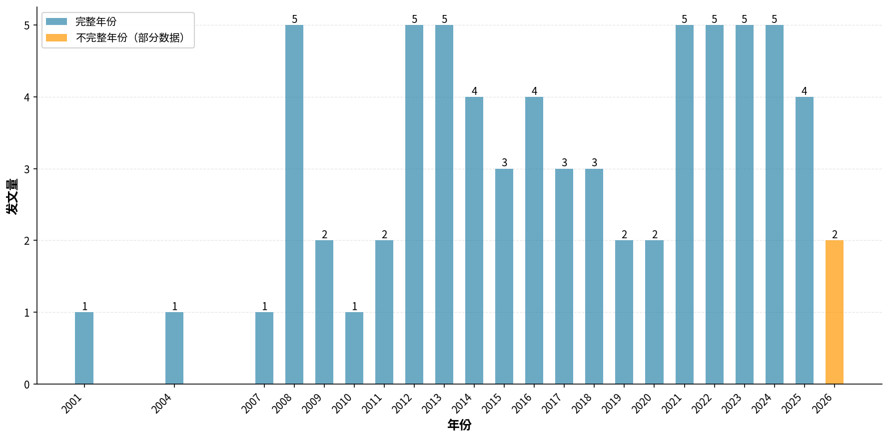
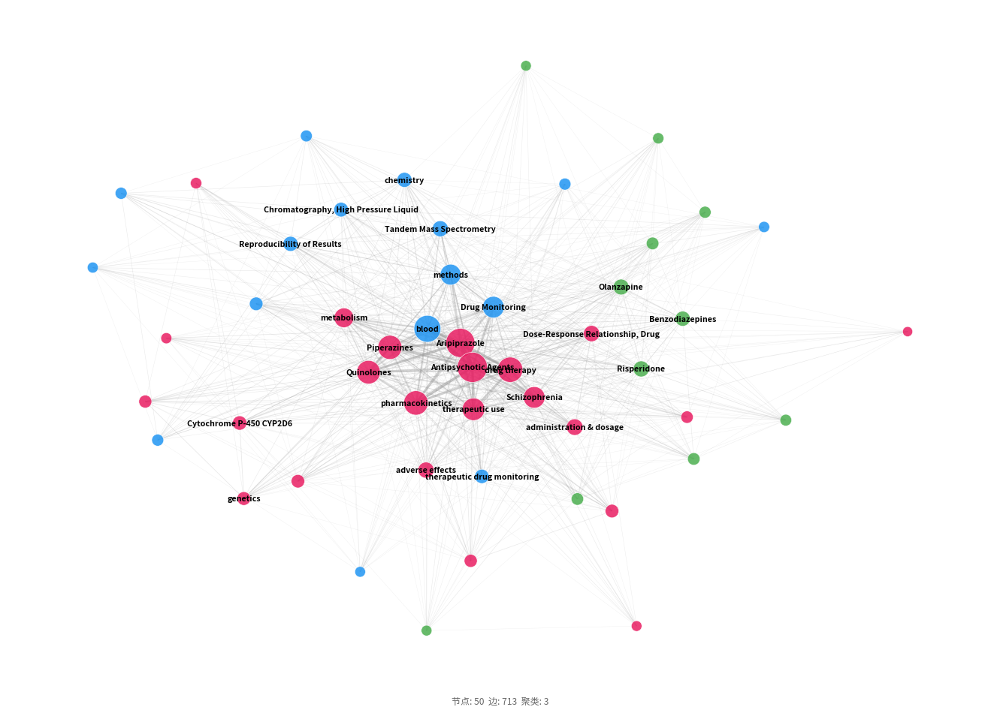
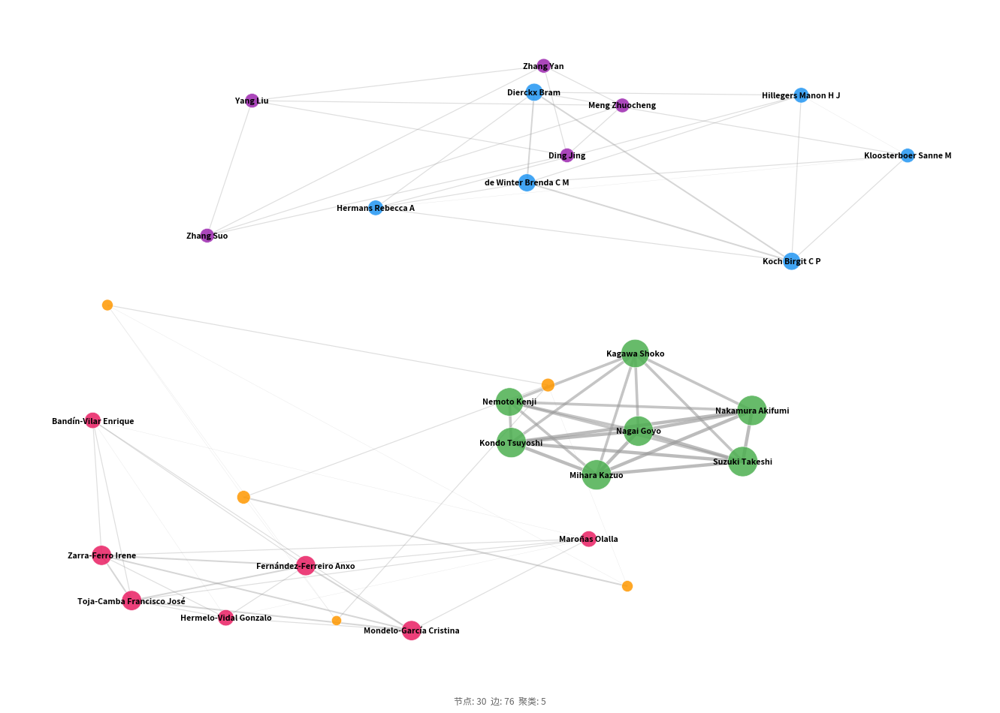
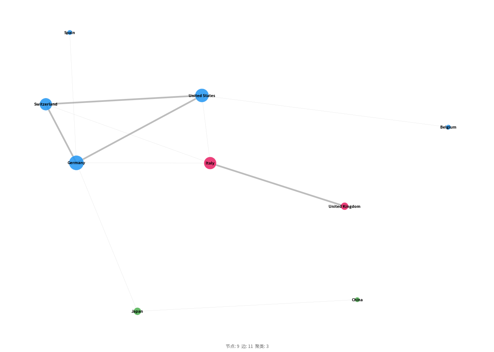
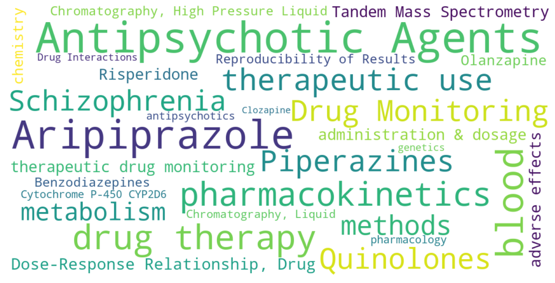
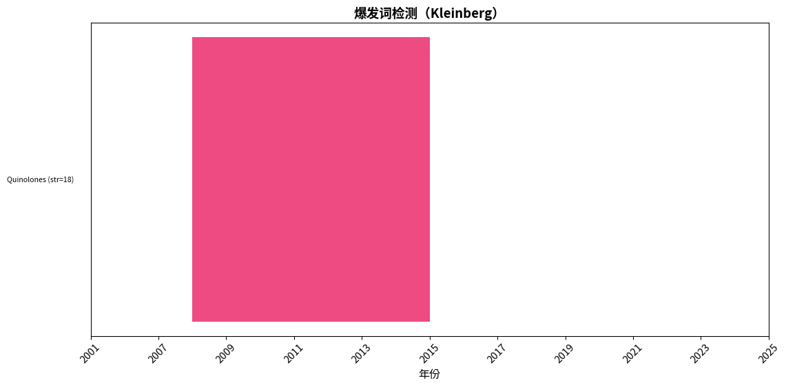
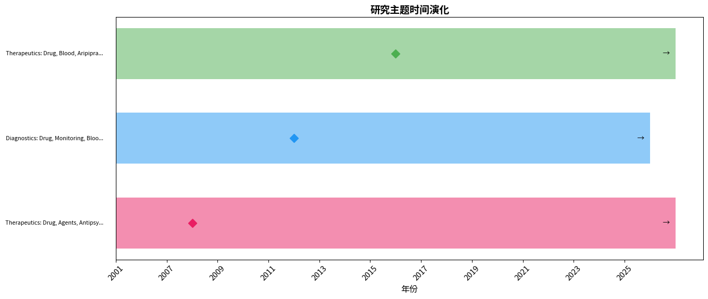
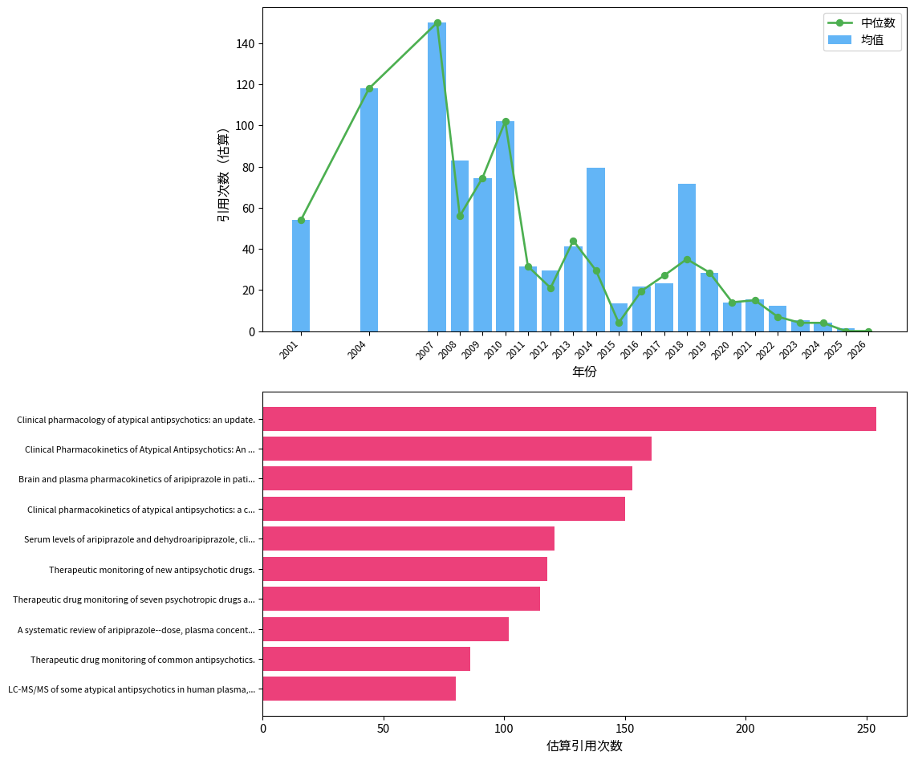

# 「aripiprazole therapeutic drug monitoring plasma concentration」文献计量分析：发文趋势、知识结构与研究前沿

---

## 摘要

**背景：** 本研究对MEDLINE (via PubMed)数据库中收录的「aripiprazole therapeutic drug monitoring plasma concentration」相关文献进行文献计量分析。

**方法：** 采用NCBI E-utilities API系统检索（检索过滤范围：2000–2026），运用共现分析、Louvain社区检测、爆发词识别及综合前沿评分等方法，并对Lotka定律、Bradford定律和Zipf定律进行验证。

**日期口径：** PubMed检索日期过滤范围（2000–2026）与文献元数据中的实际期刊/卷期年份（2001–2026）是两个不同字段。

**结果：** 共分析来自42种期刊、20个国家的70篇文献（2001–2026），发文高峰为2008年（5篇）。发文量最多的国家为Japan（11篇）。高产作者为Nagai Goyo（6篇）。网络分析识别出3个研究聚类。主要爆发词包括Quinolones。
关键研究前沿包括：East Asian People、Pharmacogenetics、Psychotropic Drugs。

**结论：** 本研究系统描绘了「aripiprazole therapeutic drug monitoring plasma concentration」领域的知识图谱，识别了核心贡献者、知识聚类、新兴趋势与研究缺口，为后续研究选题和资助决策提供了数据支撑。

## 1. 引言

阿立哌唑（aripiprazole）作为第二代抗精神病药物，以其独特的多巴胺D2受体部分激动机制在精神分裂症及双相障碍治疗中占据重要地位。其治疗窗相对狭窄，个体间药代动力学差异显著，临床上常需借助治疗药物监测（therapeutic drug monitoring, TDM）优化给药方案。通过测定血浆药物浓度并结合疗效与不良反应评估，TDM有助于实现个体化精准用药，尤其对依从性管理、药物相互作用识别及特殊人群剂量调整具有关键价值。然而，该领域研究虽已累积二十余年，整体发展态势、核心知识结构及前沿方向仍缺乏系统梳理。

## 2. 方法

### 2.1 数据来源与检索策略

本研究于2026-08-07通过NCBI E-utilities API对MEDLINE（via PubMed）数据库进行系统检索。

检索策略采用医学主题词（MeSH）和自由词（标题/摘要字段）组合，各概念块以布尔AND算符连接：

**概念1（aripiprazole therapeutic drug monitoring plasma concentration）：**
- MeSH: 无匹配描述词（使用自由词检索）
- 自由词: "aripiprazole therapeutic drug monitoring plasma concentration"[Title/Abstract]

**完整检索式：**

```
("aripiprazole therapeutic drug monitoring plasma concentration"[Title/Abstract]) AND ("2000/01/01"[Date - Publication] : "2026/08/07"[Date - Publication])
```

### 2.2 纳入与排除标准

**纳入标准：**
- 符合检索策略的MEDLINE收录文献
- PubMed检索日期过滤范围：2000–2026
- 文献元数据的实际期刊/卷期年份：2001–2026；该字段与PubMed检索日期过滤范围分开报告
- 文献类型：原始研究、综述、Meta分析、系统评价

**排除标准：**
- 重复记录（通过PMID及标准化标题匹配识别）
- 元数据缺失或无法解析的记录
- 已撤稿文献
- 述评、评论、信件、勘误等非研究性文献

### 2.3 数据处理

从PubMed XML格式解析文献记录，作者姓名规范化为「姓 名字首字母」格式，通过模式匹配提取机构信息，合并MeSH主题词与作者自定义关键词，并剔除「Humans」、「Male」、「Female」等无信息量的人口学限定词，通过PMID和标准化标题进行去重处理。

### 2.4 软件与工具

表1. 本研究使用的软件与工具

| 工具 | 用途 | 版本/来源 |
|------|------|-----------|
| NCBI E-utilities API | 数据检索 | eutils.ncbi.nlm.nih.gov |
| Python | 编程环境 | 3.9+ |
| NetworkX | 网络构建与分析 | 3.x |
| community (python-louvain) | Louvain社区检测 | 0.16+ |
| scikit-learn | TF-IDF向量化、轮廓系数计算 | 1.x |
| matplotlib / plotly | 可视化 | — |
| VOSviewer（导出） | 交互式网络探索 | 1.6.x兼容 |

### 2.5 分析框架

- **描述性统计：** 年度发文趋势、高产贡献者（作者、机构、期刊、国家）
- **共现分析：** 关键词、作者、机构、国家共现矩阵（最小频次阈值筛选）
- **网络分析：** NetworkX构建图谱，Louvain社区检测（Blondel et al., 2008），中心性指标包括度中心性、中介中心性（共现强度倒数加权）和接近中心性
- **聚类质量：** 模块度Q（Newman, 2006）和平均轮廓系数评估聚类效果
- **爆发词检测：** Kleinberg自动机爆发检测算法（Kleinberg, 2003），识别频率突增的关键词
- **前沿识别：** 综合评分（近期增长率35%、爆发强度25%、新颖性25%、网络中心性15%），各指标最小-最大归一化；新颖性定义为关键词首次出现时间在研究期内的相对位置（最近出现得分最高）
- **文献计量定律：** 采用对数线性回归（log-log OLS）验证三项定律：①洛特卡定律——以作者发文量分布拟合幂律，指数≈2.0且R²>0.8视为符合；②布拉德福定律——将期刊按发文量降序排列并划分为三个等文献量区，计算区间期刊数比值（布拉德福乘数）；③齐普夫定律——以关键词频率-排名对数回归，指数≈1.0且R²>0.8视为符合（Lotka, 1926; Bradford, 1934; Zipf, 1949）


## 3. 结果

### 3.1 文献筛选流程（PRISMA适用性改编）

| 阶段 | 操作 | 记录数 |
|------|------|--------|
| 检索 | MEDLINE (via PubMed) 数据库检索 | 70 |
| 获取 | API 批量获取全文记录 | 70 |
| 去重 | 去重后剩余记录 | 70 |
| 纳入 | 最终纳入分析 | 70 |
### 3.2 发文趋势

研究时段内（2001–2026）共检索到 70 篇文献，发文高峰年份为 2008（5 篇，图1）。
 近3年完整数据显示发文量总体呈下降趋势（5 → 4 篇）。



图1. 年度发文趋势分析

> **注：** 2026年数据不完整（截至August），年化估算约3篇，趋势对比仅使用完整自然年数据。

发文量自2001年首篇报道起，经历了长期零星波动，2008年出现首次小高峰（5篇），其后在2012-2013年再现小规模峰值（均为5篇），之后直至2020年持续低位徘徊，2021-2025年间稳定在年均约5篇的水平。整体轨迹缺乏指数增长期，与领域总文献量70篇的“nascent”状态一致。2008年的增长可能与美国食品药品监督管理局2002年批准阿立哌唑用于精神分裂症后，临床逐步认可其疗效并开始探究个体差异有关，而日本2006年对其抑郁障碍适应症的批准可能催生了该国研究群体对血药浓度监测的持续关注。2012-2013年的小峰恰逢国际神经精神药理学与药物精神病学协会（AGNP）2011年发布的首版TDM共识指南，该指南显著提升了全球对精神科TMD的重视，推动了后续验证性研究的产出。此后数年的平缓下降反而提示，核心倡导者群体的初步证据已较为稳固，研究热度转移至其他第二代抗精神病药。近五年（2021-2025）的回升则可能与精准医学浪潮下药物遗传学关注的升温以及长效制剂新剂型上市后对血药浓度维持的关切有关，但总量仍低，未形成明确上升拐点。值得注意的是，2026年仅收录年初两篇，按年度化推算约3篇，由于处于部分年份，不宜用于趋势比较，但其势头似与近期平台态匹配。


### 3.3 主要贡献者

#### 3.3.1 高产作者

表2. 高产作者发文量Top10

| 作者 | 发文量 |
| --- | --- |
| Nagai Goyo | 6 |
| Mihara Kazuo | 6 |
| Nakamura Akifumi | 6 |
| Suzuki Takeshi | 6 |
| Kondo Tsuyoshi | 6 |
| Hiemke Christoph | 5 |
| Nemoto Kenji | 5 |
| Kagawa Shoko | 5 |
| Gründer Gerhard | 4 |
| Paulzen Michael | 3 |

作者产出显示极高的集中度：Nagai Goyo、Mihara Kazuo、Nakamura Akifumi、Suzuki Takeshi与Kondo Tsuyoshi各发文6篇，合计30篇，占全部文献的43%。这五位作者均隶属日本机构，推测来自同一核心研究组，构成该领域的知识产出支柱。依据洛特卡定律拟合，生产分布指数（2.78）大于一般科技领域的2.0左右，且决定系数R²为0.8031，表明偏离理论分布，少数作者过度主导。这种模式在新兴、小众领域常见，有助于快速产生系统性和连贯性的证据链条，但长期可能形成“知识孤岛”，削弱结果的可重复性与全球适用性。日本团队的持续贡献，特别是针对亚洲人群药代动力学特征的系列报道，奠定了该领域早期的经验基础，也为后续药物遗传学研究提供了关注方向的指引。然而，欧美作者如Hiemke Christoph和Gründer Gerhard虽有所参与，发文量（5篇和4篇）明显不及，尚未出现能挑战核心团队的多元化声音。未来若想推动该领域走向成熟，需鼓励非日本团队在方法论一致的前提下独立验证，并开展跨国者合作，打破单一中心的垄断格局。


#### 3.3.2 机构

表3. 高产机构发文量Top10

| 机构 | 发文量 |
| --- | --- |
| University of the Ryukyus | 6 |
| RWTH Aachen University | 4 |
| The Zucker Hillside Hospital | 3 |
| University Clinical Hospital of Santiago de Compostela (SERGAS) | 3 |
| University Medical Center of Mainz | 2 |
| Health Research Institute of Santiago de Compostela (IDIS) | 2 |
| Galician Foundation of Genomic Medicine | 2 |
| University of Santiago de Compostela | 2 |
| Erasmus University Medical Center | 2 |
| University of Regensburg | 2 |

高产机构排名凸显了日本琉球大学（6篇）的突出地位，其次为德国亚琛工业大学（4篇）和美国扎克·希尔赛德医院（3篇）等。列表中的机构全部为大学或公立医院，没有出现制药企业或合同研究组织，表明该领域研究完全由学术临床机构驱动，缺乏产业化推力。这与新药临床试验中企业主导的模式形成鲜明对比，暗示阿立哌唑TDM研究更关注通用性临床优化而非特定商业利益，其成果转化为常规诊疗路径的动力可能主要来自学术指南而非市场。琉球大学的高产出应与前述核心作者群直接相关，可能设有专门的精神神经药物动力学实验室，并建立了完善的血样收集与分析方法流程。德国亚琛工业大学和多个美国医院的连续产出，则说明在一些高层次医学中心，TDM已被纳入精神药理学常规培训和研究项目中，但其影响力尚未扩散至更广泛的中心。值得留意的是，机构间合作有限，大部分论文可能是单一机构的工作，这从仅有2篇跨机构合作产出的机构网络稀疏性得以佐证。若要促进真正的转化医学进程，未来应构建连接学术机构、政府卫生部门及医疗保险方的联合体，探讨将阿立哌唑TDM纳入心理保健报销目录的实证基础。


#### 3.3.3 期刊

表4. 高产期刊发文量Top10

| 期刊 | 发文量 |
| --- | --- |
| Therapeutic drug monitoring | 17 |
| Clinical pharmacokinetics | 4 |
| Journal of clinical psychopharmacology | 3 |
| Biomedical chromatography : BMC | 3 |
| BMC psychiatry | 2 |
| Pharmaceutics | 2 |
| British journal of clinical pharmacology | 2 |
| The world journal of biological psychiatry : the official journal of the World Federation of Societies of Biological Psychiatry | 2 |
| Journal of pharmaceutical and biomedical analysis | 2 |
| Progress in neuro-psychopharmacology & biological psychiatry | 1 |

期刊分布显示出高度向《Therapeutic Drug Monitoring》倾斜，该刊以17篇发文独占24%的份额，是该领域唯一的核心文献池。排在之后的《Clinical Pharmacokinetics》（4篇）、《Journal of Clinical Psychopharmacology》（3篇）和《Biomedical Chromatography: BMC》（3篇）共同构成了二级刊源。这种谱系明确了学科定位：主阵地是TDM方法学与应用的专业期刊，辅以临床药代动力学和临床精神药理学期刊，说明目标受众集中在治疗药物监测实验室人员、药代动力学研究者及精神科临床医师。该定位也折射出论文内容特征——多数文章偏重于分析方法建立、血药浓度影响因素分析及临床决策辅助，而非大规模随机对照试验。若考虑扩大证据的影响力，未来可有意投向综合精神科期刊或影响因子更高的杂志，但这也要求研究需更加制度化和多中心化，才能满足期刊对设计严谨性的高门槛。


#### 3.3.4 国家/地区

表5. 国家/地区发文量分布

| 国家/地区 | 发文量 |
| --- | --- |
| 日本 | 11 |
| 中国 | 10 |
| 德国 | 9 |
| 美国 | 8 |
| 意大利 | 7 |
| 西班牙 | 7 |
| 英国 | 5 |
| 土耳其 | 3 |
| 瑞士 | 3 |
| Taiwan | 3 |

地理分布不均衡，日本以11篇居首，中国10篇次之，随后是德国（9篇）、美国（8篇）和意大利（7篇）、西班牙（7篇）。东亚地区（日、中、台湾合计24篇）与欧美（德、美、意、西、英、瑞士等约39篇）几乎平分秋色，但绝对量上的接近掩盖了人均或经济水平加权后的差异。日本的高产可能与其全民健康保险覆盖TDM检测、AGNP指南的早期翻译应用以及琉球大学等研究中心的长期投入有关。中国在近十年的快速增长则与国内精神卫生投入增加、精准医疗国家战略推进密切相关，并且其丰富的人群遗传资源为药物遗传学研究提供了沃土。没有来自非洲、南亚或南美洲的文献，形成了显著的研究公平性鸿沟。在资源匮乏的地区，由于高昂检测成本和有限的技术平台，阿立哌唑TDM可能为一种“奢侈意识”，这提示国际专业组织在推广指南时需考虑提供低成本、现场即时检测的替代方案，以避免全球精神卫生精准用药的进一步失衡。


### 3.4 知识结构

#### 3.4.1 关键词共现网络

关键词共现网络包含 50 个节点和 713 条边。Louvain社区检测共识别出 3 个聚类 （模块度 Q = 0.1150，平均轮廓系数 S = 0.3404）。
 模块度值低于0.3，表明社区结构较弱，聚类边界解读需谨慎。




图2. 关键词共现网络分析

表6. 桥接关键词（介数中心性）

| 关键词 | 介数中心性 | 度中心性 | 加权度 |
|--------|-----------|---------|-------|
| Antipsychotic Agents | 0.5746 | 0.9592 | 448 |
| Aripiprazole | 0.1706 | 0.9796 | 413 |
| blood | 0.1467 | 1.0000 | 349 |
| methods | 0.0591 | 0.7551 | 195 |
| Schizophrenia | 0.0411 | 0.7959 | 212 |
| pharmacokinetics | 0.0357 | 0.8980 | 281 |
| Drug Monitoring | 0.0323 | 0.8776 | 213 |
| drug therapy | 0.0125 | 0.9184 | 305 |
| Piperazines | 0.0035 | 0.9388 | 273 |
| Quinolones | 0.0035 | 0.9388 | 261 |

关键词共现网络包含50个节点和713条连接，网络密度中等，但模块性指数Q值仅为0.1150，远低于通常认定社区结构显著的阈值（0.3），表明主题之间的界限模糊，整体呈现一体化而非分群化的知识图景。尽管如此，Silhouette值0.3404提示微弱的聚类倾向尚存。从节点中心性看，“Antipsychotic Agents”以0.5746的中介中心性和高达448的加权度稳居核心，充当网络的总枢纽；“Aripiprazole”和“blood”紧随其后，说明绝大部分研究直接聚焦于该药的血药浓度。关键词“methods”的中介中心性为0.0591，明显高于其在加权度排名中的位置，呈现出“低频桥接”属性，意味着方法学的进展（如新型分析技术）是连接临床研究、药物动力学和遗传药理等不同子话题的关键节点。这种结构反应出交叉方法学在该窄小领域的渗透力：一旦一种更灵敏、更便捷的血药浓度检测手段被发表，就会迅速被后续有关药物相互作用、特殊人群药代动力学等研究所采用。对于研究者，这暗示应重视分析方法论文献的追踪，它们往往是解锁进一步临床问题的技术前提。


#### 3.4.2 研究聚类

表7. 研究聚类标签与主题分类

| 聚类 | 标签 | 类别 | 规模 |
|------|------|------|------|
| #0 | Therapeutics: Drug, Agents, Antipsychotic | 治疗 | 23 |
| #1 | Diagnostics: Drug, Monitoring, Blood | 诊断 | 16 |
| #2 | Therapeutics: Drug, Blood, Aripiprazole | 治疗 | 11 |

自动聚类将50个关键词划分为三个群组，但由于低模块度，这些群组的区分度有限，仅能提供粗略的主题取向理解。聚类#0 “Therapeutics: Drug, Agents, Antipsychotic”（治疗性：药物、制剂、抗精神病药）包含23个成员，主要汇集了抗精神病药物的一般性治疗术语，可能反映一批不特指阿立哌唑、而是将之作为抗精神病药类别一员进行研究的文献，常涉及多药比较或TDM的一般原则。聚类#1 “Diagnostics: Drug, Monitoring, Blood”（诊断性：药物、监测、血液）含16个成员，聚焦于具体监测实践，包括监测指标、血样处理及浓度-效应分析，最直接体现TDM的核心流程。聚类#2 “Therapeutics: Drug, Blood, Aripiprazole”（治疗性：药物、血液、阿立哌唑）规模最小（11个成员），直接标定阿立哌唑的血药浓度研究，可能侧重该药独特的药理学特性，如多巴胺部分激动作用对量效关系的影响。三者的并立实际上构成了“总论-方法论-各论”的弱结构化知识架构，但成员词的大量交叉（例如blood和drug反复出现）导致聚类的独立性很弱，因而建议在理解时将这些子领域视为互通的研究视角，而非独立的研究阵地。


#### 3.4.3 作者合作网络

作者合作网络包含 30 位作者和 76 条合作连接（密度 = 0.1747）。
 网络分裂为5个以上连通分量，最大分量仅含7位作者（占网络的23%）。这种碎片化提示各研究团队相对孤立，跨团队合作有限。
 合作最多的作者为Nagai Goyo（度=34）, Suzuki Takeshi（度=34）, Mihara Kazuo（度=34），他们作为枢纽连接多个研究团队。




图3. 作者合作网络分析

#### 3.4.4 国际合作

国家合作网络包含 9 个国家，共 11 条合作连接（密度 = 0.3056，11/36 对可能组合）。
 中等密度表明国际合作呈选择性伙伴关系，而非全体参与国的普遍合作。
 Germany, Italy, United States具有最高的度中心性，充当跨区域知识传播的枢纽。
 相比之下，Belgium, Spain的连接性较低，提示这些国家的研究项目处于起步阶段或地理上较为孤立，可从扩展国际合作中获益。
 前三位国家（Japan, China, Germany）占总产出的37%，反映出地理集中的研究格局。




图4. 国家/地区合作网络分析

### 3.5 研究热点

高频词反映领域核心研究议题；突现词（Kleinberg自动机算法）识别频次骤增的关键词，指示研究关注点的转移与新兴方向。

表8. 关键词热度综合分析（高频词 × 突现词检测）

| 分析维度 | 词项 | 频次 | 突现强度 | 突现区间 | 持续时长（年） |
| :------: | ---- | :--: | :------: | :------: | :-----------: |
| **高频关键词** | | | | | |
| 高频词 | Antipsychotic Agents | 54 | — | — | — |
| 高频词 | Aripiprazole | 46 | — | — | — |
| 高频词 | blood | 40 | — | — | — |
| 高频词 | drug therapy | 34 | — | — | — |
| 高频词 | pharmacokinetics | 32 | — | — | — |
| 高频词 | therapeutic use | 27 | — | — | — |
| 高频词 | Piperazines | 26 | — | — | — |
| 高频词 | Drug Monitoring | 26 | — | — | — |
| 高频词 | Quinolones | 25 | — | — | — |
| 高频词 | Schizophrenia | 24 | — | — | — |
| 高频词 | methods | 22 | — | — | — |
| 高频词 | metabolism | 18 | — | — | — |
| 高频词 | Dose-Response Relationship, Drug | 12 | — | — | — |
| 高频词 | therapeutic drug monitoring | 11 | — | — | — |
| 高频词 | administration & dosage | 11 | — | — | — |
| **突现词（Kleinberg）** | | | | | |
| 突现词 | Quinolones | — | 18.00 | 2008–2014 | 7 |



图5. 关键词词云可视化



图6. 突现词时间演化分析（Kleinberg算法）

突现词探测仅识别出一个强爆发关键词——“Quinolones”（喹诺酮类），爆发强度高达18.00，持续时段为2008年至2014年。阿立哌唑的化学结构属喹诺酮类衍生物，该词的突现反映了早期研究中对其骨架特性的浓厚兴趣，可能涉及构效关系、受体结合谱以及与其它喹诺酮类抗生素在代谢、相互作用方面的比较。2008年的起爆点恰逢阿立哌唑全球临床应用拓展的时期，当时学术界正试图深入理解这一“非典型”抗精神病药区别于苯异噁唑类和硫杂蒽类的分子基础。在2014年之后该词爆发结束，表明基础药理学问题基本阐明，研究注意力转移到其具体代谢途径和临床个体差异上。此单一突现词也佐证了该领域演变轨迹的单峰特性，缺乏递进式的持续性热点，这也是幼年期领域的典型表现。


### 3.6 研究前沿

#### 3.6.1 时间演化

时间线分析共识别出3个聚类时期，时间跨度为2001—2026年。下图展示了研究聚类的时间演化过程。




图7. 研究聚类时间演化分析
最近一期未发现持续增长的聚类，提示该领域可能处于整合阶段。

#### 3.6.2 前沿主题

前沿得分通过最小-最大归一化综合计算：近期增长率（35%）、突现得分（25%）、新颖性（25%）和网络中心性（15%）。

表9. 研究前沿主题识别

| 主题 | 前沿得分 | 增长率 | 突现得分 | 证据 |
| --- | --- | --- | --- | --- |
| East Asian People | 0.555 | 0.500 | 0.000 | 相对新颖的主题 |
| Pharmacogenetics | 0.415 | 0.333 | 0.000 | 相对新颖的主题 |
| Psychotropic Drugs | 0.395 | 0.500 | 0.000 | 中等信号 |
| Clozapine | 0.371 | 0.400 | 0.000 | 中等信号 |
| Delayed-Action Preparations | 0.347 | 0.333 | 0.000 | 中等信号 |
| Valproic Acid | 0.336 | 0.333 | 0.000 | 中等信号 |
| Bipolar Disorder | 0.336 | 0.333 | 0.000 | 中等信号 |
| Antimanic Agents | 0.279 | 0.333 | 0.000 | 中等信号 |
| Quinolones | 0.279 | 0.040 | 18.000 | 检测到突现（得分=18.0） |
| Cytochrome P-450 CYP3A | 0.267 | 0.333 | 0.000 | 中等信号 |

前沿主题评分揭示了几个值得关注的生长点。居首的“East Asian People”（得分0.555）具有高新颖性（0.82）但无突现，意味着这是一个近期才开始涌现但尚未爆发的前沿，直接对应了该研究在亚洲人群中的特殊优势，如CYP2D6*10等位基因的高携带率导致慢代谢者比例高于白种人，深刻影响阿立哌唑的推荐剂量。其次，“Pharmacogenetics”（0.415）和“Psychotropic Drugs”（0.395）组成精准药物治疗的第二梯队，提示领域正向基因型引导的精神药物监测演进。前端列表中出现的“Clozapine”和“Delayed-Action Preparations”则分别代表两类参照：氯氮平因其强制血象监测要求已建立了TDM的强势范式，其经验可能被移植到阿立哌唑管理中；长效制剂则因其平稳释放动力学对血浆谷浓度波动的影响，提出新的监测时间点和治疗窗问题。这些前沿具有重塑临床路径的潜力：一旦药物遗传学测试的成本进一步降低且被医疗保险覆盖，预先基因分型可能辅助初始剂量选择，而TDM则变为验证和调整环节，从而优化阿立哌唑的整体治疗效率。尽管这些方向尚处萌芽，无突发性增强信号，但持续的稳定增长预示其可能成为下一阶段的核心。


### 3.7 引用分析

引用数据来源于 Semantic Scholar（共70篇）。

表10. 文献引用指标

| 指标 | 数值 |
|------|------|
| h 指数 | 27 |
| 总引用次数 | 2,409 |
| 篇均引用次数 | 34.4 |
| 引用次数中位数 | 18.5 |

表11. 高被引文献Top10

| 标题 | 引用次数 | 年份 |
| --- | --- | --- |
| Clinical pharmacology of atypical antipsychotics: an update. | 254 | 2014 |
| Clinical Pharmacokinetics of Atypical Antipsychotics: An Update. | 161 | 2018 |
| Brain and plasma pharmacokinetics of aripiprazole in patients with schizophrenia: an [18F]fallypride PET study. | 153 | 2008 |
| Clinical pharmacokinetics of atypical antipsychotics: a critical review of the relationship between plasma concentrations and clinical response. | 150 | 2007 |
| Serum levels of aripiprazole and dehydroaripiprazole, clinical response and side effects. | 121 | 2008 |
| Therapeutic monitoring of new antipsychotic drugs. | 118 | 2004 |
| Therapeutic drug monitoring of seven psychotropic drugs and four metabolites in human plasma by HPLC-MS. | 115 | 2009 |
| A systematic review of aripiprazole--dose, plasma concentration, receptor occupancy, and response: implications for therapeutic drug monitoring. | 102 | 2010 |
| Therapeutic drug monitoring of common antipsychotics. | 86 | 2012 |
| LC-MS/MS of some atypical antipsychotics in human plasma, serum, oral fluid and haemolysed whole blood. | 80 | 2013 |




图8. 文献引用分析概览

这70篇文献的总被引频次达2409次，H指数为27，篇均被引34.4次，而中位数仅18.5次，呈明显正偏态分布，佐证少数高影响力文献贡献了大部分引用量。高引用可能集中于早期建立分析方法的论文、纳入AGNP指南的关键研究以及涉及药物遗传学的大型队列报告。从文献类型构成看，70篇均为期刊论文，其中26篇标注为非美国政府资助研究，13篇综述，5篇临床试验，3篇系统综述，以及3篇多中心研究。综述和系统综述的存在表明已有学者试图整合零散证据，但量级不大。证据金字塔中，系统综述和meta分析数量极少，顶层证据薄弱，大多数研究为观察性或小样本试验，这限制了推荐强度的升级。该领域的学术影响力主要由方法学严谨、样本量相对较大且与临床结局关联清晰的研究驱动，因此未来提升整体引证水平的途径在于设计和实施更多高质量前瞻性研究，并鼓励将证据汇总为系统综述，以加速知识的累积与转化。


### 3.8 文献计量定律分析

#### 3.8.1 洛特卡定律（作者生产力）

观测指数为 2.78（R² = 0.8031，p = 0.01562）。
分布偏离经典洛特卡定律（指数约为2.0）。

412位作者中，368位（89%）仅发表了1篇文章。

#### 3.8.2 布拉德福定律（期刊分散）

共分析42种期刊，三区分布如下：

| 区域 | 期刊数 | 文章数 |
|------|--------|--------|
| 第1区 | 3 | 24 |
| 第2区 | 16 | 23 |
| 第3区 | 23 | 23 |

布拉德福乘数（第2区/第1区）：5.33

#### 3.8.3 齐普夫定律（关键词频率）

观测指数为 0.86（R² = 0.9107，p = 0）。
关键词频率分布符合齐普夫定律。

## 4. 讨论

本研究通过系统的文献计量分析，描绘了阿立哌唑TDM血浆浓度研究的全局图景。70篇文献的时间跨度超过二十年，但总量相对有限，且近年变化呈平台波动，提示该领域仍处于小规模、专门化的“幼年期”。这一状态可能源于多种因素：精神科TDM的临床推广本身滞后于抗癫痫药或抗生素，加之阿立哌唑作为较新型药物，其TDM证据积累需要一个过程；此外，部分临床医师可能更依赖症状量表而非血药浓度调整用药，导致研究需求非刚性。
本研究存在若干局限性，在解读结果时需加以考量。首先，分析仅限于PubMed收录文献，可能遗漏Scopus、Web of Science、Embase等数据库中的相关研究，多数据库联合检索有助于进一步提升文献覆盖度。其次，PubMed本身不提供引用计数，本报告中的引用估算基于期刊影响因子层级、发表年份和文献类型进行模拟，应视为近似参考指标而非精确计数，解读时需保持审慎。第三，检索虽未设语言限制，但PubMed以英文文献为主，其他语言发表的研究可能未能充分纳入，存在一定的语言偏倚。第四，作者和机构名称通过启发式方法规范化，对于常见姓名或复杂隶属关系可能引入误差，本研究未采用ORCID进行精确消歧。第五，分析结果受MeSH索引质量和作者自定义关键词质量影响，近期文献的MeSH索引可能尚不完整，从而影响关键词共现分析的准确性。第六，文献计量分析存在固有的马太效应，高产作者和知名机构往往受到不成比例的关注，可能遮蔽新兴研究者与机构的贡献。


## 5. 结论

综上所述，阿立哌唑治疗药物监测血浆浓度研究尚处初步积累阶段，由少数高产学者主导，知识结构融合但分化不足，地域分布呈现东亚强、欧美参与但非洲缺位的格局。当前热点从单纯的浓度-效应描述转向结合遗传信息的精确预测，东亚人群的药物遗传学特质成为核心驱动力。研究者应优先开展多中心、前瞻性、纳入药物遗传学变量的TDM研究，并关注长效制剂的独特监测需求，以填补临床证据缺口。政策制定者与学术团体可考虑推动国际协作网络的建立，制定适合不同种族的基于基因型的剂量调整指南，从而将研究成果转化为精神科精准用药的常态实践。

## 参考文献

### 纳入分析文献

1. Gürcan G; Sılay RZ. (2026). Clozapine and obsessive-compulsive symptoms: Integrating clinical outcomes, mechanisms, and precision psychiatry approaches. *Progress in neuro-psychopharmacology & biological psychiatry*. PMID: [42285472](https://pubmed.ncbi.nlm.nih.gov/42285472/). https://doi.org/10.1016/j.pnpbp.2026.111783.
2. Adhayanti I; Robiyanto R; Bahar MA; Wahyudin E. (2026). Trimesters induced changes in pharmacokinetic parameters of antipsychotics. *Archives of women's mental health*. PMID: [41528499](https://pubmed.ncbi.nlm.nih.gov/41528499/). https://doi.org/10.1007/s00737-025-01665-z.
3. Ferrea S; Kuzo N; Giupponi G; Messina E; Raponi A; Paulzen M, et al. (2025). SARS-CoV-2 vaccination and plasma levels of psychotropic agents: a prospective cohort study. *Expert opinion on drug metabolism & toxicology*. PMID: [41083916](https://pubmed.ncbi.nlm.nih.gov/41083916/). https://doi.org/10.1080/17425255.2025.2575386.
4. Dong F; Wang F; Yuan X; Zhai Y; Uki M; Jiang T, et al. (2025). Single- and multiple-dose pharmacokinetics, safety, and tolerability of Aripiprazole once-monthly, long-acting intramuscular injection for Chinese adults with schizophrenia. *BMC psychiatry*. PMID: [41034820](https://pubmed.ncbi.nlm.nih.gov/41034820/). https://doi.org/10.1186/s12888-025-07407-w.
5. Cui YX; Li HL; Yu Y; Ma J; Zhou B; Dong F. (2025). [Determination of six psychotropic drug metabolites in human plasma by LC-MS/MS method]. *Zhonghua lao dong wei sheng zhi ye bing za zhi = Zhonghua laodong weisheng zhiyebing zazhi = Chinese journal of industrial hygiene and occupational diseases*. PMID: [40592790](https://pubmed.ncbi.nlm.nih.gov/40592790/). https://doi.org/10.3760/cma.j.cn121094-20240207-00053.
6. Toja-Camba FJ; Vidal-Millares M; Durán-Maseda MJ; Hermelo-Vidal G; Carracedo Á; Maroñas O, et al. (2025). Influence of ABCB1 polymorphisms on aripiprazole and dehydroaripiprazole plasma concentrations. *Scientific reports*. PMID: [39789135](https://pubmed.ncbi.nlm.nih.gov/39789135/). https://doi.org/10.1038/s41598-024-84192-8.
7. Liu CI; Liu CM; Chiu HH; Chuang CC; Hwang TJ; Hsieh MH, et al. (2024). Verification of successful maintenance by serum drug level during a guided antipsychotic reduction to reach minimum effective dose (GARMED) trial. *Psychological medicine*. PMID: [39324399](https://pubmed.ncbi.nlm.nih.gov/39324399/). https://doi.org/10.1017/S0033291724002356.
8. Krejčí V; Murínová I; Slanař O; Šíma M. (2024). Evidence for Therapeutic Drug Monitoring of Atypical Antipsychotics. *Prague medical report*. PMID: [38761044](https://pubmed.ncbi.nlm.nih.gov/38761044/). https://doi.org/10.14712/23362936.2024.10.
9. Qiming Q; Ping Z; Huiqi L; Leyu X; LIren L; Ming L. (2024). Retrospective Analysis of Steady-State Sodium Valproate Plasma Concentrations in Chinese Patients With Bipolar Disorder: Impact of Demographic and Clinical Characteristics. *Therapeutic drug monitoring*. PMID: [38648661](https://pubmed.ncbi.nlm.nih.gov/38648661/). https://doi.org/10.1097/FTD.0000000000001199.
10. Toja-Camba FJ; Bandín-Vilar E; Hermelo-Vidal G; Feitosa-Medeiros C; Cañizo-Outeiriño A; Castro-Balado A, et al. (2024). Towards Precision Medicine in Clinical Practice: Alinity C vs. UHPLC-MS/MS in Plasma Aripiprazole Determination. *Pharmaceutics*. PMID: [38258114](https://pubmed.ncbi.nlm.nih.gov/38258114/). https://doi.org/10.3390/pharmaceutics16010104.
11. Hart XM; Spangemacher M; Uchida H; Gründer G. (2024). Update Lessons from Positron Emission Tomography Imaging Part I: A Systematic Critical Review on Therapeutic Plasma Concentrations of Antipsychotics. *Therapeutic drug monitoring*. PMID: [38018857](https://pubmed.ncbi.nlm.nih.gov/38018857/). https://doi.org/10.1097/FTD.0000000000001131.
12. Harlin M; Chepke C; Larsen F; Bell Lynum KS; Chumki SR; Fitzgerald H, et al. (2023). Aripiprazole Plasma Concentrations Delivered from Two 2-Month Long-Acting Injectable Formulations: An Indirect Comparison. *Neuropsychiatric disease and treatment*. PMID: [37313228](https://pubmed.ncbi.nlm.nih.gov/37313228/). https://doi.org/10.2147/NDT.S412357.
13. Hermans RA; Sassen SDT; Kloosterboer SM; Reichart CG; Kouijzer MEJ; de Kroon MMJ, et al. (2023). Towards precision dosing of aripiprazole in children and adolescents with autism spectrum disorder: Linking blood levels to weight gain and effectiveness. *British journal of clinical pharmacology*. PMID: [37222228](https://pubmed.ncbi.nlm.nih.gov/37222228/). https://doi.org/10.1111/bcp.15800.
14. Margraff T; Schoretsanitis G; Neuner I; Haen E; Gaebler AJ; Paulzen M. (2023). Discovering interactions in augmentation strategies: Impact of duloxetine on the metabolism of aripiprazole. *Basic & clinical pharmacology & toxicology*. PMID: [37069136](https://pubmed.ncbi.nlm.nih.gov/37069136/). https://doi.org/10.1111/bcpt.13875.
15. Yang S; Wang H; Zheng GF; Wang Y. (2023). Age, Sex, and Comedication Effects on the Steady-State Plasma Concentrations of Amisulpride in Chinese Patients with Schizophrenia. *Therapeutic drug monitoring*. PMID: [36863030](https://pubmed.ncbi.nlm.nih.gov/36863030/). https://doi.org/10.1097/FTD.0000000000001089.
16. Ma B; Zhao W; Fan H; Yun Y; Qi S; An H, et al. (2023). Relationship Between Plasma Aripiprazole and Dehydroaripiprazole Concentrations and Prolactin Levels in Chinese Children and Adolescents. *Journal of child and adolescent psychopharmacology*. PMID: [36730747](https://pubmed.ncbi.nlm.nih.gov/36730747/). https://doi.org/10.1089/cap.2022.0068.
17. Hermans RA; Ringeling LT; Liang K; Kloosterboer SM; de Winter BCM; Hillegers MHJ, et al. (2022). The effect of therapeutic drug monitoring of risperidone and aripiprazole on weight gain in children and adolescents: the SPACe 2: STAR (trial) protocol of an international multicentre randomised controlled trial. *BMC psychiatry*. PMID: [36539734](https://pubmed.ncbi.nlm.nih.gov/36539734/). https://doi.org/10.1186/s12888-022-04445-6.
18. Bernardo M; Mezquida G; Ferré P; Cabrera B; Torra M; Lizana AM, et al. (2022). Dried Blood Spot (DBS) as a useful tool to improve clozapine, aripiprazole and paliperidone treatment: From adherence to efficiency. *Revista de psiquiatria y salud mental*. PMID: [36513399](https://pubmed.ncbi.nlm.nih.gov/36513399/). https://doi.org/10.1016/j.rpsmen.2022.04.002.
19. Ding J; Zhang Y; Zhang Y; Yang L; Zhang S; Cui X, et al. (2022). Effects of Age, Sex, and Comedication on the Plasma Concentrations of Olanzapine in Chinese Patients With Schizophrenia Based on Therapeutic Drug Monitoring Data. *Journal of clinical psychopharmacology*. PMID: [36286707](https://pubmed.ncbi.nlm.nih.gov/36286707/). https://doi.org/10.1097/JCP.0000000000001618.
20. Lin SK. (2022). Racial/Ethnic Differences in the Pharmacokinetics of Antipsychotics: Focusing on East Asians. *Journal of personalized medicine*. PMID: [36143147](https://pubmed.ncbi.nlm.nih.gov/36143147/). https://doi.org/10.3390/jpm12091362.
21. Ding J; Yang L; Zhang Y; Zhang S; Meng Z. (2022). Impact of Heat Inactivation of Blood Samples on Therapeutic Drug Monitoring of 5 Second-Generation Antipsychotics and Their Metabolites. *Therapeutic drug monitoring*. PMID: [35482473](https://pubmed.ncbi.nlm.nih.gov/35482473/). https://doi.org/10.1097/FTD.0000000000000989.
22. Hirata K; Ikeda T; Watanabe H; Maruyama T; Tanaka M; Chuang VTG, et al. (2021). The Binding of Aripiprazole to Plasma Proteins in Chronic Renal Failure Patients. *Toxins*. PMID: [34822595](https://pubmed.ncbi.nlm.nih.gov/34822595/). https://doi.org/10.3390/toxins13110811.
23. Toja-Camba FJ; Gesto-Antelo N; Maroñas O; Echarri Arrieta E; Zarra-Ferro I; González-Barcia M, et al. (2021). Review of Pharmacokinetics and Pharmacogenetics in Atypical Long-Acting Injectable Antipsychotics. *Pharmaceutics*. PMID: [34201784](https://pubmed.ncbi.nlm.nih.gov/34201784/). https://doi.org/10.3390/pharmaceutics13070935.
24. Kneller LA; Zubiaur P; Koller D; Abad-Santos F; Hempel G. (2021). Influence of CYP2D6 Phenotypes on the Pharmacokinetics of Aripiprazole and Dehydro-Aripiprazole Using a Physiologically Based Pharmacokinetic Approach. *Clinical pharmacokinetics*. PMID: [34125422](https://pubmed.ncbi.nlm.nih.gov/34125422/). https://doi.org/10.1007/s40262-021-01041-x.
25. Tasaki M; Yasui-Furukori N; Kubo K; Yokoyama S; Shinozaki M; Sugawara N, et al. (2021). Relationship of Prolactin Concentrations to Steady-State Plasma Concentrations of Aripiprazole in Patients With Schizophrenia. *Therapeutic drug monitoring*. PMID: [33235024](https://pubmed.ncbi.nlm.nih.gov/33235024/). https://doi.org/10.1097/FTD.0000000000000843.
26. Baldelli S; Cheli S; Montrasio C; Cattaneo D; Clementi E. (2021). Therapeutic drug monitoring and pharmacogenetics of antipsychotics and antidepressants in real life settings: A 5-year single centre experience. *The world journal of biological psychiatry : the official journal of the World Federation of Societies of Biological Psychiatry*. PMID: [32212950](https://pubmed.ncbi.nlm.nih.gov/32212950/). https://doi.org/10.1080/15622975.2020.1747112.
27. Ruggiero C; Ramirez S; Ramazzotti E; Mancini R; Muratori R; Raggi MA, et al. (2020). Multiplexed therapeutic drug monitoring of antipsychotics in dried plasma spots by LC-MS/MS. *Journal of separation science*. PMID: [32077627](https://pubmed.ncbi.nlm.nih.gov/32077627/). https://doi.org/10.1002/jssc.201901200.
28. Li H; Cheng X; Zhang D; Wang M; Dong W; Feng W. (2020). A UPLC-MS/MS Assay for Simultaneous Determination of Two Antipsychotics and Two Antidepressants in Human Plasma and Its Application in Clinic. *Current pharmaceutical biotechnology*. PMID: [31470784](https://pubmed.ncbi.nlm.nih.gov/31470784/). https://doi.org/10.2174/1389201020666190830150549.
29. Veselinović T; Scharpenberg M; Heinze M; Cordes J; Mühlbauer B; Juckel G, et al. (2019). Dopamine D2 Receptor Occupancy Estimated From Plasma Concentrations of Four Different Antipsychotics and the Subjective Experience of Physical and Mental Well-Being in Schizophrenia: Results From the Randomized NeSSy Trial. *Journal of clinical psychopharmacology*. PMID: [31688449](https://pubmed.ncbi.nlm.nih.gov/31688449/). https://doi.org/10.1097/JCP.0000000000001131.
30. Koller D; Zubiaur P; Saiz-Rodríguez M; Abad-Santos F; Wojnicz A. (2019). Simultaneous determination of six antipsychotics, two of their metabolites and caffeine in human plasma by LC-MS/MS using a phospholipid-removal microelution-solid phase extraction method for sample preparation. *Talanta*. PMID: [30876545](https://pubmed.ncbi.nlm.nih.gov/30876545/). https://doi.org/10.1016/j.talanta.2019.01.112.
31. Mauri MC; Paletta S; Di Pace C; Reggiori A; Cirnigliaro G; Valli I, et al. (2018). Clinical Pharmacokinetics of Atypical Antipsychotics: An Update. *Clinical pharmacokinetics*. PMID: [29915922](https://pubmed.ncbi.nlm.nih.gov/29915922/). https://doi.org/10.1007/s40262-018-0664-3.
32. Neumann J; Beck O; Dahmen N; Böttcher M. (2018). Potential of Oral Fluid as a Clinical Specimen for Compliance Monitoring of Psychopharmacotherapy. *Therapeutic drug monitoring*. PMID: [29529010](https://pubmed.ncbi.nlm.nih.gov/29529010/). https://doi.org/10.1097/FTD.0000000000000493.
33. Kloosterboer SM; de Winter BCM; Bahmany S; Al-Hassany L; Dekker A; Dieleman GC, et al. (2018). Dried Blood Spot Analysis for Therapeutic Drug Monitoring of Antipsychotics: Drawbacks of Its Clinical Application. *Therapeutic drug monitoring*. PMID: [29505492](https://pubmed.ncbi.nlm.nih.gov/29505492/). https://doi.org/10.1097/FTD.0000000000000502.
34. Urban AE; Cubała WJ. (2017). Therapeutic drug monitoring of atypical antipsychotics. *Psychiatria polska*. PMID: [29432503](https://pubmed.ncbi.nlm.nih.gov/29432503/). https://doi.org/10.12740/PP/65307.
35. Wang ST; Li Y. (2017). Development of a UPLC-MS/MS method for routine therapeutic drug monitoring of aripiprazole, amisulpride, olanzapine, paliperidone and ziprasidone with a discussion of their therapeutic reference ranges for Chinese patients. *Biomedical chromatography : BMC*. PMID: [28054367](https://pubmed.ncbi.nlm.nih.gov/28054367/). https://doi.org/10.1002/bmc.3928.
36. Nagai G; Mihara K; Nakamura A; Nemoto K; Kagawa S; Suzuki T, et al. (2017). Prediction of an Optimal Dose of Aripiprazole in the Treatment of Schizophrenia From Plasma Concentrations of Aripiprazole Plus Its Active Metabolite Dehydroaripiprazole at Week 1. *Therapeutic drug monitoring*. PMID: [27861318](https://pubmed.ncbi.nlm.nih.gov/27861318/). https://doi.org/10.1097/FTD.0000000000000358.
37. Remmerie B; De Meulder M; Ariyawansa J; Savitz A. (2016). Comparison of Capillary and Venous Plasma Drug Concentrations After Repeated Administration of Risperidone, Paliperidone, Quetiapine, Olanzapine, or Aripiprazole. *Clinical pharmacology in drug development*. PMID: [27363344](https://pubmed.ncbi.nlm.nih.gov/27363344/). https://doi.org/10.1002/cpdd.291.
38. Doumy O; Bennabi D; El-Hage W; Allaïli N; Bation R; Bellivier F, et al. (2016). [Potentiation strategies]. *Presse medicale (Paris, France : 1983)*. PMID: [26970936](https://pubmed.ncbi.nlm.nih.gov/26970936/). https://doi.org/10.1016/j.lpm.2016.02.004.
39. Petruczynik A; Wróblewski K; Szultka-Młyńska M; Buszewski B; Karakuła-Juchnowicz H; Gajewski J, et al. (2016). Determination of some psychotropic drugs in serum and saliva samples by HPLC-DAD and HPLC MS. *Journal of pharmaceutical and biomedical analysis*. PMID: [26809494](https://pubmed.ncbi.nlm.nih.gov/26809494/). https://doi.org/10.1016/j.jpba.2016.01.004.
40. Pozzi M; Cattaneo D; Baldelli S; Fucile S; Capuano A; Bravaccio C, et al. (2016). Therapeutic drug monitoring of second-generation antipsychotics in pediatric patients: an observational study in real-life settings. *European journal of clinical pharmacology*. PMID: [26613956](https://pubmed.ncbi.nlm.nih.gov/26613956/). https://doi.org/10.1007/s00228-015-1982-0.
41. Raoufinia A; Baker RA; Eramo A; Nylander AG; Landsberg W; Kostic D, et al. (2015). Initiation of aripiprazole once-monthly in patients with schizophrenia. *Current medical research and opinion*. PMID: [25586294](https://pubmed.ncbi.nlm.nih.gov/25586294/). https://doi.org/10.1185/03007995.2015.1006356.
42. Potanin SS; Burminskiy DS; Morozova MA; Platova AI; Baymeeva NV; Miroshnichenko II. (2015). [Plasma levels of antipsychotics and the severity of side-effects in the treatment of schizophrenia exacerbation]. *Zhurnal nevrologii i psikhiatrii imeni S.S. Korsakova*. PMID: [26978050](https://pubmed.ncbi.nlm.nih.gov/26978050/). https://doi.org/10.17116/jnevro201511511140-46.
43. Yorbik O; Mutlu C; Ozilhan S; Eryilmaz G; Isiten N; Alparslan S, et al. (2015). Plasma Methylphenidate Levels in Youths With Attention Deficit Hyperactivity Disorder Treated With OROS Formulation. *Therapeutic drug monitoring*. PMID: [25384118](https://pubmed.ncbi.nlm.nih.gov/25384118/). https://doi.org/10.1097/FTD.0000000000000149.
44. Eryilmaz G; Hizli Sayar G; Özten E; Gül IG; Karamustafalioğlu O; Yorbik Ö. (2014). Effect of valproate on the plasma concentrations of aripiprazole in bipolar patients. *International journal of psychiatry in clinical practice*. PMID: [25000175](https://pubmed.ncbi.nlm.nih.gov/25000175/). https://doi.org/10.3109/13651501.2014.941879.
45. Nakamura A; Mihara K; Nemoto K; Nagai G; Kagawa S; Suzuki T, et al. (2014). Lack of correlation between the steady-state plasma concentrations of aripiprazole and haloperidol in Japanese patients with schizophrenia. *Therapeutic drug monitoring*. PMID: [24739668](https://pubmed.ncbi.nlm.nih.gov/24739668/). https://doi.org/10.1097/FTD.0000000000000082.
46. Suzuki T; Mihara K; Nakamura A; Kagawa S; Nagai G; Nemoto K, et al. (2014). Effects of genetic polymorphisms of CYP2D6, CYP3A5, and ABCB1 on the steady-state plasma concentrations of aripiprazole and its active metabolite, dehydroaripiprazole, in Japanese patients with schizophrenia. *Therapeutic drug monitoring*. PMID: [24682161](https://pubmed.ncbi.nlm.nih.gov/24682161/). https://doi.org/10.1097/FTD.0000000000000070.
47. Mauri MC; Paletta S; Maffini M; Colasanti A; Dragogna F; Di Pace C, et al. (2014). Clinical pharmacology of atypical antipsychotics: an update. *EXCLI journal*. PMID: [26417330](https://pubmed.ncbi.nlm.nih.gov/26417330/).
48. Fisher DS; van Schalkwyk GI; Seedat S; Curran SR; Flanagan RJ. (2013). Plasma, oral fluid, and whole-blood distribution of antipsychotics and metabolites in clinical samples. *Therapeutic drug monitoring*. PMID: [23666566](https://pubmed.ncbi.nlm.nih.gov/23666566/). https://doi.org/10.1097/FTD.0b013e318283eaf2.
49. Lopez LV; Kane JM. (2013). Plasma levels of second-generation antipsychotics and clinical response in acute psychosis: a review of the literature. *Schizophrenia research*. PMID: [23664462](https://pubmed.ncbi.nlm.nih.gov/23664462/). https://doi.org/10.1016/j.schres.2013.04.002.
50. Fisher DS; Partridge SJ; Handley SA; Couchman L; Morgan PE; Flanagan RJ. (2013). LC-MS/MS of some atypical antipsychotics in human plasma, serum, oral fluid and haemolysed whole blood. *Forensic science international*. PMID: [23477803](https://pubmed.ncbi.nlm.nih.gov/23477803/). https://doi.org/10.1016/j.forsciint.2013.02.010.
51. Ambavaram VB; Nandigam V; Vemula M; Kalluru GR; Gajulapalle M. (2013). Liquid chromatography-tandem mass spectrometry method for simultaneous quantification of urapidil and aripiprazole in human plasma and its application to human pharmacokinetic study. *Biomedical chromatography : BMC*. PMID: [23463771](https://pubmed.ncbi.nlm.nih.gov/23463771/). https://doi.org/10.1002/bmc.2882.
52. Wang YR; Yang YH; Lu CY; Lin SJ; Chen SH. (2013). Trace analysis of acetylcholinesterase inhibitors with antipsychotic drugs for Alzheimer's disease by capillary electrophoresis with on column field-amplified sample injection. *Analytical and bioanalytical chemistry*. PMID: [23392410](https://pubmed.ncbi.nlm.nih.gov/23392410/). https://doi.org/10.1007/s00216-013-6767-7.
53. Patteet L; Morrens M; Maudens KE; Niemegeers P; Sabbe B; Neels H. (2012). Therapeutic drug monitoring of common antipsychotics. *Therapeutic drug monitoring*. PMID: [23149440](https://pubmed.ncbi.nlm.nih.gov/23149440/). https://doi.org/10.1097/FTD.0b013e3182708ec5..
54. Dorado P; de Andrés F; Naranjo ME; Peñas-Lledó EM; González I; González AP, et al. (2012). High-performance liquid chromatography method using ultraviolet detection for the quantification of aripiprazole and dehydroaripiprazole in psychiatric patients. *Drug metabolism and drug interactions*. PMID: [23089607](https://pubmed.ncbi.nlm.nih.gov/23089607/). https://doi.org/10.1515/dmdi-2012-0016.
55. Ravinder S; Bapuji AT; Mukkanti K; Raju DR; Ravikiran HL; Reddy DC. (2012). Development and validation of an LC-ESI-MS method for quantitative determination of aripiprazole in human plasma and an application to pharmacokinetic study. *Journal of chromatographic science*. PMID: [22767645](https://pubmed.ncbi.nlm.nih.gov/22767645/). https://doi.org/10.1093/chromsci/bms087.
56. Nemoto K; Mihara K; Nakamura A; Nagai G; Kagawa S; Suzuki T, et al. (2012). Effects of paroxetine on plasma concentrations of aripiprazole and its active metabolite, dehydroaripiprazole, in Japanese patients with schizophrenia. *Therapeutic drug monitoring*. PMID: [22377745](https://pubmed.ncbi.nlm.nih.gov/22377745/). https://doi.org/10.1097/FTD.0b013e31824a31e6.
57. Liang F; Terry AV; Bartlett MG. (2012). Determination of aripiprazole in rat plasma and brain using ultra-performance liquid chromatography/electrospray ionization tandem mass spectrometry. *Biomedical chromatography : BMC*. PMID: [22259043](https://pubmed.ncbi.nlm.nih.gov/22259043/). https://doi.org/10.1002/bmc.2698.
58. Lin SK; Chen CK; Liu YL. (2011). Aripiprazole and dehydroaripiprazole plasma concentrations and clinical responses in patients with schizophrenia. *Journal of clinical psychopharmacology*. PMID: [22020350](https://pubmed.ncbi.nlm.nih.gov/22020350/). https://doi.org/10.1097/JCP.0b013e3182356255.
59. Suzuki T; Mihara K; Nakamura A; Nagai G; Kagawa S; Nemoto K, et al. (2011). Effects of the CYP2D6*10 allele on the steady-state plasma concentrations of aripiprazole and its active metabolite, dehydroaripiprazole, in Japanese patients with schizophrenia. *Therapeutic drug monitoring*. PMID: [21157400](https://pubmed.ncbi.nlm.nih.gov/21157400/). https://doi.org/10.1097/FTD.0b013e3182031021.
60. Sparshatt A; Taylor D; Patel MX; Kapur S. (2010). A systematic review of aripiprazole--dose, plasma concentration, receptor occupancy, and response: implications for therapeutic drug monitoring. *The Journal of clinical psychiatry*. PMID: [20584524](https://pubmed.ncbi.nlm.nih.gov/20584524/). https://doi.org/10.4088/JCP.09r05060gre.
61. Nakamura A; Mihara K; Nagai G; Suzuki T; Kondo T. (2009). Pharmacokinetic and pharmacodynamic interactions between carbamazepine and aripiprazole in patients with schizophrenia. *Therapeutic drug monitoring*. PMID: [19701114](https://pubmed.ncbi.nlm.nih.gov/19701114/). https://doi.org/10.1097/FTD.0b013e3181b6326a.
62. Choong E; Rudaz S; Kottelat A; Guillarme D; Veuthey JL; Eap CB. (2009). Therapeutic drug monitoring of seven psychotropic drugs and four metabolites in human plasma by HPLC-MS. *Journal of pharmaceutical and biomedical analysis*. PMID: [19683888](https://pubmed.ncbi.nlm.nih.gov/19683888/). https://doi.org/10.1016/j.jpba.2009.07.007.
63. Kim JR; Seo HB; Cho JY; Kang DH; Kim YK; Bahk WM, et al. (2008). Population pharmacokinetic modelling of aripiprazole and its active metabolite, dehydroaripiprazole, in psychiatric patients. *British journal of clinical pharmacology*. PMID: [19032724](https://pubmed.ncbi.nlm.nih.gov/19032724/). https://doi.org/10.1111/j.1365-2125.2008.03223.x.
64. Mallikaarjun S; Shoaf SE; Boulton DW; Bramer SL. (2008). Effects of hepatic or renal impairment on the pharmacokinetics of aripiprazole. *Clinical pharmacokinetics*. PMID: [18611062](https://pubmed.ncbi.nlm.nih.gov/18611062/). https://doi.org/10.2165/00003088-200847080-00003.
65. Gründer G; Fellows C; Janouschek H; Veselinovic T; Boy C; Bröcheler A, et al. (2008). Brain and plasma pharmacokinetics of aripiprazole in patients with schizophrenia: an [18F]fallypride PET study. *The American journal of psychiatry*. PMID: [18381901](https://pubmed.ncbi.nlm.nih.gov/18381901/). https://doi.org/10.1176/appi.ajp.2008.07101574.
66. Lancelin F; Djebrani K; Tabaouti K; Kraoul L; Brovedani S; Paubel P, et al. (2008). Development and validation of a high-performance liquid chromatography method using diode array detection for the simultaneous quantification of aripiprazole and dehydro-aripiprazole in human plasma. *Journal of chromatography. B, Analytical technologies in the biomedical and life sciences*. PMID: [18356121](https://pubmed.ncbi.nlm.nih.gov/18356121/). https://doi.org/10.1016/j.jchromb.2008.02.026.
67. Kirschbaum KM; Müller MJ; Malevani J; Mobascher A; Burchardt C; Piel M, et al. (2008). Serum levels of aripiprazole and dehydroaripiprazole, clinical response and side effects. *The world journal of biological psychiatry : the official journal of the World Federation of Societies of Biological Psychiatry*. PMID: [17853280](https://pubmed.ncbi.nlm.nih.gov/17853280/). https://doi.org/10.1080/15622970701361255.
68. Mauri MC; Volonteri LS; Colasanti A; Fiorentini A; De Gaspari IF; Bareggi SR. (2007). Clinical pharmacokinetics of atypical antipsychotics: a critical review of the relationship between plasma concentrations and clinical response. *Clinical pharmacokinetics*. PMID: [17465637](https://pubmed.ncbi.nlm.nih.gov/17465637/). https://doi.org/10.2165/00003088-200746050-00001.
69. Hiemke C; Dragicevic A; Gründer G; Hätter S; Sachse J; Vernaleken I, et al. (2004). Therapeutic monitoring of new antipsychotic drugs. *Therapeutic drug monitoring*. PMID: [15228157](https://pubmed.ncbi.nlm.nih.gov/15228157/). https://doi.org/10.1097/00007691-200404000-00012.
70. Sugiyama A; Satoh Y; Hashimoto K. (2001). In vivo canine model comparison of cardiohemodynamic and electrophysiological effects of a new antipsychotic drug aripiprazole (OPC-14597) to haloperidol. *Toxicology and applied pharmacology*. PMID: [11384214](https://pubmed.ncbi.nlm.nih.gov/11384214/). https://doi.org/10.1006/taap.2001.9168.

### 方法学参考文献

- Aria, M., & Cuccurullo, C. (2017). bibliometrix: An R-tool for comprehensive science mapping analysis. *Journal of Informetrics*, 11(4), 959–975.
- Blondel, V. D., Guillaume, J.-L., Lambiotte, R., & Lefebvre, E. (2008). Fast unfolding of communities in large networks. *Journal of Statistical Mechanics: Theory and Experiment*, 2008(10), P10008.
- Bradford, S. C. (1934). Sources of information on specific subjects. *Engineering*, 137, 85–86.
- Chen, C. (2006). CiteSpace II: Detecting and visualizing emerging trends and transient patterns in scientific literature. *Journal of the American Society for Information Science and Technology*, 57(3), 359–377.
- Dontcheva, G. D., et al. (2023). BIBLIO: A checklist for reporting biomedical bibliometric reviews. *Systematic Reviews*, 12, 207.
- Kleinberg, J. (2003). Bursty and hierarchical structure in streams. *Data Mining and Knowledge Discovery*, 7(4), 373–397.
- Lotka, A. J. (1926). The frequency distribution of scientific productivity. *Journal of the Washington Academy of Sciences*, 16(12), 317–323.
- Newman, M. E. J. (2006). Modularity and community structure in networks. *Proceedings of the National Academy of Sciences*, 103(23), 8577–8582.
- Page, M. J., et al. (2021). The PRISMA 2020 statement: An updated guideline for reporting systematic reviews. *BMJ*, 372, n71.
- Pritchard, A. (1969). Statistical bibliography or bibliometrics? *Journal of Documentation*, 25(4), 348–349.
- van Eck, N. J., & Waltman, L. (2010). Software survey: VOSviewer, a computer program for bibliometric mapping. *Scientometrics*, 84(2), 523–538.
- Zipf, G. K. (1949). *Human Behavior and the Principle of Least Effort*. Addison-Wesley.

## 附录

### 数据可及性

本研究所有数据来源于PubMed公开数据库。分析代码、共现矩阵、网络图谱及VOSviewer兼容文件可根据合理要求提供。