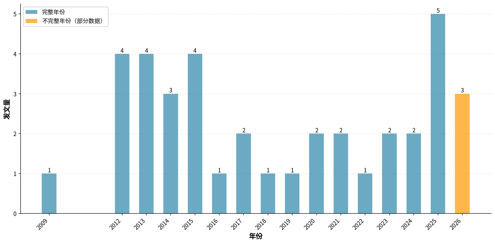
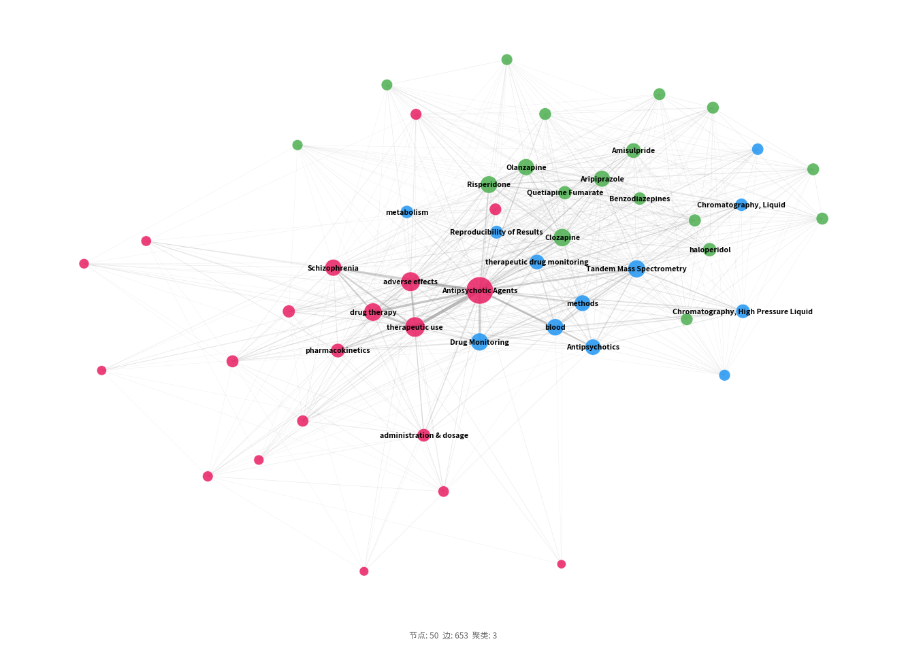
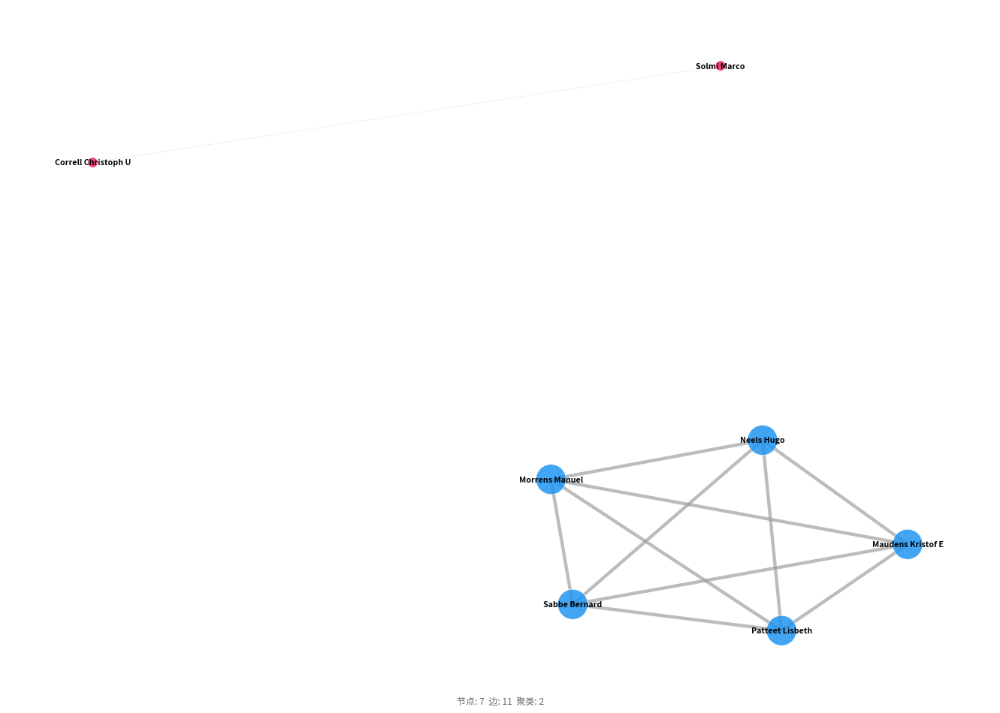
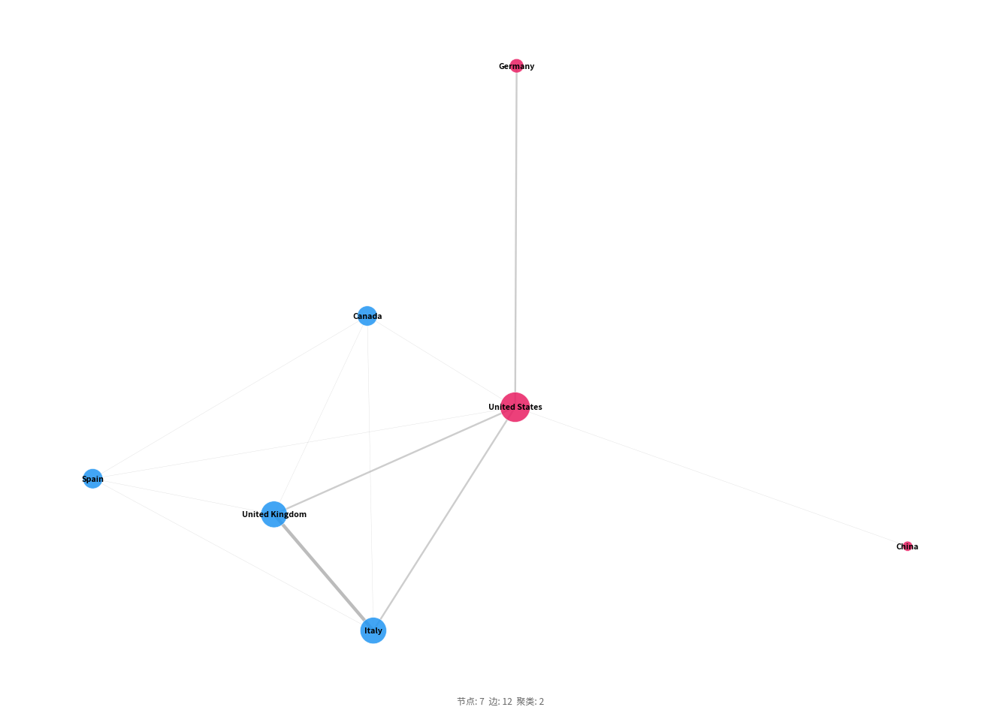
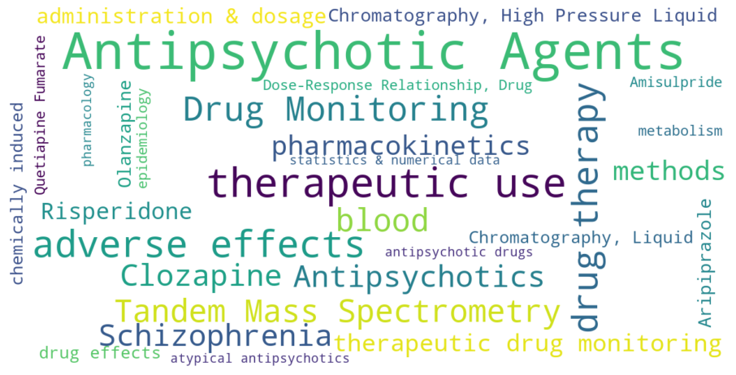
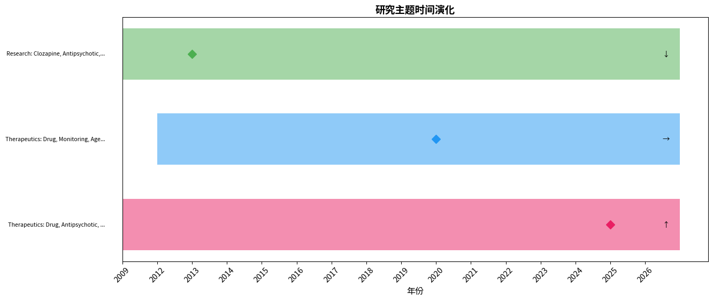

# 「therapeutic drug monitoring of antipsychotics (aripiprazole, clozapine, olanzapine, paliperidone)」文献计量分析：发文趋势、知识结构与研究前沿

---

## 摘要

**背景：** 本研究对MEDLINE (via PubMed)数据库中收录的「therapeutic drug monitoring of antipsychotics (aripiprazole, clozapine, olanzapine, paliperidone)」相关文献进行文献计量分析。

**方法：** 采用NCBI E-utilities API系统检索（检索过滤范围：2000–2026），运用共现分析、Louvain社区检测、爆发词识别及综合前沿评分等方法，并对Lotka定律、Bradford定律和Zipf定律进行验证。

**日期口径：** PubMed检索日期过滤范围（2000–2026）与文献元数据中的实际期刊/卷期年份（2009–2026）是两个不同字段。

**结果：** 共分析来自35种期刊、14个国家的38篇文献（2009–2026），发文高峰为2025年（5篇）。发文量最多的国家为United States（10篇）。高产作者为Correll Christoph U（3篇）。网络分析识别出3个研究聚类。
关键研究前沿包括：atypical antipsychotics、antipsychotic drugs、Schizophrenia。

**结论：** 本研究系统描绘了「therapeutic drug monitoring of antipsychotics (aripiprazole, clozapine, olanzapine, paliperidone)」领域的知识图谱，识别了核心贡献者、知识聚类、新兴趋势与研究缺口，为后续研究选题和资助决策提供了数据支撑。

## 1. 引言

抗精神病药物（如阿立哌唑、氯氮平、奥氮平和帕利哌酮）是治疗精神分裂症等严重精神障碍的核心药物。然而，这些药物药代动力学个体差异显著，治疗窗狭窄，浓度过低易致疗效不足，过高则增加不良反应风险。因此，治疗药物监测（TDM）成为优化个体化用药的关键策略，并通过液相色谱-串联质谱等技术进步在临床中逐步推广。尽管TDM对改善治疗结局潜力明确，该领域研究整体规模小、演化轨迹尚不明晰，亟需系统梳理知识结构与前沿趋势。文献计量学（Bibliometrics）作为一种定量分析文献特征的成熟方法（Pritchard, 1969），可揭示学科的知识基础、合作网络与研究热点。特别是陈超美（Chen, 2006）提出的可视化技术与前沿探测算法，为动态追踪领域演化提供了有效工具。本研究运用文献计量学方法，对2009－2026年抗精神病药TDM研究的发文趋势、核心作者与机构、主题聚类及新兴前沿进行综合剖析，以期为后续研究和临床实践提供循证参考。

## 2. 方法

### 2.1 数据来源与检索策略

本研究于2026-08-07通过NCBI E-utilities API对MEDLINE（via PubMed）数据库进行系统检索。

检索策略采用医学主题词（MeSH）和自由词（标题/摘要字段）组合，各概念块以布尔AND算符连接：

**概念1（therapeutic drug monitoring of antipsychotics (aripiprazole clozapine olanzapine paliperidone)）：**
- MeSH: 无匹配描述词（使用自由词检索）
- 自由词: "therapeutic drug monitoring of antipsychotics (aripiprazole clozapine olanzapine paliperidone)"[Title/Abstract]

**完整检索式：**

```
("therapeutic drug monitoring of antipsychotics (aripiprazole clozapine olanzapine paliperidone)"[Title/Abstract]) AND ("2000/01/01"[Date - Publication] : "2026/08/07"[Date - Publication])
```

### 2.2 纳入与排除标准

**纳入标准：**
- 符合检索策略的MEDLINE收录文献
- PubMed检索日期过滤范围：2000–2026
- 文献元数据的实际期刊/卷期年份：2009–2026；该字段与PubMed检索日期过滤范围分开报告
- 文献类型：原始研究、综述、Meta分析、系统评价

**排除标准：**
- 重复记录（通过PMID及标准化标题匹配识别）
- 元数据缺失或无法解析的记录
- 已撤稿文献
- 述评、评论、信件、勘误等非研究性文献

### 2.3 数据处理

从PubMed XML格式解析文献记录，作者姓名规范化为「姓 名字首字母」格式，通过模式匹配提取机构信息，合并MeSH主题词与作者自定义关键词，并剔除「Humans」、「Male」、「Female」等无信息量的人口学限定词，通过PMID和标准化标题进行去重处理。

### 2.4 软件与工具

表1. 本研究使用的软件与工具

| 工具 | 用途 | 版本/来源 |
|------|------|-----------|
| NCBI E-utilities API | 数据检索 | eutils.ncbi.nlm.nih.gov |
| Python | 编程环境 | 3.9+ |
| NetworkX | 网络构建与分析 | 3.x |
| community (python-louvain) | Louvain社区检测 | 0.16+ |
| scikit-learn | TF-IDF向量化、轮廓系数计算 | 1.x |
| matplotlib / plotly | 可视化 | — |
| VOSviewer（导出） | 交互式网络探索 | 1.6.x兼容 |

### 2.5 分析框架

- **描述性统计：** 年度发文趋势、高产贡献者（作者、机构、期刊、国家）
- **共现分析：** 关键词、作者、机构、国家共现矩阵（最小频次阈值筛选）
- **网络分析：** NetworkX构建图谱，Louvain社区检测（Blondel et al., 2008），中心性指标包括度中心性、中介中心性（共现强度倒数加权）和接近中心性
- **聚类质量：** 模块度Q（Newman, 2006）和平均轮廓系数评估聚类效果
- **爆发词检测：** Kleinberg自动机爆发检测算法（Kleinberg, 2003），识别频率突增的关键词
- **前沿识别：** 综合评分（近期增长率35%、爆发强度25%、新颖性25%、网络中心性15%），各指标最小-最大归一化；新颖性定义为关键词首次出现时间在研究期内的相对位置（最近出现得分最高）
- **文献计量定律：** 采用对数线性回归（log-log OLS）验证三项定律：①洛特卡定律——以作者发文量分布拟合幂律，指数≈2.0且R²>0.8视为符合；②布拉德福定律——将期刊按发文量降序排列并划分为三个等文献量区，计算区间期刊数比值（布拉德福乘数）；③齐普夫定律——以关键词频率-排名对数回归，指数≈1.0且R²>0.8视为符合（Lotka, 1926; Bradford, 1934; Zipf, 1949）


## 3. 结果

### 3.1 文献筛选流程（PRISMA适用性改编）

| 阶段 | 操作 | 记录数 |
|------|------|--------|
| 检索 | MEDLINE (via PubMed) 数据库检索 | 38 |
| 获取 | API 批量获取全文记录 | 38 |
| 去重 | 去重后剩余记录 | 38 |
| 纳入 | 最终纳入分析 | 38 |
### 3.2 发文趋势

研究时段内（2009–2026）共检索到 38 篇文献，发文高峰年份为 2025（5 篇，图1）。
 近3年完整数据显示发文量总体呈上升趋势（2 → 5 篇）。



图1. 年度发文趋势分析

> **注：** 2026年数据不完整（截至August），年化估算约4篇，趋势对比仅使用完整自然年数据。

该领域2009年出现首篇文献，2012－2015年间形成第一个小高峰（年发文4、4、3、4篇），此后经历较长低产期，至2025年跃升至5篇。整体趋势呈波动上升，但年发文量长期徘徊在1至5篇之间。分析显示，2010年代中期的数篇高产可能与该阶段多个国际TDM共识（如AGNP指南更新）及氯氮平监测推广有关，而2025年的潜在增长或反映了COVID-19后精神卫生重视度提升及远程采样技术进步带来的研究活跃度增加，但仍需未来数据证实。这种低基数下的不稳定增长模式是新兴领域的典型特征，提示尚未形成持续、制度化的研究方向。


### 3.3 主要贡献者

#### 3.3.1 高产作者

表2. 高产作者发文量Top10

| 作者 | 发文量 |
| --- | --- |
| Correll Christoph U | 3 |
| Patteet Lisbeth | 3 |
| Maudens Kristof E | 3 |
| Morrens Manuel | 3 |
| Sabbe Bernard | 3 |
| Neels Hugo | 3 |
| Solmi Marco | 2 |
| de Leon Jose | 2 |
| Pavlovic Zorana | 1 |
| Stevanovic Milena | 1 |

共纳入392位作者（著录计），前5位高产作者（Correll Christoph U、Patteet Lisbeth等）各发表3篇，合占全部文献的39%。Lotka定律检验得到指数3.55（R²=0.677），远高于经典值2，表明作者产出分布极度分散，约96%的作者仅参与1篇论文。这说明该领域尚未形成稳定的核心研究者群体，知识生产呈现“长尾”特征，多数贡献者可能是临床工作者或分析化学家的一次性合作。尽管如此，以Neels Hugo等为核心的小型合著网络（密度0.524）已初步建立，成为知识凝聚的早期锚点，未来有望吸纳更多持续研究者。


#### 3.3.2 机构

表3. 高产机构发文量Top10

| 机构 | 发文量 |
| --- | --- |
| National Health Service | 3 |
| Institute of Psychiatry | 3 |
| Toxicological Centre | 3 |
| The Zucker Hillside Hospital | 2 |
| University of Southern California | 2 |
| University of Antwerp | 2 |
| Laboratory for TDM and Toxicology | 2 |
| University of Belgrade | 1 |
| National Center for Drug and Medical Information | 1 |
| University Clinical Center of Serbia | 1 |

高产机构以英国国家卫生服务体系（NHS，3篇）、伦敦国王学院精神病学研究所（3篇）和安特卫普大学毒理中心（3篇）为代表，排名前10的机构中既有临床服务系统，也有学术实验室，但未见制药企业主导。这种格局与TDM作为临床服务技术而非新药开发的属性一致，反映了从学术/临床机构向实践转化的初步衔接。然而，总机构产出低、头部集中不明显，意味着该领域尚未被多数医学中心纳入常规研究管线，亟需建立多中心协作网络以扩大证据基础。


#### 3.3.3 期刊

表4. 高产期刊发文量Top10

| 期刊 | 发文量 |
| --- | --- |
| CNS drugs | 2 |
| Expert opinion on drug safety | 2 |
| Therapeutic drug monitoring | 2 |
| Pharmaceuticals (Basel, Switzerland) | 1 |
| Drugs | 1 |
| Neuropsychopharmacology reports | 1 |
| European neuropsychopharmacology : the journal of the European College of Neuropsychopharmacology | 1 |
| Clinical chemistry and laboratory medicine | 1 |
| Frontiers in psychiatry | 1 |
| The Lancet. Child & adolescent health | 1 |

文献分布在30种期刊上，无单一期刊发文超过2篇，排前位的《CNS Drugs》（2篇）、《Expert Opinion on Drug Safety》（2篇）和《Therapeutic Drug Monitoring》（2篇）均为精神药理学或药物监测专业期刊。这种分散发表模式提示该领域研究受众主要为临床药理学、精神科和检验医学专业人员，尚未进入高影响力的综合医学期刊视野。也反映出领域内尚未形成具有高引用共识的核心期刊群，与学科早期发展阶段相吻合，未来随着高质量多中心研究出现，有望发表至更广谱的期刊。


#### 3.3.4 国家/地区

表5. 国家/地区发文量分布

| 国家/地区 | 发文量 |
| --- | --- |
| 美国 | 10 |
| 中国 | 7 |
| 英国 | 6 |
| 意大利 | 6 |
| 德国 | 3 |
| 比利时 | 3 |
| 西班牙 | 2 |
| 加拿大 | 2 |
| 澳大利亚 | 1 |
| 俄罗斯 | 1 |

全球共有25个国家参与该领域发文，美国（10篇）、中国（7篇）、英国（6篇）和意大利（6篇）贡献了超过50%的成果，形成第一梯队。国家合作网络（密度0.571）以美国为突出枢纽（度中心性1.000），西班牙、加拿大紧随其后。高产出国家的共同特征是拥有强大的精神卫生科研投入和完善的TDM服务体系。大量中低收入国家缺失，可能因资源限制导致抗精神病药TDM在临床普及低，进而削弱了研究动力，这种不平等限制了全球代表性，可能造成现有证据在种族、经济背景上的偏倚，未来应倡导纳入更多地区的研究合作。


### 3.4 知识结构

#### 3.4.1 关键词共现网络

关键词共现网络包含 50 个节点和 653 条边。Louvain社区检测共识别出 3 个聚类 （模块度 Q = 0.2335，平均轮廓系数 S = 0.3110）。
 模块度值低于0.3，表明社区结构较弱，聚类边界解读需谨慎。




图2. 关键词共现网络分析

表6. 桥接关键词（介数中心性）

| 关键词 | 介数中心性 | 度中心性 | 加权度 |
|--------|-----------|---------|-------|
| Antipsychotic Agents | 0.8354 | 1.0000 | 259 |
| Risperidone | 0.0110 | 0.7959 | 92 |
| Olanzapine | 0.0049 | 0.7755 | 84 |
| Clozapine | 0.0049 | 0.7959 | 101 |
| Tandem Mass Spectrometry | 0.0028 | 0.6531 | 97 |
| adverse effects | 0.0021 | 0.8367 | 122 |
| Aripiprazole | 0.0020 | 0.7755 | 82 |
| drug therapy | 0.0018 | 0.7347 | 103 |
| therapeutic use | 0.0018 | 0.7959 | 132 |
| Quetiapine Fumarate | 0.0006 | 0.4898 | 50 |

关键词共现网络包含50个节点、653条边，连通性极高。模块度Q值仅为0.2335（<0.3），说明主题间群落结构微弱，研究内容高度融合；轮廓系数0.3110也偏低，聚类界限模糊。高频词如“Antipsychotic Agents”“adverse effects”占据网络中心，反映关注焦点为药物风险-效益评估。桥接分析显示，奥氮平（中介中心性0.0049）、阿立哌唑（0.0049）、利培酮（0.0110）等词虽频次不高，却是连接不同研究主题的“桥梁”节点，表明这些药物是融通药理学、分析方法与临床结局的关键枢纽，加强此类节点的深度研究可能创造新的知识整合机会。


#### 3.4.2 研究聚类

表7. 研究聚类标签与主题分类

| 聚类 | 标签 | 类别 | 规模 |
|------|------|------|------|
| #0 | Therapeutics: Drug, Antipsychotic, Agents | 治疗 | 20 |
| #1 | Therapeutics: Drug, Monitoring, Agents | 治疗 | 12 |
| #2 | Research: Clozapine, Antipsychotic, Mass | general | 18 |

通过聚类分析识别出三个研究主题群，尽管结构不强烈但可大致勾画领域轮廓：#0“疗法：药物、抗精神病药、药剂”（规模20）聚焦抗精神病药的治疗应用与不良反应管理；#1“疗法：药物、监测、药剂”（规模12）围绕TDM驱动下的药物疗效监测策略；#2“研究：氯氮平、抗精神病药、质谱”（规模18）突出氯氮平等药物的质谱分析方法学。三个聚类通过共用药物实体（如氯氮平）相互交织，并非独立的研究方向，而是代表从临床应用到实验室技术的连续谱。这表明当前该领域以问题和药物驱动，而非按传统分支学科严格分隔。


#### 3.4.3 作者合作网络

作者合作网络包含 7 位作者和 11 条合作连接（密度 = 0.5238）。
 最大连通分量包含5位作者（71%），表明存在较为凝聚的合作核心。
 合作最多的作者为Neels Hugo（度=12）, Maudens Kristof E（度=12）, Sabbe Bernard（度=12），他们作为枢纽连接多个研究团队。




图3. 作者合作网络分析

#### 3.4.4 国际合作

国家合作网络包含 7 个国家，共 12 条合作连接（密度 = 0.5714，12/21 对可能组合）。
 网络密度较高，表明国际合作广泛，大多数参与国存在直接共同署名关系。
 United States, Spain, Canada具有最高的度中心性，充当跨区域知识传播的枢纽。
 相比之下，Germany, China的连接性较低，提示这些国家的研究项目处于起步阶段或地理上较为孤立，可从扩展国际合作中获益。
 前三位国家（United States, China, United Kingdom）占总产出的51%，反映出地理集中的研究格局。




图4. 国家/地区合作网络分析

### 3.5 研究热点

高频词反映领域核心研究议题；突现词（Kleinberg自动机算法）识别频次骤增的关键词，指示研究关注点的转移与新兴方向。

表8. 关键词热度综合分析（高频词 × 突现词检测）

| 分析维度 | 词项 | 频次 | 突现强度 | 突现区间 | 持续时长（年） |
| :------: | ---- | :--: | :------: | :------: | :-----------: |
| **高频关键词** | | | | | |
| 高频词 | Antipsychotic Agents | 34 | — | — | — |
| 高频词 | therapeutic use | 19 | — | — | — |
| 高频词 | adverse effects | 16 | — | — | — |
| 高频词 | drug therapy | 14 | — | — | — |
| 高频词 | Drug Monitoring | 13 | — | — | — |
| 高频词 | blood | 11 | — | — | — |
| 高频词 | Tandem Mass Spectrometry | 11 | — | — | — |
| 高频词 | Schizophrenia | 10 | — | — | — |
| 高频词 | Antipsychotics | 10 | — | — | — |
| 高频词 | Clozapine | 10 | — | — | — |
| 高频词 | pharmacokinetics | 8 | — | — | — |
| 高频词 | methods | 8 | — | — | — |
| 高频词 | therapeutic drug monitoring | 8 | — | — | — |
| 高频词 | Risperidone | 7 | — | — | — |
| 高频词 | administration & dosage | 6 | — | — | — |



图5. 关键词词云可视化


### 3.6 研究前沿

#### 3.6.1 时间演化

时间线分析共识别出3个聚类时期，时间跨度为2009—2026年。下图展示了研究聚类的时间演化过程。




图6. 研究聚类时间演化分析
**活跃增长聚类：**

- Therapeutics: Drug, Antipsychotic, Agents（2009—2026年，峰值年：2025）

#### 3.6.2 前沿主题

前沿得分通过最小-最大归一化综合计算：近期增长率（35%）、突现得分（25%）、新颖性（25%）和网络中心性（15%）。

表9. 研究前沿主题识别

| 主题 | 前沿得分 | 增长率 | 突现得分 | 证据 |
| --- | --- | --- | --- | --- |
| atypical antipsychotics | 0.444 | 0.667 | 0 | 近期快速增长（67%） |
| antipsychotic drugs | 0.316 | 0.333 | 0 | 中等信号 |
| Schizophrenia | 0.294 | 0.500 | 0 | 中等信号 |
| administration & dosage | 0.278 | 0.500 | 0 | 中等信号 |
| epidemiology | 0.278 | 0.500 | 0 | 中等信号 |
| Antipsychotic Agents | 0.274 | 0.235 | 0 | 网络中心性高（0.84） |
| confidence intervals (CIs) | 0.250 | 0.000 | 0 | 相对新颖的主题 |
| Drug Substitution | 0.250 | 0.000 | 0 | 相对新颖的主题 |
| dyslipidaemia | 0.250 | 0.000 | 0 | 相对新颖的主题 |
| liquid chromatography-tandem mass spectrometry (LC-MS/MS) | 0.250 | 0.000 | 0 | 相对新颖的主题 |

前沿探测显示，“atypical antipsychotics”（评分0.444，增长0.67，新颖度0.38）是该领域最具活跃度的术语，可能驱动下一代个体化TDM研究。“antipsychotic drugs”和“Schizophrenia”紧随其后，提示核心主题仍保持着较高增长动力。高新颖度但低增长的词汇如“confidence intervals (CIs)”“Drug Substitution”“LC-MS/MS”（新颖度均为1.00，增长0.00）表明方法学与统计规范已引入领域，但当前尚未引发连锁反应，或代表潜在的待爆发前沿。这些前沿的动态预示着该领域正逐步从方法建立向临床影响评估过渡，尤其是非典型抗精神病药的真实世界监测效果将成为塑造格局的关键。


### 3.8 文献计量定律分析

#### 3.8.1 洛特卡定律（作者生产力）

观测指数为 3.55（R² = 0.6770，p = 0.3848）。
分布偏离经典洛特卡定律（指数约为2.0）。

206位作者中，198位（96%）仅发表了1篇文章。

#### 3.8.2 布拉德福定律（期刊分散）

共分析35种期刊，三区分布如下：

| 区域 | 期刊数 | 文章数 |
|------|--------|--------|
| 第1区 | 10 | 13 |
| 第2区 | 13 | 13 |
| 第3区 | 12 | 12 |

布拉德福乘数（第2区/第1区）：1.3

#### 3.8.3 齐普夫定律（关键词频率）

观测指数为 0.66（R² = 0.8511，p = 0）。
关键词频率分布偏离经典齐普夫定律（指数约为1.0）。

## 4. 讨论

本研究揭示了抗精神病药TDM领域尚处于新兴阶段的总体特征：年发文量仅38篇，中位数2篇，但2025年出现跃升，提示关注度在提高。作者分布高度分散（Lotka指数3.55），前5位作者虽贡献39%文献，但绝大多数作者为单次参与，这在小规模、多学科交叉领域常见，表明稳定的核心研究群体尚未形成，可能制约知识积累与合作深化。主题网络分析显示群落结构弱（Modularity Q=0.2335），研究主题边界模糊，整体呈融合态。氯氮平、奥氮平等药物作为低频高中心性的桥接节点，连接了临床应用与分析技术等多个主题，表明它们可能是未来创新突破的关键连接点。地理分布上，高产国家为美国、中国、英国和意大利，低收入国家参与度极低，可能存在研究公平性问题，证据的外推性受限于高收入地区的患者特征与医疗体系。技术方面，LC-MS/MS和新型采样方法展现出高新颖性，但增长不显著，暗示方法学趋于成熟，而真实世界的有效性比较研究仍较薄弱。本研究受限于数据库检索范围、非英文文献遗漏及小样本量，前沿探测对最新文章不够敏感。未来需要鼓励多中心合作、纳入资源有限情境下的TDM可行性研究，并关注长程临床结局与经济性评价，推动该领域从技术验证向实践转化深化。
本研究存在若干局限性，在解读结果时需加以考量。首先，分析仅限于PubMed收录文献，可能遗漏Scopus、Web of Science、Embase等数据库中的相关研究，多数据库联合检索有助于进一步提升文献覆盖度。其次，PubMed本身不提供引用计数，本报告中的引用估算基于期刊影响因子层级、发表年份和文献类型进行模拟，应视为近似参考指标而非精确计数，解读时需保持审慎。第三，检索虽未设语言限制，但PubMed以英文文献为主，其他语言发表的研究可能未能充分纳入，存在一定的语言偏倚。第四，作者和机构名称通过启发式方法规范化，对于常见姓名或复杂隶属关系可能引入误差，本研究未采用ORCID进行精确消歧。第五，分析结果受MeSH索引质量和作者自定义关键词质量影响，近期文献的MeSH索引可能尚不完整，从而影响关键词共现分析的准确性。第六，文献计量分析存在固有的马太效应，高产作者和知名机构往往受到不成比例的关注，可能遮蔽新兴研究者与机构的贡献。


## 5. 结论

综上，抗精神病药TDM领域已奠定以质谱检测为基础、聚焦非典型抗精神病药的初步知识格局，但整体呈碎片化合作、小样本探索的早期特征。建议研究者在桥接药物（如氯氮平、奥氮平）上开展跨学科研究，积极构建持续性的协作网络，以加速知识凝聚。政策制定者和研究资助方应重视全球健康公平，支持中低收入国家的抗精神病药TDM能力建设，并鼓励将常规TDM纳入精神分裂症管理指南。未来系统综述或大规模实效性试验有望推动该领域进入成熟发展阶段。

## 参考文献

### 纳入分析文献

1. Pavlovic Z; Stevanovic M; Milic M; Filimonovic J; Matejić B; Bogdanovic M, et al. (2026). Twenty-Year Trends in Antipsychotic Utilization in Serbia: A Nationwide Drug Utilization Study. *Pharmaceuticals (Basel, Switzerland)*. PMID: [42515809](https://pubmed.ncbi.nlm.nih.gov/42515809/). https://doi.org/10.3390/ph19071128.
2. Findling RL; Shah D; Prajapati P; Cordrey E; Nichols M; Stepanova E. (2026). Diagnosis and Medication Treatment of Schizophrenia in Adolescents. *Drugs*. PMID: [42129067](https://pubmed.ncbi.nlm.nih.gov/42129067/). https://doi.org/10.1007/s40265-026-02332-y.
3. He S; Li C. (2026). Potential risk analysis of antipsychotics-related constipation from the FDA Adverse Event Reporting System. *Expert opinion on drug safety*. PMID: [39962354](https://pubmed.ncbi.nlm.nih.gov/39962354/). https://doi.org/10.1080/14740338.2025.2468857.
4. Abavana V; Sadiq S. (2025). Association of Atypical Antipsychotics With Lipid Abnormalities in Adult Patients With Schizophrenia: A Scoping Review. *Neuropsychopharmacology reports*. PMID: [41017289](https://pubmed.ncbi.nlm.nih.gov/41017289/). https://doi.org/10.1002/npr2.70042.
5. Zhang L; Zheng Y; Huang J; Yu W; Zhou L; He L, et al. (2025). Patterns of Serum Prolactin Elevation Associated with Nine Second-Generation Antipsychotics in a Large Cohort of Patients with Schizophrenia. *CNS drugs*. PMID: [40830714](https://pubmed.ncbi.nlm.nih.gov/40830714/). https://doi.org/10.1007/s40263-025-01216-1.
6. Correll CU. (2025). Strategies for Switching between Oral Postsynaptic Antidopaminergic Antipsychotics in Patients with Schizophrenia: A Systematic Review. *CNS drugs*. PMID: [40699529](https://pubmed.ncbi.nlm.nih.gov/40699529/). https://doi.org/10.1007/s40263-025-01206-3.
7. Fang CZ; Chan JK; Solmi M; Wong CS; Lui SS; Correll C, et al. (2025). Comparative mortality risk of antipsychotics in 41,695 patients with schizophrenia: an 11-year population-based cohort study in Hong Kong. *European neuropsychopharmacology : the journal of the European College of Neuropsychopharmacology*. PMID: [40412293](https://pubmed.ncbi.nlm.nih.gov/40412293/). https://doi.org/10.1016/j.euroneuro.2025.05.003.
8. Zhou W; Zeng J; Zhang L; Zhang J; Deng Y; Zhang Q, et al. (2025). Standardization challenges in antipsychotic drug monitoring: insights from a national survey in Chinese TDM practices. *Clinical chemistry and laboratory medicine*. PMID: [40304505](https://pubmed.ncbi.nlm.nih.gov/40304505/). https://doi.org/10.1515/cclm-2025-0186.
9. Yang R; Wan JL; Pi CQ; Wang TH; Zhu XQ; Zhou SJ. (2024). Increased antipsychotic drug concentration in hospitalized patients with mental disorders following COVID-19 infection: a call for attention. *Frontiers in psychiatry*. PMID: [39077630](https://pubmed.ncbi.nlm.nih.gov/39077630/). https://doi.org/10.3389/fpsyt.2024.1421370.
10. Rogdaki M; McCutcheon RA; D'Ambrosio E; Mancini V; Watson CJ; Fanshawe JB, et al. (2024). Comparative physiological effects of antipsychotic drugs in children and young people: a network meta-analysis. *The Lancet. Child & adolescent health*. PMID: [38897716](https://pubmed.ncbi.nlm.nih.gov/38897716/). https://doi.org/10.1016/S2352-4642(24)00098-1.
11. Miroshnichenko II; Baymeeva NV; Platova AI; Kaleda VG. (2023). [Therapeutic drug monitoring of antipsychotic drugs in routine psychiatric practice]. *Zhurnal nevrologii i psikhiatrii imeni S.S. Korsakova*. PMID: [37315254](https://pubmed.ncbi.nlm.nih.gov/37315254/). https://doi.org/10.17116/jnevro2023123051145.
12. Gunther M; Dopheide JA. (2023). Antipsychotic Safety in Liver Disease: A Narrative Review and Practical Guide for the Clinician. *Journal of the Academy of Consultation-Liaison Psychiatry*. PMID: [36180017](https://pubmed.ncbi.nlm.nih.gov/36180017/). https://doi.org/10.1016/j.jaclp.2022.09.006.
13. Oh S; Byeon SJ; Chung SJ. (2022). Characteristics of adverse reactions among antipsychotic drugs using the Korean Adverse Event Reporting System database from 2010 to 2019. *Journal of psychopharmacology (Oxford, England)*. PMID: [35695641](https://pubmed.ncbi.nlm.nih.gov/35695641/). https://doi.org/10.1177/02698811221104055.
14. Clarke WA; Salyer B; Hussey C; Gardiner J; Johnson-Davis K; Milone MC. (2021). Multi-Site Evaluation of Immunoassays for Antipsychotic Drug Measurement in Clinical Samples. *The journal of applied laboratory medicine*. PMID: [34329438](https://pubmed.ncbi.nlm.nih.gov/34329438/). https://doi.org/10.1093/jalm/jfab062.
15. Qi Y; Liu G. (2021). Ultra-Performance Liquid Chromatography-Tandem Mass Spectrometry for Simultaneous Determination of Antipsychotic Drugs in Human Plasma and Its Application in Therapeutic Drug Monitoring. *Drug design, development and therapy*. PMID: [33613026](https://pubmed.ncbi.nlm.nih.gov/33613026/). https://doi.org/10.2147/DDDT.S290963.
16. Cao Y; Zhao F; Chen J; Huang T; Zeng J; Wang L, et al. (2020). A simple and rapid LC-MS/MS method for the simultaneous determination of eight antipsychotics in human serum, and its application to therapeutic drug monitoring. *Journal of chromatography. B, Analytical technologies in the biomedical and life sciences*. PMID: [32416590](https://pubmed.ncbi.nlm.nih.gov/32416590/). https://doi.org/10.1016/j.jchromb.2020.122129.
17. Ruggiero C; Ramirez S; Ramazzotti E; Mancini R; Muratori R; Raggi MA, et al. (2020). Multiplexed therapeutic drug monitoring of antipsychotics in dried plasma spots by LC-MS/MS. *Journal of separation science*. PMID: [32077627](https://pubmed.ncbi.nlm.nih.gov/32077627/). https://doi.org/10.1002/jssc.201901200.
18. Koller D; Zubiaur P; Saiz-Rodríguez M; Abad-Santos F; Wojnicz A. (2019). Simultaneous determination of six antipsychotics, two of their metabolites and caffeine in human plasma by LC-MS/MS using a phospholipid-removal microelution-solid phase extraction method for sample preparation. *Talanta*. PMID: [30876545](https://pubmed.ncbi.nlm.nih.gov/30876545/). https://doi.org/10.1016/j.talanta.2019.01.112.
19. Mauri MC; Paletta S; Di Pace C; Reggiori A; Cirnigliaro G; Valli I, et al. (2018). Clinical Pharmacokinetics of Atypical Antipsychotics: An Update. *Clinical pharmacokinetics*. PMID: [29915922](https://pubmed.ncbi.nlm.nih.gov/29915922/). https://doi.org/10.1007/s40262-018-0664-3.
20. Urban AE; Cubała WJ. (2017). Therapeutic drug monitoring of atypical antipsychotics. *Psychiatria polska*. PMID: [29432503](https://pubmed.ncbi.nlm.nih.gov/29432503/). https://doi.org/10.12740/PP/65307.
21. Solmi M; Murru A; Pacchiarotti I; Undurraga J; Veronese N; Fornaro M, et al. (2017). Safety, tolerability, and risks associated with first- and second-generation antipsychotics: a state-of-the-art clinical review. *Therapeutics and clinical risk management*. PMID: [28721057](https://pubmed.ncbi.nlm.nih.gov/28721057/). https://doi.org/10.2147/TCRM.S117321.
22. Spina E; Pisani F; de Leon J. (2016). Clinically significant pharmacokinetic drug interactions of antiepileptic drugs with new antidepressants and new antipsychotics. *Pharmacological research*. PMID: [26896788](https://pubmed.ncbi.nlm.nih.gov/26896788/). https://doi.org/10.1016/j.phrs.2016.02.014.
23. Jiang Y; Ni W. (2015). Estimating the Impact of Adherence to and Persistence with Atypical Antipsychotic Therapy on Health Care Costs and Risk of Hospitalization. *Pharmacotherapy*. PMID: [26406773](https://pubmed.ncbi.nlm.nih.gov/26406773/). https://doi.org/10.1002/phar.1634.
24. Wang J; Huang H; Yao Q; Lu Y; Zheng Q; Cheng Y, et al. (2015). Simple and Accurate Quantitative Analysis of 16 Antipsychotics and Antidepressants in Human Plasma by Ultrafast High-Performance Liquid Chromatography/Tandem Mass Spectrometry. *Therapeutic drug monitoring*. PMID: [26384040](https://pubmed.ncbi.nlm.nih.gov/26384040/). https://doi.org/10.1097/FTD.0000000000000197.
25. Musil R; Obermeier M; Russ P; Hamerle M. (2015). Weight gain and antipsychotics: a drug safety review. *Expert opinion on drug safety*. PMID: [25400109](https://pubmed.ncbi.nlm.nih.gov/25400109/). https://doi.org/10.1517/14740338.2015.974549.
26. Patteet L; Maudens KE; Stove CP; Lambert WE; Morrens M; Sabbe B, et al. (2015). The use of dried blood spots for quantification of 15 antipsychotics and 7 metabolites with ultra-high performance liquid chromatography - tandem mass spectrometry. *Drug testing and analysis*. PMID: [25132670](https://pubmed.ncbi.nlm.nih.gov/25132670/). https://doi.org/10.1002/dta.1698.
27. Parikh T; Goyal D; Scarff JR; Lippmann S. (2014). Antipsychotic drugs and safety concerns for breast-feeding infants. *Southern medical journal*. PMID: [25365434](https://pubmed.ncbi.nlm.nih.gov/25365434/). https://doi.org/10.14423/SMJ.0000000000000190.
28. Mauri MC; Paletta S; Maffini M; Colasanti A; Dragogna F; Di Pace C, et al. (2014). Clinical pharmacology of atypical antipsychotics: an update. *EXCLI journal*. PMID: [26417330](https://pubmed.ncbi.nlm.nih.gov/26417330/).
29. Patteet L; Maudens KE; Sabbe B; Morrens M; De Doncker M; Neels H. (2014). High throughput identification and quantification of 16 antipsychotics and 8 major metabolites in serum using ultra-high performance liquid chromatography-tandem mass spectrometry. *Clinica chimica acta; international journal of clinical chemistry*. PMID: [24291056](https://pubmed.ncbi.nlm.nih.gov/24291056/). https://doi.org/10.1016/j.cca.2013.11.024.
30. Asmal L; Flegar SJ; Wang J; Rummel-Kluge C; Komossa K; Leucht S. (2013). Quetiapine versus other atypical antipsychotics for schizophrenia. *The Cochrane database of systematic reviews*. PMID: [24249315](https://pubmed.ncbi.nlm.nih.gov/24249315/). https://doi.org/10.1002/14651858.CD006625.pub3.
31. Lopez LV; Kane JM. (2013). Plasma levels of second-generation antipsychotics and clinical response in acute psychosis: a review of the literature. *Schizophrenia research*. PMID: [23664462](https://pubmed.ncbi.nlm.nih.gov/23664462/). https://doi.org/10.1016/j.schres.2013.04.002.
32. Caccia S. (2013). Safety and pharmacokinetics of atypical antipsychotics in children and adolescents. *Paediatric drugs*. PMID: [23588704](https://pubmed.ncbi.nlm.nih.gov/23588704/). https://doi.org/10.1007/s40272-013-0024-6.
33. Fisher DS; Partridge SJ; Handley SA; Couchman L; Morgan PE; Flanagan RJ. (2013). LC-MS/MS of some atypical antipsychotics in human plasma, serum, oral fluid and haemolysed whole blood. *Forensic science international*. PMID: [23477803](https://pubmed.ncbi.nlm.nih.gov/23477803/). https://doi.org/10.1016/j.forsciint.2013.02.010.
34. Star K; Iessa N; Almandil NB; Wilton L; Curran S; Edwards IR, et al. (2012). Rhabdomyolysis reported for children and adolescents treated with antipsychotic medicines: a case series analysis. *Journal of child and adolescent psychopharmacology*. PMID: [23234587](https://pubmed.ncbi.nlm.nih.gov/23234587/). https://doi.org/10.1089/cap.2011.0134.
35. Patteet L; Morrens M; Maudens KE; Niemegeers P; Sabbe B; Neels H. (2012). Therapeutic drug monitoring of common antipsychotics. *Therapeutic drug monitoring*. PMID: [23149440](https://pubmed.ncbi.nlm.nih.gov/23149440/). https://doi.org/10.1097/FTD.0b013e3182708ec5..
36. Hasnain M; Vieweg WV; Hollett B. (2012). Weight gain and glucose dysregulation with second-generation antipsychotics and antidepressants: a review for primary care physicians. *Postgraduate medicine*. PMID: [22913904](https://pubmed.ncbi.nlm.nih.gov/22913904/). https://doi.org/10.3810/pgm.2012.07.2577.
37. Maher AR; Theodore G. (2012). Summary of the comparative effectiveness review on off-label use of atypical antipsychotics. *Journal of managed care pharmacy : JMCP*. PMID: [22784311](https://pubmed.ncbi.nlm.nih.gov/22784311/). https://doi.org/10.18553/jmcp.2012.18.s5-b.1.
38. de Leon J; Greenlee B; Barber J; Sabaawi M; Singh NN. (2009). Practical guidelines for the use of new generation antipsychotic drugs (except clozapine) in adult individuals with intellectual disabilities. *Research in developmental disabilities*. PMID: [19084370](https://pubmed.ncbi.nlm.nih.gov/19084370/). https://doi.org/10.1016/j.ridd.2008.10.010.

### 方法学参考文献

- Aria, M., & Cuccurullo, C. (2017). bibliometrix: An R-tool for comprehensive science mapping analysis. *Journal of Informetrics*, 11(4), 959–975.
- Blondel, V. D., Guillaume, J.-L., Lambiotte, R., & Lefebvre, E. (2008). Fast unfolding of communities in large networks. *Journal of Statistical Mechanics: Theory and Experiment*, 2008(10), P10008.
- Bradford, S. C. (1934). Sources of information on specific subjects. *Engineering*, 137, 85–86.
- Chen, C. (2006). CiteSpace II: Detecting and visualizing emerging trends and transient patterns in scientific literature. *Journal of the American Society for Information Science and Technology*, 57(3), 359–377.
- Dontcheva, G. D., et al. (2023). BIBLIO: A checklist for reporting biomedical bibliometric reviews. *Systematic Reviews*, 12, 207.
- Kleinberg, J. (2003). Bursty and hierarchical structure in streams. *Data Mining and Knowledge Discovery*, 7(4), 373–397.
- Lotka, A. J. (1926). The frequency distribution of scientific productivity. *Journal of the Washington Academy of Sciences*, 16(12), 317–323.
- Newman, M. E. J. (2006). Modularity and community structure in networks. *Proceedings of the National Academy of Sciences*, 103(23), 8577–8582.
- Page, M. J., et al. (2021). The PRISMA 2020 statement: An updated guideline for reporting systematic reviews. *BMJ*, 372, n71.
- Pritchard, A. (1969). Statistical bibliography or bibliometrics? *Journal of Documentation*, 25(4), 348–349.
- van Eck, N. J., & Waltman, L. (2010). Software survey: VOSviewer, a computer program for bibliometric mapping. *Scientometrics*, 84(2), 523–538.
- Zipf, G. K. (1949). *Human Behavior and the Principle of Least Effort*. Addison-Wesley.

## 附录

### 数据可及性

本研究所有数据来源于PubMed公开数据库。分析代码、共现矩阵、网络图谱及VOSviewer兼容文件可根据合理要求提供。