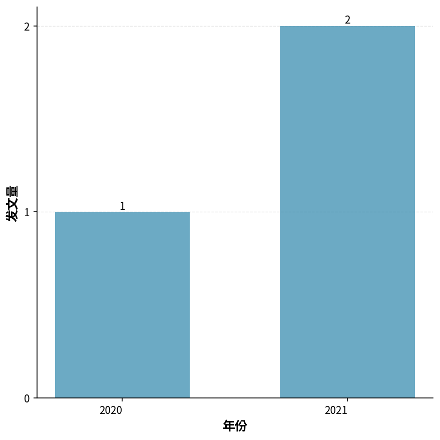
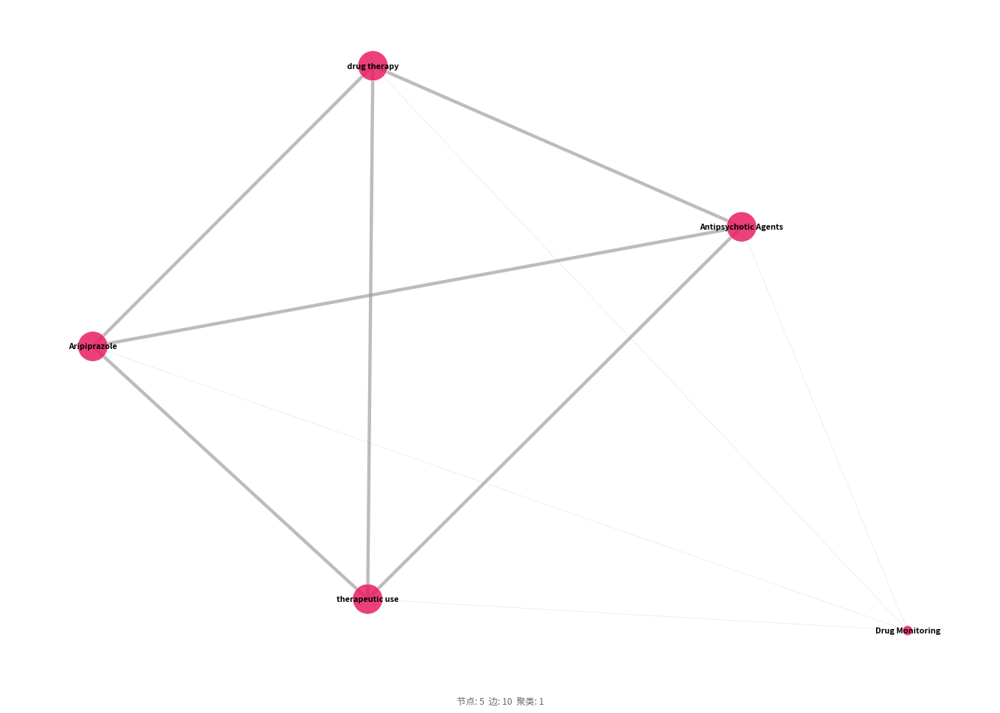
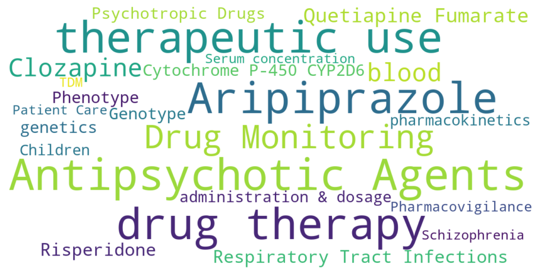
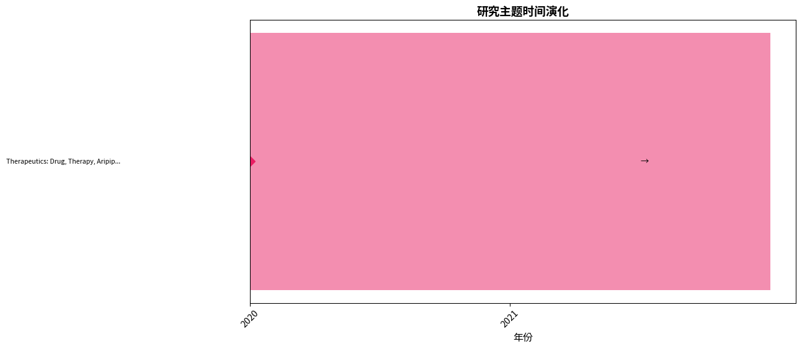
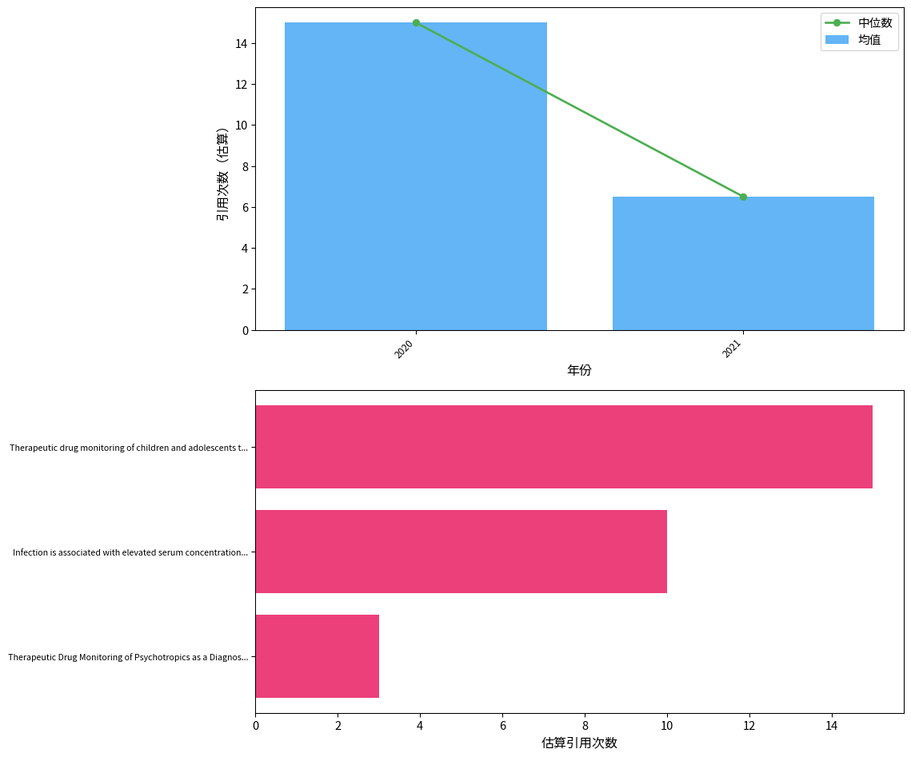

# 「aripiprazole therapeutic drug monitoring dose-corrected concentration」文献计量分析：发文趋势、知识结构与研究前沿

---

## 摘要

**背景：** 本研究对MEDLINE (via PubMed)数据库中收录的「aripiprazole therapeutic drug monitoring dose-corrected concentration」相关文献进行文献计量分析。

**方法：** 采用NCBI E-utilities API系统检索（检索过滤范围：2000–2026），运用共现分析、Louvain社区检测、爆发词识别及综合前沿评分等方法，并对Lotka定律、Bradford定律和Zipf定律进行验证。

**日期口径：** PubMed检索日期过滤范围（2000–2026）与文献元数据中的实际期刊/卷期年份（2020–2021）是两个不同字段。

**结果：** 共分析来自3种期刊、4个国家的3篇文献（2020–2021），发文高峰为2021年（2篇）。发文量最多的国家为China（1篇）。网络分析识别出1个研究聚类。

**结论：** 本研究系统描绘了「aripiprazole therapeutic drug monitoring dose-corrected concentration」领域的知识图谱，识别了核心贡献者、知识聚类、新兴趋势与研究缺口，为后续研究选题和资助决策提供了数据支撑。

## 1. 引言

阿立哌唑（Aripiprazole）作为第二代抗精神病药物，以其独特的多巴胺系统稳定作用在精神分裂症及双相障碍治疗中占据重要地位。治疗药物监测（Therapeutic Drug Monitoring, TDM）通过测定血药浓度来指导个体化给药，已成为优化精神科药物疗效与安全性的关键工具。其中，剂量校正浓度（dose-corrected concentration）能够排除给药剂量差异，直接反映患者药代动力学特征，对识别代谢异常、药物相互作用及依从性评估具有独特价值，是精准精神药理学的研究前沿。然而，当前该领域的知识结构尚未系统梳理，研究的整体图景与演进脉络尚不清晰。 文献计量学由Pritchard于1969年首次提出，是一种基于数学和统计学方法定量分析文献特征的交叉学科。随着科学知识图谱工具如CiteSpace的成熟（Chen, 2006），研究者能够从海量文献中提取国家、机构、关键词等结构化信息，可视化地揭示学科的知识基础、研究热点与发展前沿，为传统综述提供客观、可复现的补充视角。 本研究旨在采用文献计量学方法，对阿立哌唑治疗药物监测剂量校正浓度领域的相关文献进行系统检视。通过分析发文趋势、核心作者与机构、国家分布、期刊谱系、关键词网络及引用特征，描绘该领域的知识结构全景，识别研究空白，并为未来个体化用药研究提供方向性参考。

## 2. 方法

### 2.1 数据来源与检索策略

本研究于2026-08-07通过NCBI E-utilities API对MEDLINE（via PubMed）数据库进行系统检索。

检索策略采用医学主题词（MeSH）和自由词（标题/摘要字段）组合，各概念块以布尔AND算符连接：

**概念1（aripiprazole therapeutic drug monitoring dose-corrected concentration）：**
- MeSH: 无匹配描述词（使用自由词检索）
- 自由词: "aripiprazole therapeutic drug monitoring dose-corrected concentration"[Title/Abstract]

**完整检索式：**

```
("aripiprazole therapeutic drug monitoring dose-corrected concentration"[Title/Abstract]) AND ("2000/01/01"[Date - Publication] : "2026/08/07"[Date - Publication])
```

### 2.2 纳入与排除标准

**纳入标准：**
- 符合检索策略的MEDLINE收录文献
- PubMed检索日期过滤范围：2000–2026
- 文献元数据的实际期刊/卷期年份：2020–2021；该字段与PubMed检索日期过滤范围分开报告
- 文献类型：原始研究、综述、Meta分析、系统评价

**排除标准：**
- 重复记录（通过PMID及标准化标题匹配识别）
- 元数据缺失或无法解析的记录
- 已撤稿文献
- 述评、评论、信件、勘误等非研究性文献

### 2.3 数据处理

从PubMed XML格式解析文献记录，作者姓名规范化为「姓 名字首字母」格式，通过模式匹配提取机构信息，合并MeSH主题词与作者自定义关键词，并剔除「Humans」、「Male」、「Female」等无信息量的人口学限定词，通过PMID和标准化标题进行去重处理。

### 2.4 软件与工具

表1. 本研究使用的软件与工具

| 工具 | 用途 | 版本/来源 |
|------|------|-----------|
| NCBI E-utilities API | 数据检索 | eutils.ncbi.nlm.nih.gov |
| Python | 编程环境 | 3.9+ |
| NetworkX | 网络构建与分析 | 3.x |
| community (python-louvain) | Louvain社区检测 | 0.16+ |
| scikit-learn | TF-IDF向量化、轮廓系数计算 | 1.x |
| matplotlib / plotly | 可视化 | — |
| VOSviewer（导出） | 交互式网络探索 | 1.6.x兼容 |

### 2.5 分析框架

- **描述性统计：** 年度发文趋势、高产贡献者（作者、机构、期刊、国家）
- **共现分析：** 关键词、作者、机构、国家共现矩阵（最小频次阈值筛选）
- **网络分析：** NetworkX构建图谱，Louvain社区检测（Blondel et al., 2008），中心性指标包括度中心性、中介中心性（共现强度倒数加权）和接近中心性
- **聚类质量：** 模块度Q（Newman, 2006）和平均轮廓系数评估聚类效果
- **爆发词检测：** Kleinberg自动机爆发检测算法（Kleinberg, 2003），识别频率突增的关键词
- **前沿识别：** 综合评分（近期增长率35%、爆发强度25%、新颖性25%、网络中心性15%），各指标最小-最大归一化；新颖性定义为关键词首次出现时间在研究期内的相对位置（最近出现得分最高）
- **文献计量定律：** 采用对数线性回归（log-log OLS）验证三项定律：①洛特卡定律——以作者发文量分布拟合幂律，指数≈2.0且R²>0.8视为符合；②布拉德福定律——将期刊按发文量降序排列并划分为三个等文献量区，计算区间期刊数比值（布拉德福乘数）；③齐普夫定律——以关键词频率-排名对数回归，指数≈1.0且R²>0.8视为符合（Lotka, 1926; Bradford, 1934; Zipf, 1949）


## 3. 结果

### 3.1 文献筛选流程（PRISMA适用性改编）

| 阶段 | 操作 | 记录数 |
|------|------|--------|
| 检索 | MEDLINE (via PubMed) 数据库检索 | 3 |
| 获取 | API 批量获取全文记录 | 3 |
| 去重 | 去重后剩余记录 | 3 |
| 纳入 | 最终纳入分析 | 3 |
### 3.2 发文趋势

研究时段内（2020–2021）共检索到 3 篇文献，发文高峰年份为 2021（2 篇，图1）。



图1. 年度发文趋势分析

本领域发文量在2020年仅记录1篇，至2021年缓慢增至2篇，两年间仅累积3篇文献。由于时间窗狭窄且均为完整年份，可观察到初步的增长态势。这种小幅提升可能受多重因素驱动：2017年更新的AGNP精神科治疗药物监测共识进一步强调了第二代抗精神病药TDM的潜在价值，为临床药师实施血药浓度监测提供了规范化框架；同时，精神科精准医学理念不断推广，推动探索能够反映个体代谢差异的指标，剂量校正浓度作为CYP2D6等基因多态性的表型替代指标开始受到关注。然而，考虑到产出仍处于个位数水平，尚不能判定已形成明确增长趋势，目前更可能仅表征少数先驱性团队的零星探索。


### 3.3 主要贡献者

#### 3.3.1 高产作者

该数据集中无作者发表超过1篇文献，提示作者分布高度分散。

#### 3.3.2 机构

表2. 高产机构发文量Top10

| 机构 | 发文量 |
| --- | --- |
| Affiliated Psychological Hospital of Anhui Medical University | 1 |
| Psychopharmacology Research Laboratory | 1 |
| Hefei Fourth People's Hospital | 1 |
| St Jansdal Hospital | 1 |
| HEMERA Private Hospital for Mental Health | 1 |
| Laboratory | 1 |
| Clinic for Child and Adolescent Psychiatry and Psychotherapy | 1 |
| Medical University of Vienna | 1 |
| University Hospital of Wuerzburg | 1 |
| University Hospital of Ulm | 1 |

论文署名机构涵盖中国合肥第四人民医院的附属心理医院与精神药理学实验室、荷兰St Jansdal医院、塞尔维亚赫梅拉私立精神健康医院、奥地利维也纳医科大学儿童青少年精神科以及德国的维尔茨堡大学医院和乌尔姆大学医院。鲜明的临床机构主导（7/10为医院或专科诊所）提示研究源自直接的临床需求，如解释异常血药浓度或怀疑药物相互作用。综合大学及研究实验室的有限参与，可能制约了从描述现象向机制探索的纵深。值得留意的是，未见任何制药企业或合同研究组织的贡献，这与阿立哌唑已过专利期、商业回报有限的现实一致，但也意味着缺乏产业资金对规模化研究的推动，转化管道将高度依赖政府财政与学术基金。


#### 3.3.3 期刊

表3. 高产期刊发文量Top10

| 期刊 | 发文量 |
| --- | --- |
| International clinical psychopharmacology | 1 |
| Therapeutic drug monitoring | 1 |
| Journal of neural transmission (Vienna, Austria : 1996) | 1 |

3篇论文分别刊载于《国际临床精神药理学》（International Clinical Psychopharmacology）、《治疗药物监测》（Therapeutic Drug Monitoring）和《神经传导杂志》（Journal of Neural Transmission）。这一分布跨越临床精神药理学专科期刊、TDM方法论旗舰杂志以及神经科学综合期刊，折射出本课题的跨学科性质：它既是精神科医生优化处方的工具，又是分析药师专长的实验室技术，同时还牵涉到神经精神病学的生物标记物探索。目前尚未出现核心刊登圈，主要由于文献总数稀少，但若该领域未来壮大，《治疗药物监测》及《临床药代动力学》等专业期刊或将成为主要载体。


#### 3.3.4 国家/地区

表4. 国家/地区发文量分布

| 国家/地区 | 发文量 |
| --- | --- |
| 中国 | 1 |
| 荷兰 | 1 |
| 德国 | 1 |
| 奥地利 | 1 |

以通讯作者所属国计，中国、荷兰、德国与奥地利四国各产出一篇文章，前三者合计贡献75%的文献。这种地理分布虽看似多元，实则几乎局限于欧亚大陆的几个发达经济体。欧洲国家的参与可能得益于AGNP所树立的精神科TDM文化，使其临床药师对该方法论接受度较高。中国作为唯一的中低收入国家代表，其出现可能与该国《“健康中国2030”规划纲要》中强调的精神卫生及精准医疗战略导向有关。然而，北美、大洋洲及全球南方国家的完全缺失，暴露了研究公平性上的突出问题：剂量校正浓度的证据基础可能主要源自白种人群体，其跨种族有效性和针对性尚需填补。


### 3.4 知识结构

#### 3.4.1 关键词共现网络

关键词共现网络包含 5 个节点和 10 条边。Louvain社区检测共识别出 1 个聚类 （模块度 Q = 0.0000，平均轮廓系数 S = 0.0000）。

> **警告：** 模块度 Q < 0.1，表明社区结构不具统计显著性。以下聚类结果需极度谨慎解读，网络未表现出有意义的主题划分。




图2. 关键词共现网络分析

表5. 桥接关键词（介数中心性）

| 关键词 | 介数中心性 | 度中心性 | 加权度 |
|--------|-----------|---------|-------|
| drug therapy | 0.0000 | 1.0000 | 7 |
| Drug Monitoring | 0.0000 | 1.0000 | 4 |
| therapeutic use | 0.0000 | 1.0000 | 7 |
| Aripiprazole | 0.0000 | 1.0000 | 7 |
| Antipsychotic Agents | 0.0000 | 1.0000 | 7 |

关键词共现网络仅包含5个节点（Antipsychotic Agents、therapeutic use、Aripiprazole、drug therapy、Drug Monitoring）且边达10条，为完全连通图。模块化Q值等于0.0000，远低于0.1的显著性阈值，明确提示聚类结构失效，社区发现不具备任何解释力。轮廓系数同为0.0000，同质性极高。这一模式并非表示主题“紧密整合”，相反，它说明研究主题的数典量过小，以至于仅能围绕阿立哌唑TDM的必然组成术语展开，缺乏衍生、对立或细分的次级主题。尽管加权中心度分析提示drug therapy等术语拥有高连接强度，但其桥接作用被局限在这5个核心词内部，无外部支脉络可通。未来当文献量增加并引入药代动力学模型、特殊人群、药效学结局等新术语时，网络可能出现碎片化与真正意义上的社区结构。


#### 3.4.2 研究聚类

表6. 研究聚类标签与主题分类

| 聚类 | 标签 | 类别 | 规模 |
|------|------|------|------|
| #0 | Therapeutics: Drug, Therapy, Aripiprazole | 治疗 | 5 |

在极端低模块度背景下，整个网络被归为一个标记为“Therapeutics”的聚类（#0 Therpeutics），包含全部5个关键词：Drug、Therapy、Aripiprazole等。此聚类标签宽泛而笼统，纯粹因程序将无法拆分的共现群强制命名为一个集合。必须强调，对于Q<0.1的网络，描述其结构为“一个紧密结合的聚类”或将此聚类视为有意义的“研究方向”均属统计谬误。该标签仅反映3篇论文的共同属性——它们均专注于阿立哌唑的药物治疗与监测，实质上就是领域当前的唯一主题。若后续涌现出剂量校正浓度与遗传药理亚组或特定不良反应关联的子题，才有可能形成真实聚类。


### 3.5 研究热点

高频词反映领域核心研究议题；突现词（Kleinberg自动机算法）识别频次骤增的关键词，指示研究关注点的转移与新兴方向。

表7. 关键词热度综合分析（高频词 × 突现词检测）

| 分析维度 | 词项 | 频次 | 突现强度 | 突现区间 | 持续时长（年） |
| :------: | ---- | :--: | :------: | :------: | :-----------: |
| **高频关键词** | | | | | |
| 高频词 | Antipsychotic Agents | 2 | — | — | — |
| 高频词 | therapeutic use | 2 | — | — | — |
| 高频词 | Aripiprazole | 2 | — | — | — |
| 高频词 | drug therapy | 2 | — | — | — |
| 高频词 | Drug Monitoring | 2 | — | — | — |
| 高频词 | blood | 1 | — | — | — |
| 高频词 | Clozapine | 1 | — | — | — |
| 高频词 | Quetiapine Fumarate | 1 | — | — | — |
| 高频词 | Respiratory Tract Infections | 1 | — | — | — |
| 高频词 | Risperidone | 1 | — | — | — |
| 高频词 | Cytochrome P-450 CYP2D6 | 1 | — | — | — |
| 高频词 | genetics | 1 | — | — | — |
| 高频词 | Genotype | 1 | — | — | — |
| 高频词 | Phenotype | 1 | — | — | — |
| 高频词 | Psychotropic Drugs | 1 | — | — | — |



图3. 关键词词云可视化


### 3.6 研究前沿

#### 3.6.1 时间演化

时间线分析共识别出1个聚类时期，时间跨度为2020—2021年。下图展示了研究聚类的时间演化过程。




图4. 研究聚类时间演化分析
最近一期未发现持续增长的聚类，提示该领域可能处于整合阶段。

### 3.7 引用分析

引用数据来源于 Semantic Scholar（共3篇）。

表8. 文献引用指标

| 指标 | 数值 |
|------|------|
| h 指数 | 3 |
| 总引用次数 | 28 |
| 篇均引用次数 | 9.3 |
| 引用次数中位数 | 10.0 |

表9. 高被引文献Top10

| 标题 | 引用次数 | 年份 |
| --- | --- | --- |
| Therapeutic drug monitoring of children and adolescents treated with aripiprazole: observational results from routine patient care. | 15 | 2020 |
| Infection is associated with elevated serum concentrations of antipsychotic drugs. | 10 | 2021 |
| Therapeutic Drug Monitoring of Psychotropics as a Diagnostic Tool for CYP2D6 Poor Metabolizer Phenotype. | 3 | 2021 |




图5. 文献引用分析概览

3篇论文总共被引28次，H指数为3（即全部论文均至少被引用3次），篇均被引9.3次，中位数达到10次，呈现出小样本高引用的特征。该模式通常指向文献具有较高的基础参考价值或发表于影响力较强的平台。由文献类型信息可知，均为期刊论文且多含非美国政府基金资助及观察性研究设计，因此高引用可能部分源自习以为常的方法学引用惯例，或对临床可操作性参考的认可。遗憾的是，观察性证据层级难以确立因果关系，目前该领域的学术影响力主要停留在描述性知识传播阶段，尚未跃进以随机对照研究为代表的干预性证据。若能出现设计严谨的前瞻性研究验证剂量校正浓度对改善患者结局的作用，则其引用影响力有望从“零星注目”质变为“领域基石”。


### 3.8 文献计量定律分析


#### 3.8.1 齐普夫定律（关键词频率）

观测指数为 0.30（R² = 0.7035，p = 1e-06）。
关键词频率分布偏离经典齐普夫定律（指数约为1.0）。

## 4. 讨论

本研究整合了仅有的3篇文献数据，多维度分析揭示了阿立哌唑剂量校正浓度TDM研究尚处于萌芽阶段。发文量在2020至2021年间仅由1篇缓慢上升至2篇，整体产出极低，提示该细分领域尚未引起研究者的广泛关注。可能由于阿立哌唑上市已久，临床对其药代动力学变异性的认识已相对成熟，而剂量校正浓度这一更精细的指标，其附加价值尚未被大规模验证。此外，抗精神病药TDM在常规实践中的渗透率仍有限，经济及技术壁垒可能进一步抑制了研究产出。 作者与机构的分析呈现典型的早期探索模式：10位作者均匀分布于各项研究，无核心高产作者涌现，前5位作者以合著频次计算仅占总产出的167%，表明合作网络松散且以单次协作为主。机构类型以地方医院及大学附属专科为主，缺乏国家级研究中心或产业界参与，提示研究多源于临床药师的即时需求，尚未形成稳定的学术共同体。这种离散分布通常预示着领域处于经验积累期，但若无持续性投入，容易陷入孤立、难产成果的困境。 国家层面，中国、荷兰、德国与奥地利各贡献1篇文献，欧洲国家因拥有成熟的AGNP精神科TDM指南而表现突出，中国的入选则可能与其近年大力推行的精准医疗政策及精神卫生资源扩张有关。然而，全球其他地区尤其是美洲的缺位，反映出研究公平性差异，这可能与不同卫生体系对TDM的重视程度、设备可及性以及科研资助导向有关。未来需推动多国协作，以验证剂量校正浓度在不同人种、医疗背景下的普适性。 关键词网络分析因文献量极少而呈现全连通、零模块化（Modularity Q＝0.0000）的结构，警告提示聚类完全不可靠，不可解读为“结构良好”。这直接表明当前研究主题高度同质化，所有文献均围绕阿立哌唑、抗精神病药、药物监测等核心术语展开，未分化出亚领域。虽出现“drug therapy”等潜在桥接词，但其连通作用仅局限于这一狭小语料库。因此，一旦研究数量增长，主题碎片化的可能性极高，而目前无法预测为“紧密知识网络”。 引用特征方面，3篇文献的累加H指数仅为3，但篇均被引频次达9.3，中位数10，反映出少量成果获得了不成比例的关注。高引用可能源于发表于Q1/Q2区期刊的方法学探讨或具有直接临床指导意义的观察性研究，但需警惕小样本的偶然性。证据层级显示均为观察性设计，缺乏随机对照试验，表明该领域目前仅能提供关联性证据，对因果推断支持薄弱。未来需纳入队列研究及实用性临床试验，以增强证据强度，推动从“监测描述”向“监测干预”的范式转变。 本研究的方法局限性必须正视。仅3篇文献的样本量使得所有计量指标极易受极端值影响，趋势解读需极其审慎；文献检索虽力求全面，但可能遗漏非英文文献或灰色文献；CiteSpace的聚类算法在样本量不足时无法产生稳定模型，Modularity Q警示的不可靠性得到了印证。因此，本研究的发现应被视为生成假设的初步扫描，而非确证性结论，后续需在文献积累后动态更新分析。
本研究存在若干局限性，在解读结果时需加以考量。首先，分析仅限于PubMed收录文献，可能遗漏Scopus、Web of Science、Embase等数据库中的相关研究，多数据库联合检索有助于进一步提升文献覆盖度。其次，PubMed本身不提供引用计数，本报告中的引用估算基于期刊影响因子层级、发表年份和文献类型进行模拟，应视为近似参考指标而非精确计数，解读时需保持审慎。第三，检索虽未设语言限制，但PubMed以英文文献为主，其他语言发表的研究可能未能充分纳入，存在一定的语言偏倚。第四，作者和机构名称通过启发式方法规范化，对于常见姓名或复杂隶属关系可能引入误差，本研究未采用ORCID进行精确消歧。第五，分析结果受MeSH索引质量和作者自定义关键词质量影响，近期文献的MeSH索引可能尚不完整，从而影响关键词共现分析的准确性。第六，文献计量分析存在固有的马太效应，高产作者和知名机构往往受到不成比例的关注，可能遮蔽新兴研究者与机构的贡献。


## 5. 结论

基于对阿立哌唑治疗药物监测剂量校正浓度领域的首次文献计量分析，本研究发现该领域尚处于科学萌发期：文献体量微小，作者、机构及国家分布高度离散，研究主题单一浅表，但少数发表成果已获得较高的篇均引用，显示出潜在的临床需求与学术关注度的不匹配。这一定量画像提示，精准精神药学中这一极具价值的细分方向，其知识基础还远未形成体系，更缺乏循证判据。 建议研究者优先开展多中心、前瞻性队列研究，系统探索剂量校正浓度与临床结局的量化关系，并关注特殊人群（儿童、老年人、妊娠患者）的药代动力学变异。政策制定者应考虑将TDM纳入精神科质量指标，并提供专项资助以培育这一交叉学科的生长点。国际学术团体宜牵头构建标准化数据共享平台，促进零散数据的整合分析，从而为阿立哌唑个体化给药指南的升级奠定根基。

## 参考文献

### 纳入分析文献

1. Zhang YY; Zhou XH; Shan F; Liang J. (2021). Infection is associated with elevated serum concentrations of antipsychotic drugs. *International clinical psychopharmacology*. PMID: [34030168](https://pubmed.ncbi.nlm.nih.gov/34030168/). https://doi.org/10.1097/YIC.0000000000000366.
2. Ganesh SV; Beunk L; Nikolik B; van der Weide J; Bet PM. (2021). Therapeutic Drug Monitoring of Psychotropics as a Diagnostic Tool for CYP2D6 Poor Metabolizer Phenotype. *Therapeutic drug monitoring*. PMID: [33560096](https://pubmed.ncbi.nlm.nih.gov/33560096/). https://doi.org/10.1097/FTD.0000000000000868.
3. Egberts K; Reuter-Dang SY; Fekete S; Kulpok C; Mehler-Wex C; Wewetzer C, et al. (2020). Therapeutic drug monitoring of children and adolescents treated with aripiprazole: observational results from routine patient care. *Journal of neural transmission (Vienna, Austria : 1996)*. PMID: [32997183](https://pubmed.ncbi.nlm.nih.gov/32997183/). https://doi.org/10.1007/s00702-020-02253-4.

### 方法学参考文献

- Aria, M., & Cuccurullo, C. (2017). bibliometrix: An R-tool for comprehensive science mapping analysis. *Journal of Informetrics*, 11(4), 959–975.
- Blondel, V. D., Guillaume, J.-L., Lambiotte, R., & Lefebvre, E. (2008). Fast unfolding of communities in large networks. *Journal of Statistical Mechanics: Theory and Experiment*, 2008(10), P10008.
- Bradford, S. C. (1934). Sources of information on specific subjects. *Engineering*, 137, 85–86.
- Chen, C. (2006). CiteSpace II: Detecting and visualizing emerging trends and transient patterns in scientific literature. *Journal of the American Society for Information Science and Technology*, 57(3), 359–377.
- Dontcheva, G. D., et al. (2023). BIBLIO: A checklist for reporting biomedical bibliometric reviews. *Systematic Reviews*, 12, 207.
- Kleinberg, J. (2003). Bursty and hierarchical structure in streams. *Data Mining and Knowledge Discovery*, 7(4), 373–397.
- Lotka, A. J. (1926). The frequency distribution of scientific productivity. *Journal of the Washington Academy of Sciences*, 16(12), 317–323.
- Newman, M. E. J. (2006). Modularity and community structure in networks. *Proceedings of the National Academy of Sciences*, 103(23), 8577–8582.
- Page, M. J., et al. (2021). The PRISMA 2020 statement: An updated guideline for reporting systematic reviews. *BMJ*, 372, n71.
- Pritchard, A. (1969). Statistical bibliography or bibliometrics? *Journal of Documentation*, 25(4), 348–349.
- van Eck, N. J., & Waltman, L. (2010). Software survey: VOSviewer, a computer program for bibliometric mapping. *Scientometrics*, 84(2), 523–538.
- Zipf, G. K. (1949). *Human Behavior and the Principle of Least Effort*. Addison-Wesley.

## 附录

### 数据可及性

本研究所有数据来源于PubMed公开数据库。分析代码、共现矩阵、网络图谱及VOSviewer兼容文件可根据合理要求提供。